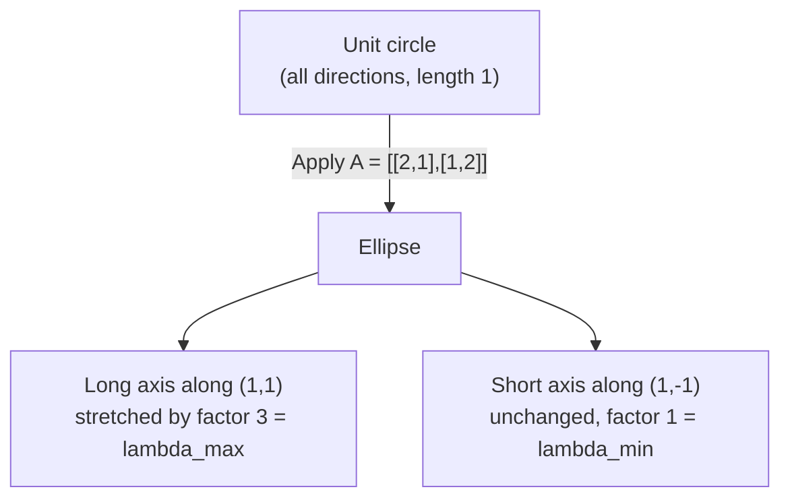
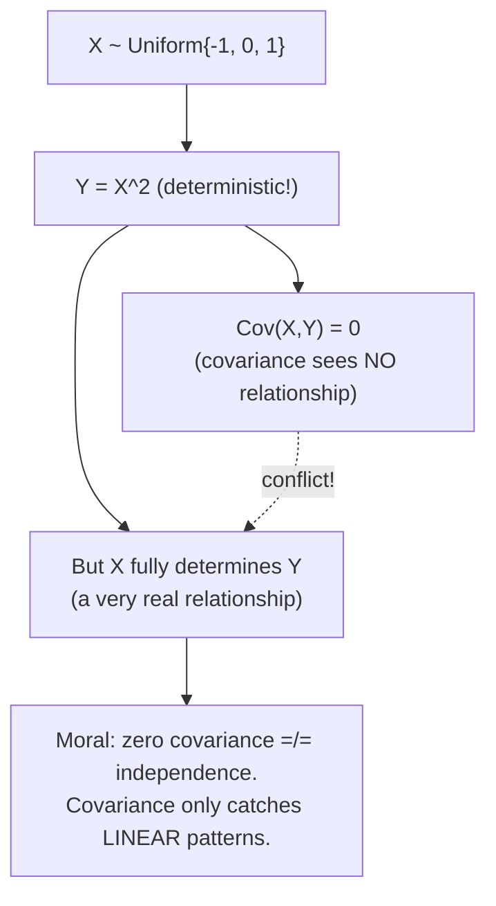
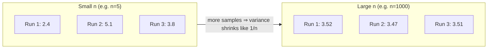

## 3. Linear Algebra Essentials

### 3.1 Vectors, norms, and inner products

For vectors $x, y \in \mathbb{R}^n$:

$$
\|x\|_2 = \sqrt{\sum_{i=1}^n x_i^2}, \qquad \langle x, y \rangle = x^T y = \sum_{i=1}^n x_i y_i= \|x\|_2 \|y\|_2 \cos\theta
$$

Two vectors are called **orthogonal** (perpendicular) exactly when $\langle x, y \rangle = 0$, because $\cos(90^\circ) = 0$.

#### Worked example: norms and angles

Take $x = (3, 4)$ and $y = (4, 3)$ in $\mathbb{R}^2$.

$$
\|x\|_2 = \sqrt{9 + 16} = 5, \qquad \|y\|_2 = \sqrt{16 + 9} = 5
$$

$$
\langle x, y \rangle = 3 \cdot 4 + 4 \cdot 3 = 24
$$

$$
\cos\theta = \frac{24}{5 \cdot 5} = 0.96 \implies \theta \approx 16.3^\circ
$$

Since $\cos\theta$ is close to $1$, the vectors are nearly parallel (a small angle between them). This matches the picture: $(3,4)$ and $(4,3)$ are mirror images across the line $y = x$, so they point in almost the same direction.

### 3.2 The Cauchy–Schwarz inequality

> **Theorem.** For $x, y \in \mathbb{R}^n$,
> $$|\langle x, y \rangle| \le \|x\|_2 \|y\|_2$$

**Proof sketch.** For any $t \in \mathbb{R}$, $\|x - ty\|_2^2 \ge 0$ (a squared norm can never be negative). Expanding this and choosing the value of $t$ that minimizes the resulting quadratic in $t$ — namely $t = \langle x,y\rangle / \|y\|_2^2$ — gives the inequality after simplification.

### 3.3 Matrices as linear maps

A matrix $A \in \mathbb{R}^{m \times n}$ is not just a grid of numbers — it defines a **linear map** $\mathbb{R}^n \to \mathbb{R}^m$, sending $x \mapsto Ax$. This is the perspective the whole course uses: a matrix *does something* to vectors (rotates them, stretches them, projects them), rather than just storing numbers.

- **Rank:** the dimension of the column space of $A$, which equals the dimension of the row space. Intuitively, rank measures "how many independent directions" the matrix's output can actually reach.
- **Symmetric:** $A$ is symmetric if $A = A^T$ (only defined when $A$ is square).
- **Orthogonal:** $A$ is orthogonal if $A^T A = I$. Orthogonal matrices preserve lengths and angles: $\|Ax\|_2 = \|x\|_2$ for every $x$. Geometrically, an orthogonal matrix is a pure rotation and/or reflection — it never stretches or shrinks anything.

### 3.4 Eigenvalues and eigenvectors

A nonzero vector $v$ is an **eigenvector** of $A$ with **eigenvalue** $\lambda$ if

$$
Av = \lambda v
$$

**In plain terms:** normally, multiplying a vector by a matrix changes both its length and its direction. An eigenvector is special: multiplying it by $A$ only rescales it (by the factor $\lambda$) — the direction stays exactly the same (or flips, if $\lambda < 0$).

Eigenvalues are found as the roots of the **characteristic polynomial**:

$$
\det(A - \lambda I) = 0
$$

#### Worked example

Let $A = \begin{pmatrix} 2 & 1 \\ 1 & 2 \end{pmatrix}$.

$$
\det(A - \lambda I) = (2-\lambda)^2 - 1 = 0 \implies \lambda = 1, 3
$$

Solving for the eigenvectors:
- $\lambda = 1 \implies v = (1, -1)^T$
- $\lambda = 3 \implies v = (1, 1)^T$

**Seeing it geometrically:** $A$ maps the unit circle to an ellipse. Along the direction $(1,1)$, vectors are stretched by a factor of $3$; along the direction $(1,-1)$, vectors are left completely unchanged (eigenvalue $1$). The eigenvector directions are exactly the directions that $A$ does *not* rotate — everything else gets rotated toward the dominant eigenvector direction.

### 3.5 Symmetric matrices: the Spectral Theorem

> **Theorem (Spectral Theorem).** If $A \in \mathbb{R}^{n \times n}$ is symmetric, then $A$ has $n$ real eigenvalues $\lambda_1, \dots, \lambda_n$ and an orthonormal basis of eigenvectors $v_1, \dots, v_n$, so
> $$A = \sum_{i=1}^n \lambda_i v_i v_i^T$$

This formula can be derived from $Av = \lambda v$, just multiple both sides by $v^T$.

**In plain terms:** any symmetric matrix can be completely broken down into a sum of simple "rank-one" building blocks $v_i v_i^T$ (each one just an outer product of an eigenvector with itself), weighted by the corresponding eigenvalues. This is a much stronger and more useful fact than it might look at first: it says a potentially complicated matrix is secretly just a weighted combination of very simple pieces, and the pieces are mutually orthogonal (they don't interfere with each other).

### 3.6 Matrix norms

Two ways to measure the "size" of a matrix:

**Frobenius norm** (treats the matrix as one long vector of entries and takes its length):

$$
\|A\|_F = \sqrt{\sum_{i,j} A_{ij}^2}
$$

**Operator (spectral) norm** (the maximum stretching factor $A$ can apply to any unit vector):

$$
\|A\|_2 = \max_{x \ne 0} \frac{\|Ax\|_2}{\|x\|_2}
$$

For a symmetric matrix, the operator norm has a clean formula in terms of eigenvalues:

$$
\|A\|_2 = \max_i |\lambda_i|
$$

For a general (non-square) matrix, the analogous statement uses **singular values** instead of eigenvalues — this is exactly where SVD comes from in Week 4.

#### Worked example

For $A = \begin{pmatrix}2&1\\1&2\end{pmatrix}$ (eigenvalues $1, 3$):

$$
\|A\|_F = \sqrt{4+1+1+4} = \sqrt{10} \approx 3.16, \qquad \|A\|_2 = \max(|1|,|3|) = 3
$$

Notice $\|A\|_2 \le \|A\|_F$ always holds — the operator norm only looks at the single worst-case direction, while the Frobenius norm accounts for everything.

---

## 4. Probability Essentials

### 4.1 Random variables and expectation

A random variable $X$ maps outcomes of some random experiment to real numbers. Its **expectation** (mean) is

$$
E[X] = \sum_x x \cdot P(X = x) \quad \text{(discrete)}, \qquad \text{or} \qquad E[X] = \int x f(x)\, dx \quad \text{(continuous)}
$$

> **Theorem (Linearity of Expectation).** For any $X, Y$ (not necessarily independent!) and constants $a, b$,
> $$E[aX + bY] = aE[X] + bE[Y]$$

**Why this matters so much:** this is one of the most useful facts in all of probability precisely *because* it needs no independence assumption. You can always split a complicated random quantity into a sum of simpler pieces, take expectations of each piece separately, and add the results — regardless of how the pieces depend on each other.

**Proof.** This follows directly from linearity of sums (or integrals) — no independence needed at any step.

### 4.2 Variance and covariance

$$
\text{Var}(X) = E[(X - E[X])^2] = E[X^2] - (E[X])^2
$$

$$
\text{Cov}(X, Y) = E[(X - E[X])(Y - E[Y])] = E[XY] - E[X]E[Y]
$$

**In plain terms:** variance measures how spread out $X$ is around its mean. Covariance measures whether two variables tend to move together (positive covariance), move oppositely (negative covariance), or show no linear tendency either way (zero covariance).

#### Worked example: a fair die

Let $X \sim \text{Uniform}\{1, \dots, 6\}$ (one roll of a fair die).

$$
E[X] = 3.5, \qquad E[X^2] = \frac{1}{6}(1+4+9+16+25+36) = \frac{91}{6}
$$

$$
\implies \text{Var}(X) = \frac{91}{6} - 3.5^2 \approx 2.92
$$

### 4.3 Independence

$X$ and $Y$ are **independent** if $P(X=x, Y=y) = P(X=x)P(Y=y)$ for all $x, y$ — knowing the value of one tells you nothing about the other.

Key consequences:
- If $X, Y$ are independent: $E[XY] = E[X]E[Y]$, and therefore $\text{Cov}(X,Y) = 0$.
- **Caution — this does not reverse!** $\text{Cov}(X,Y) = 0$ does **not** imply independence in general. (See the worked example below — this is a genuinely important trap.)
- If $X_1, \dots, X_n$ are independent: $\text{Var}\left(\sum_i X_i\right) = \sum_i \text{Var}(X_i)$ — variances add up for independent variables (they do *not* add up in general without independence).

#### Worked example: uncorrelated but not independent

Let $X$ be uniform on $\{-1, 0, 1\}$, and let $Y = X^2$ (so $Y$ is a completely deterministic function of $X$ — about as *dependent* as two variables can possibly be).

$$
E[X] = 0, \qquad E[XY] = E[X^3] = \frac{1}{3}(-1 + 0 + 1) = 0
$$

$$
\implies \text{Cov}(X,Y) = E[XY] - E[X]E[Y] = 0
$$

But $Y$ is a deterministic function of $X$! We can see the dependence directly:

$$
P(X=1, Y=0) = 0 \ne P(X=1)\,P(Y=0) = \frac13 \cdot \frac13
$$

**Moral:** covariance only detects *linear* relationships. Here $Y = X^2$ is a perfectly real, perfectly strong relationship — it's just not a linear one, so covariance is blind to it.

### 4.4 Concentration preview: why averages behave

Let $X_1, \dots, X_n$ be i.i.d. (independent, identically distributed) with mean $\mu$, and let $\bar X = \frac1n \sum_i X_i$ be their average.

$$
E[\bar X] = \mu, \qquad \text{Var}(\bar X) = \frac{\text{Var}(X_1)}{n} \to 0 \text{ as } n \to \infty
$$

This says the average of many i.i.d. samples has the right expected value, and its spread shrinks as you collect more samples — which is *why* averaging works as a way to estimate an unknown mean.

**The open question this raises:** how quickly does $\bar X$ concentrate around $\mu$, and how do we bound the probability of seeing a large deviation from $\mu$?

**Answer (coming in Week 3):** Markov, Chebyshev, and Chernoff bounds. These are described as **the single most-reused tool in the entire course** — worth flagging clearly, since so much of Units 1 and 2 (volume concentration, the Gaussian Annulus theorem, JL, phase transitions in random graphs) all ultimately reduce to a concentration-of-measure argument of this flavor.

#### Seeing concentration: rolling a die

If you track the running average $\bar X_n$ of many independent fair-die rolls across five separate simulated runs:

- Early on (small $n$), the five running averages are scattered all over the range $[1,6]$.
- By $n = 1000$, every single run has settled in tightly around $\mu = 3.5$.

*How fast* the spread shrinks, and with what probability guarantee, is exactly what Week 3's concentration bounds will make precise.

---

## 5. Summary

**Course overview:**
1. Three units — high-dimensional geometry/SVD, graphs/clustering, massive-data algorithms — all repeating the same three ideas (concentration, dominant eigenstructure, low-rank/sparse structure) on different objects.
2. Evaluation: $35\%$ take-home quizzes (MOOC-standard) + $25\%$ mid-sem + $40\%$ comprehensive (both open book, no devices).
3. Every topic maps to a still-in-use paper/system: FAISS, LoRA, UMAP, node2vec, PageRank, vLLM, H2O, BERTopic, and more.
4. Exams test reasoning on new variants of familiar results, not rote recall.

**Linear algebra:**
1. Norms, inner products, Cauchy–Schwarz.
2. Eigenvalues/eigenvectors; the Spectral Theorem for symmetric matrices.
3. Matrix norms (Frobenius, operator).

**Probability:**
1. Expectation (linear, unconditionally), variance, covariance.
2. Independence — and the crucial fact that zero covariance does not imply independence.

---

## 6. What's next?

Chapter 2 of the textbook: **High-Dimensional Space** — volume concentration, the Gaussian annulus, and the Johnson–Lindenstrauss lemma. This is covered in full in the companion note **FDS-Week2-HighDimensionalSpace-JL.md**.
