## 1. Motivation: approximate nearest-neighbour search at scale

**Setting:** modern vector databases store $10^8$ to $10^9$ embedding vectors (for example, from LLM or vision encoders), each living in $d \sim 10^2$ to $10^3$ dimensions.

**Task:** given a query vector $x$, find its nearest neighbours by $\ell_2$ (Euclidean) distance — *exactly*, if that's affordable, or *approximately*, if it isn't.

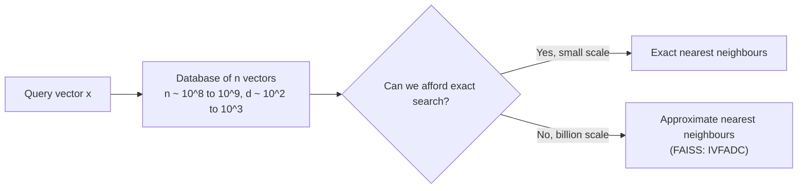

---

## 2. The naive baseline: exact search

Given a database $y_0, \dots, y_{\ell-1} \in \mathbb{R}^d$ and a query $x$: return the $m$ smallest values of $\{\|x-y_i\|_2\}_{i=0}^{\ell-1}$.

### 2.1 The key algebraic trick

$$
\|x - y_i\|_2^2 = \|x\|^2 + \|y_i\|^2 - 2\langle x, y_i\rangle
$$

- The $\|y_i\|^2$ terms can be **precomputed once**, ahead of time, since they don't depend on the query.
- The cross term $\langle x, y_i \rangle$, for *all* $i$ at once, is a single matrix multiplication ($XY^T$, batched over many queries at once) — a **GEMM** (General Matrix Multiply), which is exactly the operation GPUs are fastest at.

### 2.2 Two-step cost breakdown

**Step 1 (GEMM):** $O(\ell d)$ multiply-adds — one dot product per database vector, each costing $d$ multiply-adds.

**Step 2 ($m$-selection):** finding the smallest $m$ values is *not* done via a full sort of everything (which would cost $O(\ell\log\ell)$). Instead, a size-$m$ max-heap suffices: scan the $\ell$ distances once, push each candidate into the heap, and pop the current maximum whenever the heap exceeds $m$ elements. This costs $O(\ell\log m)$.

**Why step 1 dominates:** in practice $d \sim 10^2$–$10^3$ but $m \sim 10$–$100$, so $\log m < 7 \ll d$. Total cost:

$$
O(\ell d + \ell\log m) = O(\ell d)
$$

**The scale problem:** with $\ell = 10^9$ and $d \sim 10^3$, this is roughly $10^{12}$ multiply-adds *per query* — and there is typically a whole stream of queries to answer. (For calibration: the FAISS paper's own reported number for the much smaller SIFT1M benchmark — $\ell = 10^6$, $d=128$, $n_q = 10^4$ queries — is $1.28$ Top (tera-operations) taking under 1 second on a single Maxwell Titan X GPU. Exact search is genuinely fine at *that* scale; the problem is purely one of scale.)

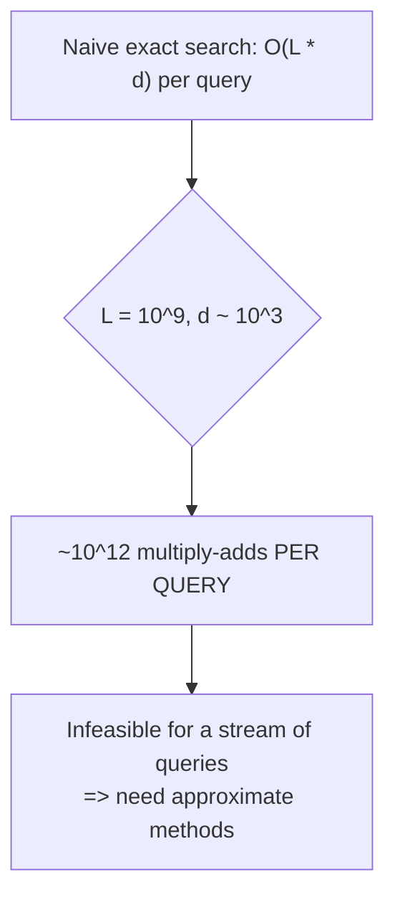

---

## 3. The IVFADC objective

FAISS's core method is called **IVFADC** (Inverted File with Asymmetric Distance Computation). It is built from a **two-level quantization** scheme.

### 3.1 Two-level quantization

$$
q(y) = q_1(y) + q_2\big(y - q_1(y)\big)
$$

**In plain terms:** rather than storing $y$ exactly, first approximate it coarsely with $q_1(y)$ (a "coarse quantizer"), then separately approximate the *leftover error* (the residual) $y - q_1(y)$ with a second quantizer $q_2$. This two-stage idea — approximate roughly first, then approximate the error of that approximation — is the central trick behind the whole method.

### 3.2 The successive approximations to the search objective

**Approximation to the original ($m$-nearest search)**, replacing exact $y$ with its quantized version $q(y)$:

$$
L_{ADC}(x) = m\text{-}\arg\min_{y \in Y} \|x - q(y)\|_2
$$

**Restriction to the $\tau$ nearest clusters** (don't scan the whole database — only the parts likely to contain the answer):

$$
L_{IVF} = \tau\text{-}\arg\min_{c \in C_1} \|x - c\|_2
$$

**Putting both restrictions together — the full IVFADC objective:**

$$
L_{IVFADC}(x) = m\text{-}\arg\min_{y \in \bigcup_{c\in L_{IVF}} I_c} \|x - q(y)\|_2
$$

This says: look only inside the inverted lists $I_c$ belonging to the $\tau$ nearest coarse centroids, and within those, score candidates using the quantized (compressed) representation $q(y)$, not the raw vector $y$.

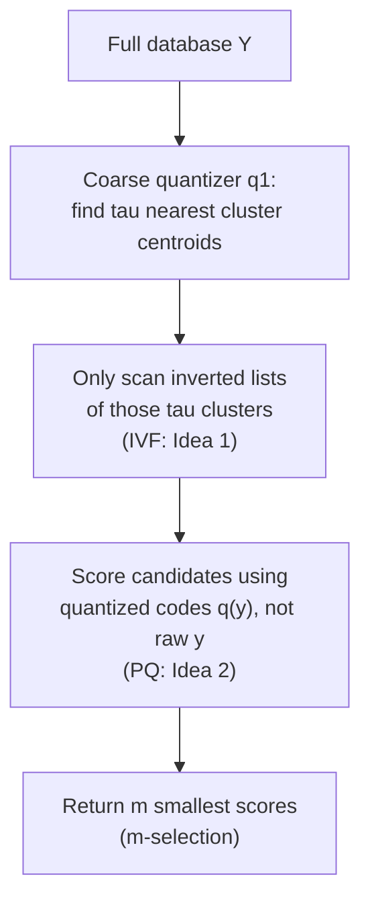

---

## 4. Idea 1: Inverted Lists (IVF)

### 4.1 The coarse quantizer and Voronoi partition

The coarse quantizer $q_1 : \mathbb{R}^d \to C_1$ has $|C_1| \approx \sqrt\ell$ centroids, trained by **k-means** — this partitions $\mathbb{R}^d$ into a **Voronoi diagram** (each centroid "owns" the region of space closest to it).

Every database vector $y_i$ is assigned to its nearest centroid $q_1(y_i)$; all vectors sharing a centroid together form one **inverted list**.

**At query time:** find the $\tau$ ("nprobe") closest centroids to $x$ — this is cheap, requiring only $|C_1| \approx \sqrt\ell$ comparisons, costing $O(\sqrt\ell\, d)$ — then scan *only* those $\tau$ inverted lists (roughly $\tau\sqrt\ell$ vectors total, assuming the lists are reasonably balanced in size), instead of scanning all $\ell$ vectors.

**The first speed/accuracy knob:** increasing $\tau$ gives higher recall (more likely to find the true nearest neighbour) but also means more scanning (slower).

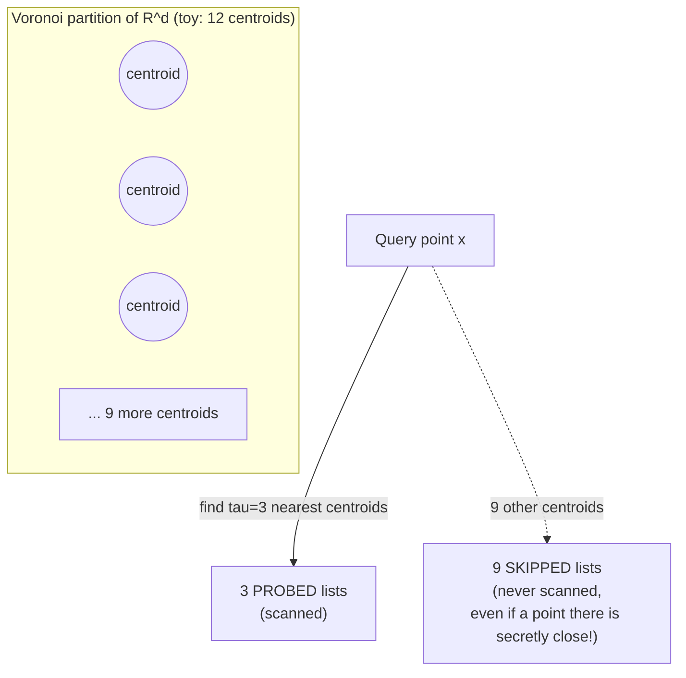

**Important nuance directly from the lecture:** even a point that happens to be very close to the query, but which lives in one of the *skipped* (unprobed) cells, is never found. This is the fundamental source of IVF's approximation error — it is a real, permanent trade-off, not a bug.

### 4.2 Why $\sqrt\ell$ centroids specifically?

There are two competing per-query costs, as a function of $|C_1|$ (the number of centroids):

- Finding the $\tau$ nearest centroids among $|C_1|$ total: cost $O(|C_1|)$.
- Scanning those $\tau$ lists, each containing roughly $\ell/|C_1|$ vectors if lists are balanced: cost $O(\tau\ell/|C_1|)$.

**Total cost:** $O\left(|C_1| + \dfrac{\tau\ell}{|C_1|}\right)$, which we want to minimize over the choice of $|C_1|$.

**Hint given in the lecture:** use the **AM-GM inequality** (for positive numbers, the arithmetic mean is at least the geometric mean). Applying AM-GM to the two terms $|C_1|$ and $\tau\ell/|C_1|$:

$$
|C_1| + \frac{\tau\ell}{|C_1|} \ge 2\sqrt{|C_1|\cdot\frac{\tau\ell}{|C_1|}} = 2\sqrt{\tau\ell}
$$

with equality exactly when the two terms are equal, i.e., $|C_1| = \tau\ell/|C_1| \implies |C_1| = \sqrt{\tau\ell}$. This is why $|C_1| \approx \sqrt\ell$ (up to the $\sqrt\tau$ factor, which the lecture treats as a constant) is the balanced, cost-minimizing choice — it isn't an arbitrary convention.

**An honest caveat the lecture flags explicitly:** does k-means actually deliver "balanced" lists, i.e., is $|I_c| \approx \ell/|C_1|$ for every cluster $c$? **No** — k-means minimizes total distortion (how far points are from their assigned centroid), not variance in cluster *size*. Balance is something observed empirically in practice, not something guaranteed by the algorithm.

---

## 5. Idea 2: Product Quantization (PQ)

### 5.1 The core idea: quantize the residual, in blocks

$$
\text{res}(y) = y - q_1(y)
$$

Crucially, **the residual is quantized, not the raw vector** — this is worth repeating because it's easy to miss and is the detail that makes IVFADC more accurate than PQ alone would be.

Split $\text{res}(y) \in \mathbb{R}^d$ into $b$ contiguous sub-vectors $\text{res}(y)^{(1)}, \dots, \text{res}(y)^{(b)} \in \mathbb{R}^{d/b}$. Quantize **each sub-vector independently**, using its own 256-centroid codebook (the same nearest-centroid idea as $q_1$, just applied per block):

$$
id_i = \arg\min_{c \in \text{codebook}_i} \|\text{res}(y)^{(i)} - c\|, \qquad q(y) = (id_1, \dots, id_b)
$$

**Concrete FAISS setting (SIFT1B benchmark):** $d=128$, split into $b=8$ sub-vectors, each of $16$ dimensions.

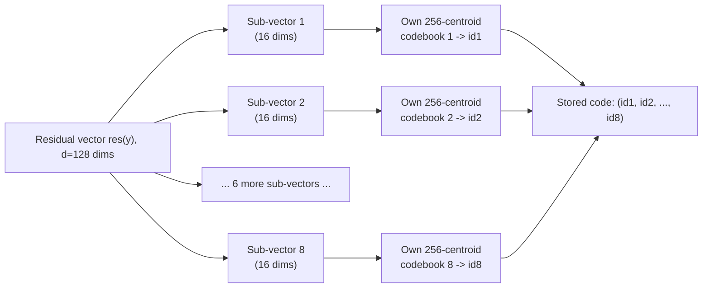

### 5.2 How many reconstruction points can this represent?

Two independent choices together pin down the reconstructed approximation $\hat y$: which coarse centroid ($\sqrt\ell$ options), times which residual code ($256^b$ options).

$$
\text{reconstruction points} = \sqrt\ell \times 256^b
$$

**What's actually stored** is far smaller: only $\sqrt\ell$ coarse centroids plus $256\,b$ sub-centroids (shared globally across the whole database) — that is, $O(\sqrt\ell\, d + 256\,d)$ total storage for all the codebooks, completely independent of $\ell$ for the second term.

**Why this matters — collisions are astronomically rare:** since $\sqrt\ell \times 256^b \gg \ell$, the number of *distinct representable points* vastly exceeds the number of actual database vectors, so two different vectors ending up with the exact same code is exceedingly unlikely.

*Concrete check for SIFT1B:* $\sqrt\ell \approx 3\times10^4$, and $256^8 \approx 10^{19}$. (One honest caveat: this "PQ's Collapse" phenomenon means exact ties can still occur, just very rarely — the argument shows rarity, not impossibility.)

### 5.3 Retrieving $y$ from its two-level code

What's stored per vector: which inverted list it belongs to, plus its PQ code $(id_1, \dots, id_b)$.

**Reconstruction formula:**

$$
\hat y = q_1(y) + q_2(\text{res}(y)) = \left(c + c^{(1)}_{id_1}, \dots, c^{(b)}_{id_b}\right), \qquad c = q_1(y)
$$

- $c$: read off the $\sqrt\ell$-entry coarse-centroid table, using which inverted list $y$ lives in — a single lookup.
- Each $c^{(i)}_{id_i}$: read off block $i$'s global 256-centroid codebook using the stored id — $b$ lookups total.

**Important:** $\hat y \ne y$ in general — $\hat y$ is only an *approximation*, and it is $\hat y$ (not the true $y$) that ADC actually ends up scoring against the query.

### 5.4 Approximating $\|x-y\|_2$: insert-and-cancel trick

$$
\begin{aligned}
\|x-y\|^2 &= \|(x-c) - (y-c)\|^2 && \text{(insert and cancel } +c-c=0\text{)}\\
&= \|(x-c) - \text{res}(y)\|^2 && \text{(since } c = q_1(y)\text{)}\\
&\approx \left\|(x-c) - q_2(\text{res}(y))\right\|^2 && \text{(replace residual by its PQ code)}\\
&= \sum_{i=1}^b \left\|(x-c)^{(i)} - c^{(i)}_{id_i}\right\|^2
\end{aligned}
$$

**A subtlety worth internalizing:** there is exactly *one* value of $c$ per candidate $y$ (since $y$'s own inverted-list membership fixes $c=q_1(y)$ uniquely — there's no trying other centroids for that candidate). What *does* get repeated $\tau$ times across the query is the group-level "recentering" step — the derivation of one lookup table per probed list, which is then reused by every single candidate $y$ living in that list.

### 5.5 Why precompute? The amortization trick

Since $id_i$ takes only $256$ possible values, we can fill in *all 256* distances for block $i$ **once**, and reuse that table for every candidate $y$ in the list:

$$
T^{(c)}_i[j] = \left\|(x-c)^{(i)} - c^{(i)}_j\right\|^2 \quad \implies \quad O\left(256\cdot\frac{d}{b}\cdot b\right) = O(256\,d)
$$

Then scoring **any** candidate is just a table lookup: $\sum_i T^{(c)}_i[id_i(y)]$ — $b$ lookups, i.e. $O(b)$ work, compared to $O(d)$ without the table.

**Per-list cost** (with $\approx\sqrt\ell$ candidates): $O(256\,d + \sqrt\ell\, b)$, versus $O(\sqrt\ell\, d)$ without the trick.

**Across $\tau$ lists:** $O\big(\tau(256\,d + \sqrt\ell\, b)\big)$, versus $O(\tau\sqrt\ell\, d)$ without it.

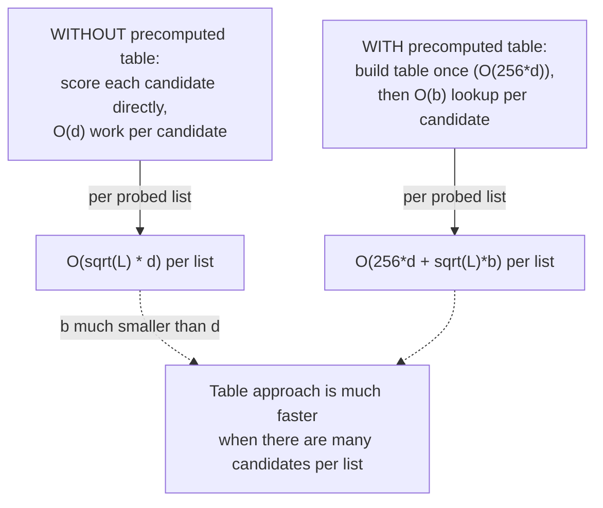

### 5.6 The 64x compression, counted explicitly

An id is just an index into a codebook: a codebook of $n$ centroids costs $\lceil\log_2 n\rceil$ bits, **regardless of the block's dimension**.

| | Raw (float32) | PQ code |
|---|---|---|
| Per sub-vector (16 dims) | $16\times4 = 64$B | $\log_2256 = 8$ bits $=1$B |
| $b=8$ sub-vectors | $8\times64 = 512$B | $8\times1 = 8$B |

**Compression ratio:** $512/8 = 64\times$.

(256 centroids were chosen specifically because $\log_2256=8$ bits fits *exactly* into one byte — no wasted bits per sub-quantizer id.)

**At the billion-vector scale:** $10^9$ vectors cost $512$GB raw, versus just $8$GB with PQ codes — the difference between needing a whole cluster of machines versus fitting comfortably on a single GPU.

### 5.7 Toy example: encoding one sub-vector by hand

Toy setup mirroring the figure in the slides: $d=8 \to b=4$ sub-vectors of $2$ dimensions each, each with its own codebook of $k=8$ centroids. Sub-vector $\text{res}(y)^{(1)} = (2,-1.5)$, compared against its codebook $C_1$ (nearest 3 of 8 centroids shown):

| id | centroid | dist$^2$ |
|---|---|---|
| 5 | $(2,-2)$ | $0.25$ |
| 6 | $(2,0)$ | $2.25$ |
| 3 | $(0,-2)$ | $4.25$ |

Nearest is id $5$, since $(2-2)^2 + (-1.5-(-2))^2 = 0.25$ is the smallest. (Stored as $\lceil\log_28\rceil=3$ bits — note the codebook's *size* sets the bit-width, not the sub-vector's dimension $d/b$.)

### 5.8 Toy example: assembling the code and counting bytes

Repeating independently for $\text{res}(y)^{(2)}, \text{res}(y)^{(3)}, \text{res}(y)^{(4)}$ (each has its own codebook) gives ids $2, 7, 0$. **Code for this vector:** $(5,2,7,0)$, using $4\times3=12$ bits $\approx1.5$B.

| What's stored | size | value |
|---|---|---|
| Raw vector | 8 floats | $8\times4=32$B |
| This vector's code | 4 ids, 3 bits each | $12$ bits $\approx1.5$B |
| Codebooks (global, once) | $4\times8\times2$ floats | $256$B |

**Per-vector compression:** $32/1.5 \approx 21\times$ — smaller than SIFT1B's $64\times$ because this toy example's $k=8$ and $d/b=2$ are both much smaller than the real setting's $k=256$, $d/b=16$; it is exactly the same formula, just with different knob settings.

**The codebook cost is paid only once, globally:** at $N=10^4$ vectors, the amortized codebook cost is $256\text{B}/10^4 = 0.026$B per vector — already negligible compared to the $1.5$B per-vector code cost.

---

## 6. Putting it together: the full IVFADC algorithm

### 6.1 Build phase

1. Train the coarse quantizer $q_1$: run k-means on a sample of the data $\to |C_1|\approx\sqrt\ell$ centroids.
2. For each database vector $y \in Y$: find $c \leftarrow q_1(y)$; append $y$ to inverted list $I_c$; compute $\text{res}(y) \leftarrow y - c$.
3. Train $b$ PQ codebooks (256 centroids each) on **all** the residuals $\text{res}(y)$ collected above.
4. For each $y \in Y$ again: encode $\text{res}(y) \to (id_1, \dots, id_b)$; store this code alongside $y$ in its inverted list $I_{q_1(y)}$.

*(Idea 1 — Inverted Lists — builds the lists; Idea 2 — Product Quantization — encodes each vector's residual $y - q_1(y)$, not $y$ itself.)*

### 6.2 Query phase

1. Find the $\tau$ nearest centroids $c_1,\dots,c_\tau \in C_1$ to the query $x$.
2. For each of the $\tau$ probed lists $j=1,\dots,\tau$:
   - Build the ADC lookup table $T^{(c_j)}_i[\cdot]$, for $i=1,\dots,b$ (Section 5.5).
   - For each candidate $y$ in list $I_{c_j}$: score$(y) \leftarrow \sum_{i=1}^b T^{(c_j)}_i[id_i(y)]$.
3. Return the $m$ smallest-scored candidates overall (using the **WarpSelect** algorithm, Section 7).

**In one sentence:** probe $\tau$ lists, score every candidate via the precomputed lookup tables in $O(b)$ time each (never $O(d)$), then $m$-select the overall winners.

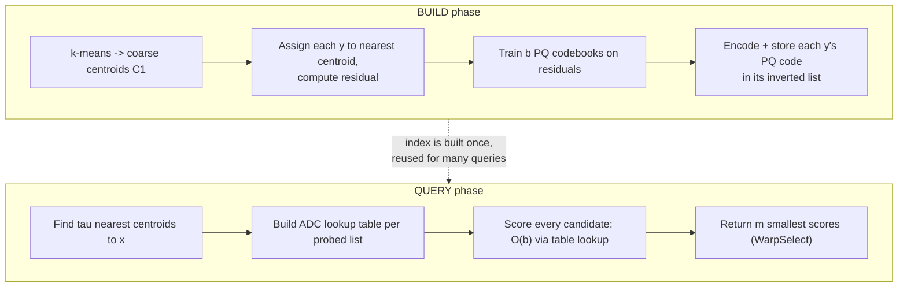

---

## 7. Systems: $k$-selection and multi-GPU

### 7.1 The GPU bottleneck: $k$-selection

**IVFADC** = Idea 1 (probe $\tau$ lists, skip the rest) + Idea 2 (compare via PQ codes rather than raw vectors).

A query now has roughly $\tau\sqrt\ell$ candidates. Finding the smallest $m$ of these (the "$k$-selection" step, in the paper's own terminology) costs $O(\tau\sqrt\ell\log m)$ with an ordinary heap — but heaps and sorts fundamentally **serialize**: they process one element at a time, and this doesn't saturate the massive parallelism available on a GPU (which executes many threads simultaneously in "warps").

**WarpSelect** — the paper's main systems contribution: $32$ per-lane sorted queues, kept entirely in registers, merged via warp shuffles (a fast, register-to-register communication primitive between the 32 threads of a GPU warp). This achieves $55\%$ of peak memory-bandwidth-bound performance, and is $8.5\times$ faster than the prior GPU state of the art.

**Multi-GPU scaling:** either **replicate** the whole database across $R$ GPUs (splitting up the incoming queries between them), or **shard** the database across $S$ GPUs (each GPU holding only $\ell/S$ of the data) — and these two strategies combine, giving $S$ shards $\times$ $R$ replicas.

### 7.2 Aside: how WarpSelect beats a heap

A GPU warp consists of $32$ lanes (threads) executing in lockstep. The goal: find the top-$m$ of roughly $\tau\sqrt\ell$ candidates, using only registers (the fastest possible memory).

- Each lane maintains its **own** sorted queue, in its own registers.
- Each lane's buffer absorbs new candidates as they stream in; once a buffer fills up, it triggers a bulk sort-merge (this amortizes the sorting cost over many candidates, rather than re-sorting on every single insertion).
- The $32$ per-lane queues are merged via warp-shuffle operations — meaning **no** shared or global memory traffic is needed at all, only register-to-register communication, yielding the final warp-wide top-$m$.

**Contrast with a heap:** a heap uses $1$ thread doing serial push/pop operations, leaving the other $31$ lanes of the warp completely idle. WarpSelect instead does genuinely $32$-way parallel work, with cheap merge steps.

**Correctness note from the lecture:** this scheme is exact — that is, provably correct — *among the candidates handed to it*, as long as each lane's queue holds $t \ge m$ elements (in that case, no lane can locally discard a candidate that would have been a true global top-$m$ winner during the merge). But this exactness is only relative to the $\approx\tau\sqrt\ell$ candidates that WarpSelect receives — that shortlist itself is already the result of the IVF+PQ *approximation*, so the overall pipeline is still approximate even though this particular step is exact.

#### Worked example: a toy stream, top-$m=3$

Toy setup: $12$ candidate distances stream in, using $4$ lanes (a real GPU warp uses $32$); we want the smallest $m=3$.

**Heap approach (1 thread):** push/pop all $12$ values one at a time — $12$ serial steps.

**WarpSelect approach (4 lanes, parallel):** each lane receives $3$ of the $12$ candidates and keeps its own local top-$2$ in registers:

| Lane | Its 3 candidates | Local top-2 |
|---|---|---|
| 0 | 5.1, 6.6, 4.4 | 4.4, 5.1 |
| 1 | 2.3, 3.3, 7.7 | 2.3, 3.3 |
| 2 | 8.0, 9.9, 2.9 | 2.9, 8.0 |
| 3 | 1.2, 0.7, 5.5 | 0.7, 1.2 |

Shuffle-merging the $4$ local top-$2$'s ($8$ numbers total) gives the global top-$3$: $0.7, 1.2, 2.3$ — the *same* correct answer as the heap, but reached via $4$-way parallel work instead of $12$ serial steps.

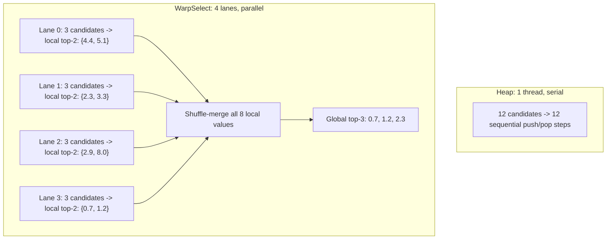

### 7.3 Seeing multi-GPU: shard vs. replicate

Toy setup: $\ell=12$ database vectors, $2$ GPUs, $4$ incoming queries.

**Shard ($S=2$):** GPU0 holds vectors $1$–$6$, GPU1 holds vectors $7$–$12$. *Every* query is sent to *both* GPUs; each searches only its own half; results are merged centrally afterward. This is what lets a database too large to fit on one GPU fit across two.

**Replicate ($R=2$):** both GPUs hold a full copy of all $12$ vectors. Queries $1,2 \to$ GPU0, queries $3,4\to$ GPU1 — each GPU answers only its assigned queries, entirely independently, with no merging step needed. This doubles query throughput.

**Combined $S\times R = 2\times2$ (4 GPUs):** two independent 2-shard groups (each internally organized exactly like the shard setup above) — giving both bigger database capacity *and* higher query throughput simultaneously.

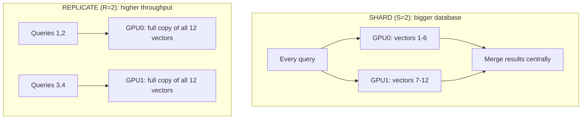

---

## 8. Complexity and where JL fits

### 8.1 Where JL fits into FAISS

**Key fact stated explicitly:** FAISS does **not** use JL — there is no random projection anywhere in the paper. Instead, it reduces dimension using *learned* maps: PCA (used on the YFCC100M benchmark) or OPQ, "Optimized Product Quantization" (used on DEEP1B).

**Same problem, different answer:** both random projection (JL) and learned reduction (PCA/OPQ) solve the *same* underlying problem — needing a cheap map down to fewer dimensions that preserves pairwise distances well enough for IVF/PQ to prune correctly. JL solves this **randomly, with a mathematical guarantee**; PCA/OPQ solve it **by learning from the data**, with no such guarantee, but often performing better in practice on real, non-adversarial data.

Either way, the reduction runs *once*, up front, on both the database and the queries — every subsequent step then operates in $\mathbb{R}^k$ instead of $\mathbb{R}^d$:

$$
O(\sqrt\ell\, d) \to O(\sqrt\ell\, k)
$$

**Concrete example:** on DEEP1B, OPQ reduces $d \to 80$ before applying a 20-byte PQ code — the same *shape* of step as JL, just using a learned rotation instead of a random one.

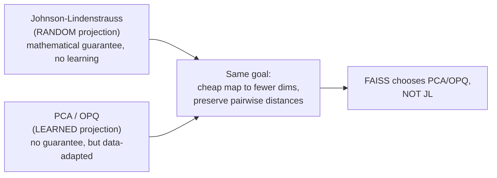

### 8.2 Complexity of each step in the IVFADC pipeline

Per-query cost breakdown, compared against the naive baseline's single $O(\ell d)$ term:

| Step | Cost | Naive term it replaces |
|---|---|---|
| JL/PCA: $d \to k$ | $O(kd)$, once per query | — (new step) |
| IVF: search $\sqrt\ell$ centroids | $O(\sqrt\ell\, k)$, once per query | $\ell \to \sqrt\ell$ |
| PQ: build $b$ lookup tables | $O(256\,k)$, $\times\tau$ (one per probed list) | — (new step) |
| PQ: score $\tau\sqrt\ell$ candidates | $O(\tau\sqrt\ell\, b)$ | $d \to b$ per candidate |
| $m$-selection (WarpSelect) | $O(\tau\sqrt\ell\log m)$ | same form, but on a much smaller input |

**Total:**

$$
O\Big(kd + \sqrt\ell\, k + \tau\cdot256\,k + \tau\sqrt\ell\,(b+\log m)\Big) \quad \text{vs. naive's } O(\ell d)
$$

**The big-picture story:** the single $\ell$-linear term in the naive method splits apart into one one-time $O(kd)$ cost plus three separate terms that are each $\sqrt\ell$-sized or smaller. (Caveat: at SIFT1B scale — $\ell=10^9$, $\tau=8$, $b=8$ — the very last term dominates only *loosely*; the $\sqrt\ell\,k$ term is comparable in size, not negligible, so in practice all four terms are kept rather than dropping the smaller-looking ones.)

### 8.3 Seeing the candidate funnel

At $\ell = 10^9$, $\tau = 8$: the database shrinks from $\ell = 10^9$ down to $\sqrt\ell \approx 3\times10^4$ centroid comparisons (a massive first filter), then down to $\tau\sqrt\ell \approx 2.5\times10^5$ candidates that actually get scored, and finally down to just $m$ returned neighbours. Each stage is a further filter, and visualized on a log scale, the funnel narrows dramatically at each step.

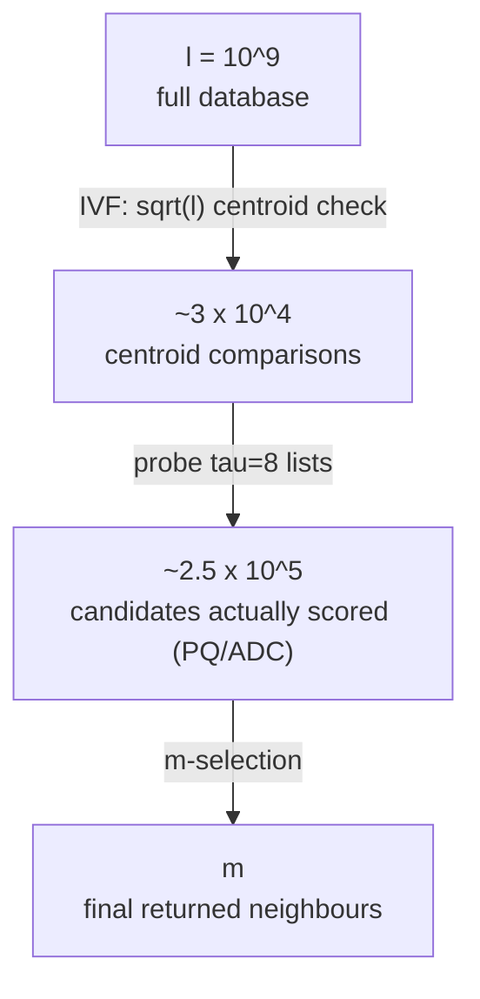

### 8.4 What the theoretical savings look like

**Two independent shrinkages compound together:**
1. IVF turns the $\ell$-scan into a $\sqrt\ell$-scan — this is the *dominant* win at billion-vector scale, and it is entirely **JL-independent** (it comes from the inverted-list structure, not from dimensionality reduction).
2. JL/PCA and PQ *each separately* shrink a dimension-related term: $d \to k$ upstream (during indexing), and $d \to b$ per candidate during scoring, with $b \ll k \le d$.

**Reading the actual regime numbers:** at $\ell = 10^9$, $\sqrt\ell = 3\times10^4$ — roughly $30{,}000\times$ fewer candidates scored than the naive method's full $\ell$. Separately, with $b=8$ versus $d=128$, each individual candidate is $16\times$ cheaper to score. **These two effects multiply together.**

**Caveat, stated explicitly:** this is only the *theoretical shape* of the savings. It ignores recall loss (both IVF and PQ are lossy — see the next section) and hardware constants (WarpSelect's win is about GPU utilization efficiency, not a smaller asymptotic exponent).

---

## 9. Results and limitations

### 9.1 Headline numbers (from the paper, Section 6)

- **SIFT1B** ($1$ billion vectors, $d=128$, $b=8$ bytes/vector): $17.7\mu s$/query at recall@10 $=0.376$ on one GPU — $8.5\times$ faster than the prior GPU state of the art, at higher accuracy.

  (recall@$K$: the fraction of queries for which the *true* exact nearest neighbour appears among the top-$K$ results returned — $1.0$ is perfect, matching exact search exactly.)

- **YFCC100M** ($95$ million images, $d=128$): building the index plus a full $10$-NN graph, achieving accuracy $>0.8$, takes $35$ minutes.
- **DEEP1B** ($1$ billion CNN embeddings): building a $10$-NN graph takes $6$–$12$ hours on $4$ Titan X GPUs, depending on the desired quality target.
- **k-means** (MNIST8M: $8.1$ million points $\to 4096$ centroids): $735$s (prior best, 1 GPU) $\to 316$s (this work, 1 GPU) $\to 100$s (this work, 4 GPUs).

### 9.2 Where it breaks: FAISS's approximate nature

FAISS is explicitly **not** an exact method, and the lecture is careful to enumerate exactly how it fails:

- **Not exact:** probing only $\tau$ of $|C_1|$ total cells can miss the true nearest neighbour entirely — for example, even in the paper's own numbers, SIFT1M achieves only recall@1 $=0.80$, not the $1.0$ that exact search would give.
- **PQ is lossy:** distances are computed from *compressed* codes, not raw vectors — and this error compounds together with IVF's own recall loss (on SIFT1B, recall@10 is only $0.376$ at the fastest configuration).
- **A genuine three-way trade-off**, not a single accuracy knob: speed $\leftrightarrow$ accuracy $\leftrightarrow$ memory, controlled jointly via $\tau$, code length $b$, and $|C_1|$ — tuned per use case, with **no universal default**.
- **Index build isn't free:** both the coarse and PQ codebooks require running k-means on representative data before the index can be used at all.
- **Mostly static:** inverted lists assume a largely fixed database; heavy insert/delete churn requires periodic full rebuilds of the index.

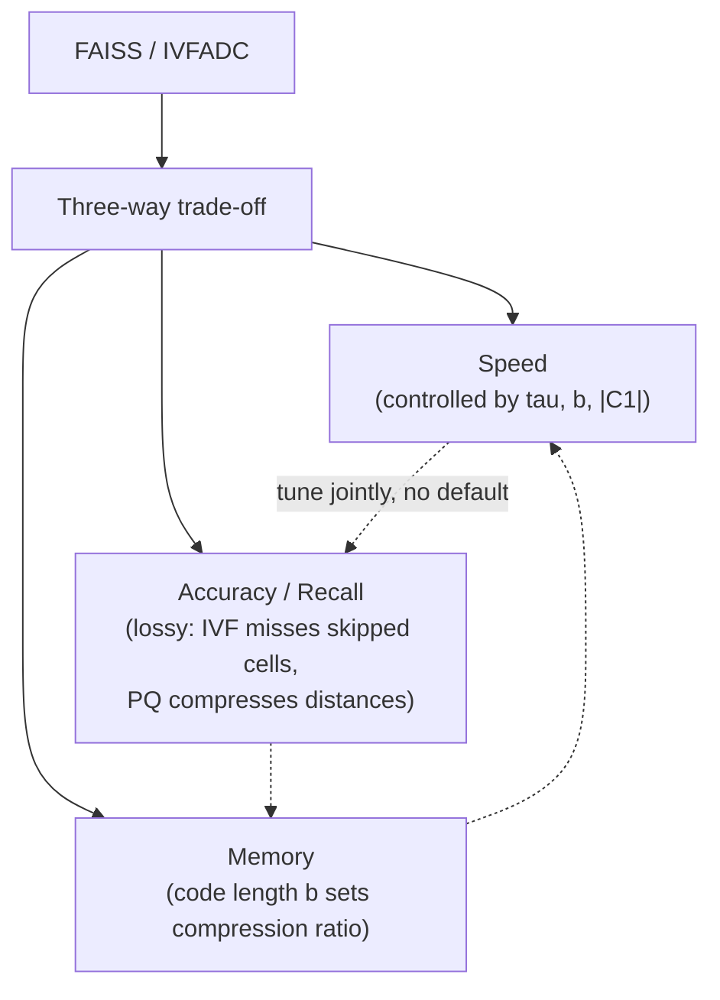

---

## 10. Classroom-scale demo

**Framing (discussion only, scale-dependent per the course handout):** FAISS's actual contribution — genuinely sub-linear billion-vector search on GPUs — only manifests under real production-scale load; it cannot be meaningfully demonstrated on classroom hardware or with toy-sized data.

**What the course does instead:** simulate random projection directly, on just a few hundred points, and empirically verify that the JL distortion bound actually holds — without attempting to reproduce FAISS's system-level, billion-scale speedups.

**Medium-scale demo setup** (`demo_scale.py`): $n=10^5$ points, $d=1024$, on a laptop; project down to $k=16$ using a Gaussian projection.

### 10.1 Actual measured output

$n=10^5$ points, $d=1024$, $50$ queries; project to $k=16$, then rerank the top $10$ candidates using the exact distance:

| Method | ms/query | recall@1 |
|---|---|---|
| Exact, $d=1024$ | $5.8$ | $1.00$ |
| Projected, $k=16$ | $0.2$ | $0.78$ |
| Projected + rerank top 10 | $1.0$ | $0.98$ |

**Measured speedup:** $34.6\times$ (plain projected search versus exact search) — close to the $d/k = 1024/16 = 64\times$ predicted by theory; the remaining gap is attributed to fixed per-query overhead (Python loop and `argmin` costs) that doesn't shrink just because the dimension did.

**The FAISS recipe, felt locally, at classroom scale:** do a cheap coarse search in just $k$ dimensions to discard most candidates quickly, then run an exact rerank pass only on the small set of survivors. This is exactly the same *shape* of pipeline as IVF + PQ + a final exact pass in real FAISS — just without the billion-scale infrastructure.

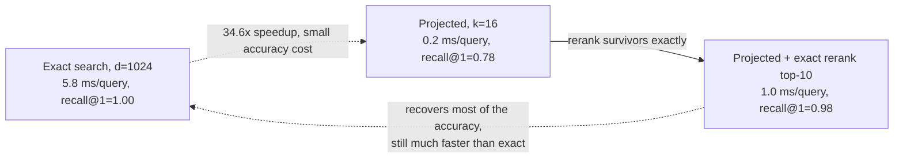

---

## 11. Summary

1. **Naive exact search:** $O(\ell d)$ per query — GEMM-dominated, does not scale to $\ell=10^9$.
2. **FAISS Idea 1 — Inverted Lists (IVF):** coarse quantizer $q_1$ with $\approx\sqrt\ell$ centroids via a Voronoi partition; probing only the $\tau$ nearest cells shrinks the candidate count from $\ell$ to $\approx\tau\sqrt\ell$.
3. **FAISS Idea 2 — Product Quantization (PQ) & ADC:** per-block codebooks giving $b$-byte codes ($64\times$ compression on SIFT1B: $512$B raw $\to$ $8$B code); ADC scores codes via precomputed lookup tables in $O(b)$ per candidate, not $O(d)$; IVFADC specifically trains PQ on the *residuals* $y - q_1(y)$, giving more accuracy for the same bit budget than plain PQ on raw vectors would.
4. **$k$-selection & systems:** WarpSelect (32-lane parallel top-$m$ using only registers); multi-GPU shard (bigger database) and replicate (more query throughput), which combine as $S\times R$.
5. **Where JL fits:** FAISS uses *learned* dimensionality reduction (PCA/OPQ), not random projection — solving the same problem JL solves, but with a different (data-adapted, non-random) answer.
6. **Where it breaks:** approximate throughout (lossy IVF plus lossy PQ, compounding); a genuine three-way speed/accuracy/memory trade-off with no default setting; index building isn't free; the structure is mostly static and needs periodic rebuilds under heavy churn.

---

## 12. What's next?

Chapter 2 continues with: separating hyperplanes, fitting a spherical Gaussian, and the concentration inequalities (Markov, Chebyshev, Chernoff) — the general machinery that was informally previewed and used throughout the JL and Gaussian Annulus proofs in the companion Week 2 note.
