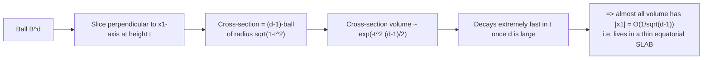
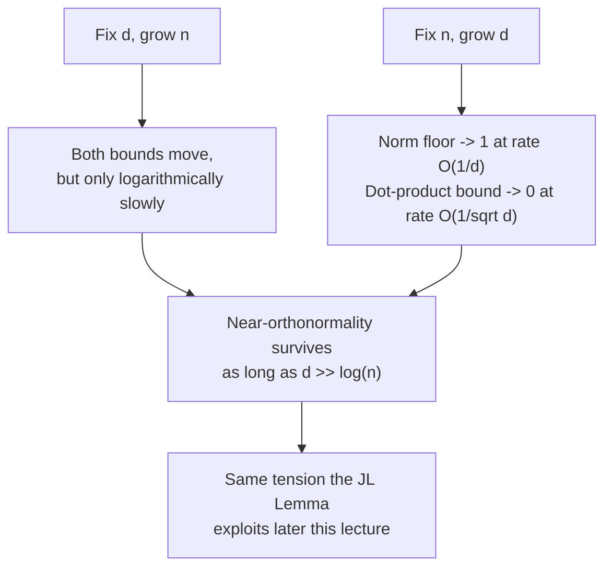
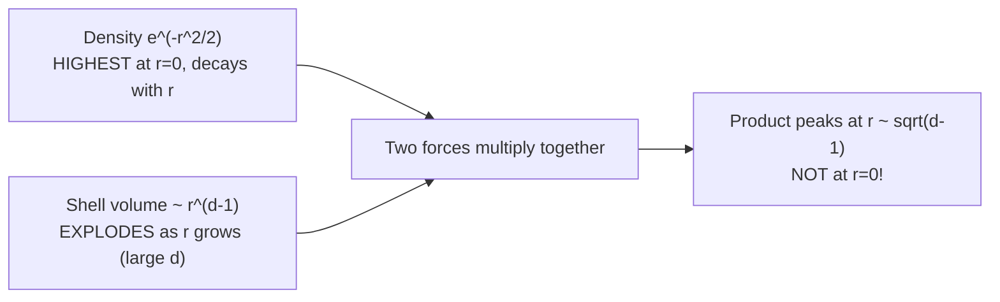
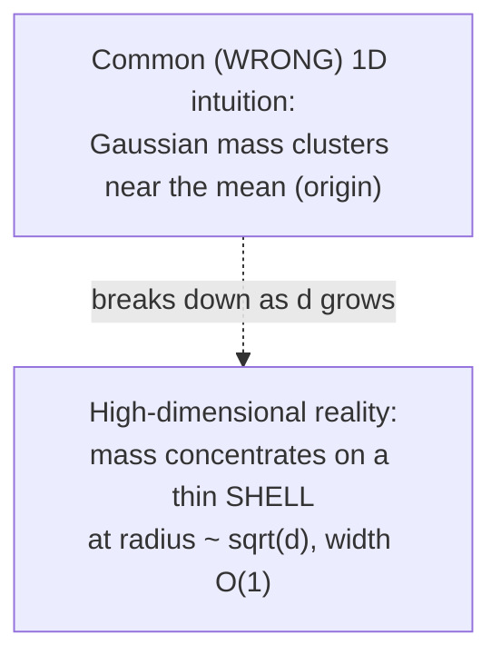
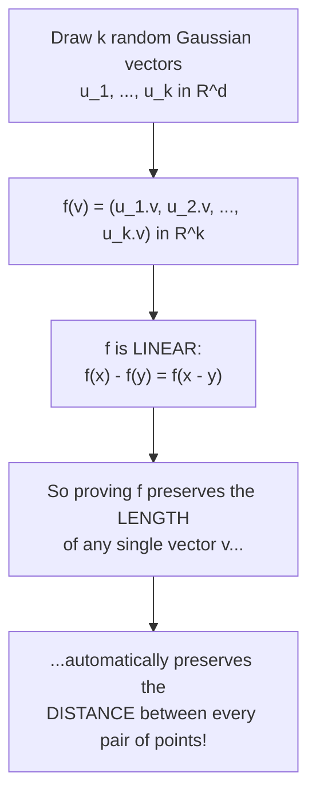
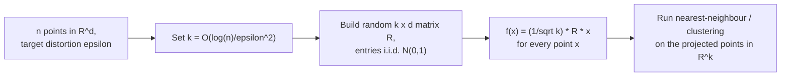
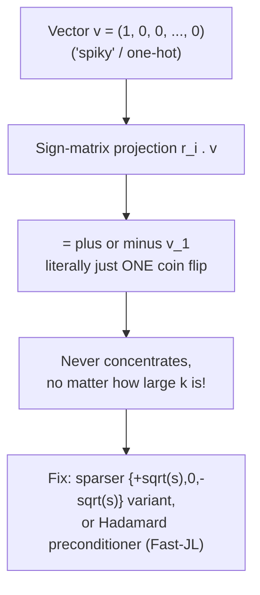

## 2. Why High Dimensions Are Different

### 2.1 The puzzle

Real data commonly has $d$ in the thousands. Algorithms that operate directly on such data are slow and memory-hungry. The goal is to **compress to a few dimensions while keeping pairwise distances intact** — because search, clustering, and nearest-neighbour algorithms all fundamentally rely on distances staying meaningful.

> **Question.** Given $n$ points in native dimension $d$, does there exist some $k \ll d$ such that projecting into $\mathbb{R}^k$ barely distorts any pairwise distance?

The answer to this hinges on a deeper geometric question: **where does the volume of a high-dimensional ball actually live** — near the center, or near the surface? Our $d=2$ or $d=3$ intuition (which says "most of the volume is somewhere in the middle") turns out to be actively misleading. Note: the exact size of $k$ that works falls out of the proof later in the lecture — it is not the starting assumption.

### 2.2 Two pictures of the answer, previewed

The lecture previews two equivalent geometric facts that will each be proven in detail:

1. **The volume of a high-dimensional ball concentrates as a thin shell right at the surface.**
2. **The volume of a high-dimensional ball concentrates as a thin equatorial slab** (i.e., points overwhelmingly have a very small first coordinate).

These turn out to be **the same underlying phenomenon**, viewed from two different angles. Details follow.

---

## 3. Volume Concentration in High Dimensions

### 3.1 Why volume scales as $r^d$

**Definition.** $B^d(r) := \{x \in \mathbb{R}^d : \|x\|_2 < r\}$ is the open ball of radius $r$ centered at the origin. Write $B^d := B^d(1)$ for the open unit ball.

**Claim.** $V(r) = c_d\, r^d$ for a constant $c_d$ that depends only on the dimension $d$, not on the radius $r$.

**Sketch of why:** the map $y \mapsto ry$ sends $B^d(1)$ bijectively onto $B^d(r)$ — it scales each of the $d$ coordinate directions by a factor of $r$. A linear map that scales every direction by $r$ scales $d$-dimensional *volume* by $r^d$ (its Jacobian determinant is $r^d$):

$$
V(r) = \int_{B^d(r)} dx = r^d \int_{B^d(1)} dy = r^d\, V(1)
$$

So we can define $c_d := V(1)$, and — crucially for what follows — **the fraction of volume inside an inner ball of radius $(1-\epsilon)r$ is exactly $(1-\epsilon)^d$**, because the constants $c_d$ cancel out in the ratio:

$$
\frac{V((1-\epsilon)r)}{V(r)} = \frac{c_d\,((1-\epsilon)r)^d}{c_d\, r^d} = (1-\epsilon)^d
$$

This is the single most important algebraic fact in the whole lecture — everything about "shells" and "slabs" flows from this one ratio.

### 3.2 Exact volume formula (for the record)

For radius $r=1$, the constant $c_d = V(1)$ has a closed form:

$$
V(1) = \frac{\pi^{d/2}}{\Gamma\left(\frac{d}{2}+1\right)}
$$

Combined with the scaling law above, this gives $V(r) = \dfrac{\pi^{d/2}}{\Gamma(d/2+1)} r^d$ for any $r$. **We won't actually need this exact constant** — only the fact that it is the *same* constant in the numerator and denominator whenever we take ratios, which is what let it cancel above.

### 3.3 Volume concentrates near the surface

> **Theorem.** For fixed $\epsilon \in (0,1)$, as $d \to \infty$,
> $$\frac{V((1-\epsilon)r)}{V(r)} = (1-\epsilon)^d \le e^{-\epsilon d} \to 0$$

**Proof.** $V(r) = c_d r^d$ scales identically in numerator and denominator, leaving $(1-\epsilon)^d$; then use the standard inequality $1 - \epsilon \le e^{-\epsilon}$.

**In plain terms:** shrink the radius by any fixed fraction $\epsilon$ (say, pull it in by just 5%), and as the dimension grows, the fraction of the ball's volume that remains inside that smaller ball rockets toward *zero*. Essentially all of the volume must therefore be squeezed into the thin remaining shell near the surface.

#### Interpretation: how wide is the shell?

Take $d = 100$, $\epsilon = 0.05$ (shrink the radius by just 5%):

$$
(0.95)^{100} \approx e^{-5} \approx 0.0067
$$

So under $1\%$ of the ball's volume lies more than $5\%$ of the radius away from the surface — over 99% of the volume is packed into that outer 5% shell.

**Natural follow-up question:** as $d$ grows, how must $\epsilon$ shrink to keep this "crossover" from vanishing or exploding?

**Hint:** look at the exponent $\epsilon d$ in $e^{-\epsilon d}$. For this exponent to stay a fixed constant (neither vanishing nor exploding) as $d \to \infty$, what must $\epsilon$ do?

**Answer:** set $\epsilon = c/d$ for some constant $c$. Then

$$
(1-\epsilon)^d \le e^{-\epsilon d} = e^{-c}
$$

a fixed constant, not zero. This is the crossover scale. **Conclusion:** the shell where volume transitions from "negligible" to "essentially all of it" has width $\epsilon = \Theta(1/d)$ — essentially all the volume of $B^d$ lives within a shell of width $O(1/d)$ just inside the surface. As $d$ grows, this shell gets *relatively* thinner and thinner, even though it still contains almost everything.

**Seeing it (as described by the lecture's figures):** plotting the fraction of volume within radius $r$ (which is just $r^d$) against $r$, the curve is gentle for $d=2$ but becomes a near-vertical wall for $d=200$ — essentially zero volume until $r$ is very close to $1$, then it shoots up to $1$. A second plot confirms that the crossover width $\epsilon^*(d)$ (the smallest $\epsilon$ with $(1-\epsilon)^d = 1/e$) is a nearly perfect straight line when plotted against $1/d$, confirming $\epsilon^* = \Theta(1/d)$ exactly as derived above.

### 3.4 A related fact: the first coordinate is small

**Statement:** for $x$ drawn uniformly from $B^d$, and any $c > 0$, at least

$$
1 - \frac{2}{c} e^{-c^2/2}
$$

of the volume satisfies $|x_1| \le c/\sqrt{d-1}$.

**Why this generalizes to any direction, not just the first coordinate:** for any *fixed* unit vector $u$ (chosen independently of $x$), the projection $\langle x, u \rangle$ has *exactly* the same distribution as $x_1$, by rotational invariance of the ball (rotating the whole ball doesn't change its shape, so there's nothing special about the "first" coordinate axis versus any other direction $u$). So the identical bound holds for $\langle x, u \rangle$. This is important: it's a **per-direction** statement (true for each fixed direction you check), not a claim that *every* coordinate of *every* point is simultaneously small.

#### Quick intuition: a coordinate budget argument

This is a fast, non-rigorous way to see *why* the result above should be true, using only what we already know:

- $\|x\|_2^2 = \sum_{k=1}^d x_k^2 \approx 1$ — think of this as a fixed "budget" of total squared-length that has to be shared out among $d$ coordinates.
- By symmetry, $E[x_k^2]$ is the same for every coordinate $k$, so each one gets an equal share of the budget: $E[x_k^2] = \frac1d$, i.e., typically $|x_k| \approx 1/\sqrt d$.
- For independent $x_i, x_j$ (two different random points, not two coordinates of one point):
  $$
  \text{Var}(\langle x_i, x_j\rangle) = \sum_k E[x_{i,k}^2] E[x_{j,k}^2] = \sum_k \frac1d \cdot \frac1d = \frac1d
  $$

**Same budget, two consequences:** individual coordinates are typically $O(1/\sqrt d)$ in size, *and* inner products between two independent points — being sums of $d$ such tiny, independent terms — also stay $O(1/\sqrt d)$ in size. This "coordinate budget" intuition will resurface again and again through the lecture.

### 3.5 Thin slab: proof sketch

**Step 1.** Bound the volume of the "cap" $\{x \in B^d : x_1 \ge t\}$ using cross-sections taken perpendicular to the $x_1$-axis.

**Step 2.** The cross-section at height $t$ is itself a $(d-1)$-dimensional ball of radius $\sqrt{1-t^2}$, whose volume is proportional to $e^{-t^2(d-1)/2}$. So once $t = \omega(1/\sqrt{d-1})$ (grows faster than that rate), the cap volume shrinks to zero — meaning $|x_1| \le O(1/\sqrt{d-1})$ for essentially all of the ball's volume.

**Why the $e^{-t^2(d-1)/2}$ appears:** this is the same "compounding" trick used throughout the lecture — turn a power into an exponential using the approximation $\ln(1-t^2) \approx -t^2$ for small $t$:

$$
(1-t^2)^{(d-1)/2} = e^{\frac{d-1}{2}\ln(1-t^2)} \approx e^{-t^2(d-1)/2}
$$

**Seeing slab concentration:** plotting the exact fraction of $B^d$'s volume with $|x_1| \le t$ (computable via the incomplete Beta function) shows a gentle curve for $d=2$ but a near-vertical wall at the origin for $d=200$ — almost no volume has $x_1$ far from zero. Plotting the crossover half-width $t^*(d)$ (the smallest $t$ capturing only a $1/e$ fraction of volume outside the slab) against $1/\sqrt{d-1}$ gives a near-perfect straight line, confirming $t^* = \Theta(1/\sqrt{d-1})$. One honest caveat from the lecture: the theoretical bound curve ($c^*/\sqrt{d-1}$) sits *above* the exact numerical data — the bound is valid but conservative, not a tight match.

### 3.6 $n$ random points are all nearly orthogonal

> **Theorem (BHK, Ch. 2).** Let $x_1, \dots, x_n$ be drawn independently and uniformly at random from $B^d$. With probability at least $1 - O(1/n)$:
> $$\|x_i\|_2 \ge 1 - \frac{2\ln d}{n} \quad \text{for every } i,$$
> $$|\langle x_i, x_j\rangle| \le \sqrt{\frac{6\ln n}{d-1}} \quad \text{for every } i \ne j.$$

> **Note on a typo in the source slides:** the norm bound as literally printed reads $1 - \frac{2\ln d}{n}$, but based on the surrounding derivation (which sets $\epsilon = \frac{2\ln n}{d}$ and applies it per point), the intended bound is almost certainly $\|x_i\|_2 \ge 1 - \frac{2\ln n}{d}$ — i.e. $n$ and $d$ swapped from how they appear in the raw extracted text. The proof-idea slide (Section 3.7 below) uses $\epsilon = \frac{2\ln n}{d}$ consistently, which supports this reading. Keep this in mind if you cross-check against the raw PDF text.

**Implication:** this is more intricate than simply saying the vectors are "orthonormal" — both bounds are governed by *both* $n$ and $d$, in different ways.

#### The $n$ versus $d$ tension

- **Fix $d$, grow $n$:** the norm floor $1 - \frac{2\ln n}{d}$ decreases (slowly — only $\Theta(\log n)$), while the dot-product bound $\sqrt{\frac{6\ln n}{d-1}}$ increases (also slowly — only $\Theta(\sqrt{\log n})$).
- **Fix $n$, grow $d$:** the norm floor approaches $1$ at rate $O(1/d)$, and the dot-product bound approaches $0$ at rate $O(1/\sqrt d)$ — this is exactly the same $1/d$ coordinate-budget scaling seen earlier ($E[x_k^2] = 1/d \implies \text{Var}(\langle x_i,x_j\rangle) = 1/d$).

**Conclusion:** near-orthonormality survives adding more points, *provided* $d \gg \log n$. This is the exact same $n$-versus-$d$ tension that the JL Lemma will exploit later in the lecture.

### 3.7 Proof idea: the norm bound

Apply the surface-concentration result (Section 3.3) to a single point $x_i$, with $\epsilon = \frac{2\ln n}{d}$:

$$
\Pr\left[\|x_i\|_2 < 1-\epsilon\right] \le e^{-\epsilon d} = \frac{1}{n^2}
$$

Then a **union bound** over all $n$ points (the probability that *any one of them* fails is at most the sum of the individual failure probabilities):

$$
\Pr[\text{some } \|x_i\|_2 < 1-\epsilon] \le n \cdot \frac{1}{n^2} = \frac1n
$$

### 3.8 Proof idea: the inner-product bound

Fix a point $x_j$. Apply the thin-slab bound (Section 3.5) to $x_i$, treating the direction $u = x_j / \|x_j\|_2$ as the axis, with $c = \sqrt{6\ln n}$:

$$
\Pr\left[|\langle x_i, x_j\rangle| > \sqrt{\frac{6\ln n}{d-1}}\right] \le \frac{2}{c} e^{-c^2/2} = O(n^{-3})
$$

Union bound over the $\binom{n}{2} < n^2$ pairs: total failure probability $O(1/n)$.

**The general recipe here (worth internalizing, since it repeats constantly in this course):** (1) prove a strong concentration statement for *one* random object, (2) use a union bound to extend it to *many* random objects simultaneously, accepting a modest weakening of the constants in exchange for the statement holding for everything at once.

#### Seeing the norm bound: slow in $n$, $O(1/d)$ in $d$

Plotting the guaranteed floor $1 - \frac{2\ln n}{d}$ against $n$ (log scale), for fixed $d$: it barely moves across five orders of magnitude of $n$ — a direct visualization of the $\Theta(\log n)$ growth described above. Plotting the gap from $1$ (i.e. $\frac{2\ln n}{d}$) against $1/d$ for fixed $n$: this is exactly linear, confirming the $O(1/d)$ rate.

#### Seeing near-orthogonality directly

**Toy check:** let $u, v$ be independent and uniform on $\{\pm 1/\sqrt d\}^d$ (these are unit vectors made of random signs). Then

$$
\langle u, v\rangle = \frac1d \sum_{i=1}^d s_i, \quad s_i = \pm1 \text{ i.i.d.}
$$

$$
E[\langle u,v\rangle] = 0, \qquad \text{Var}(\langle u,v\rangle) = \frac1d \implies \text{typical } \langle u,v\rangle \approx \pm\frac{1}{\sqrt d}
$$

For $d = 10^4$: the typical inner product is about $\pm 0.01$ — an angle within roughly $0.6^\circ$ of exactly $90^\circ$. (Small worked check: for $d=4$, $u = \frac12(+,+,+,+)$, $v=\frac12(+,-,+,-)$ gives $\langle u,v\rangle = 0$ exactly.)

**Simulation described in the slides:** taking inner products of 20,000 pairs of random unit vectors, at $d=3$ any value in $[-1,1]$ is common (no concentration at all), but by $d=1000$ there's a sharp spike right at $0$, of width roughly $1/\sqrt d$ — a direct, visual confirmation of near-orthogonality emerging as $d$ grows.

#### Seeing it as a matrix: the Gram matrix

For $d = 1000$, if you form the matrix $XX^T$ (the "Gram matrix" of inner products between all pairs of points) using nested prefixes of one single random draw (so the growth in $n$ is literal, not re-randomized each time): the matrix is **not** deterministically the identity — off-diagonal entries are nonzero — but they stay *bounded* as $n$ grows. Comparing $n = 30, 300, 3000$ (from one draw), the observed maximum off-diagonal entry tracks closely against the theorem's own bound $\sqrt{6\ln n/(d-1)}$.

---

## 4. The Gaussian Annulus Theorem

### 4.1 Spherical Gaussians in high dimensions

Let $x = (x_1, \dots, x_d)$ with each $x_i \sim N(0,1)$ independently (this is called a **spherical Gaussian**, since it has no preferred direction).

$$
E[\|x\|_2^2] = E\left[\sum_i x_i^2\right] = \sum_i E[x_i^2] = d
$$

(using linearity of expectation — no independence needed for this step). So we'd naively expect $\|x\|_2 \approx \sqrt d$. The natural next question: **how tightly does $\|x\|_2$ actually concentrate around $\sqrt d$?**

### 4.2 Why a shell, not the origin? Two competing forces

This is a genuinely beautiful piece of intuition. Two opposing effects are at play:

1. The Gaussian **density** $\propto e^{-\|x\|_2^2/2}$ is highest right at the origin and decays as $\|x\|_2$ grows — this alone would suggest points cluster *near the origin*.
2. The **volume** of a thin shell at radius $r$ grows like $r^{d-1}$ — this explodes rapidly as $r$ grows, when $d$ is large. (Think of it this way: there's vastly more "room" far from the origin than close to it, simply because the surface area of a sphere of radius $r$ grows with $r$.)

The actual probability mass in a shell at radius $r$ is proportional to the *product* of these two competing forces:

$$
\underbrace{e^{-r^2/2}}_{\text{shrinking}} \cdot \underbrace{r^{d-1}}_{\text{exploding}}
$$

These two effects trade off against each other, and the mass ends up **peaking at $r \approx \sqrt{d-1}$**, not at $r=0$. This resolves the apparent paradox: even though any *individual point* near the origin is more "likely" in a density sense, there are so overwhelmingly many more points at radius $\approx \sqrt d$ that essentially all the mass ends up there.

### 4.3 The Gaussian Annulus Theorem — statement

> **Theorem.** For a $d$-dimensional spherical Gaussian $x$ with unit variance in each coordinate, for any $\beta \le \sqrt d$, all but at most $3e^{-c\beta^2}$ of the probability mass lies within the annulus (a thin spherical "shell")
> $$\sqrt d - \beta \le \|x\|_2 \le \sqrt d + \beta$$
> where $c > 0$ is a fixed constant, independent of $d$.

**In plain terms:** almost all the mass of a high-dimensional Gaussian sits within a narrow band of radii around $\sqrt d$, and the width of that band ($\beta$) doesn't need to grow with $d$ at all — it can be a small constant, and the "escaping" probability still shrinks exponentially.

### 4.4 Proof: reducing to a sum of $\chi_1^2$ random variables

Let $y_i = x_i^2$. Since $x_i \sim N(0,1)$, each $y_i$ follows a **chi-squared distribution with 1 degree of freedom**, written $y_i \sim \chi_1^2$, with $E[y_i] = 1$.

$$
\|x\|_2^2 - d = \sum_i (y_i - 1), \quad \text{which has mean } 0
$$

$$
\|x\|_2 \approx \sqrt d \iff \sum_i (y_i - 1) \approx 0
$$

**The plan:** Chernoff-bound $\Pr\left[\sum_i(y_i-1) \ge t\right]$ and $\Pr\left[\sum_i(y_i-1) \le -t\right]$ separately, then translate the threshold $t$ back into $\beta$ via $\|x\|_2 = \sqrt d \pm \beta$.

### 4.5 The moment-generating function (MGF) of a $\chi_1^2$

$$
E[e^{\lambda y_i}] = \frac{1}{\sqrt{1-2\lambda}}, \quad \lambda < \frac12
$$

so $E[e^{\lambda(y_i - 1)}] = e^{-\lambda}(1-2\lambda)^{-1/2}$.

**Derivation sketch:** $E[e^{\lambda x_i^2}] = \frac{1}{\sqrt{2\pi}}\int e^{\lambda x^2 - x^2/2}\, dx$; rescaling $x \to x/\sqrt{1-2\lambda}$ inside the Gaussian integral produces the formula above.

### 4.6 A clean Taylor bound

**Claim:** $\ln E[e^{\lambda(y_i-1)}] \le 2\lambda^2$ for $\lambda \in [0, \frac14]$ — and symmetrically, $\ln E[e^{-\lambda(y_i-1)}] \le 2\lambda^2$ on the same range.

Expanding:

$$
-\lambda - \tfrac12 \ln(1-2\lambda) = \lambda^2 + \tfrac43\lambda^3 + 2\lambda^4 + \cdots
$$

— the terms beyond $\lambda^2$ stay small enough that the whole sum stays under $2\lambda^2$ once $\lambda \le \frac14$. (Checked numerically at the boundary $\lambda = \frac14$: LHS $= -\frac14 - \frac12\ln\frac12 \approx 0.097 \le 2(\frac14)^2 = 0.125$, and verified to hold across the whole interval.)

**Why we bother with this bound:** independence lets us turn a sum inside the exponent into a product of expectations, and this clean quadratic bound on each factor's log-MGF is what makes the whole thing tractable:

$$
E\left[e^{\lambda\sum_i(y_i-1)}\right] = \prod_i E[e^{\lambda(y_i-1)}] \le e^{2d\lambda^2}
$$

### 4.7 Chernoff-optimizing

Apply Markov's inequality to $e^{\lambda \sum_i(y_i-1)}$ for $\lambda \in [0,\frac14]$:

$$
\Pr\left[\sum_i(y_i-1) \ge t\right] \le e^{-\lambda t} \cdot e^{2d\lambda^2}
$$

Minimizing the right-hand side over $\lambda$ gives the unconstrained optimum $\lambda^* = t/(4d)$, which lies inside the valid range $[0,\frac14]$ whenever $t \le d$.

$$
\implies \Pr\left[\sum_i(y_i - 1) \ge t\right] \le e^{-t^2/(8d)} \quad \text{for } 0 \le t \le d
$$

The same bound holds for $\Pr\left[\sum_i(y_i-1) \le -t\right]$, by the symmetric version of the Taylor bound.

### 4.8 From $t$ back to $\beta$

Using $(\sqrt d \pm \beta)^2 - d = \pm 2\beta\sqrt d + \beta^2$:

**Upper tail:**

$$
\Pr\left[\|x\|_2 \ge \sqrt d + \beta\right] = \Pr\left[\sum_i(y_i-1) \ge 2\beta\sqrt d + \beta^2\right] \le e^{-\beta^2/2}, \quad \beta \le \sqrt{d}/2
$$

(dropping the $+\beta^2$ slack is valid — using a smaller threshold only makes the bound weaker, hence still true).

**Lower tail:**

$$
\Pr\left[\|x\|_2 \le \sqrt d - \beta\right] = \Pr\left[\sum_i(y_i-1) \le -(2\beta\sqrt d - \beta^2)\right] \le e^{-(2\beta\sqrt d - \beta^2)^2/(8d)}, \quad \forall\, \beta \in (0,\sqrt d]
$$

(the threshold $t = 2\beta\sqrt d - \beta^2$ stays $\le d$ throughout this range, touching $d$ only exactly at $\beta = \sqrt d$, so the earlier Chernoff bound's validity condition $t\le d$ never actually needs to fall back to the capped-$\lambda$ case here).

### 4.9 Assembling the constant $c$

The lower-tail exponent, as a function of $\beta$:

$$
c_{\text{lower}}(\beta) = \frac{(2\beta\sqrt d - \beta^2)^2}{8d\beta^2} = \frac{(2-\beta/\sqrt d)^2}{8}
$$

This is *decreasing* in $\beta$: it equals $\frac12$ as $\beta \to 0$, and drops down to exactly $\frac18$ at $\beta = \sqrt d$ — the binding (worst) case. Note that $c_{\text{lower}}$ depends on $d$ only through the *ratio* $\beta/\sqrt d$ — this is exactly why a single constant $c$ can be chosen once and for all, independent of $d$.

The upper-tail exponent stays $\ge \frac12$ for $\beta \le \sqrt{d}/2$ and $\ge \frac58$ at $\beta = \sqrt d$ (the capped-$\lambda$ case) — so it's never the bottleneck.

**Union bound over both tails:** taking $c = \frac18$ gives

$$
\Pr[\text{outside annulus}] \le 2e^{-\beta^2/8} \le 3e^{-\beta^2/8}
$$

for every $\beta \in (0, \sqrt d]$ and every $d$. This completes the proof.

### 4.10 Worked example

Take $d = 10{,}000$.

- Expected norm: $E[\|x\|_2] \approx \sqrt{10{,}000} = 100$.
- Almost all the probability mass lies in an annulus of radius $100 \pm O(1)$ — **a shell whose width does not grow with $d$**, even though its radius does.

**The core intuition to walk away with:** a high-dimensional spherical Gaussian is *not* concentrated near its mean $\vec 0$ (unlike the familiar 1D bell curve, where most mass really is near the mean). Instead, it is concentrated on the *surface of a sphere* of radius $\sqrt d$ — the mean itself is one of the *least* likely places to find a sample!

**Seeing it:** histograms of $\|x\|_2$ across increasing $d$ all peak sharply at $\sqrt d$, and — this is the striking part — the *width* of each histogram stays roughly $O(1)$ as $d$ grows, even as the peak location shoots off toward infinity. The mass genuinely lives on a thin shell, not near the origin.

**Tightness check:** the elementary Chernoff proof above gives $c = \frac18$, but a sharper (Cramér-type) large-deviations computation gives the true worst-case rate at $\beta=\sqrt d$ as $2 - \ln\frac{2}{3}\approx 0.81$ rather than $\frac18$. So the bound proven here, while completely valid, is conservative by roughly 6–7× near the edge — this gap is an artifact of the specific Taylor-bound proof technique used, not a property of the underlying phenomenon.

### 4.11 Aside: the same $\sqrt d$ scaling shows up in Transformer attention

This is flagged as an optional but genuinely illuminating connection to modern deep learning.

Consider query/key vectors $q, k \in \mathbb{R}^{d_k}$ with i.i.d., $O(1)$-variance entries (note: these are *not* unit-normalized, unlike the $x_i$ used throughout this lecture).

$$
\text{score} = q \cdot k = \sum_i q_i k_i
$$

This has mean $0$ and variance $d_k$, so the typical magnitude is $|q\cdot k| = \Theta(\sqrt{d_k})$ — this is exactly the Gaussian-annulus phenomenon, just applied to a dot product instead of a norm.

**The problem this causes:** unscaled attention scores grow with $d_k$, which pushes the softmax function into its saturated region, causing vanishing gradients during training.

**The fix**, from Vaswani et al. (2017), "Attention Is All You Need": scale by $1/\sqrt{d_k}$ before applying softmax:

$$
\text{Attention}(Q,K,V) = \text{softmax}\left(\frac{QK^T}{\sqrt{d_k}}\right) V
$$

This is the exact same renormalization idea that this lecture's *unit-ball* vectors $x_i$ already had built into them by construction (being unit-norm avoided the same blow-up).

---

## 5. Random Projection & the Johnson–Lindenstrauss Lemma

This is the payoff of the entire lecture.

### 5.1 Setup

**Question:** given $n$ points in native dimension $d$ (large), can Gaussian projections preserve all pairwise distances — exploiting the fact that Gaussian vectors tightly wrap their norm around $\sqrt{\text{dimension}}$, as just proven in the Annulus theorem?

**Idea:** pick $k$ random directions in $\mathbb{R}^d$ and record only a vector's coordinates *along those directions*. If $k$ Gaussian coordinates already concentrate a vector's length tightly (per the Annulus theorem), then maybe just $k \ll d$ of them are enough to pin down all pairwise distances at once.

### 5.2 Fact: a linear combination of independent Gaussians is Gaussian

> **Theorem.** If $Z_1, \dots, Z_n$ are independent, $Z_i \sim N(\mu_i, \sigma_i^2)$, and $a_1, \dots, a_n$ are constants, then
> $$\sum_i a_i Z_i \sim N\left(\sum_i a_i \mu_i,\ \sum_i a_i^2 \sigma_i^2\right)$$

**Proof idea:** the moment-generating function of a sum of independent random variables factors into a *product* of their individual MGFs; that product turns out to again be exactly a Gaussian's MGF, and an MGF uniquely determines its distribution.

$$
E\left[e^{t\sum_i a_i Z_i}\right] = \prod_i E[e^{(ta_i)Z_i}] = \prod_i e^{ta_i\mu_i + \frac12 t^2 a_i^2\sigma_i^2} = e^{t\sum_i a_i\mu_i + \frac12 t^2 \sum_i a_i^2\sigma_i^2}
$$

which is exactly the MGF of $N\left(\sum a_i\mu_i, \sum a_i^2\sigma_i^2\right)$.

**Why we need this fact at all:** it's precisely what makes $u \cdot v = \sum_j v_j u_j$ Gaussian in the first place (see the next section) — without it, the whole "project and get a Gaussian" argument wouldn't even get off the ground.

### 5.3 The random projection map $f$

Draw $u_1, \dots, u_k \sim N(0, I_d)$ i.i.d. (each coordinate of each $u_i$ is an independent $N(0,1)$), and define the projection of any vector $v$ by

$$
f(v) = (u_1 \cdot v, \dots, u_k \cdot v) \in \mathbb{R}^k
$$

**The key implication:** if $|f(v)|$ wraps tightly around $\sqrt k\,|v|$ (which the Annulus theorem, applied with $d \to k$, will show), then it is $k$ — not the ambient $d$ — that controls how distorted the projection is. And because $f$ is **linear**, $f(x) - f(y) = f(x-y)$, so handling one vector's norm under $f$ automatically handles *every* pairwise distance at once.

### 5.4 The Random Projection Theorem

> **Theorem (BHK, Thm 2.10).** Let $v$ be a fixed vector in $\mathbb{R}^d$ and $f$ as above. There is a constant $c > 0$ such that for $\epsilon \in (0,1)$,
> $$\Pr\Big[\big||f(v)| - \sqrt k\,|v|\big| \ge \epsilon\sqrt k\,|v|\Big] \le 3e^{-ck\epsilon^2}$$

**Reading it:** $f(v)$'s length concentrates around $\sqrt k\, |v|$ — not around $|v|$ itself — and it does so exponentially fast in $k$, the *projection* dimension, not the ambient dimension $d$. This is the single most important sentence in the lecture: the quality of the approximation depends on how many random directions you keep, completely independent of how large the original space was.

### 5.5 Proof idea: near-orthogonality + Gaussian Annulus

Fix $|v|=1$ (the theorem scales to any length). Each $u_i \cdot v = \sum_j v_j u_{ij}$ is a linear combination of independent $N(0,1)$'s (Section 5.2) $\implies$ it is Gaussian, with mean $0$ and variance $\sum_j v_j^2\,\text{Var}(u_{ij}) = \sum_j v_j^2 = 1$ (since $|v|=1$).

- Since $u_1, \dots, u_k$ are independent, $u_1\cdot v, \dots, u_k\cdot v$ are independent $N(0,1)$'s $\implies$ $f(v)$ is exactly a $k$-dimensional spherical Gaussian.
- Apply the Gaussian Annulus Theorem with $d \to k$: $|f(v)|$ concentrates around $\sqrt k$.

**Why not just orthogonalize the $u_i$ instead of leaving them independent?** Independence is exactly what makes $f(v)$ Gaussian in the first place (via Section 5.2); forcing exact orthogonality onto the $u_i$ would destroy that Gaussian structure the proof needs. Interestingly, in high dimension $d$, independent random vectors end up nearly orthogonal *anyway* — this is precisely this week's earlier near-orthogonality result (Section 3.6), showing up here again "for free," as a consequence rather than a requirement.

### 5.6 Toy example: why projection preserves length on average

**Smallest possible case:** $d=2$, $k=1$, projection $f(x) = r_1 x_1 + r_2 x_2$ with $r_1, r_2$ independent fair $\pm1$ coin flips (this is the "sign matrix" variant, previewed here before it's formally introduced later).

$$
f(x)^2 = x_1^2 + x_2^2 + 2r_1 r_2 x_1 x_2
$$

$$
E[f(x)^2] = \|x\|_2^2 + 2\,\underbrace{E[r_1 r_2]}_{=\,0}\, x_1 x_2 = \|x\|_2^2 \quad\checkmark
$$

**Unbiased for free:** the cross term vanishes in expectation purely because the two signs are independent — $E[r_1r_2] = E[r_1]E[r_2] = 0 \cdot 0 = 0$.

The *fluctuation* around $\|x\|_2^2$ comes entirely from that cross term. Averaging over $k$ such independent rows shrinks the fluctuation, and Chernoff-type bounds (Week 3 machinery) make "shrinks" precise. For general $k$: $k$ independent rows, each with expectation $\approx \|x\|_2^2$, give $E[|f(x)|^2] \approx k\|x\|_2^2$ — exactly Theorem 2.10's $\sqrt k\,|x|$, squared.

### 5.7 From Random Projection to the JL Lemma

Since $f$ is linear, $f(v_i) - f(v_j) = f(v_i - v_j)$. Apply the Random Projection Theorem directly to $v = v_i - v_j$: the projected distance falls outside the interval $\left[(1-\epsilon)\sqrt k\,|v_i-v_j|,\ (1+\epsilon)\sqrt k\,|v_i-v_j|\right]$ with probability at most $3e^{-ck\epsilon^2}$.

For $n$ points there are $\binom{n}{2} < n^2/2$ pairs. By the union bound, it suffices that

$$
3e^{-ck\epsilon^2} \le \frac{3}{n^3}, \quad \text{i.e.,} \quad k \ge \frac{3\ln n}{c\epsilon^2}
$$

Then the total failure probability across all pairs is less than $\frac{n^2}{2}\cdot\frac{3}{n^3} = \frac{3}{2n}$ — which vanishes as $n$ grows. So such a projection is guaranteed to exist for all pairs simultaneously — this style of argument (show the *expected* number of failures is small, therefore *some* outcome must have zero failures) is called the **probabilistic method**.

### 5.8 The Johnson–Lindenstrauss Lemma — statement

> **Theorem (BHK, Thm 2.11).** For any $\epsilon \in (0,1)$ and integer $n$, let $k \ge \dfrac{3}{c\epsilon^2}\ln n$ (with $c$ as in the Annulus Theorem). For any set of $n$ points in $\mathbb{R}^d$, the random projection $f: \mathbb{R}^d \to \mathbb{R}^k$ above satisfies, for **all** pairs $v_i, v_j$, with probability at least $1 - \dfrac{3}{2n}$:
> $$(1-\epsilon)\sqrt k\,|v_i - v_j| \le |f(v_i) - f(v_j)| \le (1+\epsilon)\sqrt k\,|v_i-v_j|$$

**Why this is remarkable, stated plainly:** $k$ depends only on $\log n$ and $\epsilon$ — **not at all** on the ambient dimension $d$, however large $d$ might be. (Dividing both sides by $\sqrt k$ turns this into an ordinary $(1\pm\epsilon)$-distance-preserving guarantee, in the more familiar form you'd expect.)

### 5.9 Implications: when does $k = O(\epsilon^{-2}\log n)$ actually help?

| Regime | $k$ vs $d$ | Outcome |
|---|---|---|
| $d \gg \epsilon^{-2}\log n$ | $k \ll d$ | Big savings: JL's sweet spot |
| $d \approx \epsilon^{-2}\log n$ | $k \approx d$ | Marginal — barely helps |
| $d \ll \epsilon^{-2}\log n$ (i.e. $n \gg d$) | $k > d$ | Nothing to reduce |

Key observations:
- $n$ enters the formula for $k$ only through $\log n$ — even *doubling* $n$ barely moves $k$ at all.
- $d$ doesn't appear in the formula for $k$ at all.
- **So the real question to ask is never "is $n$ large?"** — it is whether $d$ is large *relative to* $\epsilon^{-2}\log n$.
- **Corollary:** if the JL formula ever produces $k \ge d$, just use the identity map instead (projecting is pointless) — so in general, $k = \min(d,\ O(\epsilon^{-2}\log n))$ always suffices.

### 5.10 JL Lemma: worked example

$n = 1000$ points, $\epsilon = 0.1$.

$$
k = O\left(\frac{\log n}{\epsilon^2}\right) = O\left(\frac{\ln 1000}{0.01}\right) \approx O(690)
$$

Whether the original dimension is $d = 10^4$ or $d = 10^7$, only a few hundred dimensions are needed to preserve all pairwise distances within $10\%$. (Caveat from the lecture: the hidden constant inside the $O(\cdot)$ depends on which specific concentration bound was used — this shows the *scaling*, not a plug-and-play production formula for $k$. This example sits squarely in the $d \gg k$ regime from the implications table above.)

### 5.11 Random Projection: the algorithm

1. Given $n$ points in $\mathbb{R}^d$ and a target distortion $\epsilon$, set $k = O(\epsilon^{-2}\log n)$.
2. Form a random $k \times d$ matrix $R$ with i.i.d. entries $R_{ij} \sim N(0,1)$.
3. Define $f(x) = \frac{1}{\sqrt k} R x$ for each point $x$. (This $R$ is exactly the theorem's construction, with rows $u_1, \dots, u_k$; dividing by $\sqrt k$ converts the $(1\pm\epsilon)\sqrt k\,|\cdot|$ guarantee into the more natural ordinary $(1\pm\epsilon)|\cdot|$ guarantee.)
4. Replace $x$ by $f(x)$ in any downstream distance-based computation — nearest-neighbours, clustering, and so on.

### 5.12 Practical variant: Achlioptas' sign matrix

**Toy example**, $k=1$: project $x = (3,-1,2,4) \in \mathbb{R}^4$.

| Projection type | Vector used | Computation |
|---|---|---|
| Gaussian | $u = (0.6, -1.2, 0.3, 0.9)$ | $u\cdot x = 1.8+1.2+0.6+3.6 = 7.2$ |
| Sign ($\pm1$) | $r = (+1,-1,+1,+1)$ | $r\cdot x = 3+1+2+4 = 10$ |

- **Cheaper:** $u \cdot x$ costs $4$ floating-point multiplications; $r \cdot x$ costs **zero** multiplications — it's just sign-conditioned additions and subtractions.
- **Same guarantee:** fair $\pm1$ coin flips have $E[r_{ij}]=0$, $\text{Var}(r_{ij})=1$ — which turns out to be all the proof actually needs; full Gaussianity was never a strict requirement. (The earlier toy example in Section 5.6, with $r_1, r_2$, was exactly this sign-matrix construction.)
- **When to prefer it:** whenever generating or multiplying $R$ (which has $kd$ entries) is the computational bottleneck; a further sparsified $\{+1, 0, -1\}$ version helps even more when the input vectors $x$ themselves are sparse.

### 5.13 Where it breaks: spiky vectors

The swap from Gaussian to $\pm1$ entries preserves the mean and variance but **loses the exact Gaussianity** of $r_i \cdot v$ — it only becomes approximately Gaussian, via the Central Limit Theorem, and that approximation specifically needs $v$'s "mass" to be spread out reasonably evenly across its coordinates.

**Worst case:** $v = (1, 0, \dots, 0)$ (a "one-hot" vector). Then $r_i \cdot v = \pm v_1$ is literally just a single coin flip, no matter how large $k$ is — it never concentrates around anything, however many projections you take. The same failure occurs for any near-one-hot / "spiky" vector.

- Gaussian projections are **rotation-invariant** — their guarantee depends only on $\|v\|_2$, regardless of which direction $v$ points.
- Sign matrices are **not** rotation-invariant — their quality depends on how $v$ is aligned relative to the coordinate axes, not just on its length. This is quantified by the ratio $\|v\|_\infty / \|v\|_2$ (how "spiky" the vector is) — Achlioptas' tail bound degrades as this ratio grows.

**Fix:** a sparser $\{+\sqrt s, 0, -\sqrt s\}$ variant, or a sign-flip plus Hadamard-transform preconditioner (the "Fast-JL" construction) — these patch the spiky-vector problem, at the cost of giving up some of the speedup that made sign matrices attractive in the first place.

### 5.14 Seeing JL: distance ratios after projection

Described experiment: $n=100$ points in $d=1000$; plot a histogram of $\dfrac{\|f(x)-f(y)\|_2}{\|x-y\|_2}$ over all $4950$ pairs, for Gaussian projections down to $k=20, 100, 500$.

- All three histograms are centered at exactly $1$ (as expected — the projection is unbiased).
- Increasing $k$ visibly tightens the spread around $1$ — exactly the behavior predicted by the $e^{-c\epsilon^2 k}$ exponential term in the theorem: more projected dimensions means exponentially tighter concentration.

This is explicitly the classroom-scale simulation the course runs *instead of* reproducing FAISS's actual billion-scale setting — see the companion Week 2 case-study note.

### 5.15 Where it breaks: when JL buys you nothing

- The lemma requires $k = O(\epsilon^{-2}\log n)$ — it **never promises fewer dimensions than that**, no matter how clever the projection method is.
- **Concrete numbers:** $n=1000$, $\epsilon=0.1$ needed $k \approx 690$ (from Section 5.10). If your data already lives in $d=784$ (e.g., MNIST pixel vectors), projecting $784 \to 690$ saves essentially nothing.
- **Rule of thumb:** JL only pays off when $d \gg \epsilon^{-2}\log n$.
- **Tight accuracy is expensive:** pushing $\epsilon$ down to $0.01$ (i.e., wanting distances preserved to within 1%) pushes $k$ into the tens of thousands, since $k$ scales as $1/\epsilon^2$.
- **Scope of the guarantee:** JL covers only the pairwise distances *among the $n$ points you projected*. It says nothing directly about cluster shapes, margins between classes, or points that arrive later — a new point's distances to the existing points do survive with high probability individually, but guaranteeing "all pairs at once" for the *enlarged* set requires redoing the union bound with the new, larger $n$.
