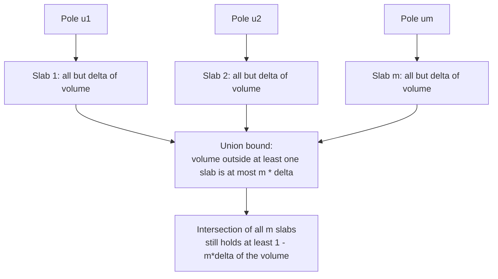
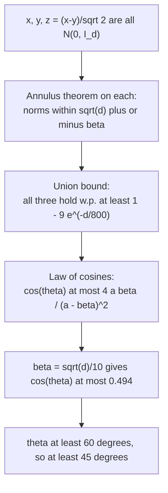
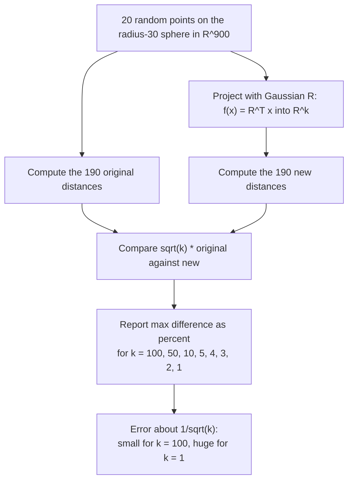
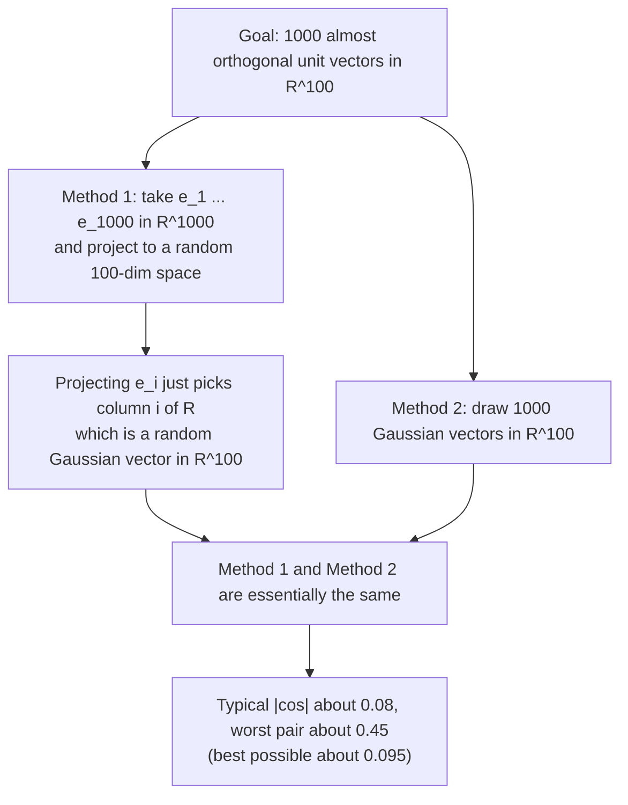

## 0. The toolbox (read this first)

Almost every problem in this set is solved with one or two of the facts below.

| #   | Fact                                                                                                                             | Where in notes | Used in        |
| --- | -------------------------------------------------------------------------------------------------------------------------------- | -------------- | -------------- |
| T1  | Volume scales as $V(r) = c_d r^d$, so the fraction inside radius $(1-\epsilon)r$ is $(1-\epsilon)^d \le e^{-\epsilon d}$         | Notes 2.1, 2.3 | A1, A2, A4, A5 |
| T2  | Coordinate budget: $\sum_k x_k^2 \approx 1$, each coordinate gets $E[x_k^2] = 1/d$                                               | Notes 2.4      | A3, A4         |
| T3  | Thin slab: $\lvert x_1\rvert \le c/\sqrt{d-1}$ for all but $\tfrac{2}{c}e^{-c^2/2}$ of the volume                                | Notes 2.4, 2.5 | A4, A5         |
| T4  | Linear combination of independent Gaussians is Gaussian: $\sum a_i Z_i \sim N(\sum a_i\mu_i, \sum a_i^2\sigma_i^2)$              | Notes 4.2      | B2, B3, C2, C3 |
| T5  | Gaussian Annulus Theorem: $\Pr[\,\lvert \lVert x\rVert - \sqrt d\,\rvert \ge \beta\,] \le 3e^{-c\beta^2}$, with $c = 1/8$ proven | Notes 3.3, 3.9 | B1, B2, B3, C1 |
| T6  | Union bound: $\Pr[\text{any of } m \text{ bad events}] \le \sum \Pr[\text{each}]$                                                | Notes 2.7      | A5, B3         |
| T7  | Random projection $f(v) = (u_1\cdot v, \dots, u_k \cdot v)$ stretches lengths by $\sqrt k$ and is linear                         | Notes 4.3, 4.4 | C2, C3         |

---

# Section A: Volumes and Concentration Near the Surface

## Problem A1 (BHK 2.10)

> How large must $\epsilon$ be for 99% of the volume of a 1000-dimensional unit-radius ball to lie in the shell of $\epsilon$-thickness at the surface of the ball?

### Solution

By Notes 2.1, the inner ball of radius $1-\epsilon$ has volume fraction

$$
\frac{V(1-\epsilon)}{V(1)} = \frac{c_d (1-\epsilon)^d}{c_d \cdot 1^d} = (1-\epsilon)^d
$$

so the shell has volume fraction $1-(1-\epsilon)^d$. We need

$$
1-(1-\epsilon)^{1000} \ge 0.99 \iff (1-\epsilon)^{1000} \le 0.01
$$

**Exact answer.** Take the 1000-th root of both sides:

$$
1-\epsilon \le 0.01^{1/1000} = e^{-\ln(100)/1000} = e^{-0.0046052} \approx 0.995405
$$

$$
\boxed{\epsilon \ge 1 - 0.01^{1/1000} \approx 0.004595}
$$

**Answer using the class bound.** Notes 2.3 gives $(1-\epsilon)^d \le e^{-\epsilon d}$. So it is enough that $e^{-\epsilon d} \le 0.01$:

$$
\epsilon d \ge \ln 100 \approx 4.605 \implies \epsilon \ge \frac{4.605}{1000} = 0.004605
$$

The two answers agree to three decimal places, about $\epsilon \approx 0.0046$ (less than half of one percent).

---

## Problem A2 (BHK 2.17)

> How does the volume of a ball of radius two behave as the dimension of the space increases? What if the radius was larger than two but a constant independent of $d$? What function of $d$ would the radius need to be for a ball of radius $r$ to have approximately constant volume as the dimension increases? Hint: Stirling, $n! \approx (n/e)^n$.

### Step 1: volume formula with Stirling

From Notes 2.2,

$$
V(r) = \frac{\pi^{d/2}}{\Gamma\!\left(\frac d2 + 1\right)}\, r^d
$$

For the Gamma function use $\Gamma\!\left(\frac d2+1\right) = \left(\frac d2\right)! \approx \left(\frac{d}{2e}\right)^{d/2}$ (Stirling, ignoring the lower-order $\sqrt{\cdot}$ factor, which does not change the conclusion). Then

$$
V(r) \approx \pi^{d/2}\left(\frac{2e}{d}\right)^{d/2} r^d = \left(\frac{2\pi e\, r^2}{d}\right)^{d/2}
$$

> [!tip] The one formula to remember
> $$V(r) \approx \left(\frac{2\pi e\, r^2}{d}\right)^{d/2}$$
> 

### Step 2: radius fixed at 2

The base is $\frac{2\pi e \cdot 4}{d} = \frac{8\pi e}{d} \approx \frac{68.3}{d}$.

- While $d < 68.3$, the base is greater than 1 and the volume **grows**.
- Once $d > 68.3$, the base is less than 1. The exponent $d/2$ keeps growing, so the volume **goes to 0, and does so super-exponentially fast** (faster than any $a^{-d}$).

Exact values for $r=2$ (computed with the exact Gamma formula):

| $d$ | 1 | 2 | 3 | 5 | 10 | 20 | 24 | 30 | 50 | 68 | 100 | 200 |
|---|---|---|---|---|---|---|---|---|---|---|---|---|
| $V_d(2)$ | 4 | 12.6 | 33.5 | 168 | 2611 | 27060 | 32373 (max) | 23531 | 195 | 0.08 | $3\times10^{-10}$ | $9\times 10^{-49}$ |

So the volume of the radius-2 ball first **rises to a peak near $d = 24$**, then falls and eventually becomes smaller than 1 (between $d = 50$ and $d = 68$), then collapses to zero. (The exact peak is at $d \approx 2\pi r^2 = 25.1$. Setting the derivative of $\frac d2\ln\frac{2\pi e r^2}{d}$ to zero gives exactly that.)

### Step 3: any constant radius $r > 2$

Same argument: base $= \frac{2\pi e r^2}{d}$. A bigger constant radius only **delays** the collapse. The peak moves to $d \approx 2\pi r^2$ (for $r=3$ it is $d\approx 56$, for $r = 5$ it is $d\approx 156$), but after that the volume still goes to 0 super-exponentially. **No constant radius, however large, keeps the volume from vanishing in high dimension.**

### Step 4: what radius gives constant volume?

We want the base to be about 1:

$$
\frac{2\pi e\, r^2}{d} = 1 \implies \boxed{r = \sqrt{\frac{d}{2\pi e}} = \Theta(\sqrt d)}
$$

With this radius, the exact volume behaves like $\frac{1}{\sqrt{\pi d}}$ (the dropped Stirling factor), which is almost constant. A numerical check: $d=100$ gives exact $V = 0.0563$ versus $1/\sqrt{100\pi} = 0.0564$. So the answer is: **the radius must grow like $\sqrt d$.**
### Sanity check

This matches the lecture's Gaussian picture (Notes 3.2). A typical point of a spherical Gaussian sits at distance $\sqrt d$. A ball that must "hold typical mass" needs radius of order $\sqrt d$. Same $\sqrt d$ scaling, different route.

---

## Problem A3 (BHK 2.9)

> Consider a random point $x$ on the surface of the unit sphere in $\mathbb R^d$. What is the variance of $x_1$? Give an argument without integrals.

### Idea in plain words

The point has total squared length exactly 1. That "budget" of 1 must be split among $d$ coordinates. All coordinates are equivalent (nothing special about the first axis), so each gets an equal share $1/d$.

### Solution (three lines)

1. **Mean is 0.** The distribution is symmetric under $x \mapsto -x$, so $E[x_1] = -E[x_1]$, hence $E[x_1] = 0$.
2. **Budget is exactly 1.** Because $x$ is on the unit sphere, $\sum_{k=1}^d x_k^2 = 1$ always. Take expectations:
$$
\sum_{k=1}^d E[x_k^2] = 1
$$
3. **Symmetry splits it equally.** Rotational invariance (and in particular permuting coordinates) means $E[x_1^2] = E[x_2^2] = \dots = E[x_d^2]$. So $d \cdot E[x_1^2] = 1$.

$$
\boxed{\operatorname{Var}(x_1) = E[x_1^2] - (E[x_1])^2 = \frac1d - 0 = \frac1d}
$$

### Sanity check

- $d=1$: the "sphere" is $\{-1,+1\}$, $x_1 = \pm 1$, variance $1 = 1/d$. Correct.
- $d=2$: $x = (\cos\theta, \sin\theta)$ with uniform $\theta$; $E[\cos^2\theta] = \tfrac12 = 1/d$. Correct.
- This is exactly the "coordinate budget" intuition of Notes 2.4, and it is why the slab in Notes 2.5 has width $\approx 1/\sqrt{d-1}$.

---

## Problem A4 (BHK 2.23)

> Calculate the ratio of the area above the plane $x_1 = \epsilon$ to the area of the upper hemisphere of a unit-radius ball in $d$ dimensions for $\epsilon = 0.001, 0.01, 0.02, 0.03, 0.04, 0.05$ and for $d=100$ and $d = 1000$.

### Setup

Slicing perpendicular to the $x_1$-axis at height $t$ gives a $(d-1)$-dimensional ball of radius $\sqrt{1-t^2}$ (Notes 2.5), whose volume is proportional to $(1-t^2)^{(d-1)/2}$. So

$$
\text{ratio}(\epsilon) = \frac{\int_\epsilon^1 (1-t^2)^{\frac{d-1}{2}}\,dt}{\int_0^1 (1-t^2)^{\frac{d-1}{2}}\,dt}
$$

The natural scaled variable, from the thin-slab theorem, is $c = \epsilon\sqrt{d-1}$. Also, the class bound (Notes 2.4) says the two-sided tail is at most $\frac2c e^{-c^2/2}$, and dividing one tail by the half-ball volume gives

$$
\text{ratio}(\epsilon) \le \frac{2}{c}\,e^{-c^2/2}, \qquad c=\epsilon\sqrt{d-1}
$$

(valid but only useful once it drops below 1).

### Results (numerical integration of the formula above)

The "sphere-surface" column is the same computation if "area" is read literally as surface area of the sphere (the density is then $(1-t^2)^{(d-3)/2}$). The two readings agree to about two decimal places, so the conclusion does not depend on which you pick.

**$d = 100$**

| $\epsilon$ | $c = \epsilon\sqrt{d-1}$ | Ratio (ball volume) | Ratio (sphere surface) | Class bound $\frac2c e^{-c^2/2}$ |
|---|---|---|---|---|
| 0.001 | 0.010 | 0.9920 | 0.9921 | vacuous (>1) |
| 0.01 | 0.099 | 0.9201 | 0.9209 | vacuous (>1) |
| 0.02 | 0.199 | 0.8411 | 0.8426 | vacuous (>1) |
| 0.03 | 0.298 | 0.7636 | 0.7658 | vacuous (>1) |
| 0.04 | 0.398 | 0.6883 | 0.6913 | vacuous (>1) |
| 0.05 | 0.497 | 0.6160 | 0.6195 | vacuous (>1) |

**$d = 1000$**

| $\epsilon$ | $c = \epsilon\sqrt{d-1}$ | Ratio (ball volume) | Ratio (sphere surface) | Class bound $\frac2c e^{-c^2/2}$ |
|---|---|---|---|---|
| 0.001 | 0.032 | 0.9748 | 0.9748 | vacuous (>1) |
| 0.01 | 0.316 | 0.7518 | 0.7520 | vacuous (>1) |
| 0.02 | 0.632 | 0.5269 | 0.5274 | vacuous (>1) |
| 0.03 | 0.948 | 0.3426 | 0.3430 | vacuous (>1) |
| 0.04 | 1.264 | 0.2056 | 0.2061 | 0.7114 |
| 0.05 | 1.580 | 0.1135 | 0.1139 | 0.3630 |

### How to read the tables

1. **For the same $\epsilon$, the ratio is much smaller in $d = 1000$ than in $d=100$.** At $\epsilon = 0.05$: 62% of the upper half lies above the plane when $d=100$, only 11% when $d=1000$. Higher dimension pushes the volume towards the equator $x_1 = 0$.
2. **The ratio is controlled by $c = \epsilon\sqrt{d-1}$, not $\epsilon$ alone.** Put the rows of both tables in order of $c$ and the ratio falls smoothly, whichever $d$ it came from: $c=0.199\to0.841$, $c=0.316\to0.752$, $c=0.497\to0.616$, $c=0.632\to0.527$, $c=0.948\to0.343$, $c=1.264\to0.206$. That is the $\Theta(1/\sqrt{d-1})$ slab width of Notes 2.5.
3. **The bound is correct but conservative.** It is useless for small $c$ (it exceeds 1) and overestimates when it does apply (0.71 vs exact 0.21). This is exactly the caveat in Notes 2.5 ("the theoretical bound sits above the exact data").

---

## Problem A5 (BHK 2.24 and 2.25)

### Part (a): different North Poles, different equators

> Almost all the volume of a high-dimensional ball lies in a narrow slice at the equator, but the slice depends on the point designated the North Pole. How can this be true for several different choices of North Pole, which give different equators?

### Idea in plain words

"Almost all" does not mean "all". For each single North Pole, the volume **outside** its equatorial slab is tiny (say a fraction $\delta$). If you pick $m$ different North Poles, the volume that escapes **at least one** of the $m$ slabs is at most $m\delta$, which is still tiny if $m\delta \ll 1$. So most of the volume lies in **all $m$ slabs at once**.

### Solution

Fix a pole direction $u$ (unit vector). By Notes 2.4, for $x$ uniform in the ball,

$$
\Pr\!\left[\,|\langle x,u\rangle| > \frac{c}{\sqrt{d-1}}\right] \le \frac{2}{c}e^{-c^2/2} =: \delta
$$

Now take poles $u_1,\dots,u_m$. By the union bound (T6),

$$
\Pr[\text{some } |\langle x,u_j\rangle| > \tfrac{c}{\sqrt{d-1}}] \le m\,\delta
$$

So with probability at least $1-m\delta$, the point $x$ is simultaneously close to the equator for **every** pole. Choose $c = \sqrt{6\ln m}$ and $m\delta = O(1/m^2)$: one can handle even very many poles. This is exactly the content of the near-orthogonality theorem in Notes 2.6: among $n$ random points, all pairs have $|\langle x_i,x_j\rangle| \le \sqrt{6\ln n/(d-1)}$. The number of poles can even be exponential in $d$, as long as $\ln m \ll d$.

**Why different equators do not contradict each other:** in high dimensions, a typical point $x$ is *nearly orthogonal to any fixed direction* (it is at about 90 degrees). It is therefore near the equator **of every pole you fix in advance**. The equators overlap massively: the intersection of many equatorial slabs is still almost the whole ball.

> [!warning] Where the statement genuinely fails
> The statement is **per fixed direction** (Notes 2.4: "a per-direction statement, not a claim that every direction is simultaneously fine"). A point $x$ with $\lVert x\rVert \approx 1$ is *not* near the equator of the pole $u = x/\lVert x\rVert$, since $\langle x, u\rangle \approx 1$. The pole must be chosen independently of $x$ (or there must be only modestly many poles).

### Diagram



### Part (b): equator slab and surface annulus at the same time

> Explain how the volume can simultaneously be in a narrow slice at the equator and also concentrated in a narrow annulus at the surface.

### Idea in plain words

The two statements constrain **different things**:
- the **annulus** constrains the distance from the center, $\lVert x\rVert$ (radial direction),
- the **slab** constrains one coordinate, $x_1$ (along one axis).

A point can have $\lVert x\rVert \approx 1$ **and** $x_1 \approx 0$ with no conflict. For instance $x = (0, 1, 0, \dots,0)$ is on the surface and on the equator.

### Solution

Let $S$ = "outside the surface shell": $\lVert x\rVert < 1-\epsilon$ with $\epsilon = C/d$ for a large constant $C$ (a shell of width $O(1/d)$), and let $E$ = "outside the equatorial slab": $|x_1| > c/\sqrt{d-1}$. From Notes 2.3 and 2.4:

$$
\Pr[S] \le e^{-\epsilon d} \text{ (tiny for } \epsilon d \text{ large)}, \qquad \Pr[E] \le \tfrac{2}{c}e^{-c^2/2}\text{ (tiny for } c \text{ large)}
$$

Union bound:

$$
\Pr[\text{in shell and in slab}] \ge 1 - \Pr[S] - \Pr[E] \approx 1
$$

**Geometric picture.** The shell has thickness $\Theta(1/d)$ in the radial direction. The slab has width $\Theta(1/\sqrt d)$ in the $x_1$ direction. Note $1/d \ll 1/\sqrt d$: the shell is much thinner than the slab, but they cut the ball in different directions. Intersecting them leaves an "equatorial band of the sphere", and that band has almost all of the surface area. Equivalent statement in sphere terms: for a point **on the unit sphere**, $x_1$ has variance $1/d$ (A3), so $|x_1| \approx 1/\sqrt d$ is typical, which means nearly every point of the sphere's surface is near its equator.

---

# Section B: High-Dimensional Gaussians and Near-Orthogonality

## Problem B1 (BHK 2.8)

> Let $G$ be a $d$-dimensional spherical Gaussian with variance $\tfrac12$ in each direction, centered at the origin. Derive the expected squared distance to the origin.

### Idea in plain words

Squared distance to the origin is $\sum g_i^2$. Expectation is linear, so add up the expected squares of the coordinates. The expected square of a mean-zero variable is just its variance.

### Solution

The coordinates $g_1,\dots,g_d$ are independent $N(0,\tfrac12)$. The squared distance to the origin is $\lVert G\rVert^2 = \sum_{i=1}^d g_i^2$. Then

$$
E\big[\lVert G\rVert^2\big] = \sum_{i=1}^d E[g_i^2] = \sum_{i=1}^d \Big(\underbrace{\operatorname{Var}(g_i)}_{=1/2} + \underbrace{(E g_i)^2}_{=0}\Big) = \frac d2
$$

$$
\boxed{E\big[\lVert G\rVert^2\big] = \frac d2}
$$

### Generalization and link to the Annulus Theorem

With variance $\sigma^2$ per coordinate, $E[\lVert G\rVert^2] = d\sigma^2$. For $\sigma^2 = 1$ this is the $d$ from Notes 3.1. For $\sigma^2=\frac12$, $G = x/\sqrt 2$ where $x\sim N(0,I_d)$, so by the Annulus Theorem (Notes 3.3)

$$
\lVert G\rVert = \frac{\lVert x\rVert}{\sqrt2} \in \sqrt{\frac d2} \pm \frac{\beta}{\sqrt 2}
$$

So the typical distance is $\sqrt{d/2}$, and almost all of the mass sits on a shell of width $O(1)$ around that radius.

---

## Problem B2 (BHK 2.28)

> Let $x$ and $y$ be $d$-dimensional zero-mean, unit-variance Gaussian vectors. Prove that $x$ and $y$ are almost orthogonal by considering their dot product.

### Idea in plain words

"Almost orthogonal" means the **cosine of the angle** is close to 0:

$$
\cos\theta = \frac{\langle x,y\rangle}{\lVert x\rVert\,\lVert y\rVert}
$$

The dot product is a sum of $d$ random terms with random signs, so it only grows like $\sqrt d$ (random signs cancel). The lengths grow like $\sqrt d$ each, so the product of lengths grows like $d$. Ratio: $\sqrt d/d = 1/\sqrt d \to 0$.

### Step 1: quick calculation (intuition)

Since $x_i,y_i$ are independent with mean 0 and variance 1:

$$
E[\langle x,y\rangle] = \sum_i E[x_i]E[y_i] = 0, \qquad
\operatorname{Var}(\langle x,y\rangle) = \sum_i E[x_i^2]\,E[y_i^2] = d
$$

So $|\langle x,y\rangle| \approx \sqrt d$. By the Annulus Theorem, $\lVert x\rVert,\lVert y\rVert \approx \sqrt d$. Hence

$$
|\cos\theta| \approx \frac{\sqrt d}{\sqrt d\cdot\sqrt d} = \frac1{\sqrt d} \to 0
$$

### Step 2: rigorous proof with high probability

**(i) Condition on $y$ -** Consider y as constant. The dot product $\langle x,y\rangle = \sum_i y_i x_i$ is a linear combination of independent Gaussians with fixed coefficients $y_i$. By T4 (Notes 4.2),

$$
\langle x,y\rangle \mid y \;\sim\; N\big(0,\ \textstyle\sum_i y_i^2\big) = N\big(0,\lVert y\rVert^2\big)
$$

Hence $Z := \langle x,y\rangle/\lVert y\rVert \sim N(0,1)$ **regardless of $y$**. The standard Gaussian (Chernoff) tail gives, for every $t>0$,

$$
\Pr[\,|Z| \ge t\,] \le 2e^{-t^2/2}
$$

**(ii) Lower-bound $\lVert x\rVert$.** Apply the Annulus Theorem (T5) with $\beta = \sqrt d/2$:

$$
\Pr\Big[\lVert x\rVert \le \tfrac{\sqrt d}{2}\Big] \le 3e^{-\beta^2/8} = 3e^{-d/32}
$$

**(iii) Combine.** Note $\cos\theta = \dfrac{\langle x,y\rangle}{\lVert y\rVert\,\lVert x\rVert} = \dfrac{Z}{\lVert x\rVert}$. Outside the two bad events (union bound),

$$
|\cos\theta| \le \frac{t}{\sqrt d/2} = \frac{2t}{\sqrt d}
$$

Choose $t = \sqrt{2\ln d}$. Then $2e^{-t^2/2} = 2/d$, and

$$
\boxed{\Pr\left[|\cos\theta| \le 2\sqrt{\frac{2\ln d}{d}}\right] \ge 1 - \frac 2d - 3e^{-d/32}\;\longrightarrow\;1}
$$

So with probability tending to 1, $|\cos\theta| = O\big(\sqrt{\ln d/d}\big) \to 0$, meaning $x$ and $y$ are almost orthogonal. 

---

## Problem B3 (BHK 2.29)

> Prove that with high probability, the angle between two random vectors in a high-dimensional space is at least $45^\circ$. Hint: use the Gaussian Annulus Theorem.

### Idea in plain words

Use the **law of cosines** (here: the polarization identity) to get the angle from three lengths: $\lVert x\rVert$, $\lVert y\rVert$, $\lVert x-y\rVert$. All three are Gaussian vectors, so the Annulus Theorem pins all three lengths: $\approx\sqrt d$, $\sqrt d$ and $\sqrt{2d}$. Those are the side lengths of a right triangle, so the angle is about $90^\circ$, comfortably above $45^\circ$.

### Setup

Let $x,y\sim N(0,I_d)$ independent, with angle $\theta$ between them. The law of cosines gives

$$
\lVert x-y\rVert^2 = \lVert x\rVert^2+\lVert y\rVert^2-2\lVert x\rVert\lVert y\rVert\cos\theta
\;\Longrightarrow\;
\cos\theta = \frac{\lVert x\rVert^2+\lVert y\rVert^2-\lVert x-y\rVert^2}{2\lVert x\rVert\lVert y\rVert}
$$

```
        x            sides:  |x| ~ sqrt(d)
       /|                    |y| ~ sqrt(d)
      / |                    |x-y| ~ sqrt(2d)
     /  | x - y
    /   |                    sqrt(d)^2 + sqrt(d)^2 = sqrt(2d)^2
   o----y                    => Pythagoras => right angle
```

### Step 1: all three vectors are Gaussians

- $x\sim N(0,I_d)$ and $y\sim N(0,I_d)$.
- Let $z := (x-y)/\sqrt2$. Each coordinate $(x_i - y_i)/\sqrt2$ is a linear combination of independent Gaussians (T4), with mean 0 and variance $\frac{1+1}{2}=1$, and the coordinates are independent. So $z\sim N(0,I_d)$ and $\lVert x-y\rVert = \sqrt2\,\lVert z\rVert$.

### Step 2: apply the Annulus Theorem three times

Let $\beta = \sqrt d/10$. Each of $x$, $y$, $z$ satisfies $\sqrt d-\beta \le\lVert\cdot\rVert\le\sqrt d+\beta$, except with probability at most $3e^{-\beta^2/8} = 3e^{-d/800}$. By the union bound, all three hold simultaneously with probability at least

$$
1-9e^{-d/800}\;\longrightarrow\;1 \quad (d\to\infty)
$$

### Step 3: bound the cosine

Write $a=\sqrt d$. On the good event:

- Numerator: $\lVert x\rVert^2+\lVert y\rVert^2 \le 2(a+\beta)^2$ and $\lVert x-y\rVert^2 = 2\lVert z\rVert^2 \ge 2(a-\beta)^2$. So
$$
\lVert x\rVert^2+\lVert y\rVert^2-\lVert x-y\rVert^2 \le 2\big[(a+\beta)^2-(a-\beta)^2\big] = 8a\beta
$$
- Denominator: $2\lVert x\rVert\lVert y\rVert \ge 2(a-\beta)^2$.

Therefore

$$
\cos\theta \le \frac{8a\beta}{2(a-\beta)^2} = \frac{4a\beta}{(a-\beta)^2}
= \frac{4\cdot\frac1{10}}{\left(\frac9{10}\right)^2} = \frac{0.4}{0.81}\approx 0.494
$$

Since $\cos 45^\circ = 0.707 > 0.494$, we get $\theta > \arccos(0.494)\approx 60.4^\circ \ge 45^\circ$.

$$
\boxed{\Pr[\theta \ge 45^\circ]\ \ge\ 1-9e^{-d/800}}
$$

### Remarks

- We actually proved the stronger statement $\theta \ge 60^\circ$. Choosing a smaller $\beta$ (e.g. $\beta = d^{1/4}$) gives $\cos\theta \le 4d^{-1/4}(1+o(1))$, so the angle approaches $90^\circ$. This agrees with B2.
- Only an **upper** bound on $\cos\theta$ is needed for "angle at least $45^\circ$".
- The constant $1/800$ comes from the class constant $c=1/8$ and is pessimistic, like all bounds from that proof (Notes 3.10).



---

# Section C: Random Projection and the JL Lemma

## Problem C1 (BHK 2.30)

> Project the volume of a $d$-dimensional ball of radius $\sqrt d$ onto a line through the center. For large $d$, give an intuitive argument that the projected volume should behave like a Gaussian.

### Idea in plain words

Projecting onto a line (say the $x_1$-axis) means: at each height $t$, add up the volume of the slice of the ball at that height. The slice is a smaller ball of one lower dimension. Its volume is a power $(\cdot)^{(d-1)/2}$, and powers of this type turn into $e^{-t^2/2}$, the Gaussian shape.

### Solution

Take the ball of radius $R = \sqrt d$. The slice at height $t$ is a $(d-1)$-dimensional ball of radius $\sqrt{R^2-t^2} = \sqrt{d-t^2}$ (Notes 2.5). Its volume is proportional to the radius to the power $d-1$, so the projected density at $t$ is

$$
p(t)\ \propto\ (d-t^2)^{\frac{d-1}{2}}\ =\ d^{\frac{d-1}2}\Big(1-\frac{t^2}d\Big)^{\frac{d-1}2}
$$

Now use the "power to exponential" trick from Notes 2.5 ($\ln(1-s)\approx -s$ for small $s$; here $s = t^2/d$ is small for fixed $t$ and large $d$):

$$
\Big(1-\frac{t^2}d\Big)^{\frac{d-1}2}
= \exp\!\Big(\frac{d-1}{2}\ln\Big(1-\frac{t^2}{d}\Big)\Big)
\approx \exp\!\Big(-\frac{(d-1)\,t^2}{2d}\Big)\ \xrightarrow{d\to\infty}\ e^{-t^2/2}
$$

The factor $d^{(d-1)/2}$ does not depend on $t$, so it only normalizes. Hence

$$
\boxed{p(t)\ \propto\ e^{-t^2/2}\quad\Longrightarrow\quad \text{the projection is (approximately) } N(0,1)}
$$

### Second, independent argument (variance check)

The ball of radius $\sqrt d$ has almost all its volume near the surface (Notes 2.3), so a typical point has $\lVert x\rVert^2\approx d$. By symmetry (A3 argument), $E[x_1^2] = \frac{E\lVert x\rVert^2}{d}\approx \frac dd=1$. So the projection has mean 0 and variance 1, the same as $N(0,1)$. This also matches the Gaussian: both the uniform ball of radius $\sqrt d$ and $N(0,I_d)$ live on the sphere of radius $\approx\sqrt d$ (Notes 3.3), and the first coordinate of $N(0,I_d)$ is exactly $N(0,1)$.

### Diagram


---

## Problem C2 (BHK 2.37)

> Generate 20 points uniformly at random on a 900-dimensional sphere of radius 30. Calculate the distance between each pair. Then select a method of projection and project the data onto subspaces of dimension $k=100,50,10,5,4,3,2,1$ and calculate the difference between $\sqrt k$ times the original distances and the new pairwise distances. For each $k$, what is the maximum difference as a percent of $\sqrt k$?

### Idea in plain words

The Random Projection Theorem (Notes 4.4) says a Gaussian projection $f$ to $k$ dimensions stretches every length by about $\sqrt k$ (not 1), with relative error of order $1/\sqrt k$. So if we compare $\lVert f(x)-f(y)\rVert$ with $\sqrt k\,\lVert x-y\rVert$, the error should shrink as $k$ grows, and get big for tiny $k$. The experiment checks this.

### Method

- **Points:** draw $g\sim N(0,I_{900})$, scale to radius 30: $x = 30\,g/\lVert g\rVert$. This is uniform on the sphere.
- **Projection (Gaussian, Notes 4.3):** a $900\times k$ matrix $R$ with i.i.d. $N(0,1)$ entries, $f(x)=R^{T}x$ (no $1/\sqrt k$ scaling, exactly as in the theorem, which is why we compare to $\sqrt k\times$ original).
- **Error measured two ways** (the problem statement's wording "percent of $\sqrt k$" is ambiguous):
  - **(i)** $\max_{i<j}\dfrac{\big|\sqrt k\,\lVert x_i-x_j\rVert-\lVert f(x_i)-f(x_j)\rVert\big|}{\sqrt k\,\lVert x_i-x_j\rVert}\times100\%$. This is the natural "relative distortion", the $\epsilon$ of the JL lemma.
  - **(ii)** $\max\big|\sqrt k\,\text{orig}-\text{new}\big|\,/\sqrt k$, in distance units: the literal "difference divided by $\sqrt k$". It equals the error in the units of the original distances (which are about 42.5).

### Code

```python
import numpy as np

rng = np.random.default_rng(7)
n, d = 20, 900
X = rng.standard_normal((n, d))
X = 30 * X / np.linalg.norm(X, axis=1, keepdims=True)   # radius-30 sphere
iu = np.triu_indices(n, 1)

def pairwise(Y):
    D = np.linalg.norm(Y[:, None, :] - Y[None, :, :], axis=2)
    return D[iu]

D0 = pairwise(X)   # original 190 distances (about 42.4 each)
for k in [100, 50, 10, 5, 4, 3, 2, 1]:
    R = rng.standard_normal((d, k))          # Gaussian projection
    D1 = pairwise(X @ R)
    diff = np.abs(np.sqrt(k) * D0 - D1)
    rel = diff / (np.sqrt(k) * D0)
    print(k, diff.max() / np.sqrt(k), 100 * rel.max(), 100 * rel.mean())
```

### Results (one run, seed 7)

Original distances: min 40.9, mean 42.5, max 44.1 (all close to $30\sqrt2\approx 42.4$, itself a near-orthogonality effect: two random points on the sphere are nearly perpendicular, so $\lVert x-y\rVert^2\approx \lVert x\rVert^2+\lVert y\rVert^2=1800$).

| $k$ | (i) max relative error, % of $\sqrt k\times$ dist | mean relative error, % | (ii) max $\lvert\text{diff}\rvert/\sqrt k$ (distance units) | predicted typical error $\approx 1/\sqrt{2k}$ |
|---|---|---|---|---|
| 100 | 19.5 | 5.3 | 8.2 | 7.1% |
| 50 | 32.4 | 8.2 | 13.7 | 10% |
| 10 | 79.0 | 19.3 | 33.4 | 22% |
| 5 | 80.9 | 24.2 | 34.9 | 32% |
| 4 | 94.9 | 32.3 | 40.9 | 35% |
| 3 | 90.8 | 33.4 | 38.1 | 41% |
| 2 | 132.1 | 38.0 | 57.2 | 50% |
| 1 | 148.6 | 50.6 | 63.1 | 71% |

### How to read it

1. **Error falls as $k$ grows**, roughly like $1/\sqrt k$ (compare the mean column with the prediction column). For $k=100$ the *typical* pair is off by about 5%, while the *worst of 190 pairs* is off by 19.5%.
2. **Why is the maximum much larger than the mean?** The JL lemma needs **all** $\binom n2=190$ pairs to be good at once; the worst pair is about 3 standard deviations out. This is the union bound of Notes 4.7 in action: the price of covering all pairs at once.
3. **For $k$ = 1, 2 the projection is useless** (errors over 100%). In Notes 4.15 terms, we are nowhere near $k \gtrsim \epsilon^{-2}\ln n$. Check: $\ln 20\approx 3.0$; even $\epsilon=0.3$ would want $k\gtrsim 3.0/0.09 \approx 33$ (up to the constant).
4. The small non-monotonic blips ($k=3$ vs $k=4$) are random fluctuations. Rerun with another seed and they move.
5. **Nothing depends on $d=900$.** The error depends only on $k$ (and $n$), which is the headline of Notes 4.4 and 4.8.



---

## Problem C3 (BHK 2.38)

> In $d$ dimensions there are exactly $d$ pairwise orthogonal unit vectors, but you might squeeze in more if they only need to be *almost* orthogonal. To find 1000 almost-orthogonal vectors in 100 dimensions: (1) begin with 1000 orthonormal 1000-dimensional vectors and project them to a random 100-dimensional space; (2) generate 1000 100-dimensional random Gaussian vectors. Implement both and compare.

### Idea in plain words

Both methods should work about equally well, because they are nearly the same procedure in disguise. In method (1), projecting the standard basis vector $e_i$ with a Gaussian matrix $R$ just *selects column $i$ of $R$*, which is a random Gaussian vector in 100 dimensions. That is exactly method (2). Near-orthogonality in both cases comes from the same source: independent random vectors in $\mathbb R^{100}$ have cosines of order $1/\sqrt{100}=0.1$ (B2, Notes 2.6).

### Code

```python
import numpy as np

rng = np.random.default_rng(11)
N, D, d = 1000, 1000, 100
iu = np.triu_indices(N, 1)

def report(V, name):
    V = V / np.linalg.norm(V, axis=1, keepdims=True)   # make unit vectors
    G = V @ V.T                                        # cosines (Gram matrix)
    off = np.abs(G[iu])                                # off-diagonal |cos|
    print(name, "max %.3f  mean %.3f  99th pct %.3f  frac>0.3 %.4f"
          % (off.max(), off.mean(), np.quantile(off, 0.99), (off > 0.3).mean()))

# Method 1a: Gaussian projection of the orthonormal basis e_1..e_1000
R = rng.standard_normal((d, D)) / np.sqrt(d)
report((R @ np.eye(D)).T, "M1 gaussian projection")

# Method 1b: projection onto a random 100-dim SUBSPACE (orthonormal basis Q)
Q, _ = np.linalg.qr(rng.standard_normal((D, d)))
report(Q, "M1 orthonormal subspace ")         # rows of Q are projected e_i

# Method 2: 1000 random Gaussian vectors in R^100
report(rng.standard_normal((N, d)), "M2 gaussian vectors    ")
```

### Results (1000 vectors in 100 dimensions, 499,500 pairs)

| Method | max $\lvert\cos\theta\rvert$ | mean $\lvert\cos\theta\rvert$ | 99th percentile | fraction of pairs with $\lvert\cos\rvert>0.3$ |
|---|---|---|---|---|
| (1a) project basis with Gaussian matrix | 0.466 | 0.080 | 0.255 | 0.24% |
| (1b) project onto random 100-dim subspace | 0.417 | 0.076 | 0.243 | 0.13% |
| (2) random Gaussian vectors | 0.434 | 0.080 | 0.255 | 0.23% |

Repeating with other seeds gives max values between 0.41 and 0.47 for all methods, with the same means.

### Interpretation

1. **Methods (1a) and (2) are statistically identical** (same mean, same 99th percentile), as argued above. Differences in the max column are just sampling noise.
2. **Method (1b), the orthonormal-subspace version, is very slightly better** (mean 0.076 vs 0.080, fewer large cosines). The reason: its rows come from a matrix with exactly orthonormal columns, so the Gram matrix $QQ^T$ is an exact projection with less randomness in the row lengths. The gain is tiny, so in practice the cheap Gaussian version (2) is just as good.
3. **Typical angle:** mean $|\cos|\approx0.08\approx \sqrt{2/\pi}\cdot\frac1{\sqrt{100}}$, matching the $1/\sqrt d$ prediction of B2. So a typical pair is about $85^\circ$ apart.
4. **The worst pair is much worse than the typical one.** With about half a million pairs, some pair reaches $|\cos|\approx0.45$ ($\approx 63^\circ$). Theory: the max over $N_p$ pairs is about $\sqrt{2\ln N_p/d}=\sqrt{2\ln(499500)/100}\approx 0.51$, the same union-bound scaling as the $\sqrt{6\ln n/(d-1)}$ bound of Notes 2.6.
5. **Comparison with the best possible.** The Welch lower bound says no set of 1000 unit vectors in $\mathbb R^{100}$ can have all pairwise $|\cos|$ below $\sqrt{\frac{N-d}{d(N-1)}}\approx0.095$. Random choice gets about 0.45, which is a factor of about 4.5 worse than optimal, but it costs nothing and needs no construction. If "almost orthogonal" means only $|\cos|\lesssim 0.5$, then 1000 vectors in 100 dimensions is easy, ten times more than the $d=100$ exactly orthogonal ones. The number of almost-orthogonal vectors can even grow exponentially with $d$ (Notes 2.6: fine whenever $d\gg\ln n$).



---

# Quick revision sheet

| Problem | Answer in one line |
|---|---|
| A1 | $\epsilon = 1-0.01^{1/1000}\approx 0.0046 \approx 4.6/d$ |
| A2 | $V(r)\approx(2\pi e r^2/d)^{d/2}$: for fixed $r$ it rises then $\to0$ super-exponentially (peak near $d\approx2\pi r^2$, $d\approx24$ for $r=2$); constant volume needs $r=\Theta(\sqrt d)$, specifically $r=\sqrt{d/(2\pi e)}$ |
| A3 | $\operatorname{Var}(x_1)=1/d$ by coordinate budget and symmetry |
| A4 | Ratio depends on $c=\epsilon\sqrt{d-1}$; e.g. $\epsilon=0.05$: 0.616 at $d=100$, 0.114 at $d=1000$ |
| A5(a) | Union bound: many equators, each holds all but $\delta$; all together hold all but $m\delta$. Holds per fixed direction only |
| A5(b) | Shell constrains $\lVert x\rVert$ (width $1/d$), slab constrains $x_1$ (width $1/\sqrt d$); different directions, both hold by union bound |
| B1 | $E\lVert G\rVert^2 = d/2$ |
| B2 | $\langle x,y\rangle\mid y\sim N(0,\lVert y\rVert^2)$, so $\lvert\cos\theta\rvert\le 2\sqrt{2\ln d/d}$ w.h.p. |
| B3 | Annulus on $x$, $y$, $(x-y)/\sqrt2$ gives $\cos\theta\le0.494$, angle at least $60^\circ\ge45^\circ$ w.p. $\ge1-9e^{-d/800}$ |
| C1 | Slice volume $\propto(1-t^2/d)^{(d-1)/2}\to e^{-t^2/2}$: standard Gaussian |
| C2 | Relative error about $1/\sqrt{2k}$ typical; worst of 190 pairs about 3 standard deviations: 19.5% at $k=100$, about 150% at $k=1$ |
| C3 | Methods 1 and 2 are the same in distribution; typical $\lvert\cos\rvert\approx0.08$, worst about 0.45 |

> [!tip] Exam habits that these problems reward
> 1. Turn $(1-\epsilon)^d$ into $e^{-\epsilon d}$ and ask whether the exponent stays constant.
> 2. "Almost all" for one object becomes "almost all" for many objects via the **union bound**.
> 3. Anything involving lengths of Gaussian vectors: think $\sqrt{\text{dimension}}$ with $O(1)$ width.
> 4. Anything involving a dot product of independent random vectors: think mean 0, typical size $\sqrt{\text{sum of variances}}$.
