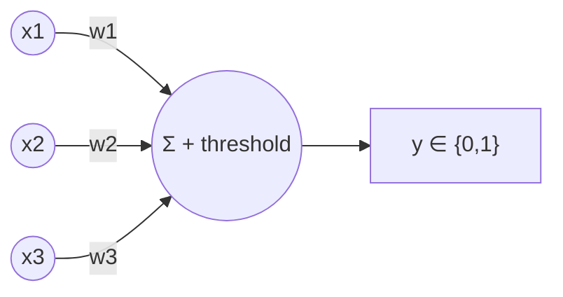
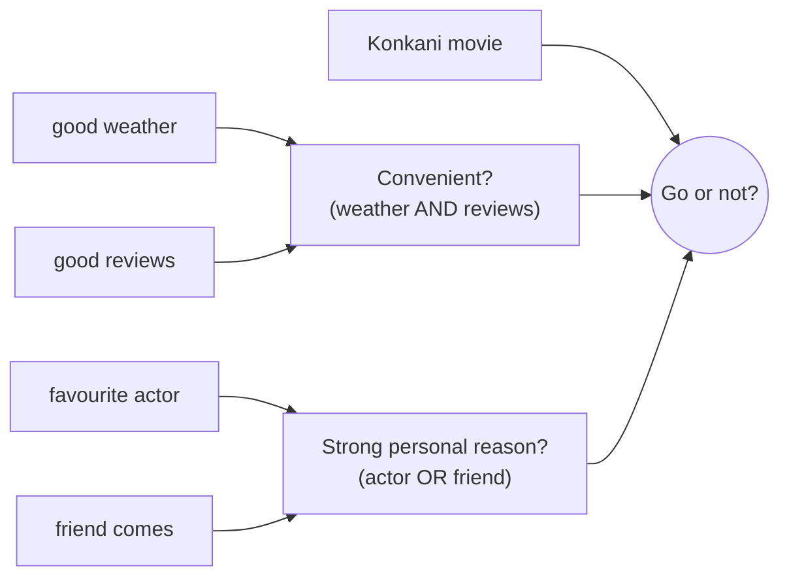
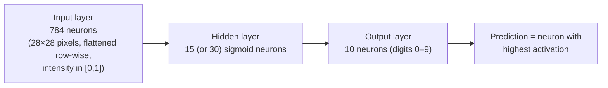
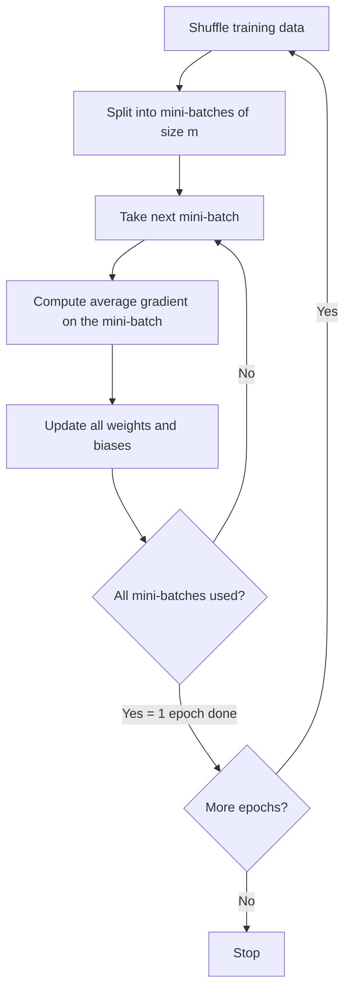

# Ch1 — Perceptrons, Sigmoid Neurons, Gradient Descent

Back to [[00 - NN Index]]

---

## 2. The Perceptron

A perceptron takes binary inputs, weighs them, and outputs a binary decision.

- Inputs: $x_1, x_2, \dots, x_n \in \{0,1\}$
- Weights: $w_j$ = how strongly input $j$ influences the decision
- Output: $y \in \{0,1\}$ (e.g. approve/reject a loan; inputs could be income OK, credit history good, has collateral…)

### Threshold form
$$
y = \begin{cases} 1, & \sum_j w_j x_j > \text{threshold} \\ 0, & \sum_j w_j x_j \le \text{threshold} \end{cases}
$$

- **Positive weight** → input supports output 1.
- **Negative weight** → input opposes output 1.
- **Threshold** → how much total evidence is needed to say 1.

> [!example] Slide example
> $x = (1,0,1)^T,\ w = (2,-1,1)^T,\ \text{threshold}=2$
> $\sum w_jx_j = 2(1) + (-1)(0) + 1(1) = 3 > 2 \Rightarrow y = 1$
> If threshold becomes 4: $3 \le 4 \Rightarrow y = 0$.

### Bias form (used from now on)
Move threshold to the left and define $b = -\text{threshold}$:
$$
y = \begin{cases} 1, & w\cdot x + b > 0 \\ 0, & w\cdot x + b \le 0 \end{cases}
$$

- **Bias** = how easy it is to make the perceptron output 1.
  - Large positive $b$ → easy to fire.
  - Very negative $b$ → hard to fire.
- Changing $b$ does **not** change the importance of individual inputs; it changes **how much total evidence is required**.

> [!example] Bias exercise: $w\cdot x = 2$
> | $b$ | $w\cdot x + b$ | $y$ |
> |---|---|---|
> | $-3$ | $-1$ | 0 |
> | $-1$ | $1$ | 1 |
> | $2$ | $4$ | 1 |

### Perceptron = linear classifier
- Decision boundary (2 inputs): $w_1x_1 + w_2x_2 + b = 0$ → a **line**.
- In higher dimensions → a **hyperplane**.
- $> 0$ side → class 1, $\le 0$ side → class 0.

### XOR cannot be done by one perceptron

| $x_1$ | $x_2$ | $y$ (XOR) |
|---|---|---|
| 0 | 0 | 0 |
| 0 | 1 | 1 |
| 1 | 0 | 1 |
| 1 | 1 | 0 |

- The 1s sit on opposite corners of the square; no single straight line separates them.
- XOR is **not linearly separable** → one perceptron can't do it → we need **hidden layers**.

### Perceptrons as logic gates

**NAND:** $w_1 = w_2 = -2,\ b = 3$, $z = -2x_1 - 2x_2 + 3$

| $x_1$ | $x_2$ | $z$ | $y$ |
|---|---|---|---|
| 0 | 0 | 3 | 1 |
| 0 | 1 | 1 | 1 |
| 1 | 0 | 1 | 1 |
| 1 | 1 | −1 | 0 |

✅ It's NAND. Since NAND is a universal gate, networks of perceptrons can compute **any logical function** (the slides show a 1-bit adder: sum $x_1 \oplus x_2$ and carry $x_1x_2$ built from NAND perceptrons).

> [!note] Input layer convention
> The input "neurons" in diagrams are **not** real perceptrons/sigmoids. They just output the input value: $a^1_i = x_i$.

**OR check:** $w = (1.1,\ 3.1)^T,\ b = -2.2$

| $x_1$ | $x_2$ | $z$  | Wanted | Got |
| ----- | ----- | ---- | ------ | --- |
| 0     | 0     | −2.2 | 0      | 0   |
| 0     | 1     | 0.9  | 1      | 1   |
| 1     | 0     | −1.1 | 1      | 0   |
| 1     | 1     | 2.0  | 1      | 1   |

Not OR. And changing $w_1$ from 1.1 → 1.2 gives $z=-1.0$, output still 0. **Small changes often do nothing.**

### Multi-layer perceptrons build abstract decisions
"Should I go to the movie?" — inputs: good weather, Konkani movie, good reviews, favourite actor, friend coming.

- Early layers combine **simple** conditions.
- Later layers combine those into **more complex/abstract** evidence.
- Output perceptron makes the final decision.

---

## 3. Problem with perceptrons → need smoothness

Same OR perceptron, input $(1,0)$, $b=-2.2$, so $z = w_1 - 2.2$:

| $w_1$ | $z$ | Output |
|---|---|---|
| 2.19 | −0.01 | 0 |
| 2.21 | +0.01 | 1 |

- A change of only **0.02** flips the output. The activation is a **step function**.
- Small parameter changes either do **nothing** or cause a **sudden jump**.
- In a network, one flip can also abruptly change everything downstream.
- **Learning needs:** small change in weights → small, predictable change in output.

---

## 4. The Sigmoid Neuron

Replace the step with a smooth S-curve.

$$
z = w\cdot x + b = \sum_j w_j x_j + b, \qquad a = \sigma(z) = \frac{1}{1+e^{-z}}
$$

- Output: $0 < \sigma(z) < 1$ (inputs can now be real values in $[0,1]$ too)
- Large positive $z$ → $\sigma \to 1$; large negative $z$ → $\sigma \to 0$
- $\sigma(0) = 0.5$
- Also called the **logistic function**.
- Steepest near $z=0$, **flat** for large $|z|$ (this flatness = **saturation**, it causes slow learning later).

**Derivative (memorize):**
$$
\sigma'(z) = \sigma(z)\,\big(1-\sigma(z)\big) = a(1-a)
$$
Max value $= 0.25$ at $z = 0$.

> [!example] OR with a sigmoid neuron
> $w=(1.1, 3.1),\ b=-2.2,\ x=(1,0)$: $z = -1.1$, $a = \sigma(-1.1) \approx 0.250$.
> Increase $w_1$ to 1.2 → $a \approx 0.269$. Moves **closer** to target 1. Now small changes are visible.

### Why smoothness helps
$$
\Delta a \approx \sum_j \frac{\partial a}{\partial w_j}\Delta w_j + \frac{\partial a}{\partial b}\Delta b
$$
- Change in output is (approximately) **linear** in the small parameter changes.
- The partial derivatives tell us how sensitive the output is to each parameter → we can choose changes that reduce error.

### Interpreting the output
- For a yes/no decision: $y = 1$ if $a > 0.5$, else 0.
- During **training use the continuous $a$**, not the thresholded $y$ — $a$ tells *how far* we are from the correct answer.

> [!summary] Takeaway
> Perceptrons are brittle for learning (tiny changes flip outputs). Sigmoid neurons give $\sigma(w\cdot x+b)$, a smooth value in $(0,1)$.

---

## 5. Feedforward network architecture

- **Feedforward:** output of one layer = input of next. **No loops** (acyclic).
- Layers: **input layer → hidden layer(s) → output layer**.

### MNIST digit classifier

- Hidden neurons may detect **parts** of digits (e.g. pieces of a "0" loop), and outputs combine them.
- **Hidden layer design is "an art"** — chosen by heuristics: depth (no. of layers), width (neurons/layer), activation functions, regularization. Trade-offs: accuracy vs training time vs complexity.

### Parameter count
`sizes = [784, 30, 10]`. Each neuron has (inputs) weights + 1 bias:
$$
30 \times (784+1) + 10 \times (30+1) = 23550 + 310 = 23860
$$

### MNIST data
- Training: 60,000 images (28×28) from 250 people.
- Test: 10,000 images from a **different** 250 people.

---

## 6. Cost function

- Input $x$: 784-dim vector. Target $y(x)$: **one-hot** 10-dim vector, e.g. digit 5 → $(0,0,0,0,0,1,0,0,0,0)^T$.
- Network output $a(x) \in \mathbb{R}^{10}$.
- Goal: find $w, b$ so that $a(x) \approx y(x)$ for all training $x$.

**Quadratic cost (MSE)** for one example:
$$
C_x(w,b) = \frac{1}{2}\,\| y(x) - a(x) \|^2
$$

**Overall cost** = average over $n$ training examples:
$$
C(w,b) = \frac{1}{n}\sum_x C_x = \frac{1}{2n}\sum_x \| y(x) - a(x) \|^2
$$

- $C \ge 0$ always. $C \approx 0$ when $a(x) \approx y(x)$ for all $x$.
- $y(x)-a(x)$ is a 10-dim vector. E.g. digit 3 with $a_3 = 0.81$: difference has $0.19$ at position 3, small negatives elsewhere.
- **Why quadratic and not "number correctly classified"?** Because $C$ is **smooth** (continuous and differentiable) in $w,b$, so small parameter changes give measurable changes in cost. Counting correct answers changes in jumps.

---

## 7. Gradient Descent

### How does a small step change $C$?
Let $C = C(v_1, \dots, v_m)$, step $\Delta v = (\Delta v_1, \dots, \Delta v_m)^T$:
$$
\Delta C \approx \sum_j \frac{\partial C}{\partial v_j}\Delta v_j = \nabla C \cdot \Delta v,
\qquad
\nabla C = \left(\frac{\partial C}{\partial v_1}, \dots, \frac{\partial C}{\partial v_m}\right)^T
$$

- $\nabla C$ points in the direction of **steepest increase** of $C$.

> [!example] Gradient intuition
> $C = \frac14(v_1^2 + v_2^2)$. Then $\nabla C = (v_1/2,\ v_2/2)$. At $(2,1)$: $\nabla C = (1,\ 0.5)$ — points away from the minimum at the origin.

### Choose the step
We want $\Delta C < 0$, so move **opposite** to the gradient:
$$
\Delta v = -\eta \nabla C \quad (\eta > 0 \text{ is the learning rate})
$$

**Proof it decreases $C$:**
$$
\Delta C \approx \nabla C \cdot (-\eta\nabla C) = -\eta\|\nabla C\|^2 = -\eta\sum_j\left(\frac{\partial C}{\partial v_j}\right)^2 \le 0
$$

### Update rule
$$
v \to v' = v - \eta\nabla C
$$
Repeat: compute gradient → step → recompute → …

For a neural network, $v$ = all weights and biases:
$$
w_k \to w_k' = w_k - \eta\frac{\partial C}{\partial w_k}, \qquad b_l \to b_l' = b_l - \eta\frac{\partial C}{\partial b_l}
$$

### Learning rate $\eta$: speed vs stability
The approximation $\Delta C \approx \nabla C\cdot\Delta v$ is only valid for **small** steps.

| $\eta$ too small | $\eta$ too large |
|---|---|
| tiny updates | cost may **increase** or **oscillate** |
| needs many updates (slow) | learning becomes **unstable** |

### Gradient of the overall cost
Since $C$ is an average, its gradient is the **average of per-example gradients**:
$$
\nabla C = \frac{1}{n}\sum_x \nabla C_x
$$
Each example gives its own "advice"; they can even disagree.

---

## 8. Worked example: one sigmoid neuron learning OR

Setup: $z = w_1x_1 + w_2x_2 + b$, $a = \sigma(z)$, quadratic cost. Start: $w_1 = 0.5,\ w_2 = -0.3,\ b = 0.1$.

### Gradient for one example (chain rule)
Chain of influence: $w_1 \to z \to a \to C_x$
$$
\frac{\partial C_x}{\partial w_j} = \frac{\partial C_x}{\partial a}\cdot\frac{\partial a}{\partial z}\cdot\frac{\partial z}{\partial w_j}
$$
with
$$
\frac{\partial C_x}{\partial a} = a - y, \qquad \frac{\partial a}{\partial z} = a(1-a), \qquad \frac{\partial z}{\partial w_j} = x_j, \qquad \frac{\partial z}{\partial b} = 1
$$
So:
$$
\nabla C_x = \begin{pmatrix} \partial C_x/\partial w_1 \\ \partial C_x/\partial w_2 \\ \partial C_x/\partial b \end{pmatrix} = (a-y)\,a(1-a)\begin{pmatrix} x_1 \\ x_2 \\ 1 \end{pmatrix}
$$

> [!important] Key insight
> If an input $x_j = 0$, then $\partial C_x/\partial w_j = 0$. **A weight from an inactive input doesn't learn from that example.**

### Initial state

| $x$ | $y$ | $z$ | $a$ | $C_x$ | $\nabla C_x$ |
|---|---|---|---|---|---|
| (0,0) | 0 | 0.10 | 0.5250 | 0.13780 | $(0,\ 0,\ 0.13092)$ |
| (0,1) | 1 | −0.20 | 0.4502 | 0.15116 | $(0,\ -0.13609,\ -0.13609)$ |
| (1,0) | 1 | 0.60 | 0.6457 | 0.06278 | $(-0.08107,\ 0,\ -0.08107)$ |
| (1,1) | 1 | 0.30 | 0.5744 | 0.09055 | $(-0.10403,\ -0.10403,\ -0.10403)$ |

Average cost $C \approx 0.11057$.

- Example (0,1): $a$ too small → want $w_2 \uparrow$, $b \uparrow$; $w_1$ irrelevant ($x_1 = 0$).
- Example (0,0): wants $b \downarrow$ (only $b$ affects it). → **examples give competing advice**.

### Full gradient and one step ($\eta=1$)
$$
\nabla C = \tfrac14(\nabla C_{00}+\nabla C_{01}+\nabla C_{10}+\nabla C_{11}) \approx (-0.04627,\ -0.06003,\ -0.04757)^T
$$
All negative → all three parameters **increase**:
- $w_1 = 0.5 + 0.04627 = 0.54627$
- $w_2 = -0.3 + 0.06003 = -0.23997$
- $b = 0.1 + 0.04757 = 0.14757$

Cost drops $0.11057 \to 0.10296$.

| Step | $w_1$ | $w_2$ | $b$ | Cost | Correct |
|---|---|---|---|---|---|
| 0 | 0.500 | −0.300 | 0.100 | 0.1106 | 2/4 |
| 1 | 0.546 | −0.240 | 0.148 | 0.1030 | 2/4 |
| 5 | 0.690 | −0.040 | 0.277 | 0.0843 | 3/4 |
| 20 | 0.975 | 0.408 | 0.352 | 0.0641 | 3/4 |
| 100 | 1.753 | 1.558 | −0.340 | 0.0332 | 4/4 |

Learning is **gradual**: compute gradient → update → repeat.

---

## 9. Stochastic Gradient Descent (SGD)

**Problem:** full gradient $\nabla C = \frac1n\sum_x\nabla C_x$ needs **all** $n$ examples per update. MNIST has $n = 60{,}000$ → each update is expensive. (Per-example gradients can be computed in parallel, but $n$ is still huge.)

**Idea:** estimate the gradient from a small random **mini-batch** of $m$ examples:
$$
\nabla C \approx \frac{1}{m}\sum_{j=1}^{m}\nabla C_{X_j}
$$

**Mini-batch update:**
$$
w_k \to w_k - \frac{\eta}{m}\sum_{j=1}^{m}\frac{\partial C_{X_j}}{\partial w_k}, \qquad
b_l \to b_l - \frac{\eta}{m}\sum_{j=1}^{m}\frac{\partial C_{X_j}}{\partial b_l}
$$

### Epochs

- **Epoch** = one full pass through the training set.
- Updates per epoch = $n/m$. Each parameter is updated $n/m$ times per epoch.

| Full-batch GD | Mini-batch SGD |
|---|---|
| one expensive, accurate step per iteration | many cheap, approximate steps |
| smooth path downhill | "noisy" path |
| slow for big data | usually reaches a good solution **faster** on large datasets |

> [!summary] Main takeaway
> If we know the **average partial derivative** of $C_x$ w.r.t. every parameter (over a mini-batch), we can do the next gradient-descent update. Ch2 (backprop) shows how to compute these fast.

---

## 10. Code notes (network.py)

- `zip(L1, L2)` pairs elements: `zip(['a','b','c'],[1,2,3])` → `a 1, b 2, c 3`.
- `zip(L1[:-1], L2[1:])` → `a 2, b 3` — used to pair consecutive layer sizes, e.g. `sizes[:-1]` with `sizes[1:]` to make weight matrices of shape `(y, x)`.
- `[x+y for x,y in zip([10,20,30][:-1],[1,2,3][1:])]` → `12, 23`.
- Layer computation: $a' = \sigma(wa + b)$ (sigmoid is **vectorized**: applied element-wise).
- Functions: `__init__` (random $N(0,1)$ weights/biases), `feedforward`, `SGD` (epochs + shuffling + mini-batches), `update_mini_batch` (averages gradients from `backprop` and applies the update).

---

## 📝 Practice Problems for Ch1

### Problem 2 — Predict the Gradient Descent Update
One sigmoid neuron: $a = \sigma(w_1x_1 + w_2x_2 + b)$, $C_x = \frac12(y-a)^2$. Example: $x = (1,0)^T$, $y = 0$, $a = 0.7$.
Without exact values: (1) sign of $\partial C_x/\partial w_1$, $\partial C_x/\partial w_2$, $\partial C_x/\partial b$? (2) Do $w_1, w_2, b$ increase, decrease or stay the same?

> [!success]- Solution
> $\nabla C_x = (a-y)\,a(1-a)\,(x_1, x_2, 1)^T$.
> - $a - y = 0.7 > 0$, and $a(1-a) > 0$ always.
> - $\partial C_x/\partial w_1 = (+)(+)(1) > 0$
> - $\partial C_x/\partial w_2 = (+)(+)(0) = 0$
> - $\partial C_x/\partial b = (+)(+)(1) > 0$
>
> Update $v \to v - \eta\nabla C$: **$w_1$ decreases, $w_2$ unchanged, $b$ decreases.**
> Makes sense: output is too high (0.7 vs 0), so reduce $z$; $w_2$ has no effect since $x_2 = 0$.
> (Exact: $a(1-a) = 0.21$, so $\partial C_x/\partial w_1 = \partial C_x/\partial b = 0.147$.)

### Problem 3 — Full Gradient vs Mini-batch SGD
$n$ training examples, mini-batch size $m$ ($n$ divisible by $m$).
(1) Updates per epoch? (2) Why can we use $\frac1m\sum_{x\in B}\nabla C_x$ instead of $\frac1n\sum_x\nabla C_x$? (3) Must every mini-batch update decrease the cost over the **entire** training set?

> [!success]- Solution
> 1. $n/m$ updates per epoch.
> 2. The mini-batch is a **random sample**, so its average gradient is an (unbiased) **estimate** of the full average gradient — and costs only $m$ examples instead of $n$. Many cheap, roughly-right steps beat a few expensive exact ones.
> 3. **No.** The mini-batch gradient is only approximate; one step can increase the full-training-set cost. On average, over many steps, the cost goes down (noisy path). Also a too-large $\eta$ can increase cost even with the true gradient.
