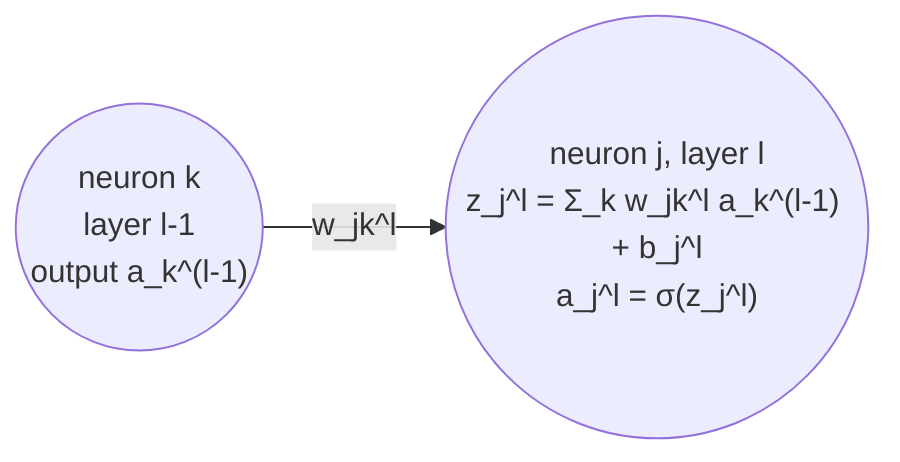
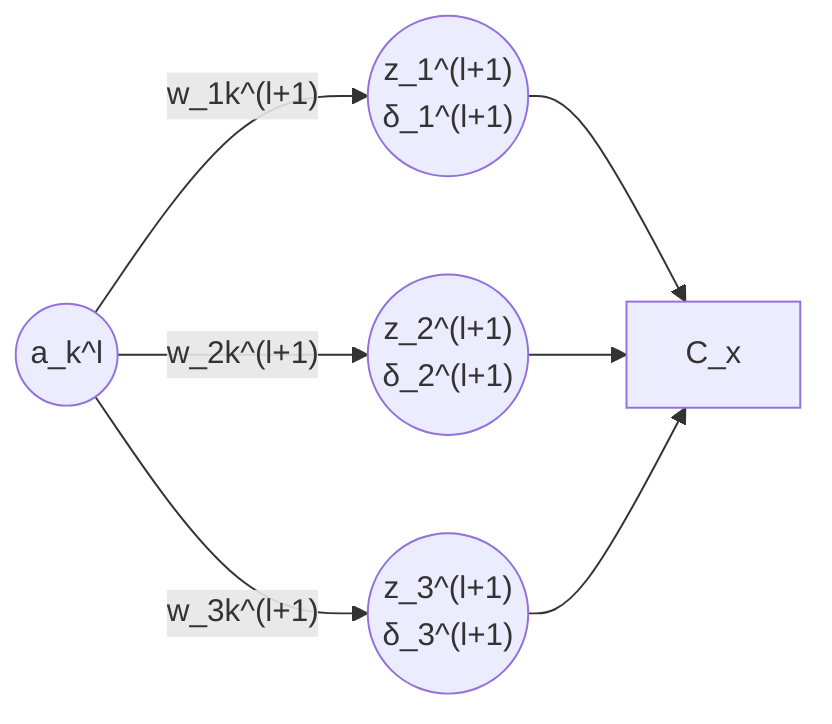
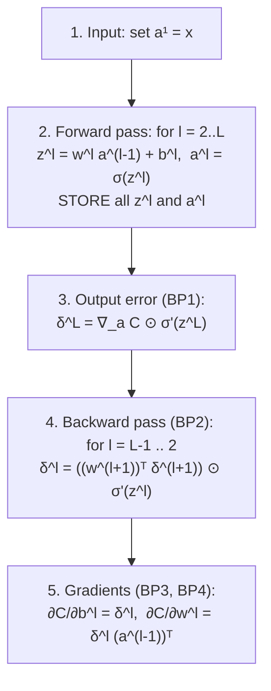

# Ch2 — Backpropagation

Back to [[00 - NN Index]] · Previous: [[01 - Ch1 Perceptrons, Sigmoid Neurons and Gradient Descent]]

**Goal:** for one training example $x$, compute $\partial C_x/\partial w^l_{jk}$ and $\partial C_x/\partial b^l_j$ for **every** weight and bias, efficiently.

---

## 1. Notation (very important — exam questions use it)

| Symbol | Meaning |
|---|---|
| $l$ | layer number ($1$ = input, $L$ = output) |
| $w^l_{jk}$ | weight **from** neuron $k$ in layer $l-1$ **to** neuron $j$ in layer $l$ |
| $b^l_j$ | bias of neuron $j$ in layer $l$ |
| $z^l_j$ | weighted input of neuron $j$ in layer $l$ |
| $a^l_j$ | activation (output) of neuron $j$ in layer $l$ |
| $a^1 = x$ | input layer just passes the input |

> [!warning] Index order trap
> $w^l_{jk}$: **$j$ = receiving neuron (layer $l$), $k$ = sending neuron (layer $l-1$)**. "Backwards" order is chosen so the matrix form is $w^l a^{l-1}$ with no transpose.
> E.g. $w^3_{24}$ = weight from neuron 4 of layer 2 to neuron 2 of layer 3.

### Forward equations
$$
z^l_j = \sum_k w^l_{jk}\,a^{l-1}_k + b^l_j \qquad\Longleftrightarrow\qquad z^l = w^l a^{l-1} + b^l
$$
$$
a^l = \sigma(z^l) = \sigma(w^l a^{l-1} + b^l)
$$
- $w^l$ is a matrix: row $j$ = all incoming weights of neuron $j$. Shape = (neurons in $l$) × (neurons in $l-1$).
- $\sigma$ is applied **element-wise** (vectorized).

### Cost for one example
$$
C_x = \frac12\|y - a^L\|^2 = \frac12\sum_j (y_j - a^L_j)^2
$$
Cost depends only on output activations $a^L$.

### Two assumptions backprop needs
1. Overall cost is an **average** of per-example costs: $C = \frac1n\sum_x C_x$. (So we compute $\nabla C_x$ per example and average.)
2. $C_x$ can be written as a function of the **output activations** $a^L$.

---

## 2. Hadamard product $\odot$

Element-wise multiplication of two vectors of the same size:
$$
\begin{pmatrix}1\\2\end{pmatrix}\odot\begin{pmatrix}3\\4\end{pmatrix} = \begin{pmatrix}1\cdot3\\2\cdot4\end{pmatrix} = \begin{pmatrix}3\\8\end{pmatrix}
$$

---

## 3. The error $\delta^l_j$

$$
\delta^l_j \equiv \frac{\partial C_x}{\partial z^l_j}
$$

- Meaning: if you nudge neuron $j$'s weighted input by $\Delta z^l_j$, cost changes by $\Delta C_x \approx \delta^l_j\,\Delta z^l_j$.
- So $\delta^l_j$ = **how sensitive the cost is to that neuron's weighted input**.
  - $|\delta|$ large → neuron is far from optimal, changing it matters a lot.
  - $\delta \approx 0$ → neuron is near-optimal (or stuck/saturated).
- $\delta^l$ = vector of errors for layer $l$.

**Why use $\delta$?** Once $\delta^l_j$ is known, the gradients for neuron $j$'s incoming weights and bias are trivial (BP3, BP4). So the job becomes: **find $\delta$ for every neuron**.

---

## 4. The Four Fundamental Equations

> [!important] Memorize these
> $$
> \begin{aligned}
> \delta^L &= \nabla_{a^L} C_x \odot \sigma'(z^L) && \text{(BP1) output error}\\[4pt]
> \delta^l &= \big((w^{l+1})^T\delta^{l+1}\big)\odot\sigma'(z^l) && \text{(BP2) error moves backward}\\[4pt]
> \frac{\partial C_x}{\partial b^l_j} &= \delta^l_j && \text{(BP3) bias gradient}\\[4pt]
> \frac{\partial C_x}{\partial w^l_{jk}} &= a^{l-1}_k\,\delta^l_j && \text{(BP4) weight gradient}
> \end{aligned}
> $$
> Vector form of BP3/BP4: $\nabla_{b^l}C_x = \delta^l$, $\quad\nabla_{w^l}C_x = \delta^l\,(a^{l-1})^T$

Two jobs: **BP1 + BP2** compute the errors; **BP3 + BP4** turn errors into gradients.

BP4 in words: $\dfrac{\partial C}{\partial w} = a_{\text{in}}\cdot\delta_{\text{out}}$ — (activation of the neuron the weight comes **from**) × (error of the neuron it goes **into**).

---

## 5. Derivations (chain rule)

### BP3 — bias
Chain: $b^l_j \to z^l_j \to C_x$
$$
\frac{\partial C_x}{\partial b^l_j} = \frac{\partial C_x}{\partial z^l_j}\cdot\frac{\partial z^l_j}{\partial b^l_j} = \delta^l_j\cdot 1 = \delta^l_j
$$

### BP4 — weight
Chain: $w^l_{jk} \to z^l_j \to C_x$, and $\partial z^l_j/\partial w^l_{jk} = a^{l-1}_k$
$$
\frac{\partial C_x}{\partial w^l_{jk}} = \delta^l_j\cdot a^{l-1}_k
$$

### BP1 — output layer
Chain: $z^L_j \to a^L_j \to C_x$, and $a^L_j = \sigma(z^L_j)$
$$
\delta^L_j = \frac{\partial C_x}{\partial a^L_j}\cdot\frac{\partial a^L_j}{\partial z^L_j} = \frac{\partial C_x}{\partial a^L_j}\,\sigma'(z^L_j)
$$
Collect over $j$: $\delta^L = \nabla_{a^L}C_x \odot \sigma'(z^L)$, where $\nabla_{a^L}C_x = (\partial C_x/\partial a^L_1, \partial C_x/\partial a^L_2,\dots)^T$.

**For quadratic cost:** $\partial C_x/\partial a^L_j = a^L_j - y_j$, so
$$
\delta^L = (a^L - y)\odot\sigma'(z^L)
$$
→ computable directly from output and target.

### BP2 — hidden layer
Neuron $k$ in layer $l$ affects **every** neuron $j$ in layer $l+1$ via $z^{l+1}_j = \sum_k w^{l+1}_{jk}a^l_k + b^{l+1}_j$.

Sum over all paths:
$$
\frac{\partial C_x}{\partial a^l_k} = \sum_j \frac{\partial C_x}{\partial z^{l+1}_j}\frac{\partial z^{l+1}_j}{\partial a^l_k} = \sum_j \delta^{l+1}_j\,w^{l+1}_{jk}
$$
Then multiply by $\partial a^l_k/\partial z^l_k = \sigma'(z^l_k)$:
$$
\delta^l_k = \Big(\sum_j w^{l+1}_{jk}\delta^{l+1}_j\Big)\sigma'(z^l_k)
$$
$\sum_j w^{l+1}_{jk}\delta^{l+1}_j$ is the $k$-th component of $(w^{l+1})^T\delta^{l+1}$ → vector form = BP2.

**Intuition:** the transpose $(w^{l+1})^T$ sends the error **backward** through the same weights; $\odot\sigma'(z^l)$ passes it back through the activation.

---

## 6. The Backpropagation Algorithm

- **Why "back"-propagation?** Errors are computed from the output layer **backward** to the input.
- **Combined with SGD:** for each mini-batch, run backprop on each of the $m$ examples, **average** the gradients, then update:
$$
w^l \to w^l - \frac{\eta}{m}\sum_x \delta^{x,l}(a^{x,l-1})^T, \qquad b^l \to b^l - \frac{\eta}{m}\sum_x\delta^{x,l}
$$

---

## 7. Per-example cost vs overall cost

$$
C(w,b) = \frac1n\sum_{i=1}^n C_{x_i}(w,b), \qquad C_{x_i}(w,b) = \frac12\big\|y_i - a^L(x_i; w,b)\big\|^2
$$
- Each $C_{x_i}$ is a **different function** of the same $w,b$ (different input/target).
- Gradient: $\nabla C = \frac1n\sum_i\nabla C_{x_i}$.
- **Backprop computes $\nabla C_{x_i}$ for ONE example.** Nielsen often just writes $C$ for $C_x$ once the example is fixed.

---

## 8. Worked Example: 2-2-2 network

All sigmoid. $x = (1,0)^T$, $y = (1,0)^T$, quadratic cost.
$$
w^2 = \begin{pmatrix}1 & 0.6\\-1 & -0.4\end{pmatrix},\ b^2 = \begin{pmatrix}0\\0\end{pmatrix},\qquad
w^3 = \begin{pmatrix}1 & -1\\-1 & 1\end{pmatrix},\ b^3 = \begin{pmatrix}0\\0\end{pmatrix}
$$

**Forward pass**
- $z^2 = w^2a^1 + b^2 = (1,\ -1)^T$, $\ a^2 = \sigma(z^2) \approx (0.7311,\ 0.2689)^T$
- $z^3 = w^3a^2 + b^3 \approx (0.4621,\ -0.4621)^T$, $\ a^3 \approx (0.6135,\ 0.3865)^T$
- $C_x = \frac12\|y-a^3\|^2 \approx \frac12(0.3865^2 + 0.3865^2) \approx 0.1494$

**BP1 (output error)**
- $a^3 - y \approx (-0.3865,\ 0.3865)^T$
- $\sigma'(z^3) = a^3\odot(1-a^3) \approx (0.2371,\ 0.2371)^T$
- $\delta^3 \approx (-0.09164,\ 0.09164)^T$

**BP3, BP4 (output layer)**
- $\nabla_{b^3}C = \delta^3 \approx (-0.09164,\ 0.09164)^T$
- $\nabla_{w^3}C = \delta^3(a^2)^T \approx \begin{pmatrix}-0.06699 & -0.02465\\ 0.06699 & 0.02465\end{pmatrix}$
- e.g. $\partial C/\partial w^3_{12} = a^2_2\,\delta^3_1 = (0.2689)(-0.09164) = -0.02465$

**BP2 (hidden error)**
- $(w^3)^T\delta^3 = \begin{pmatrix}1&-1\\-1&1\end{pmatrix}\begin{pmatrix}-0.09164\\0.09164\end{pmatrix} = (-0.18328,\ 0.18328)^T$
- $\sigma'(z^2) = a^2\odot(1-a^2) \approx (0.19661,\ 0.19661)^T$
- $\delta^2 \approx (-0.03604,\ 0.03604)^T$

**BP3, BP4 (hidden layer)**
- $\nabla_{b^2}C = \delta^2 \approx (-0.03604,\ 0.03604)^T$
- $\nabla_{w^2}C = \delta^2(a^1)^T = \begin{pmatrix}-0.03604\\0.03604\end{pmatrix}(1\ \ 0) = \begin{pmatrix}-0.03604 & 0\\0.03604 & 0\end{pmatrix}$
- Second column is 0 because $a^1_2 = x_2 = 0$ → weights from an inactive input don't learn.

---

## 9. Consequences of the equations (when does learning slow down?)

From BP4 $\frac{\partial C}{\partial w^l_{jk}} = a^{l-1}_k\delta^l_j$ and $\delta \propto \sigma'(z)$:

| Situation | Effect |
|---|---|
| Input neuron has **low activation** ($a^{l-1}_k \approx 0$) | that weight learns **slowly** |
| Output neuron **saturated** ($\sigma \approx 0$ or $1$, so $\sigma'(z) \approx 0$) | its weights **and** bias learn slowly |
| Hidden neuron saturated | $\delta^l \approx 0$ (BP2), so its incoming weights learn slowly |

**Why initialize with $N(0,1)$?** To keep $z$ near 0 initially (where $\sigma'$ is largest) so neurons aren't saturated from the start. (Ch3 refines this to $N(0, 1/n_{in})$.)

### Modified neuron (activation $f$ instead of $\sigma$)
If one neuron uses $f(\sum_j w_jx_j + b)$: just replace $\sigma'(z)$ with $f'(z)$ **for that neuron** in BP1/BP2. BP3 and BP4 stay the same.

---

## 10. Why we need non-linear activations

If all activations are linear ($a^l = z^l$), with one hidden layer:
$$
a^3 = w^3(w^2x + b^2) + b^3 = \underbrace{(w^3w^2)}_{w}x + \underbrace{(w^3b^2 + b^3)}_{b}
$$
- That's just $a^3 = wx + b$ → same as a network with **no hidden layer**.
- True for any number of linear layers → **linear hidden layers add no expressive power**.
- Non-linear activations stop layers collapsing into a single affine map.

---

## 11. Why backprop is fast

Naive way: estimate each derivative numerically
$$
\frac{\partial C}{\partial w_j} \approx \frac{C(w + \epsilon e_j) - C(w)}{\epsilon}
$$
- Needs **one extra forward pass per weight**. With a million weights → a million forward passes for one gradient.
- **Backprop:** one forward + one backward pass gives **all** partial derivatives (backward pass ≈ same cost as forward).

---

## 12. Backprop for linear regression

No hidden layer, identity activation: $a = z = w^Tx + b$, $C_x = \frac12(y-a)^2$.
- $da/dz = 1$
- **BP1:** $\delta = \partial C_x/\partial a = a - y$
- **BP2:** none (no hidden layers)
- **BP3:** $\partial C_x/\partial b = \delta = a - y$
- **BP4:** $\partial C_x/\partial w_k = x_k\delta = x_k(a - y)$

---

## 📝 Practice Problems for Ch2

### Question 4 — What Gradient Does Backpropagation Compute?
$C(w,b) = \frac1n\sum_{i=1}^n C_{x_i}(w,b)$. A student says: *"One forward pass and one backward pass compute the gradient of the cost over the entire training set."* Is this correct?
(1) What gradient does backprop compute for one example $x_i$? (2) How is the full training-set gradient obtained? (3) What gradient do we use for a mini-batch of $m$ examples?

> [!success]- Solution
> **Not correct.**
> 1. One forward + one backward pass gives $\nabla C_{x_i}$ — the gradient of the **single-example** cost.
> 2. Run backprop for **every** example and average: $\nabla C = \frac1n\sum_{i=1}^n\nabla C_{x_i}$ ($n$ forward + $n$ backward passes).
> 3. Mini-batch: $\nabla C \approx \frac1m\sum_{x\in B}\nabla C_x$ — average of the $m$ per-example gradients.

### Question 5 — Backpropagate the Error
$$
w^{l+1} = \begin{pmatrix}2 & -1\\1 & 3\end{pmatrix},\quad \delta^{l+1} = \begin{pmatrix}0.4\\-0.2\end{pmatrix},\quad \sigma'(z^l) = \begin{pmatrix}0.25\\0.10\end{pmatrix}
$$
(1) Compute $\delta^l$ using BP2. (2) What are $\partial C_x/\partial b^l_1$ and $\partial C_x/\partial b^l_2$? (3) If $a^{l-1}_k = 0$, what is $\partial C_x/\partial w^l_{jk}$?

> [!success]- Solution
> 1. Transpose: $(w^{l+1})^T = \begin{pmatrix}2 & 1\\-1 & 3\end{pmatrix}$
>    $(w^{l+1})^T\delta^{l+1} = \begin{pmatrix}2(0.4) + 1(-0.2)\\ -1(0.4) + 3(-0.2)\end{pmatrix} = \begin{pmatrix}0.6\\-1.0\end{pmatrix}$
>    $\delta^l = \begin{pmatrix}0.6\\-1.0\end{pmatrix}\odot\begin{pmatrix}0.25\\0.10\end{pmatrix} = \begin{pmatrix}0.15\\-0.10\end{pmatrix}$
> 2. BP3: $\partial C_x/\partial b^l_1 = 0.15$, $\ \partial C_x/\partial b^l_2 = -0.10$
> 3. BP4: $\partial C_x/\partial w^l_{jk} = a^{l-1}_k\delta^l_j = 0\cdot\delta^l_j = 0$ (weight from an inactive neuron doesn't learn on this example).
>
> ⚠️ Common mistake: forgetting the **transpose** (using $w^{l+1}$ directly gives $(1.0, -0.2)$ — wrong).
