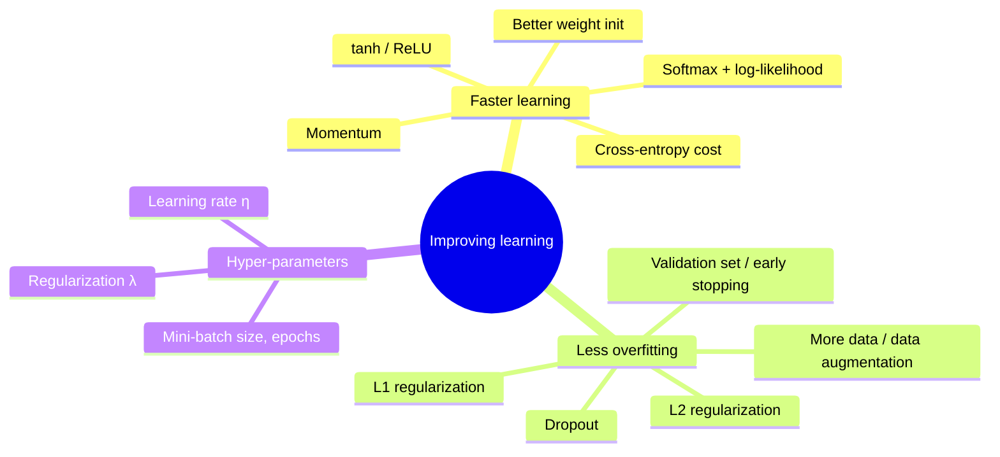
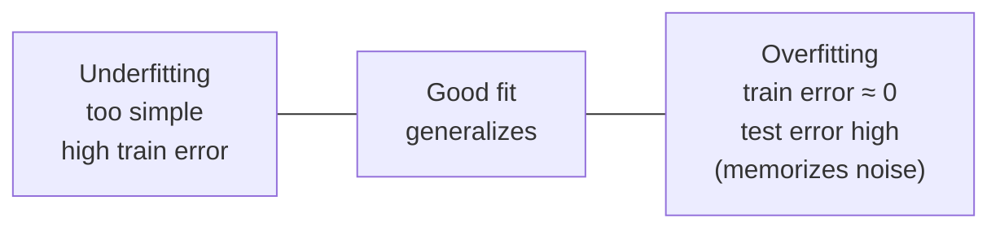
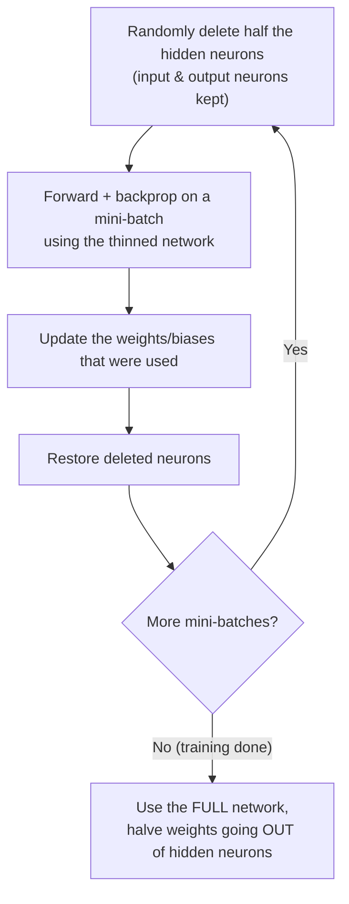

# Ch3 — Improving the Way Neural Networks Learn

Back to [[00 - NN Index]] · Previous: [[02 - Ch2 Backpropagation]]

---

# Part A

## 1. Problem: quadratic cost learns slowly when badly wrong

Single sigmoid neuron with quadratic cost. Output error (BP1):
$$
\delta^L = \frac{\partial C}{\partial a}\,\sigma'(z) = (a - y)\,\sigma'(z)
$$
- If the neuron is **badly wrong** and **saturated** (e.g. $y = 1$ but $a \approx 0$), then $\sigma'(z) \approx 0$.
- So $\delta^L \approx 0$ → weight/bias gradients $\approx 0$ → **almost no learning**, even though $|y - a|$ is large.
- Humans learn fastest when badly wrong; this neuron learns slowest. That's the problem.

---

## 2. Cross-entropy cost

### Derivation idea
For a sigmoid output, $\delta^L = \frac{\partial C}{\partial a}\,a(1-a)$. We **want** $\delta^L = a - y$ (no $\sigma'$ factor). So we need:
$$
\frac{\partial C}{\partial a} = \frac{a - y}{a(1-a)} = -\frac{y}{a} + \frac{1-y}{1-a}
$$
Integrating w.r.t. $a$:
$$
\boxed{C_x = -\big[\,y\ln a + (1-y)\ln(1-a)\,\big]}
$$
Overall:
$$
C = -\frac1n\sum_x\big[y\ln a + (1-y)\ln(1-a)\big]
$$

### Why it's a good cost
- $C_x \ge 0$ (since $0 < a < 1$, the logs are negative).
- **Small** when $a \approx y$ (e.g. $y = 1, a \to 1$: $-\ln 1 = 0$).
- **Large** when $a$ is far from $y$ (e.g. $y = 1, a \to 0$: $-\ln a \to \infty$).

### Output error with cross-entropy
$$
\delta^L = a^L - y
$$
- The $\sigma'(z)$ term **cancels**. Learning speed $\propto$ **how wrong** the output is. Bigger error → faster learning.
- Gradients: $\dfrac{\partial C}{\partial w_j} = \dfrac1n\sum_x x_j(a - y)$, $\ \dfrac{\partial C}{\partial b} = \dfrac1n\sum_x(a - y)$.

### Several output neurons
$$
C_x = -\sum_j\big[y_j\ln a^L_j + (1-y_j)\ln(1-a^L_j)\big], \qquad \frac{\partial C_x}{\partial a^L_j} = \frac{a^L_j - y_j}{a^L_j(1-a^L_j)}
$$
Multiplying by $\sigma'(z^L_j) = a^L_j(1-a^L_j)$ in BP1:
$$
\delta^L = a^L - y
$$

> [!warning] Which form is correct?
> ✅ $-[y\ln a + (1-y)\ln(1-a)]$ — labels $y$ outside, **activations $a$ inside the log**.
> ❌ $-[a\ln y + (1-a)\ln(1-y)]$ — if $y = 0$ or $1$, $\ln 0$ is undefined.

> [!question] Does cross-entropy fix slow learning in hidden layers?
> **No.** It only removes $\sigma'(z^L)$ at the **output** layer. BP2 still has $\odot\,\sigma'(z^l)$, so **saturated hidden neurons still learn slowly** ($\delta^l \approx 0$).

> [!example] Exercise: linear output neurons + quadratic cost
> If $a^L_j = z^L_j$ (no sigmoid), then $\sigma'$ is replaced by 1:
> $\delta^L = a^L - y$. Quadratic cost is fine for linear outputs — no saturation problem.

---

## 3. Softmax output layer

$$
a^L_j = \frac{e^{z^L_j}}{\sum_k e^{z^L_k}}
$$
- Every $a^L_j > 0$ (exponentials are positive).
- $\sum_j a^L_j = 1$ → output is a **probability distribution** over classes.
- Each $a^L_j$ depends on **all** $z^L_k$ (shared denominator). Increase one $z_j$ → $a_j$ goes up, all others go down.

### Categorical cross-entropy / negative log-likelihood
$$
C_x = -\sum_{k=1}^K y_k\ln a^L_k
$$
With one-hot $y$ (correct class $y$), only one term survives:
$$
C_x = -\ln a^L_y, \qquad C = -\frac1n\sum_x\ln a^L_y
$$
- Network confident & correct ($a_y \to 1$) → $C_x \to 0$.
- Network gives correct class low probability → $C_x$ large.

### Softmax derivatives
$$
\frac{\partial a^L_y}{\partial z^L_j} =
\begin{cases}
a^L_y(1 - a^L_y), & j = y\\[2pt]
-a^L_y\,a^L_j, & j \ne y
\end{cases}
$$

### Output error
$$
\delta^L_j = \frac{\partial C_x}{\partial a^L_y}\cdot\frac{\partial a^L_y}{\partial z^L_j} = -\frac{1}{a^L_y}\cdot\frac{\partial a^L_y}{\partial z^L_j}
$$
- $j = y$: $\delta^L_y = -(1 - a^L_y) = a^L_y - 1 = a^L_y - y_y$
- $j \ne y$: $\delta^L_j = a^L_j = a^L_j - y_j$ (since $y_j = 0$)

$$
\boxed{\delta^L = a^L - y}
$$

### Softmax vs sigmoid — key takeaways

| | Sigmoid + binary CE | Softmax + NLL |
|---|---|---|
| $\delta^L$ | $a^L - y$ | $a^L - y$ |
| Earlier layers (BP2) | same | same |
| $a^L_j > 0$? | yes | yes |
| $\sum_j a^L_j = 1$? | **No** (independent) | **Yes** |

Think of **softmax + log-likelihood** as the multi-class analogue of **sigmoid + cross-entropy**.

---

## 4. Overfitting

**Overfitting** = model fits the training data (including noise) too well and generalizes badly.

Example: 30 hidden neurons (23,860 parameters) trained on only **1,000** images:
- Training accuracy → ~100%.
- Test accuracy plateaus ~82% and stops improving after ~epoch 280 → network is **memorizing**, not learning.

**Polynomial-fit analogy** (green = true curve, blue dots = noisy data):
- $M = 0, 1$: too simple → **underfits**.
- $M = 3$: good fit.
- $M = 9$: passes through every point but wiggles wildly → **overfits**.

Why NNs overfit easily: **huge number of weights and biases**.

### Fixes
1. **Hold-out / early stopping** with a validation set
2. **More training data** (real or artificial)
3. **Regularization** (L2, L1, dropout)

### Training / validation / test split
- MNIST 60k training → **50k training + 10k validation**; test set (10k) kept separate.
- **Why validation and not test?** Hyper-parameters (epochs, $\eta$, architecture, $\lambda$) are chosen by checking performance. If you tune them on the **test** set, you **overfit the hyper-parameters to the test data**, and the test score is no longer an honest estimate.
- With 50k training examples, training and validation accuracy stay much closer → **more data reduces overfitting**.

---

## 5. L2 regularization (weight decay)

Add a penalty on large weights (**not** biases):
$$
C = C_0 + \frac{\lambda}{2n}\sum_w w^2
$$
where $C_0$ = original cost (cross-entropy or quadratic), $\lambda > 0$ = regularization parameter.
- Regularized cross-entropy: $C = -\frac1n\sum_x\sum_j[y_j\ln a^L_j + (1-y_j)\ln(1-a^L_j)] + \frac{\lambda}{2n}\sum_w w^2$
- Regularized quadratic: $C = \frac{1}{2n}\sum_x\|y - a^L\|^2 + \frac{\lambda}{2n}\sum_w w^2$
- Effect: network prefers **small weights**; large weights allowed only if they reduce $C_0$ a lot. $\lambda$ sets the trade-off.

### Gradients
$$
\frac{\partial C}{\partial w} = \frac{\partial C_0}{\partial w} + \frac{\lambda}{n}w, \qquad \frac{\partial C}{\partial b} = \frac{\partial C_0}{\partial b}
$$

### Mini-batch update
$$
w \to \Big(1 - \frac{\eta\lambda}{n}\Big)w - \frac{\eta}{m}\sum_x\frac{\partial C_x}{\partial w}, \qquad b \to b - \frac{\eta}{m}\sum_x\frac{\partial C_x}{\partial b}
$$
- **"Weight decay"**: each step first **multiplies** $w$ by $(1 - \eta\lambda/n) < 1$, shrinking it toward zero.
- Note: $n$ = full training-set size (not $m$).
- Result on MNIST (30 hidden): train–validation gap much narrower; validation accuracy higher.

**Why small weights help (intuition):** small weights → output doesn't change much when inputs change slightly → model learns simple, broad patterns rather than noise. Large weights let the network react sharply to small noise.

---

## 6. L1 regularization

$$
C = C_0 + \frac{\lambda}{n}\sum_w|w|, \qquad \frac{\partial C}{\partial w} = \frac{\partial C_0}{\partial w} + \frac{\lambda}{n}\operatorname{sgn}(w)
$$
Update:
$$
w \to w - \frac{\eta\lambda}{n}\operatorname{sgn}(w) - \frac{\eta}{m}\sum_x\frac{\partial C_x}{\partial w}
$$
- At $w = 0$, $|w|$ isn't differentiable → use convention $\operatorname{sgn}(0) = 0$ (no regularization push).

### L1 vs L2

| | L2 | L1 |
|---|---|---|
| Penalty | $\frac{\lambda}{2n}\sum w^2$ | $\frac{\lambda}{n}\sum\lvert w\rvert$ |
| Shrink per step | **proportional** to $w$: $\frac{\eta\lambda}{n}w$ | **constant** amount: $\frac{\eta\lambda}{n}$ |
| Large $\lvert w\rvert$ | shrinks **a lot** | shrinks less (than L2) |
| Small $\lvert w\rvert$ | shrinks very little | shrinks **a lot** (relatively) |
| Result | many small, non-zero weights | **sparse**: few important weights, rest → 0 |

**Similarity:** both penalize large weights and push weights toward 0.

> "L1 regularization tends to concentrate the weight of the network in a relatively small number of high-importance connections, while the other weights are driven toward zero."

---

## 7. Dropout

Modifies the **network**, not the cost.

- **Why halve outgoing weights at test time?** During training only ~half the hidden neurons were active. With all active, each next-layer neuron would get ~twice the input. Halving compensates.
- **Why it works:**
  - A neuron can't rely on any particular other neuron being present → learns **robust features** useful with many different subsets.
  - Each mini-batch trains a different "thinned" network → like **averaging many networks**, which reduces overfitting.
- Especially useful for **large, deep networks** where overfitting is severe. (Srivastava, Hinton, Krizhevsky, Sutskever, Salakhutdinov, 2014, JMLR.)

---

## 8. More training data & data augmentation

- Validation accuracy vs training-set size looks like it saturates on a linear axis, but on a **log axis** it keeps rising → **much more data would still help**.
- **Artificially expand data:** apply transformations reflecting **real-world variation**.

| Method | Accuracy |
|---|---|
| Standard MNIST | 98.4% |
| + rotations | 98.9% |
| + elastic distortions | 99.3% |

> [!question] Why not allow arbitrarily large rotations?
> A large rotation can change the meaning: a **6 rotated 180° looks like a 9**, so the label becomes wrong. Also, digits aren't written upside-down in reality → transformations must match real variation.

---

## 9. Weight initialization

### Problem with $N(0,1)$
Neuron with $n_{in} = 1000$ inputs; 500 inputs are 1, 500 are 0; $w_k, b \sim N(0,1)$.
$$
z = \sum_{k=1}^{1000} w_kx_k + b \quad\Rightarrow\quad \text{sum of } 500 \text{ weights} + b
$$
- $E[z] = 0$
- $\operatorname{Var}(z) = 500(1) + 1 = 501$ (variances of independent terms add)
- $\operatorname{SD}(z) = \sqrt{501} \approx 22.4$

→ $|z|$ is usually huge → $\sigma(z) \approx 0$ or $1$ → **saturated** → $\sigma'(z) \approx 0$ → slow learning (cross-entropy only helps the output layer, not hidden ones).

### Normalized initialization
$$
w \sim N\!\left(0,\ \frac{1}{n_{in}}\right)\ \ (\text{SD} = 1/\sqrt{n_{in}}), \qquad b \sim N(0,1)
$$
- Keeps $z$ in the sigmoid's active region ($|z| \lesssim 1$).
- Learning "kicks in" immediately instead of stagnating early. Final accuracy similar, but reached **much faster**.

### Why not all zeros? → Symmetry
5-5-1 net, all weights & biases = 0, sigmoid, binary CE:
- Every hidden neuron: $z = 0$, $a = \frac12$. Output: $z^3 = 0$, $a^3 = \frac12$, $\delta^3 = \frac12 - y$.
- $\partial C/\partial w^3_{1k} = a^2_k\delta^3 = \frac12(\frac12 - y)$ → **same for all $k$**.
- $\delta^2 = (w^3)^T\delta^3\odot\sigma'(z^2) = 0$ (since $w^3 = 0$) → $\partial C/\partial w^2_{jk} = 0$ initially.
- All hidden neurons get identical updates forever → they stay **identical** → they all learn **the same feature**.

> [!important] A good initialization should
> 1. **Break symmetry** between hidden neurons (random weights → different $z$, activations, gradients).
> 2. Use an **appropriate scale** to avoid saturation ($1/\sqrt{n_{in}}$).
>
> Biases can be initialized to zero (weights already break symmetry).

### Slide problem: regularization + old initialization
With L2: $w \to (1 - \frac{\eta\lambda}{n})w - \eta\frac{\partial C_x}{\partial w}$, and old init $N(0,1)$:
- Weights start big, so the decay term dominates the first epochs (if $\lambda$ not too small).
- Per epoch there are $n/m$ updates: $(1 - \frac{\eta\lambda}{n})^{n/m} \approx e^{-\eta\lambda/m}$ (needs $\eta\lambda \ll n$).
- Decay stops dominating when weights shrink to $\sim 1/\sqrt{N_{total}}$ (if $\lambda$ not too large).
- → L2 regularization partly "fixes" the bad initialization by itself.

---

## 10. Choosing hyper-parameters

Bad example: 30 hidden, mini-batch 10, 30 epochs, cross-entropy, $\eta = 10.0$, $\lambda = 1000.0$ → network learns **nothing** (no better than chance). We don't know a priori what to fix.

### Broad strategy
1. **First goal:** get *any* result better than chance.
2. **Simplify the problem:** e.g. only classify 0s vs 1s.
3. **Simplify the network:** e.g. `[784, 10]` (no hidden layer).
4. **Speed up feedback:** monitor validation accuracy more often (e.g. after every few mini-batches), use a small validation set (e.g. 100 images).
→ Fast experiments give fast insight.

### Then
- **Stepwise:** tune one hyper-parameter at a time ($\eta$, then $\lambda$, …).
- **Incremental complexity:** grow architecture (10 → 20 hidden neurons) only after baseline tuning.
- **Validation compass:** judge every change on held-out validation data.
- **Iterate:** re-tune $\eta$ and $\lambda$ when the architecture changes. *"Tuning is an iterative loop."*

### Learning rate $\eta$
- $\eta = 0.025$: smooth but slow decrease.
- $\eta = 0.25$: fast decrease, slight wobble later.
- $\eta = 2.5$: cost oscillates — steps **overshoot** the valley minimum.

**Threshold-of-divergence heuristic:**
1. Find the largest $\eta$ where cost **decreases** in the first few epochs (order-of-magnitude search: 0.01, 0.1, 1, …).
2. Use $\eta$ a factor of **2–10 below** that.
3. Decrease $\eta$ over time with a schedule.

(Use **training cost** to pick $\eta$ — its job is to control the step size of gradient descent.)

### Early stopping (choosing the number of epochs)
- Check validation accuracy every epoch; stop when it stops improving.
- **No-improvement-in-$n$ rule:** stop if no new best validation accuracy in $n$ epochs (patience). $n = 10$ for quick exploration; $n = 30$–$50$ for final training.
- Caution: networks can **plateau** for a long time before improving again.
- Early stopping also guards against overfitting automatically.

### Learning-rate schedule (reduce-on-plateau)
1. Keep $\eta$ constant while validation accuracy improves.
2. When it plateaus/worsens, reduce $\eta$ by a factor (½ or ⅒).
3. Repeat.
4. Stop when $\eta$ is ~1000× (≈ $2^{10}$) smaller than initially.

Big $\eta$ early = move fast; small $\eta$ later = settle into a narrow minimum without overshooting.

### Regularization parameter $\lambda$
1. Start with $\lambda = 0$ → find a working $\eta$.
2. Try $\lambda = 1.0$, then scale by factors of 10 (0.1, 1, 10, 100) by validation performance.
3. Fine-tune within the best order of magnitude (e.g. 5, 20).
4. **Go back and re-optimize $\eta$** — $\eta$ and $\lambda$ depend on each other.

> [!question] Why not use gradient descent to learn $\lambda$?
> Training cost is minimized by $\lambda \to 0$ (the penalty only adds cost). GD would just remove regularization, ignoring overfitting.

---

# Part B

## 11. Momentum-based gradient descent

Give parameters a **velocity** that remembers past gradients.

| Standard GD | Momentum |
|---|---|
| $w \to w - \eta\nabla C$ | $v \to \mu v - \eta\nabla C$   $w \to w + v$ |

- Start with $v = 0$; one velocity per parameter.
- **Ball rolling downhill:** if gradients keep pointing the same way, velocity builds up → faster progress.
- $\mu \in [0,1]$ = momentum coefficient (controls "friction"):
  - $\mu = 0$: high friction, no memory → standard GD.
  - $\mu = 1$: no friction, velocity accumulates forever → overshoots, oscillates.
  - Typical: $\mu \approx 0.9$.
- $\mu > 1$: "negative friction" → velocity grows exponentially → divergence/NaN.
- $\mu < 0$: "anti-memory" → velocity flips each step → chaotic jitter.

---

## 12. Other neuron types

### tanh
$$
\tanh(z) = \frac{e^z - e^{-z}}{e^z + e^{-z}}, \qquad \sigma(z) = \frac{1 + \tanh(z/2)}{2}, \qquad \tanh'(z) = 1 - a^2
$$
- Range $(-1, 1)$ (sigmoid is $(0,1)$) — a **rescaled sigmoid**, **zero-centred**.
- Backprop & SGD work the same; BP4 $\frac{\partial C}{\partial w^{l+1}_{jk}} = a^l_k\delta^{l+1}_j$ holds for **any** activation.
- **Sigmoid limitation:** $a^l_k > 0$ always, so all weights into neuron $j$ have gradients with the **same sign** as $\delta^{l+1}_j$ → they all increase or all decrease together → zig-zag paths.
- **tanh advantage:** $a^l_k$ can be $\pm$ → weights into a neuron can move in different directions independently → often faster convergence.
- But tanh **still saturates**; gains over sigmoid are often modest.
- **tanh output with binary cross-entropy?** No — CE needs outputs in $(0,1)$. Use tanh in **hidden** layers, sigmoid/softmax at the **output**.

### ReLU (rectified linear unit)
$$
f(z) = \max(0, z), \qquad f'(z) = \begin{cases}1 & z > 0\\0 & z \le 0\end{cases}
$$
- Trainable with backprop + SGD.
- **Doesn't saturate** for positive $z$ → gradient stays 1 → signals pass through many layers → helps the **vanishing gradient** problem.
- **Sparsity:** neurons with $z < 0$ output 0 ("turn off") → efficient representations.
- Big benefits in **image recognition** and **deep** networks: faster convergence, better performance.
- Downside: if $z < 0$, gradient is 0 → that neuron stops learning for that input.

| | Sigmoid | tanh | ReLU |
|---|---|---|---|
| Range | $(0,1)$ | $(-1,1)$ | $[0,\infty)$ |
| Derivative | $a(1-a)$ | $1-a^2$ | $1$ or $0$ |
| Zero-centred | ❌ | ✅ | ❌ |
| Saturates | both ends | both ends | only for $z<0$ |

### Theory vs practice (LeCun)
Many techniques are justified **empirically** rather than mathematically ("our theoretical tools are very weak"). Judge a method by how well it works and on how many problems. Risk: stay alert to where/why a model may fail when conditions change.

---

## 📝 Practice Problems for Ch3

### Question 7 — Cross-Entropy and Saturation
One sigmoid output neuron: $y = 1$, $a = 0.01$.
(1) Quadratic: $\delta^L = (a-y)a(1-a)$. Compute. (2) Binary CE: $\delta^L = a - y$. Compute. (3) Both are badly wrong — why is quadratic much slower?

> [!success]- Solution
> 1. $\delta^L = (0.01 - 1)(0.01)(0.99) = (-0.99)(0.0099) \approx -0.0098$
> 2. $\delta^L = 0.01 - 1 = -0.99$
> 3. Quadratic carries the factor $\sigma'(z) = a(1-a) = 0.0099$, tiny because the neuron is **saturated**. So the gradient is ~**100× smaller** despite a large error. Cross-entropy cancels $\sigma'$, so the gradient is proportional to the error $(a-y)$ → fast learning when badly wrong.

### Question 8 — Softmax and the Direction of Learning
$a^L = (0.70, 0.20, 0.10)^T$, $y = (0, 1, 0)^T$ (correct class = 2).
(1) NLL cost $C_x$? (2) $\delta^L$? (3) Which logit should increase? (4) Which should decrease? (5) Why does changing one logit affect all outputs?

> [!success]- Solution
> 1. $C_x = -\ln a^L_2 = -\ln 0.20 \approx 1.609$
> 2. $\delta^L = a^L - y = (0.70,\ -0.80,\ 0.10)^T$
> 3. GD: $z \to z - \eta\,\delta$ (since $\partial C/\partial z = \delta$). $\delta_2 < 0$ → **$z_2$ increases** (correct class).
> 4. $\delta_1, \delta_3 > 0$ → **$z_1$ and $z_3$ decrease**. $z_1$ decreases the most (most wrong: 0.70).
> 5. All outputs share the denominator $\sum_k e^{z_k}$. Raising $z_2$ increases the denominator → all other $a_k$ drop. Outputs must sum to 1, so probability moves between classes.

### Question 9 — L1 vs L2 Regularization
Ignore the data-gradient; $\frac{\eta\lambda}{n} = 0.05$; $w_1 = 5$, $w_2 = 0.2$. L2: $w \to (1 - 0.05)w$. L1: $w \to w - 0.05\operatorname{sgn}(w)$.
(1) New values? (2) Which shrinks the large weight more (absolute)? (3) Which acts more strongly, proportionally, on the small weight? (4) Which gives more weights near zero?

> [!success]- Solution
> 1.
> | | L2 | L1 |
> |---|---|---|
> | $w_1 = 5$ | $0.95 \times 5 = 4.75$ (−0.25, 5%) | $5 - 0.05 = 4.95$ (−0.05, 1%) |
> | $w_2 = 0.2$ | $0.95 \times 0.2 = 0.19$ (−0.01, 5%) | $0.2 - 0.05 = 0.15$ (−0.05, **25%**) |
> 2. **L2** (0.25 vs 0.05).
> 3. **L1** (25% vs 5%).
> 4. **L1** — constant-size shrink drives small weights all the way to ~0 → **sparse** network. L2 shrinks proportionally, so small weights shrink slowly and never quite reach 0.

### Question 10 — What Should Initialization Achieve?
Sigmoid neuron, $n_{in} = 1000$, 500 inputs = 1 and 500 = 0, $z = \sum_{k=1}^{1000}w_kx_k + b$.
**Part A** ($w_k, b \sim N(0,1)$): (1) $E[z]$, $\operatorname{Var}(z)$, $\operatorname{SD}(z)$? (2) Why a problem for sigmoids?
**Part B** ($w_k \sim N(0, 1/n_{in})$, $b \sim N(0,1)$): (1) $\operatorname{Var}(z)$, $\operatorname{SD}(z)$? (2) Why does this help?
**Part C:** If small weights are good, why not all zero?

> [!success]- Solution
> **A.** Only the 500 active inputs contribute: $z = \sum_{500} w_k + b$.
> - $E[z] = 0$, $\ \operatorname{Var}(z) = 500(1) + 1 = 501$, $\ \operatorname{SD}(z) = \sqrt{501} \approx 22.4$
> - $|z|$ is typically ~20 → $\sigma(z) \approx 0$ or $1$ → saturated → $\sigma'(z) \approx 0$ → weights learn very slowly (and changes in weights barely change the output).
>
> **B.** $\operatorname{Var}(z) = 500\cdot\frac{1}{1000} + 1 = 1.5$, $\ \operatorname{SD}(z) = \sqrt{1.5} \approx 1.22$
> - $z$ stays in the sigmoid's sensitive region near 0 → $\sigma'(z)$ not tiny → learning starts immediately.
>
> **C.** All-zero weights make every hidden neuron compute the same $z$, same activation, and receive the same gradient (**symmetry**). They stay identical forever and learn the **same feature** — the hidden layer behaves like one neuron. Random initialization **breaks symmetry**.
