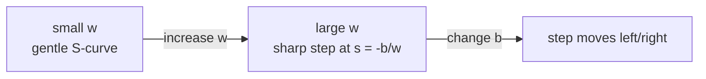
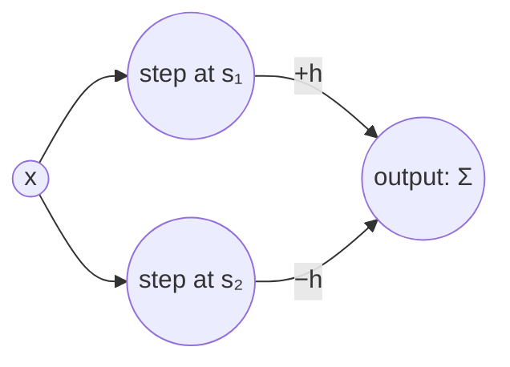
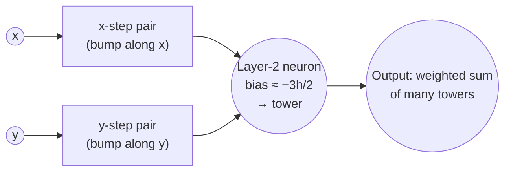

# Ch4 — A Visual Proof that Neural Nets Can Compute Any Function

Back to [[00 - NN Index]] · Previous: [[03 - Ch3 Improving Learning]]

---

## 1. The universality theorem

> [!important] Statement
> A neural network with **a single hidden layer** can approximate **any continuous function** on a compact (closed, bounded) input region to **any desired accuracy**.

**Precise form:** for any continuous $f(x)$ and any precision $\epsilon > 0$, there is a hidden-layer size such that the network output $g(x)$ satisfies
$$
|g(x) - f(x)| < \epsilon \quad \text{for all inputs } x
$$

Key points:
- **Approximation, not exact.** More hidden neurons → smaller $\epsilon$ (tighter fit).
- **Continuous** functions only (a discontinuous jump can't be matched exactly by smooth neurons).
- Works for **many inputs** $f(x_1,\dots,x_m)$ and **many outputs** $f: \mathbb{R}^m \to \mathbb{R}^n$.
- **Existence, not construction:** the theorem says such weights exist; it doesn't tell how to find them — that's **SGD's** job.
- **Depth is not required** for universality (one wide hidden layer is enough in principle). Deep nets are used because they're often more **efficient/practical**.

Setup for the visual proof: inputs and outputs scaled to $[0,1]$.

---

## 2. One input: building a step

Single hidden sigmoid neuron: output $\sigma(wx + b)$.
- Increase $w$ → curve gets **steeper**; for very large $w$ it's practically a **step function**.
- Change $b$ → curve **shifts** left/right.
- Step position: where $wx + b = 0$:
$$
s = -\frac{b}{w}
$$
- So a step neuron is described by just **one number $s$** (with $w$ very large, e.g. $w = 1000$).

---

## 3. Two steps → a bump

Two hidden step neurons at $s_1 < s_2$, output weights $+h$ and $-h$:
$$
\text{weighted output} = h\cdot\text{step}(x - s_1) - h\cdot\text{step}(x - s_2)
$$

- Between $s_1$ and $s_2$ the output is $h$; outside it's 0 → a **bump** (rectangle) of width $s_2 - s_1$ and height $h$.
- $h < 0$ → a **pit**.
- Bump can have **any height and any width**. (Diagram shorthand: label the pair with a single $h$.)

---

## 4. Many bumps → any function

- Pair up hidden neurons; each pair makes one bump.
- Adjacent bumps (e.g. 5 bumps of equal width), each with its own height $h_i$ → a **staircase/histogram** that follows the function.
- More pairs → narrower bumps → **better approximation**.

### Why approximate $\sigma^{-1}\circ f$ and not $f$?
The output neuron is a sigmoid: output $= \sigma(\text{weighted sum} + b)$. So we make the **weighted sum** of the hidden layer approximate
$$
\sigma^{-1}\big(f(x)\big)
$$
Then applying $\sigma$ gives $\approx f(x)$.

Example used in slides:
$$
f(x) = 0.2 + 0.4x^2 + 0.3x\sin(15x) + 0.05\cos(50x)
$$
Approximated with 5 bumps (10 hidden neurons); more neuron pairs → closer fit.

---

## 5. Two inputs

### Steps in 2D
Neuron $\sigma(w_1x + w_2y + b)$:
- Set $w_2 = 0$, large $w_1$ → step along $x$ at $s_x = -b/w_1$.
- Set $w_1 = 0$, large $w_2$ → step along $y$ at $s_y = -b/w_2$.

### Bumps in 2D
- Pair of $x$-step neurons → a ridge/bump along $x$ (a "wall" independent of $y$).
- Pair of $y$-step neurons → bump along $y$.
- Add both → height $2h$ in the centre square, $h$ on the "arms" (a plus-shaped plateau), 0 elsewhere.

### Towers (needs a 2nd hidden layer in Nielsen's construction)
Feed the sum into a neuron with bias $\approx -3h/2$ (threshold between $h$ and $2h$):
- Centre ($2h$) → above threshold → output ≈ 1.
- Arms ($h$) and outside (0) → below → output ≈ 0.
- Result: a **tower** — 1 over a small square, 0 elsewhere.

- Many towers, each with its own height → approximate $\sigma^{-1}\circ f$ over the 2D input region (like a 3D bar chart).
- Same idea extends to **3+ inputs** (higher-dimensional towers).

### One hidden layer view (intuition)
With 2 inputs, a hidden neuron $a = \sigma(w_1x + w_2y + b)$ with large weights is a **step across the line** $w_1x + w_2y + b = 0$:
- Changing $b$ → **moves** the step.
- Changing $w_1, w_2$ → **rotates** (changes orientation) the step.
- Many hidden neurons $a_j = \sigma(w_j^Tx + b_j)$, combined by the output: $z^L = \sum_{j=1}^m v_ja_j + b^L$.
- By choosing $w_j, b_j, v_j$ we **move, shape and scale** these building blocks; with enough of them we can approximate any continuous function.
- **Takeaway: a sufficiently wide single hidden layer is enough in principle.**

### Vector-valued functions
For $f: \mathbb{R}^m \to \mathbb{R}^n$, approximate each output component $f^1, f^2, \dots, f^n$ with its own set of hidden neurons and output neuron, then put them side by side.

---

## 6. Beyond sigmoid neurons

Any activation $s(z)$ works for the step construction **if**:
- $s(z)$ has well-defined **limits as $z \to -\infty$ and $z \to +\infty$**, and these limits are **different**.
- Ramp up $w$ → $s(wx + b)$ becomes a step whose two levels are those two limits.

**ReLU fails this condition** (no limit as $z \to +\infty$; it grows forever). **But ReLU networks are still universal**:

### ReLU bump construction
1. **Step from 2 ReLUs** (flat-top):
$$
s(x) = \max(0, wx + b) - \max(0, wx + b - h)
$$
 → 0 on the left, rises, then flat at height $h$. As $w \to \infty$ it's a vertical step of height $h$.
2. **Bump from 4 ReLUs:** subtract two steps
$$
B(x) = \underbrace{[\text{step at } a]}_{s_1(x)} - \underbrace{[\text{step at } a + \delta]}_{s_2(x)}
$$
 → non-zero only on $[a, a+\delta]$.
3. In multiple dimensions, intersecting several bumps gives a (conical) **tower** → combine towers as before.

> [!summary] Takeaway
> ReLU networks are also universal approximators for $f(x_1, \dots, x_d)$.

---

## 7. Quick recap

| Building block | How |
|---|---|
| Step at $s$ | 1 sigmoid neuron, huge $w$, $b = -ws$ |
| Bump (height $h$) | 2 step neurons, output weights $+h, -h$ |
| Function of 1 variable | many bumps approximating $\sigma^{-1}\circ f$ |
| Tower (2D) | x-bump + y-bump → threshold neuron (bias $-3h/2$) |
| Function of many variables | many towers |
| ReLU step / bump | 2 ReLUs / 4 ReLUs |

---

## 📝 Practice Problems for Ch4

No problems from `Practice_Problems_1.pdf` map to this chapter. Self-check questions from the slides:

> [!question]- Where does the step of $\sigma(wx+b)$ occur?
> At $x = s = -b/w$ (where $wx + b = 0$).

> [!question]- Why does the hidden layer approximate $\sigma^{-1}(f(x))$ instead of $f(x)$?
> The output neuron applies $\sigma$ to its weighted input. To get output $f(x)$, the weighted input must be $\sigma^{-1}(f(x))$.

> [!question]- Does universality mean deep networks are unnecessary?
> In principle one wide hidden layer is enough, but the theorem says nothing about how many neurons are needed or how to find weights. Deep networks are often far more efficient and learn hierarchical features.

> [!question]- Why doesn't ReLU satisfy the "step" condition, and why is it still universal?
> $\max(0,z) \to \infty$ as $z \to \infty$ (no finite limit). But the difference of two shifted ReLUs gives a flat-topped step, and two such steps give a bump → towers → universality.
