## 1. The Perceptron - The Simplest Artificial Neuron

### 1.1 What Is a Perceptron?

A **perceptron** is the simplest kind of artificial neuron. Think of it as a tiny decision-maker that looks at several pieces of evidence (inputs) and produces a single yes/no answer (output).

- **Inputs:** several binary values, $x_1$, $x_2$, ..., $x_n$, where each $x_i$ is either 0 or 1
- **Weights:** each input has an associated weight ${w_j}$ that tells us how important/influential that input is
- **Output:** a single binary value, y, either 0 or 1

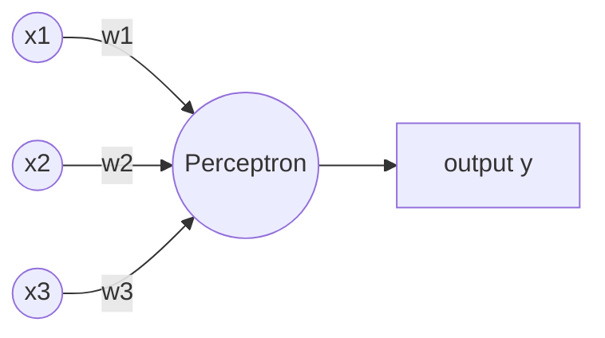


### 1.2 The Decision Rule (Weighted Sum + Threshold)

The perceptron first computes a **weighted sum** of all inputs:

```
weighted sum = sum over j of (wj * xj)
```

Then it compares this sum to a **threshold** value:

```
y = 1   if (sum of wj*xj) > threshold
y = 0   if (sum of wj*xj) <= threshold
```

**Worked Example:**

Given:
```
x = [1, 0, 1]      (three binary inputs)
w = [2, -1, 1]     (corresponding weights)
threshold = 2
```

Step 1 - Compute the weighted sum:
```
sum = (2)(1) + (-1)(0) + (1)(1) = 2 + 0 + 1 = 3
```

Step 2 - Compare to threshold:
```
Is 3 > 2?  Yes.
Therefore y = 1
```

**Interpretation of weights:**
- **Positive weights** support (push toward) output 1
- **Negative weights** oppose (push toward) output 0
- The **threshold** sets how much total "evidence" is needed before the perceptron fires a 1

### 1.3 From Threshold to Bias

Instead of writing "threshold" as a separate quantity, mathematicians prefer to move it to the other side of the inequality and rename it. This is purely a notational convenience that makes later formulas cleaner.

Starting point:
```
sum(wj*xj) > threshold
```

Rearranged:
```
sum(wj*xj) - threshold > 0
```

Define the **bias**:
```
b = -threshold
```

New decision rule:
```
y = 1   if (w . x + b) > 0
y = 0   if (w . x + b) <= 0
```

Here `w . x` means the dot product of the weight vector and input vector (i.e., the weighted sum).

**Intuition for bias:** Think of the bias as a measure of "how easy it is for this neuron to fire." 
- A **large positive bias** makes it very easy for the neuron to output 1 (it doesn't need much evidence).
- A **large negative bias** makes it very hard for the neuron to output 1 (it needs a LOT of evidence).

**Quick check:** Suppose `w . x = 2`.

| Bias b | w.x + b | Output |
|---|---|---|
| -3 | 2 + (-3) = -1 | 0 (since -1 <= 0) |
| -1 | 2 + (-1) = 1 | 1 (since 1 > 0) |
| 2  | 2 + 2 = 4  | 1 (since 4 > 0) |

Notice: changing the bias does NOT change how important each individual input is (that's the weights' job). It only shifts how much total evidence is required to reach a "yes."

### 1.4 The Perceptron as a Linear Classifier

For two inputs, the decision boundary is the line:
```
w1*x1 + w2*x2 + b = 0
```

- Points where `w1*x1 + w2*x2 + b > 0` are classified as class 1
- Points where `w1*x1 + w2*x2 + b <= 0` are classified as class 0

In 2D this boundary is a straight **line**. In higher dimensions it becomes a flat **hyperplane**. This is why a single perceptron is called a **linear classifier** - it can only separate data that can be divided by a straight line/plane.

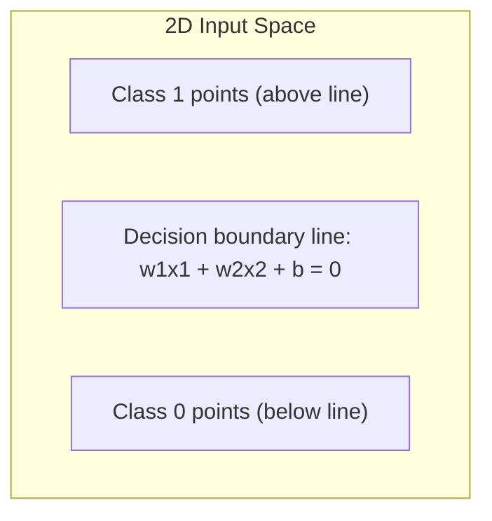

### 1.5 The Big Limitation: XOR Is Not Linearly Separable

Consider the XOR (exclusive OR) function:

| x1 | x2 | y (XOR) |
|----|----|---------|
| 0  | 0  | 0       |
| 0  | 1  | 1       |
| 1  | 0  | 1       |
| 1  | 1  | 0       |

If you try to plot these four points and draw ONE straight line that puts all the "1" points on one side and all the "0" points on the other, **you cannot do it**. The 1s and 0s are arranged diagonally, like a checkerboard pattern.

**Conclusion:** A single perceptron cannot represent XOR because XOR is not linearly separable. This limitation is exactly what motivates using **multiple layers** of neurons (hidden layers) - by combining several linear boundaries, a network CAN represent non-linear patterns like XOR.

### 1.6 Worked Example: A Perceptron That Implements NAND

Given weights `w1 = w2 = -2` and bias `b = 3`:
```
z = -2*x1 - 2*x2 + 3
y = 1 if z > 0, else 0
```

| x1 | x2 | z | y |
|----|----|----|---|
| 0 | 0 | 3 | 1 |
| 0 | 1 | 1 | 1 |
| 1 | 0 | 1 | 1 |
| 1 | 1 | -1 | 0 |

This exactly matches the truth table for logical **NAND** (NOT-AND): output is 0 only when both inputs are 1.

This is actually a profound fact: NAND gates are "universal" in digital logic (you can build any logical circuit out of only NAND gates). Since a perceptron can implement NAND, perceptrons in principle can compute anything a normal computer circuit can - just perhaps inefficiently. This hints at why networks of perceptrons/neurons are so powerful.

---

## 2. Building Complex Decisions With Layers

A perceptron in the hidden layer can combine several raw inputs into one meaningful intermediate concept:
- "The circumstances are convenient" might combine (good weather AND good reviews)
- "There is a strong personal reason to go" might combine (favorite actor OR friend accompanying)

Different neurons can specialize in detecting different combinations of evidence. Then a final output neuron combines these intermediate decisions into the ultimate answer.

### Layers Build Increasingly Abstract Decisions

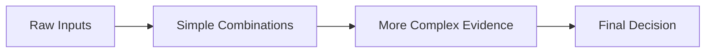

This is the general pattern in deep networks:
- **Early layers** detect simple, low-level patterns (e.g., edges, strokes, simple logical combos)
- **Later layers** combine those simple patterns into increasingly abstract, high-level concepts
- **The final output layer** makes the ultimate decision

---

## 3. The Problem With Perceptrons: They Are Too "Jumpy" to Learn Well

### 3.1 A Small Change Can Cause a Sudden Flip

Consider a perceptron meant to implement OR:
```
w = [1.1, 3.1],  b = -2.2
z = w.x + b
y = 1 if z > 0 else 0
```

| x1 | x2 | z | Expected OR |
|----|----|----|-------------|
| 0 | 0 | -2.2 | 0 |
| 0 | 1 | 0.9  | 1 |
| 1 | 0 | -1.1 | 1 |
| 1 | 1 | 2.0  | 1 |

Wait - look at row `(1,0)`: z = -1.1, so this perceptron actually predicts y=0, but OR requires y=1! This perceptron does NOT correctly implement OR yet (this shows why learning/adjustment is needed).

Now consider what happens if we nudge `w1` slightly from 1.1 to 1.2, evaluated at `x = (1,0)`:
```
Before: z = w1 - 2.2 = 2.19 - 2.2 = -0.01  ->  y = 0
After:  z = w1 - 2.2 = 2.21 - 2.2 = 0.01   ->  y = 1
```

**A change of only 0.02 in the weight flips the output from 0 to 1!** This is because the perceptron's activation function is a **step function** - it jumps abruptly from 0 to 1 at the threshold, with nothing in between.

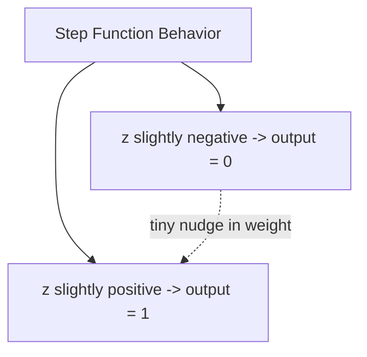

### 3.2 Why Is This a Problem for Learning?

**Learning** means gradually adjusting weights and biases to reduce errors, little by little. But if:

- A small parameter change sometimes causes NO change in output (when far from the threshold), and
- Sometimes causes a SUDDEN, unpredictable jump (when near the threshold),

...then we cannot reliably use "small nudges" to gradually improve the network. In a multi-layer network, one neuron's abrupt flip could cascade and completely change the inputs seen by later layers, making learning chaotic and unpredictable.

**What we actually need:** A neuron whose output changes **smoothly and gradually** when we adjust its weights or bias slightly. This motivates the **sigmoid neuron**.

---

## 4. The Sigmoid Neuron - A Smoother Alternative

### 4.1 From Step Function to Smooth Curve

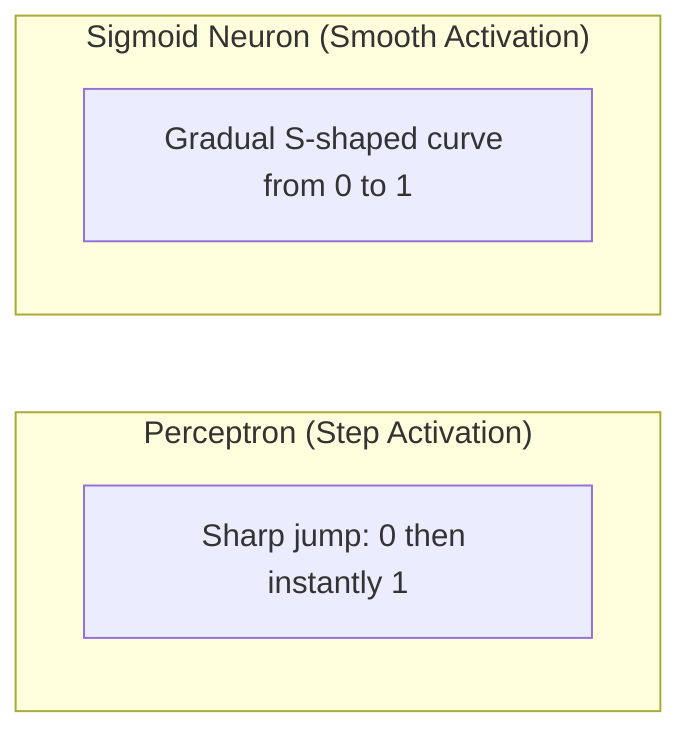

A **sigmoid neuron** works almost exactly like a perceptron, except it replaces the harsh step function with a smooth, S-shaped curve called the **sigmoid function** (also called the **logistic function**).

### 4.2 The Sigmoid Function Formula

The weighted input (same as before):
```
z = w . x + b = sum(wj*xj) + b
```

The activation (the new part):
```
a = sigma(z) = 1 / (1 + e^(-z))
```

**Properties of sigma(z):**
- Its output is always strictly between 0 and 1: `0 < sigma(z) < 1`
- When z is very large and positive, sigma(z) approaches 1
- When z is very large and negative, sigma(z) approaches 0
- When z = 0, sigma(z) = 0.5 exactly (this is the "midpoint")

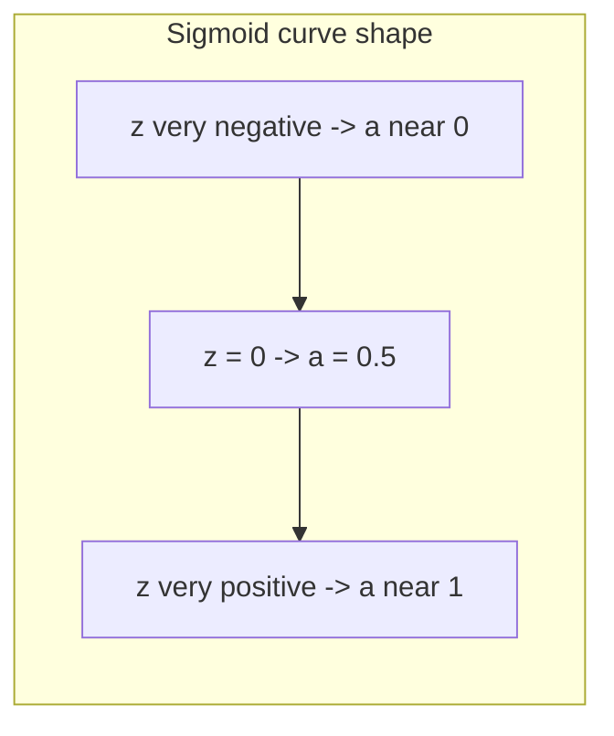

### 4.3 The Sigmoid Is Most Sensitive Near Zero

Looking at the sigmoid curve, we notice:
- The curve changes **most rapidly** near z = 0 (this is called the "active gradient zone")
- The curve becomes **flatter** for very positive or very negative z (this is called the "diminishing gradient zone" - a concept that becomes important later when networks get very deep and can suffer from "vanishing gradients")

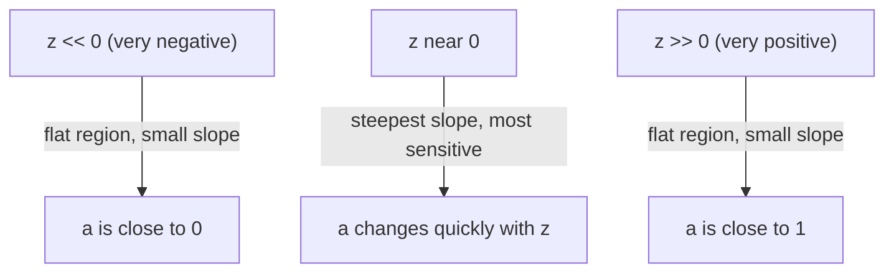

### 4.4 Worked Example: Sigmoid Version of the OR Neuron

Using the same weights as before: `w = [1.1, 3.1], b = -2.2`

For input `x = (1, 0)`:
```
z = (1.1)(1) + (3.1)(0) - 2.2 = 1.1 - 2.2 = -1.1
a = sigma(-1.1) ~ 0.250
```

Now, if we increase `w1` from 1.1 to 1.2:
```
z_new = 1.2 - 2.2 = -1.0
a_new = sigma(-1.0) ~ 0.269
```

**The activation moved smoothly from 0.250 to 0.269** - a small, gradual change, NOT a sudden jump like the perceptron! This is exactly the property we wanted.

### 4.5 Why Smoothness Matters: The Calculus Connection

Because sigma(z) is a smooth (differentiable) function, we can use calculus to precisely predict how a small change in weights/bias will affect the output. If all weights and the bias change by tiny amounts (delta_w1, delta_w2, ..., delta_b), the resulting change in activation can be *approximated* using partial derivatives:

```
delta_a  ~  sum_j( (da/dwj) * delta_wj )  +  (da/db) * delta_b
```

This equation is the mathematical foundation that allows us to intelligently choose HOW to update each weight and bias to reduce the network's error. This is only possible because the function is smooth - it would not work with the perceptron's step function since its derivative is zero almost everywhere and undefined at the jump.

### 4.6 Interpreting the Sigmoid Output

Since the sigmoid neuron outputs a continuous value `a` between 0 and 1 (not just a hard 0 or 1), we can still make binary decisions using a threshold at 0.5:

```
y_hat = 1  if a > 0.5
y_hat = 0  if a <= 0.5
```

But critically, during **training**, we use the raw continuous value `a` (not the thresholded y_hat), because `a` carries much more information about *how close* the neuron is to being correct. A value of a=0.51 and a=0.99 both round to "1", but 0.99 represents a much more confident, more correct prediction - and this nuance matters for calculating gradients and learning effectively.

### 4.7 Key Takeaway Table: Perceptron vs Sigmoid Neuron

| Feature | Perceptron | Sigmoid Neuron |
|---|---|---|
| Activation function | Step function | Sigmoid (S-curve) function |
| Output range | Exactly {0, 1} | Continuous (0, 1) |
| Behavior on small weight change | Either no change, or a sudden jump | Small, smooth, predictable change |
| Good for gradient-based learning? | No (derivative is zero or undefined) | Yes (smooth, differentiable everywhere) |
| Typical input type | Binary (0 or 1) | Can be binary OR real-valued in [0,1] |

---

## 5. Feedforward Neural Networks - Putting Neurons Into Layers

### 5.1 What Is a Feedforward Network?

A **feedforward neural network** is a network where:
- Neurons are organized into **layers**
- Information flows in ONE direction only: from the input layer, through hidden layer(s), to the output layer
- There are **no loops** or cycles - the computation graph is "acyclic" (nothing feeds back into an earlier layer)

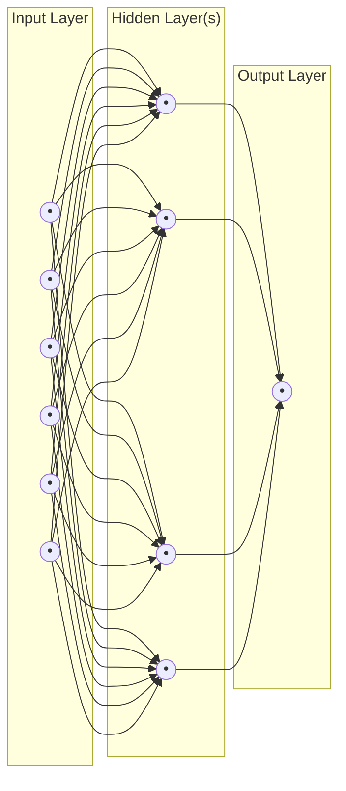

**Naming convention:** Neurons in the very first (leftmost) layer are called the **input layer**. Note that input layer "neurons" don't actually do any computation (no sigmoid applied) - they simply hold the raw input values. Layers between input and output are called **hidden layers** (hidden because we don't directly observe their values as inputs or as the final answer - they are internal to the network). The final layer is the **output layer**.

### 5.2 A Concrete Example: Three-Layer Network for MNIST Digit Classification

MNIST is a famous benchmark dataset of handwritten digit images:
- **Training set:** 60,000 images, each 28x28 pixels, collected from 250 different people
- **Test set:** 10,000 images, 28x28 pixels, from a **different** set of 250 people (this ensures we're testing generalization, not memorization)

**Network architecture for this task:**

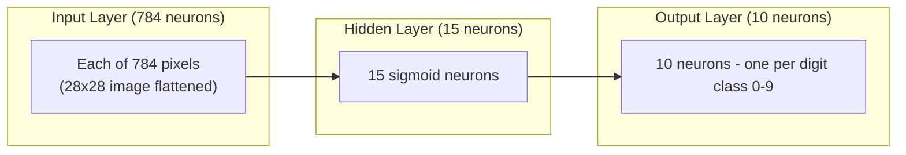

- **Input layer: 784 neurons.** Why 784? Because each image is 28x28 pixels = 784 pixels total. The image is "flattened" row-by-row into one long vector of 784 numbers. Each number represents a pixel's brightness intensity, scaled to be between 0 (white/background) and 1 (fully black/ink).
- **Hidden layer: 15 neurons** (this specific number is a design choice - a hyperparameter).
- **Output layer: 10 neurons**, one for each possible digit (0 through 9). The network's final prediction is the digit whose corresponding output neuron has the **highest activation value**.

### 5.3 What Do the Hidden Layer Neurons Actually "See"?

Interestingly, when we examine trained hidden neurons, we find they tend to become sensitive to small, localized visual patterns within the image - things like a short diagonal stroke, a curved segment, or a small corner shape. Individually these patterns mean little, but the network learns to combine many such simple detectors to recognize a full digit. This mirrors the "layers build abstraction" idea from the movie-decision example.

### 5.4 Hidden Layers: Where the "Art" of Network Design Lies

Choosing input and output layer sizes is usually straightforward (dictated by the problem - e.g., 784 inputs for 28x28 images, 10 outputs for 10 digit classes). But choosing the hidden layers involves more judgment calls:

- **Depth** - how many hidden layers to use?
- **Width** - how many neurons per hidden layer?
- **Activation functions** - sigmoid, or other choices (explored in later chapters)
- **Regularization** - techniques to prevent overfitting

There are trade-offs: more/larger hidden layers *can* improve accuracy, but they also increase training time and computational cost, and risk **overfitting** (memorizing rather than generalizing).

---

## 6. Learning With Gradient Descent

### 6.1 Setting Up the Learning Problem Mathematically

For the MNIST digit classification network:
- **Input:** `x`, a 784-dimensional vector (flattened 28x28 image)
- **Desired output:** `y(x)`, a "one-hot" vector - all zeros except a single 1 in the position of the correct digit.

Example: if the image shows digit "5", then:
```
y(x) = (0, 0, 0, 0, 0, 1, 0, 0, 0, 0)^T
```
(the 1 sits in the position corresponding to digit 5, counting from 0)

**Goal of learning:** Find weights `w` and biases `b` such that the network's actual output `a(x)` gets as close as possible to the desired target `y(x)`, for ALL training examples simultaneously.

### 6.2 Output Activation Vectors

For any input image x, the network produces an output vector `a(x)` with 10 real numbers (one activation per output neuron), each between 0 and 1.

**Example:** Suppose x is truly an image of digit 3. A well-trained network might output:
```
a(x) = [0.02, 0.01, 0.04, 0.81, 0.03, 0.02, 0.01, 0.03, 0.02, 0.01]
```
Notice position index 3 (fourth number) has the highest value, 0.81 - correctly indicating "3" with high confidence.

The target for this example is:
```
y(x) = [0, 0, 0, 1, 0, 0, 0, 0, 0, 0]
```

The difference `y(x) - a(x)` tells us exactly how wrong each output neuron currently is.

### 6.3 The Cost Function (aka Loss Function) - Measuring "How Wrong We Are"

We need a single number that summarizes how badly the network is performing, so that we have something concrete to try to minimize. The most basic choice is the **quadratic cost function** (also called mean squared error):

**For a single training example x:**
```
Cx(w, b) = (1/2) * ||y(x) - a(x)||^2
```

Here `||v||^2` means "take the vector v, square each of its components, and sum them up" (this is the squared Euclidean/L2 norm). Squaring makes all differences positive (so overshooting and undershooting are penalized equally) and heavily penalizes large errors.

**Key property:** if `a(x)` gets closer to `y(x)`, then `Cx` gets smaller. If they become identical, Cx = 0 (a perfect match).

**For the entire training set (n examples):** we simply average the individual costs:
```
C(w, b) = (1/n) * sum_over_x( Cx(w,b) )
        = (1/(2n)) * sum_over_x( ||y(x) - a(x)||^2 )
```

> **Learning = Finding the weights and biases w, b that make C(w,b) as small as possible.**

### 6.4 Why This Particular Cost Function? Smoothness Matters Again

We specifically choose the quadratic cost because it is a **smooth function** of the parameters w and b - meaning it is continuous and differentiable everywhere. This smoothness is exactly what allows us to use calculus-based optimization (gradient descent) to systematically reduce the cost, rather than blindly guessing.

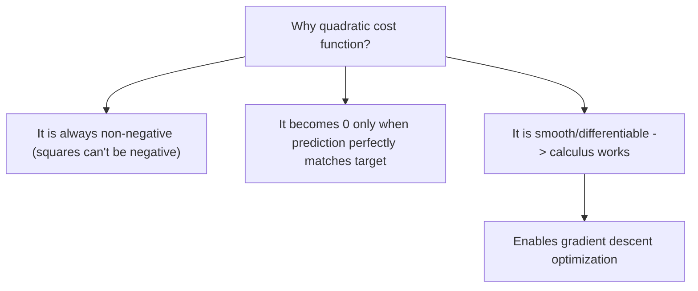

*(Note: later, more advanced chapters typically replace this with a "cross-entropy" cost function for classification tasks, but the quadratic cost is the natural starting point for building intuition.)*

---

## 7. Gradient Descent - The Core Learning Algorithm

### 7.1 The Big Picture: Rolling a Ball Downhill

Imagine the cost function C as a hilly, bowl-shaped landscape, where the height at any point represents how bad our current parameters are. We want to find the lowest point in this landscape (minimum cost).

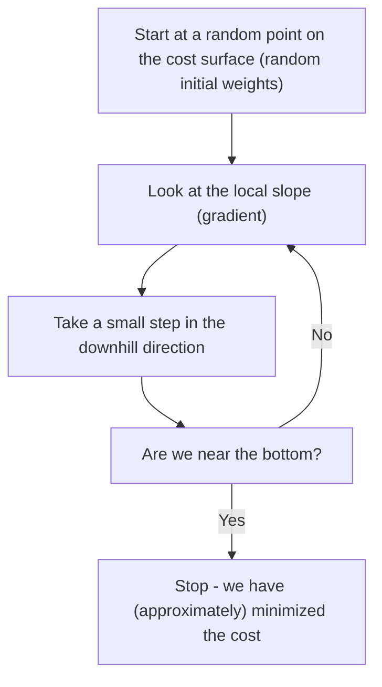

Gradient descent is exactly this idea, formalized with calculus: we compute the **gradient** (which tells us the direction of steepest INCREASE) and then step in the OPPOSITE direction (steepest decrease).

### 7.2 The Gradient - A Multi-Dimensional Derivative

Suppose our cost function depends on many parameters, `C = C(v1, v2, ..., vm)`. If we nudge all parameters slightly by amounts `delta_v = (delta_v1, ..., delta_vm)`, then the resulting small change in C can be approximated as:

```
delta_C  ~  sum_j( (dC/dvj) * delta_vj )
```

We define the **gradient vector**, written `grad(C)` or "nabla C":
```
grad(C) = [ dC/dv1,  dC/dv2,  ...,  dC/dvm ]^T
```

This lets us rewrite the approximation neatly as a dot product:
```
delta_C  ~  grad(C) . delta_v
```

**Geometric meaning:** The gradient vector, at any given point, points in the direction of the **steepest increase** of C from that point. (Its negative therefore points toward steepest decrease.)

**Worked example:** Suppose `C = (1/4)(v1^2 + v2^2)`. At the point `(v1, v2) = (2, 1)`:
```
dC/dv1 = v1/2 = 1
dC/dv2 = v2/2 = 0.5
grad(C) = [1, 0.5]
```
This vector points "outward and slightly up" from the point (2,1) on the bowl-shaped surface - exactly the direction of fastest increase in height.

### 7.3 Choosing the Right Direction to Move

We know: `delta_C ~ grad(C) . delta_v`

We WANT `delta_C < 0` (we want the cost to decrease). Since `grad(C)` points toward the steepest *increase*, moving in the exact opposite direction should give the steepest *decrease*. So we choose:

```
delta_v = -eta * grad(C)
```

where `eta > 0` (Greek letter "eta") is called the **learning rate** - a small positive number controlling how big a step we take.

### 7.4 Proving This Choice Actually Decreases the Cost

Substituting our chosen `delta_v` back into the approximation:
```
delta_C ~ grad(C) . (-eta * grad(C))
        = -eta * ||grad(C)||^2
        = -eta * sum_j( (dC/dvj)^2 )
```

Since `eta > 0` and any squared quantity `||grad(C)||^2 >= 0`, we get:
```
delta_C <= 0   (approximately)
```

**This proves that moving opposite to the gradient (by a sufficiently small step) is guaranteed to decrease the cost** (or at worst leave it unchanged if we're already at a flat spot, like the minimum).

### 7.5 The Gradient Descent Update Rule

Putting it together, at each step:
```
v_new = v_old - eta * grad(C)
```

We repeat this over and over:
```
v -> v - eta*grad(C) -> v - eta*grad(C) -> ...
```//
Each repetition should move us a bit closer to a region of lower cost.


### 7.6 The Learning Rate Trade-off: Too Small vs Too Large

The math above relied on an approximation (`delta_C ~ grad(C).delta_v`) that is only accurate when `delta_v` is SMALL. This creates an important trade-off:

| Learning Rate eta | What Happens | Consequence |
|---|---|---|
| **Too small** | Each update barely moves the parameters | Training becomes extremely slow, requiring many updates to converge |
| **Too large** | delta_v is too big, and the linear approximation breaks down | The cost may actually increase, oscillate wildly, or diverge - learning becomes unstable |
| **Just right** | Balances speed and stability | Efficient, steady convergence toward the minimum |

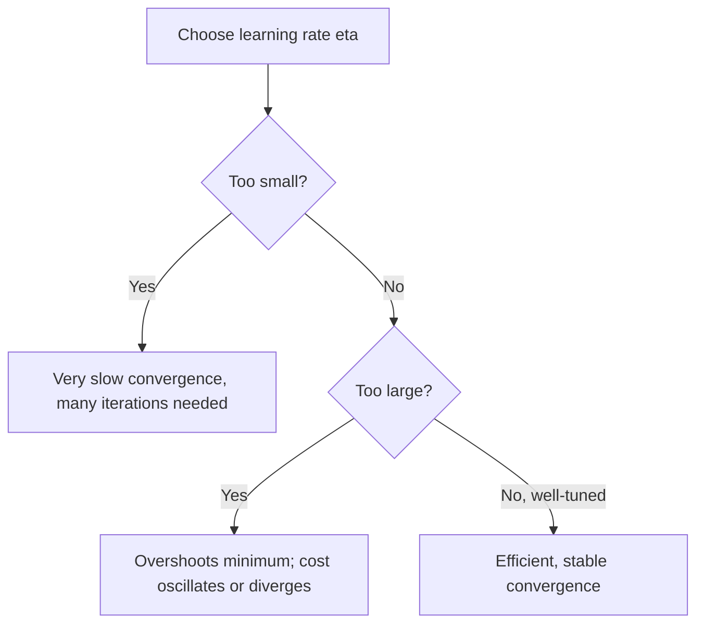

### 7.7 Applying Gradient Descent to an Actual Neural Network

In a neural network, the "parameters" v are simply ALL the weights and biases in the entire network. So the general update rule specializes to:

**For each weight wk:**
```
wk_new = wk_old - eta * (dC/dwk)
```

**For each bias bl:**
```
bl_new = bl_old - eta * (dC/dbl)
```

Each partial derivative tells us: "if I nudge this ONE specific parameter slightly, how much does the overall cost change?" We use this information for every weight and bias, simultaneously, to take one coordinated step downhill in this extremely high-dimensional landscape (a network can easily have thousands or millions of parameters!).

### 7.8 The Gradient of the Total Cost Is the Average of Individual Gradients

Recall that the overall cost is an average over all n training examples:
```
C = (1/n) * sum_x(Cx)
```

Since differentiation is linear, the gradient of a sum/average is the sum/average of the gradients:
```
grad(C) = (1/n) * sum_x( grad(Cx) )
```

**In words:** each individual training example "votes" on which direction each parameter should move, and we average all these votes together to decide the actual update direction.

---

## 8. Worked Example: Teaching a Single Sigmoid Neuron to Learn OR

This example walks through gradient descent by hand, step by step, on the simplest possible case: one sigmoid neuron learning the logical OR function.

### 8.1 The Setup

**Target function (OR truth table):**

| x1 | x2 | y(x) |
|----|----|------|
| 0 | 0 | 0 |
| 0 | 1 | 1 |
| 1 | 0 | 1 |
| 1 | 1 | 1 |

**Initial (untrained, essentially random) parameters:**
```
w1 = 0.5,  w2 = -0.3,  b = 0.1
```

**Neuron computation:**
```
z(x) = w1*x1 + w2*x2 + b
a(x) = sigma(z(x))
```

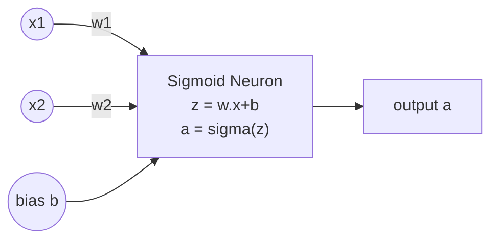

### 8.2 Step 1: Evaluate the Untrained Neuron on All Four Examples

| x1 | x2 | y(x) | z(x) | a(x) = sigma(z) |
|----|----|------|------|------|
| 0 | 0 | 0 | 0.10 | 0.5250 |
| 0 | 1 | 1 | -0.20 | 0.4502 |
| 1 | 0 | 1 | 0.60 | 0.6457 |
| 1 | 1 | 1 | 0.30 | 0.5744 |

We can already see problems: for `(0,0)` the target is 0 but a=0.525 (too high). For `(0,1)` the target is 1 but a=0.450 (too low, and even below the 0.5 threshold, meaning this neuron would currently misclassify this example).

### 8.3 Step 2: Compute the Cost for Each Example

Using `Cx = (1/2)*(y(x) - a(x))^2`:

| x1 | x2 | y(x) | a(x) | Cx |
|----|----|------|------|-----|
| 0 | 0 | 0 | 0.5250 | 0.13780 |
| 0 | 1 | 1 | 0.4502 | 0.15116 |
| 1 | 0 | 1 | 0.6457 | 0.06278 |
| 1 | 1 | 1 | 0.5744 | 0.09055 |

Average cost: `C ~ 0.11057`

Our task now: adjust `w1, w2, b` using gradient descent so that this average cost decreases.

### 8.4 Step 3: Derive the Gradient Formula (Using the Chain Rule)

To find how the cost changes with respect to `w1` (or any parameter), we must trace the "chain of influence":
```
w1  -->  z  -->  a  -->  Cx
```

A change in `w1` changes `z`, which changes `a` (through the sigmoid), which changes `Cx` (through the squared error). By the **chain rule** of calculus:
```
dCx/dw1 = (dCx/da) * (da/dz) * (dz/dw1)
```

**Computing each piece:**

1. `dCx/da = (a - y)`  
   *(derivative of (1/2)(y-a)^2 with respect to a)*

2. `da/dz = a*(1-a)`  
   *(this is a special, elegant property of the sigmoid function - its derivative can be written in terms of itself!)*

3. `dz/dwj = xj`  
   *(since z = w1*x1 + w2*x2 + b, the partial derivative with respect to wj is simply xj)*

**Multiplying these together:**
```
dCx/dwj = (a - y) * a*(1-a) * xj
```

**For the bias**, since `dz/db = 1`:
```
dCx/db = (a - y) * a*(1-a)
```

**Combined gradient vector for one example:**
```
grad(Cx) = (a - y) * a*(1-a) * [x1, x2, 1]
```

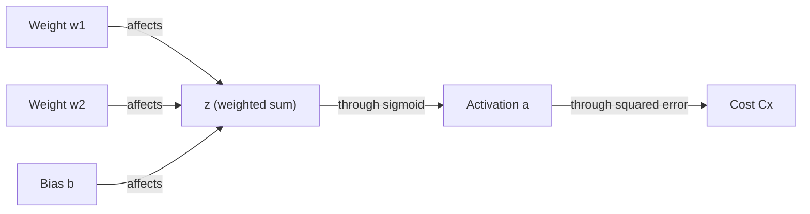

### 8.5 Step 4: Compute the Gradient for Each Training Example

**Example x=(0,1), y=1, a=0.4502:**
```
grad(Cx) = (0.4502 - 1) * 0.4502 * (1-0.4502) * [0, 1, 1]
         = (-0.5498) * 0.4502 * 0.5498 * [0, 1, 1]
         ~ (0, -0.13609, -0.13609)
```
Note: since x1=0, the gradient with respect to w1 is exactly zero for this example - w1 simply has NO influence on this particular training case's output. But since x2=1 and y=1 (we need MORE activation), and the coefficient is negative, gradient descent (which subtracts the gradient) will INCREASE w2. This matches our intuition: the neuron needs a stronger push toward "1" whenever x2=1, since that alone should be enough for OR to fire.

**Doing this for all four examples, we get:**

| x | y | a | grad(Cx) |
|---|---|---|----------|
| (0,0) | 0 | 0.5250 | (0, 0, 0.13092) |
| (0,1) | 1 | 0.4502 | (0, -0.13609, -0.13609) |
| (1,0) | 1 | 0.6457 | (-0.08107, 0, -0.08107) |
| (1,1) | 1 | 0.5744 | (-0.10403, -0.10403, -0.10403) |

Notice that different examples "disagree" somewhat on how to adjust parameters (for instance, the (0,0) example wants the bias to DEcrease relatively, based on sign conventions, while others want other adjustments) - this is normal. Gradient descent handles this by averaging all the "advice" together.

### 8.6 Step 5: Average the Gradients to Get the Full Gradient

```
grad(C) = (1/4) * [grad(C00) + grad(C01) + grad(C10) + grad(C11)]
        ~ (-0.04627, -0.06003, -0.04757)
```

### 8.7 Step 6: Apply One Gradient Descent Update

Using learning rate `eta = 1`:
```
w1_new = 0.5   - (1)(-0.04627)  ~ 0.54627
w2_new = -0.3  - (1)(-0.06003)  ~ -0.23997
b_new  = 0.1   - (1)(-0.04757)  ~ 0.14757
```

### 8.8 Step 7: Verify the Update Actually Helped

| Input | Target | Activation Before | Activation After |
|---|---|---|---|
| (0,0) | 0 | 0.5250 | 0.5368 |
| (0,1) | 1 | 0.4502 | 0.4769 |
| (1,0) | 1 | 0.6457 | 0.6668 |
| (1,1) | 1 | 0.5744 | 0.6116 |

- Cost before: `C ~ 0.11057`
- Cost after one update: `C ~ 0.10296`

**The cost decreased!** All activations moved in the correct direction (toward their targets).

### 8.9 Repeating the Process: Watching the Neuron Learn Over Time

If we repeat this compute-gradient-then-update cycle many times:

| Step | w1 | w2 | b | Cost | Correct out of 4 |
|---|---|---|---|---|---|
| 0 | 0.500 | -0.300 | 0.100 | 0.1106 | 2/4 |
| 1 | 0.546 | -0.240 | 0.148 | 0.1030 | 2/4 |
| 5 | 0.690 | -0.040 | 0.277 | 0.0843 | 3/4 |
| 20 | 0.975 | 0.408 | 0.352 | 0.0641 | 3/4 |
| 100 | 1.753 | 1.558 | -0.340 | 0.0332 | 4/4 |

The cost steadily decreases, and eventually the neuron correctly classifies all four OR examples. This is gradient descent "learning" in action, on the smallest possible example.

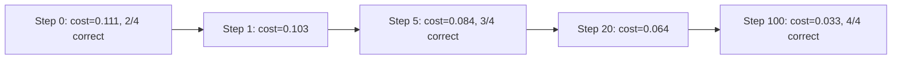

---

## 9. Scaling Up: Why We Need Stochastic Gradient Descent (SGD)

### 9.1 The Problem With "Full-Batch" Gradient Descent on Large Datasets

For our tiny OR example, computing the full gradient required looking at all 4 training examples - trivially cheap.

But recall the formula:
```
grad(C) = (1/n) * sum_over_x( grad(Cx) )
```

MNIST has **n = 60,000 training images**. If we use plain (full-batch) gradient descent, then EVERY SINGLE parameter update requires computing the gradient across all 60,000 images first. This is extremely computationally expensive, especially since we need to repeat this process potentially thousands of times to converge.

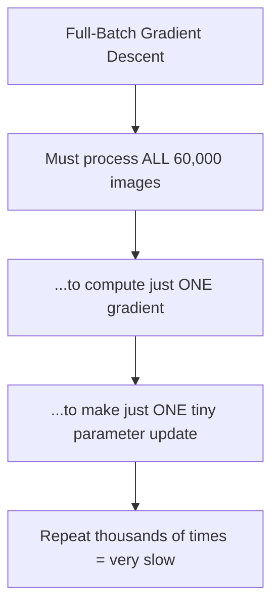

### 9.2 The Solution: Stochastic Gradient Descent (SGD) With Mini-Batches

**Core idea:** Instead of using the entire training set to compute an exact gradient, randomly sample a small subset (called a **mini-batch**) of size `m` and use it to compute an **approximate** gradient.

```
grad(C)  ~  (1/m) * sum_{j=1 to m}( grad(C_Xj) )
```

This is much cheaper to compute (only m examples instead of n), and while each individual estimate is noisier/less accurate, on average it points in roughly the right direction, and we can afford to take MANY more (cheaper) steps in the same amount of time.

### 9.3 The SGD Training Loop: Epochs and Mini-Batches

The full training procedure works like this:

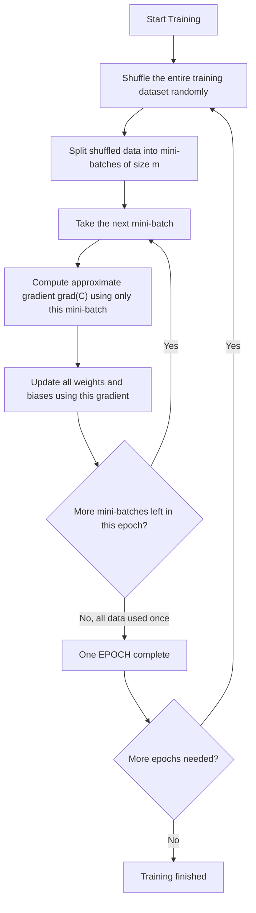

**Key vocabulary:**
- **Mini-batch:** a small, randomly chosen subset of the training data (e.g., 10, 32, or 100 examples at a time)
- **Epoch:** one complete pass through the ENTIRE training dataset (i.e., after processing every mini-batch once, we've completed one epoch)
- Training typically runs for **many epochs** (repeating the shuffle-and-batch process over and over), since one pass usually isn't enough to fully learn the patterns.

### 9.4 The Mini-Batch Update Formula

For a specific weight connecting neuron k to neuron j at layer l:
```
w_jk_new = w_jk_old - (eta/m) * sum_{i=1 to m}( dC_i/dw_jk )
```

For a bias:
```
b_j_new = b_j_old - (eta/m) * sum_{i=1 to m}( dC_i/db_j )
```

In words: for the current mini-batch of size m, compute the partial derivative of the cost with respect to each parameter for EACH of the m examples, average these m values, and use that average to perform one gradient descent update.

### 9.5 Full-Batch GD vs Mini-Batch SGD - Comparison

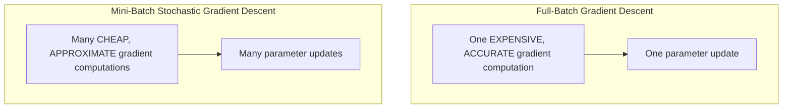

| Aspect | Full-Batch GD | Mini-Batch SGD |
|---|---|---|
| Data used per update | All n examples | Small subset of m examples |
| Cost per update | Expensive | Cheap |
| Accuracy of each gradient estimate | Exact | Approximate (noisy) |
| Path toward minimum | Smooth | "Noisy" / zig-zaggy, but generally trending downhill |
| Practical speed on large datasets | Slow | Usually much faster overall |

In practice, especially for large datasets like MNIST, mini-batch SGD converges to a good solution much faster in wall-clock time, even though each individual step is less precise, because we get to take vastly more steps for the same computational budget.

---

## 10. Applying This to the MNIST Network - Practical Details

### 10.1 Network Architecture Recap

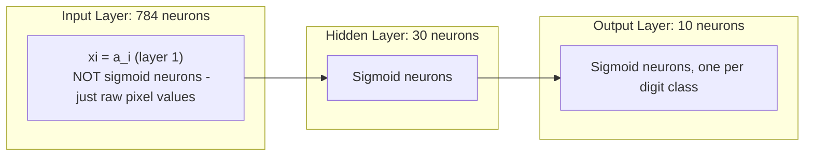

- Network layer sizes: `[784, 30, 10]`
- **Important detail:** the input layer does NOT contain actual sigmoid neurons - it simply holds the raw pixel intensities directly as `x_i`, which by convention is also written `a_i^(1)` (the "activation" of layer 1, even though no sigmoid computation actually happens there).

### 10.2 Counting the Parameters

For a fully-connected network with layer sizes [784, 30, 10]:

**Weights connecting input layer to hidden layer:**
Every one of the 30 hidden neurons connects to every one of the 784 input neurons:
```
30 * 784 = 23,520 weights
```

**Biases for hidden layer:** one bias per hidden neuron:
```
30 biases
```

**Weights connecting hidden layer to output layer:**
Every one of the 10 output neurons connects to every one of the 30 hidden neurons:
```
10 * 30 = 300 weights
```

**Biases for output layer:**
```
10 biases
```

**Grand total:**
```
(30 x 785) + (10 x 31) = 23,550 + 310 = 23,860 total parameters
```

(Here "785" = 784 weights + 1 bias per hidden neuron, and "31" = 30 weights + 1 bias per output neuron - this is a compact way of counting weights+biases together.)

This means gradient descent must simultaneously tune **23,860 numbers** to make this network classify digits accurately - and this is considered a genuinely SMALL, simple network by modern standards!

### 10.3 The Feedforward Computation

Once trained, using the network to make a prediction (this is called "feedforward" or "inference") just means repeatedly applying:
```
a' = sigma(w . a + b)
```
layer by layer, where `a` is the activation vector from the previous layer, `w` and `b` are that layer's weights and biases, and `a'` is the resulting activation vector for the current layer. We start with `a = x` (the input pixels) and keep applying this formula until we reach the output layer.

```mermaid
flowchart LR
    A["a (layer 1) = raw input pixels x"] -->|"apply w2, b2, sigma"| B["a (layer 2) - hidden layer activations"]
    B -->|"apply w3, b3, sigma"| C["a (layer 3) - output layer activations"]
    C --> D["Prediction = index of neuron with highest activation"]
```

### 10.4 A Python Utility Used in Implementation: `zip()`

The lecture material includes a demonstration of Python's `zip()` function, since it's commonly used when implementing neural networks (e.g., pairing up weight matrices with bias vectors layer-by-layer, or pairing training inputs with labels).

**Basic zip - pairs elements at the same index from two lists:**
```python
L1, L2 = ['a', 'b', 'c'], [1, 2, 3]
for x, y in zip(L1, L2):
    print(x, y)
# Output:
# a 1
# b 2
# c 3
```

**Zip with slicing - useful for pairing consecutive layers together:**
```python
L1, L2 = ['a', 'b', 'c'], [1, 2, 3]
for x, y in zip(L1[:-1], L2[1:]):
    print(x, y)
# L1[:-1] = ['a', 'b']   (all except last)
# L2[1:]  = [2, 3]       (all except first)
# Output:
# a 2
# b 3
```

This slicing pattern `zip(list[:-1], list[1:])` is a very common trick in neural network code to iterate over **consecutive pairs of layers** (e.g., pairing layer sizes [784, 30, 10] to get the pairs (784,30) and (30,10), which tells you the shape of each weight matrix needed between layers).

**Combined with list comprehension:**
```python
L1, L2 = [10, 20, 30], [1, 2, 3]
L3 = [x + y for x, y in zip(L1[:-1], L2[1:])]
for i in L3:
    print(i)
# L1[:-1] = [10, 20]
# L2[1:]  = [2, 3]
# Sums: 10+2=12, 20+3=23
# Output:
# 12
# 23
```

### 10.5 Implementation Checklist (What a Full Implementation Needs)

Based on the course material's outline, implementing this network from scratch requires:

```mermaid
flowchart TD
    A[Network initialization code] --> B["Random initial weights & biases"]
    B --> C["Feedforward function: a' = sigma(w.a + b)"]
    C --> D["Vectorized sigma function - apply to entire arrays/vectors at once, not one number at a time"]
    D --> E["SGD outer loop: shuffle data, create mini-batches, loop over epochs"]
    E --> F["update_mini_batch function: compute gradients for one mini-batch and apply the update"]
    F --> G["Full SGD.py training script tying it all together"]
    G --> H["Demo / Evaluation on held-out test data"]
```

---

## 11. Backpropagation - How a Network Actually Computes Its Gradients

Sections 6-9 established *why* we need gradient descent and showed the gradient formula for a single sigmoid neuron. But real networks have many layers, each with many weights and biases. **Backpropagation** is the algorithm that efficiently computes the gradient `dC/dw` and `dC/db` for every single weight and bias in a multi-layer network, no matter how deep. It is not a different learning rule from gradient descent - it is simply the fast, practical *method* for computing the gradient that gradient descent then uses to update parameters.

### 11.1 Why Do We Need a Special Algorithm for This?

Think back to the mini-batch gradient formula from Section 9.4:

```
grad(C) ~ (1/m) * sum_{i=1}^{m}(grad(C_i))
```

To use this, we need `grad(C_i)` - the gradient of the cost with respect to **every weight and bias**, for **each training example**. A modest network (784-30-10, as in Section 10.2) already has 23,860 parameters. Computing each partial derivative one at a time, from scratch, using the naive approximation

```
dC/dwj ~ (C(w + eps*ej) - C(w)) / eps
```

would require re-running the entire network once per parameter (23,860 full forward passes, PER training example!). This is hopelessly slow.

**Backpropagation solves this by being clever about re-using computation.** In one forward pass plus one backward pass, it computes the gradient with respect to ALL parameters simultaneously. This is what makes training large networks computationally feasible - it's the single most important algorithm in this course.

```mermaid
flowchart LR
    A["Naive approach: recompute cost from scratch for every single weight"] -->|"very slow - one pass per parameter"| B["Impractical for 1000s of parameters"]
    C["Backpropagation: one forward pass + one backward pass"] -->|"reuses intermediate results"| D["Computes ALL gradients at once - fast"]
```

### 11.2 Notation: Naming Every Weight, Bias, and Activation Precisely

Before we can write down the backpropagation equations, we need unambiguous notation to refer to any specific weight, bias, or activation anywhere in the network.

**Weight notation: `w^l_jk`**

This denotes the weight connecting the **k-th neuron in layer (l-1)** to the **j-th neuron in layer l**.

```mermaid
flowchart LR
    subgraph "Layer l-1"
    k(("neuron k"))
    end
    subgraph "Layer l"
    j(("neuron j"))
    end
    k -->|"w^l_jk"| j
```

Notice the index order looks "backwards" at first glance - the *second* index (k) refers to the layer *before* (l-1), and the *first* index (j) refers to the *current* layer l. This seemingly odd ordering is deliberate: it is chosen specifically so that later formulas (matrix multiplication of weights by the previous layer's activations) come out clean and don't need extra transposing.

**Bias and activation notation: `b^l_j` and `a^l_j`**

- `b^l_j` is the bias of the j-th neuron in layer l.
- `a^l_j` is the activation (output) of the j-th neuron in layer l.

```mermaid
flowchart LR
    subgraph "Layer l"
    N["neuron j has bias b^l_j
    and produces activation a^l_j"]
    end
```

**Putting it together: the weighted input `z^l_j`**

The weighted input to neuron j in layer l (i.e., the value fed into the activation function, before sigma is applied) is:

```
z^l_j = sum_k( w^l_jk * a^(l-1)_k ) + b^l_j
```

In words: take every neuron k in the *previous* layer, multiply its activation by the weight connecting it to neuron j, sum all of those up, and add neuron j's own bias.

**Vector form (all neurons in a layer at once):**

```
z^l = w^l * a^(l-1) + b^l
a^l = sigma(z^l)
```

Here `w^l` is the entire weight *matrix* for layer l (rows = neurons in layer l, columns = neurons in layer l-1), `a^(l-1)` is the *vector* of all activations from the previous layer, and `b^l` is the *vector* of biases for layer l. This vectorized form is exactly what lets us compute an entire layer's activations in a single matrix multiplication, instead of looping over each neuron individually - this is why the "backwards-looking" weight index convention from before matters (it makes this matrix multiplication line up correctly).

### 11.3 The Cost Function and the Hadamard Product

**Output layer and cost:** If the network has L layers total, the output layer is layer L, and its activation vector is `a^L`. The cost for a single training example x is a function of this final output:

```
Cx = C(a^L)
```

For the quadratic cost specifically:

```
Cx = (1/2) * ||y - a^L||^2 = (1/2) * sum_j( (y_j - a^L_j)^2 )
```

This is exactly the same cost function from Section 6.3, just written using the `a^L` layer notation.

**The Hadamard product (element-wise multiplication):** Backpropagation's equations are written compactly using an operation called the **Hadamard product**, denoted `⊙`. Unlike normal matrix multiplication, this simply multiplies two vectors (or matrices) of the same shape **element by element**:

```
[1]   [3]   [1*3]   [3]
[2] ⊙ [4] = [2*4] = [8]
```

This is different from a dot product (which would give a single number) - the Hadamard product gives back a vector of the same size, where each entry is the product of the corresponding entries in the two inputs. We need this because in the backprop formulas, we want to combine two same-shaped vectors "position by position" (e.g., each neuron's own error combined with each neuron's own derivative), not sum them into a single number.

### 11.4 Defining the "Error" of a Neuron: `delta^l_j`

This is the central new idea that makes backpropagation work. Instead of directly computing `dC/dw` and `dC/db` for every parameter (which is awkward), we first introduce an intermediate quantity called the **error** of neuron j in layer l:

```
delta^l_j = dCx / dz^l_j
```

In words: **the error of a neuron measures how sensitive the overall cost is to that neuron's weighted input `z`.** It answers the question: "if I could nudge this neuron's internal weighted-sum value by a tiny amount, how much would the final cost change?"

```mermaid
flowchart LR
    A["Imagine a tiny gremlin sitting inside neuron j, layer l"] --> B["The gremlin secretly adds a small nudge, delta_z, to z^l_j"]
    B --> C["This nudge changes the cost by approximately: delta_C ~ (dCx/dz^l_j) * delta_z"]
    C --> D["We call the sensitivity dCx/dz^l_j the 'error' delta^l_j"]
```

**Why is this useful?** Once we know `delta^l_j` for a neuron, it turns out (as shown below) that the derivatives with respect to its incoming weight and bias become almost trivial one-line formulas. So the whole problem of finding `dC/dw` and `dC/db` for every parameter reduces to: "first find all the `delta^l_j` values, then everything else follows easily."

For an entire layer, collect the individual neuron errors into a vector `delta^l` (one error value per neuron in that layer).

### 11.5 The Four Fundamental Equations of Backpropagation

Backpropagation is built from exactly four equations, traditionally labeled BP1 through BP4. They accomplish **two jobs**:

```mermaid
flowchart TD
    subgraph "Job 1: Compute the error vectors"
    BP1["BP1: delta^L = grad_(a^L)(Cx) ⊙ sigma'(z^L)
    (error at the OUTPUT layer)"]
    BP2["BP2: delta^l = ((w^(l+1))^T * delta^(l+1)) ⊙ sigma'(z^l)
    (error at any HIDDEN layer, using the NEXT layer's error)"]
    end
    subgraph "Job 2: Compute the parameter derivatives"
    BP3["BP3: dCx/db^l_j = delta^l_j"]
    BP4["BP4: dCx/dw^l_jk = a^(l-1)_k * delta^l_j"]
    end
    BP1 --> BP3
    BP1 --> BP2
    BP2 --> BP3
    BP2 --> BP4
    BP3 --> BP4
```

Let's derive and understand each one individually.

### 11.6 BP1: The Error at the Output Layer

**Goal:** compute `delta^L_j` for the very last layer, since this is where we can start (the cost is a direct function of the output activations).

**Derivation using the chain rule:** The cost depends on `z^L_j` only through `a^L_j` (since `a^L_j = sigma(z^L_j)`), so the dependency chain is:

```
z^L_j  --->  a^L_j  --->  Cx
```

By the chain rule:

```
delta^L_j = dCx/dz^L_j = (dCx/da^L_j) * (da^L_j/dz^L_j)
```

Since `a^L_j = sigma(z^L_j)`, we know `da^L_j/dz^L_j = sigma'(z^L_j)`. Substituting:

```
delta^L_j = (dCx/da^L_j) * sigma'(z^L_j)          ... (BP1, single neuron)
```

**Vector form:** Collecting `dCx/da^L_j` for every output neuron j into a single vector called the gradient of C with respect to `a^L`, written `grad_(a^L)(Cx)`, and combining it with the vector `sigma'(z^L)` using the Hadamard product:

```
delta^L = grad_(a^L)(Cx) ⊙ sigma'(z^L)          ... (BP1, vector form)
```

**Specializing to the quadratic cost:** Recall `Cx = (1/2) * sum_j(y_j - a^L_j)^2`. Differentiating with respect to `a^L_j`:

```
dCx/da^L_j = a^L_j - y_j
```

Substituting into BP1:

```
delta^L = (a^L - y) ⊙ sigma'(z^L)
```

**This is a hugely important practical result:** for the quadratic cost, the output-layer error is simply "(what the network predicted) minus (what it should have predicted)," scaled element-wise by the sigmoid derivative. We can compute this directly from the network's own output and the known correct answer - no extra layers of chain rule needed at this step.

### 11.7 BP2: Propagating the Error Backward Through Hidden Layers

**The problem:** BP1 only gives us the error at the very last layer, L. But we need `dC/dw` and `dC/db` for weights and biases in EVERY layer, including hidden ones. So we need a way to compute `delta^l` for a hidden layer l, given that we already know `delta^(l+1)` (the error one layer further along, toward the output).

**Setting up the chain rule for a hidden neuron:** Consider neuron k in hidden layer l. Its activation `a^l_k` doesn't affect the cost directly - it affects the cost *indirectly*, by influencing every neuron j in the *next* layer (l+1), since:

```
z^(l+1)_j = sum_k( w^(l+1)_jk * a^l_k ) + b^(l+1)_j
```

Because `a^l_k` feeds into many different neurons j in the next layer, we must **sum over all of them** when applying the chain rule (this is the multivariable chain rule - contributions from every path must be added):

```
dCx/da^l_k = sum_j( (dCx/dz^(l+1)_j) * (dz^(l+1)_j/da^l_k) )
```

```mermaid
flowchart LR
    k(("neuron k, layer l")) -->|"w^(l+1)_1k"| j1(("neuron 1, layer l+1"))
    k -->|"w^(l+1)_2k"| j2(("neuron 2, layer l+1"))
    k -->|"w^(l+1)_3k"| j3(("neuron 3, layer l+1"))
    j1 -.-> C[Cost]
    j2 -.-> C
    j3 -.-> C
```

**Evaluating the two derivatives inside the sum:**
- By definition, `dCx/dz^(l+1)_j = delta^(l+1)_j` (that's literally how we defined "error").
- From the formula for `z^(l+1)_j` above, `dz^(l+1)_j/da^l_k = w^(l+1)_jk` (since everything else in that sum is treated as constant when differentiating with respect to `a^l_k`).

Substituting both in:

```
dCx/da^l_k = sum_j( w^(l+1)_jk * delta^(l+1)_j )
```

**Converting this into an error `delta^l_k`:** Recall that `delta^l_k = (dCx/da^l_k) * sigma'(z^l_k)` (same chain-rule logic as BP1, just one layer earlier). Substituting the sum we just derived:

```
delta^l_k = ( sum_j( w^(l+1)_jk * delta^(l+1)_j ) ) * sigma'(z^l_k)          ... (BP2, single neuron)
```

**Vector form:** The sum `sum_j( w^(l+1)_jk * delta^(l+1)_j )` is exactly the k-th component of the matrix-vector product `(w^(l+1))^T * delta^(l+1)` (the transpose of the weight matrix, times the next layer's error vector). So in full vector form:

```
delta^l = ( (w^(l+1))^T * delta^(l+1) ) ⊙ sigma'(z^l)          ... (BP2, vector form)
```

**Intuition - why is this called "back"-propagation?** BP2 lets us compute the error of layer l using the error of layer l+1 (the layer *after* it). This means once we have `delta^L` (from BP1), we can get `delta^(L-1)` using BP2, then `delta^(L-2)` from `delta^(L-1)`, and so on, walking backward through the network one layer at a time, all the way to the first hidden layer. This backward flow of error information, layer by layer, is exactly why the algorithm is called **backpropagation**.

```mermaid
flowchart RL
    subgraph "Output Layer L"
    dL["delta^L (from BP1)"]
    end
    subgraph "Hidden Layer L-1"
    dL1["delta^(L-1) (from BP2, using delta^L)"]
    end
    subgraph "Hidden Layer L-2"
    dL2["delta^(L-2) (from BP2, using delta^(L-1))"]
    end
    dL -->|"BP2"| dL1
    dL1 -->|"BP2"| dL2
```

### 11.8 BP3 and BP4: From Error to the Actual Gradients

We now have a way to find `delta^l_j` for every neuron in every layer (BP1 to start, BP2 to work backward). The whole point of computing all these errors was to make finding the ACTUAL derivatives we need - with respect to weights and biases - simple.

**BP3 - derivative with respect to a bias:**

The dependency chain is `b^l_j ---> z^l_j ---> Cx`. By the chain rule:

```
dCx/db^l_j = (dCx/dz^l_j) * (dz^l_j/db^l_j)
```

Since `z^l_j = sum_k(w^l_jk * a^(l-1)_k) + b^l_j`, we have `dz^l_j/db^l_j = 1` (the bias contributes directly and additively, with coefficient 1). So:

```
dCx/db^l_j = delta^l_j          ... (BP3)
```

**In plain words: the derivative of the cost with respect to any bias is simply that neuron's error.** No extra computation needed once you have `delta`.

**BP4 - derivative with respect to a weight:**

The dependency chain is `w^l_jk ---> z^l_j ---> Cx`. By the chain rule:

```
dCx/dw^l_jk = (dCx/dz^l_j) * (dz^l_j/dw^l_jk)
```

Since `z^l_j = sum_k(w^l_jk * a^(l-1)_k) + b^l_j`, differentiating with respect to `w^l_jk` picks out just the one term containing it, giving `dz^l_j/dw^l_jk = a^(l-1)_k`. So:

```
dCx/dw^l_jk = a^(l-1)_k * delta^l_j          ... (BP4)
```

**In plain words: the derivative of the cost with respect to a weight is (the activation flowing INTO that connection) times (the error flowing OUT of that connection).**

**Vectorized forms** (useful for implementation, avoiding explicit loops over j and k):

```
grad_(b^l)(Cx) = delta^l
grad_(w^l)(Cx) = delta^l * (a^(l-1))^T
```

### 11.9 Worked Numeric Example: Backpropagation on a Tiny 2-2-2 Network

To make all four equations completely concrete, let's manually backpropagate through a tiny network: 2 input neurons, 2 hidden neurons, 2 output neurons, all using sigmoid activation.

**Setup:**

```
x = (1, 0)^T           (input)
y = (1, 0)^T           (desired output)

w^2 = [ 1     0.6 ]     b^2 = (0, 0)^T
      [-1    -0.4 ]

w^3 = [ 1   -1 ]        b^3 = (0, 0)^T
      [-1    1 ]

a^1 = x = (1, 0)^T      (input layer activation is just the raw input)
```

```mermaid
flowchart LR
    subgraph "Layer 1 (input)"
    a1((1)) 
    a2((0))
    end
    subgraph "Layer 2 (hidden)"
    h1((a^2_1))
    h2((a^2_2))
    end
    subgraph "Layer 3 (output)"
    o1((a^3_1))
    o2((a^3_2))
    end
    a1 --> h1
    a1 --> h2
    a2 --> h1
    a2 --> h2
    h1 --> o1
    h1 --> o2
    h2 --> o1
    h2 --> o2
```

**Step 1 - Forward pass (compute and store every z and a):**

Hidden layer:
```
z^2 = w^2 * a^1 + b^2 = (1*1 + 0.6*0, -1*1 + (-0.4)*0) = (1, -1)
a^2 = sigma(z^2) ~ (0.7311, 0.2689)
```

Output layer:
```
z^3 = w^3 * a^2 + b^3 ~ (1*0.7311 - 1*0.2689, -1*0.7311 + 1*0.2689) ~ (0.4621, -0.4621)
a^3 = sigma(z^3) ~ (0.6135, 0.3865)
```

Cost for this example:
```
Cx = (1/2) * ||y - a^3||^2 ~ 0.1494
```

We now have everything stored (`z^2, a^2, z^3, a^3`) that backpropagation needs.

**Step 2 - BP1: error at the output layer.**

```
grad_(a^3)(Cx) = a^3 - y ~ (0.6135 - 1, 0.3865 - 0) = (-0.3865, 0.3865)
sigma'(z^3) = a^3 ⊙ (1 - a^3) ~ (0.6135*0.3865, 0.3865*0.6135) ~ (0.2371, 0.2371)

delta^3 = (a^3 - y) ⊙ sigma'(z^3) ~ (-0.3865*0.2371, 0.3865*0.2371) ~ (-0.09164, 0.09164)
```

**Step 3 - BP3 and BP4 at the output layer (immediate, now that we have delta^3):**

```
dCx/db^3   = delta^3 ~ (-0.09164, 0.09164)
dCx/dw^3   = delta^3 * (a^2)^T ~ [ -0.06699  -0.02465 ]
                                  [  0.06699   0.02465 ]
```

(For instance, the entry `dCx/dw^3_12 = a^2_2 * delta^3_1 ~ 0.2689 * (-0.09164) ~ -0.02465`.)

**Step 4 - BP2: propagate the error backward to the hidden layer.**

First compute `(w^3)^T * delta^3`:
```
(w^3)^T * delta^3 = [ 1  -1 ] * (-0.09164, 0.09164)^T ~ (-0.18328, 0.18328)
                    [-1   1 ]
```

Then apply the Hadamard product with `sigma'(z^2) = a^2 ⊙ (1-a^2) ~ (0.19661, 0.19661)`:

```
delta^2 = (-0.18328, 0.18328) ⊙ (0.19661, 0.19661) ~ (-0.03604, 0.03604)
```

**Step 5 - BP3 and BP4 at the hidden layer.**

```
dCx/db^2 = delta^2 ~ (-0.03604, 0.03604)
dCx/dw^2 = delta^2 * (a^1)^T = (-0.03604, 0.03604) * (1, 0) = [ -0.03604   0 ]
                                                                [  0.03604   0 ]
```

(Notice the second column is all zeros - this is because `a^1_2 = x_2 = 0`, and BP4 multiplies by the incoming activation. If an input is 0, none of the weights leading FROM that input can affect the cost for this particular example, so their gradient contribution is 0 here.)

**Result:** We have now computed the gradient of the cost with respect to **every single weight and bias in the network**, using just one forward pass and one backward pass. This is the complete backpropagation computation for one training example.

### 11.10 The Backpropagation Algorithm, Step by Step

Putting it all together, here is the full algorithm for one training example x:

```mermaid
flowchart TD
    A["STEP 1: Forward Pass
    Set a^1 = x.
    For l = 2 to L: compute z^l = w^l a^(l-1) + b^l, then a^l = sigma(z^l).
    STORE every z^l and a^l - you will need them going backward."] --> B["STEP 2: Compute Output Error (BP1)
    delta^L = grad_(a^L)(Cx) ⊙ sigma'(z^L)"]
    B --> C["STEP 3: Backpropagate the Error (BP2)
    For l = L-1 down to 2:
    delta^l = ((w^(l+1))^T delta^(l+1)) ⊙ sigma'(z^l)"]
    C --> D["STEP 4: Read Off the Gradients (BP3, BP4)
    For every layer l:
    dCx/db^l_j = delta^l_j
    dCx/dw^l_jk = a^(l-1)_k * delta^l_j"]
```

Two clean phases: a **forward pass** (compute and remember activations, moving left to right through the network) and a **backward pass** (compute error vectors, moving right to left). Once both passes are done, every derivative we need is available via simple formulas (BP3, BP4) - no further chain-rule work required.

**Connecting back to the mini-batch formula from Section 9.4:** Backpropagation as described here computes `grad(Cx)` for ONE training example x. To get the gradient for a full mini-batch (needed for one SGD update), we simply run this entire forward+backward procedure once per example in the mini-batch, then average all the resulting gradients together, exactly as described in Section 9.4.

### 11.11 What Do the Backpropagation Equations Tell Us About *Why* Learning Can Be Slow?

Looking at BP4, `dCx/dw^l_jk = a^(l-1)_k * delta^l_j`, we can read off two situations where a weight's gradient will be nearly zero - meaning gradient descent will barely update it, i.e., **learning will be slow for that weight**:

```mermaid
flowchart TD
    A["A weight w^l_jk learns SLOWLY if EITHER:"] --> B["The input neuron has LOW activation
    (a^(l-1)_k is close to 0)
    -> the product a^(l-1)_k * delta^l_j is small regardless of delta"]
    A --> C["The output neuron has SATURATED
    (a^l_j is close to 0 or close to 1)
    -> sigma'(z^l_j) is nearly 0 in the 'diminishing gradient zone'
    -> delta^l_j itself becomes tiny, since delta depends on sigma'(z)"]
```

Recall from Section 4.3 that the sigmoid's derivative is largest near z=0 and shrinks toward 0 as z becomes very positive or very negative (the "diminishing gradient zone" versus the "active gradient zone"). Because `delta^l_j` always carries a factor of `sigma'(z^l_j)` (see BP1 and BP2), any neuron whose weighted input pushes it into the flat, saturated parts of the sigmoid curve will have a very small error signal, and therefore contribute very small gradients to every weight and bias feeding into it. This is an early hint of the famous **vanishing gradient problem** that becomes especially serious in very deep networks, explored further in later chapters.

Similarly, from BP3, a bias `b^l_j` learns slowly whenever its neuron has saturated, for the same reason (`delta^l_j` is tiny).

This is also why sensible weight initialization matters: if weights and biases are initialized so that many neurons' weighted inputs `z^l_j` start out very large in magnitude, those neurons begin training already saturated and learn very slowly right from the start. This is part of the motivation for initializing weights and biases by sampling from a standard normal distribution N(0,1) - it tends to keep the initial `z` values in a moderate range, closer to the "active gradient zone."

### 11.12 Why Nonlinear Activation Functions Are Essential

A natural question: what if we used a plain linear activation, `a^l = z^l` (i.e., no sigmoid, no squashing at all), instead of the sigmoid? Does the hidden layer still add anything useful?

**Working through the algebra for a network with one hidden layer:**

```
Hidden layer:  a^2 = w^2 * x + b^2                  (instead of a^2 = sigma(w^2 x + b^2))
Output layer:  a^3 = w^3 * a^2 + b^3                (instead of a^3 = sigma(w^3 a^2 + b^3))
```

Substituting the hidden layer's formula into the output layer's formula:

```
a^3 = w^3 * (w^2 * x + b^2) + b^3
    = (w^3 * w^2) * x + (w^3 * b^2 + b^3)
```

**Define** `w' = w^3 * w^2` and `b' = w^3 * b^2 + b^3`. Then:

```
a^3 = w' * x + b'
```

**This is EXACTLY the computation of a network with NO hidden layer at all** - just a single linear transformation directly from input to output! Stacking multiple *linear* layers collapses mathematically into a single linear layer, no matter how many layers you stack or how wide they are.

```mermaid
flowchart LR
    A["Network with linear hidden layer(s)"] -->|"algebraically equivalent to"| B["A single layer with no hidden layer at all"]
    C["Network with NONLINEAR hidden layer(s), e.g. sigmoid"] -->|"CANNOT be collapsed"| D["Genuinely more expressive - can represent curved/complex decision boundaries, like XOR (Section 1.5)"]
```

**This is precisely why nonlinear activation functions (like the sigmoid) are essential.** They prevent the layers from collapsing into a single affine (linear) transformation, which is what actually gives deep networks their extra representational power - the ability to learn complex, non-linearly-separable patterns like XOR (recall Section 1.5), rather than being stuck as a glorified single-layer linear classifier no matter how many layers are added.

### 11.13 Special Case: Backpropagation for Plain Linear Regression

To sanity-check the four equations in the simplest possible setting, consider a network for linear regression: just a single output neuron, no hidden layer, and the **identity activation function** (`a = z`, no sigmoid at all):

```
x = (x1, x2, ..., xn)^T   --->   one output neuron
a = z = w^T x + b
Cx = (1/2) * (y - a)^2
```

**BP1 simplifies:** Since `a = z`, we get `da/dz = 1`. So:

```
delta = dCx/da = a - y
```

(No sigmoid derivative factor appears at all, since the identity function's derivative is always 1.)

**There is no BP2** for this network, because there are no hidden layers to propagate the error back into.

**BP3 gives the bias derivative directly:**

```
dCx/db = delta = a - y
```

**BP4 gives each weight's derivative:**

```
dCx/dw_k = x_k * delta = x_k * (a - y)
```

This matches exactly what you would get by directly differentiating the cost function `Cx = (1/2)(y-a)^2` with respect to `w_k` and `b` using ordinary calculus (try it - substitute `a = w^T x + b` and differentiate directly). This confirms that backpropagation's four equations are not some mysterious new machinery - they are simply a systematic, efficient way of applying the ordinary chain rule, organized so that the computation can be reused efficiently across many layers.

### 11.14 Backpropagation Summary Table

| Equation | Name | What It Computes | Formula |
|---|---|---|---|
| BP1 | Output error | Error at the final layer L | `delta^L = grad_(a^L)(Cx) ⊙ sigma'(z^L)` |
| BP2 | Backpropagated error | Error at any hidden layer l, from the next layer's error | `delta^l = ((w^(l+1))^T delta^(l+1)) ⊙ sigma'(z^l)` |
| BP3 | Bias gradient | Derivative of cost w.r.t. any bias | `dCx/db^l_j = delta^l_j` |
| BP4 | Weight gradient | Derivative of cost w.r.t. any weight | `dCx/dw^l_jk = a^(l-1)_k * delta^l_j` |

**The two-phase algorithm:**

```mermaid
flowchart LR
    A["Forward Pass
    (left to right)
    compute & store all z, a"] --> B["Backward Pass
    (right to left)
    compute all delta via BP1, then BP2"] --> C["Read off gradients
    via BP3, BP4
    for every weight & bias"]
```

---

## 12. Master Summary - The Big Ideas of This Chapter

```mermaid
flowchart TD
    A["Problem: Hand-coded rules for pattern recognition don't scale or generalize"] --> B["Solution: Learn from labeled examples instead"]
    B --> C["Building block: Perceptron - weighted sum + step threshold"]
    C --> D["Limitation: Perceptrons are brittle - jumpy step function makes gradual learning impossible"]
    D --> E["Fix: Sigmoid Neuron - smooth S-curve activation instead of a step"]
    E --> F["Stack neurons into layers: Feedforward Neural Network"]
    F --> G["Define a Cost Function to measure how wrong the network is"]
    G --> H["Use Gradient Descent - move parameters opposite to the gradient to reduce cost"]
    H --> I["Scale up efficiently with Stochastic Gradient Descent - mini-batches + epochs"]
    I --> J["Use Backpropagation to efficiently COMPUTE the gradient for every weight and bias, via one forward pass + one backward pass"]
    J --> K["Result: A trainable network that can learn tasks like handwritten digit recognition"]
```

### Key Terms Glossary

| Term | Simple Meaning |
|---|---|
| **Perceptron** | Simplest neuron: weighted sum of inputs, compared to a threshold, giving a 0/1 output |
| **Weight (w)** | A number representing how strongly/importantly an input influences the neuron |
| **Bias (b)** | A number representing how easily the neuron "fires" (negative of the threshold) |
| **Activation (a)** | The neuron's output value after applying its activation function |
| **Sigmoid function** | A smooth S-shaped curve squashing any real number into the range (0,1) |
| **Feedforward network** | A layered network where data flows only forward, no loops |
| **Hidden layer** | Any layer between the input and output layers; not directly observed |
| **Cost/Loss function** | A single number measuring how wrong the network's predictions are overall |
| **Gradient** | A vector of partial derivatives showing the direction of steepest cost increase |
| **Gradient Descent** | Repeatedly stepping opposite to the gradient to reduce the cost |
| **Learning rate (eta)** | Controls how big each gradient descent step is |
| **Epoch** | One full pass through the entire training dataset |
| **Mini-batch** | A small random subset of training data used to approximate the gradient cheaply |
| **Stochastic Gradient Descent (SGD)** | Gradient descent using mini-batches instead of the full dataset each step |
| **Generalization** | The network's ability to perform well on new, unseen data (not just training data) |
| **Linearly separable** | Data that can be split into classes using a single straight line/hyperplane (perceptrons can only handle this) |
| **XOR problem** | Classic example showing perceptrons cannot represent non-linearly-separable functions |
| **Backpropagation** | The algorithm that efficiently computes dC/dw and dC/db for every weight and bias, using one forward pass and one backward pass |
| **Weighted input (z)** | The value fed into a neuron's activation function, before sigma is applied: z = w.a + b |
| **Error (delta)** | dCx/dz for a neuron - how sensitive the cost is to that neuron's weighted input |
| **Hadamard product (⊙)** | Element-wise multiplication of two same-shaped vectors/matrices |
| **Vanishing gradient (early hint)** | Saturated neurons (sigma'(z) near 0) produce tiny error/gradients, so learning slows down |

### Formula Cheat Sheet

```
Perceptron rule:      y = 1 if (w.x + b) > 0, else 0
Sigmoid activation:   a = sigma(z) = 1 / (1 + e^(-z)),  where z = w.x + b
Quadratic cost (one example):   Cx = (1/2) * ||y(x) - a(x)||^2
Quadratic cost (all examples):  C = (1/n) * sum_x(Cx)
Gradient descent update:        v_new = v_old - eta * grad(C)
Weight update:                  w = w - eta * (dC/dw)
Bias update:                    b = b - eta * (dC/db)
Sigmoid derivative:              da/dz = a*(1-a)
Gradient for one example (single neuron): grad(Cx) = (a-y) * a*(1-a) * x
Mini-batch gradient (approx):    grad(C) ~ (1/m) * sum_{i=1}^{m}(grad(C_i))

Weighted input:                 z^l = w^l * a^(l-1) + b^l
Layer activation:               a^l = sigma(z^l)
Error definition:               delta^l_j = dCx/dz^l_j
BP1 (output error):             delta^L = grad_(a^L)(Cx) ⊙ sigma'(z^L)
BP1 (quadratic cost):           delta^L = (a^L - y) ⊙ sigma'(z^L)
BP2 (backprop error):           delta^l = ((w^(l+1))^T * delta^(l+1)) ⊙ sigma'(z^l)
BP3 (bias gradient):            dCx/db^l_j = delta^l_j
BP4 (weight gradient):          dCx/dw^l_jk = a^(l-1)_k * delta^l_j
```
