## 1. The Perceptron - The Simplest Artificial Neuron

### 1.1 What Is a Perceptron?

A **perceptron** is the simplest kind of artificial neuron. Think of it as a tiny decision-maker that looks at several pieces of evidence (inputs) and produces a single yes/no answer (output).

- **Inputs:** several binary values, x1, x2, ..., xn, where each xi is either 0 or 1
- **Weights:** each input has an associated weight ${w_j}$ that tells us how important/influential that input is
- **Output:** a single binary value, y, either 0 or 1

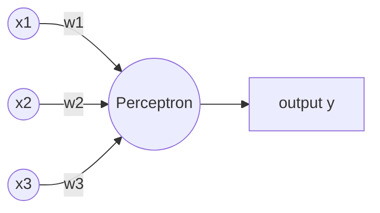


### 1.2 The Decision Rule (Weighted Sum + Threshold)

The perceptron first computes a **weighted sum** of all inputs:

$$\text{weighted sum} = \sum_{j=0} (w_j * x_j)$$

Then it compares this sum to a **threshold** value:

```
y = 1   if (sum of wj*xj) > threshold
y = 0   if (sum of wj*xj) <= threshold
```

**Worked Example:**

Given:
```
x = [1, 0, 1]      (three binary inputs)
w = [2, -1, 1]     (corresponding weights)
threshold = 2
```

Step 1 - Compute the weighted sum:
```
sum = (2)(1) + (-1)(0) + (1)(1) = 2 + 0 + 1 = 3
```

Step 2 - Compare to threshold:
```
Is 3 > 2?  Yes.
Therefore y = 1
```

**Interpretation of weights:**
- **Positive weights** support (push toward) output 1
- **Negative weights** oppose (push toward) output 0
- The **threshold** sets how much total "evidence" is needed before the perceptron fires a 1

### 1.3 From Threshold to Bias

Instead of writing "threshold" as a separate quantity, mathematicians prefer to move it to the other side of the inequality and rename it. This is purely a notational convenience that makes later formulas cleaner.

Starting point:
```
sum(wj*xj) > threshold
```

Rearranged:
```
sum(wj*xj) - threshold > 0
```

Define the **bias**:
```
b = -threshold
```

New decision rule:
```
y = 1   if (w . x + b) > 0
y = 0   if (w . x + b) <= 0
```

Here `w . x` means the dot product of the weight vector and input vector (i.e., the weighted sum).

**Intuition for bias:** Think of the bias as a measure of "how easy it is for this neuron to fire." 
- A **large positive bias** makes it very easy for the neuron to output 1 (it doesn't need much evidence).
- A **large negative bias** makes it very hard for the neuron to output 1 (it needs a LOT of evidence).

**Quick check:** Suppose `w . x = 2`.

| Bias b | w.x + b | Output |
|---|---|---|
| -3 | 2 + (-3) = -1 | 0 (since -1 <= 0) |
| -1 | 2 + (-1) = 1 | 1 (since 1 > 0) |
| 2  | 2 + 2 = 4  | 1 (since 4 > 0) |

Notice: changing the bias does NOT change how important each individual input is (that's the weights' job). It only shifts how much total evidence is required to reach a "yes."

### 1.4 The Perceptron as a Linear Classifier

For two inputs, the decision boundary is the line:
```
w1*x1 + w2*x2 + b = 0
```

- Points where `w1*x1 + w2*x2 + b > 0` are classified as class 1
- Points where `w1*x1 + w2*x2 + b <= 0` are classified as class 0

In 2D this boundary is a straight **line**. In higher dimensions it becomes a flat **hyperplane**. This is why a single perceptron is called a **linear classifier** - it can only separate data that can be divided by a straight line/plane.

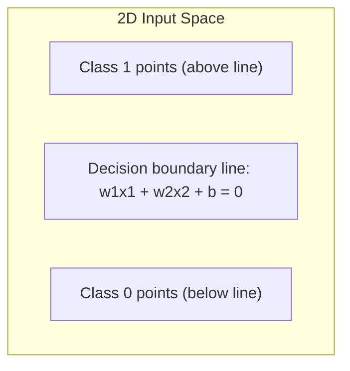

### 1.5 The Big Limitation: XOR Is Not Linearly Separable

Consider the XOR (exclusive OR) function:

| x1 | x2 | y (XOR) |
|----|----|---------|
| 0  | 0  | 0       |
| 0  | 1  | 1       |
| 1  | 0  | 1       |
| 1  | 1  | 0       |

If you try to plot these four points and draw ONE straight line that puts all the "1" points on one side and all the "0" points on the other, **you cannot do it**. The 1s and 0s are arranged diagonally, like a checkerboard pattern.

**Conclusion:** A single perceptron cannot represent XOR because XOR is not linearly separable. This limitation is exactly what motivates using **multiple layers** of neurons (hidden layers) - by combining several linear boundaries, a network CAN represent non-linear patterns like XOR.

### 1.6 Worked Example: A Perceptron That Implements NAND

Given weights `w1 = w2 = -2` and bias `b = 3`:
```
z = -2*x1 - 2*x2 + 3
y = 1 if z > 0, else 0
```

| $x_1$ | $x_2$ | z   | y   |
| ----- | ----- | --- | --- |
| 0     | 0     | 3   | 1   |
| 0     | 1     | 1   | 1   |
| 1     | 0     | 1   | 1   |
| 1     | 1     | -1  | 0   |

This exactly matches the truth table for logical **NAND** (NOT-AND): output is 0 only when both inputs are 1.

This is actually a profound fact: NAND gates are "universal" in digital logic (you can build any logical circuit out of only NAND gates). Since a perceptron can implement NAND, perceptrons in principle can compute anything a normal computer circuit can - just perhaps inefficiently. This hints at why networks of perceptrons/neurons are so powerful.

---

## 2. Building Complex Decisions With Layers

### 2.1 Example: "Should I Go to the Movie?"

To build intuition for why we stack layers of neurons, consider this everyday decision. Suppose we have these binary inputs:
- Is the weather good?
- Is it a Konkani movie?
- Are the reviews good?
- Is my favorite actor in it?
- Is a friend accompanying me?

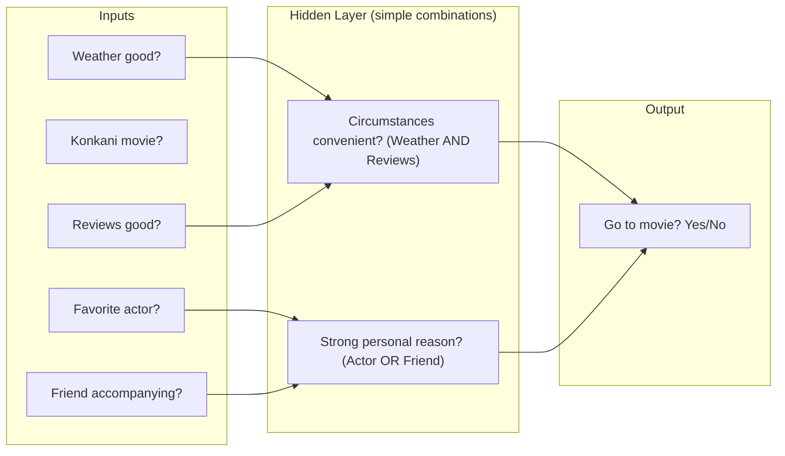

**Key insight:** A perceptron in the hidden layer can combine several raw inputs into one meaningful intermediate concept:
- "The circumstances are convenient" might combine (good weather AND good reviews)
- "There is a strong personal reason to go" might combine (favorite actor OR friend accompanying)

Different neurons can specialize in detecting different combinations of evidence. Then a final output neuron combines these intermediate decisions into the ultimate answer.

### 2.2 Layers Build Increasingly Abstract Decisions

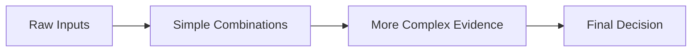

This is the general pattern in deep networks:
- **Early layers** detect simple, low-level patterns (e.g., edges, strokes, simple logical combos)
- **Later layers** combine those simple patterns into increasingly abstract, high-level concepts
- **The final output layer** makes the ultimate decision

This is exactly why we call networks with many layers "deep" - the depth allows building up abstraction step by step.

---

## 3. The Problem With Perceptrons: They Are Too "Jumpy" to Learn Well

### 3.1 A Small Change Can Cause a Sudden Flip

Consider a perceptron meant to implement OR:
```
w = [1.1, 3.1],  b = -2.2
z = w.x + b
y = 1 if z > 0 else 0
```

| x1 | x2 | z | Expected OR |
|----|----|----|-------------|
| 0 | 0 | -2.2 | 0 |
| 0 | 1 | 0.9  | 1 |
| 1 | 0 | -1.1 | 1 |
| 1 | 1 | 2.0  | 1 |

Wait - look at row `(1,0)`: z = -1.1, so this perceptron actually predicts y=0, but OR requires y=1! This perceptron does NOT correctly implement OR yet (this shows why learning/adjustment is needed).

Now consider what happens if we nudge `w1` slightly from 1.1 to 1.2, evaluated at `x = (1,0)`:
```
Before: z = w1 - 2.2 = 2.19 - 2.2 = -0.01  ->  y = 0
After:  z = w1 - 2.2 = 2.21 - 2.2 = 0.01   ->  y = 1
```

**A change of only 0.02 in the weight flips the output from 0 to 1!** This is because the perceptron's activation function is a **step function** - it jumps abruptly from 0 to 1 at the threshold, with nothing in between.

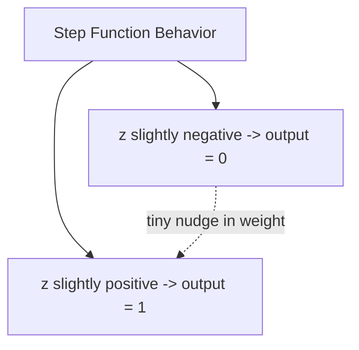

### 3.2 Why Is This a Problem for Learning?

**Learning** means gradually adjusting weights and biases to reduce errors, little by little. But if:

- A small parameter change sometimes causes NO change in output (when far from the threshold), and
- Sometimes causes a SUDDEN, unpredictable jump (when near the threshold),

...then we cannot reliably use "small nudges" to gradually improve the network. In a multi-layer network, one neuron's abrupt flip could cascade and completely change the inputs seen by later layers, making learning chaotic and unpredictable.

**What we actually need:** A neuron whose output changes **smoothly and gradually** when we adjust its weights or bias slightly. This motivates the **sigmoid neuron**.

---

## 4. The Sigmoid Neuron - A Smoother Alternative

### 4.1 The Sigmoid Function Formula

$$
a = \sigma(z) = \frac{1}{1 + e^{-z}}
$$

Looking at the sigmoid curve, we notice:
- The curve changes **most rapidly** near z = 0 (this is called the "active gradient zone")
- The curve becomes **flatter** for very positive or very negative z (this is called the "diminishing gradient zone")

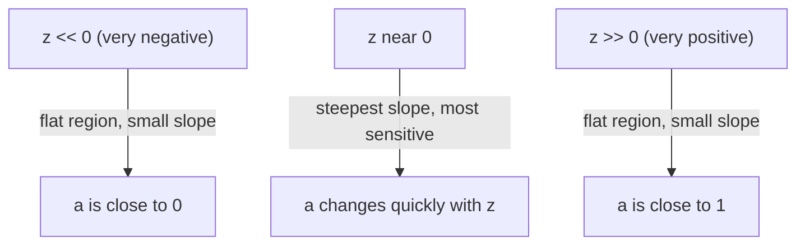

### 4.2 Worked Example: Sigmoid Version of the OR Neuron

Using the same weights as before: `w = [1.1, 3.1], b = -2.2`

For input `x = (1, 0)`:
```
z = (1.1)(1) + (3.1)(0) - 2.2 = 1.1 - 2.2 = -1.1
a = sigma(-1.1) ~ 0.250
```

Now, if we increase `w1` from 1.1 to 1.2:
```
z_new = 1.2 - 2.2 = -1.0
a_new = sigma(-1.0) ~ 0.269
```

**The activation moved smoothly from 0.250 to 0.269** - a small, gradual change, NOT a sudden jump like the perceptron! This is exactly the property we wanted.

### 4.3 Why Smoothness Matters: The Calculus Connection

If all weights and the bias change by tiny amounts ($\delta_{w_1}, \delta_{w_2}, ..., \delta_b$), the resulting change in activation can be *approximated* using partial derivatives:

$$
\begin{equation}
    \delta_a = \sum_{j=0}^{b} \left( \frac{\partial a}{\partial w_j} \cdot \delta_{w_j} \right) + \frac{\partial a}{\partial b} \cdot \delta_b
\end{equation}

$$

This equation is the mathematical foundation that allows us to intelligently choose HOW to update each weight and bias to reduce the network's error. This is only possible because the function is smooth - it would not work with the perceptron's step function since its derivative is zero almost everywhere and undefined at the jump.

### 4.4 Interpreting the Sigmoid Output

Since the sigmoid neuron outputs a continuous value `a` between 0 and 1 (not just a hard 0 or 1), we can still make binary decisions using a threshold at 0.5:

```
y_hat = 1  if a > 0.5
y_hat = 0  if a <= 0.5
```

But critically, during **training**, we use the raw continuous value `a` (not the thresholded y_hat), because `a` carries much more information about *how close* the neuron is to being correct. A value of a=0.51 and a=0.99 both round to "1", but 0.99 represents a much more confident, more correct prediction - and this nuance matters for calculating gradients and learning effectively.

---

## 5. Feedforward Neural Networks - Putting Neurons Into Layers

### 5.1 What Is a Feedforward Network?

A **feedforward neural network** is a network where:
- Neurons are organized into **layers**
- Information flows in ONE direction only: from the input layer, through hidden layer(s), to the output layer
- There are **no loops** or cycles - the computation graph is "acyclic" (nothing feeds back into an earlier layer)

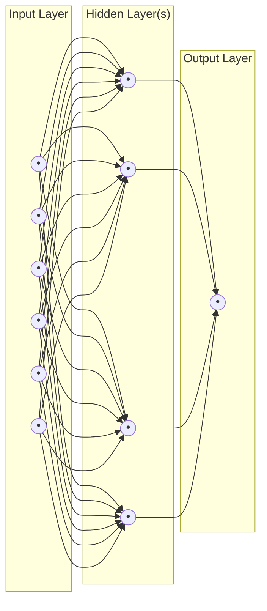

**Naming convention:** Neurons in the very first (leftmost) layer are called the **input layer**. Note that input layer "neurons" don't actually do any computation (no sigmoid applied) - they simply hold the raw input values. Layers between input and output are called **hidden layers** (hidden because we don't directly observe their values as inputs or as the final answer - they are internal to the network). The final layer is the **output layer**.

### 5.2 A Concrete Example: Three-Layer Network for MNIST Digit Classification

MNIST is a famous benchmark dataset of handwritten digit images:
- **Training set:** 60,000 images, each 28x28 pixels, collected from 250 different people
- **Test set:** 10,000 images, 28x28 pixels, from a **different** set of 250 people (this ensures we're testing generalization, not memorization)

**Network architecture for this task:**

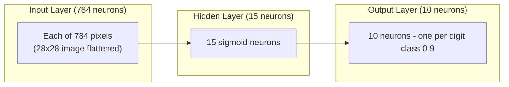

- **Input layer: 784 neurons.** Why 784? Because each image is 28x28 pixels = 784 pixels total. The image is "flattened" row-by-row into one long vector of 784 numbers. Each number represents a pixel's brightness intensity, scaled to be between 0 (white/background) and 1 (fully black/ink).
- **Hidden layer: 15 neurons** (this specific number is a design choice - a hyperparameter).
- **Output layer: 10 neurons**, one for each possible digit (0 through 9). The network's final prediction is the digit whose corresponding output neuron has the **highest activation value**.

### 5.3 What Do the Hidden Layer Neurons Actually "See"?

Interestingly, when we examine trained hidden neurons, we find they tend to become sensitive to small, localized visual patterns within the image - things like a short diagonal stroke, a curved segment, or a small corner shape. Individually these patterns mean little, but the network learns to combine many such simple detectors to recognize a full digit. This mirrors the "layers build abstraction" idea from the movie-decision example.

### 5.4 Hidden Layers: Where the "Art" of Network Design Lies

Choosing input and output layer sizes is usually straightforward (dictated by the problem - e.g., 784 inputs for 28x28 images, 10 outputs for 10 digit classes). But choosing the hidden layers involves more judgment calls:

- **Depth** - how many hidden layers to use?
- **Width** - how many neurons per hidden layer?
- **Activation functions** - sigmoid, or other choices (explored in later chapters)
- **Regularization** - techniques to prevent overfitting

There are trade-offs: more/larger hidden layers *can* improve accuracy, but they also increase training time and computational cost, and risk **overfitting** (memorizing rather than generalizing).

---

## 6. Learning With Gradient Descent

### 6.1 Setting Up the Learning Problem Mathematically

For the MNIST digit classification network:
- **Input:** `x`, a 784-dimensional vector (flattened 28x28 image)
- **Desired output:** `y(x)`, a "one-hot" vector - all zeros except a single 1 in the position of the correct digit.

Example: if the image shows digit "5", then:
```
y(x) = (0, 0, 0, 0, 0, 1, 0, 0, 0, 0)^T
```
(the 1 sits in the position corresponding to digit 5, counting from 0)

**Goal of learning:** Find weights `w` and biases `b` such that the network's actual output `a(x)` gets as close as possible to the desired target `y(x)`, for ALL training examples simultaneously.

### 6.2 Output Activation Vectors

For any input image x, the network produces an output vector `a(x)` with 10 real numbers (one activation per output neuron), each between 0 and 1.

**Example:** Suppose x is truly an image of digit 3. A well-trained network might output:
```
a(x) = [0.02, 0.01, 0.04, 0.81, 0.03, 0.02, 0.01, 0.03, 0.02, 0.01]
```
Notice position index 3 (fourth number) has the highest value, 0.81 - correctly indicating "3" with high confidence.

The target for this example is:
```
y(x) = [0, 0, 0, 1, 0, 0, 0, 0, 0, 0]
```

The difference `y(x) - a(x)` tells us exactly how wrong each output neuron currently is.

### 6.3 The Cost Function (aka Loss Function) - Measuring "How Wrong We Are"

We need a single number that summarizes how badly the network is performing, so that we have something concrete to try to minimize. The most basic choice is the **quadratic cost function** (also called mean squared error):

**For a single training example x:**
$$C_x(w, b) = \frac{||y(x) - a(x)||^2}{2}$$

**Key property:** if `a(x)` gets closer to `y(x)`, then $C_x$ gets smaller. If they become identical, $C_x$ = 0.

**For the entire training set (n examples):** we simply average the individual costs:
$$
\begin{align*} C(w, b) &= \frac{1}{n} \sum_{x} C_x(w,b) \\ &= \frac{1}{2n} \sum_{x} \| y(x) - a(x) \|^2 \end{align*}
$$

### 6.4 Why This Particular Cost Function? Smoothness Matters Again

We specifically choose the quadratic cost because it is a **smooth function** of the parameters w and b - meaning it is continuous and differentiable everywhere. This smoothness is exactly what allows us to use calculus-based optimization (gradient descent) to systematically reduce the cost, rather than blindly guessing.

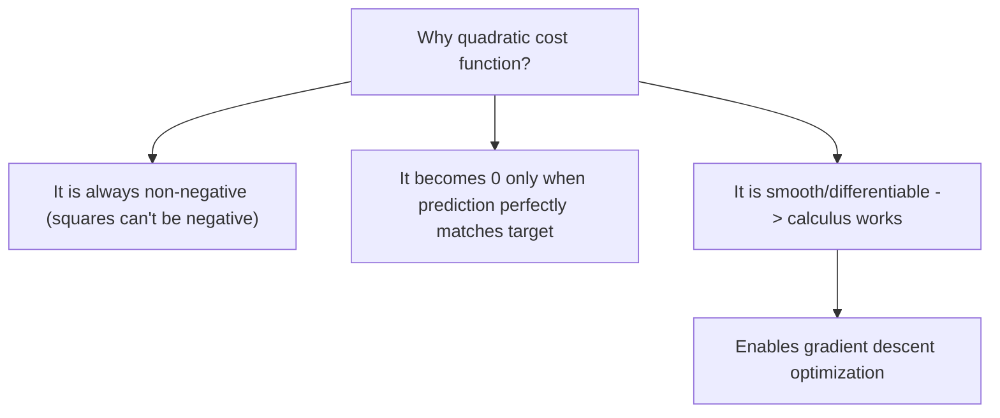

---

## 7. Gradient Descent - The Core Learning Algorithm


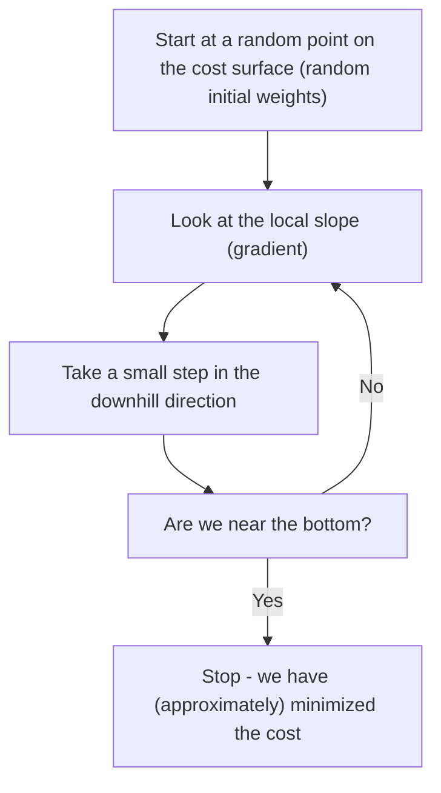

### 7.2 The Gradient - A Multi-Dimensional Derivative

Suppose our cost function depends on many parameters, `C = C(v1, v2, ..., vm)`. If we nudge all parameters slightly by amounts `delta_v = (delta_v1, ..., delta_vm)`, then the resulting small change in C can be approximated as:


$$\Delta C \approx \sum_j \frac{\partial C}{\partial v_j} \Delta v_j$$

We define the **gradient vector**, written $\nabla C$:

$$\nabla C = \left[ \frac{\partial C}{\partial v_1}, \frac{\partial C}{\partial v_2}, \dots, \frac{\partial C}{\partial v_m} \right]^T$$

This lets us rewrite the approximation neatly as a dot product:

$$\Delta C \approx \nabla C \cdot \Delta v$$


**Geometric meaning:** The gradient vector, at any given point, points in the direction of the steepest increase of C from that point. (Its negative therefore points toward steepest decrease.)

**Worked example -** 
$$C = \frac{1}{4}(v_1^2 + v_2^2)$$ At the point $(v_1, v_2) = (2, 1)$:
$$
\begin{aligned}
\frac{\partial C}{\partial v_1} &= \frac{v_1}{2} = 1 \\
\frac{\partial C}{\partial v_2} &= \frac{v_2}{2} = 0.5 \\
\nabla C &= \begin{bmatrix} 1 \\ 0.5 \end{bmatrix}
\end{aligned}
$$
This vector points "outward and slightly up" from the point (2,1) on the bowl-shaped surface - exactly the direction of fastest increase in height.

### 7.3 Choosing the Right Direction to Move

We know: `delta_C ~ grad(C) . delta_v`

We WANT `delta_C < 0` (we want the cost to decrease). Since `grad(C)` points toward the steepest *increase*, moving in the exact opposite direction should give the steepest *decrease*. So we choose:

```
delta_v = -eta * grad(C)
```

where `eta > 0` (Greek letter "eta") is called the **learning rate** - a small positive number controlling how big a step we take.

### 7.4 Proving This Choice Actually Decreases the Cost

Substituting our chosen `delta_v` back into the approximation:
```
delta_C ~ grad(C) . (-eta * grad(C))
        = -eta * ||grad(C)||^2
        = -eta * sum_j( (dC/dvj)^2 )
```

Since `eta > 0` and any squared quantity `||grad(C)||^2 >= 0`, we get:
```
delta_C <= 0   (approximately)
```

**This proves that moving opposite to the gradient (by a sufficiently small step) is guaranteed to decrease the cost** (or at worst leave it unchanged if we're already at a flat spot, like the minimum).

### 7.5 The Gradient Descent Update Rule

Putting it together, at each step:
```
v_new = v_old - eta * grad(C)
```

We repeat this over and over:
```
v -> v - eta*grad(C) -> v - eta*grad(C) -> ...
```//
Each repetition should move us a bit closer to a region of lower cost.


### 7.6 The Learning Rate Trade-off: Too Small vs Too Large

The math above relied on an approximation (`delta_C ~ grad(C).delta_v`) that is only accurate when `delta_v` is SMALL. This creates an important trade-off:

| Learning Rate eta | What Happens | Consequence |
|---|---|---|
| **Too small** | Each update barely moves the parameters | Training becomes extremely slow, requiring many updates to converge |
| **Too large** | delta_v is too big, and the linear approximation breaks down | The cost may actually increase, oscillate wildly, or diverge - learning becomes unstable |
| **Just right** | Balances speed and stability | Efficient, steady convergence toward the minimum |

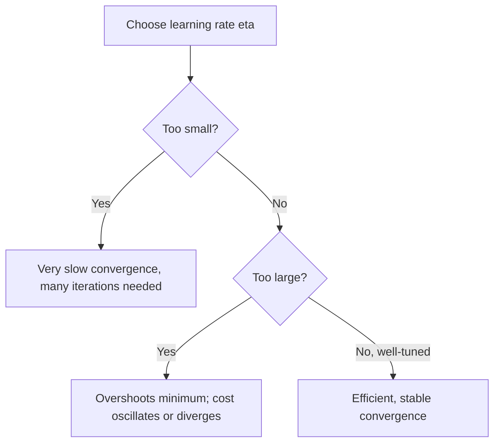

### 7.7 Applying Gradient Descent to an Actual Neural Network

In a neural network, the "parameters" v are simply ALL the weights and biases in the entire network. So the general update rule specializes to:

**For each weight wk:**
```
wk_new = wk_old - eta * (dC/dwk)
```

**For each bias bl:**
```
bl_new = bl_old - eta * (dC/dbl)
```

Each partial derivative tells us: "if I nudge this ONE specific parameter slightly, how much does the overall cost change?" We use this information for every weight and bias, simultaneously, to take one coordinated step downhill in this extremely high-dimensional landscape (a network can easily have thousands or millions of parameters!).

### 7.8 The Gradient of the Total Cost Is the Average of Individual Gradients

Recall that the overall cost is an average over all n training examples:
```
C = (1/n) * sum_x(Cx)
```

Since differentiation is linear, the gradient of a sum/average is the sum/average of the gradients:
```
grad(C) = (1/n) * sum_x( grad(Cx) )
```

**In words:** each individual training example "votes" on which direction each parameter should move, and we average all these votes together to decide the actual update direction.

---

## 8. Worked Example: Teaching a Single Sigmoid Neuron to Learn OR

This example walks through gradient descent by hand, step by step, on the simplest possible case: one sigmoid neuron learning the logical OR function.

### 8.1 The Setup

**Target function (OR truth table):**

| x1 | x2 | y(x) |
|----|----|------|
| 0 | 0 | 0 |
| 0 | 1 | 1 |
| 1 | 0 | 1 |
| 1 | 1 | 1 |

**Initial (untrained, essentially random) parameters:**
```
w1 = 0.5,  w2 = -0.3,  b = 0.1
```

**Neuron computation:**
```
z(x) = w1*x1 + w2*x2 + b
a(x) = sigma(z(x))
```

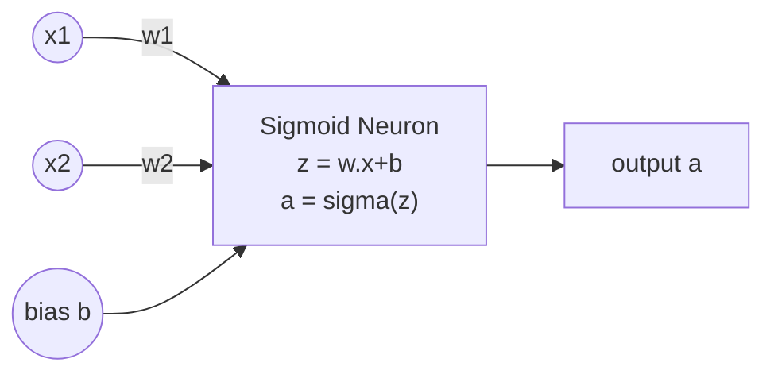

### 8.2 Step 1: Evaluate the Untrained Neuron on All Four Examples

| x1 | x2 | y(x) | z(x) | a(x) = sigma(z) |
|----|----|------|------|------|
| 0 | 0 | 0 | 0.10 | 0.5250 |
| 0 | 1 | 1 | -0.20 | 0.4502 |
| 1 | 0 | 1 | 0.60 | 0.6457 |
| 1 | 1 | 1 | 0.30 | 0.5744 |

We can already see problems: for `(0,0)` the target is 0 but a=0.525 (too high). For `(0,1)` the target is 1 but a=0.450 (too low, and even below the 0.5 threshold, meaning this neuron would currently misclassify this example).

### 8.3 Step 2: Compute the Cost for Each Example

Using `Cx = (1/2)*(y(x) - a(x))^2`:

| x1 | x2 | y(x) | a(x) | Cx |
|----|----|------|------|-----|
| 0 | 0 | 0 | 0.5250 | 0.13780 |
| 0 | 1 | 1 | 0.4502 | 0.15116 |
| 1 | 0 | 1 | 0.6457 | 0.06278 |
| 1 | 1 | 1 | 0.5744 | 0.09055 |

Average cost: `C ~ 0.11057`

Our task now: adjust `w1, w2, b` using gradient descent so that this average cost decreases.

### 8.4 Step 3: Derive the Gradient Formula (Using the Chain Rule)

To find how the cost changes with respect to `w1` (or any parameter), we must trace the "chain of influence":
```
w1  -->  z  -->  a  -->  Cx
```

A change in `w1` changes `z`, which changes `a` (through the sigmoid), which changes `Cx` (through the squared error). By the **chain rule** of calculus:
```
dCx/dw1 = (dCx/da) * (da/dz) * (dz/dw1)
```

**Computing each piece:**

1. `dCx/da = (a - y)`  
   *(derivative of (1/2)(y-a)^2 with respect to a)*

2. `da/dz = a*(1-a)`  
   *(this is a special, elegant property of the sigmoid function - its derivative can be written in terms of itself!)*

3. `dz/dwj = xj`  
   *(since z = w1*x1 + w2*x2 + b, the partial derivative with respect to wj is simply xj)*

**Multiplying these together:**
```
dCx/dwj = (a - y) * a*(1-a) * xj
```

**For the bias**, since `dz/db = 1`:
```
dCx/db = (a - y) * a*(1-a)
```

**Combined gradient vector for one example:**
```
grad(Cx) = (a - y) * a*(1-a) * [x1, x2, 1]
```

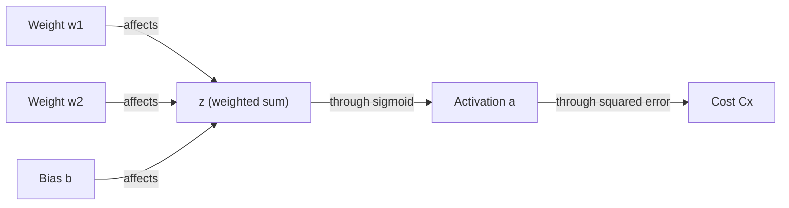

### 8.5 Step 4: Compute the Gradient for Each Training Example

**Example x=(0,1), y=1, a=0.4502:**
```
grad(Cx) = (0.4502 - 1) * 0.4502 * (1-0.4502) * [0, 1, 1]
         = (-0.5498) * 0.4502 * 0.5498 * [0, 1, 1]
         ~ (0, -0.13609, -0.13609)
```
Note: since x1=0, the gradient with respect to w1 is exactly zero for this example - w1 simply has NO influence on this particular training case's output. But since x2=1 and y=1 (we need MORE activation), and the coefficient is negative, gradient descent (which subtracts the gradient) will INCREASE w2. This matches our intuition: the neuron needs a stronger push toward "1" whenever x2=1, since that alone should be enough for OR to fire.

**Doing this for all four examples, we get:**

| x | y | a | grad(Cx) |
|---|---|---|----------|
| (0,0) | 0 | 0.5250 | (0, 0, 0.13092) |
| (0,1) | 1 | 0.4502 | (0, -0.13609, -0.13609) |
| (1,0) | 1 | 0.6457 | (-0.08107, 0, -0.08107) |
| (1,1) | 1 | 0.5744 | (-0.10403, -0.10403, -0.10403) |

Notice that different examples "disagree" somewhat on how to adjust parameters (for instance, the (0,0) example wants the bias to DEcrease relatively, based on sign conventions, while others want other adjustments) - this is normal. Gradient descent handles this by averaging all the "advice" together.

### 8.6 Step 5: Average the Gradients to Get the Full Gradient

```
grad(C) = (1/4) * [grad(C00) + grad(C01) + grad(C10) + grad(C11)]
        ~ (-0.04627, -0.06003, -0.04757)
```

### 8.7 Step 6: Apply One Gradient Descent Update

Using learning rate `eta = 1`:
```
w1_new = 0.5   - (1)(-0.04627)  ~ 0.54627
w2_new = -0.3  - (1)(-0.06003)  ~ -0.23997
b_new  = 0.1   - (1)(-0.04757)  ~ 0.14757
```

### 8.8 Step 7: Verify the Update Actually Helped

| Input | Target | Activation Before | Activation After |
|---|---|---|---|
| (0,0) | 0 | 0.5250 | 0.5368 |
| (0,1) | 1 | 0.4502 | 0.4769 |
| (1,0) | 1 | 0.6457 | 0.6668 |
| (1,1) | 1 | 0.5744 | 0.6116 |

- Cost before: `C ~ 0.11057`
- Cost after one update: `C ~ 0.10296`

**The cost decreased!** All activations moved in the correct direction (toward their targets).

### 8.9 Repeating the Process: Watching the Neuron Learn Over Time

If we repeat this compute-gradient-then-update cycle many times:

| Step | w1 | w2 | b | Cost | Correct out of 4 |
|---|---|---|---|---|---|
| 0 | 0.500 | -0.300 | 0.100 | 0.1106 | 2/4 |
| 1 | 0.546 | -0.240 | 0.148 | 0.1030 | 2/4 |
| 5 | 0.690 | -0.040 | 0.277 | 0.0843 | 3/4 |
| 20 | 0.975 | 0.408 | 0.352 | 0.0641 | 3/4 |
| 100 | 1.753 | 1.558 | -0.340 | 0.0332 | 4/4 |

The cost steadily decreases, and eventually the neuron correctly classifies all four OR examples. This is gradient descent "learning" in action, on the smallest possible example.

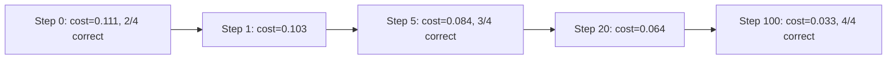

---

## 9. Scaling Up: Why We Need Stochastic Gradient Descent (SGD)

### 9.1 The Problem With "Full-Batch" Gradient Descent on Large Datasets

For our tiny OR example, computing the full gradient required looking at all 4 training examples - trivially cheap.

But recall the formula:
```
grad(C) = (1/n) * sum_over_x( grad(Cx) )
```

MNIST has **n = 60,000 training images**. If we use plain (full-batch) gradient descent, then EVERY SINGLE parameter update requires computing the gradient across all 60,000 images first. This is extremely computationally expensive, especially since we need to repeat this process potentially thousands of times to converge.

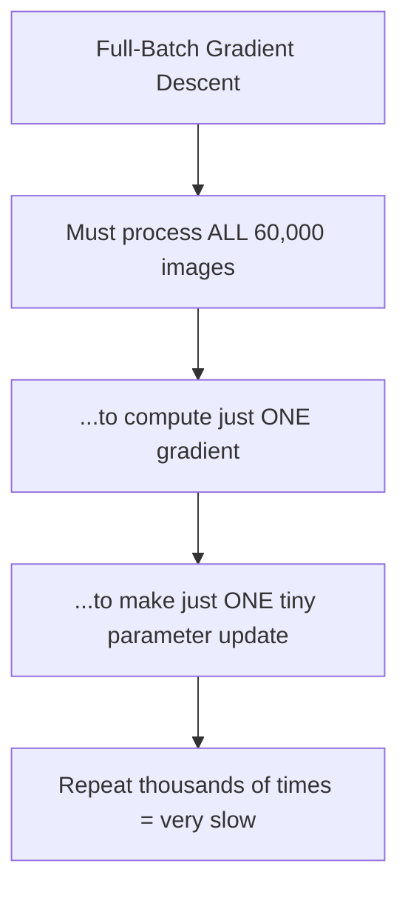

### 9.2 The Solution: Stochastic Gradient Descent (SGD) With Mini-Batches

**Core idea:** Instead of using the entire training set to compute an exact gradient, randomly sample a small subset (called a **mini-batch**) of size `m` and use it to compute an **approximate** gradient.

```
grad(C)  ~  (1/m) * sum_{j=1 to m}( grad(C_Xj) )
```

This is much cheaper to compute (only m examples instead of n), and while each individual estimate is noisier/less accurate, on average it points in roughly the right direction, and we can afford to take MANY more (cheaper) steps in the same amount of time.

### 9.3 The SGD Training Loop: Epochs and Mini-Batches

The full training procedure works like this:

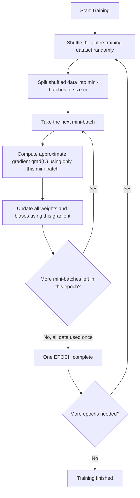

**Key vocabulary:**
- **Mini-batch:** a small, randomly chosen subset of the training data (e.g., 10, 32, or 100 examples at a time)
- **Epoch:** one complete pass through the ENTIRE training dataset (i.e., after processing every mini-batch once, we've completed one epoch)
- Training typically runs for **many epochs** (repeating the shuffle-and-batch process over and over), since one pass usually isn't enough to fully learn the patterns.

### 9.4 The Mini-Batch Update Formula

For a specific weight connecting neuron k to neuron j at layer l:
```
w_jk_new = w_jk_old - (eta/m) * sum_{i=1 to m}( dC_i/dw_jk )
```

For a bias:
```
b_j_new = b_j_old - (eta/m) * sum_{i=1 to m}( dC_i/db_j )
```

In words: for the current mini-batch of size m, compute the partial derivative of the cost with respect to each parameter for EACH of the m examples, average these m values, and use that average to perform one gradient descent update.

### 9.5 Full-Batch GD vs Mini-Batch SGD - Comparison

```mermaid
flowchart TB
    subgraph "Full-Batch Gradient Descent"
    A1["One EXPENSIVE, ACCURATE gradient computation"] --> A2["One parameter update"]
    end
    subgraph "Mini-Batch Stochastic Gradient Descent"
    B1["Many CHEAP, APPROXIMATE gradient computations"] --> B2["Many parameter updates"]
    end
```

| Aspect | Full-Batch GD | Mini-Batch SGD |
|---|---|---|
| Data used per update | All n examples | Small subset of m examples |
| Cost per update | Expensive | Cheap |
| Accuracy of each gradient estimate | Exact | Approximate (noisy) |
| Path toward minimum | Smooth | "Noisy" / zig-zaggy, but generally trending downhill |
| Practical speed on large datasets | Slow | Usually much faster overall |

In practice, especially for large datasets like MNIST, mini-batch SGD converges to a good solution much faster in wall-clock time, even though each individual step is less precise, because we get to take vastly more steps for the same computational budget.

---

## 10. Applying This to the MNIST Network - Practical Details

### 10.1 Network Architecture Recap

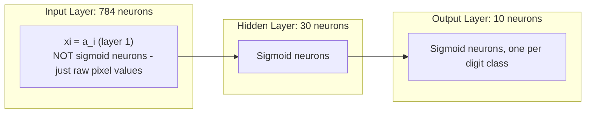

- Network layer sizes: `[784, 30, 10]`
- **Important detail:** the input layer does NOT contain actual sigmoid neurons - it simply holds the raw pixel intensities directly as `x_i`, which by convention is also written `a_i^(1)` (the "activation" of layer 1, even though no sigmoid computation actually happens there).

### 10.2 Counting the Parameters

For a fully-connected network with layer sizes [784, 30, 10]:

**Weights connecting input layer to hidden layer:**
Every one of the 30 hidden neurons connects to every one of the 784 input neurons:
```
30 * 784 = 23,520 weights
```

**Biases for hidden layer:** one bias per hidden neuron:
```
30 biases
```

**Weights connecting hidden layer to output layer:**
Every one of the 10 output neurons connects to every one of the 30 hidden neurons:
```
10 * 30 = 300 weights
```

**Biases for output layer:**
```
10 biases
```

**Grand total:**
```
(30 x 785) + (10 x 31) = 23,550 + 310 = 23,860 total parameters
```

(Here "785" = 784 weights + 1 bias per hidden neuron, and "31" = 30 weights + 1 bias per output neuron - this is a compact way of counting weights+biases together.)

This means gradient descent must simultaneously tune **23,860 numbers** to make this network classify digits accurately - and this is considered a genuinely SMALL, simple network by modern standards!

### 10.3 The Feedforward Computation

Once trained, using the network to make a prediction (this is called "feedforward" or "inference") just means repeatedly applying:
```
a' = sigma(w . a + b)
```
layer by layer, where `a` is the activation vector from the previous layer, `w` and `b` are that layer's weights and biases, and `a'` is the resulting activation vector for the current layer. We start with `a = x` (the input pixels) and keep applying this formula until we reach the output layer.

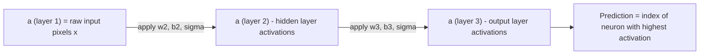

### 10.4 A Python Utility Used in Implementation: `zip()`

The lecture material includes a demonstration of Python's `zip()` function, since it's commonly used when implementing neural networks (e.g., pairing up weight matrices with bias vectors layer-by-layer, or pairing training inputs with labels).

**Basic zip - pairs elements at the same index from two lists:**
```python
L1, L2 = ['a', 'b', 'c'], [1, 2, 3]
for x, y in zip(L1, L2):
    print(x, y)
# Output:
# a 1
# b 2
# c 3
```

**Zip with slicing - useful for pairing consecutive layers together:**
```python
L1, L2 = ['a', 'b', 'c'], [1, 2, 3]
for x, y in zip(L1[:-1], L2[1:]):
    print(x, y)
# L1[:-1] = ['a', 'b']   (all except last)
# L2[1:]  = [2, 3]       (all except first)
# Output:
# a 2
# b 3
```

This slicing pattern `zip(list[:-1], list[1:])` is a very common trick in neural network code to iterate over **consecutive pairs of layers** (e.g., pairing layer sizes [784, 30, 10] to get the pairs (784,30) and (30,10), which tells you the shape of each weight matrix needed between layers).

**Combined with list comprehension:**
```python
L1, L2 = [10, 20, 30], [1, 2, 3]
L3 = [x + y for x, y in zip(L1[:-1], L2[1:])]
for i in L3:
    print(i)
# L1[:-1] = [10, 20]
# L2[1:]  = [2, 3]
# Sums: 10+2=12, 20+3=23
# Output:
# 12
# 23
```

### 10.5 Implementation Checklist (What a Full Implementation Needs)

Based on the course material's outline, implementing this network from scratch requires:

```mermaid
flowchart TD
    A[Network initialization code] --> B["Random initial weights & biases"]
    B --> C["Feedforward function: a' = sigma(w.a + b)"]
    C --> D["Vectorized sigma function - apply to entire arrays/vectors at once, not one number at a time"]
    D --> E["SGD outer loop: shuffle data, create mini-batches, loop over epochs"]
    E --> F["update_mini_batch function: compute gradients for one mini-batch and apply the update"]
    F --> G["Full SGD.py training script tying it all together"]
    G --> H["Demo / Evaluation on held-out test data"]
```

---

## 11. Backpropagation - How a Network Actually Computes Its Gradients

Sections 6-9 established *why* we need gradient descent and showed the gradient formula for a single sigmoid neuron. But real networks have many layers, each with many weights and biases. **Backpropagation** is the algorithm that efficiently computes the gradient `dC/dw` and `dC/db` for every single weight and bias in a multi-layer network, no matter how deep. It is not a different learning rule from gradient descent - it is simply the fast, practical *method* for computing the gradient that gradient descent then uses to update parameters.

### 11.1 Why Do We Need a Special Algorithm for This?

Think back to the mini-batch gradient formula from Section 9.4:

```
grad(C) ~ (1/m) * sum_{i=1}^{m}(grad(C_i))
```

To use this, we need `grad(C_i)` - the gradient of the cost with respect to **every weight and bias**, for **each training example**. A modest network (784-30-10, as in Section 10.2) already has 23,860 parameters. Computing each partial derivative one at a time, from scratch, using the naive approximation

```
dC/dwj ~ (C(w + eps*ej) - C(w)) / eps
```

would require re-running the entire network once per parameter (23,860 full forward passes, PER training example!). This is hopelessly slow.

**Backpropagation solves this by being clever about re-using computation.** In one forward pass plus one backward pass, it computes the gradient with respect to ALL parameters simultaneously. This is what makes training large networks computationally feasible - it's the single most important algorithm in this course.

```mermaid
flowchart LR
    A["Naive approach: recompute cost from scratch for every single weight"] -->|"very slow - one pass per parameter"| B["Impractical for 1000s of parameters"]
    C["Backpropagation: one forward pass + one backward pass"] -->|"reuses intermediate results"| D["Computes ALL gradients at once - fast"]
```

### 11.2 Notation: Naming Every Weight, Bias, and Activation Precisely

Before we can write down the backpropagation equations, we need unambiguous notation to refer to any specific weight, bias, or activation anywhere in the network.

**Weight notation: `w^l_jk`**

This denotes the weight connecting the **k-th neuron in layer (l-1)** to the **j-th neuron in layer l**.

```mermaid
flowchart LR
    subgraph "Layer l-1"
    k(("neuron k"))
    end
    subgraph "Layer l"
    j(("neuron j"))
    end
    k -->|"w^l_jk"| j
```

Notice the index order looks "backwards" at first glance - the *second* index (k) refers to the layer *before* (l-1), and the *first* index (j) refers to the *current* layer l. This seemingly odd ordering is deliberate: it is chosen specifically so that later formulas (matrix multiplication of weights by the previous layer's activations) come out clean and don't need extra transposing.

**Bias and activation notation: `b^l_j` and `a^l_j`**

- `b^l_j` is the bias of the j-th neuron in layer l.
- `a^l_j` is the activation (output) of the j-th neuron in layer l.

```mermaid
flowchart LR
    subgraph "Layer l"
    N["neuron j has bias b^l_j
    and produces activation a^l_j"]
    end
```

**Putting it together: the weighted input `z^l_j`**

The weighted input to neuron j in layer l (i.e., the value fed into the activation function, before sigma is applied) is:

```
z^l_j = sum_k( w^l_jk * a^(l-1)_k ) + b^l_j
```

In words: take every neuron k in the *previous* layer, multiply its activation by the weight connecting it to neuron j, sum all of those up, and add neuron j's own bias.

**Vector form (all neurons in a layer at once):**

```
z^l = w^l * a^(l-1) + b^l
a^l = sigma(z^l)
```

Here `w^l` is the entire weight *matrix* for layer l (rows = neurons in layer l, columns = neurons in layer l-1), `a^(l-1)` is the *vector* of all activations from the previous layer, and `b^l` is the *vector* of biases for layer l. This vectorized form is exactly what lets us compute an entire layer's activations in a single matrix multiplication, instead of looping over each neuron individually - this is why the "backwards-looking" weight index convention from before matters (it makes this matrix multiplication line up correctly).

### 11.3 The Cost Function and the Hadamard Product

**Output layer and cost:** If the network has L layers total, the output layer is layer L, and its activation vector is `a^L`. The cost for a single training example x is a function of this final output:

```
Cx = C(a^L)
```

For the quadratic cost specifically:

```
Cx = (1/2) * ||y - a^L||^2 = (1/2) * sum_j( (y_j - a^L_j)^2 )
```

This is exactly the same cost function from Section 6.3, just written using the `a^L` layer notation.

**The Hadamard product (element-wise multiplication):** Backpropagation's equations are written compactly using an operation called the **Hadamard product**, denoted `⊙`. Unlike normal matrix multiplication, this simply multiplies two vectors (or matrices) of the same shape **element by element**:

```
[1]   [3]   [1*3]   [3]
[2] ⊙ [4] = [2*4] = [8]
```

This is different from a dot product (which would give a single number) - the Hadamard product gives back a vector of the same size, where each entry is the product of the corresponding entries in the two inputs. We need this because in the backprop formulas, we want to combine two same-shaped vectors "position by position" (e.g., each neuron's own error combined with each neuron's own derivative), not sum them into a single number.

### 11.4 Defining the "Error" of a Neuron: `delta^l_j`

This is the central new idea that makes backpropagation work. Instead of directly computing `dC/dw` and `dC/db` for every parameter (which is awkward), we first introduce an intermediate quantity called the **error** of neuron j in layer l:

```
delta^l_j = dCx / dz^l_j
```

In words: **the error of a neuron measures how sensitive the overall cost is to that neuron's weighted input `z`.** It answers the question: "if I could nudge this neuron's internal weighted-sum value by a tiny amount, how much would the final cost change?"

```mermaid
flowchart LR
    A["Imagine a tiny gremlin sitting inside neuron j, layer l"] --> B["The gremlin secretly adds a small nudge, delta_z, to z^l_j"]
    B --> C["This nudge changes the cost by approximately: delta_C ~ (dCx/dz^l_j) * delta_z"]
    C --> D["We call the sensitivity dCx/dz^l_j the 'error' delta^l_j"]
```

**Why is this useful?** Once we know `delta^l_j` for a neuron, it turns out (as shown below) that the derivatives with respect to its incoming weight and bias become almost trivial one-line formulas. So the whole problem of finding `dC/dw` and `dC/db` for every parameter reduces to: "first find all the `delta^l_j` values, then everything else follows easily."

For an entire layer, collect the individual neuron errors into a vector `delta^l` (one error value per neuron in that layer).

### 11.5 The Four Fundamental Equations of Backpropagation

Backpropagation is built from exactly four equations, traditionally labeled BP1 through BP4. They accomplish **two jobs**:

```mermaid
flowchart TD
    subgraph "Job 1: Compute the error vectors"
    BP1["BP1: delta^L = grad_(a^L)(Cx) ⊙ sigma'(z^L)
    (error at the OUTPUT layer)"]
    BP2["BP2: delta^l = ((w^(l+1))^T * delta^(l+1)) ⊙ sigma'(z^l)
    (error at any HIDDEN layer, using the NEXT layer's error)"]
    end
    subgraph "Job 2: Compute the parameter derivatives"
    BP3["BP3: dCx/db^l_j = delta^l_j"]
    BP4["BP4: dCx/dw^l_jk = a^(l-1)_k * delta^l_j"]
    end
    BP1 --> BP3
    BP1 --> BP2
    BP2 --> BP3
    BP2 --> BP4
    BP3 --> BP4
```

Let's derive and understand each one individually.

### 11.6 BP1: The Error at the Output Layer

**Goal:** compute `delta^L_j` for the very last layer, since this is where we can start (the cost is a direct function of the output activations).

**Derivation using the chain rule:** The cost depends on `z^L_j` only through `a^L_j` (since `a^L_j = sigma(z^L_j)`), so the dependency chain is:

```
z^L_j  --->  a^L_j  --->  Cx
```

By the chain rule:

```
delta^L_j = dCx/dz^L_j = (dCx/da^L_j) * (da^L_j/dz^L_j)
```

Since `a^L_j = sigma(z^L_j)`, we know `da^L_j/dz^L_j = sigma'(z^L_j)`. Substituting:

```
delta^L_j = (dCx/da^L_j) * sigma'(z^L_j)          ... (BP1, single neuron)
```

**Vector form:** Collecting `dCx/da^L_j` for every output neuron j into a single vector called the gradient of C with respect to `a^L`, written `grad_(a^L)(Cx)`, and combining it with the vector `sigma'(z^L)` using the Hadamard product:

```
delta^L = grad_(a^L)(Cx) ⊙ sigma'(z^L)          ... (BP1, vector form)
```

**Specializing to the quadratic cost:** Recall `Cx = (1/2) * sum_j(y_j - a^L_j)^2`. Differentiating with respect to `a^L_j`:

```
dCx/da^L_j = a^L_j - y_j
```

Substituting into BP1:

```
delta^L = (a^L - y) ⊙ sigma'(z^L)
```

**This is a hugely important practical result:** for the quadratic cost, the output-layer error is simply "(what the network predicted) minus (what it should have predicted)," scaled element-wise by the sigmoid derivative. We can compute this directly from the network's own output and the known correct answer - no extra layers of chain rule needed at this step.

### 11.7 BP2: Propagating the Error Backward Through Hidden Layers

**The problem:** BP1 only gives us the error at the very last layer, L. But we need `dC/dw` and `dC/db` for weights and biases in EVERY layer, including hidden ones. So we need a way to compute `delta^l` for a hidden layer l, given that we already know `delta^(l+1)` (the error one layer further along, toward the output).

**Setting up the chain rule for a hidden neuron:** Consider neuron k in hidden layer l. Its activation `a^l_k` doesn't affect the cost directly - it affects the cost *indirectly*, by influencing every neuron j in the *next* layer (l+1), since:

```
z^(l+1)_j = sum_k( w^(l+1)_jk * a^l_k ) + b^(l+1)_j
```

Because `a^l_k` feeds into many different neurons j in the next layer, we must **sum over all of them** when applying the chain rule (this is the multivariable chain rule - contributions from every path must be added):

```
dCx/da^l_k = sum_j( (dCx/dz^(l+1)_j) * (dz^(l+1)_j/da^l_k) )
```

```mermaid
flowchart LR
    k(("neuron k, layer l")) -->|"w^(l+1)_1k"| j1(("neuron 1, layer l+1"))
    k -->|"w^(l+1)_2k"| j2(("neuron 2, layer l+1"))
    k -->|"w^(l+1)_3k"| j3(("neuron 3, layer l+1"))
    j1 -.-> C[Cost]
    j2 -.-> C
    j3 -.-> C
```

**Evaluating the two derivatives inside the sum:**
- By definition, `dCx/dz^(l+1)_j = delta^(l+1)_j` (that's literally how we defined "error").
- From the formula for `z^(l+1)_j` above, `dz^(l+1)_j/da^l_k = w^(l+1)_jk` (since everything else in that sum is treated as constant when differentiating with respect to `a^l_k`).

Substituting both in:

```
dCx/da^l_k = sum_j( w^(l+1)_jk * delta^(l+1)_j )
```

**Converting this into an error `delta^l_k`:** Recall that `delta^l_k = (dCx/da^l_k) * sigma'(z^l_k)` (same chain-rule logic as BP1, just one layer earlier). Substituting the sum we just derived:

```
delta^l_k = ( sum_j( w^(l+1)_jk * delta^(l+1)_j ) ) * sigma'(z^l_k)          ... (BP2, single neuron)
```

**Vector form:** The sum `sum_j( w^(l+1)_jk * delta^(l+1)_j )` is exactly the k-th component of the matrix-vector product `(w^(l+1))^T * delta^(l+1)` (the transpose of the weight matrix, times the next layer's error vector). So in full vector form:

```
delta^l = ( (w^(l+1))^T * delta^(l+1) ) ⊙ sigma'(z^l)          ... (BP2, vector form)
```

**Intuition - why is this called "back"-propagation?** BP2 lets us compute the error of layer l using the error of layer l+1 (the layer *after* it). This means once we have `delta^L` (from BP1), we can get `delta^(L-1)` using BP2, then `delta^(L-2)` from `delta^(L-1)`, and so on, walking backward through the network one layer at a time, all the way to the first hidden layer. This backward flow of error information, layer by layer, is exactly why the algorithm is called **backpropagation**.

```mermaid
flowchart RL
    subgraph "Output Layer L"
    dL["delta^L (from BP1)"]
    end
    subgraph "Hidden Layer L-1"
    dL1["delta^(L-1) (from BP2, using delta^L)"]
    end
    subgraph "Hidden Layer L-2"
    dL2["delta^(L-2) (from BP2, using delta^(L-1))"]
    end
    dL -->|"BP2"| dL1
    dL1 -->|"BP2"| dL2
```

### 11.8 BP3 and BP4: From Error to the Actual Gradients

We now have a way to find `delta^l_j` for every neuron in every layer (BP1 to start, BP2 to work backward). The whole point of computing all these errors was to make finding the ACTUAL derivatives we need - with respect to weights and biases - simple.

**BP3 - derivative with respect to a bias:**

The dependency chain is `b^l_j ---> z^l_j ---> Cx`. By the chain rule:

```
dCx/db^l_j = (dCx/dz^l_j) * (dz^l_j/db^l_j)
```

Since `z^l_j = sum_k(w^l_jk * a^(l-1)_k) + b^l_j`, we have `dz^l_j/db^l_j = 1` (the bias contributes directly and additively, with coefficient 1). So:

```
dCx/db^l_j = delta^l_j          ... (BP3)
```

**In plain words: the derivative of the cost with respect to any bias is simply that neuron's error.** No extra computation needed once you have `delta`.

**BP4 - derivative with respect to a weight:**

The dependency chain is `w^l_jk ---> z^l_j ---> Cx`. By the chain rule:

```
dCx/dw^l_jk = (dCx/dz^l_j) * (dz^l_j/dw^l_jk)
```

Since `z^l_j = sum_k(w^l_jk * a^(l-1)_k) + b^l_j`, differentiating with respect to `w^l_jk` picks out just the one term containing it, giving `dz^l_j/dw^l_jk = a^(l-1)_k`. So:

```
dCx/dw^l_jk = a^(l-1)_k * delta^l_j          ... (BP4)
```

**In plain words: the derivative of the cost with respect to a weight is (the activation flowing INTO that connection) times (the error flowing OUT of that connection).**

**Vectorized forms** (useful for implementation, avoiding explicit loops over j and k):

```
grad_(b^l)(Cx) = delta^l
grad_(w^l)(Cx) = delta^l * (a^(l-1))^T
```

### 11.9 Worked Numeric Example: Backpropagation on a Tiny 2-2-2 Network

To make all four equations completely concrete, let's manually backpropagate through a tiny network: 2 input neurons, 2 hidden neurons, 2 output neurons, all using sigmoid activation.

**Setup:**

```
x = (1, 0)^T           (input)
y = (1, 0)^T           (desired output)

w^2 = [ 1     0.6 ]     b^2 = (0, 0)^T
      [-1    -0.4 ]

w^3 = [ 1   -1 ]        b^3 = (0, 0)^T
      [-1    1 ]

a^1 = x = (1, 0)^T      (input layer activation is just the raw input)
```

```mermaid
flowchart LR
    subgraph "Layer 1 (input)"
    a1((1)) 
    a2((0))
    end
    subgraph "Layer 2 (hidden)"
    h1((a^2_1))
    h2((a^2_2))
    end
    subgraph "Layer 3 (output)"
    o1((a^3_1))
    o2((a^3_2))
    end
    a1 --> h1
    a1 --> h2
    a2 --> h1
    a2 --> h2
    h1 --> o1
    h1 --> o2
    h2 --> o1
    h2 --> o2
```

**Step 1 - Forward pass (compute and store every z and a):**

Hidden layer:
```
z^2 = w^2 * a^1 + b^2 = (1*1 + 0.6*0, -1*1 + (-0.4)*0) = (1, -1)
a^2 = sigma(z^2) ~ (0.7311, 0.2689)
```

Output layer:
```
z^3 = w^3 * a^2 + b^3 ~ (1*0.7311 - 1*0.2689, -1*0.7311 + 1*0.2689) ~ (0.4621, -0.4621)
a^3 = sigma(z^3) ~ (0.6135, 0.3865)
```

Cost for this example:
```
Cx = (1/2) * ||y - a^3||^2 ~ 0.1494
```

We now have everything stored (`z^2, a^2, z^3, a^3`) that backpropagation needs.

**Step 2 - BP1: error at the output layer.**

```
grad_(a^3)(Cx) = a^3 - y ~ (0.6135 - 1, 0.3865 - 0) = (-0.3865, 0.3865)
sigma'(z^3) = a^3 ⊙ (1 - a^3) ~ (0.6135*0.3865, 0.3865*0.6135) ~ (0.2371, 0.2371)

delta^3 = (a^3 - y) ⊙ sigma'(z^3) ~ (-0.3865*0.2371, 0.3865*0.2371) ~ (-0.09164, 0.09164)
```

**Step 3 - BP3 and BP4 at the output layer (immediate, now that we have delta^3):**

```
dCx/db^3   = delta^3 ~ (-0.09164, 0.09164)
dCx/dw^3   = delta^3 * (a^2)^T ~ [ -0.06699  -0.02465 ]
                                  [  0.06699   0.02465 ]
```

(For instance, the entry `dCx/dw^3_12 = a^2_2 * delta^3_1 ~ 0.2689 * (-0.09164) ~ -0.02465`.)

**Step 4 - BP2: propagate the error backward to the hidden layer.**

First compute `(w^3)^T * delta^3`:
```
(w^3)^T * delta^3 = [ 1  -1 ] * (-0.09164, 0.09164)^T ~ (-0.18328, 0.18328)
                    [-1   1 ]
```

Then apply the Hadamard product with `sigma'(z^2) = a^2 ⊙ (1-a^2) ~ (0.19661, 0.19661)`:

```
delta^2 = (-0.18328, 0.18328) ⊙ (0.19661, 0.19661) ~ (-0.03604, 0.03604)
```

**Step 5 - BP3 and BP4 at the hidden layer.**

```
dCx/db^2 = delta^2 ~ (-0.03604, 0.03604)
dCx/dw^2 = delta^2 * (a^1)^T = (-0.03604, 0.03604) * (1, 0) = [ -0.03604   0 ]
                                                                [  0.03604   0 ]
```

(Notice the second column is all zeros - this is because `a^1_2 = x_2 = 0`, and BP4 multiplies by the incoming activation. If an input is 0, none of the weights leading FROM that input can affect the cost for this particular example, so their gradient contribution is 0 here.)

**Result:** We have now computed the gradient of the cost with respect to **every single weight and bias in the network**, using just one forward pass and one backward pass. This is the complete backpropagation computation for one training example.

### 11.10 The Backpropagation Algorithm, Step by Step

Putting it all together, here is the full algorithm for one training example x:

```mermaid
flowchart TD
    A["STEP 1: Forward Pass
    Set a^1 = x.
    For l = 2 to L: compute z^l = w^l a^(l-1) + b^l, then a^l = sigma(z^l).
    STORE every z^l and a^l - you will need them going backward."] --> B["STEP 2: Compute Output Error (BP1)
    delta^L = grad_(a^L)(Cx) ⊙ sigma'(z^L)"]
    B --> C["STEP 3: Backpropagate the Error (BP2)
    For l = L-1 down to 2:
    delta^l = ((w^(l+1))^T delta^(l+1)) ⊙ sigma'(z^l)"]
    C --> D["STEP 4: Read Off the Gradients (BP3, BP4)
    For every layer l:
    dCx/db^l_j = delta^l_j
    dCx/dw^l_jk = a^(l-1)_k * delta^l_j"]
```

Two clean phases: a **forward pass** (compute and remember activations, moving left to right through the network) and a **backward pass** (compute error vectors, moving right to left). Once both passes are done, every derivative we need is available via simple formulas (BP3, BP4) - no further chain-rule work required.

**Connecting back to the mini-batch formula from Section 9.4:** Backpropagation as described here computes `grad(Cx)` for ONE training example x. To get the gradient for a full mini-batch (needed for one SGD update), we simply run this entire forward+backward procedure once per example in the mini-batch, then average all the resulting gradients together, exactly as described in Section 9.4.

### 11.11 What Do the Backpropagation Equations Tell Us About *Why* Learning Can Be Slow?

Looking at BP4, `dCx/dw^l_jk = a^(l-1)_k * delta^l_j`, we can read off two situations where a weight's gradient will be nearly zero - meaning gradient descent will barely update it, i.e., **learning will be slow for that weight**:

```mermaid
flowchart TD
    A["A weight w^l_jk learns SLOWLY if EITHER:"] --> B["The input neuron has LOW activation
    (a^(l-1)_k is close to 0)
    -> the product a^(l-1)_k * delta^l_j is small regardless of delta"]
    A --> C["The output neuron has SATURATED
    (a^l_j is close to 0 or close to 1)
    -> sigma'(z^l_j) is nearly 0 in the 'diminishing gradient zone'
    -> delta^l_j itself becomes tiny, since delta depends on sigma'(z)"]
```

Recall from Section 4.3 that the sigmoid's derivative is largest near z=0 and shrinks toward 0 as z becomes very positive or very negative (the "diminishing gradient zone" versus the "active gradient zone"). Because `delta^l_j` always carries a factor of `sigma'(z^l_j)` (see BP1 and BP2), any neuron whose weighted input pushes it into the flat, saturated parts of the sigmoid curve will have a very small error signal, and therefore contribute very small gradients to every weight and bias feeding into it. This is an early hint of the famous **vanishing gradient problem** that becomes especially serious in very deep networks, explored further in later chapters.

Similarly, from BP3, a bias `b^l_j` learns slowly whenever its neuron has saturated, for the same reason (`delta^l_j` is tiny).

This is also why sensible weight initialization matters: if weights and biases are initialized so that many neurons' weighted inputs `z^l_j` start out very large in magnitude, those neurons begin training already saturated and learn very slowly right from the start. This is part of the motivation for initializing weights and biases by sampling from a standard normal distribution N(0,1) - it tends to keep the initial `z` values in a moderate range, closer to the "active gradient zone."

### 11.12 Why Nonlinear Activation Functions Are Essential

A natural question: what if we used a plain linear activation, `a^l = z^l` (i.e., no sigmoid, no squashing at all), instead of the sigmoid? Does the hidden layer still add anything useful?

**Working through the algebra for a network with one hidden layer:**

```
Hidden layer:  a^2 = w^2 * x + b^2                  (instead of a^2 = sigma(w^2 x + b^2))
Output layer:  a^3 = w^3 * a^2 + b^3                (instead of a^3 = sigma(w^3 a^2 + b^3))
```

Substituting the hidden layer's formula into the output layer's formula:

```
a^3 = w^3 * (w^2 * x + b^2) + b^3
    = (w^3 * w^2) * x + (w^3 * b^2 + b^3)
```

**Define** `w' = w^3 * w^2` and `b' = w^3 * b^2 + b^3`. Then:

```
a^3 = w' * x + b'
```

**This is EXACTLY the computation of a network with NO hidden layer at all** - just a single linear transformation directly from input to output! Stacking multiple *linear* layers collapses mathematically into a single linear layer, no matter how many layers you stack or how wide they are.

```mermaid
flowchart LR
    A["Network with linear hidden layer(s)"] -->|"algebraically equivalent to"| B["A single layer with no hidden layer at all"]
    C["Network with NONLINEAR hidden layer(s), e.g. sigmoid"] -->|"CANNOT be collapsed"| D["Genuinely more expressive - can represent curved/complex decision boundaries, like XOR (Section 1.5)"]
```

**This is precisely why nonlinear activation functions (like the sigmoid) are essential.** They prevent the layers from collapsing into a single affine (linear) transformation, which is what actually gives deep networks their extra representational power - the ability to learn complex, non-linearly-separable patterns like XOR (recall Section 1.5), rather than being stuck as a glorified single-layer linear classifier no matter how many layers are added.

### 11.13 Special Case: Backpropagation for Plain Linear Regression

To sanity-check the four equations in the simplest possible setting, consider a network for linear regression: just a single output neuron, no hidden layer, and the **identity activation function** (`a = z`, no sigmoid at all):

```
x = (x1, x2, ..., xn)^T   --->   one output neuron
a = z = w^T x + b
Cx = (1/2) * (y - a)^2
```

**BP1 simplifies:** Since `a = z`, we get `da/dz = 1`. So:

```
delta = dCx/da = a - y
```

(No sigmoid derivative factor appears at all, since the identity function's derivative is always 1.)

**There is no BP2** for this network, because there are no hidden layers to propagate the error back into.

**BP3 gives the bias derivative directly:**

```
dCx/db = delta = a - y
```

**BP4 gives each weight's derivative:**

```
dCx/dw_k = x_k * delta = x_k * (a - y)
```

This matches exactly what you would get by directly differentiating the cost function `Cx = (1/2)(y-a)^2` with respect to `w_k` and `b` using ordinary calculus (try it - substitute `a = w^T x + b` and differentiate directly). This confirms that backpropagation's four equations are not some mysterious new machinery - they are simply a systematic, efficient way of applying the ordinary chain rule, organized so that the computation can be reused efficiently across many layers.

### 11.14 Backpropagation Summary Table

| Equation | Name | What It Computes | Formula |
|---|---|---|---|
| BP1 | Output error | Error at the final layer L | `delta^L = grad_(a^L)(Cx) ⊙ sigma'(z^L)` |
| BP2 | Backpropagated error | Error at any hidden layer l, from the next layer's error | `delta^l = ((w^(l+1))^T delta^(l+1)) ⊙ sigma'(z^l)` |
| BP3 | Bias gradient | Derivative of cost w.r.t. any bias | `dCx/db^l_j = delta^l_j` |
| BP4 | Weight gradient | Derivative of cost w.r.t. any weight | `dCx/dw^l_jk = a^(l-1)_k * delta^l_j` |

**The two-phase algorithm:**

```mermaid
flowchart LR
    A["Forward Pass
    (left to right)
    compute & store all z, a"] --> B["Backward Pass
    (right to left)
    compute all delta via BP1, then BP2"] --> C["Read off gradients
    via BP3, BP4
    for every weight & bias"]
```

## 12. Fixing Slow Learning: The Cross-Entropy Cost Function

### 12.1 The Problem We're Trying to Fix

Recall from Section 11 that the quadratic cost function is:

```
Cx = (1/2) * (y - a)^2
```

And recall BP1, the equation for the output error:

```
delta^L = (a^L - y) (.) sigma'(z^L)
```

Here is the issue in plain language. Suppose the network's output `a` is very wrong. For example, the correct answer is `y = 1`, but the neuron currently outputs `a = 0.01` (very confidently wrong). You would expect the neuron to learn FAST in this situation, since it is making a big mistake.

But look at the formula again: `delta = (a - y) * sigma'(z)`. The term `sigma'(z)` is the derivative of the sigmoid curve. Recall from Section 4.3 that the sigmoid derivative is close to 0 whenever the neuron is "saturated" - that is, whenever `z` is very large positive or very large negative, pushing `a` close to 0 or close to 1.

So if the neuron is confidently wrong (`a` close to 0 or 1, but on the wrong side), it is very likely also saturated, meaning `sigma'(z)` is tiny. This makes `delta` tiny too - even though `(a - y)` is large! The wrongness of the answer barely matters if the neuron is saturated.

```mermaid
flowchart TD
    A["Neuron is confidently WRONG
    e.g. y=1 but a=0.01"] --> B["This usually means z is very negative
    (neuron pushed hard toward 0)"]
    B --> C["sigma'(z) is close to 0
    (saturated - see Section 4.3)"]
    C --> D["delta = (a-y) * sigma'(z) is TINY
    even though (a-y) is huge"]
    D --> E["Learning is SLOW
    exactly when it should be FAST"]
```

**Intuition:** Imagine a student who gives a very confident wrong answer on a test. You would want them to correct this mistake quickly. But with the quadratic cost, a confidently-wrong neuron barely updates its weights at all, because the saturated sigmoid curve is nearly flat there (small slope means small correction signal). This is a real, practical problem when training networks.

### 12.2 Working Backwards: What Cost Function Would We Want?

Instead of accepting this problem, let's ask: can we design a *different* cost function so that `delta` does NOT depend on `sigma'(z)` at all? That way, a confidently wrong neuron would always produce a large `delta`, regardless of how saturated it is.

For a single sigmoid output neuron, recall (from the chain rule) that:

```
delta^L = (dCx/da) * a * (1 - a)
```

(This is just BP1 for a single output neuron, using `sigma'(z) = a*(1-a)` from Section 4.3.)

We want to find a cost function `Cx` such that:

```
dCx/da = (a - y) / (a * (1 - a))
```

**Why this specific form?** Because if we plug this into the formula above:

```
delta^L = [(a-y) / (a*(1-a))] * a*(1-a) = a - y
```

The `a*(1-a)` terms cancel out perfectly! We are left with simply `delta = a - y`. This is a beautifully clean result: the error signal is now JUST the difference between the prediction and the true answer, with no sigmoid-derivative term to shrink it when saturated.

```mermaid
flowchart LR
    A["Want: delta = a - y
    (no saturation term)"] --> B["Need: dCx/da = (a-y) / (a(1-a))"]
    B --> C["Integrate this
    with respect to a"]
    C --> D["Result: Cross-Entropy
    Cost Function"]
```

### 12.3 Deriving the Cross-Entropy Cost Function

To find `Cx` itself, we integrate `dCx/da = (a-y)/(a(1-a))` with respect to `a`. Carrying out this integration (calculus mechanics aside, since the derivation itself is standard textbook calculus) gives:

```
Cx = -[y*ln(a) + (1-y)*ln(1-a)]        (cost for a single training example)
```

Summing (and averaging) over all `n` training examples gives the overall cost function:

```
C = -(1/n) * sum over x of [y*ln(a) + (1-y)*ln(1-a)]
```

This is called the **cross-entropy cost function**.

**When is this cost large? When is it small?** Let's check both terms:
- If `y = 1` (correct answer is 1): the cost becomes `-ln(a)`. As `a -> 1` (correct, confident), `-ln(a) -> 0` (small cost, good). As `a -> 0` (wrong, confident), `-ln(a) -> infinity` (huge cost, bad).
- If `y = 0` (correct answer is 0): the cost becomes `-ln(1-a)`. As `a -> 0` (correct, confident), cost `-> 0` (good). As `a -> 1` (wrong, confident), cost `-> infinity` (bad).

So cross-entropy cost behaves exactly like we want: it is close to 0 when the prediction matches the true label confidently, and it blows up toward infinity when the prediction is confidently wrong. This "punishes confident wrong answers heavily" behavior is precisely what gives it the nice derivative properties we engineered above.

```mermaid
flowchart TD
    A["y = 1 (true label is 1)"] --> B["Cost = -ln(a)"]
    B --> C["a near 1 (correct & confident) -> cost near 0"]
    B --> D["a near 0 (wrong & confident) -> cost near infinity"]
    E["y = 0 (true label is 0)"] --> F["Cost = -ln(1-a)"]
    F --> G["a near 0 (correct & confident) -> cost near 0"]
    F --> H["a near 1 (wrong & confident) -> cost near infinity"]
```

**Two more properties worth noting:**
1. Cross-entropy cost is always non-negative (each term `-ln(...)` of a probability between 0 and 1 is always >= 0), just like the quadratic cost.
2. Cross-entropy cost approaches 0 as the neuron's output gets better and better at matching the actual training labels - again, matching the good behavior we want from any cost function.

### 12.4 Verifying delta = a - y for Cross-Entropy

Let's directly confirm that using this cost function with a single sigmoid output neuron indeed gives us the clean result we designed it for.

Given:
```
Cx = -[y*ln(a) + (1-y)*ln(1-a)]
```

By construction (from Section 12.2), computing `delta^L` for this cost function gives:

```
delta^L = a - y
```

This confirms the entire point of the exercise: **the output error is now simply "prediction minus target," with no lingering `sigma'(z)` factor to shrink the signal when the neuron is saturated.** A confidently wrong answer now always produces a strong, corrective gradient.

### 12.5 Cross-Entropy With Several Output Neurons

Real networks usually have more than one output neuron (e.g., 10 outputs for classifying digits 0-9). The cross-entropy cost generalizes naturally by summing over all the output neurons, for one training example `x`:

```
Cx = -sum over j of [yj*ln(aj^L) + (1-yj)*ln(1-aj^L)]
```

Each output neuron `j` contributes its own cross-entropy term based on its own target `yj` and its own activation `aj^L`. The terms are independent of each other; neuron `j`'s cost only depends on `yj` and `aj^L`, not on any other neuron's values.

**Question posed in the slides: what is `dCx/daj^L` for output neuron j?**

Since each term in the sum only involves one `aj^L`, differentiating with respect to `aj^L` only picks out that one term (all other terms in the sum vanish, since they don't depend on `aj^L`):

```
dCx/daj^L = -yj/aj^L + (1-yj)/(1-aj^L)
```

Simplifying this expression (putting both fractions over a common denominator) gives:

```
dCx/daj^L = (aj^L - yj) / [aj^L * (1 - aj^L)]
```

This is exactly the same form as the single-neuron case, just written for output neuron `j` specifically.

### 12.6 The Gradient Vector With Respect to All Output Activations

Collecting the partial derivative for every output neuron into a single vector gives the gradient of the cost with respect to the entire output activation vector:

```
grad_(a^L)(Cx) = [ dCx/da1^L, dCx/da2^L, ..., dCx/dam^L ]^T
```

where `m` is the number of output neurons. Each component of this vector tells us how sensitive the overall cost is to one particular output activation - exactly the same interpretation as `grad(C)` had back in Section 6, just restricted to derivatives with respect to the final layer's activations only.

### 12.7 Using BP1 to Derive delta^L for Cross-Entropy (Multi-Neuron Case)

Now we plug this gradient vector into BP1 (recall from Section 11.9):

```
delta^L = grad_(a^L)(Cx) (.) sigma'(z^L)          (BP1)
```

For sigmoid output neurons, recall `sigma'(zj^L) = aj^L * (1 - aj^L)` (Section 4.3 / 11.7). So component `j` of BP1 becomes:

```
delta_j^L = [ (aj^L - yj) / (aj^L * (1-aj^L)) ] * aj^L * (1 - aj^L)
```

The `aj^L*(1-aj^L)` terms cancel exactly, leaving:

```
delta_j^L = aj^L - yj
```

Written as a vector over all output neurons:

```
delta^L = a^L - y
```

This is the central result of this section, and it holds for **any number of output neurons**, not just one. Combined with BP2, BP3, BP4 from Section 11 (which remain completely unchanged - only BP1's *output* changes, not how errors propagate backward through hidden layers), we now have a full backpropagation recipe that avoids the "confidently wrong = learns slowly" problem at the output layer.

```mermaid
flowchart LR
    A["Cross-Entropy Cost
    Cx = -sum[y ln a + (1-y) ln(1-a)]"] --> B["BP1: delta^L = grad_aL(Cx) (.) sigma'(z^L)"]
    B --> C["Sigmoid derivative terms
    cancel algebraically"]
    C --> D["delta^L = a^L - y
    (clean, no saturation term)"]
```

### 12.8 Does Cross-Entropy Fix Slow Learning in Hidden Layers Too?

This is an important question the slides pose directly: **cross-entropy fixes the slow-learning problem at the OUTPUT layer. Does it also fix it in the HIDDEN layers?**

Look back at BP2 (Section 11.9), which computes the error for any hidden layer `l` from the next layer's error:

```
delta^l = ((w^(l+1))^T * delta^(l+1)) (.) sigma'(z^l)
```

Notice that BP2 was **not changed** by switching to cross-entropy - only BP1 (the output layer's error formula) was affected, because only BP1 involves `dCx/da` directly. BP2, BP3, and BP4 depend only on `delta` from adjacent layers and on `sigma'(z)`, which is unrelated to which cost function we chose.

Therefore: **cross-entropy still leaves a `sigma'(z^l)` factor sitting in BP2 for every hidden layer.** If a hidden neuron is saturated (its `sigma'(z^l)` is close to 0), that neuron's `delta^l` will still be tiny, and it will still learn slowly - even though we switched to cross-entropy! Cross-entropy is a fix specifically for the **output layer's** slow-learning problem when using a sigmoid there; it does nothing to prevent saturated **hidden** neurons from learning slowly. This is an early preview of the "vanishing gradient problem" mentioned in Section 11.11, which becomes especially serious in deep networks with many hidden layers.

```mermaid
flowchart TD
    A["Cross-Entropy Cost"] --> B["Fixes BP1 (output layer)
    delta^L = a^L - y, no saturation term"]
    A --> C["Does NOT fix BP2 (hidden layers)
    delta^l still has sigma'(z^l) factor"]
    C --> D["Saturated hidden neurons
    STILL learn slowly"]
```

### 12.9 A Common Point of Confusion: Which Variable Is Which?

The slides highlight a subtle notational trap. Cross-entropy is written as:

```
-[y*ln(a) + (1-y)*ln(1-a)]
```

It is easy to accidentally swap the roles and write:

```
-[a*ln(y) + (1-a)*ln(1-y)]      <- WRONG, roles reversed
```

**Remember the roles:**
- `y` is the **true label** (the fixed, known target - either 0 or 1 for binary classification)
- `a` is the **network's activation/output** (the thing that changes as we train)

Cross-entropy always takes the LOG of the network's prediction `a` (a quantity that changes continuously as the network learns) and weights that log by the FIXED label `y`. If we accidentally swapped them (put `y` inside the log and `a` outside), the entire derivation in Sections 13.2-13.4 would break down, and the nice cancellation of `sigma'(z)` would no longer happen, since we would be differentiating with respect to the wrong variable. Getting this backwards is a common mistake, so it is worth double-checking whenever cross-entropy cost appears in code or formulas.

### 12.10 Exercise: What Happens With Linear Output Neurons?

Here is a useful thought experiment (posed as an exercise in the slides) that helps clarify exactly what role the sigmoid's derivative plays.

**Setup:** Suppose the final layer's neurons are **linear** neurons - meaning we skip the sigmoid entirely and simply let the activation equal the weighted input:

```
aj^L = zj^L         (no sigmoid applied at all)
```

And suppose we still use the ordinary **quadratic** cost function:

```
C = (1/2) * sum over j of (yj - aj^L)^2
```

**Question: what is delta^L in this case?**

Since `a = z` for a linear neuron, the "activation function" is simply the identity function, whose derivative is always exactly 1 (it never saturates, since it is a straight line with slope 1 everywhere):

```
da/dz = 1        (always, for a linear neuron)
```

So BP1 becomes:

```
delta^L = grad_(a^L)(C) (.) 1 = grad_(a^L)(C) = a^L - y
```

**Key insight:** Even with the *plain* quadratic cost (no cross-entropy needed at all), using **linear output neurons** already avoids the saturation problem, because a linear function's derivative never shrinks toward 0. This shows that the slow-learning problem we fixed with cross-entropy in Sections 13.1-13.4 was really a problem caused by combining **sigmoid activations with quadratic cost** specifically - not an unavoidable law of neural networks. Different combinations of activation function and cost function can sidestep the problem in different ways. (This case, linear output + quadratic cost, is exactly the classic **linear regression** setup, which we will revisit in Section 11.13's style of special-case check.)

---

## 13. The Softmax Output Layer - An Alternative to Sigmoid + Cross-Entropy

### 13.1 Motivation: Why Do We Need Another Approach?

Cross-entropy (Section 12) fixed the slow-learning problem for a sigmoid output layer. But there is a second, independent idea for improving the output layer, especially useful for **classification problems** where the network must choose exactly one class out of many options (like recognizing which single digit, 0-9, an image shows).

The idea: instead of using sigmoid neurons at the output, use a **softmax layer**. This produces outputs that behave like a genuine probability distribution over the possible classes - something a set of independent sigmoid neurons does not naturally guarantee.

### 13.2 Defining the Softmax Function

Just like every other layer, a softmax layer first computes the ordinary weighted input for each output neuron `j`:

```
zj^L = sum over k of (wjk^L * ak^(L-1)) + bj^L
```

This part is identical to any normal layer (see Section 5 / 11.2). The difference is entirely in how the activation `aj^L` is computed from `zj^L`. Instead of applying the sigmoid function to each `zj^L` independently, the **softmax function** combines information across ALL the output neurons at once:

```
aj^L = e^(zj^L) / sum over k of e^(zk^L)
```

In words: take the exponential of neuron `j`'s weighted input, then divide by the sum of the exponentials of EVERY output neuron's weighted input. This normalization step is what makes softmax special - no single output neuron's activation can be computed without knowing the weighted inputs of all the other output neurons too.

```mermaid
flowchart TD
    A["z1^L, z2^L, ..., zm^L
    (weighted inputs, one per output neuron)"] --> B["Exponentiate each: e^(z1), e^(z2), ..., e^(zm)"]
    B --> C["Sum them all: S = sum of e^(zk)"]
    C --> D["Divide each by the sum:
    aj = e^(zj) / S"]
    D --> E["Result: a1, a2, ..., am
    all positive, all sum to exactly 1"]
```

### 13.3 Two Key Properties of Softmax

**Property 1: Every output is always positive.**

Since `aj^L = e^(zj^L) / sum(...)`, and the exponential function `e^x` is always positive no matter what real number `x` is (even very negative numbers give a tiny positive result, never zero or negative), both the numerator and denominator of the softmax formula are always positive. Therefore `aj^L` is always a positive number, regardless of what the weighted inputs `zj^L` happen to be (even if some are negative).

**Property 2: All the outputs sum to exactly 1.**

```
sum over j of aj^L = sum over j of [e^(zj^L) / sum over k of e^(zk^L)]
                    = [sum over j of e^(zj^L)] / [sum over k of e^(zk^L)]
                    = 1
```

The numerator and denominator become identical sums (just using different dummy variable names, `j` versus `k`, for the same sum), so they cancel to give exactly 1.

**Putting these two properties together:** a softmax layer's output is a set of numbers that are all positive AND sum to exactly 1. This is *precisely* the mathematical definition of a **probability distribution**. This is why softmax output is described as representing the network's estimated probability that the input belongs to each possible class.

```mermaid
flowchart LR
    A["Softmax output vector
    a1, a2, ..., am"] --> B["All positive
    (from e^x > 0 always)"]
    A --> C["Sum to exactly 1
    (numerator = denominator sum)"]
    B --> D["Together: a valid
    PROBABILITY DISTRIBUTION"]
    C --> D
```

### 13.4 Why This Matters for Classification (e.g., MNIST)

For a task like MNIST digit classification, we would like the network's output layer to tell us something like "I am 85% confident this is a 7, 10% confident it's a 1, and small probabilities for everything else." A softmax layer naturally produces output in exactly this form - ten numbers, each between 0 and 1, that add up to 1 overall, so they can be directly read as class probabilities.

Compare this to independent sigmoid output neurons: each sigmoid neuron's output is a number between 0 and 1, but there is no rule forcing all ten sigmoid outputs to sum to 1. You could get sigmoid outputs like 0.9, 0.85, 0.3, ... for various digits, none of which cleanly correspond to a probability distribution over mutually exclusive classes. Softmax builds this constraint in automatically by construction.

### 13.5 The Log-Likelihood Cost Function

Just as cross-entropy pairs naturally with sigmoid output neurons, the softmax layer pairs naturally with a different cost function called the **log-likelihood cost function**.

```
C = -(1/n) * sum over x of ln(ay^L)
```

For a single training example, this is simply:

```
Cx = -ln(ay^L)
```

**What does `ay^L` mean here?** The subscript `y` refers to whichever output neuron corresponds to the CORRECT class label for this training example. For instance, if an MNIST image actually shows the digit "7", then `y = 7`, and `ay^L` means "the activation of the 8th output neuron" (index 7, if we count output neurons 0 through 9) - that is, the network's own estimated probability that the image is a 7.

**Intuition:** this cost only looks at the ONE output neuron corresponding to the true answer, and it wants that neuron's output (the network's confidence in the correct class) to be as close to 1 as possible. If the network assigns high probability to the correct class, `ay^L` is close to 1, so `-ln(ay^L)` is close to 0 (low cost, good). If the network assigns low probability to the correct class, `ay^L` is close to 0, so `-ln(ay^L)` shoots up toward infinity (high cost, bad) - exactly the same "punish confident wrongness" shape we saw with cross-entropy in Section 12.3.

### 13.6 Computing delta^L for a Softmax + Log-Likelihood Layer

We now want to compute `delta_j^L = dC/dzj^L` for this combination, just as we did for cross-entropy + sigmoid in Section 12.7. This requires the chain rule, since `C` depends on `zj^L` only through the activation `ay^L`:

```
delta_j^L = dC/dzj^L = (dC/day^L) * (day^L/dzj^L)
```

Since `C = -ln(ay^L)`, we have `dC/day^L = -1/ay^L`. So:

```
delta_j^L = -(1/ay^L) * (day^L/dzj^L)
```

Now we need `day^L/dzj^L` - how does the true-class neuron's activation change as we vary the weighted input of output neuron `j`? Because softmax couples every output neuron together (Section 13.2), this derivative behaves differently depending on whether `j` is the same neuron as `y` or a different one. There are two cases:

**Case 1: `j = y`** (we are asking how the true-class neuron's own output changes as we vary its OWN weighted input)

```
day^L/dzj^L = ay^L * (1 - ay^L)
```

This looks just like the ordinary sigmoid derivative pattern from Section 4.3 (`a*(1-a)`) - not a coincidence, since softmax reduces to something sigmoid-like when you look at a single output neuron's sensitivity to its own input.

**Case 2: `j != y`** (we are asking how the true-class neuron's output changes as we vary a DIFFERENT neuron's weighted input)

```
day^L/dzj^L = -ay^L * aj^L
```

This is the genuinely new behavior that softmax introduces: because all the softmax outputs share the same normalizing denominator (Section 13.2), increasing one neuron's weighted input `zj^L` (for `j != y`) actually *decreases* every other neuron's activation, including `ay^L`. This is why the derivative in this case is negative.

```mermaid
flowchart TD
    A["Softmax couples all outputs together
    via the shared denominator"] --> B["Case j = y:
    day/dzj = ay*(1-ay)
    (sigmoid-like self-derivative)"]
    A --> C["Case j != y:
    day/dzj = -ay*aj
    (raising zj STEALS probability from ay)"]
```

### 13.7 The Clean Final Result: delta^L = a^L - y (Again!)

Now we substitute both cases back into `delta_j^L = -(1/ay^L) * (day^L/dzj^L)` from Section 13.6.

**When `j = y`:**
```
delta_y^L = -(1/ay^L) * ay^L * (1-ay^L) = -(1 - ay^L) = ay^L - 1
```

Since the target vector `y` has a 1 in position `y` (the correct class) and 0 everywhere else (this is the standard "one-hot" encoding used for classification targets), `ay^L - 1` is exactly `aj^L - yj` for `j = y` (because `yj = 1` here).

**When `j != y`:**
```
delta_j^L = -(1/ay^L) * (-ay^L * aj^L) = aj^L
```

Since `yj = 0` for any `j` that is not the correct class (again, one-hot encoding), `aj^L` is exactly `aj^L - yj` for `j != y` (because `yj = 0` here, so `aj^L - 0 = aj^L`).

**Combining both cases**, we get, for every output neuron `j`:

```
delta_j^L = aj^L - yj
```

Or, written as a full vector:

```
delta^L = a^L - y
```

**This is a remarkable and elegant result.** Even though softmax + log-likelihood is a completely different combination of activation function and cost function than sigmoid + cross-entropy, they produce the *exact same simple formula* for the output error: `delta^L = a^L - y`. This is not a coincidence - both combinations were specifically designed (by choosing the cost function to match the activation function's derivative) to produce this same clean cancellation, avoiding the saturation problem described in Section 12.1.

```mermaid
flowchart LR
    A["Sigmoid + Cross-Entropy
    (Section 12)"] --> C["delta^L = a^L - y"]
    B["Softmax + Log-Likelihood
    (Section 13)"] --> C
    C --> D["Same clean formula either way!
    No saturation term in either case."]
```

### 13.8 Key Takeaway: Softmax vs. Sigmoid+Cross-Entropy

The slides pose this directly as a question worth thinking through: **what is actually different between a softmax output layer and a sigmoid output layer with cross-entropy cost, if they give the same delta^L formula?**

The difference is NOT in how the error signal `delta^L` behaves during backpropagation (both are equally well-behaved, avoiding the saturation problem). The difference is in the **relationship between the numbers in the output vector `a^L`**:

- **Sigmoid output neurons** are independent of each other. Each `aj^L` is computed only from `zj^L`, with no reference to any other output neuron. There is no rule that the outputs must sum to 1.
- **Softmax output neurons** are coupled to each other by the shared normalizing denominator. Every `aj^L` depends on ALL the `zk^L` values, and the outputs are guaranteed to sum to exactly 1 (Section 13.3), making them interpretable as a genuine probability distribution over mutually exclusive classes.

So the choice between the two is less about the mechanics of training and more about what kind of output interpretation is appropriate for the task: independent yes/no scores per class (sigmoid), versus a single probability distribution over one-of-many mutually exclusive classes (softmax). For a task like MNIST, where an image is unambiguously exactly one digit, softmax's "these must add up to 1" property is a very natural, well-matched design choice.

---

## 14. Overfitting and How to Fight It

### 14.1 What Is Overfitting?

So far we have focused on getting a network to learn at all. But there's a second, very different danger: a network can learn TOO well on its training examples, while actually getting worse at handling new, unseen data. This is called **overfitting**.

**A concrete demonstration from the slides:** train a network with 30 hidden layer neurons (23,860 total parameters - that's a lot of adjustable numbers) using only 1,000 training examples (a small training set relative to the number of parameters).

```mermaid
flowchart LR
    A["30 hidden neurons
    23,860 parameters"] --> B["Only 1,000
    training examples"]
    B --> C["Lots of parameters,
    little data
    -> danger of overfitting"]
```

**What happens when we watch training accuracy over many epochs:**

Accuracy on the training data climbs quickly and smoothly all the way up toward 100%, leveling off near-perfect within the first 50 or so epochs, and staying there for the remaining hundreds of epochs.

**What happens when we watch test accuracy over the same epochs (zoomed in on epochs 200-400):**

Accuracy on the test data climbs much more slowly, and only reaches roughly 82% - far below the near-100% training accuracy - and it basically plateaus there, fluctuating narrowly around 82% for the rest of training without meaningfully improving further.

```mermaid
flowchart TD
    A["Training accuracy: rises fast,
    reaches ~100%"] --> C["Big GAP between the two
    = OVERFITTING"]
    B["Test accuracy: rises slowly,
    plateaus around 82%"] --> C
```

**Interpretation:** the network has essentially "memorized" the 1,000 training examples (including their noise and quirks) rather than learning the general patterns that would let it correctly classify NEW digit images it has never seen. Once training accuracy is way higher than test/validation accuracy, that gap itself is the signature of overfitting.

### 14.2 Why Overfitting Is a Serious Problem for Neural Networks

Overfitting is described in the slides as a **major problem in modern neural networks specifically** because these networks tend to have a very large number of weights and biases (parameters) - sometimes millions or more. A model with enough free parameters can, in principle, fit almost any pattern in a limited training set, including random noise that has nothing to do with the true underlying pattern. The more parameters relative to the amount of training data, the greater the risk.

**Two broad families of techniques to fight overfitting**, both introduced in the slides:
1. **Hold-out method:** using a separate validation set, monitoring it, and stopping training at the right time (early stopping)
2. **Regularization:** directly modifying the cost function or training procedure to discourage the network from fitting noise

### 14.3 The Hold-Out Method and the Role of the Validation Set

Rather than just having "training data" and "test data," it is standard practice to split off a third chunk called the **validation set** (sometimes called "hold-out data"). A concrete example from the slides: with 50,000 total training examples, some are held out purely for validation purposes and never directly used to update weights via gradient descent.

**Why use a separate validation set instead of just watching test-set performance directly?** The slides give a precise reason: hyper-parameters (like the number of epochs to train for, the learning rate, or the network architecture) also need to be chosen somehow, usually by trying several options and picking whichever works best. If we picked hyper-parameters based on how well they perform on the TEST set, we would effectively be tuning the network to fit the test set's particular quirks too - meaning our test accuracy would become an overly optimistic, unreliable estimate of how the network performs on truly new data. This would be a subtler, higher-level version of the same overfitting problem, just applied to hyper-parameter choices instead of weights.

The validation set solves this: we use IT to guide hyper-parameter decisions and to decide when to stop training, while the test set is reserved purely as a final, untouched check at the very end, giving an honest estimate of real-world performance.

```mermaid
flowchart TD
    A["Full dataset"] --> B["Training set
    used to update weights/biases via SGD"]
    A --> C["Validation set
    used to tune hyper-parameters
    and decide when to stop"]
    A --> D["Test set
    used ONLY at the very end,
    to report final honest accuracy"]
```

**Result of using the full 50,000-example training set (instead of just 1,000):** the gap between training accuracy and validation accuracy shrinks noticeably, staying much closer together than in the 1,000-example experiment from Section 14.1. This directly demonstrates a very important general principle: **increasing the size of the training data tends to reduce overfitting**, simply because there is more real signal for the network to learn from relative to any noise or coincidental quirks in a smaller sample.

### 14.4 Understanding Overfitting With a Simple Curve-Fitting Analogy

To build deeper intuition for WHY overfitting happens, it helps to step away from neural networks entirely and look at plain polynomial curve fitting on a handful of data points. This is a classic illustration (frequently used in machine learning textbooks) showing four attempts to fit a curve to the same set of data points, using polynomials of increasing complexity (`M` = the degree of the polynomial):

- **M = 0:** fitting with just a constant (flat horizontal line). This model is too simple - it can't capture the up-and-down wiggle visible in the data points at all. This is called **underfitting**.
- **M = 1:** fitting with a straight line (degree-1 polynomial). Still too simple to capture the curve in the data.
- **M = 3:** fitting with a cubic curve (degree-3 polynomial). This one nicely follows the general up-and-down trend of the data points without chasing every little wiggle - a good middle ground.
- **M = 9:** fitting with a degree-9 polynomial (as many free parameters as roughly the number of data points). This curve swings wildly, passing through or very near EVERY single data point exactly, but oscillating wastefully between points in a way that clearly does not reflect any real underlying pattern.

```mermaid
flowchart LR
    A["M=0: flat line
    UNDERFIT - too simple"] --> E["Too few parameters
    can't capture real pattern"]
    B["M=1: straight line
    UNDERFIT - too simple"] --> E
    C["M=3: smooth curve
    GOOD FIT - captures the trend"] --> F["Right complexity for the data"]
    D["M=9: wild, wiggly curve
    OVERFIT - fits noise"] --> G["Too many parameters
    memorizes every point, including noise"]
```

**The key lesson:** the M=9 polynomial achieves a PERFECT fit on the given data points (zero training error), yet it is clearly the WORST model for predicting any new data point that falls between the given points - its wild oscillations would produce wildly wrong predictions. This is the essence of overfitting in any machine learning model, not just neural networks: **a model with enough capacity (parameters) can fit the training data arbitrarily well while completely failing to capture the true underlying pattern, thereby performing poorly on new data.** The M=3 model, despite having a worse (non-zero) training error than M=9, is the far more useful and trustworthy model, because it generalizes to new inputs.

This exact same tension - "fits training data perfectly" versus "generalizes well to new data" - is precisely what we saw with the neural network in Section 14.1 (near-100% training accuracy but only 82% test accuracy).

### 14.5 Solution 1: Weight Decay, a.k.a. L2 Regularization

The first concrete regularization technique is called **L2 regularization** or **weight decay**. The core idea: add an extra term to the cost function that penalizes having large weights, so that during training, the network is nudged toward keeping its weights small unless there's strong evidence (from the data) that a large weight is really needed.

**Regularized cross-entropy cost:**

```
C = -(1/n) * sum over x, j of [yj*ln(aj^L) + (1-yj)*ln(1-aj^L)]  +  (lambda / 2n) * sum over w of w^2
```

**Regularized quadratic cost:**

```
C = (1/2n) * sum over x of ||y - a^L||^2  +  (lambda / 2n) * sum over w of w^2
```

**General pattern (works with ANY base cost function C0, such as cross-entropy or quadratic):**

```
C = C0 + (lambda / 2n) * sum over w of w^2
```

Breaking this down:
- `C0` is whatever ordinary cost function we were already using (cross-entropy from Section 12, or quadratic from Section 6)
- `sum over w of w^2` adds up the SQUARE of every single weight in the entire network (note: biases are deliberately NOT included in this sum - only weights)
- `lambda` (the Greek letter lambda) is a new hyper-parameter called the **regularization parameter**, controlling HOW MUCH we penalize large weights relative to fitting the data well. Larger lambda means we care more about keeping weights small; lambda = 0 recovers the original, unregularized cost function exactly.
- The `n` in the denominator is the size of the training set, keeping the regularization term's scale consistent regardless of how much training data we have.

```mermaid
flowchart TD
    A["Regularized Cost
    C = C0 + (lambda/2n) * sum(w^2)"] --> B["C0: normal cost
    (rewards correct predictions)"]
    A --> C["Regularization term:
    penalizes LARGE weights"]
    B --> D["Tension between the two
    balanced by lambda"]
    C --> D
```

**Intuitive summary:** L2 regularization asks the network to solve two goals at once - fit the training data well (via `C0`) AND keep the weights small (via the penalty term) - with `lambda` controlling the trade-off between these two competing goals.

### 14.6 Deriving the Weight Update Rule for L2 Regularization

To actually use this new cost function in gradient descent, we need its partial derivatives with respect to every weight and bias.

**Partial derivative with respect to a weight `w`:**

```
dC/dw = (1/n) * sum over x of (dCx/dw)  +  (lambda/n) * w
```

The first term is exactly the ordinary gradient we would compute anyway (Section 7). The second term, `(lambda/n)*w`, is new - it comes directly from differentiating `w^2` (using basic calculus: the derivative of `w^2` is `2w`, and the `2` cancels with the `2` in the cost function's `2n` denominator).

**Partial derivative with respect to a bias `b`:**

```
dC/db = (1/n) * sum over x of (dCx/db)
```

Notice biases are completely unaffected by regularization - there's no extra term here, since biases were never included in the `sum over w of w^2` penalty in the first place.

**Applying this within mini-batch SGD (recall the mini-batch approximation from Section 9):**

```
dC/dw ~ (1/m) * sum over x of (dCx/dw)  +  (lambda/n) * w
dC/db ~ (1/m) * sum over x of (dCx/db)
```

(here `m` is the mini-batch size, while `n` remains the FULL training set size - this asymmetry matters and is easy to miss)

**Full mini-batch update equations:**

```
w -> (1 - eta*lambda/n) * w  -  (eta/m) * sum over x of (dCx/dw)

b -> b  -  (eta/m) * sum over x of (dCx/db)
```

### 14.7 Why Is It Called "Weight Decay"?

Look carefully at the weight update rule above:

```
w -> (1 - eta*lambda/n) * w  -  (eta/m) * sum over x of (dCx/dw)
```

Compare this to the ordinary (unregularized) update rule from Section 7:

```
w -> w  -  (eta/m) * sum over x of (dCx/dw)
```

The only difference is that `w` gets multiplied by the factor `(1 - eta*lambda/n)` BEFORE the usual gradient-based update is subtracted. Since `eta`, `lambda`, and `n` are all positive numbers, this factor `(1 - eta*lambda/n)` is somewhat less than 1 (assuming `eta*lambda/n` is small, which it typically is in practice). 

**This means every single weight update first shrinks (or "decays") the current weight slightly toward zero**, before then applying the usual gradient-descent correction. This automatic, built-in shrinkage toward zero on every update is precisely why the technique is called "weight decay" - the weights are being continuously nudged smaller unless the gradient term (representing genuine evidence from the data) is strong enough to counteract that shrinkage and push the weight to a larger, genuinely useful value.

### 14.8 Effect of L2 Regularization in Practice

Repeating the earlier 1,000-training-example, 30-hidden-neuron experiment from Section 14.1, but this time WITH L2 regularization added:

- The **gap** between training accuracy and validation accuracy becomes **much narrower** than in the unregularized case.
- **Accuracy on the validation data actually increases** compared to the unregularized network.

```mermaid
flowchart LR
    A["Without regularization"] --> B["Big train/validation gap
    Overfitting, ~82% test accuracy"]
    C["With L2 regularization"] --> D["Small train/validation gap
    Better validation accuracy"]
```

This is direct experimental confirmation that L2 regularization achieves its intended purpose: by discouraging the network from relying on very large, highly-specific weight values (which tend to be needed to memorize noisy training-data quirks), it pushes the network toward simpler, more general solutions that transfer better to unseen data - conceptually similar to how the smoother M=3 curve in Section 14.4 generalized better than the wildly oscillating M=9 curve.

### 14.9 Solution 2: L1 Regularization

A second, related regularization technique replaces the sum-of-squares penalty with a sum of **absolute values** instead:

```
C = C0 + (lambda/n) * sum over w of |w|
```

(Notice: no factor of 2 in the denominator here, unlike L2 - this is simply the standard convention used, since there's no squared term needing a factor of 2 to cancel during differentiation.)

**Partial derivatives:**

```
dC/dw = (1/n) * sum over x of (dCx/dw)  +  (lambda/n) * sgn(w)

dC/db = (1/n) * sum over x of (dCx/db)
```

Here `sgn(w)` is the **sign function**: it equals `+1` if `w` is positive, `-1` if `w` is negative, and is technically undefined (or conventionally taken as 0) exactly at `w = 0`. This comes from differentiating `|w|`, whose slope is constant at `+1` for positive `w` and constant at `-1` for negative `w`.

**Mini-batch weight update rule:**

```
w -> w  -  (eta*lambda/n) * sgn(w)  -  (eta/m) * sum over x of (dCx/dw)
```

**Question posed in the slides: what happens when `w = 0`?** Since `sgn(w)` is undefined right at exactly zero, in practice implementations simply define `sgn(0) = 0`, meaning a weight that has reached exactly zero experiences no further regularization-driven push in either direction from the penalty term itself (though the ordinary gradient term can still move it away from zero if the data calls for that).

### 14.10 L1 vs. L2 Regularization: What's Actually Different?

Both L1 and L2 shrink weights toward zero, but they do so in importantly different ways. Compare the two update rules side by side:

```
L2:  w -> (1 - eta*lambda/n) * w  -  (eta/m) * sum(dCx/dw)
L1:  w -> w  -  (eta*lambda/n) * sgn(w)  -  (eta/m) * sum(dCx/dw)
```

**The crucial difference is in HOW the shrinkage scales with the size of `w` itself:**

- **L2's shrinkage is PROPORTIONAL to `w`:** the penalty term is `eta*lambda/n * w`, meaning a weight that is already small gets a proportionally small shrink, while a large weight gets a proportionally large shrink. Shrinkage is gentle for small weights.
- **L1's shrinkage is a CONSTANT amount**, `eta*lambda/n`, regardless of how large or small `w` currently is (since `sgn(w)` is always exactly +1 or -1, never scaling with `w`'s magnitude).

**Consequence, stated directly in the slides:** "When `|w|` is small, L1 regularization shrinks the weight much more than L2 regularization." Since L2's shrinkage is proportional to `w`, a small `w` only gets a tiny proportional nudge downward under L2. But L1 always subtracts the same fixed amount regardless of size, so for a small `w`, that fixed amount is comparatively large relative to `w` itself.

```mermaid
flowchart TD
    A["Small weight w"] --> B["L2 shrink: proportional to w
    -> tiny shrinkage for small w"]
    A --> C["L1 shrink: FIXED amount
    -> relatively large shrinkage for small w"]
    C --> D["L1 tends to push
    small weights all the way to 0"]
    B --> E["L2 lets small weights
    survive at small but nonzero values"]
```

**The practical result, quoted from the slides:** "L1 regularization tends to concentrate the weight of the network in a relatively small number of high-importance connections, while the other weights are driven toward zero." In other words, L1 tends to produce **sparse** networks (many weights pushed to exactly, or very near, zero, with a few large "important" weights surviving), whereas L2 tends to produce networks where weights are generally small and spread out more evenly, without necessarily driving many of them all the way to zero.

---

## 15. More Ways to Fight Overfitting: Dropout and More Data

### 15.1 Solution 3: Dropout

Dropout is a fundamentally different kind of regularization technique. Unlike L1 and L2 (which modify the cost function), dropout modifies the **training procedure itself** by temporarily and randomly disabling parts of the network during each round of training.

**The dropout procedure, step by step:**

1. Start with the ordinary, fully-connected network (every neuron connected to every neuron in the neighboring layers, as usual).
2. **Randomly select and temporarily delete half of the hidden neurons**, leaving the input and output neurons untouched.
3. Run one round of forward-propagation and backpropagation on a mini-batch of training examples, using this "thinned" network (with half its hidden neurons missing), updating only the weights and biases that are still part of this smaller network.
4. **Restore the previously deleted neurons** back into the network.
5. Repeat this whole process: pick a NEW random half of hidden neurons to delete, train on another mini-batch, restore, and so on, for many mini-batches.

```mermaid
flowchart TD
    A["Full network
    all hidden neurons active"] --> B["Randomly pick ~half
    of hidden neurons"]
    B --> C["Temporarily DELETE
    those neurons and their connections"]
    C --> D["Train on one mini-batch
    using this THINNED network"]
    D --> E["RESTORE the deleted neurons"]
    E --> B
```

The diagrams in the slides show this visually: a normal, fully-connected network is drawn first, and then a second version of the same network shows several hidden neurons "ghosted out" (drawn faintly with dotted connection lines), representing the neurons that have been temporarily dropped out for that particular mini-batch. Different mini-batches drop out different random subsets of neurons.

### 15.2 Using the Network After Dropout Training

**After training is complete**, we no longer drop any neurons - we use the FULL network (with all hidden neurons active) to make predictions. But there is a subtlety: during training, on average, only about half the hidden neurons were ever active and contributing to any given weight update. At test time with ALL neurons active, roughly TWICE as many hidden neurons will now be contributing to each output neuron's weighted input compared to what happened during training.

**The fix:** to compensate for this doubling, we **halve the weights outgoing from the hidden neurons** once training is finished, before using the network to make real predictions. This rescaling keeps the overall magnitude of the signal reaching each output neuron roughly consistent with what it experienced during training.

```mermaid
flowchart LR
    A["During training:
    ~half of hidden neurons active
    on any given mini-batch"] --> B["At test time:
    ALL hidden neurons active
    -> roughly double the signal"]
    B --> C["Fix: halve the weights
    going OUT of hidden neurons
    after training finishes"]
```

### 15.3 Why Does Dropout Help Prevent Overfitting?

Although the slides do not derive this mathematically (unlike L1/L2's clean derivative-based justification), the intuitive explanation commonly given (and consistent with the technique's design) is that dropout prevents complex "co-adaptations" between neurons. Because any given hidden neuron might be missing on any particular training round, no single neuron can rely on any specific OTHER neuron always being present to help it out. This forces each neuron to learn features that are useful somewhat independently and robustly, rather than the network developing overly specific, fragile joint arrangements between particular neurons that happen to work well only on the training set (similar in spirit to the "memorizing noise" behavior of the wildly oscillating M=9 curve from Section 14.4). In effect, training with dropout is a bit like training many different "thinned" sub-networks and then approximately averaging their behavior at test time - and averaging over many different models is a well known way of reducing overfitting.

**Practical significance mentioned in the slides:** dropout has been especially useful for training LARGE, DEEP networks, where the sheer number of parameters makes overfitting a particularly acute risk. The original dropout paper (Srivastava, Hinton, Krizhevsky, Sutskever, & Salakhutdinov, 2014, published in the Journal of Machine Learning Research) applied the technique across many different tasks and has been cited over 61,000 times - reflecting how influential and widely adopted this technique has become in the field.

### 15.4 Solution 4: Get More Training Data

The fourth and conceptually simplest way to combat overfitting is simply to train on MORE data. Recall from Section 14.3 that increasing training set size from 1,000 to 50,000 examples already substantially narrowed the training/validation accuracy gap.

**Looking at validation accuracy as a function of training set size directly** (holding the network architecture fixed), plotting training-set-size on a normal (linear) x-axis: accuracy on the validation data climbs quickly at first (from around 70% with very little data, up through the 90s%) and then appears to level off, flattening out somewhere in the mid-90s% as training set size approaches 50,000 examples.

**The slides caution against a natural but mistaken conclusion here:** "Training seems to be getting saturated, but this is not true." At a glance, the flattening curve on a linear x-axis might suggest that adding still more data wouldn't help much further, since the curve looks nearly flat by the time it reaches 50,000 examples.

**Re-plotting the exact same data, but using a LOGARITHMIC x-axis** for training set size reveals a different picture: the curve, now that the very-large training-set-size region is not squeezed together as tightly near the right edge of the plot, is still clearly rising steadily as training set size increases, without leveling off nearly as much as the linear-scale plot suggested. The conclusion drawn in the slides: "if we use vastly more training data, our performance would improve."

```mermaid
flowchart TD
    A["Same validation-accuracy-vs-
    training-set-size data"] --> B["Plotted on LINEAR x-axis:
    looks like it's flattening/saturating"]
    A --> C["Plotted on LOG x-axis:
    clearly still rising steadily"]
    B --> D["MISLEADING - easy to wrongly
    conclude more data won't help"]
    C --> E["CORRECT interpretation:
    more data would likely help further"]
```

**Key lesson about visualization itself:** the choice of axis scale (linear vs. logarithmic) can dramatically change the apparent shape of a trend and the conclusions a person might draw from it at a glance. This is a broader data-visualization lesson worth remembering well beyond just this specific example.

### 15.5 Artificially Expanding the Training Data Set

Getting genuinely new, real training examples can be expensive or simply impossible (there may only be so many labeled MNIST digit images that exist in the world). But there is a clever alternative: **artificially create new training examples by applying small, realistic transformations to the examples we already have.**

**Concrete example given in the slides:** take an existing MNIST training image and rotate it by 15 degrees. This produces a brand new image that still clearly shows the same digit (a human would have no trouble reading it), but is pixel-for-pixel different from the original, giving the network additional, slightly-varied training signal without needing to collect any new real-world data.

**Results reported in the slides**, comparing test accuracy under different training-data strategies:

| Training Method | Accuracy |
|---|---|
| Standard MNIST | 98.4% |
| Expanded (Rotations) | 98.9% |
| Expanded (Elastic Distortions) | 99.3% |

Both forms of artificial data expansion (simple rotations, and more sophisticated "elastic distortions" that warp the image slightly as if the digit were drawn on a stretchy sheet) measurably improve test accuracy compared to training on the original, unexpanded dataset - with the more sophisticated elastic distortion technique giving the larger improvement of the two.

### 15.6 The General Principle Behind Data Augmentation

The slides distill this into a general, reusable principle:

**"Expand the training data by applying operations that reflect real-world variation."**

The key word here is "real-world" - the transformations applied should mimic the kinds of variation that genuinely occur when the task is performed in the real world. Handwritten digits naturally vary somewhat in rotation, stroke thickness, and minor distortion depending on who's writing them and how - so rotating or slightly distorting existing images produces new examples that are still realistic and representative of the true underlying task, just not identical to any example the network has seen before.

### 15.7 Exercise: The Danger of Overdoing Data Augmentation

The slides pose a thoughtful follow-up question: **"One way of expanding the MNIST training data is to use small rotations of training images. What's a problem that might occur if we allow arbitrarily LARGE rotations of training images?"**

Thinking this through: a small rotation (like the 15-degree example above) still produces an image that looks like a normal, naturally-written digit. But an ARBITRARILY large rotation - say, rotating a "6" by 180 degrees - can turn it into something that looks exactly like a different valid digit (a rotated "6" looks like a "9"!), or into a shape that no longer resembles any real handwritten digit at all, and would never actually occur in genuine handwriting. Feeding the network such examples, still labeled with the ORIGINAL digit's label, would inject incorrect or unrealistic training signal into the dataset - actively teaching the network wrong things rather than helpfully expanding it with realistic variation. This connects directly back to the general principle in Section 15.6: augmentations must reflect real-world variation to be helpful; augmentations that violate real-world plausibility can actively hurt the network instead.

```mermaid
flowchart LR
    A["Small rotation (e.g. 15 degrees)"] --> B["Still looks like the
    same real digit
    HELPFUL augmentation"]
    C["Arbitrarily large rotation
    (e.g. 180 degrees)"] --> D["May look like a DIFFERENT digit,
    or an unrealistic shape
    HARMFUL - injects wrong labels"]
```

### 15.8 Summary: The Four Ways to Fight Overfitting

```mermaid
flowchart TD
    A["Techniques to Combat Overfitting"] --> B["1. Hold-out method
    Validation set + Early stopping
    (Section 14.3)"]
    A --> C["2. Regularization
    L1 or L2 penalty on weights
    (Section 14.5-15.10)"]
    A --> D["3. Dropout
    Randomly disable neurons
    during training
    (Section 15.1-16.3)"]
    A --> E["4. More training data
    Real or artificially
    augmented
    (Section 15.4-16.7)"]
```

---

## 16. Choosing Good Starting Weights: Weight Initialization

### 16.1 The Problem: Why Does the Starting Point Matter?

So far we've mostly glossed over exactly how weights and biases are chosen at the very start of training, before any learning has happened. A natural default choice is to sample every weight and bias randomly from a standard normal (Gaussian) distribution, written `N(0, 1)` (mean 0, standard deviation 1). It turns out this seemingly reasonable default can actually cause a serious problem right from the very first forward pass.

**A worked example from the slides, spelling out the issue precisely:**

**Setup:** Consider a single neuron with `n_in = 1000` input connections. Suppose weights `wk` and the bias `b` are all independently sampled from `N(0,1)`. Suppose the input vector `x` happens to have exactly 500 of its components equal to 1, and the other 500 equal to 0 (a fairly typical, not unusual, kind of input pattern).

The weighted input to this neuron is:

```
z = sum from k=1 to 1000 of (wk * xk) + b
```

**Statistical properties of `z`:** Since each `xk` is either 0 or 1, only the 500 terms where `xk = 1` actually contribute anything to the sum (the other 500 terms are multiplied by 0 and vanish). So really, `z` is a sum of 500 independent `wk` terms (each `~N(0,1)`) plus the bias `b` (also `~N(0,1)`) - that's 501 independent `N(0,1)` random variables being added together.

- **Mean:** `E[z] = 0` (since each individual term has mean 0, and the mean of a sum is the sum of the means)
- **Variance:** `Var(z) = 501` (since for INDEPENDENT random variables, variances simply add: 500 weight-terms each contributing variance 1, plus the bias contributing variance 1, gives 500 + 1 = 501)
- **Standard deviation:** `sigma_z = sqrt(501) ~ 22.4`

```mermaid
flowchart TD
    A["1000 weights, each ~ N(0,1)
    500 inputs are 1, 500 are 0"] --> B["z = sum of 500 active
    weight terms + bias"]
    B --> C["501 independent N(0,1)
    terms added together"]
    C --> D["Var(z) = 501
    (variances of independent
    terms simply ADD)"]
    D --> E["Standard deviation
    of z ~ 22.4"]
```

### 16.2 The Consequence: Guaranteed Saturation

A standard deviation of about 22.4 for `z` means `z` is very likely to take on values that are quite large in magnitude - easily reaching values like -20, +30, or beyond, since a spread (standard deviation) of 22.4 around a mean of 0 makes such magnitudes completely unremarkable.

Recall from Section 4.3 (and Section 11.11) that the sigmoid function's derivative `sigma'(z)` is close to 1 only near `z = 0`, and shrinks rapidly toward 0 as `|z|` grows large - this is the "saturated" region of the sigmoid curve. With `sigma_z ~ 22.4`, the neuron's weighted input `z` will very often land far out in this saturated region purely by chance, right from the very first forward pass, before any training has even begun.

**The consequence, stated plainly in the slides: "When `|z|` is likely to be large, the neuron is likely to saturate (`sigma'(z) ~ 0`)."** And we already know from Sections 11.11 and 13.8 exactly what happens to a saturated neuron: its `delta` (error signal) becomes tiny, meaning gradient descent barely updates its weights and biases at all. If MANY neurons across the network start out saturated this way (which is likely, given this analysis applies to essentially any neuron with a similarly large number of inputs), the entire network can get off to an extremely slow, sluggish start - the network is technically capable of learning, but its very first steps are crippled before training even properly begins.

### 16.3 The Solution: Normalized Initialization

The fix follows directly from the analysis above: **if the large standard deviation of `z` is the root cause, we should choose our INITIAL weight distribution so that `z`'s standard deviation stays small (closer to 1) instead of growing large with the number of inputs.**

**Goal:** keep `sigma_z` close to 1 (placing `z` values predominantly in the sigmoid's "active" region, where `sigma'(z)` is not tiny).

**New initialization rule:** instead of sampling weights from `N(0, 1)` (standard deviation exactly 1, regardless of how many inputs the neuron has), sample weights from a Gaussian with:

```
mean = 0,   standard deviation = 1 / sqrt(n_in)
```

where `n_in` is the number of input connections feeding into that particular neuron.

**Why does this fix the problem?** Recall that when independent random variables are added together, their VARIANCES add (as we used in Section 16.1). If each of the `n_in` weights now has variance `1/n_in` instead of variance 1, then summing `n_in` of them gives a total variance of approximately `n_in * (1/n_in) = 1` - regardless of how large `n_in` actually is! This keeps the weighted sum's spread roughly constant at standard deviation ~1, no matter how many inputs the neuron happens to have, which is exactly the "active, not saturated" range we want `z` to land in.

```mermaid
flowchart LR
    A["Old rule: w ~ N(0,1)
    variance per weight = 1"] --> B["Total variance from n_in
    weights = n_in * 1 = n_in
    -> GROWS with more inputs"]
    C["New rule: w ~ N(0, 1/n_in)
    variance per weight = 1/n_in"] --> D["Total variance from n_in
    weights = n_in * (1/n_in) = 1
    -> STAYS CONSTANT regardless of n_in"]
```

### 16.4 Exercise: Verifying the Standard Deviation Under the New Rule

The slides pose a direct check of this claim as an exercise: **using the new initialization rule (`w ~ N(0, 1/n_in)`), with `n_in = 1000` and 500 active inputs, and `b ~ N(0,1)` as before, what is the standard deviation of `z`?**

Working through the same style of calculation as Section 16.1: now each of the 500 active weight terms has variance `1/1000` (since `n_in = 1000`), so their combined variance is `500 * (1/1000) = 0.5`. Adding the bias's variance of 1 gives a total variance of `0.5 + 1 = 1.5`. So:

```
sigma_z = sqrt(1.5) ~ 1.22
```

This is dramatically smaller than the ~22.4 we calculated under the old `N(0,1)` weight initialization in Section 16.1 - and crucially, it stays in a range where the sigmoid function is comfortably in its "active," non-saturated zone, meaning `sigma'(z)` will typically be far from 0 right from the start of training. (Note that the bias term, still drawn from plain `N(0,1)`, remains the dominant single contributor to the variance here - some treatments of this topic go further and also rescale the bias initialization, or simply initialize biases to 0, but the slides' main focus is specifically on fixing the WEIGHT initialization, since weights vastly outnumber biases and their combined effect - scaling with `n_in` - was the actual source of the original problem.)

### 16.5 Comparing the Two Initialization Schemes in Practice

The slides describe (and would demonstrate live via a "Demo") a direct comparison of training behavior under the two initialization schemes:

- **Standard initialization (`N(0,1)`):** learning is slow or even stagnant during the initial period of training - consistent with the "many saturated neurons at the start" analysis from Section 16.2.
- **Normalized initialization (`1/sqrt(n_in)`):** learning "kicks in" essentially immediately, without the same sluggish start.

```mermaid
flowchart TD
    A["N(0,1) initialization"] --> B["Large initial z values
    -> many saturated neurons
    -> slow/stagnant early learning"]
    C["N(0, 1/n_in) initialization"] --> D["Moderate initial z values
    -> neurons mostly in active zone
    -> learning kicks in immediately"]
```

**The question posed directly in the slides: "The new approach learns significantly faster. Why?"** The answer follows directly from everything established in Sections 17.1-17.4: because the normalized initialization keeps neurons' weighted inputs `z` in the sigmoid's active range from the very beginning (rather than starting deep in the saturated zone by chance), the error signals `delta` computed via backpropagation (Sections 11.9, 13.1) are meaningfully large right away, rather than being crippled by a near-zero `sigma'(z)` factor. Gradient descent can therefore make real, effective progress from the very first mini-batch, instead of needing many wasted epochs just to "escape" an unlucky, badly-saturated starting configuration.

---

## 17. Connecting Regularization and Initialization, Then Tuning Hyper-Parameters

### 17.1 The L2 Regularization Update Rule, Revisited

Before moving into the broader topic of hyper-parameter tuning, the slides revisit the L2-regularized cost function from Section 14.5 in a slightly more general/compact form, writing the base (unregularized) cost as `C0` (which could be cross-entropy, quadratic, or any other cost function):

```
C = C0 + (lambda / 2n) * sum over w of w^2
```

Taking the gradient and writing out the weight update rule (as already derived in Section 14.6-15.7):

```
w -> w * (1 - eta*lambda/n)  -  eta * (dC0/dw)
```

This is exactly the same "weight decay" update rule from Section 14.7, just written here using the single-example-style notation `dC0/dw` rather than the explicit mini-batch sum, to make the algebra in the next section easier to follow.

### 17.2 Connecting Regularization to Weight Initialization

This section poses a set of guided questions (framed as an exercise in the slides) exploring what happens when we combine L2 regularization with the OLD-style initialization (`w ~ N(0,1)` from Section 16.1), to build intuition for how these two ideas interact.

**Question 1: If lambda is not too small, the first few epochs are dominated almost entirely by weight decay.**

Reasoning: right at the very start of training, the weights are freshly randomly initialized and have not yet been informed by any real training signal - meaning the ordinary gradient term `dC0/dw` (which reflects "how to adjust weights to fit the data better") is essentially just as random and uninformative as the weights themselves. Meanwhile, the `(1 - eta*lambda/n)` shrinkage factor acts on every weight uniformly and predictably regardless of how informative the gradient is. So in these earliest epochs, before the gradient signal has "found its footing," the update is dominated by this steady, deterministic shrinkage effect rather than by genuinely useful, data-driven learning.

**Question 2: Provided `eta*lambda << n`, the weights decay by a factor of `exp(-eta*lambda/n)` per epoch.**

Reasoning (using a standard approximation from calculus): repeatedly multiplying a quantity by a shrinkage factor `(1 - x)` for many small steps, where `x = eta*lambda/n` is small, closely approximates continuous exponential decay. Over one full epoch's worth of repeated updates, this compounds to an overall shrinkage factor of approximately `exp(-eta*lambda/n)` - a classic result from the mathematics of compound/continuous decay (the same kind of approximation used, for instance, in continuously-compounded interest).

**Question 3: If lambda is not too large, weight decay "tails off" when weights reach a size of about `1/sqrt(N_total)`** (where `N_total` is the TOTAL number of weights in the whole network, not just inputs to one neuron).

Reasoning: as training progresses and weights shrink under the decay pressure, eventually the ordinary gradient term `dC0/dw` (now genuinely informed by real training signal, unlike at the very start) grows relatively more significant compared to the ever-shrinking decay term, and the two forces reach a kind of natural balance. The specific scale `1/sqrt(N_total)` echoes the same style of reasoning used in Section 16.3's normalized weight initialization (where keeping the SUM of many small, similarly-scaled quantities under control required scaling each individual term by `1/sqrt(n)`) - suggesting a natural, self-consistent connection between how a network is regularized during training and how it should sensibly be initialized before training even begins.

```mermaid
flowchart TD
    A["Old init: w ~ N(0,1)
    + L2 regularization"] --> B["Early epochs:
    weight decay dominates
    (gradient signal not yet informative)"]
    B --> C["Weights shrink by
    ~exp(-eta*lambda/n) per epoch"]
    C --> D["Eventually decay tails off
    around weight size ~ 1/sqrt(N_total)
    - echoes Section 16.3's initialization scale"]
```

### 17.3 Roadmap: What Changes in the Actual Code (network2.py)

The slides summarize, at a high level, the concrete code-level changes that would be needed to implement everything covered in Sections 13-17 (moving from a simpler `network.py` implementation to an improved `network2.py`):

- **Initialization:** switch from `N(0,1)` to `N(0, 1/sqrt(n_in))`, exactly as derived in Section 16.3.
- **Cost function API:** introduce something like a `CrossEntropyCost` class (a "functional" style design, where the cost function itself is represented as an object/class with its own methods, such as a `.delta` method that directly returns `delta^L` - recall from Section 12.4/13.7 that cross-entropy's delta simplifies to the clean `a^L - y` form). The network object would then store which cost function it is using (e.g., via a `self.cost` attribute set during initialization), so the same underlying `Network` class can flexibly work with different cost functions.
- **Regularization:** add the `lambda` parameter into both the stochastic gradient descent (SGD) method and the backpropagation calculation, exactly as needed to implement the update rules derived in Sections 15.6/15.9.

**One numerical-stability detail worth watching for in the code:** the slides point out `np.nan_to_num` as something to look for, which handles numerical stability in the cost calculation. This matters because cross-entropy cost involves `ln(a)` and `ln(1-a)` terms (Section 12.3) - and due to floating-point precision limits, `a` might occasionally be computed as EXACTLY 0.0 or EXACTLY 1.0, making `ln(0)` produce `-infinity` or `NaN` (Not-a-Number) errors in the cost calculation, even though the underlying MATHEMATICS never actually reaches those exact boundary values. Using `np.nan_to_num` cleans up such edge cases so training doesn't crash or silently corrupt itself due to a rare floating-point edge case.

### 17.4 Exercise: Refactoring the Cost Derivative for Cross-Entropy

The slides pose a hands-on coding exercise connecting the math from Section 12 directly to implementation:

**Background:** in the original `network.py` (using the plain quadratic cost), the code computes `cost_derivative`, which directly returns `grad_a(C) = (a - y)` - the gradient of the cost with respect to the output activations. This value then gets fed into BP1, which still needs to multiply by `sigma'(z^L)` separately to get `delta^L`.

**The challenge, in three parts:**

1. **How would you rewrite `cost_derivative` for cross-entropy?** Given the cross-entropy cost for several output neurons (Section 12.5): `C = sum over j of -[yj*ln(aj) + (1-yj)*ln(1-aj)]`, the natural direct translation would compute `dC/da` explicitly (following the same algebra as Section 12.5-13.6): `dC/daj = (aj - yj) / (aj*(1-aj))`.

2. **What numerical problem might arise?** This expression has `aj*(1-aj)` in the denominator. If `aj` is ever exactly 0 or exactly 1 (which, as discussed in Section 17.3, can genuinely happen due to floating-point rounding, especially for confidently-correct OR confidently-wrong predictions), this denominator becomes exactly 0, causing a division-by-zero error.

3. **In `network2.py`, we instead use `CrossEntropyCost.delta` directly, computing `delta^L = grad_a(C) (.) sigma'(z^L)` all at once. How does calculating `delta^L` directly solve the problem?** Because we ALREADY know from Sections 13.4 and 13.7 that this whole expression algebraically simplifies to the clean `delta^L = a^L - y` - with the troublesome `a*(1-a)` term canceling out completely during the simplification. By having the code compute `delta^L` directly using this already-simplified formula (rather than computing `dC/da` and `sigma'(z)` as two separate pieces and multiplying them together in code), the risky `a*(1-a)` denominator never actually appears anywhere in the computation, sidestepping the division-by-zero risk entirely. This is a nice example of how doing the algebra by hand FIRST (Sections 13.2-13.4) can lead to code that is both simpler and more numerically robust than a naive, direct translation of the raw formula.

```mermaid
flowchart LR
    A["Naive approach:
    compute dC/da, then
    multiply by sigma'(z) in code"] --> B["Risk: a*(1-a) appears
    in a denominator somewhere
    -> division by zero if a=0 or a=1"]
    C["Smart approach:
    pre-simplify algebra by hand
    (Section 12.4), code computes
    delta = a - y directly"] --> D["a*(1-a) term already
    canceled out algebraically
    -> no division-by-zero risk"]
```

---

## 18. How to Choose a Neural Network's Hyper-Parameters

### 18.1 The Practical Difficulty of Hyper-Parameter Selection

Even with all the techniques covered so far (cross-entropy, softmax, regularization, dropout, better initialization), there remains a very real, practical challenge: a neural network has several **hyper-parameters** - settings chosen by the practitioner BEFORE training begins, as opposed to weights and biases (which are learned automatically DURING training via gradient descent). Examples include the learning rate `eta`, the regularization parameter `lambda`, the mini-batch size, the number of epochs, and the network's architecture (number of layers, number of neurons per layer).

**A concrete cautionary example from the slides:** consider a network with 30 hidden neurons, mini-batch size 10, trained for 30 epochs using cross-entropy cost, but with hyper-parameters set to `eta = 10.0` and `lambda = 1000.0`.

**What happens when we actually try to train with these settings?** Looking at the reported accuracy over successive epochs: the accuracy on the evaluation data stays stuck at roughly 1,000 correct out of 10,000 total examples - epoch after epoch, with numbers like 1,036, then 990, then 1,009, and so on, fluctuating narrowly around the SAME low value without any real improvement, all the way through epoch 29.

**Why is 1,000 out of 10,000 a particularly telling number?** For a 10-class classification problem (like MNIST's digits 0-9), simply guessing completely at random would be correct about 1 time in 10 on average - which is exactly 1,000 correct out of 10,000. **The network is performing no better than random guessing.** This vividly illustrates that a poorly-chosen combination of hyper-parameters (here, an overly large learning rate combined with an overly large regularization parameter) can leave a network completely unable to learn anything useful at all, even though the underlying architecture and algorithms are all sound. Hyper-parameter selection is not a minor afterthought - getting it badly wrong can make an otherwise-correct network appear to be completely broken.

```mermaid
flowchart TD
    A["eta = 10.0 (very large)
    lambda = 1000.0 (very large)"] --> B["Accuracy stuck around
    1000/10000 for 30 epochs"]
    B --> C["1000/10000 = 10%
    = exactly RANDOM GUESSING
    for a 10-class problem"]
    C --> D["Conclusion: the network
    is learning NOTHING
    due to bad hyper-parameters"]
```

### 18.2 A Broad Strategy: Get SOMETHING Working First

When facing a situation like Section 18.1 (network not learning at all), the slides lay out a broad, sensible strategy:

- **The core difficulty:** a priori (before experimenting), we do not know WHICH hyper-parameter(s) to adjust, or in which direction, to fix the problem.
- **First step: make the network achieve results better than pure chance**, even if far from a great final accuracy - just SOME evidence that learning is happening at all.
- **Simplify the PROBLEM:** for instance, instead of trying to distinguish all 10 digits at once, simplify to just distinguishing 1s from 0s (a much easier binary task), making it much easier to tell whether the network is capable of learning anything at all.
- **Simplify the NETWORK:** for instance, use a smaller architecture like `[784, 10]` (just an input layer directly connected to an output layer, no hidden layer at all) rather than a larger, more complex network - fewer moving parts to debug.
- **Why simplify at all?** Both kinds of simplification enable rapid experimentation, giving fast insight into how to build up toward a good, working network, rather than spending a long time debugging a large, complex setup where many things could simultaneously be going wrong.
- **Another way to get rapid insight:** monitor validation accuracy after EVERY mini-batch update, rather than only once per full epoch - giving much more frequent feedback on whether a change is helping or hurting.
- **Yet another speed-up trick:** reduce the validation set size down to something small, like 100 examples, purely for the purposes of this rapid, early-stage experimentation (accepting a noisier accuracy estimate in exchange for much faster feedback cycles, since evaluating fewer examples is faster).

```mermaid
flowchart TD
    A["Network not learning
    (stuck at chance level)"] --> B["Simplify the PROBLEM
    e.g. just 1s vs 0s"]
    A --> C["Simplify the NETWORK
    e.g. no hidden layer at all"]
    A --> D["Monitor validation accuracy
    more frequently
    (every mini-batch, not every epoch)"]
    A --> E["Shrink the validation set
    e.g. to 100 examples
    for faster feedback"]
    B --> F["Goal: rapid experimentation
    -> fast insight into what's wrong"]
    C --> F
    D --> F
    E --> F
```

### 18.3 Worked Demonstration: Searching for a Good Learning Rate

The slides walk through a live demonstration of adjusting hyper-parameters one at a time, starting from the broken `eta=10, lambda=1000` configuration from Section 18.1, and shows the effect of several successive adjustments:

1. **`eta = 10, lambda = 1000`** (the original, broken starting point from Section 18.1)
2. **`eta = 10, lambda = 20`** (lambda drastically reduced, keeping eta the same) - reducing the excessive regularization strength, since `lambda = 1000` was likely so large that it was overwhelming any useful gradient signal (recall from Section 17.2's "weight decay dominates when lambda is not too small" reasoning)
3. **`eta = 100, lambda = 20`** (eta increased tenfold from the previous step) - testing whether an even larger learning rate helps or causes instability
4. **`eta = 1, lambda = 20`** (eta decreased, tried as another comparison point) - testing a much smaller, more conservative learning rate

By trying out these different combinations one change at a time and observing the resulting training curves, a practitioner can start to build intuition for which hyper-parameter is causing trouble and in which direction it needs to move - this trial-and-error process, done thoughtfully and systematically rather than randomly, is central to the "broad strategy" described in Section 18.2.

### 18.4 A Concrete Strategy for Hyper-Parameter Tuning

Drawing together the lessons from the worked demonstration in Section 18.3, the slides lay out a concrete, step-by-step strategy:

- **Stepwise adjustment:** optimize one hyper-parameter variable at a time (e.g., first get `eta` into a reasonable range, THEN move on to tuning `lambda`), rather than changing several things simultaneously and losing track of which change caused which effect.
- **Incremental complexity:** only gradually scale up the network's architecture (for instance, going from 10 hidden neurons up to 20) AFTER the simpler baseline version has already been reasonably well-tuned.
- **The validation compass:** use the held-out validation data (never the test data - recall the important distinction from Section 14.3) to evaluate the effect of every single modification, so that decisions are always guided by genuine evidence of what helps generalization.
- **Iterative refinement:** whenever the network's architecture changes (e.g., adding more neurons or another layer), re-tune `eta` and `lambda` again, since a good hyper-parameter setting for one architecture is not guaranteed to still be a good setting for a different architecture.
- **Efficiency:** as performance gains become smaller and more incremental over time (diminishing returns), it becomes reasonable to decrease how frequently you monitor and check in on progress, since large sweeping changes get rarer as the network approaches a good configuration.

The slides summarize this whole approach memorably as: **"Tuning is an iterative loop."** There typically isn't a single, one-shot procedure that immediately produces the best hyper-parameters - rather, it is a repeated cycle of small, evidence-guided adjustments.

```mermaid
flowchart LR
    A["Set/adjust ONE
    hyper-parameter"] --> B["Check validation
    performance"]
    B --> C["Good enough?"]
    C -->|No| A
    C -->|Yes, for now| D["Try growing the
    architecture slightly"]
    D --> E["Re-tune eta and lambda
    for the new architecture"]
    E --> B
```

### 18.5 Choosing the Learning Rate (eta) More Carefully

The learning rate `eta` deserves special attention, since it controls the SIZE of every gradient descent step (recall Section 7). The slides illustrate what happens with three different learning rates, all tracking the cost function's value over 30 training epochs on the same problem:

- **`eta = 0.025` (small):** the cost decreases smoothly and steadily over the epochs, but relatively slowly - taking a while to approach its lowest values.
- **`eta = 0.25` (a well-chosen, moderate value):** the cost decreases quickly and smoothly, reaching low values much faster than the small-eta case, without any instability.
- **`eta = 2.5` (large):** the cost fails to decrease smoothly at all - instead it jumps around erratically from epoch to epoch, sometimes spiking to values even higher than where it started, never settling into a steady downward trend.

```mermaid
flowchart TD
    A["eta too small (0.025)"] --> B["Cost decreases,
    but SLOWLY"]
    C["eta well-chosen (0.25)"] --> D["Cost decreases
    quickly and smoothly"]
    E["eta too large (2.5)"] --> F["Cost OSCILLATES wildly,
    doesn't reliably decrease at all"]
```

**Why does too-large a learning rate cause this oscillating, unstable behavior?** This connects back to the "ball rolling downhill" intuition for gradient descent from Section 7. If the learning rate is too large, each step taken is so big that it can overshoot the bottom of the valley (the minimum) entirely, landing on the far side of the valley - possibly even at a HIGHER point on the cost surface than where the step started. Repeating this over and over produces the erratic bouncing-around behavior seen in the `eta = 2.5` curve. A visual metaphor from the slides shows a 3D bowl-shaped cost surface with a ball marker: with a well-tuned learning rate, the ball would smoothly roll down toward the bottom of the bowl, but with too large a learning rate, the ball can overshoot the bottom, repeatedly bouncing across the bowl instead of settling into the minimum.

### 18.6 A Concrete Heuristic for Choosing eta: The "Threshold of Divergence" Strategy

The slides offer a practical, step-by-step heuristic for choosing a reasonable starting learning rate:

1. **Find the limit:** find the LARGEST value of `eta` for which the cost still decreases immediately during the first few epochs of training (rather than oscillating or diverging, as in the `eta = 2.5` example in Section 18.5).
2. **Apply a safety factor:** set your ACTUAL starting `eta` to be smaller than this threshold value - specifically, somewhere in the range of about 2 to 10 times smaller - to build in a comfortable safety margin below the point of instability.
3. **Refine over time:** rather than keeping `eta` fixed for the entire training run, implement a **learning rate schedule** that gradually DECREASES `eta` further as training progresses and performance begins to plateau (this idea is developed further in Section 18.9).

**The overall goal, stated directly:** "Start with an eta that is large enough to learn quickly, but small enough to avoid unstable oscillations." This is a direct trade-off: too small wastes time (Section 18.5's `eta=0.025` case), too large causes instability (Section 18.5's `eta=2.5` case), and the "threshold of divergence, then back off" heuristic is a practical, empirical way to land in the sensible middle ground without needing to exhaustively search every possible value.

```mermaid
flowchart LR
    A["Gradually increase eta
    from a small value"] --> B["Find the point where
    cost starts oscillating/diverging
    = the 'threshold of divergence'"]
    B --> C["Set actual eta to
    2x - 10x SMALLER
    than that threshold"]
    C --> D["Good starting point:
    fast enough, but stable"]
```

---

## 19. Deciding When to Stop, and Other Hyper-Parameters

### 19.1 Early Stopping: When Should Training Actually Stop?

Recall the "hold-out method" mentioned briefly back in Section 14.2-15.3 as one of the two broad families of overfitting-prevention techniques. Now the slides dig into HOW to actually decide the right moment to stop training using the validation set.

**Core strategy:** monitor classification accuracy on the validation data after every single epoch of training, watching to see how it evolves over time.

**The "No-Improvement-in-n" Rule:** rather than immediately stopping the very first time validation accuracy dips even slightly (which could just be ordinary noisy fluctuation, not a genuine sign that the network has stopped improving), the slides recommend a more patient rule:

- Choose a **"patience" value `n`** (the slides suggest something like `n = 10` as reasonable for initial, exploratory MNIST experiments).
- **Only terminate training if validation accuracy has failed to reach a NEW best-ever peak within the last `n` epochs.** In other words, keep training as long as SOME new high point in validation accuracy has been achieved recently, even if there have been some individual dips along the way.

```mermaid
flowchart TD
    A["After each epoch:
    check validation accuracy"] --> B["New best-ever
    validation accuracy?"]
    B -->|Yes| C["Update best-so-far
    Reset patience counter"]
    B -->|No| D["Increment patience counter"]
    C --> A
    D --> E["Counter reached n
    epochs without improvement?"]
    E -->|No| A
    E -->|Yes| F["STOP training"]
```

### 19.2 The Plateau Problem: Why Patience Matters

The slides add an important caution alongside the no-improvement-in-n rule: **"Networks often plateau for long periods before a 'breakthrough.'"** This means validation accuracy might genuinely stop improving for what looks like a long stretch, only to suddenly jump to a new best value later on, after seemingly "getting stuck" for a while. If the patience value `n` is set too small, training might stop prematurely, right before such a breakthrough would have occurred.

**Practical recommendation for choosing `n`:**
- `n = 10` is described as "great for quick experiments" - useful when rapidly trying out many different configurations and needing fast feedback (echoing the "rapid experimentation" philosophy from Section 18.2).
- For "final, heavy-duty training" (i.e., once you're confident in your setup and training a network you actually intend to use), the slides recommend INCREASING `n` (to something like 30 or 50), to make sure training doesn't stop early just because of a temporary flat spot, sacrificing some speed of experimentation in exchange for being more certain not to miss a late breakthrough.

```mermaid
flowchart LR
    A["Small n (e.g. 10)"] --> B["Fast, good for
    quick experiments"]
    A --> C["Risk: might stop training
    right before a breakthrough"]
    D["Large n (e.g. 30-50)"] --> E["Slower, but safer
    for final production training"]
    D --> F["Less likely to miss
    a late breakthrough"]
```

### 19.3 Exercise: Implementing Early Stopping in Code

The slides pose this as a hands-on coding task: modify the `network2.py` implementation (introduced in Section 17.3) to implement early stopping based specifically on the no-improvement-in-`n` strategy from Section 19.1. The requirements laid out are:

- `n` should be a configurable parameter passed into the SGD training method (not hard-coded), so different training runs can use different patience values as appropriate.
- The network needs to keep track of the "best-so-far" validation accuracy seen at any point during training (this needs to be continuously updated and compared against, exactly as depicted in the flowchart in Section 19.1).
- If no new best (peak) validation accuracy is reached within the most recent `n` epochs, training should automatically terminate.

### 19.4 Exercise: Designing Alternative Early-Stopping Rules

Going beyond the specific no-improvement-in-n rule, the slides pose an open-ended design question: **"Can you design an early stopping rule other than no-improvement-in-n?"** This is presented as an open exercise without a single fixed answer in the slides, meant to encourage thinking critically about the trade-offs involved in the design decision (for example: how would you handle the "plateau problem" from Section 19.2 differently? Could you look at RATE of improvement rather than just whether a new peak was reached at all? Could you use a moving average of validation accuracy instead of the single most recent epoch's value, to reduce sensitivity to random noise?).

### 19.5 Learning Rate Scheduling

Building on the "refine over time" idea briefly introduced in Section 18.6 (step 3 of the threshold-of-divergence heuristic), the slides develop a fuller strategy for adjusting the learning rate DURING training, rather than keeping it fixed for the entire run.

**General philosophy:** start training with a relatively LARGE `eta`, so that the network moves quickly across the cost landscape early on (when there is a lot of ground to cover and being close to a nuanced, precise minimum doesn't yet matter much). Then GRADUALLY REDUCE `eta` as training proceeds, allowing for finer, more careful adjustments to the weights as the network approaches a good minimum (where large steps risk overshooting, similar to the instability discussed in Section 18.5).

**The "Reduce-on-Plateau" algorithm, spelled out step by step:**

1. **Maintain:** hold `eta` constant for as long as validation accuracy keeps improving.
2. **Decay:** once validation accuracy plateaus (stops improving, or starts getting worse), reduce `eta` by some fixed factor - the slides suggest something like a factor of 1/2 or 1/10.
3. **Repeat:** continue cycling through steps 1 and 2 multiple times over the course of training - hold steady while improving, cut the learning rate when progress stalls, then hold steady again at the new, smaller rate, and so on.
4. **Terminate:** stop training once the current `eta` has become roughly 1,000 times smaller than its original starting value (the slides note that repeatedly halving ten times, i.e. `1/2^10`, already gives approximately `1/1024` - close enough to the 1,000-times-smaller stopping criterion to serve as a natural, convenient stopping point).

```mermaid
flowchart TD
    A["Start with a large eta"] --> B["Hold eta constant
    while validation accuracy
    keeps improving"]
    B --> C["Validation accuracy
    plateaus or worsens?"]
    C -->|No, still improving| B
    C -->|Yes, plateaued| D["Reduce eta by a factor
    (e.g. divide by 2 or 10)"]
    D --> E["Current eta ~1000x smaller
    than starting eta?"]
    E -->|No| B
    E -->|Yes| F["STOP training"]
```

**Why does this strategy help?** As stated directly in the slides, this approach "helps prevent the 'overshooting' that occurs when a high eta prevents the network from settling into a narrow minimum." Early in training, when we are likely still far from any minimum, a large `eta` lets us make rapid progress without much risk (overshooting a distant target by a little bit hardly matters). But once we're getting CLOSE to a good minimum, that same large `eta` becomes a liability, since even a slight overshoot can bounce us away from a narrow, precise minimum (recall the oscillating `eta=2.5` behavior from Section 18.5). Shrinking `eta` as we approach convergence lets us take increasingly delicate, careful steps exactly when delicacy is needed most.

### 19.6 Tuning the Regularization Parameter (lambda)

The slides give a similarly structured, step-by-step strategy specifically for choosing the regularization parameter `lambda` (introduced back in Section 14.5).

**Phase 1: Establish the baseline.** Start with NO regularization at all (`lambda = 0.0`), and first focus on finding a stable, working learning rate `eta` (using the techniques from Section 18.5-19.6). The reasoning given: "This ensures your network can actually learn before you try to constrain it" - there's little point fine-tuning how much to restrain the network's weights if the network can't even learn properly in the first place.

**Phase 2: The logarithmic search.** Once a stable `eta` is established:
- **Initial trial:** begin by trying `lambda = 1.0` as a starting guess.
- **Scale by order of magnitude:** based on how validation performance responds, adjust `lambda` up or down by factors of 10 at a time (trying values like 0.1, 1, 10, 100, and so on) - searching across ORDERS OF MAGNITUDE first, rather than making small, timid adjustments, since a good value of `lambda` could plausibly be almost anywhere across a very wide numerical range.
- **Fine-tuning:** once the right general order of magnitude has been identified (for example, discovering that `lambda = 10` performs better than either `lambda = 1` or `lambda = 100`), narrow the search within that neighborhood with more modest adjustments (for example, trying `lambda = 5` or `lambda = 20` next).

```mermaid
flowchart TD
    A["Phase 1: lambda = 0
    Find a stable eta first"] --> B["Phase 2a: try lambda = 1.0"]
    B --> C["Phase 2b: scale by 10x
    e.g. 0.1, 1, 10, 100"]
    C --> D["Identify best
    order of magnitude"]
    D --> E["Phase 2c: fine-tune within
    that neighborhood
    e.g. 5, 10, 20"]
```

**The tuning loop - a crucial interdependence:** the slides stress one more crucial point: "Changing lambda affects how the weights grow; once lambda is set, always return to re-optimize eta. They are codependent!" This means hyper-parameter tuning is not simply a matter of tuning each hyper-parameter once, independently, and being done - `eta` and `lambda` influence each other's ideal values, so after adjusting `lambda`, it's necessary to go back and re-check whether `eta` still needs adjusting too, potentially cycling back and forth between the two several times before settling on a good combination (directly echoing the "iterative refinement" and "tuning is an iterative loop" principles from Section 18.4).

### 19.7 Exercise: Why Not Just Use Gradient Descent to Tune Hyper-Parameters Too?

The slides close this whole topic with a thought-provoking exercise: **since gradient descent works so well for learning weights and biases, why not also use gradient descent to automatically learn good values for hyper-parameters like `lambda` and `eta`?** This idea is sometimes called "meta-optimization" (optimizing the optimization process itself).

**Obstacle for `lambda`:** The slides' answer: "The training cost is minimized when `lambda -> 0`, ignoring overfitting entirely." Recall that `lambda` exists specifically to trade off between fitting the TRAINING data well and keeping weights small/simple to help GENERALIZATION (Section 14.5). But the training cost itself only measures performance ON the training data - it has no way of "seeing" the validation or test data, and therefore has no way of detecting overfitting at all from its own perspective. If we tried to choose `lambda` by minimizing the training cost directly (the same objective gradient descent normally minimizes for weights), the training cost would always be lowest with `lambda = 0` (no regularization penalty at all) - after all, extra regularization can only ever make the training-data fit slightly worse, by design, in exchange for a benefit (better generalization) that the training cost has no way of measuring. Gradient descent applied naively to `lambda` using the training cost would therefore always push `lambda` toward zero, completely defeating the entire purpose of using regularization in the first place.

**Obstacle for `eta`:** The slides' answer: calculating `dC/d(eta)` would require "differentiating through the history," making it computationally recursive and memory-intensive. This is because `eta` doesn't affect the cost `C` directly and immediately the way a weight does - instead, `eta` affects EVERY SINGLE weight update throughout the entire training process, and each of those updates then affects all SUBSEQUENT updates too (since gradient descent is an iterative, sequential process where each step depends on the results of the previous step). Properly accounting for how a single change to `eta` ripples forward through this entire chain of dependent updates, all the way to the final cost, would require tracking and differentiating through the network's WHOLE training history/trajectory - a vastly more complex and expensive computation than the comparatively simple, local gradient calculations (like BP1-BP4 from Section 11) used for ordinary weight and bias updates, which only ever need to look at the current state of the network at a single point in time.

```mermaid
flowchart LR
    A["Why not gradient descent
    for hyper-parameters too?"] --> B["lambda problem:
    training cost is always
    minimized at lambda=0
    -> defeats the purpose"]
    A --> C["eta problem:
    affects the ENTIRE training
    trajectory, not a single point
    -> needs 'differentiating through
    the whole history' - very expensive"]
```

---

## 20. Master Summary - The Big Ideas of This Chapter

```mermaid
flowchart TD
    A["Problem: Hand-coded rules for pattern recognition don't scale or generalize"] --> B["Solution: Learn from labeled examples instead"]
    B --> C["Building block: Perceptron - weighted sum + step threshold"]
    C --> D["Limitation: Perceptrons are brittle - jumpy step function makes gradual learning impossible"]
    D --> E["Fix: Sigmoid Neuron - smooth S-curve activation instead of a step"]
    E --> F["Stack neurons into layers: Feedforward Neural Network"]
    F --> G["Define a Cost Function to measure how wrong the network is"]
    G --> H["Use Gradient Descent - move parameters opposite to the gradient to reduce cost"]
    H --> I["Scale up efficiently with Stochastic Gradient Descent - mini-batches + epochs"]
    I --> J["Use Backpropagation to efficiently COMPUTE the gradient for every weight and bias, via one forward pass + one backward pass"]
    J --> K["Result: A trainable network that can learn tasks like handwritten digit recognition"]
    K --> L["Problem: Sigmoid + Quadratic Cost learns slowly when confidently wrong (saturation)"]
    L --> M["Fix: Cross-Entropy Cost (sigmoid output) or Softmax + Log-Likelihood - both give delta^L = a^L - y"]
    M --> N["New danger: Overfitting - great on training data, poor on new data"]
    N --> O["Fight overfitting: more data, L1/L2 regularization, dropout, early stopping via validation set"]
    O --> P["Also matters: good weight initialization (1/sqrt(n_in)) to avoid starting saturated"]
    P --> Q["Also matters: careful hyper-parameter tuning - eta, lambda, architecture - as an iterative loop"]
    Q --> R["Result: A robust, well-trained network that generalizes well to unseen data"]
```

### Key Terms Glossary

| Term | Simple Meaning |
|---|---|
| **Perceptron** | Simplest neuron: weighted sum of inputs, compared to a threshold, giving a 0/1 output |
| **Weight (w)** | A number representing how strongly/importantly an input influences the neuron |
| **Bias (b)** | A number representing how easily the neuron "fires" (negative of the threshold) |
| **Activation (a)** | The neuron's output value after applying its activation function |
| **Sigmoid function** | A smooth S-shaped curve squashing any real number into the range (0,1) |
| **Feedforward network** | A layered network where data flows only forward, no loops |
| **Hidden layer** | Any layer between the input and output layers; not directly observed |
| **Cost/Loss function** | A single number measuring how wrong the network's predictions are overall |
| **Gradient** | A vector of partial derivatives showing the direction of steepest cost increase |
| **Gradient Descent** | Repeatedly stepping opposite to the gradient to reduce the cost |
| **Learning rate (eta)** | Controls how big each gradient descent step is |
| **Epoch** | One full pass through the entire training dataset |
| **Mini-batch** | A small random subset of training data used to approximate the gradient cheaply |
| **Stochastic Gradient Descent (SGD)** | Gradient descent using mini-batches instead of the full dataset each step |
| **Generalization** | The network's ability to perform well on new, unseen data (not just training data) |
| **Linearly separable** | Data that can be split into classes using a single straight line/hyperplane (perceptrons can only handle this) |
| **XOR problem** | Classic example showing perceptrons cannot represent non-linearly-separable functions |
| **Backpropagation** | The algorithm that efficiently computes dC/dw and dC/db for every weight and bias, using one forward pass and one backward pass |
| **Weighted input (z)** | The value fed into a neuron's activation function, before sigma is applied: z = w.a + b |
| **Error (delta)** | dCx/dz for a neuron - how sensitive the cost is to that neuron's weighted input |
| **Hadamard product (⊙)** | Element-wise multiplication of two same-shaped vectors/matrices |
| **Vanishing gradient (early hint)** | Saturated neurons (sigma'(z) near 0) produce tiny error/gradients, so learning slows down |
| **Cross-entropy cost** | Cost function Cx = -[y ln a + (1-y) ln(1-a)]; gives delta^L = a^L - y for sigmoid output, avoiding saturation-based slow learning |
| **Softmax layer** | Output layer where aj^L = e^(zj^L) / sum(e^(zk^L)); outputs are always positive and sum to 1, forming a probability distribution |
| **Log-likelihood cost** | Cost function C = -ln(ay^L) paired with softmax; also gives delta^L = a^L - y |
| **Overfitting** | Network fits training data very well but performs poorly on new/unseen data |
| **Validation set (hold-out data)** | Data held out from training, used to tune hyper-parameters and decide when to stop; test set is reserved separately for a final honest check |
| **Regularization** | General term for techniques (L1, L2, dropout) that discourage a network from fitting noise, to improve generalization |
| **L2 regularization (weight decay)** | Adds (lambda/2n)*sum(w^2) to the cost; shrinks every weight proportionally to its own size on each update |
| **L1 regularization** | Adds (lambda/n)*sum\|w\| to the cost; shrinks every weight by a constant amount, tends to produce sparse networks |
| **Regularization parameter (lambda)** | Hyper-parameter controlling how strongly weight-size is penalized relative to fitting the data |
| **Dropout** | Randomly deleting ~half the hidden neurons during each mini-batch of training, restoring them afterward; weights halved at test time |
| **Data augmentation** | Artificially expanding training data via realistic transformations (e.g. small rotations, elastic distortions) |
| **Weight initialization (normalized)** | Sampling initial weights from N(0, 1/sqrt(n_in)) instead of N(0,1), to avoid neurons starting out saturated |
| **Hyper-parameter** | A setting chosen before training (eta, lambda, mini-batch size, architecture, etc.), as opposed to weights/biases which are learned |
| **Early stopping** | Stopping training once validation accuracy hasn't reached a new peak within a "patience" window of n epochs |
| **Learning rate scheduling** | Gradually reducing eta during training, e.g. holding it steady until validation accuracy plateaus, then dividing it by a fixed factor |
| **Meta-optimization** | The (largely infeasible) idea of using gradient descent to tune hyper-parameters like eta and lambda themselves |

### Formula Cheat Sheet

```
Perceptron rule:      y = 1 if (w.x + b) > 0, else 0
Sigmoid activation:   a = sigma(z) = 1 / (1 + e^(-z)),  where z = w.x + b
Quadratic cost (one example):   Cx = (1/2) * ||y(x) - a(x)||^2
Quadratic cost (all examples):  C = (1/n) * sum_x(Cx)
Gradient descent update:        v_new = v_old - eta * grad(C)
Weight update:                  w = w - eta * (dC/dw)
Bias update:                    b = b - eta * (dC/db)
Sigmoid derivative:              da/dz = a*(1-a)
Gradient for one example (single neuron): grad(Cx) = (a-y) * a*(1-a) * x
Mini-batch gradient (approx):    grad(C) ~ (1/m) * sum_{i=1}^{m}(grad(C_i))

Weighted input:                 z^l = w^l * a^(l-1) + b^l
Layer activation:               a^l = sigma(z^l)
Error definition:               delta^l_j = dCx/dz^l_j
BP1 (output error):             delta^L = grad_(a^L)(Cx) ⊙ sigma'(z^L)
BP1 (quadratic cost):           delta^L = (a^L - y) ⊙ sigma'(z^L)
BP2 (backprop error):           delta^l = ((w^(l+1))^T * delta^(l+1)) ⊙ sigma'(z^l)
BP3 (bias gradient):            dCx/db^l_j = delta^l_j
BP4 (weight gradient):          dCx/dw^l_jk = a^(l-1)_k * delta^l_j

Cross-entropy cost (single neuron):   Cx = -[y ln a + (1-y) ln(1-a)]
Cross-entropy cost (all outputs):     Cx = -sum_j[yj ln aj^L + (1-yj) ln(1-aj^L)]
Cross-entropy output error:           delta^L = a^L - y   (no sigma'(z) term)

Softmax activation:              aj^L = e^(zj^L) / sum_k(e^(zk^L))
Log-likelihood cost:             Cx = -ln(ay^L)   (y = index of correct class)
Softmax output error:            delta^L = a^L - y   (same clean form as cross-entropy)

L2 regularized cost:             C = C0 + (lambda/2n) * sum_w(w^2)
L2 weight update:                w -> (1 - eta*lambda/n)*w - eta*(dC0/dw)
L1 regularized cost:             C = C0 + (lambda/n) * sum_w(|w|)
L1 weight update:                w -> w - (eta*lambda/n)*sgn(w) - eta*(dC0/dw)

Normalized weight initialization: w ~ N(0, 1/sqrt(n_in))
```
