## 1. Systems Background

### 1.1 What is a Computer System?

A computer system has two big halves:

**Software**
- **User programs**: instructions + data that accomplish a task (e.g., a calculator app, a game, a Python script).
- **System software**: software like the operating system that supports and manages user programs.

**Hardware**
- **CPU** (Central Processing Unit): contains registers, the ALU (Arithmetic Logic Unit), and caches.
- **Main memory (DRAM)**: where running programs and data live.
- **I/O devices and secondary storage**: disks, keyboards, network cards, etc.

**Key idea:** Software written in high-level languages (like C, Python, Java) can't run directly on hardware. It has to be **compiled into binary (machine code)** - the raw instructions the CPU understands.

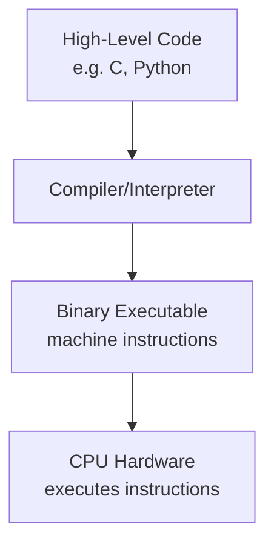

---

### 1.2 Running a Program: From Source Code to Execution

Think of writing a C program (`hello.c`) and running it. It goes through **four translation stages** before it becomes something the CPU can run, and then it must be loaded into memory.

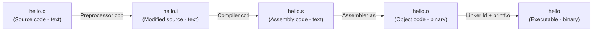

1. **Preprocessor** - handles `#include`, `#define` etc., expanding them into plain code.
2. **Compiler** - turns C code into assembly language (still human-readable, CPU-specific instructions in text form).
3. **Assembler** - turns assembly text into actual machine code (binary), called an "object file" - but it's not fully runnable yet (some addresses aren't resolved).
4. **Linker** - combines your object file with other needed object files (like `printf.o` for the C library) into one final executable.

**After compilation:**
- The executable sits on **disk**.
- When you run it, it gets **loaded from disk into main memory (RAM)**.
- The **CPU fetches instructions from memory** one by one and executes them.

---

## 2. Hardware Organization

Here's a simplified picture of how the pieces of a computer are wired together:

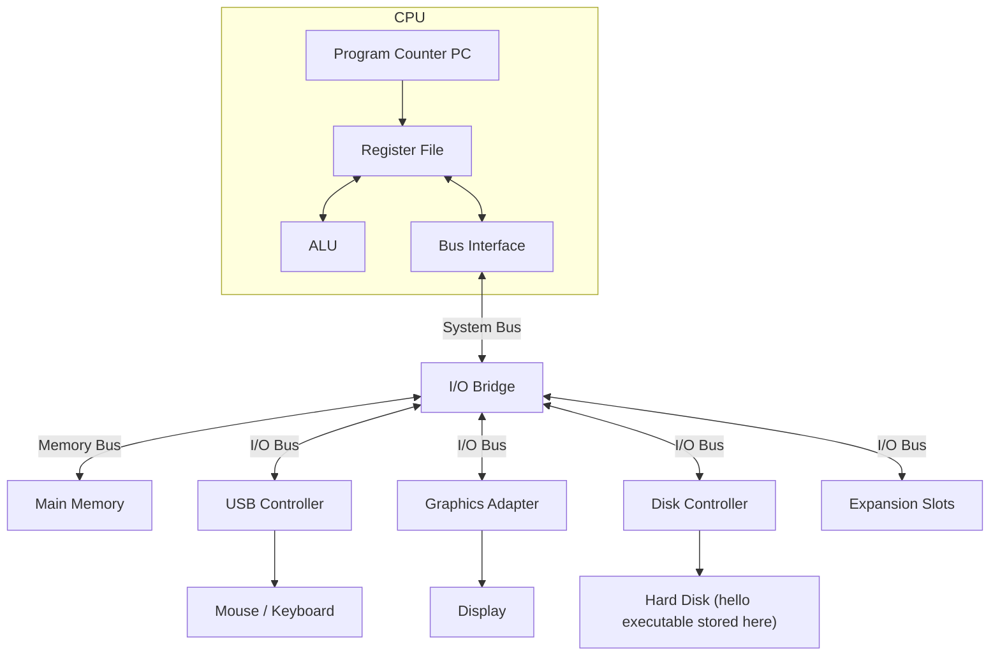

The CPU doesn't talk to devices directly. Everything connects via **buses** (sets of wires), and an **I/O bridge** routes traffic between the CPU, memory, and various device controllers.

**Program Counter -** Program Counter (PC) is a special-purpose register within the CPU that holds the memory address of the next instruction to be executed.
- **Role in Execution Cycle:** During each clock cycle, the CPU fetches the instruction located at the memory address currently stored in the PC, decodes it, executes it, and then updates the PC.
- **Updating Value:** Under normal sequential execution, the PC automatically increments to point to the address of the next instruction. Control flow instructions (such as jumps or function calls) can explicitly alter the PC value to point to a different address.
- **Process Initialization:** When an operating system loads a new process into memory, it initializes the CPU context so that the PC points directly to the process's first instruction to begin execution.

---

## 3. CPU Instruction Set Architecture (ISA)

Every CPU (Intel, ARM, etc.) understands a fixed vocabulary of instructions and has a fixed set of registers. This vocabulary + register set is called the **Instruction Set Architecture (ISA)**.

- **Instructions**: the operations the hardware can execute (add, subtract, load, jump, etc.)
- **Registers**: tiny, super-fast storage locations *inside* the CPU for temporary data.
  - **Special-purpose registers**: e.g., the Program Counter (PC)
  - **General-purpose registers**: used for anything - like holding operands for an addition.
- ISA is **manufacturer-specific** - e.g., Intel CPUs use the **x86 ISA**, ARM chips use the ARM ISA.
- **Register size** (32-bit or 64-bit) is defined by the architecture - this determines how large a number a register can hold at once, and often the maximum addressable memory.

### 3.1 Common CPU Instructions

| Instruction            | What it does                                               |
| ---------------------- | ---------------------------------------------------------- |
| **Load**               | Copy content from a memory location into a register        |
| **Store**              | Copy content from a register into a memory location        |
| **Arithmetic/Logical** | e.g., `add: reg1 + reg2 → reg3`, compare, etc.             |
| **Jump**               | Changes the value of the PC (i.e., changes what runs next) |
| **Call**               | Invokes a function                                         |

### 3.2 The CPU Execution Cycle (Simple Model)

Each clock cycle, the CPU repeats this loop:

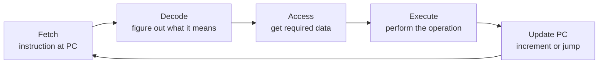

- Normally the PC just **increments** to the next instruction.
- But a `jump` or `call` instruction can make PC point somewhere else entirely.

**Optimizations to this simple model:**
- **Pipelining**: multiple instructions are processed concurrently, in different stages (like an assembly line) - while one instruction is being decoded, the next is being fetched, etc.
- Modern CPUs have many more tricks (branch prediction, out-of-order execution, superscalar execution) to squeeze out more instructions per clock cycle - beyond the scope of this intro.

---

## 4. Memory / Storage Hierarchy

### 4.1 Why a Hierarchy?

Not all memory is equal - there's a fundamental trade-off: **faster memory is smaller and more expensive; slower memory is bigger and cheaper.** So systems use a **hierarchy** of memory types.

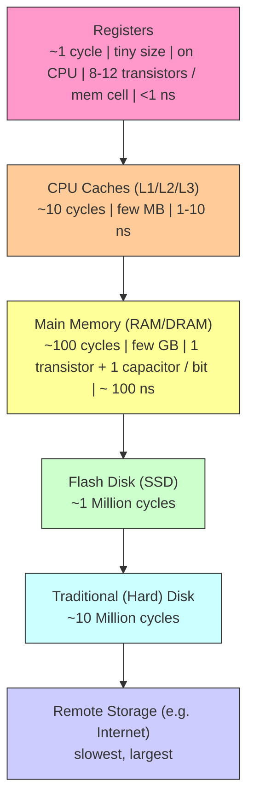


The pattern: as you go down, **speed decreases** but **capacity increases** (and cost per byte decreases). Registers and caches make up "**Primary Storage**" (on/near the CPU); flash disks, hard disks, and remote storage make up "**Secondary Storage**".

**Important detail:** CPU caches are **transparent to software** - meaning your program just says "read this memory address" and the *hardware* automatically decides whether to serve it from a fast cache or slower DRAM. The programmer/software doesn't need to know or care.

#### Why can't we just use multiple registers instead of DRAM?  (Asked in class)

Replacing Dynamic RAM (DRAM) entirely with CPU registers is impractical due to physical, architectural, and economic constraints:

**Instruction Encoding Constraints -** CPU instructions reference registers directly via binary IDs encoded inside the instruction word. With 32 registers, a 5-bit field is sufficient ($2^5 = 32$). If a CPU had millions of registers, every instruction would require 20 to 30 bits just to specify a single operand register, causing executable binaries and instruction bandwidth requirements to balloon.

**Physical Wiring and Access Latency**
- **Multiplexer and Port Overhead:** Registers connect directly to execution units via dedicated internal buses and multi-port register files. As the number of registers increases, the internal routing, decoding circuits, and multiplexers grow exponentially in size and complexity.
- **Speed Degradation:** A massive register file has longer internal wires and higher capacitance, which increases access latency and slows down the CPU's overall clock frequency.

**Cell Footprint:** A single register bit is made of multiple transistors (typically 8 to 12 transistors for high-speed multi-ported flip-flops/latches), whereas DRAM uses a single transistor and capacitor per bit.   

**Power Consumption and Heat -** High-speed register files consume power continuously and generate substantial heat per bit during active operation. Packing gigabytes of registers onto a single processor die would create severe thermal bottlenecks that cooling systems cannot handle.

---

### 4.2 Program Memory Layout

When your C program runs, its memory is organized into distinct regions:

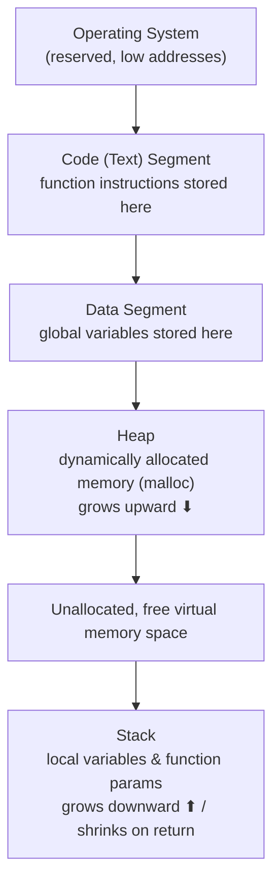

Using the example code:
```c
int g;                       // global variable

int increment(int a) {
    int b;
    b = a + 1;
    return b;
}

main() {
    int x, y;
    x = 1;
    y = increment(x);

    int *z = malloc(40);
}
```

- `g` (**global variable**) → memory allocated in the **Data segment** when the executable is first loaded into memory.
- `a`, `b` (function argument/local variable of `increment`) and `x`, `y` (locals of `main`) → allocated ("pushed") on the **Stack** each time the function is *called*, and removed when the function *returns*.
- `z = malloc(40)` → 40 bytes are allocated on the **Heap** at runtime, only when `malloc` is actually called.

**Simple analogy:** Think of the stack like a stack of plates - you add a plate (local variables) when a function starts, and remove it when the function ends. The heap is more like a warehouse where you can request storage space at any time and it stays until you explicitly free it.

---

## 5. I/O Devices and Controllers

### 5.1 The Big Picture

A computer system = **CPU + Main Memory + I/O devices**, all connected by a **system bus** (some I/O devices also sit on specialized buses like USB).

- A **bus** is simply a set of wires that carry data between components. Since multiple components might want to use the bus at once, there are **bus arbitration protocols** to coordinate access (like traffic rules at an intersection).
- Each I/O device is managed by a **device controller** - essentially a small microcontroller with its own registers that "speaks" to the CPU/memory over the bus.

### 5.2 Device Controller Registers (Simplified Model)

Every device controller conceptually has three key registers:

| Register | Purpose |
|---|---|
| **Command** | The action the CPU wants the device to perform |
| **Data** | The information relevant to that action |
| **Status** | Reports back the current status of the action |

### 5.3 How Does the CPU Talk to These Registers?

Two approaches:

1. **Explicit I/O instructions**: special `in`/`out` CPU instructions specifically meant to access device registers.
2. **Memory-mapped I/O**: device registers are given memory addresses (as if they were just bytes of RAM), so the CPU can use ordinary `load`/`store` instructions to read/write them.

---

## 6. Polling, Interrupts, and DMA

**Scenario:** The CPU tells the disk "give me this block of data." The data isn't ready instantly (disks are slow). What should the CPU do while waiting?

### 6.1 Polling - the wasteful way

The CPU keeps **repeatedly checking** ("polling") the status register in a loop, and only copies data once status says "ready."

> ❌ **Problem**: The CPU is busy the whole time just checking - wasting cycles it could have spent on other work. Inefficient.

### 6.2 Interrupts - the smart way

The CPU gives the command, then goes off and does other useful work. The device itself **raises an interrupt** (sends a signal) once the data is ready.

- Each device is assigned an **interrupt number (IRQ)** so the CPU knows which device is interrupting it.
- The CPU is free to do other work in the meantime - much more efficient than polling.

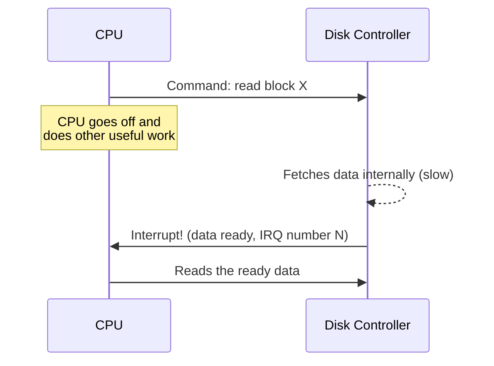

### 6.3 Direct Memory Access (DMA) - moving the data efficiently

Even after data is "ready" in the device's register, it still needs to get into **main memory** so programs can use it. How?

- **Naive option**: CPU reads data from the device register into its own registers, then writes it into RAM.
  - ❌ Inefficient - data makes an unnecessary detour through the CPU.
- **DMA (Direct Memory Access)**:
  - The device controller is told *beforehand* which memory address to use.
  - When data is ready, the device controller **directly writes into RAM via the system bus** - bypassing the CPU entirely.
  - The CPU is completely free while this transfer happens.
  - Once the transfer completes, the device raises an interrupt to tell the CPU "the data is now in memory."

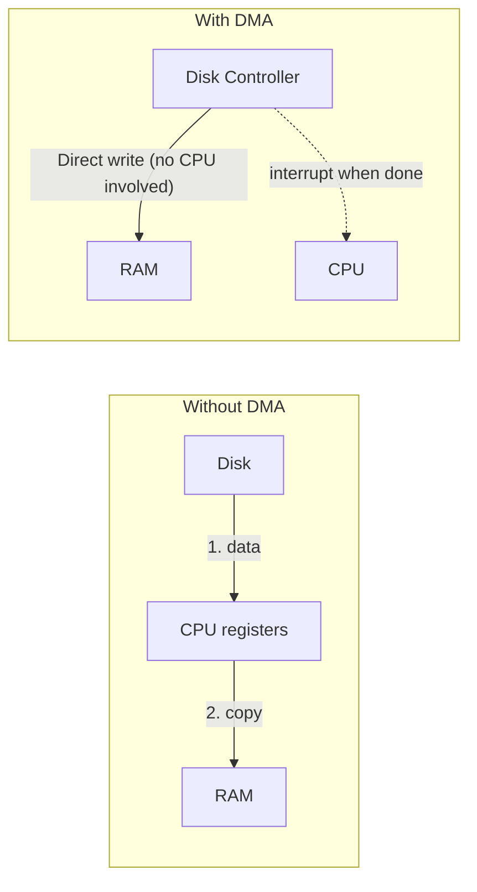

**Why DMA matters:** It frees the CPU to do useful computation instead of babysitting a slow data transfer.

---

## 7. Device Drivers

I/O devices from different manufacturers have different registers, commands, and quirks. Someone has to know these details and translate generic OS requests ("read this file") into device-specific register operations.

That "someone" is the **device driver** - special software that is **part of the operating system**.

**Functions performed by a device driver:**
- Starting I/O operations and issuing commands to the device.
- Telling the device where DMA buffers are (or manually copying data if DMA isn't used).
- Handling interrupts raised by the device, or polling it if needed.

---

## 8. What is an Operating System (OS)?

### 8.1 The Layered View

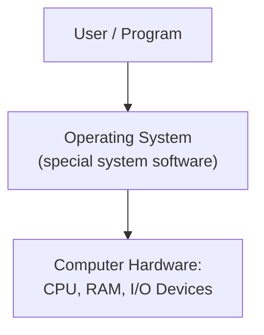

> **The OS sits between the user's programs and the raw hardware.** It manages the hardware and provides *abstractions* that make the hardware much easier and safer to use.

### 8.2 Key Characteristics

- The OS is **middleware** - not an application users directly "use" for tasks (like a browser), but the underlying system software everything else depends on.
  - Examples: **Linux, Windows, macOS**.
- It **manages hardware**: CPU, memory, I/O devices (disks, network cards, mice, keyboards, etc.) - so that user applications **don't need to worry about low-level hardware details.**
- The OS is made up of:
  - **Kernel** = the *core* functionality of the OS.
  - **Other useful programs** = the shell, shell commands, and utilities that help users interact with the OS.

### 8.3 Monolithic vs. Microkernel Architectures

There are two broad philosophies for how to *build* an OS:

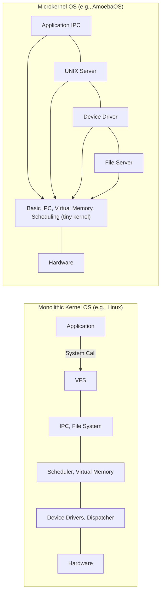

- **Monolithic kernel** (most OSes today, e.g., Linux):
  - One big executable contains almost all kernel functionality (scheduler, memory manager, file systems, device drivers, IPC etc.) all running in privileged (kernel) mode.
  - You can still **load kernel modules at runtime** to add functionality (e.g., a new device driver) without recompiling the whole kernel.
    - Command: `sudo modprobe <MODULE_NAME>`
- **Microkernel** (e.g., AmoebaOS - interestingly, Python was originally developed to support this project):
  - The kernel itself is kept **tiny**, providing only the bare essentials (basic IPC, virtual memory, scheduling).
  - Almost everything else (file servers, device drivers, etc.) runs as separate **services/processes** outside the kernel, communicating via message passing.
  - More modular and (in theory) more robust to a single component crashing, but historically **less popular** due to performance overhead from all the message-passing between services.

---

## 9. A Brief History: UNIX and the Evolution of Operating Systems

### 9.1 Timeline

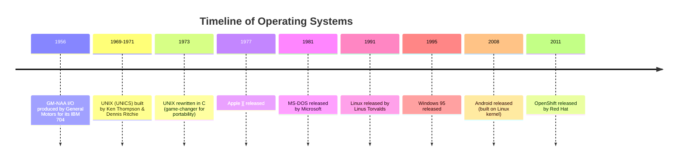

### 9.2 Pre-UNIX Era

- Early operating systems were **hardware-specific** - every different machine needed its own OS, written completely from scratch.
- This made OSes **bulky and non-portable** - an OS written for one machine wouldn't work on another.

### 9.3 Birth of UNIX (1969–1971)

- **Ken Thompson and Dennis Ritchie** started building an OS at Bell Labs, initially called **UNICS**, which later became **UNIX**.
- What is UNIX?
  - Software that manages a computer's hardware and provides an environment for running programs.
  - **Multi-user**, **multitasking**, **portable**, built around a philosophy of small, composable tools.
  - **"Tools" philosophy**: small programs, each doing *one* job well, that can be combined together (e.g., via pipes).

### 9.4 UNIX Rewritten in C (1973) - The Game Changer

- The original UNIX was written in **assembly language** for the PDP-7, later ported to PDP-11 assembly. Assembly is tied to specific hardware - not portable.
- **Dennis Ritchie invented the C programming language** specifically to help build UNIX.
- UNIX was then **rewritten in C**, making it far more **portable** - it could be adapted to new hardware with much less rewriting work, since C compilers could target different CPU architectures.

**Examples of UNIX-family systems:**
| Category | Examples |
|---|---|
| **True UNIX** (officially certified) | AIX, HP-UX, macOS |
| **UNIX-like** (inspired by, not certified) | Linux, FreeBSD, Android (built on Linux) |

### 9.5 Features of UNIX

| Feature | Meaning |
|---|---|
| **Multi-user** | Many people can use the same machine at the same time, each with their own environment. |
| **Multitasking** | Can run many programs at once without them interfering with each other. |
| **Portability** | Can run on many types of hardware - a huge deal in the 1970s. |
| **Everything is a file** | Devices, directories, and data are all accessed through a uniform file-like interface. |
| **Shell & Utilities** | A powerful command-line interface plus simple utilities (`ls`, `grep`, `cat`) that can be chained together. |

---

## 10. The Shell

### 10.1 What is the Shell?

The **shell** is a program that:
- Takes the commands you type,
- Sends them to the operating system (kernel) to be carried out,
- Shows you the results.

It's called a "**shell**" because it's the *outer layer* users interact with, while the **kernel** is the *inner core* actually controlling the hardware.

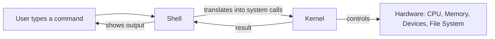

| | Kernel | Shell |
|---|---|---|
| Role | The heart of the OS - manages CPU, memory, devices, file systems | The friendly interface for humans to give instructions to the kernel |
| Handles | Low-level resource management | Process management, file management, network commands, etc. |

### 10.2 Why is the Shell Powerful?

- **Automation**: you can write **shell scripts** to automate repetitive tasks.
- **Combining tools**: use **pipes** (`|`) to feed the output of one program as input to another, and **redirection** (`>`, `<`) to send output to/read input from files.
- **Remote management**: many servers only offer shell access (no GUI), so shell skills are essential for system administration.

### 10.3 Types of Shells

| Shell | Description |
|---|---|
| `sh` (Bourne shell) | The original standard shell |
| `bash` (Bourne Again Shell) | Most common shell on Linux today |
| `zsh`, `ksh`, `fish` | Modern alternatives with extra features (autocompletion, better scripting, etc.) |

---

## 11. Why Study Operating Systems?

Understanding **hardware (architecture) + system software (OS)**, and how user programs interact with these lower layers, is essential to writing "good" (high-performance, reliable) programs. This knowledge helps answer questions like:

- What exactly happens when you run a user program?
- How can you make your program run faster and more efficiently?
- How can you make programs more secure, reliable, and fault-tolerant?
- Why is your program running slowly, and how do you fix it?
- How much CPU/memory is your program actually consuming, and why?

> **OS expertise is one of the most important skills for building high-performance, robust, complex real-world systems.**

### 11.1 Beyond Just OS

OS knowledge is foundational, but it's part of a bigger picture in systems and performance engineering:

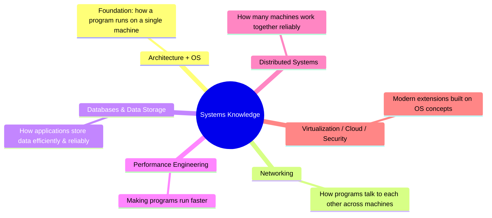

---

## 12. Core Responsibilities of the OS

The OS has three central responsibilities:

1. **Making it easy to run programs** (loading, starting, stopping processes)
2. **Allowing programs to share memory** (safely, without stepping on each other)
3. **Enabling programs to interact with devices** (disks, network, keyboard, etc.)

To achieve these, the OS relies heavily on a concept called **virtualization**.

---

## 13. Virtualization

**Core idea:** The OS takes a **physical resource** (like the CPU, memory, or disk) and transforms it into a **virtual form** of itself that is more general, more powerful, and easier to use.

- Because of this, we sometimes call the OS a "**virtual machine**" - it gives each program the illusion that it has the whole machine to itself.

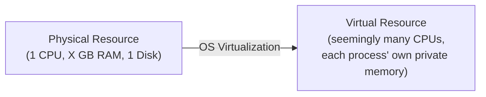

### 13.1 Virtualizing the CPU

**The problem:** There's usually only **one physical CPU** (or a handful of cores), but we want to run *many* programs seemingly "at once."

**The solution:** The OS turns a single CPU into a **seemingly infinite number of virtual CPUs**, letting many programs seem to run simultaneously - this is called **virtualizing the CPU**.

**Demonstration from the slides:**
```
$ ./a.out A & ./a.out B & ./a.out C &
[4] 309
[5] 310
[6] 311
$ A
C
B
A
C
B
A
B
...
$ kill -9 309 310 311
```
> Even though there's only **one processor**, all three (in this case, four counting the shell itself) programs *appear* to run at the same time, printing "A", "B", "C" in an interleaved fashion!

### 13.2 How Does the OS Actually Run a Process?

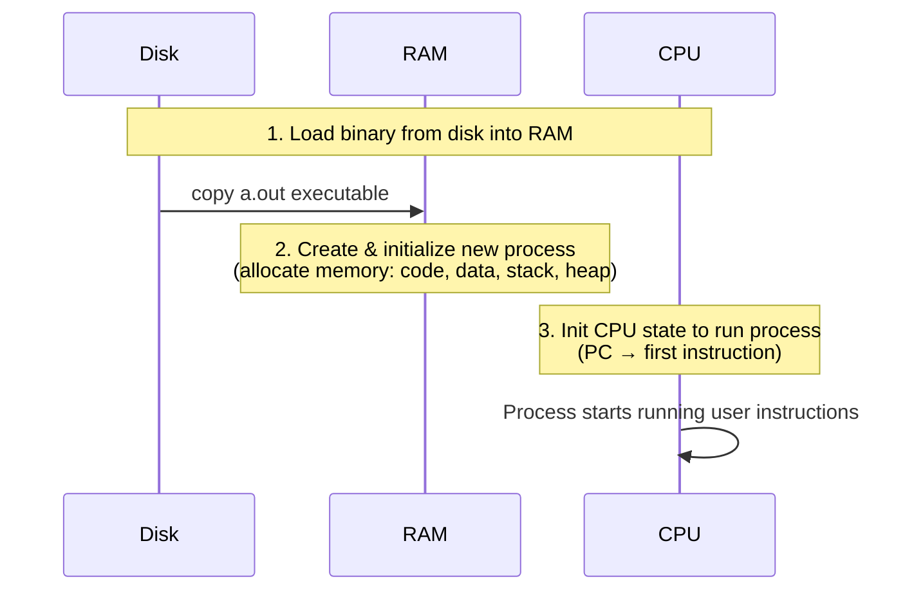

Step by step:
1. **Allocates memory** for the new process in RAM: loads code & data from the disk executable, and allocates memory for the stack and heap.
2. **Initializes CPU context**: sets the PC to point at the process's first instruction.
3. **Process starts running**: the CPU now executes user instructions directly - the OS "steps out" of the picture, but jumps back in later whenever needed (system calls, interrupts, etc.)

### 13.3 Concurrent Execution: How Does the OS Juggle Multiple Processes?

The trick: the OS runs one process for a short time, **pauses** it, switches to another, runs it for a bit, switches again - over and over, very fast. This is called **context switching**.

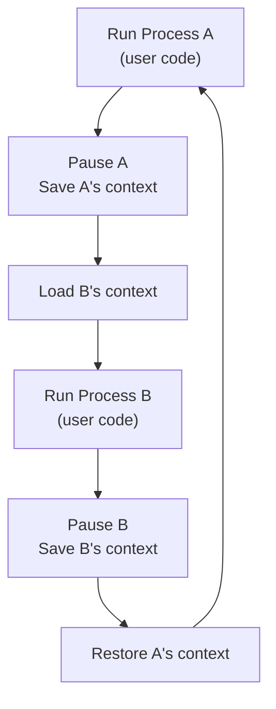

- **"Context"** = everything needed to resume a process exactly where it left off (register values, PC, etc.)
- Because the OS carefully **saves and restores context**, each process has no idea it was ever paused - it sees no disruption. It *thinks* it's running alone on the CPU the whole time!

Example interaction between user code and kernel code involving a disk read:

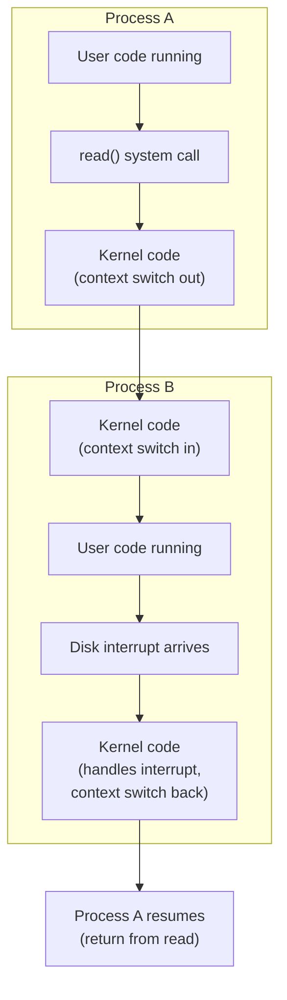

### 13.4 Virtualizing Memory

**The problem:** If two programs both try to use the memory address `00200000` at the same time, how do they not collide?

**Demonstration from the slides:**
```
prompt> ./mem &; ./mem &
[1] 24113
[2] 24114
(24113) memory address of p: 00200000
(24114) memory address of p: 00200000
(24113) p: 1
(24114) p: 1
(24114) p: 2
(24113) p: 2
(24113) p: 3
(24114) p: 3
...
```
Both processes think they own address `00200000` and are updating a value there **independently** - yet there's no conflict!

**How is this possible?**

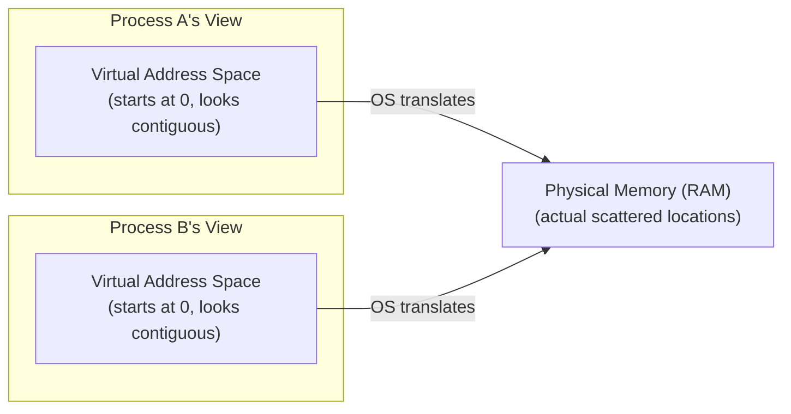

- The OS gives **every process the illusion** that its own memory is laid out contiguously starting from address `0`. This illusion is called the **virtual address space**.
- In reality, a process's memory is scattered in small chunks all across physical RAM, at addresses the programmer never sees or needs to know about.
- Any pointer address you print inside your program (like `00200000`) is a **virtual address**, not the real physical address.
- When a process accesses a virtual address, the OS (with hardware help) translates it and retrieves data from the actual **physical address**.
- In short: **the OS virtualizes memory for every process**, giving each one the illusion of its own private virtual address space - even though physically they may be sharing the same RAM chip, non-overlapping in reality.

---

## 14. CPU Modes: User Mode vs. Kernel Mode

To keep the system safe (so one buggy or malicious program can't crash the whole machine or read another program's data), the CPU operates in two distinct modes:

| Mode | Who runs in it | What it can do |
|---|---|---|
| **User (unprivileged) mode** | User programs | Can only execute *unprivileged* instructions - no direct hardware access |
| **Kernel (privileged) mode** | The OS | Can execute *both* privileged and unprivileged instructions - full hardware access |

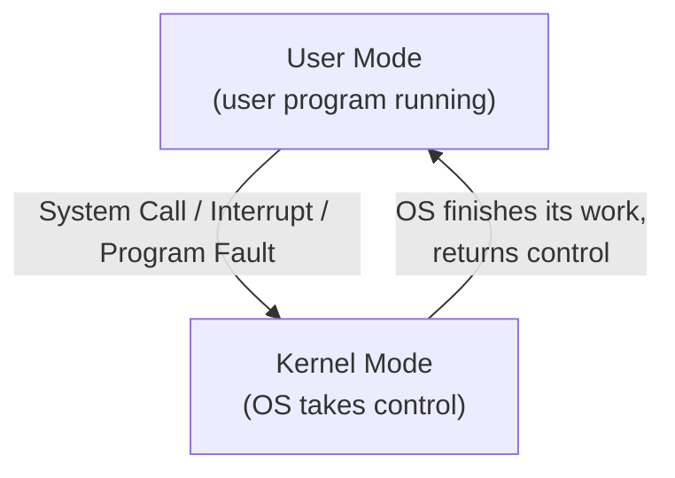

**The CPU shifts from user mode to kernel mode when one of these events occurs:**
1. **System calls** - a user program explicitly requests an OS service (e.g., "please read this file for me").
2. **Interrupts** - external hardware events that need the OS's attention (e.g., a disk finishing a read, a key being pressed).
3. **Program faults** - errors that need OS attention (e.g., dividing by zero, accessing invalid memory).

After the OS finishes handling the situation in kernel mode, it **returns control back to the user program**, and the CPU shifts back to user mode.

---

## 15. System Calls (In Detail)

A **system call** is how a user program requests a service from the OS.

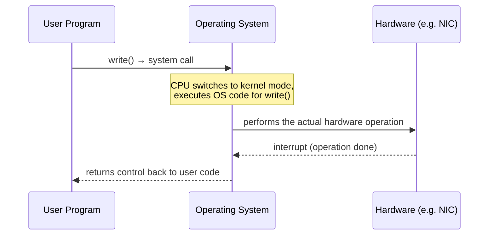

**Why can't the user program just talk to hardware directly?**
- Because user processes are **not allowed to run privileged instructions** that access hardware directly.
- This prevents one user/program from **harming another** - e.g., accidentally (or maliciously) corrupting another process's memory or another user's files.

**How it flows:**
1. The user program executes a system call (e.g., `write()`).
2. The CPU **jumps into OS code** (in kernel mode) that implements this system call.
3. Once the system call finishes, control **returns back to the user code**, and the CPU goes back to user mode.

**A subtlety:** Normally, a user program does **not** call the raw system call directly. Instead, it calls a convenient **library function**.
- Example: `printf()` is a function from the C standard library. Internally, `printf()` eventually invokes the actual system call needed to write characters to the screen. The programmer just calls `printf("Hello")`, and the library handles the low-level system call for them.

---

## 16. Interrupts (In Detail)

In addition to running user programs, the CPU must also respond to **external events** - a mouse click, a keystroke, a disk finishing a data transfer, etc.

**Definition:** An **interrupt** is an external signal from an I/O device asking for the CPU's attention.

**Example:** A program requests to read data from disk. Instead of the program sitting and waiting (wasting CPU time), the disk works on the request in the background, and **raises an interrupt** once the data is ready - this snaps the CPU's attention away from whatever it was doing.

```mermaid
flowchart LR
    subgraph Timeline
        direction LR
        UP["User Program Running"] -->|"time X: interrupt occurs"| IH["Interrupt Handler runs<br/>(kernel mode)"]
        IH -->|"time Y: handling done"| UP2["User Program Resumes"]
    end
```

- Before time **X**: CPU is in **user mode**, running the user program.
- At time **X**: an interrupt arrives → CPU switches to **kernel mode**, runs the **interrupt handler**.
- At time **Y**: handler finishes → CPU switches back to **user mode**, resuming the user program (as if nothing happened, other than a hidden pause).

---

## 17. Putting It All Together: OS Internal Structure

```mermaid
flowchart TB
    U["User / Program"]
    SCI["System Call Interface"]
    CORE["Core OS Functionality<br/>(process mgmt, memory mgmt, file systems, scheduling...)"]
    DI["Device Interface"]
    DD["Device Drivers: Disk Driver | Keyboard Driver | Network Driver"]
    HW["Computer Hardware: CPU, RAM"]
    DEV["Devices: Disk | Keyboard | NIC"]

    U --> SCI --> CORE
    CORE --> DI --> DD --> DEV
    CORE -.-> HW

    subgraph Kernel["OS Kernel"]
        SCI
        CORE
    end
    subgraph DriverSW["Device Driver Software (loaded into OS)"]
        DI
        DD
    end
```

- **System Call Interface**: the "front door" through which user programs request OS services.
- **Core OS Functionality**: the heart of the kernel - process management, memory management, scheduling, file systems, etc.
- **Device Interface + Device Drivers**: the "back door" through which the OS talks to actual hardware devices, using the device-specific knowledge encoded in each driver.

---

## 18. Quick-Reference Summary Table

| Concept | One-line takeaway |
|---|---|
| **ISA** | The fixed set of instructions + registers a CPU understands |
| **Register (PC)** | Special register holding the address of the next instruction |
| **Cache/Memory Hierarchy** | Trade-off between speed and size/cost: registers < cache < RAM < disk |
| **Stack vs Heap** | Stack = function calls/locals (auto managed); Heap = dynamic memory (manually managed via malloc/free) |
| **Polling vs Interrupts** | Polling wastes CPU cycles by constantly checking; interrupts let the CPU do other work and get notified |
| **DMA** | Lets devices write directly to RAM, bypassing the CPU, for efficiency |
| **Device Driver** | OS software with device-specific knowledge to operate a device |
| **OS** | Middleware between user programs and hardware; manages resources & provides abstractions |
| **Kernel vs Shell** | Kernel = core OS engine (privileged); Shell = user-facing command interface |
| **Monolithic vs Microkernel** | Monolithic = big single kernel executable (e.g. Linux); Microkernel = tiny core + services (e.g. AmoebaOS) |
| **Virtualization** | OS makes a physical resource appear as an easier-to-use, seemingly abundant virtual resource |
| **Virtual CPU** | Illusion of many CPUs via fast context switching between processes |
| **Virtual Memory** | Illusion that each process has its own private, contiguous memory space starting at address 0 |
| **User Mode vs Kernel Mode** | User mode = restricted, safe; Kernel mode = full privileged access, only OS runs here |
| **System Call** | The mechanism by which a user program asks the OS to do something on its behalf |
| **Interrupt** | Hardware signal that forces the CPU to stop and let the OS handle an event |

---

*End of notes - based on "CS F372: Operating Systems - Introduction to Operating Systems", BITS Pilani, K K Birla Goa Campus.*
