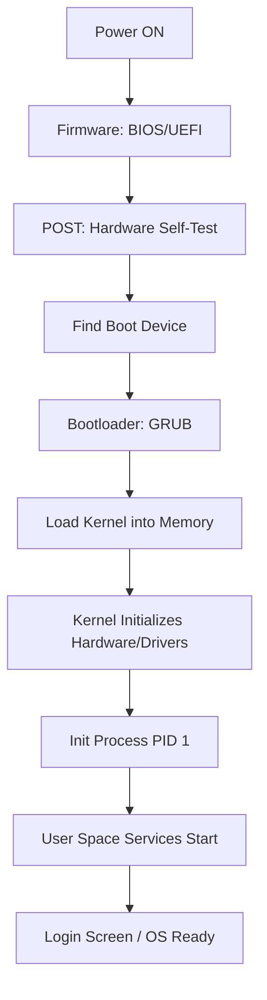
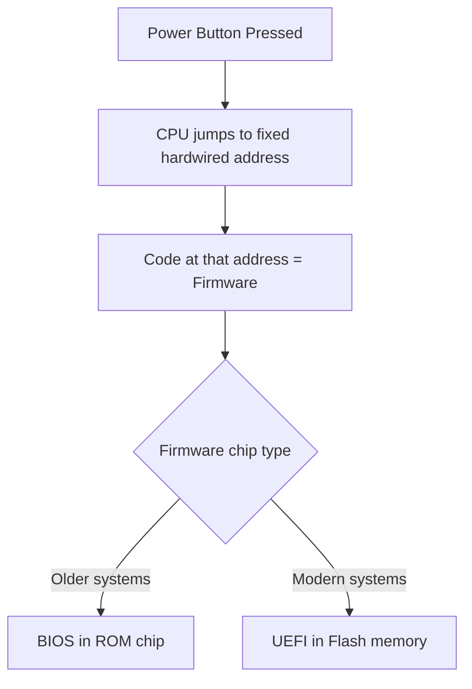
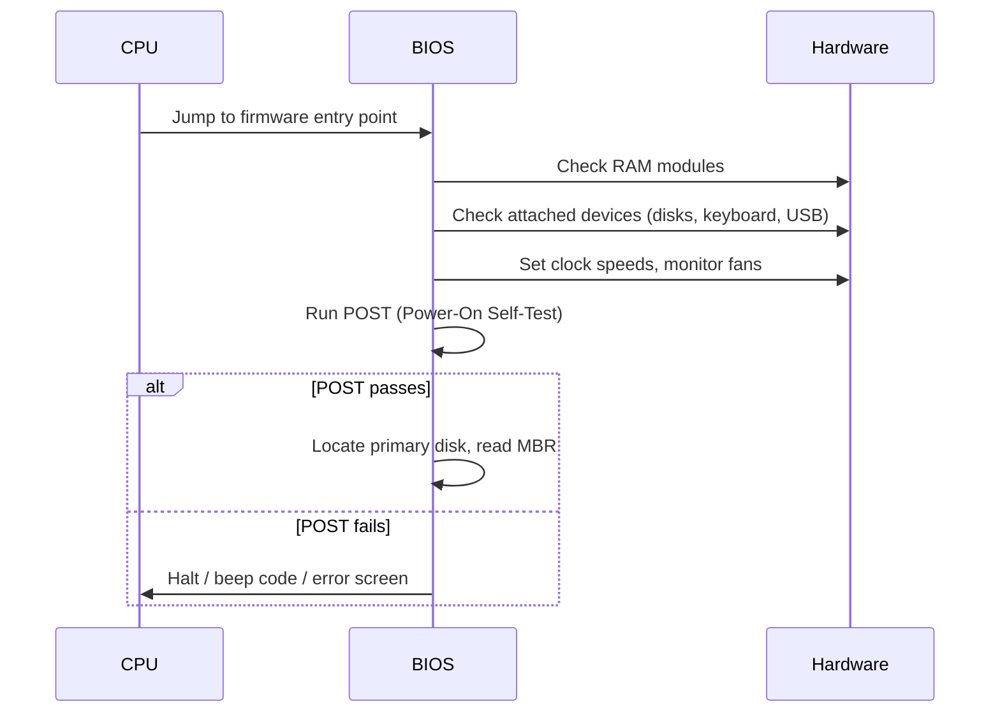
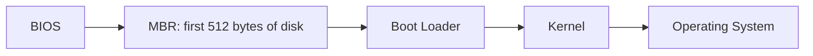
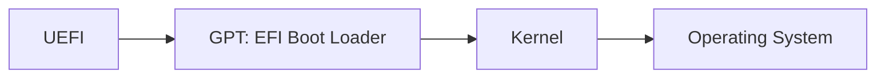
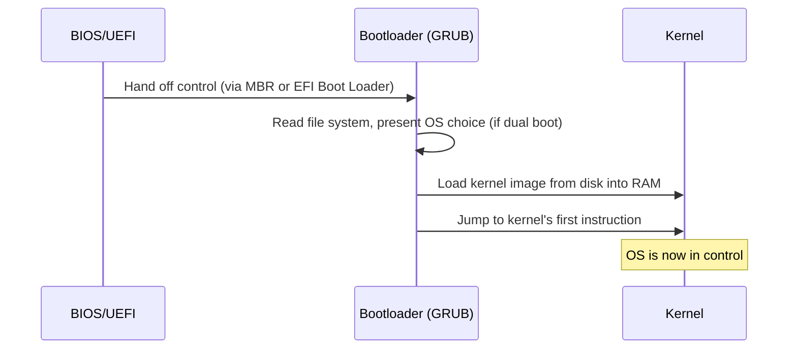
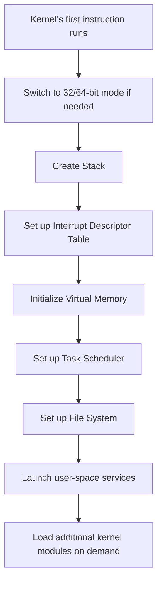
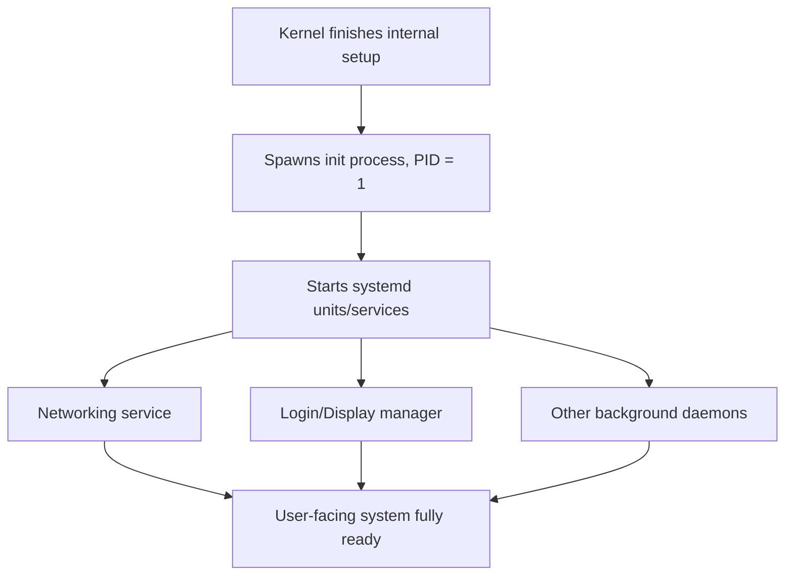
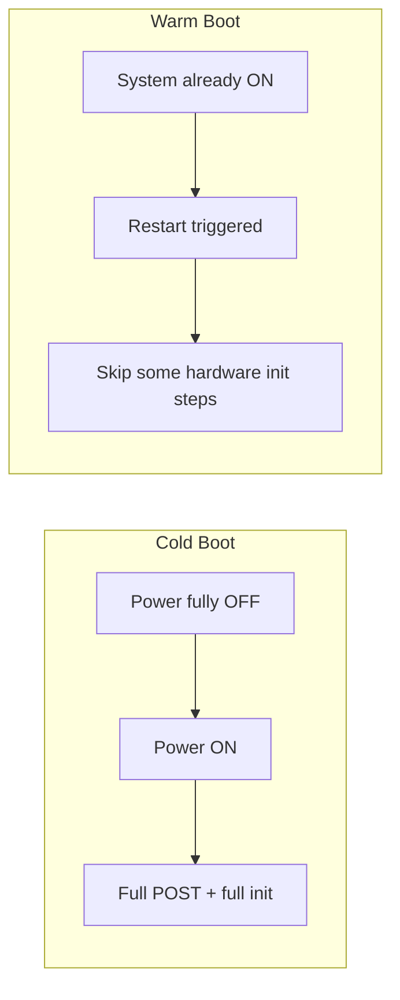
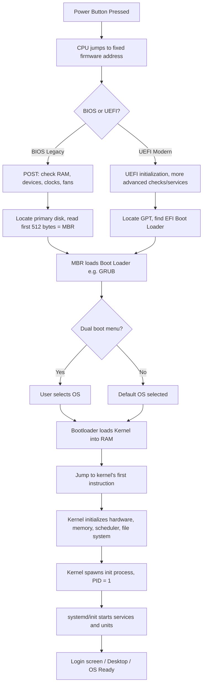

## 1. The Big Picture: What Does "Booting" Mean?

When you press the power button, the computer has no operating system loaded in memory yet. RAM is empty. The CPU doesn't magically know "go run Windows" or "go run Linux". Booting is the sequence of steps that gets the machine from "just received power" to "OS is fully running and ready for you to use".

At a high level, here is the entire journey:

Every box above is explained in detail below.

---

## 2. Firmware: The First Program That Ever Runs

Firmware is a tiny program permanently baked into a chip on your motherboard. It is the very first code the CPU executes, before any operating system exists.

- When power is applied, the CPU is hardwired to jump to a specific, well-known memory address.
- Whatever code sits at that address starts running. That code is the firmware.
- Firmware lives in **read-only memory (ROM)** or **flash memory** (a rewritable type of non-volatile chip), *not* on your hard drive. This matters because the hard drive isn't even "known" to exist yet — something has to run first to go find it.

**Why does it need to be non-volatile (ROM/flash)?** RAM loses its contents when power is off. If firmware were stored in RAM, it would vanish every time you shut down, and there'd be nothing for the CPU to execute on the next power-up. Flash/ROM retains data without power.

### Two major examples of firmware
| Firmware | Era | Notes |
|---|---|---|
| **BIOS** (Basic Input/Output System) | Older PCs | Originally proprietary to IBM PC |
| **(U)EFI** | Modern PCs | Replaced BIOS; more capable |

---

## 3. BIOS (Basic Input/Output System)

BIOS is the classic firmware that has been around since the original IBM PC. Its job is to check that hardware works and then hand control over to the next stage.

### Where BIOS lives
- **Originally**: burned onto a ROM chip on the motherboard — permanent, could not be changed without physically replacing the chip.
- **Later systems**: stored on **flash memory**, so it can be updated ("flashing the BIOS") through software, without opening the case.

### What BIOS actually does (POST)
Before handing off control, BIOS performs the **Power-On Self-Test (POST)**:
- Detects memory modules (RAM) and confirms they work.
- Detects external/attached devices (keyboards, disks, USB devices, etc).
- Sets clock speeds and checks fan/cooling status.
- Runs a diagnostic test to verify all essential hardware is functioning correctly.

If POST fails (say, RAM is faulty or not seated properly), you often hear beep codes or see an error message — the computer refuses to continue booting because a broken foundation shouldn't try to build a house on top of it.

You may have seen the BIOS setup screen — a blue/text-based menu with options like "Standard CMOS Features", "Advanced BIOS Features", "PnP/PCI Configurations", etc. This is where BIOS lets you configure hardware settings like boot order, time/date, and enable/disable devices.

---

## 4. UEFI (Unified Extensible Firmware Interface)

UEFI is the modern replacement for BIOS. 

### Why BIOS needed replacing
- BIOS had hard technical limitations that became too restrictive for **larger server platforms** — e.g., limited addressable disk space, 16-bit real mode code, slow boot times, no built-in networking or graphical interfaces.

### Key facts
- Full name: **Unified Extensible Firmware Interface**.
- **Backward compatible** with BIOS through a mode called **CSM (Compatibility Support Module)**, letting UEFI systems still boot old BIOS-style operating systems if needed.
- The first **open-source UEFI implementation**, called **Tiano**, was released by **Intel in 2004**.
- UEFI specification continues to be updated — the slide notes the **latest version as of December 2024**.

### UEFI vs BIOS quick comparison

| Feature                 | BIOS                                   | UEFI                                       |
| ----------------------- | -------------------------------------- | ------------------------------------------ |
| Age                     | Older, legacy                          | Modern                                     |
| Interface               | Text-based menus                       | Can support graphical menus, mouse support |
| Partition scheme        | MBR only                               | Supports GPT (and MBR via CSM)             |
| Max disk/partition size | Limited (2 TB per partition under MBR) | Much larger (GPT supports up to 8 ZiB)     |
| Boot speed              | Slower                                 | Generally faster                           |
| Extensibility           | Very limited                           | Extensible, driver support pre-OS          |

---

## 5. MBR (Master Boot Record) and the Legacy Boot Path

Once BIOS finishes its hardware checks, it needs to find *something* to run next. But BIOS doesn't understand file systems (folders, files, etc.) — it only understands raw disk locations. So there's a rule: always look at a fixed, predefined spot on the disk.

### The mechanism
- BIOS locates the **primary disk** and reads the **first 512 bytes** of it.
- This 512-byte chunk is called the **Master Boot Record (MBR)**.
- This location is *predefined* precisely because BIOS has no concept of "file systems" — it can't browse folders, so it needs an agreed-upon fixed address to check every single time.
- The MBR itself is a **very small program**. It's too small to be a full bootloader, so its only job is to immediately locate and read a larger program from disk — the **Boot Loader**.

### MBR limitations
- Supports only **up to 4 primary partitions** per disk.
- Supports **up to 2 TB per partition** (a hard architectural limit of the addressing scheme used).

### Legacy boot flow

---

## 6. GPT (GUID Partition Table) and the UEFI Boot Path

GPT is the modern replacement for MBR's partitioning scheme, used alongside UEFI. It removes MBR's old size and partition-count limitations.

- **GPT allows disks up to 8 ZiB** (zebibytes — an enormous, essentially future-proof size) compared to MBR's 2 TB per partition cap.
- No hard 4-partition limit like MBR.
- UEFI reads a **GPT-formatted EFI Boot Loader** directly instead of an MBR-style tiny stub program.

### UEFI boot flow

---

## 7. Bootloader (e.g., GRUB)

The bootloader is the "middle-manager" of the boot process. Firmware (BIOS/UEFI) is dumb about file systems and operating systems — it just finds and runs the bootloader. The bootloader, in contrast, actually understands the file system layout, so it can go find and load the real kernel intelligently.

### Key points
- It is a **program compiled and stored on disk** (not embedded in a chip like firmware).
- It examines what the machine looks like: BIOS/UEFI hands it some basic information, but the bootloader knows much more — specifically, **how the file system is arranged on the disk**.
- On Linux, the bootloader is typically **GRUB** — **GNU GRand Unified Bootloader**. (You've likely seen its menu screen if you've ever dual-booted: a list like "Fedora Linux", "Fedora Linux (rescue mode)", "UEFI Firmware Settings".)
- **If dual-booting**, the bootloader is where you choose which OS to load (e.g., Windows vs Linux).

### What the bootloader actually does
1. Loads the kernel from disk into memory.
2. Jumps to the kernel's first instruction.
3. From this point on, **the OS is in control**, not the firmware or bootloader.

### GRUB configuration - important warning from the lecture
- The actual config file lives at **`/boot/grub/grub.cfg`**.
- **You should NOT manually edit this file directly.** It is auto-generated.
- The correct way to make changes: add your custom entries into files under **`/etc/grub.d/`**, then run the **`update-grub`** command, which regenerates `grub.cfg` correctly.
- The lecture's meme ("ONE DOES NOT SIMPLY edit /boot/grub/grub.cfg") is emphasizing this: manual edits can easily be overwritten or break the boot process, since the file explicitly states "DO NOT EDIT THIS FILE" at the top and is regenerated from templates.

---

## 8. OS Takes Control: What Happens After the Kernel Loads

Once the kernel's first instruction runs, the operating system has "woken up" and now needs to organize everything from scratch — memory, processes, file systems — before anything useful can happen.

Steps the OS performs once in control:

1. **Take control of hardware.** If the CPU hasn't already switched to 32-bit or 64-bit mode, it does so now (older boot stages sometimes start in a more limited 16-bit "real mode" for backward compatibility).
2. **Create a stack** for the kernel to use during execution.
3. **Set up the Interrupt Descriptor Table (IDT)** — this tells the CPU what to do when hardware interrupts occur (e.g., a key is pressed, a disk finishes reading data).
4. **Initialize virtual memory** — sets up the memory management system that gives each process the illusion of its own private memory space.
5. **Organize the task scheduler** — the component that decides which process gets CPU time and when.
6. **Set up the file system** — so files and directories can actually be read/written.
7. **Launch services for user space** — background processes/daemons that support user-facing applications.
8. **Load kernel modules on demand** — not everything is loaded immediately at boot. Modules (like drivers for a specific USB device you plug in later) are loaded **as and when required**, which keeps the initial boot lean and fast.

---

## 9. The Init Process

Once the kernel is running, it needs one very first "parent" process to bootstrap everything else in user space. That process is called **init**.

### Key facts
- Its **Process ID (PID) is always 1** — it is literally the first process the kernel creates.
- It **starts when the computer boots and only ends during shutdown**.
- Its core job is to **create and manage other processes** (spawning services, cleaning up when they exit, etc). Every other process on the system is ultimately a descendant of init.
- On modern Linux systems, this role is commonly filled by **systemd** (the "system and service manager").
    - `systemd` is usually **not invoked directly by the user**; it's installed as the **`/sbin/init` symlink** and started automatically during early boot.
    - You can read about it via `man init` on a Linux terminal.
    - `systemd` introduces the concept of **"units"** — 11 different types of objects representing things relevant to boot and system maintenance. Units can be **active** (started/running) or **inactive** (stopped), with in-between states like "activating"/"deactivating", and a special "failed" state.
    - Configuration for units lives in files following the `systemd.unit(5)` syntax.

---

## 10. Other Important Boot-Related Facts

### 10.1 Embedded Systems
- Devices like **digital TVs** or **GPS navigation units** need to boot almost instantly — users don't expect to wait.
- These typically store their entire (minimal) software system directly in **ROM or flash memory**, skipping many of the general-purpose PC boot steps entirely.

### 10.2 Cold/Hard Booting vs Warm/Soft Booting

| Type | What happens | What gets reset |
|---|---|---|
| **Cold / Hard Boot** | Machine is fully shut down, then switched back on | **All processes and hardware states reset** — full POST, full hardware re-initialization |
| **Warm / Soft Boot** | A restart while the machine was already on | **Skips some hardware initialization steps**, since hardware state is often already known/stable |

### 10.3 Live USB - How Does It Work?
- A Live USB lets you run an entire OS without installing anything to the hard disk.
- It works by using the **USB drive's contents loaded into RAM as a temporary workspace** — the system runs "live" out of memory rather than a persistent hard-disk installation, which is why changes usually don't persist after a restart (unless "persistence" is specifically configured).

### 10.4 Things to Ponder (open questions raised in lecture)
These are meant as reflection/discussion points, not facts with fixed answers:
- Is dual-booting on **two different physical drives** more efficient than dual-booting via **two partitions on the same drive**? (Hint: think about disk I/O contention and whether the bootloader/firmware needs to seek across the same physical disk.)
- **Windows Update quirk:** Windows updates can sometimes silently change the boot order in a dual-boot setup, causing GRUB to be overwritten or bypassed, so the machine boots straight into Windows instead of showing the GRUB menu.

---

## 11. Full End-to-End Summary Diagram

---

## 12. Quick Revision Table

| Stage | What Runs | Stored Where | Key Job |
|---|---|---|---|
| Firmware | BIOS or UEFI | ROM / Flash chip on motherboard | First code executed; basic hardware checks |
| POST | BIOS/UEFI routine | Firmware chip | Verify RAM, devices, clocks, fans are functional |
| MBR / GPT | Tiny stub program | First 512 bytes of disk (MBR) or GPT structure | Point to and load the real bootloader |
| Bootloader | GRUB (Linux example) | Disk (file system aware) | Understand file system, load kernel into RAM, offer OS choice |
| Kernel | The OS core | Loaded into RAM from disk | Take control of hardware, memory, scheduling, file systems |
| Init | systemd (PID 1) | Disk, run from RAM once loaded | Parent of all processes; starts user-space services |

---

## 13. Key Terms Glossary

- **Firmware**: Permanent, low-level software embedded in hardware (ROM/flash) that runs before any OS.
- **POST (Power-On Self-Test)**: Firmware routine that checks hardware works before continuing boot.
- **MBR (Master Boot Record)**: First 512 bytes of a disk in the legacy BIOS boot scheme; contains a tiny program pointing to the bootloader.
- **GPT (GUID Partition Table)**: Modern partitioning scheme used with UEFI; supports far larger disks/partitions than MBR.
- **Bootloader**: File-system-aware program (e.g., GRUB) that loads the kernel into memory and hands off control.
- **Kernel**: The core of the operating system; manages hardware, memory, processes, and file systems.
- **Init process**: The very first user-space process (PID 1); parent of all other processes; commonly `systemd` on modern Linux.
- **Cold boot**: Starting from a fully powered-off state.
- **Warm boot**: Restarting without a full power-off, skipping some hardware checks.
- **CSM (Compatibility Support Module)**: UEFI feature allowing it to boot in a BIOS-like legacy mode.
