## 1. What is a Process

A **process** is simply a **program that is currently running**.
- A **program** is a passive thing. It is just code sitting on your hard disk (like a `.exe` file or a compiled binary). It does nothing by itself.
- A **process** is that same program brought to life. The moment you double click it or run it from a terminal, the Operating System (OS) picks it up, sets it up in memory, and starts running its instructions on the CPU.

### What happens when you run a program?
When you run a program, the OS does three main things:
1. **Creates a new process** (like opening a new "file" or "slot" to track this running instance).
2. **Allocates memory** for it and loads the program's code and data from disk into that memory.
3. **Initializes the CPU context** (sets up register values, especially the Program Counter, so the CPU knows where to start executing) and starts the process in **user mode**.

Normally, the CPU just executes the user program's instructions one after another. The OS does not babysit every single instruction. However, the OS "steps in" when:
- The program makes a **system call** (asks the OS to do something for it, like reading a file).
- An **interrupt** happens (e.g., hardware like a keyboard or disk says "hey, I have data ready").
- A **program fault** occurs (e.g., division by zero, illegal memory access).

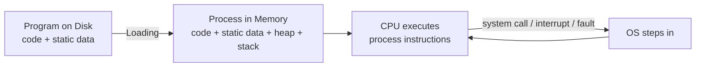

---

## 2. What Defines a Process

Every process is uniquely identified and described by four key things:

### a) Process Identifier (PID)
- Every process gets a unique number called the **PID**.
- The OS uses this number to keep track of and refer to that specific process.

### b) Memory
A process occupies memory, which is divided into parts:
- **Code**: The actual instructions of the program (copied from the executable file).
- **Data**: Global variables (also comes from the executable).
- **Heap**: Memory dynamically allocated at runtime (e.g., using `malloc` in C). It **grows** as the program requests more memory.
- **Stack**: Stores local variables and function call information (parameters, return addresses). It **grows** when functions are called and **shrinks** when functions return.

### c) Execution Context (CPU Registers)
- The **context** is basically a snapshot of all the CPU register values for that process.
- The most important register is the **Program Counter (PC)**, which holds the address of the *next instruction* to execute for that process.
- Some other registers hold data the process is currently working with.
- When a process is paused (not currently running), its context is saved into memory. When it is resumed later, the OS restores that exact context, so the process continues exactly where it left off, as if it was never interrupted.

### d) Communication with I/O Devices
- A process may have files open, or ongoing network connections.
- The OS tracks these too, as part of what makes up "the process."

---

## 3. Process States

### Ready
- The process **could** run (it has everything it needs) but the OS has decided **not** to run it right now.
- Why? Because a CPU core can only run **one process at a time**. If there are 5 processes and 1 CPU core, only 1 can be "Running"; the rest wait in "Ready".

### Running
- The process **is** currently executing on a CPU core.
- Its instructions are actively being carried out, and the CPU registers currently hold this process's context.

### Blocked / Sleep / Suspended
- The process has done something that means it **cannot** continue right now, even if the CPU is free.
- Classic example: it made a request to read data from disk. The disk takes time, so the process cannot proceed until that data arrives. Meanwhile, it makes no sense to keep it on the CPU wasting cycles, so the OS moves it to "Blocked".

### Exited
- The process has finished. It is done running.

### Why save context for Ready and Blocked processes?
Both Ready and Blocked processes are **not currently on the CPU**, but they are not gone either. Their entire context (registers, memory pointers, etc.) is saved in OS-managed memory, so that whenever it is their turn again, the OS can restore everything and let them continue seamlessly.

### Time Slice

A **time slice** (also called a **quantum**) is the small chunk of time the CPU scheduler gives a process to run before it forces a switch to another process.
- On a single CPU core, only one process can actually run at any instant.
- If the scheduler let one process run until it finished completely, other "Ready" processes could end up waiting a very long time, which feels unfair and unresponsive (imagine your music player freezing because a video is exporting).
- So instead, the scheduler gives each process a small fixed slice of time, say 10 or 20 milliseconds. When that slice runs out, the CPU forcibly interrupts the process (using a hardware timer interrupt), saves its context, and switches to the next Ready process.

The interrupted process isn't blocked or dead. It goes back into the **Ready** state, and its turn will come again later.

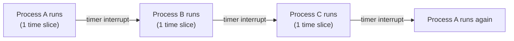

This rapid switching between time slices is what creates the _illusion_ that many programs run "at the same time" on a single core, even though technically only one instruction stream executes at any given instant. If the time slices are short enough, switching feels seamless to a human.

### The State Diagram

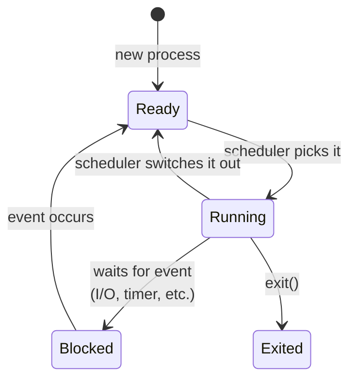


---

## 4. Process State Transitions: A Worked Example

Let's trace through a real scenario with two processes, **P0** and **P1**, running on a single CPU core.

**Setup:** P0 is Running, P1 is Ready (waiting its turn). P0 wants to read a file from disk.

| Time | Process0 | Process1 | What's happening |
|---|---|---|---|
| 1 | Running | Ready | P0 executing normally |
| 2 | Running | Ready | P0 executing normally |
| 3 | Running | Ready | P0 makes a system call to read from disk |
| 4 | **Blocked** | **Running** | P0 is blocked waiting for disk; OS switches to P1 |
| 5 | Blocked | Running | P1 continues running |
| 6 | Blocked | Running | P1 continues running |
| 7 | **Ready** | Running | Disk sends interrupt: "I/O done!" P0 moves to Ready |
| 8 | Ready | Running | P1 finishes its work |
| 9 | **Running** | – | OS scheduler picks P0 to run now that P1 is done |
| 10 | Running | – | P0 finishes |

### Step-by-step breakdown of the key moment:
1. **P0** wants to read a file, so it makes a **system call**.
2. The OS handles this system call. It sends a command to the disk controller, but the data isn't ready instantly (disks are slow compared to the CPU).
3. Since P0 cannot do anything useful while waiting, the OS marks P0 as **Blocked** and switches the CPU to run **P1** instead. This keeps the CPU busy instead of sitting idle.
4. P1 runs for a while.
5. Eventually, the disk finishes reading the data and sends an **interrupt** to the CPU (a hardware signal saying "I'm done!").
6. The CPU immediately stops what it's doing (P1's execution) and jumps into OS code to **handle the interrupt**.
7. The OS sees the interrupt is about P0's disk read, so it marks P0 as **Ready** again (it *could* run now, since its data has arrived).
8. The OS lets P1 continue running for a bit (interrupt handling doesn't have to switch immediately).
9. Later, the **scheduler** decides it's time to give P0 a turn, so it switches from P1 to P0.

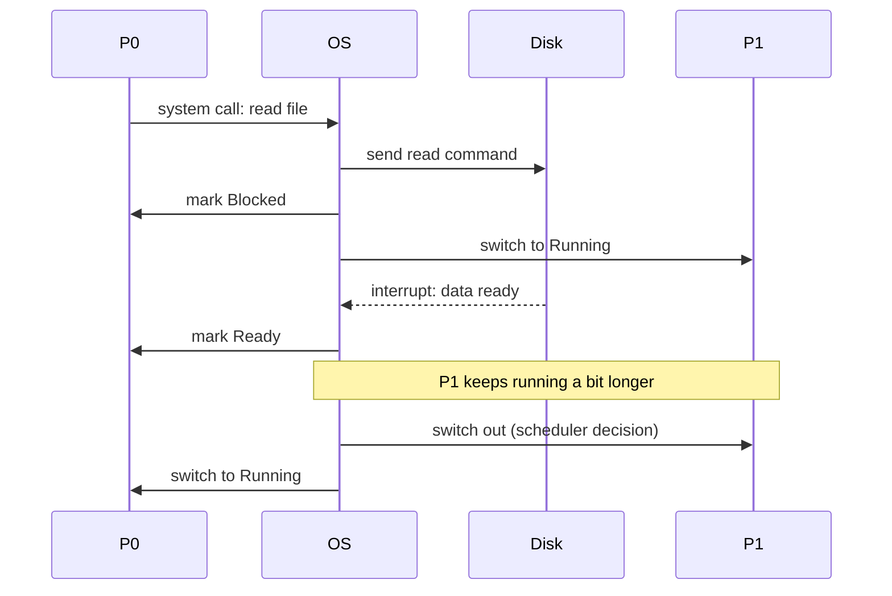

---

## 5. Process Control Block (PCB)

The **PCB** is a data structure the OS uses to store **all information about a process**. It is like a process's "ID card" and "file folder" combined, containing everything the OS needs to manage it.

In Linux, this structure is called `task_struct`. In the teaching OS called **xv6** (used in the course, based on a real textbook example), it's called `struct proc`.

### Example: xv6's `struct proc`
```c
struct proc {
  char *mem;                  // Start of process memory
  uint sz;                    // Size of process memory
  char *kstack;                // Bottom of kernel stack for this process
  enum proc_state state;      // Process state
  int pid;                     // Process ID
  struct proc *parent;         // Parent process
  void *chan;                  // If !zero, sleeping on chan
  int killed;                  // If !zero, has been killed
  struct file *ofile[NOFILE];  // Open files
  struct inode *cwd;            // Current directory
  struct context context;      // Switch here to run process
  struct trapframe *tf;         // Trap frame for the current interrupt
};
```

### What each field means (in simple terms):
- **mem / sz**: Where in memory this process lives, and how big it is.
- **kstack**: A special stack used only when the kernel (OS) is running code on behalf of this process.
- **state**: Is it Ready? Running? Blocked? etc.
- **pid**: The unique ID number.
- **parent**: A pointer to the process that created this one (its "parent" process).
- **chan**: If the process is sleeping/blocked, this tracks *what* it's waiting for.
- **killed**: A flag showing if this process has been told to terminate.
- **ofile**: An array of open files this process currently has.
- **cwd**: The current working directory (like the folder you're "in" when using a terminal).
- **context**: The saved CPU register values (explained below).
- **tf (trapframe)**: Info saved about the CPU state at the exact moment of an interrupt, so execution can resume correctly.

### The `context` structure (saved registers)
```c
struct context {
  int eip;   // instruction pointer (like PC)
  int esp;   // stack pointer
  int ebx;
  int ecx;
  int edx;
  int esi;
  int edi;
  int ebp;
};
```
This is literally the set of CPU register values that get saved when a process is paused, and restored when it runs again. This is what allows the "seamless continuation" mentioned earlier.

### The states in xv6
```c
enum proc_state { UNUSED, EMBRYO, SLEEPING, RUNNABLE, RUNNING, ZOMBIE };
```
This maps to the general states we discussed, plus two extra useful ones:
- **UNUSED**: This PCB slot isn't being used by any process right now.
- **EMBRYO**: The process is in the middle of being created (not fully set up yet).
- **SLEEPING**: Same as "Blocked".
- **RUNNABLE**: Same as "Ready".
- **RUNNING**: The process is running.
- **ZOMBIE**: A special final state.

### The ZOMBIE state
- A process becomes a **zombie** when it has **finished executing** (called `exit()`) but has **not yet been cleaned up**.
- Why keep it around at all instead of deleting it immediately? Because other processes (usually its **parent**) may want to check its **return code** — i.e., did it succeed or fail? (In UNIX convention: **0 means success**, non-zero means some kind of error.)
- The parent process eventually calls `wait()` to:
  1. Retrieve this return code.
  2. Tell the OS it's now safe to fully clean up (**reap**) the zombie's remaining data structures.

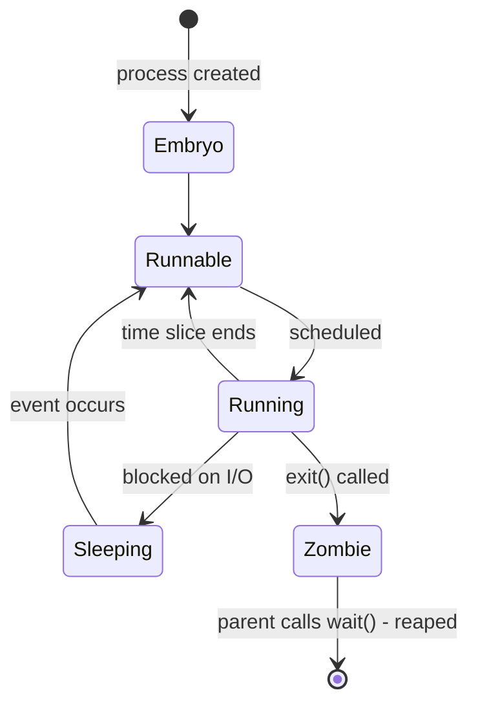

---

## 6. CPU Scheduler

The OS needs a way to decide **which process gets to run next**. This job is done by the **CPU Scheduler**.

### How it works, conceptually:
1. The OS keeps a **list of all PCBs** (every process on the system) in some data structure.
2. The scheduler looks through this list and **picks one process** to run.
3. It switches the CPU to that process (this is called a **context switch**).
4. After some time (a "time slice" or when the process blocks), the scheduler switches to another process.
5. This cycle repeats forever, giving the illusion that many processes run "at once," even on a single core.

### What data structure should hold the PCBs?
The slide poses this as a thinking question: should it be an **array**, a **linked list**, or a **heap**?
- **Array**: Fast direct access by index, but a fixed size can be limiting, and searching for "the next ready process" might mean scanning it.
- **Linked List**: Easy to add/remove processes dynamically, good for maintaining queues (like a Ready Queue).
- **Heap** (the data structure, not memory heap): Useful if the scheduler needs to always pick the "highest priority" process quickly, since heaps are efficient for that (like a priority queue).

The best choice actually depends on the **scheduling algorithm** the OS uses.

---

## 7. Modes and Privileges (Protection Rings)

Modern CPUs (like x86) support multiple **privilege levels**, often visualized as **rings**.

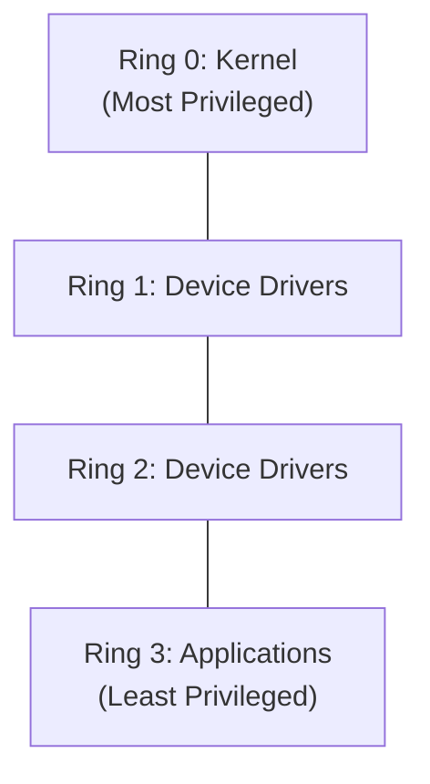

- **Ring 0** is the most privileged (used by the OS kernel). Code here can do anything: access hardware directly, manage memory, control other processes.
- **Ring 3** is the least privileged (used by regular applications/user programs). Code here is restricted — it cannot directly touch hardware or do sensitive operations.
- Rings 1 and 2 exist in theory (often for device drivers) but are rarely used in most modern operating systems (Linux and Windows mostly just use Ring 0 and Ring 3).

### How do you know what ring your process is running in?
- Your normal user program is **almost always in Ring 3**, unless it is in the middle of a system call (which temporarily elevates it to Ring 0 to let the kernel do privileged work on its behalf).
- Technically, this is determined by the **bottom 2 bits of the code segment (CS) register** in the CPU.

### Why does this matter?
This is the fundamental protection mechanism of an OS. If any user program could directly access hardware or overwrite arbitrary memory, a single buggy or malicious program could crash the whole system or read another user's private data. By restricting sensitive operations to Ring 0 (kernel-only), the OS acts as a gatekeeper.

---

## 8. API for Process Management (System Calls)

### What is an API?
**API = Application Programming Interface**. It's simply the set of functions available for a programmer to use when writing programs.

### System Calls: the OS's API
The OS itself exposes its own API in the form of **system calls**.
- A system call is a special kind of function call that jumps into **OS code**, running at a **higher privilege level** (Ring 0).
- This is necessary because sensitive operations like directly accessing hardware, managing memory allocation for other processes, or manipulating files at a low level are only allowed at this higher privilege level. A regular user-mode program (Ring 3) is not allowed to do these things directly, for the safety and security reasons discussed above.

### Blocking vs Non-blocking system calls
- **Blocking system calls**: These can cause your process to be paused (**Blocked**) and swapped out of the CPU while the OS handles a slow operation. Example: `read()` from a physical disk - since disks are slow, your process gets blocked until the data is ready.
- **Non-blocking (or quick) system calls**: These return almost immediately since they don't need to wait for anything slow. Example: `getpid()` just needs to hand back a number (this process's ID) — no waiting involved.

### The lifecycle of a system call

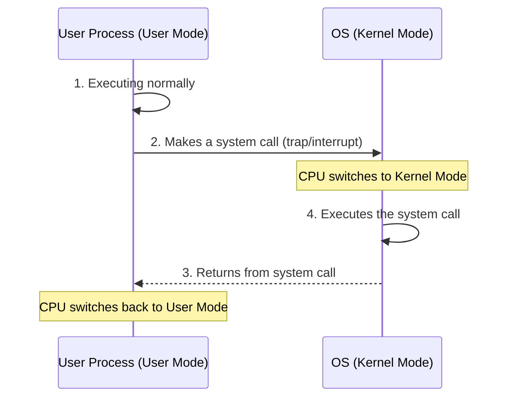

---

## 9. Portability: POSIX and ABI

### POSIX API
- **POSIX** = Portable Operating System Interface.
- It is a **standard set of system calls** (and some C library functions) that many operating systems agree to support.
- **Big benefit:** If you write your program using only POSIX-defined calls, it should run on **any POSIX-compliant OS** (Linux, macOS, BSD, etc.) without needing to be rewritten.
- **Caveat:** Even though the *source code* is portable, the program may still need to be **recompiled** for different CPU architectures (e.g., a program compiled for an ARM chip won't directly run on an x86 chip without recompilation).

### Libraries hide the details
- Programmers rarely call raw system calls directly. Instead, they use convenient library functions.
- Example: When you call `printf()` in C, it doesn't directly do the "writing to the screen" magic itself, it eventually calls the **`write()` system call** under the hood.
- This means most programmers **don't need to worry about invoking system calls manually**; the standard library (`libc`) handles that plumbing.

### ABI (Application Binary Interface)
- The **ABI** is the interface between compiled **machine code** and the underlying **hardware**.
- It defines things like: the Instruction Set Architecture (ISA), the calling convention (how functions pass arguments and return values at the binary level), and more.
- **Difference from an API:** An API is about **source code compatibility** (can my code, in text form, be compiled and run elsewhere). An ABI is about **binary compatibility** (can this already-compiled program run on this hardware/OS combination without recompiling).

---

## 10. Process Related System Calls: Overview

On Unix-like systems (Linux, macOS, etc.), there are four fundamental system calls for managing processes:

| System Call | What it does |
|---|---|
| `fork()` | Creates a new **child process** (a near-copy of the current process) |
| `exec()` | Makes a process **replace itself** with a different program |
| `exit()` | **Terminates** the current process |
| `wait()` | Makes a **parent process pause** until its child finishes (and cleans it up) |

### Where do all processes come from?
- **All processes are created by forking** from an existing parent process.
- After the machine boots up, the OS starts a special process called `init`. This is the very first process.
- `init` then forks off other processes, including a **shell** (like bash).
- Every process you ever run (when you type a command, open an app, etc.) traces its ancestry all the way back to `init`.

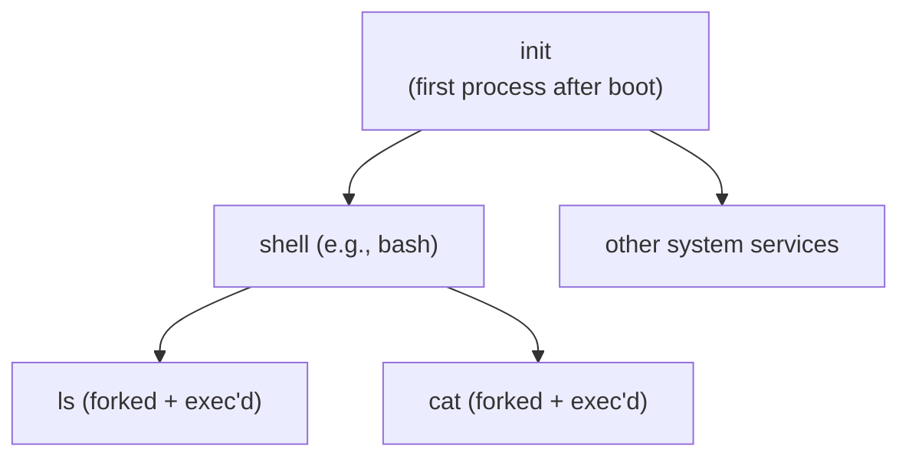

*Fun fact/side note: you can check your default shell using `echo $SHELL`, and you can always read more details using the manual pages, e.g., `man bash` — the lecture calls this "RTM" (Read The Manual), a friendly nudge to explore documentation.*

---

## 11. fork() in Detail

### What does fork() do?
When a process calls the `fork()` system call:
1. The OS creates a **brand new child process**.
2. This child gets its **own new PID**.
3. The **entire memory image of the parent is copied** into the child (code, data, heap, and stack — essentially a full duplicate at that point in time).
4. From that point on, the **parent and child run independently** — they are now two completely separate processes, just with identical starting memory content.

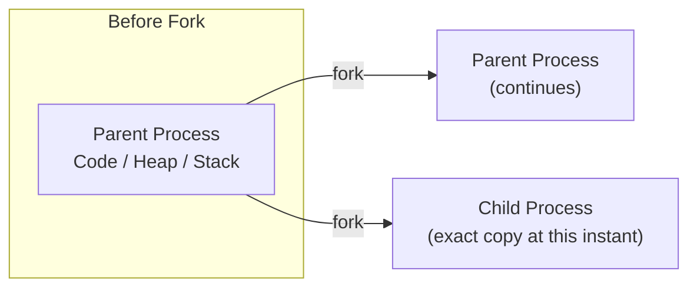

### Key point: they run different copies of the SAME code
Since the child's memory is a copy of the parent's, it also has a copy of the exact same program code, at the exact same point of execution. Both will **continue running from right after the fork() call**, just as two separate, independent processes.

---

## 12. Worked Examples of fork()

### How to tell parent from child after fork()?
This is the cleverest part of `fork()`'s design: it **returns a different value** in each process!
- In the **child process**, `fork()` returns **0**.
- In the **parent process**, `fork()` returns the **child's new PID** (a positive number).
- If fork() fails for some reason (e.g., system is out of resources), it returns a **negative number** in the parent (no child gets created).

This lets your code use a simple `if` statement to have each process do different things:

```c
int ret = fork();
if (ret == 0) {
    print "I am child";
} else if (ret > 0) {
    print "I am parent";
}
```

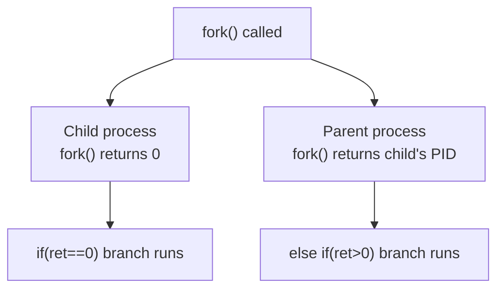

### Example 1: Basic fork()

```c
#include <stdio.h>
#include <stdlib.h>
#include <unistd.h>

int main(int argc, char *argv[]) {
    printf("hello world (pid:%d)\n", (int) getpid());

    int rc = fork();

    if (rc < 0) { // fork failed
        fprintf(stderr, "fork failed\n");
        exit(1);
    }
    else if (rc == 0) { // child (new process)
        printf("hello, I am child (pid:%d)\n", (int) getpid());
    }
    else { // parent goes down this path (main)
        printf("hello, I am the parent of %d (pid:%d)\n", rc, (int) getpid());
    }

    return 0;
}
```

**Sample outputs (can vary between runs!):**
```
prompt> ./p1
hello world (pid:29146)
hello, I am parent of 29147 (pid:29146)
hello, I am child (pid:29147)
prompt>

prompt> ./p1
hello world (pid:29146)
hello, I am child (pid:29147)
hello, I am parent of 29147 (pid:29146)
prompt>
```

**Why does the order vary?** Once `fork()` happens, the parent and child are **independent processes**, scheduled separately by the OS. There is **no guarantee** which one the scheduler runs first. This is called a **race condition** in terms of output ordering (though not necessarily a bug, just non-determinism).

### Example 2: fork() with a local variable

```c
#include <stdio.h>
#include <stdlib.h>
#include <unistd.h>

int main()
{
    pid_t pid;
    int x = 1;

    pid = fork();
    if (pid == 0)
    {
        printf("child : x=%d\n", ++x);
        exit(0);
    }

    /* Parent */
    printf("parent: x=%d\n", --x);
    exit(0);
}
```

**What happens:**
- Before `fork()`, `x = 1` in the single process.
- After `fork()`, there are **two separate copies of x**, one in the parent's memory and one in the child's memory. They are **completely independent** now.
- The **child** increments its own copy: `++x` makes it `2`. It prints `child: x=2`.
- The **parent** decrements its own copy: `--x` makes it `0`. It prints `parent: x=0`.
- Changing `x` in one process **has zero effect** on the other's copy, because their memories were split apart at the moment of `fork()`.

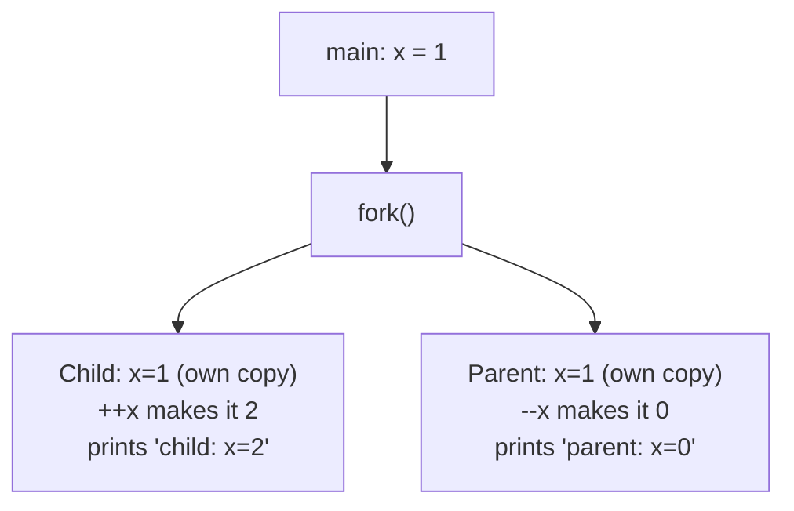

### Example 3: Multiple forks (fork() called twice)

```c
#include <stdio.h>
#include <stdlib.h>
#include <unistd.h>

int main()
{
    fork();
    fork();
    printf("hello\n");
    exit(0);
}
```

**What will be the output?** 
- Start: **1 process** (the original).
- First `fork()`: 1 process becomes **2 processes** (original + 1 child).
- Second `fork()`: **each** of those 2 processes calls fork() again, so each becomes 2. That's **2 x 2 = 4 processes total**.
- Each of these 4 processes then independently executes `printf("hello\n")`.

**Result: "hello" gets printed 4 times** (in some order, since scheduling isn't guaranteed).

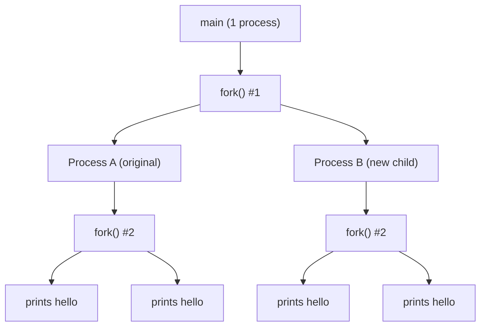

**General rule:** If you call `fork()` **n** times in a row (unconditionally, without any if-checks preventing it), you end up with **2^n processes total**, and each independently continues executing the code after the last fork, so any following `printf` runs that many times.

---

## 13. exit() and Zombie Processes

### The exit() system call
- When a process is done, it calls the **`exit()`** system call to terminate.
- This is often done **automatically** for you — in C, when `main()` finishes and returns, `exit()` is implicitly called on your behalf.
- Once a process exits, the **OS switches it out and never runs it again**. It is permanently done executing instructions.

### Why can't the exiting process clean up its own memory?
The intuitive reason is: a process **cannot free memory that it is currently using to run** — you can't have the last instruction of a program be "delete the ground I'm standing on" and expect it to finish gracefully. So, **someone else** — the OS, prompted by the parent via `wait()` — must do that final cleanup.

### The Zombie state
- After `exit()`, a process doesn't just vanish. It sits in a special **zombie** state.
- In this state, the process has stopped running, but the OS keeps a small record of it around (like its PID and exit/return code) so that **the parent can retrieve this information later**.

**How are zombies cleaned up?** This is where `wait()` comes in.

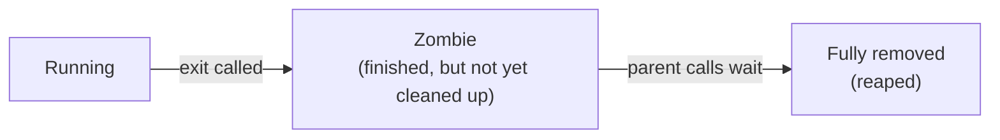

---

## 14. wait() in Detail

### What does wait() do?
The **parent** process calls `wait()` to **reap** (fully clean up) one of its **zombie children**.

Reaping does two things:
1. Retrieves the child's exit/return status.
2. Tells the OS it can now completely free up any remaining data structures related to that child.

### Behavior of wait() in different scenarios

| Scenario                                   | What wait() does                                                |
| ------------------------------------------ | --------------------------------------------------------------- |
| Child is still running                     | The parent **blocks** (pauses) until the child eventually exits |
| Child has already terminated (is a zombie) | wait() reaps it and **returns immediately**                     |
| Parent has no children at all              | wait() **returns immediately** without reaping anything         |

### Example: fork() + wait()

```c
int ret = fork()
if(ret == 0) {
  print "I am child"
  exit()
}
else if(ret > 0) {
  print "I am parent"
  wait()
}
```

Because the parent now explicitly waits, the **output order becomes deterministic**! The parent will always print its message *after* the child has printed and exited, because it is literally blocked until that happens.

### Full code example: wait()

```c
#include <stdio.h>
#include <stdlib.h>
#include <unistd.h>
#include <sys/wait.h>

int main(int argc, char *argv[])
{
    printf("hello (pid:%d)\n", (int) getpid());
    int rc = fork();
    if (rc < 0) { // fork failed; exit
        fprintf(stderr, "fork failed\n");
        exit(1);
    }
    else if (rc == 0) { // child (new process)
        printf("child (pid:%d)\n", (int) getpid());
    }
    else { // parent
        int rc_wait = wait(NULL);
        printf("parent of %d (rc_wait:%d) (pid:%d)\n",
            rc, rc_wait, (int) getpid());
    }
    return 0;
}
```

**Guaranteed output (always in this exact order now):**
```
hello (pid:542)
child (pid:543)
parent of 543 (rc_wait:543) (pid:542)
```

Notice `rc_wait` equals the child's PID (543) — this is what `wait()` returns: the PID of the child it just reaped.

### waitpid(): a more specific variant
- `wait()` reaps **any** terminated child (if you have multiple children, you don't control which one).
- `waitpid()` lets you specify **exactly which child** (by PID) you want to wait for.
- (The lecture points to reading the manual page — "RTM" — for the exact arguments.)

### Orphan processes: what if the parent exits first?
Sometimes a parent might exit while its child is **still running**. What happens to the child?
- The child **does not** get killed. It continues to run normally.
- It becomes what's called an **orphan process**.
- Orphans are automatically **"adopted" by the `init` process**. When the orphan eventually finishes, `init` will call `wait()` on its behalf to reap it, since its original parent is gone.

### A common bug: forgetting to wait()
- If a program keeps calling `fork()` to create many children, but **never calls `wait()`** on them, those children pile up as **zombies** forever (well, until the parent itself exits).
- Each zombie still consumes a small amount of system resources (like a PCB entry).
- Over a long time or with rapid forking, this can **exhaust system memory** — this is a well-known real-world programming mistake, sometimes called a "zombie process leak."

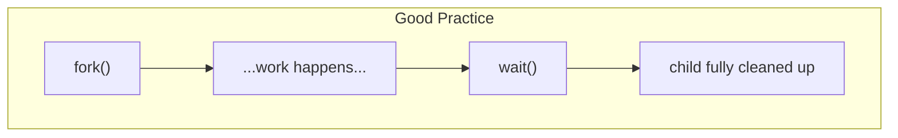
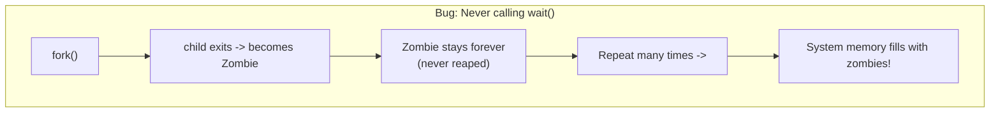
---

## 15. exec() in Detail

### The problem exec() solves
After `fork()`, the child is just a **copy** of the parent , it runs the exact same code. But often, we don't want that! For example, when you type `ls` in your shell, you don't want the shell's own code to run again, you want the **`ls` program** to run instead.

### What exec() does
- The `exec()` system call makes a process **completely replace its own memory image** with a **new program**.
- It takes the path/name of another executable as an argument.
- After a successful `exec()`, the process's code, data, heap, and stack are **all reinitialized** with the content of the new program.
- **Crucially: the process keeps the same PID.** It's still "the same process" from the OS's bookkeeping perspective, but it's now running totally different code.

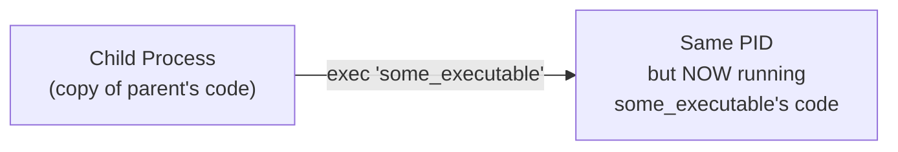

### The fork() + exec() combo pattern
This is an extremely common and powerful pattern in Unix systems:
```c
int ret = fork();
if(ret == 0) {
  exec("some_executable")
}
else if(ret > 0) {
  print "I am parent"
}
```
The parent forks a child specifically so that child can then `exec()` into a *different* program, while the parent continues running its own original code unaffected.

### The six exec() variants in Linux
`execl()`, `execlp()`, `execle()`, `execv()`, `execvp()`, `execvpe()` — these differ in small details (e.g., whether you pass arguments as a list or an array, whether it searches your `PATH` environment variable, etc). The lecture notes to "RTM" (read the manual) for specifics.

### Full example: fork() + exec()

```c
#include <stdio.h>
#include <stdlib.h>
#include <unistd.h>
#include <string.h>
#include <sys/wait.h>

int main(int argc, char *argv[])
{
    printf("hello (pid:%d)\n", (int) getpid());
    int rc = fork();
    if (rc < 0) { // fork failed; exit
        fprintf(stderr, "fork failed\n");
        exit(1);
    }
    else if (rc == 0) { // child (new process)
    {
        printf("child (pid:%d)\n", (int) getpid());
        char *myargs[3];
        myargs[0] = strdup("wc");        // program: "wc"
        myargs[1] = strdup("fork1.c");   // arg: input file
        myargs[2] = NULL;                 // mark end of array
        execvp(myargs[0], myargs);        // runs word count
        printf("this shouldn't print out");
    }
    else { //parent
        int rc_wait = wait(NULL);
        printf("parent of %d (rc_wait:%d) (pid:%d)\n",
            rc, rc_wait, (int) getpid());
    }
    return 0;
}
```

**Sample output:**
```
hello (pid:623)
child (pid:624)
 24  72 558 fork1.c
parent of 624 (rc_wait:624) (pid:623)
```

**Trace through this carefully:**
1. The original process prints `hello` and forks.
2. The **child** prints `child (pid:624)`.
3. The child sets up an argument array `myargs` to call the `wc` (word count) program on the file `fork1.c`.
4. The child calls `execvp()`. **This is the critical moment** — the child's own code is entirely replaced by the `wc` program's code. It runs `wc`, which prints the line/word/character count of `fork1.c` (that's the `24 72 558 fork1.c` line).
5. **The line `printf("this shouldn't print out")` never executes.** Why? Because once `exec()` succeeds, the process's old code (including that print statement) is **completely gone**, replaced by `wc`'s code. There is no "coming back" to the old code after a successful exec.
6. Meanwhile, the **parent** was waiting. Once the child (now running as `wc`) finishes, the parent's `wait()` returns, and it prints its final status message.

### What if exec() fails?
If `exec()` fails (e.g., the given program doesn't exist, or there's a permissions issue), it **returns an error code**, and the original process's code **continues executing normally** from right after the `exec()` call. That's why the `printf("this shouldn't print out")` line exists in that example — it's a safety net that only executes if `execvp()` somehow failed.

---

## 16. Shell and Terminal Mechanics

Now, let's connect all these system calls into how something as familiar as your terminal/shell actually works.

### The boot-to-shell chain
1. When your computer boots up, the OS creates the **`init`** process, the very first process.
2. `init` forks off a **shell** process (like `bash`).
3. From then on, every command you type creates new processes, all descending (via fork) from that shell (or from `init` itself for background system services).

### The shell's main loop (conceptually)
```
do forever {
    input(command)              // read what user typed

    int ret = fork()

    if(ret == 0) {
        exec(command)            // child runs the actual command
    }
    else {
        wait()                    // parent (shell) waits for child to finish
    }
}
```

This is essentially an infinite loop: read a command, fork a child to run it, wait for it to complete, then loop back to read the next command.

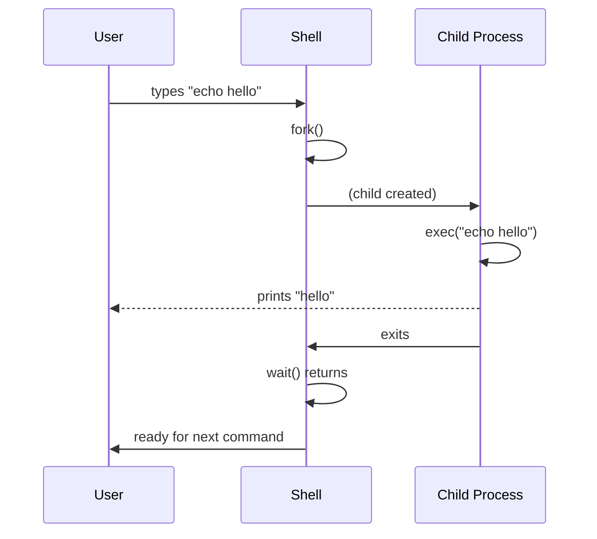

### Where do commands like ls, echo, cat come from?
- Many common commands (`ls`, `cat`, etc.) are **actual standalone executable programs** written by OS developers, sitting somewhere on disk (like `/bin/ls`).
- When you type `ls`, the shell simply **forks a child and execs `/bin/ls`** in it.
- However, **some commands are built directly into the shell's own code** (called "shell built-ins"). These do not spawn a separate process at all.

### Thinking question: why does the shell fork before exec, instead of just exec-ing directly?
If the shell called `exec()` directly (without forking first), the shell **itself** would be replaced by the command's program! The shell's own code would be gone, and you'd have no shell left to type your next command into. By **forking first**, the shell creates a disposable copy of itself to sacrifice to `exec()`, while the **original shell process survives untouched** and can continue accepting more commands.

### Why is "cd" special?
The `cd` (change directory) command is a perfect example of a **shell built-in**, and there's a very logical reason why:
- `cd` uses the `chdir()` system call to change the **current working directory** of a process.
- Every process has its **own** notion of "current working directory."
- If the shell forked a child to run `cd`, the `chdir()` call would only change the **child's** working directory and then the child would exit immediately, and that change would be **completely lost**. The shell itself (the one you keep typing into) would remain in the old directory.
- So, to make `cd` actually useful, the shell must run `chdir()` **on itself directly**, without forking. This is exactly why `cd` is implemented as a built-in, not an external executable.

---

## 17. Foreground and Background Execution

### Foreground execution (the default)
By default, when you run a command, it runs in the **foreground**:
- The shell **forks, execs, and then waits**.
- Because the shell is blocked inside `wait()`, it **cannot accept your next command** until the current one finishes.

### Background execution (using `&`)
If you type a command followed by an ampersand, like:
```
$ sleep 10 &
$
```
- The shell still **forks** a child to run the command.
- But this time, it does **not wait** for it to finish. It immediately returns the prompt to you, letting you type the next command right away, even while `sleep 10` is still running in the background.

### How are background processes eventually reaped?
- **When** does the shell go back and clean up (reap) these background children? Periodically checking? Or perhaps when you type your next command, the shell "checks in" on old background jobs first?
- **How** can `wait()` be told to not block, even if the child hasn't finished yet? The answer is that there's a **non-blocking version of the wait mechanism** you can use (typically via special flags, like `WNOHANG` with `waitpid()`), so the parent can just "peek" and see if any child has finished, without getting stuck waiting.

### Running multiple commands
The shell also supports:
- **Serial execution**: One command runs after another finishes (e.g., using `;` between commands in bash: `cmd1 ; cmd2`).
- **Parallel execution**: Multiple commands all start at the same time (e.g., using `&` on multiple commands, or other shell syntax).

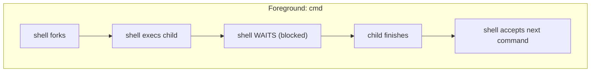

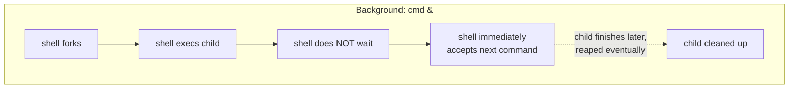

---

## 18. I/O Redirection

### The default I/O channels
Every process automatically has three I/O channels open by default, accessed through **file descriptors** (small integer numbers):

| File Descriptor | Name | Default destination |
|---|---|---|
| 0 | STDIN | Keyboard |
| 1 | STDOUT | Screen |
| 2 | STDERR | Screen |

### What is redirection?
Redirection means changing where one of these channels points, **instead of** its default. For example:
```
ls > test.txt
cat test.txt
```
Here, `ls > test.txt` means: "run `ls`, but instead of printing its output to the screen, write it into the file `test.txt`."

### How does redirection actually work under the hood?
This is a clever trick performed by the **shell**, before it calls `exec()` on the child:
1. The shell **forks** a child.
2. In the **child**, before calling `exec`, the shell:
   - **Closes** the default STDOUT (file descriptor 1).
   - **Opens** the target file (e.g., `test.txt`) — and because file descriptor 1 was just freed up, the OS assigns this newly opened file **the same number (1)** (The rule is: `open()` always grabs the lowest available/free file descriptor number.).
3. Now, when `exec()` runs the actual command (e.g., `ls`), that program has **no idea** anything special happened. It just writes to "file descriptor 1" like always — except now file descriptor 1 secretly points to `test.txt` instead of the screen!

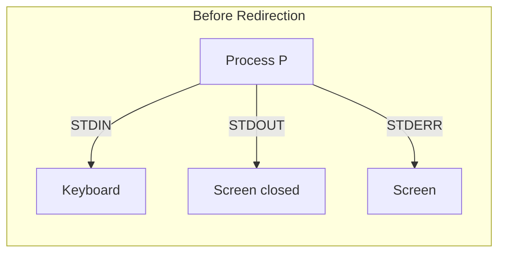

```mermaid
flowchart LR
    subgraph "After Redirection"
        PB["Process P"] -->|STDIN| KB2["Keyboard"]
        PB -->|"STDOUT (fd 1, reassigned)"| FILE["test.txt"]
        PB -->|STDERR| SCR3["Screen"]
    end
```

### Full code example: output redirection

```c
int main(int argc, char *argv[])
{
    printf("hello (pid:%d)\n", (int) getpid());
    int rc = fork();
    if (rc == 0) // child: redirect standard output to a file
    {
        printf("child (pid:%d)\n", (int) getpid());
        close(STDOUT_FILENO);
        open("./redir_output.txt", O_CREAT|O_WRONLY|O_TRUNC, S_IRWXU);

        char *myargs[3];
        myargs[0] = strdup("wc");        // program: "wc"
        myargs[1] = strdup("fork1.c");   // arg: input file
        myargs[2] = NULL;                 // mark end of array
        execvp(myargs[0], myargs);        // runs word count
    }
    else //parent
    {
        int rc_wait = wait(NULL);
        printf("parent of %d (rc_wait:%d) (pid:%d)\n",
            rc, rc_wait, (int) getpid());
    }
    return 0;
}
```

**Output when run:**
```
$ ./a.out
hello (pid:745)
child (pid:746)
parent of 746 (rc_wait:746) (pid:745)

$ cat redir_output.txt
 24 72 558 fork1.c
```

Notice how the word-count output (`24 72 558 fork1.c`) does **not** appear on the terminal at all — it silently went into `redir_output.txt` instead, because of the `close()` + `open()` trick performed right before `execvp()`.

### An alternative approach: dup()
The slide mentions that instead of `close()` then `open()`, you can also use the **`dup()`** system call (a more direct way of duplicating file descriptors), which is covered in more depth when studying file systems later in the course.

---

## 19. Pipes

### What is a pipe?
A **pipe** is a communication mechanism, provided by the kernel, that connects the **STDOUT of one process** directly to the **STDIN of another process**.

### The classic example
```
$ cat foo.c | grep factorial
```
This command means: "Run `cat foo.c` (which prints the contents of foo.c), but instead of sending that output to the screen, feed it directly as input into `grep factorial` (which will filter and only show lines containing the word 'factorial')."

### How it works
```mermaid
flowchart LR
    subgraph "User Level"
        CATP["cat process<br/>... write to stdout (printf) ..."]
        GREPP["grep process<br/>... read from stdin (scanf) ..."]
    end
    subgraph "Kernel Level (OS)"
        PIPE["pipe<br/>(kernel buffer)"]
    end
    CATP -->|writes to stdout, redirected| PIPE
    PIPE -->|feeds into stdin, redirected| GREPP
```

- The `cat` process doesn't know anything special is going on — it just writes to its STDOUT as usual.
- The `grep` process doesn't know anything special either — it just reads from its STDIN as usual.
- The **kernel** sits between them, holding a small buffer (the "pipe") that connects one program's output stream directly to another's input stream.
- This is conceptually very similar to the redirection trick from Section 18, except instead of redirecting to/from a **file**, both ends are redirected to/from this special in-kernel **pipe** object.

**Analogy:** Think of a pipe like a physical pipe connecting two water tanks. Whatever `cat` "pours out" (its output) flows directly into what `grep` "drinks in" (its input), without ever touching the ground (the screen) in between.

---

## 20. Signals and Process Control

### What are signals?
**Signals** are a way for the OS (or other processes, or the user) to send a short, asynchronous notification to a running process, essentially interrupting it to say "something happened, deal with it."

### Common signals and how they're triggered

| Trigger | Signal Sent | Typical Effect |
|---|---|---|
| `kill()` system call | `SIGKILL` | Forcefully terminates a misbehaving process |
| Ctrl+C | `SIGINT` (interrupt) | Normally terminates the process |
| Ctrl+Z | `SIGTSTP` (stop) | Pauses the process mid-execution (can be resumed later, e.g., with the `fg` command) |

### Catching signals: signal() and sigaction()
- A process isn't forced to just accept the default behavior of a signal (like being killed). It can use the **`signal()`** or **`sigaction()`** system calls to **register a custom handler function**.
- When a registered signal arrives, the process will:
  1. **Suspend** its normal execution, right in the middle of whatever it was doing.
  2. **Run the custom signal handler code** instead.
  3. Once the handler finishes, **resume** the original program exactly where it left off.

### The step-by-step flow of signal handling

```mermaid
sequenceDiagram
    participant Kernel
    participant Program as Main Program
    participant Handler as Signal Handler

    Kernel->>Program: 1. Delivery of signal (during instruction m)
    Program->>Handler: 2. Kernel calls signal handler on behalf of process
    Handler->>Handler: 3. Code of signal handler executes
    Handler-->>Program: 4. Program resumes at point of interruption (instruction m+1)
```

This matches the classic diagram: the signal arrives mid-instruction-stream, the kernel diverts execution into the handler, the handler runs its logic and returns, and then the main program picks right back up where it was interrupted.

### SIGTERM vs SIGKILL: a fun but important distinction
The slide includes a meme contrasting two ways to stop a process:
- **SIGTERM**: A "polite" request. It sends a signal and then **waits for the process to gracefully stop** — meaning the process has a chance to run its own signal handler to clean things up nicely (e.g., save unsaved data, close files properly) before actually exiting.
- **SIGKILL**: The "forceful" option. This signal **cannot be caught, blocked, or ignored** by the process — the OS immediately terminates it, no cleanup, no questions asked. It's the "nuclear option" for a process that is completely unresponsive or misbehaving.

| Signal | Can be caught/handled? | Behavior |
|---|---|---|
| SIGTERM | Yes | Gives the process a chance to clean up before exiting |
| SIGINT (Ctrl+C) | Yes | Similar to above, typically terminates |
| SIGTSTP (Ctrl+Z) | Yes | Pauses execution, resumable |
| SIGKILL | **No** | Immediate, forced termination, no exceptions |

---

## 21. Quick Revision Summary

Use this section as a fast recap before an exam or quiz.

- A **process** = a running instance of a program. The OS gives it a **PID**, memory (code/data/heap/stack), a saved **execution context** (CPU registers), and tracks its open I/O resources.
- **Process states**: Ready (waiting for CPU) -> Running (on CPU) -> Blocked (waiting on I/O/event) -> back to Ready -> eventually Exited/Zombie.
- The **PCB** (Process Control Block; `task_struct` in Linux) is the OS's data structure holding everything about a process.
- The **CPU scheduler** picks which Ready process runs on which CPU core.
- CPUs have **privilege rings**: Ring 0 (kernel, most privileged) vs Ring 3 (user apps, least privileged). System calls temporarily elevate execution to Ring 0.
- **System calls** are the OS's API. They can be **blocking** (e.g., `read()`) or **non-blocking** (e.g., `getpid()`).
- **POSIX** standardizes system calls across OSes for source-code portability. The **ABI** governs binary-level compatibility with hardware.
- **fork()**: creates a child process that is a full copy of the parent's memory at that instant. Returns `0` in the child, the child's PID in the parent, negative on failure. Calling fork() n times unconditionally yields 2^n total processes.
- **exit()**: terminates a process; it becomes a **zombie** until reaped.
- **wait()**: called by a parent to **reap** a zombie child (retrieve its exit status and free its resources); blocks if the child is still running; returns immediately if the child is already a zombie or if there are no children at all. `waitpid()` targets a specific child.
- **Orphans**: children whose parent exited before them; adopted and eventually reaped by `init`.
- **exec()**: replaces a process's entire memory image (code/data/heap/stack) with a new program, keeping the same PID. Code after a successful `exec()` never runs.
- The classic Unix pattern is **fork() + exec() + wait()**, which is exactly how a shell runs your typed commands.
- **`cd` is a shell built-in** (not a separate exec'd program) because `chdir()` must run directly on the shell process itself, or the directory change would be lost when a forked child exits.
- **Foreground vs background (`&`)**: foreground means the shell waits before accepting the next command; background means it doesn't wait, and reaps the child later (potentially via a non-blocking wait).
- **I/O redirection** (`>`) works by closing a default file descriptor (like STDOUT) and opening a file in its place, which grabs that same low descriptor number.
- **Pipes** (`|`) connect one process's STDOUT to another process's STDIN via a kernel-managed buffer.
- **Signals** (SIGKILL, SIGINT, SIGTSTP, SIGTERM, etc.) let the OS/user/processes interrupt a running process. Most can be caught and handled via `signal()`/`sigaction()`, except **SIGKILL**, which is always forceful and immediate.
