## 1. Recap: What is a Process

Think of a process as a "running program with baggage." The baggage has three parts:

- **Memory image**: the compiled code plus data, sitting in RAM. This includes stuff fixed at compile time (the instructions, global variables) and stuff that grows at run time (heap, stack).
- **CPU context**: the values sitting in CPU registers *right now* if the process is actually running, or saved away in the Process Control Block (PCB) if it is not currently running.
- **I/O connections**: open files, sockets, pipes, etc.

Processes are created by `fork` from a parent process. Periodically, the OS **scheduler** loops over all `ready` processes, picks one, saves the old process's context, and restores the new process's context. This act is called a **context switch**.

Once a process is switched in, the CPU runs the user's code directly in user mode, and the OS is "out of the picture" until something brings it back in.

---

## 2. User Mode vs Kernel Mode

Modern CPUs support (at least) two privilege levels:

- **User mode**: low privilege. Ordinary application code runs here. It cannot touch hardware directly, cannot access arbitrary memory, cannot execute privileged instructions.
- **Kernel mode**: high privilege. The OS runs here. It can do anything: touch hardware, manage memory, schedule processes.

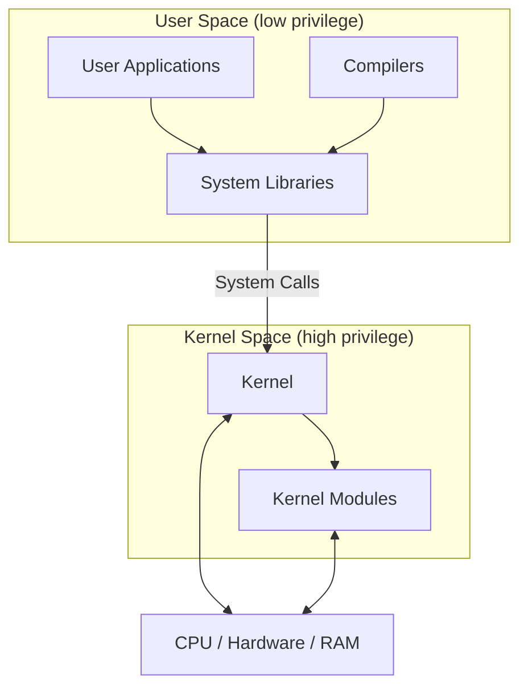

The CPU switches from user mode to kernel mode when one of three things happens -
1. A process makes a **system call** (asks the OS for a service).
2. An external device raises an **interrupt** (needs attention).
3. A **fault** happens during program execution (something went wrong).

All three of these events are collectively called **traps**: the CPU "traps" into OS code.

**Important subtlety**: the OS is *not* a separate process sitting alongside your processes. When process P makes a system call, P itself switches into kernel mode and runs OS code "as itself." It is still process P that is in the `RUNNING` state, just now executing privileged instructions on P's own kernel stack. Later, P drops back to user mode. The OS has no independent existence outside of running inside the kernel-mode context of whichever process invoked it (with some extra machinery for a dedicated per-CPU scheduler thread, which we get to later).

---

## 3. Three Ways to Enter Kernel Mode

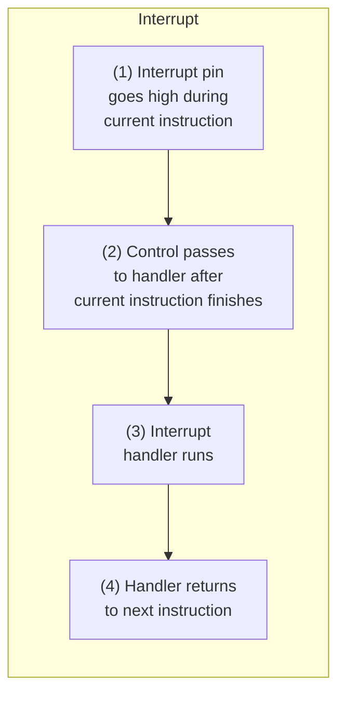

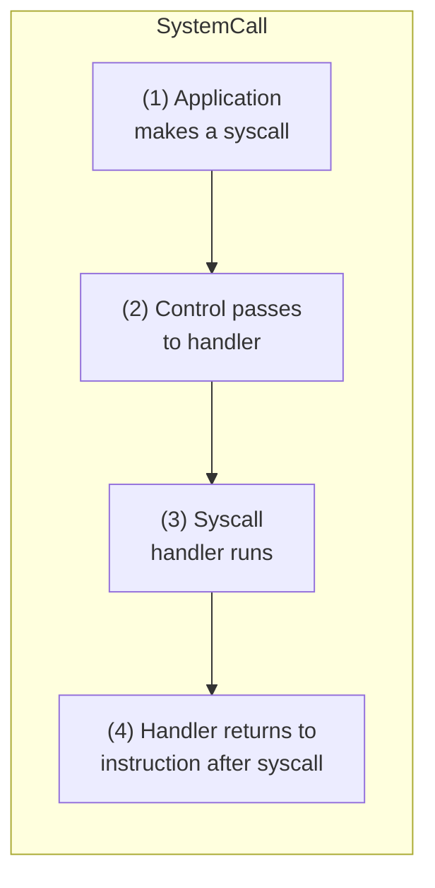

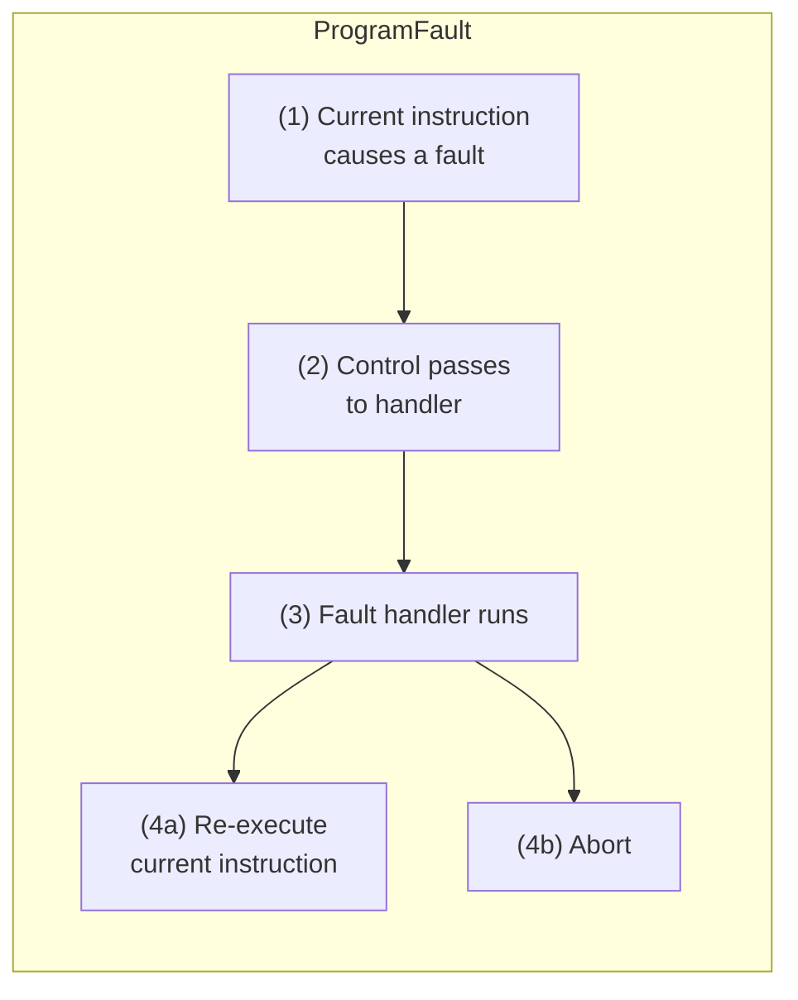

**Key difference between the three:**

| Type          | Trigger                                                                                        | Where control returns                                                                           |
| ------------- | ---------------------------------------------------------------------------------------------- | ----------------------------------------------------------------------------------------------- |
| Interrupt     | External device (timer, keyboard, disk) raises a signal, asynchronous to what the CPU is doing | Next instruction, after current one finishes                                                    |
| System call   | Process deliberately executes a special "trap" instruction to request an OS service            | Instruction right after the syscall                                                             |
| Program fault | Current instruction itself causes an error (divide by zero, invalid memory access)             | Either re-executes the faulting instruction (if fixable, e.g. page fault) or aborts the process |

---

## 4. Function Call vs System Call

To understand why system calls need special hardware support, first look at an ordinary **function call**, which needs no special privilege.

### What happens on a normal function call

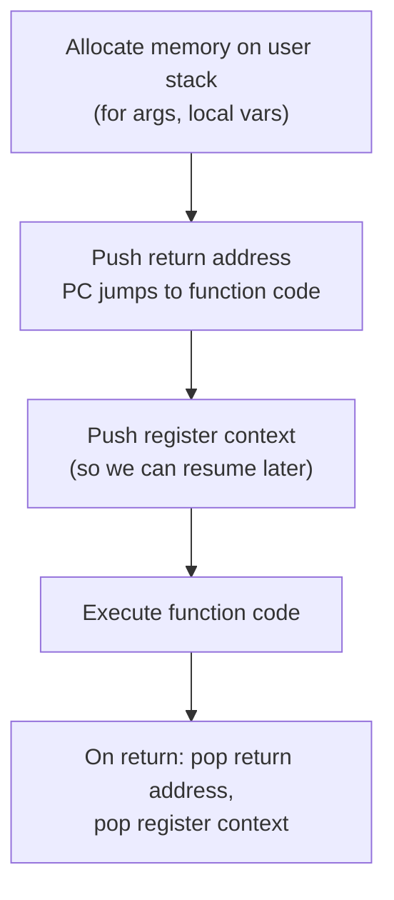

Everything above happens with normal, unprivileged instructions (like x86's `call` and `ret`), and everything is stored on the **user stack**.

### Why can't a system call work the same way?

Two problems arise:

**Problem 1: Changing the PC (Program Counter).**
- In a function call, the address of the function is known at compile/link time, sitting right there in the executable. The CPU can just jump to it with a normal `call` instruction.
- For a system call, we **cannot trust the user** to jump to the correct OS code. What if malicious (or buggy) code jumps into the middle of some sensitive kernel routine, or straight to a privileged instruction, skipping all the security checks?

**Problem 2: Where to save the register context.**
- In a function call, the context is saved and restored using the **user stack**.
- For a system call, the OS does **not want to use the user stack**. What if the user set up bogus/malicious values on their own stack to trick the kernel into misbehaving when it later reads that data?

**The solution to both problems**: a special hardware **trap instruction**, plus two OS-controlled data structures: the **Trap Table (IDT)** and a **separate kernel stack per process**.

---

## 5. Kernel Stack and the Trap Table (IDT)

### Kernel Stack
- Every process has its **own separate kernel stack**, used only when that process is executing in kernel mode.
- It lives in OS memory (as part of the process's PCB) and is **not accessible from user mode**.
- Register context gets pushed onto this kernel stack when entering the kernel, and popped off when returning to user mode.

### Trap Table (Interrupt Descriptor Table, IDT)
- A data structure containing the **addresses of kernel code** to jump to for each type of trap/event.
- Set up once by the OS during boot up.
- Not accessible or modifiable from user mode.
- The CPU consults the IDT to find where to jump, instead of trusting a user-supplied address.

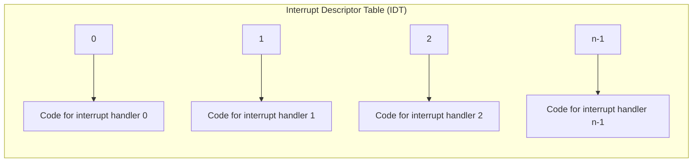

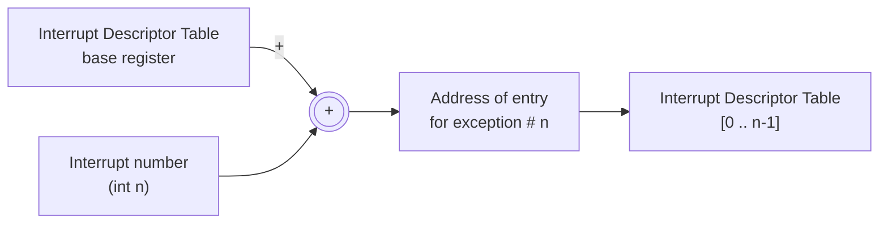

**Together**, the kernel stack (secure place to run) and the IDT (secure way to find OS code) give us a trustworthy way for user code to hand control to the OS.

---

## 6. The PCB in xv6: `struct proc`

xv6 is a small teaching OS (used at MIT and elsewhere) whose PCB is called `struct proc`. Key fields relevant to this lecture:

```c
struct proc {
  uint sz;                    // Size of process memory (bytes)
  pde_t* pgdir;                // Page table -> memory image of the process
  char *kstack;                 // Bottom of kernel stack for this process
  enum procstate state;         // Process state
  int pid;                      // Process ID
  struct proc *parent;          // Parent process
  struct trapframe *tf;         // Trap frame for current syscall
  struct context *context;      // swtch() here to run process
  void *chan;                   // If non-zero, sleeping on chan
  int killed;                   // If non-zero, have been killed
  struct file *ofile[NOFILE];   // Open files
  struct inode *cwd;             // Current directory
  char name[16];                 // Process name (debugging)
};
```

Two fields matter most for this lecture:

- **`pgdir`**: the page table, i.e. the memory image of the process (we'll cover page tables in a later lecture on memory management).
- **`kstack`**: pointer to the bottom of this process's private kernel stack, used to store CPU context whenever the process jumps from user mode to kernel mode.

The CPU context format itself, `struct context`, is a small structure of saved registers:

```c
struct context {
  uint edi;
  uint esi;
  uint ebx;
  uint ebp;
  uint eip;
};
```

And process states:

```c
enum procstate { UNUSED, EMBRYO, SLEEPING, RUNNABLE, RUNNING, ZOMBIE };
```

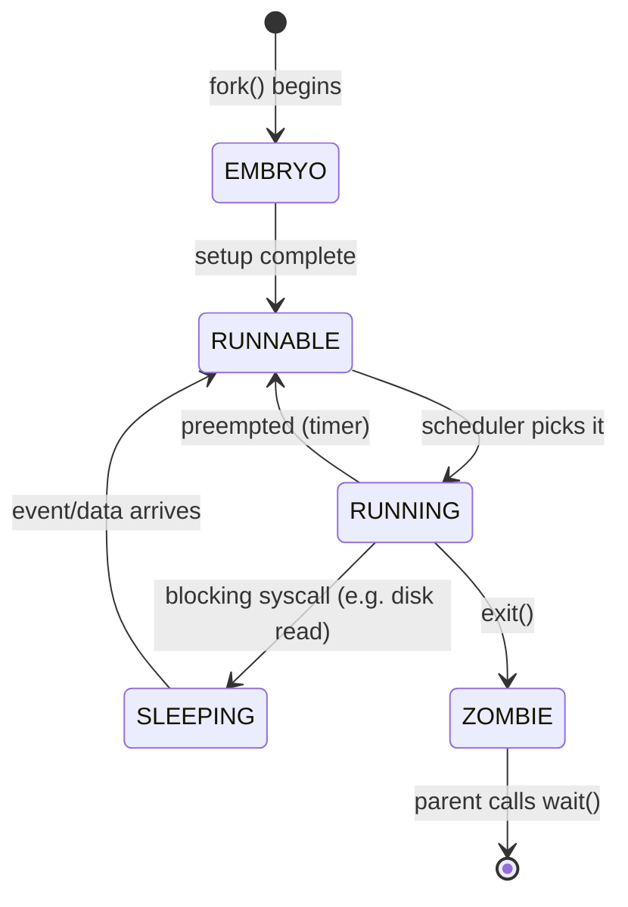

---

## 7. The Hardware Trap Instruction, Step by Step

When user code wants to make a system call, it executes a special **trap instruction** (in x86, this is `int n`, "interrupt number n") with an argument that tells the CPU *which kind* of trap this is.

- Example in xv6: `int T_SYSCALL` (a fixed constant), meaning "this is a system call trap."
- The value `n` is used as an **index into the IDT array** to decide which OS handler function to jump to.

### What the CPU automatically does when it executes the trap instruction

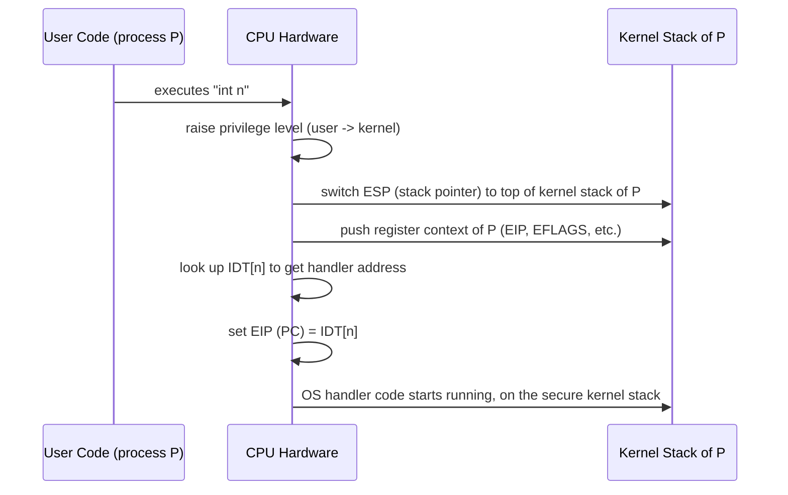

This all happens **atomically as part of executing the trap instruction** — the user program cannot interrupt or observe this transition halfway through, and it cannot control where execution jumps to (that is fully determined by the IDT, set up by the OS).

### Visual: registers before and after

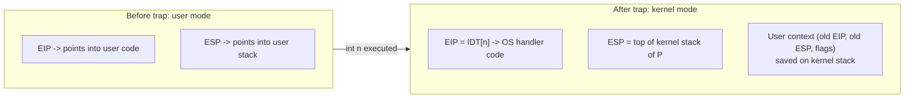

**Who actually calls the trap instruction?**

1. **System call library code**: e.g. `printf()` internally calls `write()`, which is a thin wrapper that loads a syscall number into a register and executes `int n`.
2. **Hardware devices**: an external device (keyboard, disk, timer) raises a physical interrupt signal. This causes the CPU to *itself* execute the equivalent of `int n`, using the device's assigned interrupt number.
3. Program faults (like a segfault) are also converted into a trap by the CPU automatically.

In every case, the mechanism is the same: **save context on kernel stack, look up address in IDT, jump into OS code**.

---

## 8. Walking Through xv6 Code: From `int` to `trap()`

Let's trace exactly what real xv6 code does, step by step, matching every concept above to actual source.

### Step 1: User library invokes the trap instruction (`usys.S`)

```asm
#define SYSCALL(name) \
  .globl name;         \
  name:                 \
    movl $SYS_##name, %eax;  \
    int $T_SYSCALL;           \
    ret

SYSCALL(fork)
SYSCALL(exit)
SYSCALL(write)
...
```

- Moves the **system call number** (e.g. `SYS_fork = 1`) into register `eax`.
- Executes `int $T_SYSCALL`, the trap instruction, with `T_SYSCALL = 64` telling the CPU "this is a syscall trap; look up entry 64 in the IDT."

### Step 2: CPU looks up IDT[64], jumps to `alltraps` (`trapasm.S`)

```asm
.globl alltraps
alltraps:
  # Build trap frame.
  pushl %ds
  pushl %es
  pushl %fs
  pushl %gs
  pushal              # pushes all general purpose registers

  # Set up kernel data segments
  movw $(SEG_KDATA<<3), %ax
  movw %ax, %ds
  movw %ax, %es

  # Call trap(tf), where tf = %esp
  pushl %esp
  call trap
  addl $4, %esp
```

- The CPU hardware itself already pushed some values automatically (old `ss`, `esp`, `eflags`, `cs`, `eip`, and possibly an error code) as part of executing `int`.
- `alltraps` then manually pushes the *rest* of the registers (`ds`, `es`, `fs`, `gs`, and all general-purpose registers via `pushal`).
- Together, all these pushed values form a `struct trapframe`, sitting right there on the kernel stack.
- It then calls the C function `trap()`, passing a pointer to this trapframe.

### The `trapframe` structure

```c
struct trapframe {
  // pushed by pusha
  uint edi, esi, ebp, oesp, ebx, edx, ecx, eax;
  // rest pushed manually
  ushort gs, padding1;
  ushort fs, padding2;
  ushort es, padding3;
  ushort ds, padding4;
  uint trapno;          // which trap number (from IDT)
  // pushed automatically by CPU hardware
  uint err;
  uint eip;
  ushort cs, padding5;
  uint eflags;
  // only present when crossing privilege rings (user -> kernel)
  uint esp;
  ushort ss, padding6;
};
```

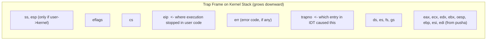

### Step 3: `trap()` dispatches based on `trapno` (`trap.c`)

```c
void
trap(struct trapframe *tf)
{
  if(tf->trapno == T_SYSCALL){
    if(myproc()->killed)
      exit();
    myproc()->tf = tf;
    syscall();
    if(myproc()->killed)
      exit();
    return;
  }

  switch(tf->trapno){
  case T_IRQ0 + IRQ_TIMER:
    // handle timer interrupt
    ...
    break;
  case T_IRQ0 + IRQ_IDE:
    // handle disk interrupt
    ...
  }
}
```

- If the trap was a system call, it stashes the trapframe pointer in the process's PCB (`myproc()->tf = tf`) and calls `syscall()`.
- Otherwise it's a hardware interrupt or fault, handled via a `switch` on the trap number.

### Step 4: `syscall()` picks the right function (`syscall.c`)

```c
void
syscall(void)
{
  int num;
  struct proc *curproc = myproc();

  num = curproc->tf->eax;    // syscall number, put there in usys.S
  if(num > 0 && num < NELEM(syscalls) && syscalls[num]) {
    curproc->tf->eax = syscalls[num]();   // call it, store return value
  } else {
    cprintf("%d %s: unknown sys call %d\n",
            curproc->pid, curproc->name, num);
    curproc->tf->eax = -1;
  }
}
```

- Reads the syscall number back out of the saved trapframe's `eax` field (remember: `usys.S` put it there before trapping).
- Looks it up in a function pointer table `syscalls[]`.
- Calls the actual kernel implementation (e.g. `sys_fork()`), and stores its return value back into `tf->eax`, so that when we return to user mode, the return value shows up in the user's `eax` register, exactly where a normal function call's return value would go.

### Putting it all together

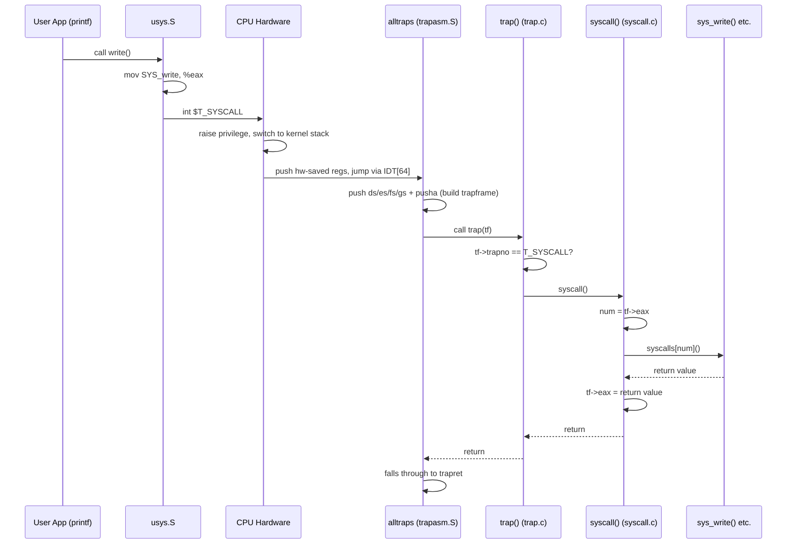

---

## 9. Return from Trap

Once the OS is done handling a syscall/interrupt, it needs to hand control back. This is done via a special **return-from-trap** instruction (`iret` on x86), which does the *exact opposite* of the trap instruction.

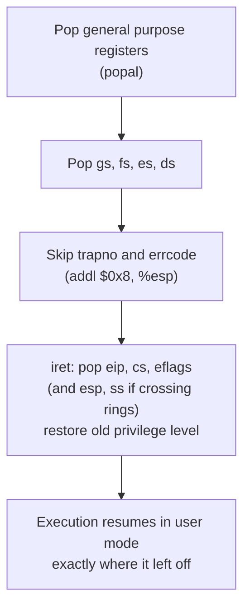

xv6's version of this, in `trapasm.S`:

```asm
# Return falls through to trapret...
.globl trapret
trapret:
  popal
  popl %gs
  popl %fs
  popl %es
  popl %ds
  addl $0x8, %esp   # skip trapno and errcode
  iret
```

**Key insight**: `iret` is the mirror image of `int`. `int` pushed things and raised privilege; `iret` pops those same things back and lowers privilege. Because of this symmetry, the user process is **completely unaware** that it was ever suspended. It resumes at the exact instruction after where it trapped, with all registers restored, as though nothing happened.

**Important twist**: does control *always* return to the same process that trapped in? **No.** Before actually executing `iret`, the OS checks whether it should switch to a *different* process instead. This is the bridge into scheduling and context switching.

---

## 10. Why Switch Between Processes

There are two broad categories of reasons the OS may not want to return to the process that just trapped in:

### Category A: It literally cannot return to the same process
- The process has **exited** or must be **terminated** (e.g. it caused a fatal error like a segfault).
- The process made a **blocking system call** (e.g. requested a disk read; the data will take time to arrive, so there's nothing useful for this process to do right now).

### Category B: It could return, but chooses not to
- The process has **run for too long** and it's someone else's turn (fairness).
- The system needs to **timeshare** the CPU among many ready processes.

In either case, the OS performs a **context switch**: it switches from running in the kernel mode of one process to running in the kernel mode of a different process. The decision of *which* process to run next is made by the **OS scheduler**.

---

## 11. The OS Scheduler

The OS keeps a list of every active process's PCB in some data structure (in xv6, a simple fixed-size array called the process table, `ptable`).

- Processes get **added** to this list when `fork()` creates them.
- Processes get **removed** after being cleaned up in `wait()`.

**Basic outline of the scheduler's job**, run in a loop, forever:

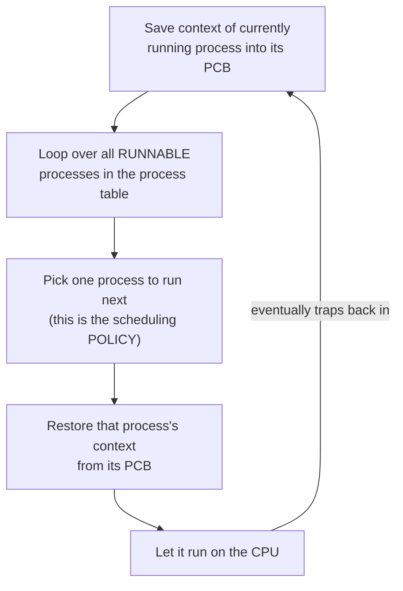

Scheduling actually involves **two separable concerns**:

| Concern | Question it answers | Covered |
|---|---|---|
| **Policy** | *Which* process should run next? (fairness, priority, etc.) | Next lecture |
| **Mechanism** | *How* do we actually switch the CPU over to that process? | This lecture |

This lecture is entirely about the **mechanism**.

---

## 12. Preemptive vs Non-Preemptive Scheduling

- **Non-preemptive (cooperative) scheduling**: "polite." The scheduler only switches away from a process when that process *voluntarily* gives up the CPU, i.e. it blocks (waiting on I/O) or terminates. A process that never blocks and never exits could hog the CPU forever.

- **Preemptive (non-cooperative) scheduling**: the scheduler can switch away from a process even if that process is perfectly happy to keep running.
    - The CPU generates a **periodic timer interrupt** (a hardware clock ticking, say, every few milliseconds).
    - Because a timer interrupt is a trap just like any other, it forces a jump into the kernel automatically, whether the current process likes it or not.
    - After servicing this timer interrupt, the OS checks: has the current process run for too long (used up its time slice)? If so, it triggers a switch to another process before returning.

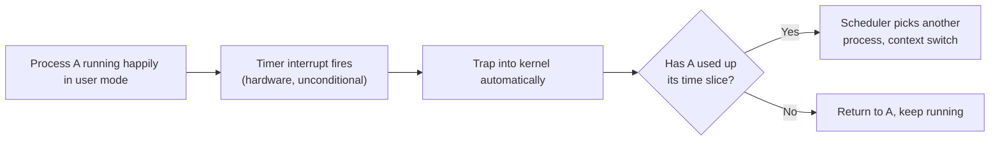

This is precisely *why* the timer interrupt exists as a hardware mechanism: it guarantees the OS regains control periodically, no matter what user code is doing, which is what makes preemptive multitasking possible.

---

## 13. Context Switch, Step by Step

Let's carefully walk through a full context switch from process **A** to process **B**.

### Step 1: A is currently in kernel mode
Process A trapped into the kernel earlier (say, via a blocking syscall). Its kernel stack already contains its saved **user context** (from the trap), and `ESP` currently points to the top of A's kernel stack.

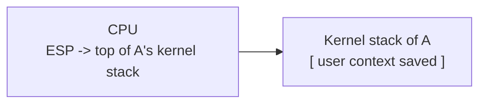

### Step 2: A cannot continue (e.g. it initiated a disk read)
The OS scheduler decides to run process B instead.

### Step 3: OS saves A's kernel context onto A's kernel stack
This is a *second, separate* save, on top of the user context that's already there. Why save context again?

- The **user context** captures "where user-mode execution stopped" (needed to resume A's user code later).
- The **kernel context** captures "where kernel-mode execution stopped" (needed to resume A's *kernel-mode* code — e.g., partway through the syscall handler — the next time A is scheduled).

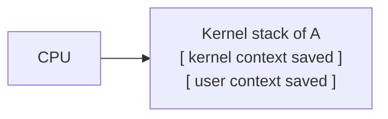

### Step 4: The actual switch moment: ESP moves to B's kernel stack
This single act, moving the stack pointer register, *is* the context switch. Everything before it was "getting ready," everything after is "living inside B now."

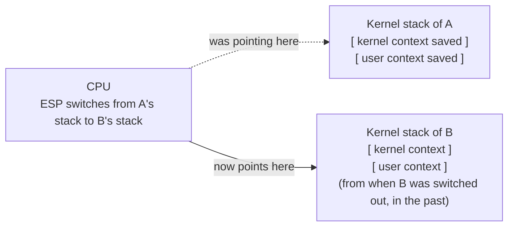

**What's already sitting on B's kernel stack?** Whatever the OS put there the *last* time B was switched out. This is the beautiful symmetry of the mechanism: every process's kernel stack always holds exactly what's needed to resume that process later, because the same save/restore code is used every time.

### Step 5: OS restores B's kernel context, resumes kernel-mode execution of B
Execution resumes exactly where B's kernel-mode code left off the last time it was switched away (e.g., partway through the scheduler function itself, or partway through a syscall).

### Step 6: OS pops B's user context, executes return-from-trap
This resumes B's *user-mode* execution, exactly where B trapped into the kernel, using the same `trapret`/`iret` mechanism from Section 9.

### Step 7: Context switch complete
B is now running in user mode. Neither A nor B are aware that any of this happened.

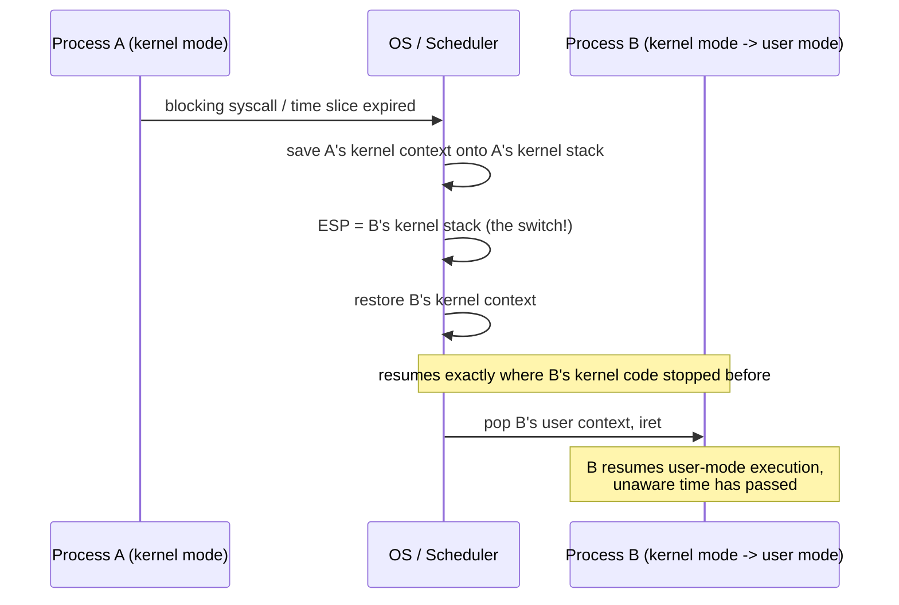

---

## 14. Two Kinds of Saved Context

This is one of the trickiest ideas in the lecture, so it's worth stating very precisely.

Context (PC and other CPU registers) gets saved onto the **kernel stack** in **two different scenarios**, and it's important not to confuse them:

| Scenario | What's saved | Saved by | Restored by |
|---|---|---|---|
| **User mode -> Kernel mode** (a trap) | User context: which instruction of *user code* we stopped at, user registers | The trap instruction (`int`) + `alltraps` | `return-from-trap` (`iret` via `trapret`) |
| **Context switch** (kernel of A -> kernel of B) | Kernel context: where we stopped inside *OS code* | The context-switching code (`swtch`) | `swtch`, the next time this process is scheduled |

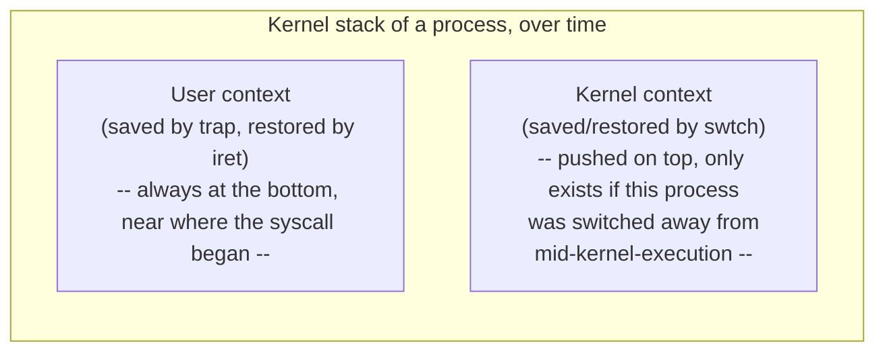

So a process that trapped in, then got switched out before finishing its syscall, has **both** kinds of context stacked on its kernel stack at once: the kernel context (from the switch) sitting on top of the user context (from the original trap). When it's switched back in, `swtch` pops the kernel context first, letting kernel-mode code resume; only later, when that kernel code finishes and falls through to `trapret`, does the user context get popped, dropping back to user mode.

---

## 15. `swtch()` in xv6

### Where it's called from: the scheduler

```c
void
scheduler(void)
{
  struct proc *p;
  struct cpu *c = mycpu();
  c->proc = 0;

  for(;;){
    sti();  // Enable interrupts on this processor.

    acquire(&ptable.lock);
    for(p = ptable.proc; p < &ptable.proc[NPROC]; p++){
      if(p->state != RUNNABLE)
        continue;

      // Switch to chosen process.
      c->proc = p;
      switchuvm(p);
      p->state = RUNNING;

      swtch(&(c->scheduler), p->context);
      switchkvm();

      // Process is done running for now.
      c->proc = 0;
    }
    release(&ptable.lock);
  }
}
```

- Every **CPU** (core) has its own dedicated **scheduler thread**: a special piece of OS code with its own context, that just loops forever looking for work.
- It scans the process table for a `RUNNABLE` process.
- Calls `swtch(&(c->scheduler), p->context)`: "save my current (scheduler's) context into `c->scheduler`, and load the context found in `p->context`."

### The `swtch` function itself (assembly, `swtch.S`)

```asm
# void swtch(struct context **old, struct context *new);
#
# Save the current registers on the stack, creating
# a struct context, and save its address in *old.
# Switch stacks to new and pop previously-saved registers.

.globl swtch
swtch:
  movl 4(%esp), %eax     # eax = address of "old" pointer
  movl 8(%esp), %edx     # edx = "new" context pointer

  # Save old callee-saved registers
  pushl %ebp
  pushl %ebx
  pushl %esi
  pushl %edi

  # Switch stacks
  movl %esp, (%eax)      # *old = current esp (this is the save!)
  movl %edx, %esp         # esp = new           (this is the switch!)

  # Load new callee-saved registers
  popl %edi
  popl %esi
  popl %ebx
  popl %ebp
  ret
```

Breaking this down into plain English:

1. **Save**: push the current values of `ebp`, `ebx`, `esi`, `edi` onto whichever stack is currently active. This, together with the stack pointer itself, is "the current context."
2. **Record**: store the current `esp` (which now points at these just-pushed registers) into the memory location pointed to by `old` — this is how the outgoing process/thread's context gets remembered for later.
3. **Switch stacks**: load `esp` with the `new` context pointer. *This single instruction is the actual context switch* — the CPU is now, for all practical purposes, "living inside" a different stack, a different process.
4. **Restore**: pop `edi`, `esi`, `ebx`, `ebp` — but now these pops are reading from the *new* stack, so they load the registers that were saved there the last time *that* process was switched out.
5. **Return**: `ret` pops a return address from the new stack and jumps there. Because this whole call/return pair is symmetric, the `ret` here can land in a completely different function than the `call` that got us into `swtch` in the first place. That's the magic: `swtch` is called from the scheduler, but can "return" into the middle of whatever code the new process was running when it last called `swtch`.

```mermaid
flowchart TB
    A["swtch(&old, new) called"] --> B["push ebp, ebx, esi, edi\n(onto CURRENT stack)"]
    B --> C["*old = esp\n(remember where we saved it)"]
    C --> D["esp = new\n(!!! THE SWITCH !!!)"]
    D --> E["pop edi, esi, ebx, ebp\n(from NEW stack)"]
    E --> F["ret\n(jumps to whatever address\nwas saved on NEW's stack)"]
```

This is why `struct context` only needs to hold `edi, esi, ebx, ebp, eip`: these are exactly the **callee-saved registers** (by x86 calling convention) plus the return address, i.e. the minimum needed to resume execution inside whatever function called `swtch` originally.

---

## 16. Full End to End Timeline

Putting the entire lecture together into one combined story: process A makes a blocking system call, and the scheduler switches to process B.

```mermaid
sequenceDiagram
    autonumber
    participant AU as A (user mode)
    participant HW as CPU Hardware
    participant AK as A (kernel mode)
    participant SCH as Scheduler thread
    participant BK as B (kernel mode)
    participant BU as B (user mode)

    AU->>HW: executes trap instruction (e.g. int $T_SYSCALL)
    HW->>HW: raise privilege, ESP -> A's kernel stack
    HW->>AK: push A's user context (trapframe), jump via IDT
    AK->>AK: trap() -> syscall() -> e.g. sys_read() blocks on disk
    AK->>AK: process A set to SLEEPING
    AK->>SCH: swtch(&A->context, scheduler->context)
    Note over AK,SCH: A's kernel context saved on A's kernel stack;<br/>ESP moves to scheduler's stack
    SCH->>SCH: loop over ptable, find B is RUNNABLE
    SCH->>BK: swtch(&scheduler->context, B->context)
    Note over SCH,BK: ESP moves to B's kernel stack;<br/>resumes wherever B's kernel code<br/>last called swtch
    BK->>BK: B's kernel-mode code finishes up
    BK->>HW: return-from-trap (trapret / iret)
    HW->>BU: pop B's user context, resume B in user mode
```

Some time later, when A's disk data arrives, an interrupt fires, the disk driver marks A as `RUNNABLE` again, and eventually the scheduler's loop finds A and `swtch`es into it, resuming A's kernel-mode code right after its own `swtch` call, which eventually returns-from-trap back into A's user code exactly where it left off.

---

## 17. Quick Revision Sheet

**Traps**: the umbrella term for system calls, interrupts, and faults — anything that forces the CPU from user mode into kernel mode.

**Why not just `call` into OS code like a function?**
- Can't trust the user to jump to the right address -> solved by the **Trap Table / IDT**, which only the OS can set up.
- Can't trust the user's stack -> solved by giving every process its own **kernel stack**.

**Trap instruction (`int n` in x86)**:
1. Raise privilege level.
2. Switch `ESP` to the process's kernel stack.
3. Save user register context on that kernel stack.
4. Look up `IDT[n]` for the handler address, set `EIP` there.
5. OS handler code runs.

**Return-from-trap (`iret` in x86)**: exact reverse of the above, dropping back to user mode.

**PCB fields relevant here (xv6 `struct proc`)**: `kstack` (kernel stack pointer), `tf` (trapframe = user context saved by traps), `context` (kernel context saved by `swtch`), `pgdir` (memory image), `state`.

**Two separate things get saved on a kernel stack**:
- **User context** — saved by the trap instruction, restored by return-from-trap. Represents "where user code paused."
- **Kernel context** — saved by `swtch`, restored by `swtch`. Represents "where kernel code paused."

**Scheduling has two parts**:
- **Policy**: which process runs next (a later lecture).
- **Mechanism**: how the switch actually happens (this lecture) — the `swtch` function.

**Preemptive vs non-preemptive**:
- Non-preemptive: only switches when a process blocks or exits.
- Preemptive: a periodic hardware **timer interrupt** forces the OS back in control regardless of what the process wants, enabling fair timesharing.

**Context switch mechanism (`swtch`)**: save a handful of callee-saved registers + return address onto the current stack, remember that stack's pointer, then flip `ESP` over to the other process's saved stack pointer, and pop its saved registers. The final `ret` naturally resumes wherever that other process last called `swtch` from.
