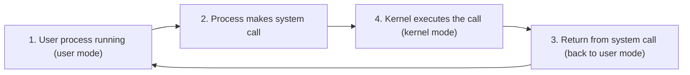
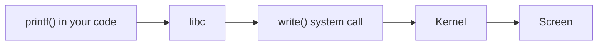
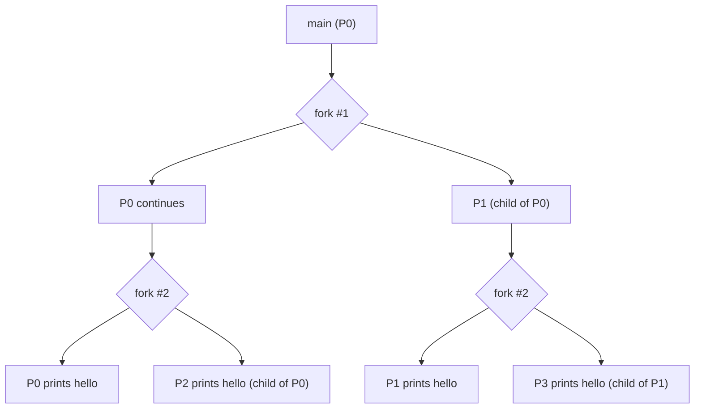
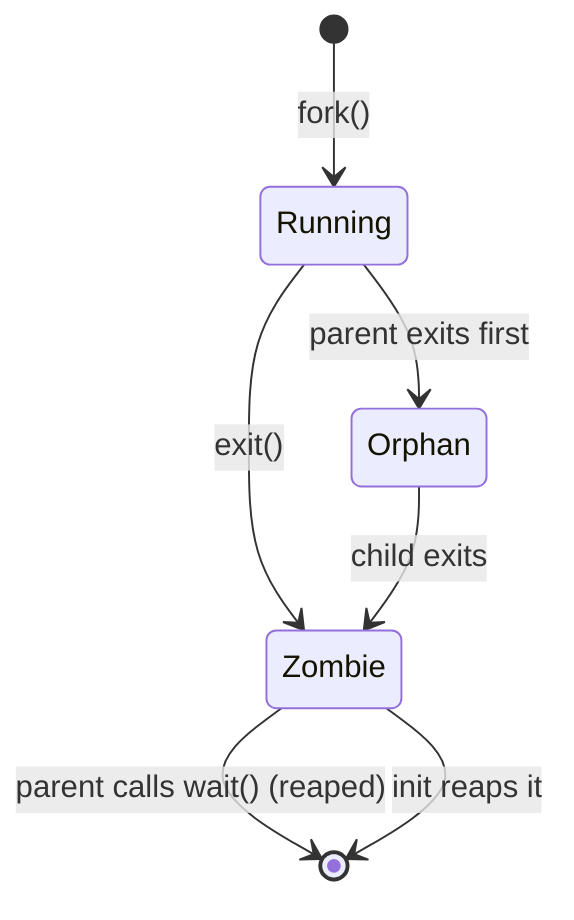
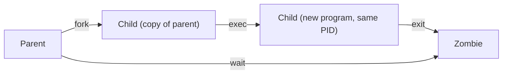
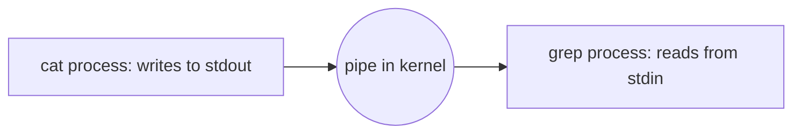
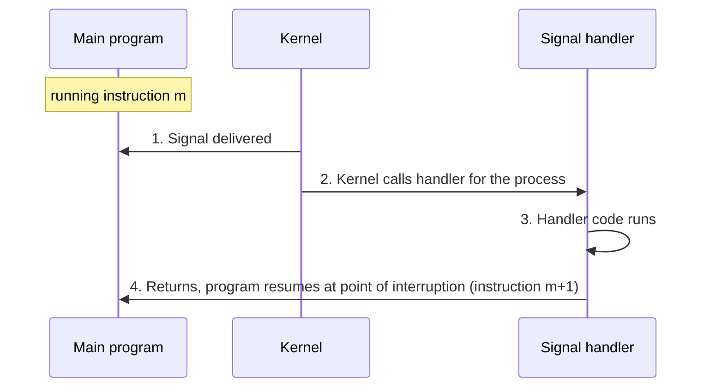

## 1. Modes and Privileges

The CPU has **privilege levels** called **rings**. Lower ring number = more power.

| Ring | Who runs here |
|---|---|
| 0 | Kernel (most privileged) |
| 1, 2 | Device drivers (rarely used in practice) |
| 3 | Normal applications (least privileged) |

![[images/slide-02.png|600]]

- Your process runs in **ring 3** almost all the time.
- It moves to ring 0 only **during a system call**, and drops back to ring 3 after.
- The current ring is stored in the **bottom 2 bits of the code segment register**.
  - `00` = ring 0, `11` = ring 3.
- Why rings exist: sensitive things (talking to hardware) must not be done by any random program. Only the kernel is trusted.

---

## 2. API and System Calls

- **API** = Application Programming Interface = the set of functions you can call to write programs.
- The API the **OS** gives you is a set of **system calls** (syscalls).
- A **system call** = a function call into OS code that runs at a **higher privilege level**.
- Reason: sensitive operations (like hardware access) are allowed only at higher privilege.

![[images/slide-03.png|600]]

### What happens during a syscall



### Blocking vs non-blocking syscalls

| Type | What happens | Example |
|---|---|---|
| **Blocking** | Process is blocked and context switched out until the work finishes | `read()` from disk |
| **Non-blocking (returns immediately)** | Returns right away | `getpid()` |

---

## 3. Portability of Code Across OS

### POSIX API
- A **standard set of system calls (and some C library functions)** that all compliant OSes provide.
- A program written with POSIX calls runs on **any POSIX-compliant OS**.
- Most modern OSes are POSIX compliant.
- You may still need to **recompile** for a different CPU architecture.

### Libraries hide syscalls
- Language libraries wrap syscalls so you rarely call them directly.
- Example: `printf` in libc internally calls the `write` syscall to put text on screen.



### ABI (Application Binary Interface)
- The interface between **machine code and hardware**: instruction set (ISA), calling convention, etc.
- API = interface at **source code** level. ABI = interface at **binary** level.

---

## 4. Process Related Syscalls (Unix)

| Syscall | What it does |
|---|---|
| `fork()` | Creates a new **child** process |
| `exec()` | Makes a process run a given executable |
| `exit()` | Terminates a process |
| `wait()` | Parent **blocks** until a child terminates |

Key facts:
- **Every process is created by forking from a parent.**
- After boot, the OS starts the **init** process. It forks all other processes.
- init is the **ancestor of all processes**, including your shell/terminal.
- Shells: bash, zsh, tcsh. Check yours with `echo $SHELL`. Use `man bash` to read about it (**RTM** = Read The Man page).
- Many variants of these calls exist in language libraries, with different arguments.

---

## 5. fork(): Creating a Process

- The parent calls `fork()`. A **new child process** is created with a **new PID**.
- The parent's **memory image is copied** into the child (code, heap, stack).
- Parent and child run **different copies of the same code**.

![[images/slide-06.png|600]]

### What happens right after fork()

- Both processes continue from the **line right after `fork()`**.
- The only difference is the **return value** of `fork()`:

| Process | Return value of fork() |
|---|---|
| Child | `0` |
| Parent | PID of the child (positive number) |
| Error (no child made) | negative number |

- Parent and child then run **independently**.
- A change to the parent's data after the fork does **not** affect the child (they have separate copies).

![[images/slide-07.png|600]]

```c
int ret = fork();
if (ret == 0) {
    // child resumes here
    printf("I am child");
} else if (ret > 0) {
    // parent resumes here
    printf("I am parent");
}
```

### Example 1: fork()

```c
#include <stdio.h>
#include <stdlib.h>
#include <unistd.h>

int main(int argc, char *argv[])
{
    printf("hello world (pid:%d)\n", (int) getpid());

    int rc = fork();

    if (rc < 0) {                 // fork failed
        fprintf(stderr, "fork failed\n");
        exit(1);
    }
    else if (rc == 0)             // child
        printf("hello, I am child (pid:%d)\n", (int) getpid());
    else                          // parent
        printf("hello, I am the parent of %d (pid:%d)\n", rc, (int) getpid());

    return 0;
}
```

- "hello world" prints **once** because it runs **before** the fork (only one process exists then).
- After the fork, the parent and child both print.
- **Order of parent vs child output can vary** (either can run first). Both orders below are valid:

```
hello world (pid:29146)
hello, I am parent of 29147 (pid:29146)
hello, I am child (pid:29147)
```
```
hello world (pid:29146)
hello, I am child (pid:29147)
hello, I am parent of 29147 (pid:29146)
```

### Example 2: fork() and separate memory

```c
int main()
{
    pid_t pid;
    int x = 1;

    pid = fork();
    if (pid == 0) {
        printf("child : x=%d\n", ++x);   // child: x becomes 2
        exit(0);
    }

    /* Parent */
    printf("parent: x=%d\n", --x);       // parent: x becomes 0
    exit(0);
}
```

![[images/slide-09.png|600]]

- Output: `child : x=2` and `parent: x=0`.
- Both started with `x = 1`. The child's `++x` and the parent's `--x` do **not** affect each other because each has its **own copy** of `x`.

### Example 3: How many times is "hello" printed?

```c
int main()
{
    fork();
    fork();
    printf("hello\n");
    exit(0);
}
```

- Each `fork()` **doubles** the number of processes.
- After the 1st fork: 2 processes. After the 2nd fork: 4 processes.
- All 4 reach the `printf`, so **"hello" prints 4 times**.

$$\text{number of processes after } n \text{ forks} = 2^n$$

(This holds when the forks are in a row with no `if` blocking them. Here $n=2$, so $2^2 = 4$.)

![[images/slide-11.png|600]]



---

## 6. exit(): Ending a Process

- When a process finishes, it calls `exit()` to terminate.
- The OS switches it out and **never runs it again**.
- `exit` is **called automatically at the end of `main`**.
- A process **cannot clean up its own memory** when exiting. Someone else must free it. (Reason comes later in memory management.)
- A terminated process whose memory is not yet freed is called a **zombie**.
- **How are zombies cleaned up?** The parent calls `wait()` (next section).

---

## 7. wait(): Cleaning Up Children

- The parent calls `wait()` to **reap** a zombie child (reap = clean up its leftover memory).
- `wait()` cleans up **one** terminated child, then returns to the parent.

### Behaviour of wait()

| Situation | What wait() does |
|---|---|
| Child still running | **Blocks** the parent until the child exits |
| Child already terminated (zombie) | Reaps it and **returns immediately** |
| Parent has no children | Returns **immediately**, reaps nothing |

```c
int ret = fork();
if (ret == 0) {
    printf("I am child");
    exit();
} else if (ret > 0) {
    printf("I am parent");
    wait();
}
```

### wait() vs waitpid()
- `wait()` reaps **any** one terminated child (in any order).
- `waitpid(pid, ...)` reaps **one specific child** with the given PID.
- Check the man page for their arguments.

### Rules and problems
- `wait` reaps **one dead child at a time**. Every `fork` must be matched by a `wait` somewhere in the parent.
- **Orphan**: a child whose parent exited while the child is still running.
  - The child keeps running.
  - It is **adopted by init**, and init reaps it when it terminates.
- **Zombie buildup**: if a parent keeps forking but never calls `wait`, zombies pile up and **fill system memory**. This is a common programming bug.



### Example: wait() makes order predictable

```c
int main(int argc, char *argv[])
{
    printf("hello (pid:%d)\n", (int) getpid());
    int rc = fork();
    if (rc < 0) {
        fprintf(stderr, "fork failed\n");
        exit(1);
    }
    else if (rc == 0)
        printf("child (pid:%d)\n", (int) getpid());
    else {
        int rc_wait = wait(NULL);
        printf("parent of %d (rc_wait:%d) (pid:%d)\n", rc, rc_wait, (int) getpid());
    }
    return 0;
}
```

Output:
```
hello (pid:542)
child (pid:543)
parent of 543 (rc_wait:543) (pid:542)
```

- Order is now **deterministic**: the parent waits until the child prints and exits, and only then prints.
- `wait()` returns the **PID of the child it reaped** (`rc_wait:543`).

---

## 8. exec(): Running a Different Program

**Problem:** after `fork`, the child runs the same code as the parent. Often the child needs to run a **different program**.

**Solution:** the child calls `exec` to get a **new memory image**.

- `exec` takes another executable as an argument.
- The process's memory (code, data, stack, heap) is **reinitialized** with the new program.
- Same process (same PID), new program.

```c
int ret = fork();
if (ret == 0) {
    exec("some_executable");
} else if (ret > 0) {
    print "I am parent";
}
```

### The six Linux variants
`execl()`, `execlp()`, `execle()`, `execv()`, `execvp()`, `execvpe()`. Read the man page (RTM) for the differences.

### Example: exec() running `wc`

```c
else if (rc == 0) {                       // child
    printf("child (pid:%d)\n", (int) getpid());
    char *myargs[3];
    myargs[0] = strdup("wc");             // program: "wc"
    myargs[1] = strdup("fork1.c");        // arg: input file
    myargs[2] = NULL;                     // mark end of array
    execvp(myargs[0], myargs);            // runs word count
    printf("this shouldn't print out");
}
else {                                    // parent
    int rc_wait = wait(NULL);
    printf("parent of %d (rc_wait:%d) (pid:%d)\n", rc, rc_wait, (int) getpid());
}
```

Output:
```
hello (pid:623)
child (pid:624)
 24  72 558 fork1.c
parent of 624 (rc_wait:624) (pid:623)
```

- `wc` prints lines, words and bytes of `fork1.c`: 24 lines, 72 words, 558 bytes.
- The args array **must end with `NULL`**.

### What happens after exec

- **If exec succeeds:** the child gets a brand new memory image and **never returns** to the old code. So the `printf("this shouldn't print out")` line never runs.
- **If exec fails** (for example the program does not exist): `exec` **returns -1** and the child **keeps running the old code**, so the line after `exec` runs. You should handle the error (print a message and `exit`).



---

## 9. How the Shell Works

- After boot, **init** is the first process.
- init spawns a shell such as **bash**.
- All future processes come from forking existing ones (init or the shell).

### The shell loop

```
do forever {
    input(command)
    int ret = fork()
    if (ret == 0) {
        exec(command)      // child runs the command
    } else {
        wait()             // shell waits for it to finish
    }
}
```

![[images/slide-19.png|600]]

- Commands like `ls`, `echo`, `cat` are **ready-made executables**. The shell just `exec`s them in a child.
- Some commands are written **inside the shell itself** (built-ins).

### Think: why does the shell fork instead of exec directly?
- `exec` **replaces** the calling process's code. If the shell exec'd the command itself, the **shell would be destroyed** and gone after one command.
- Forking first means the **child** gets replaced while the **shell survives** to read the next command.

### Think: why is `cd` not forked?
- Every process has a **current working directory**.
- `cd` uses the `chdir` syscall.
- If run in a child, only the **child's** directory would change, then the child dies. The shell's directory would be unchanged.
- So `cd` must run **in the shell process itself** to actually change where you are.

---

## 10. Foreground and Background Execution

| Mode | How | Shell behaviour |
|---|---|---|
| **Foreground** (default) | `command` | Shell **waits**. Cannot take the next command until this one finishes |
| **Background** | `command &` | Shell forks the child but **does not wait**. Prompt returns immediately |

Example: `sleep 10 &` gives the prompt back at once.

### Reaping background processes
- Shell reaps them **later** (for example periodically, or when the next input is typed).
- **How to wait without blocking?** Use a form of `wait` that returns immediately if the child has not exited: `waitpid` with the **`WNOHANG`** option. It returns 0 if no child has finished yet.

### Multiple commands in the foreground
- **Serially** (one after another): `cmd1 ; cmd2`
- **In parallel** (all start together): `cmd1 & cmd2 & cmd3 &` (then wait for all)
- Try these in a Linux shell to explore.

---

## 11. I/O Redirection

- Every process has I/O channels ("files") open, accessed by **file descriptors**.
- Three are open **by default** in every process:

| Name | Meaning | Default goes to |
|---|---|---|
| `STDIN` | standard input | keyboard |
| `STDOUT` | standard output | screen |
| `STDERR` | standard error | screen |

- The **parent shell can change the child's file descriptors before exec**. This is how redirection works.
- Example: `ls > test.txt` then `cat test.txt`.
- Output redirection = **close default STDOUT, open a regular file in its place**.

![[images/slide-22.png|600]]

### Code for redirection

```c
if (rc == 0) {                                   // child
    printf("child (pid:%d)\n", (int) getpid());
    close(STDOUT_FILENO);                        // close STDOUT
    open("./redir_output.txt", O_CREAT|O_WRONLY|O_TRUNC, S_IRWXU);

    char *myargs[3];
    myargs[0] = strdup("wc");
    myargs[1] = strdup("fork1.c");
    myargs[2] = NULL;
    execvp(myargs[0], myargs);                   // wc output goes to the file
}
```

Why it works:
- `open` always uses the **first available (lowest) file descriptor**.
- STDOUT's descriptor (1) was just closed, so the new file **takes its place**.
- `exec` keeps the open descriptors, so `wc` writes to the file thinking it is writing to the screen.
- Otherwise use `dup()` (covered later in file systems).

Result:
```
$ ./a.out
hello (pid:745)
child (pid:746)
parent of 746 (rc_wait:746) (pid:745)

$ cat redir_output.txt
 24  72 558 fork1.c
```
The `wc` output went into the file, not to the screen.

Flags used in `open`:
- `O_CREAT`: create the file if it does not exist
- `O_WRONLY`: open for writing only
- `O_TRUNC`: erase existing content first

---

## 12. Pipes

- The shell can send the **output of one command into the input of another**.
- It connects **STDOUT of one child to STDIN of another child** through a **pipe**, which is a communication channel provided by the kernel.
- Example: `cat foo.c | grep factorial`

![[images/slide-24.png|600]]



- `cat` thinks it is printing to the screen. `grep` thinks it is reading the keyboard. The pipe quietly connects them.

---

## 13. Process Control: Signals

A **signal** is a message sent to a process to tell it something happened or to control it.

| Trigger | Signal | Effect |
|---|---|---|
| `kill()` | `SIGKILL` | Kills a misbehaving process. **Cannot be caught or ignored** |
| Ctrl-C | `SIGINT` (interrupt) | Normally terminates the process |
| Ctrl-Z | `SIGTSTP` (stop) | **Pauses** the process mid-execution. Resume later with `fg` |
| (polite request) | `SIGTERM` | Asks the process to stop **gracefully** |

(The slide meme: `SIGTERM` = "please stop nicely and wait", `SIGKILL` = "just kill it now".)

### Catching signals
- A process uses the `signal()` or `sigaction()` syscall to **catch** a signal.
- When that signal arrives, the process **pauses its normal work**, runs a **handler function**, then resumes.

### Signal handling flow

![[images/slide-26.png|600]]



---

## Quick Revision Sheet

- **Ring 3** = user, **ring 0** = kernel. Syscall = temporary jump to ring 0.
- **Blocking syscall** (read) = process sleeps. **Non-blocking** (getpid) = returns fast.
- **POSIX** = standard syscalls so code is portable. **ABI** = binary level interface.
- `fork()` returns **0 in child**, **child PID in parent**, **negative on error**.
- After fork, memory is **copied**, so changes are **separate**.
- $n$ consecutive forks give $2^n$ processes.
- `exec()` **replaces** the memory image. On success it **never returns**.
- `exit()` makes a **zombie**. Parent's `wait()` **reaps** it.
- **Orphan** = parent died first, **adopted by init**.
- Parent never calling wait = **zombie buildup** = memory leak.
- Shell = loop of **fork, exec (child), wait (parent)**.
- Shell forks so it **survives** exec. `cd` is **not forked** so the shell's own directory changes.
- `&` = background (no wait). Reap later with `waitpid` + `WNOHANG`.
- Redirection = **close STDOUT, open file** in child before exec.
- Pipe = child1 STDOUT connected to child2 STDIN via kernel.
- `SIGINT` = Ctrl-C, `SIGTSTP` = Ctrl-Z, `SIGKILL` = cannot be caught.
