## 1. Mathematical Preparation: Sets

### 1.1 Power Set

The **power set** of a set A, written **2^A** or **P(A)**, is the set of **all possible subsets of A**, including the empty set and A itself. For any finite set, $|2^A| = 2^{|A|}$, proved by induction. 

**Example:** If A = {1, 2}, then

2^A = { ∅, {1}, {2}, {1,2} }

Notice |A| = 2 and |2^A| = 4 = 2².

### 1.2 Partitions of a set

Let A be a set, and let **Π** be a subset of 2^A (i.e., Π is a set of subsets of A).

**Π is a partition of A** if all three conditions hold:
1. **∅ ∉ Π** — the empty set is not one of the pieces.
2. **Distinct members of Π are disjoint** — no two different pieces share any element.
3. **⋃ Π = A** — the pieces, put back together, give you all of A (nothing is left out).

**Plain-English translation:** a partition chops A into non-overlapping, non-empty pieces that together cover everything in A — like cutting a pizza into slices where every slice has at least one bite, no slice overlaps another, and all the pizza is used up.

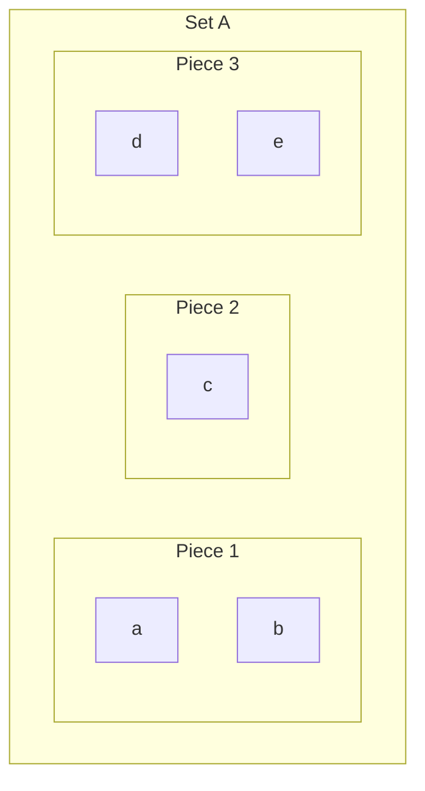

Here A = {a, b, c, d, e}, and Π = { {a,b}, {c}, {d,e} } is a valid partition: no empty pieces, no overlaps, and everything is covered.

---

## 4. Mathematical Preparation: Relations

### 4.1 What is a relation?

- A **binary relation R on A and B** is simply a **subset of A × B** (the Cartesian product — all ordered pairs (a, b) with a ∈ A, b ∈ B).
- A **binary relation R on A** (just one set) is a subset of **A × A**.

**In plain terms:** a relation is just a formal way of saying "these specific pairs of things are connected," and R is literally the set of connected pairs.

### 4.2 Representing relations as directed graphs

Any binary relation R on a set A can be drawn as a **directed graph**: each element of A is a node (dot), and we draw an **arrow from a to b exactly when (a, b) ∈ R**.

**Example from the lecture:** Let A = {1, 2, 3, 4} with

R = { (1,2), (1,4), (2,3), (2,4)... } (exact pairs read off the diagram)

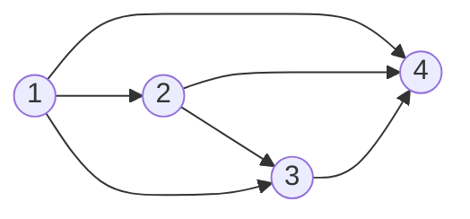

This visual is extremely useful: instead of reasoning about a set of ordered pairs abstractly, you can reason about arrows on a picture.

### 4.3 Special types of relations on a set A

These four properties describe *patterns* that a relation might or might not satisfy:

| Property | Definition | Intuition |
|---|---|---|
| **Reflexive** | For all a ∈ A, (a, a) ∈ R | Every element is related to itself (every node has a self-loop) |
| **Symmetric** | If (a, b) ∈ R then (b, a) ∈ R | Arrows always come in both directions |
| **Transitive** | If (a, b) ∈ R and (b, c) ∈ R, then (a, c) ∈ R | If you can "chain" a→b→c, there's also a direct arrow a→c |
| **Antisymmetric** | If (a, b) ∈ R and (b, a) ∈ R, then a = b | No two *distinct* elements point at each other both ways |

### 4.4 Combining these properties gives named relations

- **Reflexive + Symmetric + Transitive** = **Equivalence Relation**
- **Reflexive + Transitive + Antisymmetric** = **Partial Order**
- A partial order where **every pair of elements is comparable** = **Total Order**

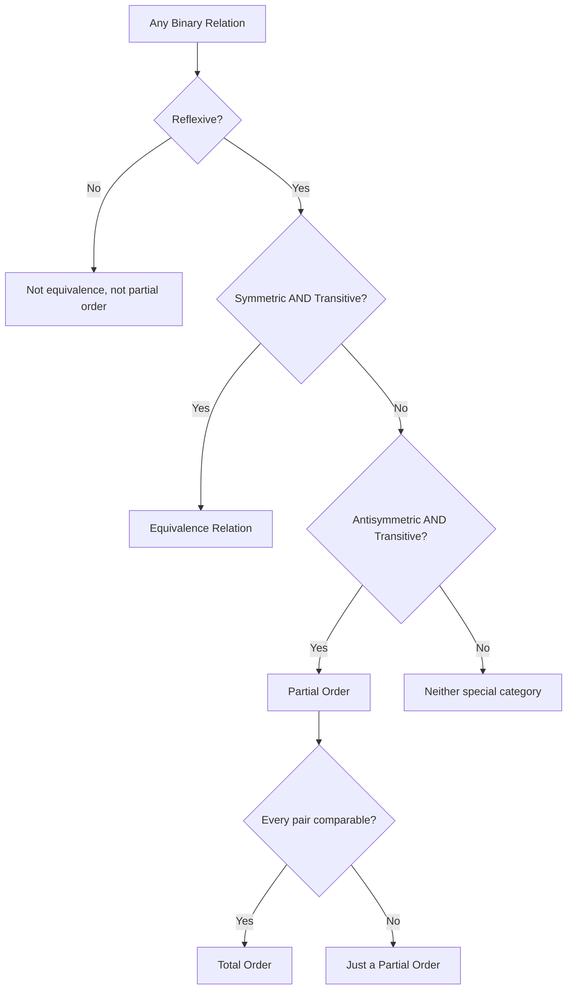

**Everyday intuition:**
- "=" on numbers is an **equivalence relation** (reflexive: a=a; symmetric: a=b implies b=a; transitive: a=b, b=c implies a=c).
- "⊆" on sets is a **partial order** (reflexive: A⊆A; antisymmetric: A⊆B and B⊆A implies A=B; transitive), but it's not total, since two arbitrary sets need not be comparable by ⊆.
- "≤" on numbers is a **total order** — reflexive, antisymmetric, transitive, AND any two numbers are always comparable.

---

## 5. Equivalence Relations and Partitions

### 5.1 Equivalence classes

Given an equivalence relation R on a set A, the **equivalence class of an element a**, written **[a]**, is the set of *all* elements of A that are related to a by R.

**Example:** if R is "has the same remainder mod 3" on the integers, then [0] = {..., -3, 0, 3, 6, ...}, [1] = {..., -2, 1, 4, 7, ...}, [2] = {..., -1, 2, 5, 8, ...}.

### 5.2 The fundamental theorem connecting equivalence relations and partitions

> **Theorem:** If R is an equivalence relation on a nonempty set A, then the equivalence classes of R form a **partition** of A.

**Why this matters:** this theorem is a two-way bridge:

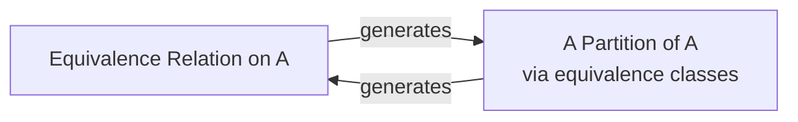

Every equivalence relation naturally chops its set into non-overlapping classes, and conversely, any partition of a set defines an equivalence relation (put two elements in the same class ⟺ they're related). This is a foundational idea reused constantly in automata theory (e.g., the **Myhill-Nerode theorem** for minimizing finite automata relies exactly on this correspondence, though that comes later in the course).

---

## 6. Paths and Cycles in Relations

### 6.1 Definition of a path

A **path** in a binary relation R from element a to element b is a sequence of elements (a₁, a₂, ..., aₙ) where:

- a₁ = a (starts at a)
- aₙ = b (ends at b)
- for every consecutive pair, (aᵢ, aᵢ₊₁) ∈ R

The **length** of the path (a₁, ..., aₙ) is **n** (the number of elements in the sequence — note: some textbooks instead count the number of *edges*, n−1; always check your source's convention).

### 6.2 Definition of a cycle

The path (a₁, ..., aₙ) is a **cycle** if:

- all the aᵢ are **distinct**, AND
- (aₙ, a₁) ∈ R as well (the path loops back to where it started)

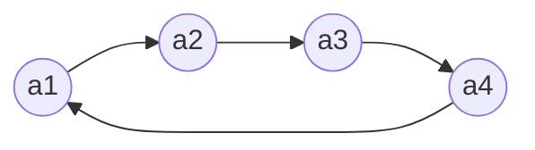

This is a cycle of length 4: a1→a2→a3→a4→a1, with all four nodes distinct and an edge closing the loop back to a1.

### 6.3 Theorem: Shortest paths never need to be longer than |A|

> **Theorem:** Let R be a binary relation on a finite set A, and let a, b ∈ A. If there is *any* path from a to b, then there is a path of length **at most |A|**.

**Proof idea (Pigeonhole Principle):**

1. Suppose, for contradiction, that the *shortest* path (a₁, ..., aₙ) from a to b has length n > |A|.
2. Since there are only |A| distinct elements available but the path has more than |A| entries, by the **Pigeonhole Principle**, some element must **repeat**: aᵢ = aⱼ for some i < j.
3. But then we can **cut out the loop** between position i and j: the shorter sequence (a₁, ..., aᵢ, aⱼ₊₁, ..., aₙ) is *still* a valid path from a to b (because aᵢ = aⱼ means we can splice the tail on directly after aᵢ).
4. This shorter path contradicts our assumption that we already had the *shortest* path.
5. Contradiction ⟹ the shortest path can never need to exceed |A| steps.

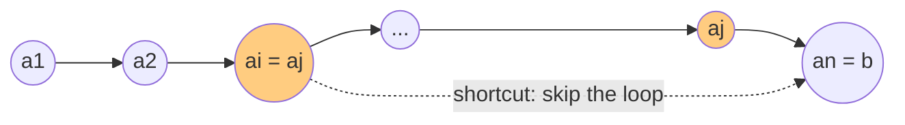

**Why this matters for the whole course:** this "no repeated states needed" idea is the exact reasoning later used to argue that if a finite automaton accepts *any* string, it accepts one of bounded length — the seed of the **Pumping Lemma**, which you'll meet later in the course.

---

## 7. Finite and Infinite Sets

### 7.1 Equinumerosity (same "size")

Two sets A and B are called **equinumerous** if there exists a **bijection** (a function that is both one-to-one and onto) f : A → B.

This is the rigorous mathematical way of saying "A and B have the same number of elements," even when that number is infinite.

### 7.2 Finite vs infinite

- A set is **finite** if it is equinumerous with {1, 2, ..., n} for some natural number n.
- A set is **infinite** if it is **not** finite.

### 7.3 Countably infinite sets

- A set is **countably infinite** if it is equinumerous with **ℕ** (the natural numbers).
- Equivalently: a countably infinite set can be **enumerated/listed** as {a₀, a₁, a₂, ..., aₙ, ...} — you can put its elements in a never-ending numbered list, and every element eventually gets a number.

### 7.4 Countable vs uncountable

- A set is **countable** if it is either **finite** or **countably infinite**.
- A set that is **not countable** is called **uncountable**.

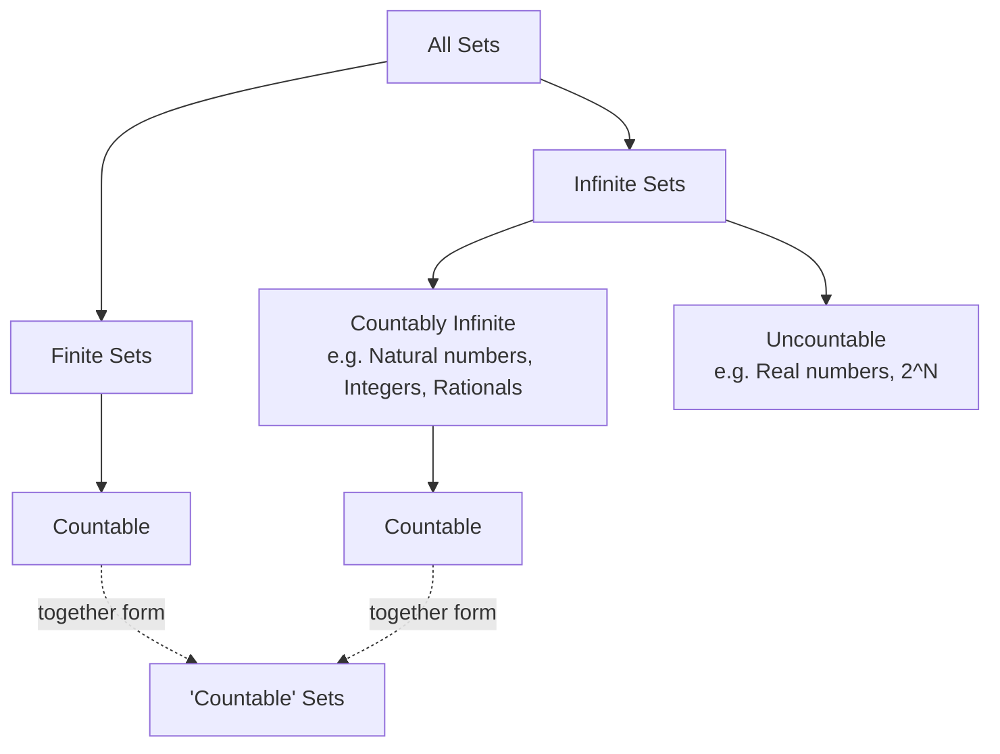

---

## 8. Countable and Uncountable Sets

### 8.1 Important Result 1: Finite unions of countably infinite sets stay countably infinite

> If A, B, C are countably infinite, then A ∪ B ∪ C is also countably infinite.

**Intuition:** you can "interleave" the listings of A, B, and C into one big combined list, alternating a₀, b₀, c₀, a₁, b₁, c₁, ... This zig-zag interleaving is shown visually in the lecture as three parallel rows (A, B, C) with a zig-zag pattern of lines connecting a₀→b₀→c₀→a₁→b₁→c₁→..., which defines one single enumeration of the union.

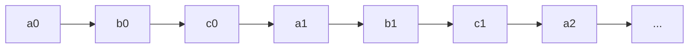

### 8.2 Important Result 2: Countably infinite union of countably infinite sets is still countably infinite

This is a stronger statement than 8.1 (not just finitely many sets, but **infinitely many** sets, each infinite) — and it's still true!

**Key observation from the lecture:** The set **ℚ (rational numbers) is countably infinite.**

This is proved using the classic **diagonal enumeration trick**: arrange all pairs (numerator, denominator) in a grid and snake through the diagonals.

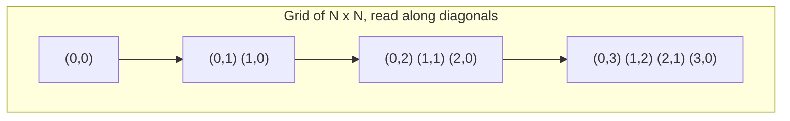

Reading diagonal by diagonal (each diagonal is finite, so you never get "stuck" on an infinite row) gives a single enumeration that hits every pair — and hence every rational number — exactly once eventually.

### 8.3 Exercises posed in the lecture (worth thinking through)

1. **Find the precise bijection from ℕ × ℕ → ℕ.** (Hint: this is the diagonal "zig-zag" numbering shown above, often written using a formula like the Cantor pairing function.)
2. **If A and B are countably infinite, then A × B is also countably infinite.** (Follows from the same diagonal argument.)
3. **What about a countably infinite Cartesian product of countably infinite sets?** (This is a trick question left as food for thought — it turns out an *infinite* product like ℕ × ℕ × ℕ × ... is generally **uncountable**, unlike a finite or countably-indexed union.)

---

## 9. Diagonalization: Proving 2^N Is Uncountable

This is one of the most important and famous proofs in the whole course — **Cantor's diagonalization argument**. It reappears later in almost identical form when proving the **undecidability of the Halting Problem**, so understanding it deeply here pays off hugely later.

### 9.1 The claim

> **Theorem:** The set 2^ℕ (i.e., the set of *all subsets* of the natural numbers) is **uncountable**.

### 9.2 The proof (by contradiction)

**Step 1 — Assume the opposite.** Suppose 2^ℕ *were* countably infinite. Then we could list *every single subset* of ℕ in some order:

2^ℕ = {R₀, R₁, R₂, R₃, ...}

(Each Rᵢ is itself a subset of ℕ — think of a giant, infinite table where row i tells you which numbers are "in" Rᵢ.)

**Step 2 — Build a "diagonal" set D.** Define:

D = { n ∈ ℕ : n ∉ Rₙ }

In words: D contains a number n **exactly when** the n-th set in our list does **not** contain n itself. (This directly inspects the "diagonal" of the imagined infinite table: does row n contain the number n?)

**Step 3 — D must appear somewhere in the list.** Since D is a subset of ℕ, and we assumed our list contains *every* subset of ℕ, D must equal Rₖ for some particular k.

**Step 4 — Ask the fatal question: is k ∈ Rₖ?**

- **Case (i): Suppose k ∈ Rₖ.** But by the very definition of D, k ∈ D only if k ∉ Rₖ. Since D = Rₖ, this means k ∈ Rₖ implies k ∉ Rₖ — **contradiction**.
- **Case (ii): Suppose k ∉ Rₖ.** By definition of D, this means k **∈** D. But D = Rₖ, so k ∈ Rₖ — **contradiction** again.

Either way we reach a contradiction. **So our original assumption (that 2^ℕ is countable) must be false.**

**Conclusion:** 2^ℕ is uncountable. ∎

### 9.3 Visualizing the diagonal argument

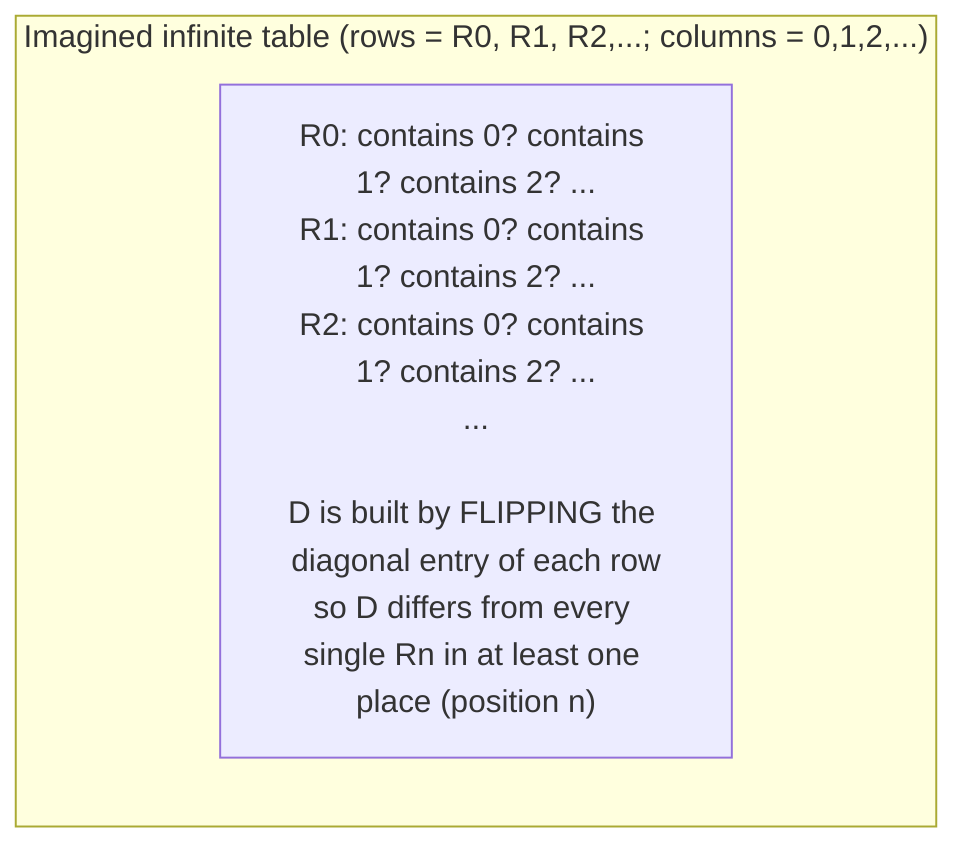

**Intuition in plain words:** No matter how you try to make a complete numbered list of all subsets of ℕ, the diagonal trick always lets you construct a *brand new* subset D that is guaranteed to differ from every single set on your list (it disagrees with Rₙ specifically at the question "is n in this set?"). So your list can *never* be complete — there are strictly more subsets of ℕ than there are natural numbers.

This exact "diagonalize against an assumed complete list" strategy is the blueprint for later proving that **the Halting Problem is undecidable** (you assume a machine that solves it exists, then diagonalize to build an input that breaks it).

---

## 10. Closures

### 10.1 The intuitive idea

A set S is **closed under an operation** if applying that operation to elements of S always keeps you *inside* S.

**Examples given in lecture:**

- **ℕ (natural numbers) is closed under addition (+):** for any n, m ∈ ℕ, n + m ∈ ℕ always.
- **ℕ is NOT closed under subtraction (−):** e.g., 1, 2 ∈ ℕ but 1 − 2 = −1 ∉ ℕ.
- **ℤ (integers) IS closed under subtraction (−).**

### 10.2 Closure as "the smallest superset with a property"

> **ℤ is the smallest set that (a) contains ℕ and (b) is closed under subtraction.**

We say **ℤ is the closure of ℕ under subtraction.**

**General pattern:** the "closure of a set S under some property/operation" = the smallest possible set that contains S and also satisfies that property.

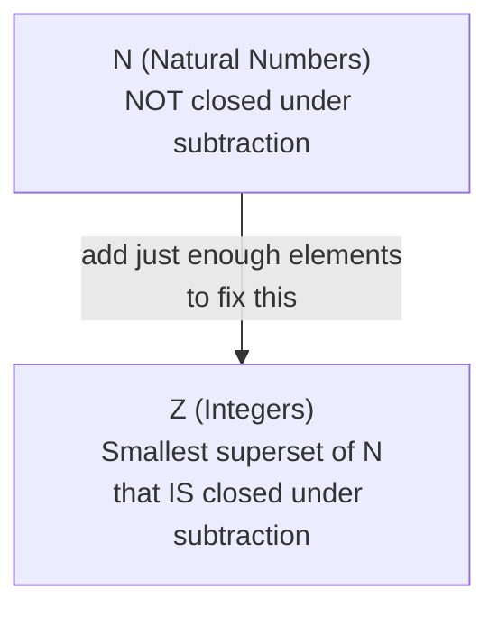

### 10.3 Reflexive-Transitive Closure: the key running example

Given a relation R (drawn as a directed graph), its **reflexive, transitive closure**, written **R\***, is the smallest relation that:

1. **Contains R** (R ⊆ R\*)
2. **Is reflexive** (every node has a self-loop)
3. **Is transitive** (if a→b and b→c, then a→c must also be present)

**Worked example from the lecture:** Let A = {a₁, a₂, a₃, a₄} with R containing edges a₁→a₄, a₁→a₃, a₂→a₃, a₃→a₄.

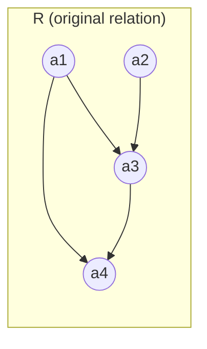

To build R\*, we must:

1. **Add self-loops** to every node (reflexivity): {(a₁,a₁), (a₂,a₂), (a₃,a₃), (a₄,a₄)}.
2. **Add transitive edges** wherever a "shortcut" is missing. Since a₁→a₃→a₄ is a path but a₁→a₄ direct edge... (already present here); but a₂→a₃→a₄ needs the shortcut **a₂→a₄** added (this is exactly the extra pair {(a₂, a₄)} mentioned in the lecture).

So: **R\* = R ∪ {(aᵢ,aᵢ) : i=1,2,3,4} ∪ {(a₂,a₄)}**

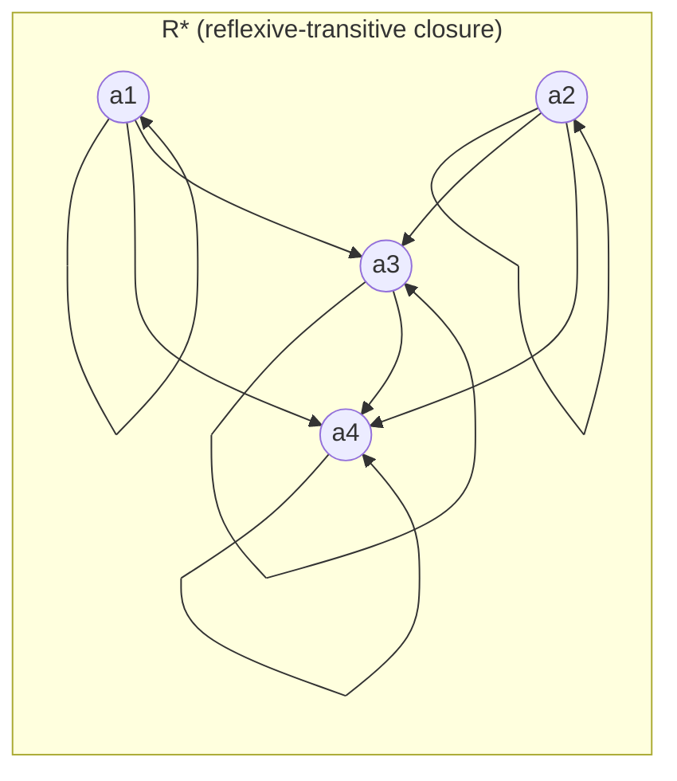

**Observation:** R is neither reflexive nor transitive on its own; R ⊆ R\*; and R\* is both reflexive and transitive, and it's the *smallest* such relation containing R.

### 10.4 Two equivalent definitions of R\*

**Definition 1 (structural/minimality definition):**
> R\* is the reflexive-transitive closure of R **iff** R ⊆ R\*, and R\* is reflexive and transitive, and R\* is the *smallest* such set with these properties.

**Definition 2 (path-based definition — much more useful algorithmically):**
> Let R be a binary relation on a set A. The reflexive-transitive closure of R is:
>
> **R\* = { (a, b) ∈ A × A : there is a path from a to b in R }**

Definition 2 is simpler to *compute with*, because "is there a path?" is a concrete, checkable question (this is literally reachability in a graph — the same idea used in graph search algorithms like BFS/DFS).

---

## 11. Reflexive-Transitive Closure Algorithms

Given a finite set A = {a₁, ..., aₙ} and relation R, how do we actually *compute* R\* algorithmically? The lecture presents two algorithms and analyzes their running time.

### 11.1 Algorithm 1 — brute-force path checking

```
Initially R* := ∅
for i = 1, 2, ..., n do
    for each i-tuple (b1, ..., bi) in A^i do
        if b1, ..., bi is a path in R then
            add (b1, bi) to R*
```

**Idea:** for every possible sequence length i from 1 to n, check *every possible i-tuple* of elements from A, and see if it forms a valid path in R. If so, the first and last elements of that tuple get added to R\*.

**Running time: O(n^(n+1))**

**Why:** in the worst case, there are up to n^n possible tuples to check across all lengths, and checking whether each tuple forms a valid path takes O(n) operations (checking n−1 consecutive pairs) — giving roughly n^n × n = n^(n+1).

This is **extremely slow** (exponential in n) — clearly not a practical algorithm, but it directly mirrors Definition 2 (the "is there a path" definition), which is why it's presented first for conceptual clarity.

### 11.2 Algorithm 2 — the smarter, iterative approach

```
Initially R* := R ∪ {(ai, ai) : ai in A}
While there exist three elements ai, aj, ak such that
      (ai, aj) in R* and (aj, ak) in R* but (ai, ak) not in R*
   then add (ai, ak) to R*
```

**Idea:** start with R plus all self-loops (this handles reflexivity immediately). Then repeatedly scan for any "broken transitivity" — any case where you can go ai→aj→ak but there's no direct ai→ak edge yet — and patch it by adding that edge. Keep doing this until no more patches are needed.

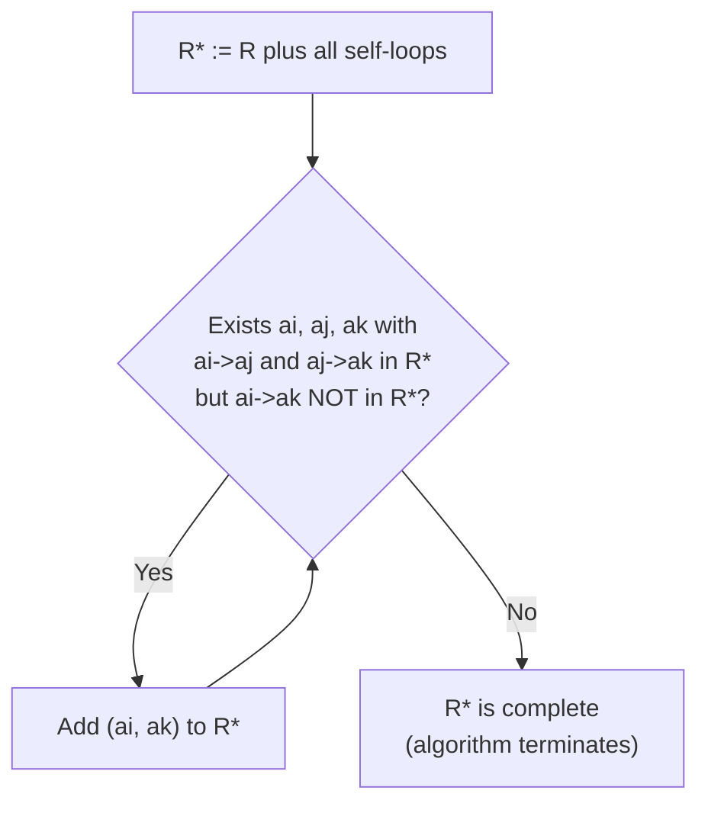

This is essentially the same idea behind the **Floyd-Warshall algorithm** for computing transitive closures / all-pairs reachability, which you may have seen in a Data Structures & Algorithms course.

**Running time: O(n^5)**

**Why:**
- In the worst case, up to **n² pairs** may need to be added to R\* over the life of the algorithm, so there are at most n² "iterations" of the while loop where a new pair is actually added.
- In each iteration, to *find* a valid (ai, aj, ak) triple that needs patching, we may need to search **all possible triples**, which is O(n³) work.
- Total: n² × n³ = **n⁵**.

### 11.3 Comparing the two algorithms

| Algorithm | Running Time | Approach |
|---|---|---|
| Algorithm 1 | O(n^(n+1)) — exponential | Brute-force: check every possible path of every length directly (matches Definition 2 literally) |
| Algorithm 2 | O(n^5) — polynomial | Iteratively patch missing transitive edges until none remain (matches Definition 1's minimality idea, applied constructively) |

Algorithm 2 is **vastly more practical** — this is a nice early lesson in the course: a mathematically clean *definition* (Definition 2, "does a path exist") does not automatically give you an *efficient algorithm*; sometimes a cleverer reformulation (Definition 1's iterative patching) is needed for tractability.

---

## 12. Languages over an Alphabet (Σ)

We now shift from pure set/relation theory into the **language theory** that underlies automata theory.

### 12.1 Alphabets

- Any **finite set** is called an **alphabet**.
- The elements of the alphabet are called **symbols**.
- Notation: we use the Greek letter **Σ** (sigma) to denote an alphabet.

**Example:** Σ = {0, 1} is called a **binary alphabet**.

**Subtle but important remark:** Σ *can* be the empty set ∅, since ∅ is technically a finite set. However, for the course to be interesting, we generally want **Σ ≠ ∅**.

### 12.2 Strings (words) over Σ

- A **word** or **string** over Σ is any finite sequence of symbols from Σ.
- The **empty string** (a string with zero symbols) is denoted **e** or **ε**.
- **Σ\*** denotes the **set of ALL possible strings over Σ** (including the empty string).

Since e ∈ Σ\* always, **Σ\* is never empty**, even if Σ itself were empty (in that trivial case Σ\* = {e}).

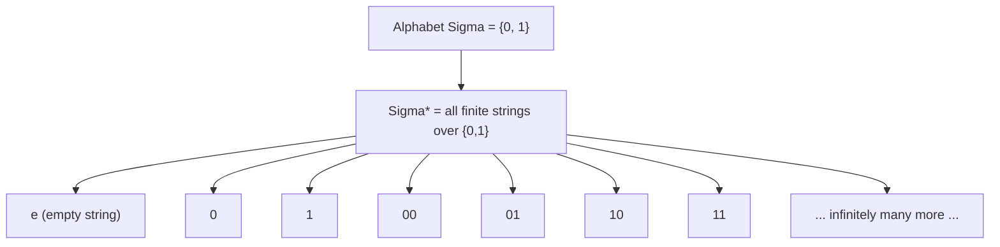

### 12.3 Languages

> **Definition:** Given an alphabet Σ, any set **L such that L ⊆ Σ\*** is called a **language over Σ**.

In plain terms: **a language is simply any collection of strings** built from the alphabet's symbols. It doesn't need to have any "meaning" in the everyday sense — mathematically, any subset of Σ\* qualifies as a language.

**Fact 1:** For any alphabet Σ, any language over Σ is **countable**.
*(Why: Σ\* itself is countably infinite whenever Σ is nonempty and finite — you can enumerate strings by length, then alphabetically within each length — and any subset of a countable set is countable.)*

**Fact 2:** For any alphabet Σ ≠ ∅, there are **uncountably many languages** over Σ.
*(Why: the set of ALL languages over Σ is exactly 2^(Σ\*) — the power set of a countably infinite set — and by the same diagonalization argument as Section 9, the power set of any countably infinite set is uncountable!)*

**This is a beautiful and important consequence:** even though each *individual* language contains only countably many strings, there are *uncountably many different possible languages* to choose from. This foreshadows a hugely important later result: since there are only *countably many* Turing machines (each described by a finite string of symbols/instructions) but *uncountably many* languages, **most languages cannot be recognized by any Turing machine at all** — most languages are undecidable, simply by a counting/cardinality argument, without needing to construct a single specific example!

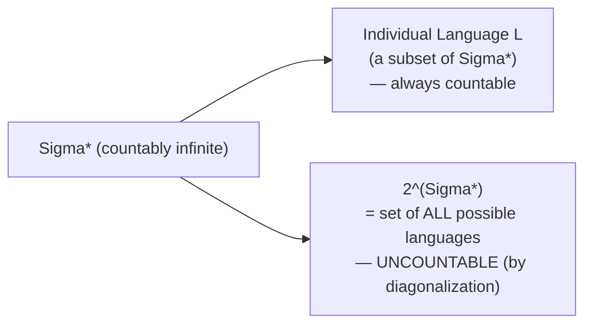

### 12.4 Defining languages

Languages, being sets, can be defined in the same two ways as any set:

1. **By listing elements** (only feasible for small finite languages), e.g.:

   L₄ = {e, 0, 1, 00, 01, 11, 10}

2. **By giving a defining property P(w)**:

   L = { w ∈ Σ\* : P(w) }

**Examples from the lecture:**

- L₁ = { w ∈ {0,1}\* : w has an even number of 0's }
- L₂ = { w ∈ {a,b}\* : w has "ab" as a substring }

**A natural question posed in the lecture:** Can we define L₄ = {e, 0, 1, 00, 01, 11, 10} using a property instead of listing it? Think about it: L₄ turns out to be exactly "all strings over {0,1} of length ≤ 2" — so P(w) could be "**|w| ≤ 2**". This is a nice exercise in translating between the "listing" and "property" styles of definition.

### 12.5 Set operations apply directly to languages

Since languages are sets, **all the usual set operations and their algebraic laws carry over directly**:

Given L, L₁, L₂ ⊆ Σ\*, we can form:

- **Union:** L₁ ∪ L₂
- **Intersection:** L₁ ∩ L₂
- **Difference:** L₁ − L₂
- **Complement:** ¬L = Σ\* − L (everything in Σ\* that is NOT in L)
- **Cartesian product:** L₁ × L₂ (a set of *pairs* of strings — different from concatenation, see below)

And **all standard laws of set algebra** (De Morgan's laws, distributivity, associativity, commutativity of union/intersection, etc.) hold automatically for languages, because languages *are* sets.

### 12.6 Substrings, prefixes, and suffixes

**Definition:** a word v ∈ Σ\* is a **substring (sub-word)** of w iff there exist x, y ∈ Σ\* such that:

**w = x v y**

(Note: x and y are allowed to be the empty string e — that's important for the edge cases below.)

**Two basic properties:**

- **P1:** w is always a substring of itself (take x = y = e).
- **P2:** e (the empty string) is a substring of *every* string w (since e·w·e = w).

**Prefix and suffix definitions:** if w = x y (w is the concatenation of x followed by y), then:

- **x is called a prefix of w**
- **y is called a suffix of w**

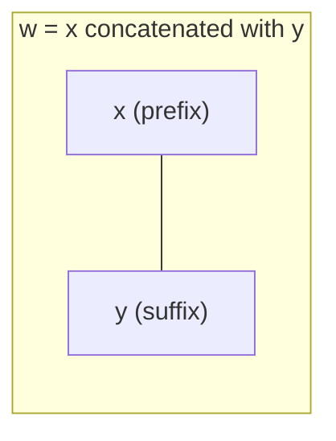

**Example:** if w = "hello", then "he" is a prefix (with y = "llo"), "llo" is a suffix (with x = "he"), and "ell" is a substring (with x = "h", y = "o").

---

## 13. Concatenation of Strings and Languages

### 13.1 Concatenation of two strings

**Informal definition:** given alphabet Σ and words x, y ∈ Σ\*, the **concatenation** of x and y is the word w formed by writing x followed immediately by y.

- We write this as **w = x ∘ y** (using the explicit "∘" symbol when clarity is needed).
- Usually, we drop the ∘ symbol and just write **w = xy**.

**Key algebraic properties:**

- **w ∘ e = e ∘ w = w** — concatenating with the empty string changes nothing (e behaves like an "identity element", just like 0 for addition or 1 for multiplication).
- **(x ∘ y) ∘ z = x ∘ (y ∘ z) = x ∘ y ∘ z** — concatenation is **associative** (grouping doesn't matter).

### 13.2 Power of a string

We define the **i-th power of a string w**, written **w^i**, using **mathematical induction on i**:

- **Base case:** w⁰ = e (zero copies of w is just the empty string)
- **Inductive step:** w^(i+1) = w^i ∘ w (one more copy of w tacked on the end)

**Example:** if w = "ab", then w⁰ = e, w¹ = "ab", w² = "abab", w³ = "ababab", etc.

### 13.3 Reversal of a string

The **reversal** w^R of a string w is defined by **induction on the length |w| of w**:

1. **Base case:** if |w| = 0, then w^R = w = e (the empty string reversed is itself).
2. **Inductive step:** if |w| = n + 1 > 0, then w = u·a for some symbol a ∈ Σ and some shorter string u ∈ Σ\* (i.e., w is "everything but the last symbol" followed by "the last symbol a"). We define:

   **w^R = a ∘ u^R**

   (Take the last symbol, put it first, then recursively reverse the rest.)

**Key theorem:** for any w, x ∈ Σ\*:

**(wx)^R = x^R ∘ w^R**

**Intuition:** reversing a concatenated string swaps *and* reverses both halves — think of reversing "HELLO" + "WORLD" = "HELLOWORLD"; reversed, it's "DLROWOLLEH", which is exactly ("WORLD" reversed) followed by ("HELLO" reversed) = "DLROW" + "OLLEH".

### 13.4 Concatenation of languages

**Definition:** given L₁, L₂ ⊆ Σ\*, the **concatenation** of the languages is:

**L₁ ∘ L₂ = { w ∈ Σ\* : w = xy for some x ∈ L₁, y ∈ L₂ }**

In words: to build a string in L₁∘L₂, take *any* string from L₁, glue on *any* string from L₂ right after it.

**Note:** concatenation can even be defined for languages over different (but compatible) domains — the lecture doesn't require L₁ and L₂ to be defined by the exact same alphabet restrictions, as long as both are subsets of the same Σ\*.

**Worked example from the lecture:**

- L₁ = { w ∈ {0,1}\* : w has an even number of 0's }
- L₂ = { w ∈ {0,1}\* : w starts with 0, and the rest of the symbols (if any) are all 1's }
  (so L₂ = { "0", "01", "011", "0111", ... })

**Claim:** L₁ ∘ L₂ = { w ∈ Σ\* : w has an **odd** number of 0's }

**Why:** any string x ∈ L₁ has an *even* number of 0's. Any y ∈ L₂ starts with exactly *one* 0 (and then only 1's), contributing exactly *one more* 0. Even + 1 = odd. So the concatenation xy always has an odd total count of 0's, and (with a bit more care) every string with an odd number of 0's can indeed be split this way.

### 13.5 Is concatenation of languages commutative?

**Short answer: No.**

**Counter-example given in the lecture:** the string "1000" satisfies:

- **1000 ∈ L₁ ∘ L₂** (true)
- **1000 ∉ L₂ ∘ L₁** (false — it's not in this order)

This single example is enough to **prove**:

**L₁ ∘ L₂ ≠ L₂ ∘ L₁**

So, unlike union or intersection (which are commutative), **concatenation is order-sensitive** — makes sense, since "cat" + "dog" = "catdog" is a very different string from "dog" + "cat" = "dogcat"!

### 13.6 Concatenation IS distributive over union

Even though concatenation isn't commutative, it does distribute nicely over union, for any n ≥ 2:

**(L₁ ∪ L₂ ∪ ... ∪ Lₙ) ∘ L = (L₁∘L) ∪ (L₂∘L) ∪ ... ∪ (Lₙ∘L)**

**L ∘ (L₁ ∪ L₂ ∪ ... ∪ Lₙ) = (L∘L₁) ∪ (L∘L₂) ∪ ... ∪ (L∘Lₙ)**

This is directly analogous to how multiplication distributes over addition in ordinary algebra: a·(b+c) = a·b + a·c. It's a very useful algebraic identity for simplifying expressions involving languages, and it will matter a lot once **regular expressions** are introduced (regular expressions are literally built from union, concatenation, and the star operation on languages).

---

## 14. Quick Revision Sheet

A condensed cheat-sheet of everything covered, for quick review before exams/quizzes.

### Sets & Combinatorics
- Power set 2^A has size 2^|A| for finite A (proved by induction).
- A **partition** Π of A: no empty pieces, pairwise disjoint, union = A.

### Relations
- R ⊆ A × A (or A × B). Drawn as a directed graph.
- **Reflexive** (self-loops everywhere), **Symmetric** (arrows both ways), **Transitive** (shortcuts always exist), **Antisymmetric** (no two-way arrows between distinct elements).
- Reflexive + Symmetric + Transitive = **Equivalence Relation** → induces a **partition** via equivalence classes.
- Reflexive + Transitive + Antisymmetric = **Partial Order**; if also every pair comparable = **Total Order**.
- **Path** of length n: sequence a₁,...,aₙ with consecutive pairs in R. **Cycle**: distinct elements + edge back to start.
- **Theorem:** shortest path between two nodes in a finite set A never needs length > |A| (Pigeonhole argument — repeated nodes can be shortcut out).

### Countability
- **Equinumerous**: bijection exists between two sets.
- **Finite** ⟷ equinumerous with {1,...,n}. **Infinite** ⟷ not finite.
- **Countably infinite** ⟷ equinumerous with ℕ. **Countable** = finite or countably infinite. **Uncountable** = not countable.
- Finite union, and even countably infinite union, of countably infinite sets → still countably infinite (interleaving/diagonal enumeration). ℚ is countably infinite.
- **2^ℕ is uncountable** — proved by **diagonalization** (build a set D that disagrees with every Rₙ at position n → contradiction). This exact technique reappears for the Halting Problem later in the course.

### Closures
- S is **closed under an operation** if applying the operation never leaves S.
- **Closure of S under a property** = smallest superset of S satisfying that property (e.g., ℤ is the closure of ℕ under subtraction).
- **Reflexive-transitive closure R\*** of relation R: smallest reflexive+transitive relation containing R; equivalently, R\* = all pairs (a,b) with a path from a to b in R.
- **Algorithm 1** (brute-force path check): O(n^(n+1)) — impractically slow.
- **Algorithm 2** (iterative transitive-edge patching): O(n⁵) — much more practical; conceptually similar to Floyd-Warshall.

### Languages
- **Alphabet Σ**: any finite set of symbols (can technically be ∅, but we usually want Σ ≠ ∅).
- **Σ\***: set of ALL finite strings over Σ, including empty string e. Always nonempty since e ∈ Σ\*.
- **Language L**: any subset of Σ\* (L ⊆ Σ\*).
- **Fact:** every individual language is countable, but there are **uncountably many** possible languages over any nonempty Σ (since the set of all languages is 2^(Σ\*), and power sets of countably infinite sets are uncountable).
- Languages support all normal **set operations** (union, intersection, complement, etc.) and obey all laws of set algebra.
- **Substring**: v is a substring of w iff w = xvy for some x, y ∈ Σ\* (x, y may be empty). **Prefix**/**Suffix**: if w = xy, x is a prefix, y is a suffix.
- **Concatenation of strings**: w = x∘y, glue x then y. Associative; e is the identity element.
- **String power**: w⁰ = e, w^(i+1) = wⁱ∘w (defined by induction).
- **String reversal**: (wx)^R = x^R ∘ w^R (reverse-and-swap rule), defined by induction on length.
- **Concatenation of languages**: L₁∘L₂ = {xy : x∈L₁, y∈L₂}.
- Concatenation is **NOT commutative** (L₁∘L₂ ≠ L₂∘L₁ in general — counterexample: "1000").
- Concatenation **IS distributive** over union: (L₁∪...∪Lₙ)∘L = (L₁∘L)∪...∪(Lₙ∘L), and similarly on the left.

