# Theory of Computation: Lectures 5-8
## Regular Expressions, Regular Languages, and Finite Automata

---

## Table of Contents
1. [[#1. Recap - Languages and Concatenation]]
2. [[#2. Kleene Star]]
3. [[#3. Finite Representation of Languages]]
4. [[#4. Regular Expressions - Formal Definition]]
5. [[#5. Regular Languages]]
6. [[#6. Big Questions About Regular Languages]]
7. [[#7. Finite State Automaton - Motivation]]
8. [[#8. The Toll Gate Example]]
9. [[#9. Deterministic Finite Automaton (DFA)]]
10. [[#10. Computation and Acceptance by DFA]]
11. [[#11. Closure Properties of DFA Languages]]
12. [[#12. Nondeterministic Finite Automaton (NFA)]]
13. [[#13. Summary Cheat Sheet]]

---

## 1. Recap - Languages and Concatenation

### What is a language?
Given an alphabet $\Sigma$ (a finite set of symbols, like $\{0, 1\}$), any set $L$ such that

$$L \subseteq \Sigma^*$$

is called a **language over $\Sigma$**. In plain words: a language is just a collection of strings built from your alphabet. $\Sigma^*$ means "all possible strings you can make from $\Sigma$, including the empty string."

### Concatenation of words
Given words $x, y \in \Sigma^*$, the **concatenation** is the word $w$ formed by writing $x$ followed by $y$. We write this as:

$$w = x \circ y$$

Think of it like gluing two strings end to end. If $x = ab$ and $y = 01$, then $x \circ y = ab01$.

### Power of a word
We define $w^i$ (a word repeated $i$ times) by **mathematical induction**:

$$w^0 = e \quad \text{(the empty string)}$$
$$w^{i+1} = w^i \circ w$$

So $w^1 = w$, $w^2 = w \circ w$, and so on. This is just like exponents for numbers, but for strings, repetition means concatenation instead of multiplication.

### Two important facts about languages
- **Fact 1**: For any alphabet $\Sigma$, any language over $\Sigma$ is **countable** (since $\Sigma^*$ itself is countable, and any subset of a countable set is countable).
- **Fact 2**: For any nonempty alphabet $\Sigma$, there are **uncountably many** languages over $\Sigma$ (since the power set of a countably infinite set is uncountable).

> [!tip] Intuition
> There are infinitely many possible strings, but there are even *more* possible languages (sets of strings) than there are strings themselves. This mismatch becomes important later when we ask "can every language be described by a finite formula?"

### Concatenation of Languages
Given $L_1, L_2 \subseteq \Sigma^*$, the concatenation of the languages is:

$$L_1 \circ L_2 = \{w \in \Sigma^* : w = xy \text{ for some } x \in L_1, y \in L_2\}$$

This means: take every string from $L_1$, glue on every string from $L_2$, and collect all the results.

**Worked Example:**
- $L_1 = \{w \in \{0,1\}^* : w \text{ has an even number of } 0\text{'s}\}$
- $L_2 = \{w \in \{0,1\}^* : w \text{ starts with } 0 \text{ and the rest (if any) are } 1\text{'s}\}$

Then:
$$L_1 \circ L_2 = \{w \in \Sigma^* : w \text{ has an odd number of } 0\text{'s}\}$$

**Why?** Any string in $L_1$ has an even number of $0$s. Concatenating a string from $L_2$ adds exactly one more $0$ (the leading $0$), flipping even to odd.

> [!note] Concatenation across different domains
> Concatenation can combine languages defined by completely different rules — the definition doesn't care *how* $L_1$ and $L_2$ describe their strings, only that we're gluing members of one to members of the other.

---

## 2. Kleene Star

### Definition
The **Kleene Star** $L^*$ of a language $L$ is the set of all strings obtained by concatenating **zero or more** strings from $L$:

$$L^* = \{w_1 w_2 \ldots w_k : k \geq 0, \, w_i \in L, \, i = 1, 2, \ldots, k\}$$

Remember:
- Concatenating **zero** strings gives the empty string $e$.
- Concatenating **one** string gives that string itself.

> [!example] Intuition
> If $L = \{ab\}$, then $L^* = \{e, ab, abab, ababab, \ldots\}$ — any number of copies of "ab" glued together, including none at all.

### Basic properties of Kleene Star

| Property | Meaning |
|---|---|
| $e \in L^*$, for all $L$ | The empty string is always in $L^*$, no matter what $L$ is (even if $L$ is empty!) |
| $L^* \neq \emptyset$, for all $L$ | $L^*$ always contains at least $e$, so it's never empty |
| $\emptyset^* \neq \emptyset$ | Even starring the *empty language* gives you $\{e\}$, not nothing |

### A subtle question
Is there a language $L \neq \Sigma$ such that $L^* = \Sigma^*$ anyway?

**Yes!** Take $\Sigma = \{0, 1\}$ and:
$$L = \{w \in \Sigma^* : w \text{ has an unequal number of } 0\text{'s and } 1\text{'s}\}$$

Then remarkably:
$$L^* = \{0,1\}^* = \Sigma^*$$

**Why this works:** Even though $L$ itself excludes strings with equal numbers of 0s and 1s (like "01" or "10"), you can *build* such a string by concatenating two unequal-count strings (e.g., "0" and "1" — each individually unequal in the trivial sense of having only one symbol type present, glued to form "01"). Since $L$ is rich enough, starring it recovers everything.

### Kleene Plus ($L^+$)
Defined as:
$$L^+ = L \circ L^*$$
$$L^+ = \{w_1 w_2 \ldots w_k : k \geq 1, \, w_i \in L, \, i = 1, 2, \ldots, k\}$$

The only difference from $L^*$: you need **at least one** string from $L$ (no empty concatenation allowed by default).

**Key fact:**
$$e \in L^+ \iff e \in L$$

This makes sense: $L^+$ requires at least one copy of some string in $L$. The *only* way to get the empty string out of that is if $L$ itself already contains the empty string.

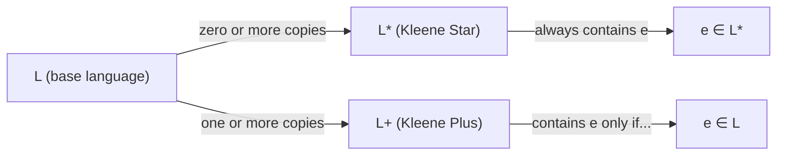

---

## 3. Finite Representation of Languages

### The core problem
Languages are often **infinite** sets of strings. A natural question: can we represent an infinite language using a **finite** description?

We already know we can list out a *finite* language's elements one by one. But for infinite languages, we need something cleverer.

### Worked example: strings with 1s in specific positions
Consider:
$$L = \{w \in \{0,1\}^* : w \text{ has two or three occurrences of } 1, \text{ the first and second of which are not consecutive}\}$$

We can build this up piece by piece using just **singleton sets** and the symbols $\{, \}, (, ), \cup, \circ, *$:

$$L = \{0\}^*\{1\}\{0\}^*\{0\} \circ \{1\}\{0\}^*(\{1\}\{0\}^* \cup \emptyset^*)$$

We then **dispense with braces and the $\circ$ symbol** for brevity (concatenation becomes implicit, just writing symbols next to each other):

$$L = 0^*10^*010^*(10^* \cup \emptyset^*)$$

We call an expression like this (built from single symbols, $\emptyset$, union $\cup$, concatenation, and Kleene star $*$) a **regular expression**.

### Building the intuition: even-length binary strings

Any string with an even number of characters can simply be chopped into pairs of two characters:
- A string of length 0 has zero pairs (the empty string $e$).
- A string of length 2 has one pair (e.g., `01`).
- A string of length 4 has two pairs (e.g., `01` followed by `11`).
- A string of length $2n$ is made by gluing together $n$ pairs.

**Walking Through the Three Formulations**

1. **Set form with Kleene Star:** $$L = \{00, 01, 10, 11\}^*$$
    - $\{00, 01, 10, 11\}$ lists every possible 2-character string made from 0s and 1s.   
    - The star ($*$) means "repeat elements from this set zero or more times."
    
2. **Standard Regular Expression using Union ($\cup$):**$$L = (00 \cup 01 \cup 10 \cup 11)^*$$
    - Instead of set notation, this replaces the set with an explicit OR ($\cup$).
    - It says: repeatedly pick either `00`, `01`, `10`, or `11`, as many times as you like.
        
3. **Compact Factorization:**$$L = ((0 \cup 1)(0 \cup 1))^*$$
    - Notice that any 2-character block is just "(either 0 or 1) followed by (either 0 or 1)."
    - $(0 \cup 1)(0 \cup 1)$ produces any 2-character binary string.
    - Putting a star ($*$) around the whole block means: repeatedly generate 2-character chunks zero or more times, guaranteeing the total length stays even.

### Worked example: odd number of a's
**Language:** $L$ = strings in $\{a,b\}^*$ with an **odd** number of $a$'s.

To build regular expressions systematically without guessing, follow a step-by-step framework based on invariants, anchors, and noise symbols.

#### 1. Separate "Counted" Symbols from "Noise" Symbols

In any alphabet problem, symbols fall into two categories:
- **The constrained symbol:** The character with rules or count restrictions (e.g., $a$ in "odd number of $a$'s").
- **The noise symbol:** The character that can appear anywhere without changing the condition (e.g., $b$).

Before writing the full regex, write the pattern using **only the constrained symbol**, completely ignoring the noise.

#### 2. Solve the Skeleton First

Write the simplest sequence that satisfies the core condition using just the constrained symbol:
- To get an odd number of $a$'s purely from $a$'s:      
    - Minimal valid odd string: $a$
    - How to grow an odd number while keeping it odd: Add pairs of $a$'s ($aa$).
- The skeleton is:$$a(aa)^*$$
#### 3. Identify Every "Slot" Where Noise Can Live

Now bring back the noise symbol ($b$). Ask: _Where can $b$'s legally appear?_
- Before the first $a$
- After the first $a$
- Between the paired $a$'s
- After the paired $a$'s
- At the very end of the string

Every single gap between characters—plus the front and back—is a candidate for $b^*$.

#### 4. Inject Noise Without Leaving Gaps Between Loops

Place $b^*$ around the skeleton components:
- **Base unit ($a$):**    
    Can have $b$'s before and after:$$b^* a b^*$$
- **Loop unit ($aa$):**
    The loop will repeat $k$ times: $( \dots )^*$.
    Inside one loop iteration, you need to handle $b$'s between the two $a$'s **and** $b$'s after the second $a$ before the next iteration begins:$$(a b^* a b^*)^*$$
Combine them:
$$b^* a b^* (a b^* a b^*)^*$$

(Note: The trailing $b^_$ inside the loop already covers any ending $b$'s when $k \ge 1$, and $b^*ab^*$ covers it when $k = 0$, so an extra $b^*$ at the very end is technically redundant, though writing it as $b^*ab^*(ab^*ab^*)^*b^*$ is also correct and safe.)*

  

#### 5. The Mental Sanity Checks

Run your candidate regex through three standard edge cases:
1. **The minimal string:** Does it accept the shortest valid string? (For this problem: `a` -> $b^*ab^*$ with empty stars yields `a` -> valid).
2. **Consecutive noise:** Can it handle strings made purely of noise? (Should it? No, because count must be odd $\ge 1$; input `bbb` fails -> correct).
3. **Internal spacing:** Can noise appear between repeats? (Try `a b b a a` -> handled by the internal $b^*$ within the repeat block).

### Worked example: C programming language identifiers
An identifier in C is a string of length $\geq 1$ containing only letters, digits, and underscores, and **not** beginning with a digit.

Let:
- $l$ = a letter (uppercase or lowercase): $a + b + c + \ldots + z + A + B + \ldots + Z$ (here $+$ means the same as $\cup$, union)
- $d$ = a digit: $0 + 1 + 2 + \ldots + 9$

The regular expression for C identifiers:
$$(l + \_)(l + d + \_)^*$$

**Reading it aloud:** "Start with a letter or underscore, followed by zero or more letters, digits, or underscores."

---

## 4. Regular Expressions - Formal Definition

### Definition of the set $\mathcal{R}$

We define $\mathcal{R}$, the set of **regular expressions** over an alphabet $\Sigma$, as follows:

$$\mathcal{R} \subseteq (\Sigma \cup \{(, ), \emptyset, \cup, *\})^*$$

And $\mathcal{R}$ is the **smallest set** such that:

**Rule 1:** $\emptyset \in \mathcal{R}$ and $\Sigma \subseteq \mathcal{R}$, i.e.:
$$\emptyset \in \mathcal{R} \quad \text{and} \quad \forall_{\sigma \in \Sigma} (\sigma \in \mathcal{R})$$

**Rule 2:** If $\alpha, \beta \in \mathcal{R}$, then:

| Expression | Membership | Operation Name |
|---|---|---|
| $(\alpha\beta)$ | $\in \mathcal{R}$ | Concatenation |
| $(\alpha \cup \beta)$ | $\in \mathcal{R}$ | Union |
| $\alpha^*$ | $\in \mathcal{R}$ | Kleene's Star |

> [!info] "Smallest set" matters
> Saying $\mathcal{R}$ is the *smallest* set satisfying these rules means: nothing is a regular expression unless it can be built up from Rule 1 using Rule 2 a finite number of times. This is a standard technique called an **inductive definition**.

### The language of a regular expression

Every regular expression $\alpha$ describes a language, written $\mathcal{L}(\alpha)$. This function $\mathcal{L} : \mathcal{R} \rightarrow 2^{\Sigma^*}$ is defined **recursively**:

**Base case:**
$$\mathcal{L}(\emptyset) = \emptyset, \qquad \mathcal{L}(\sigma) = \{\sigma\} \text{ for all } \sigma \in \Sigma$$

**Recursive case:** If $\alpha, \beta \in \mathcal{R}$, then:

$$\mathcal{L}(\alpha\beta) = \mathcal{L}(\alpha) \circ \mathcal{L}(\beta) \quad \text{(concatenation)}$$
$$\mathcal{L}(\alpha \cup \beta) = \mathcal{L}(\alpha) \cup \mathcal{L}(\beta) \quad \text{(union)}$$
$$\mathcal{L}(\alpha^*) = \mathcal{L}(\alpha)^* \quad \text{(Kleene's Star)}$$

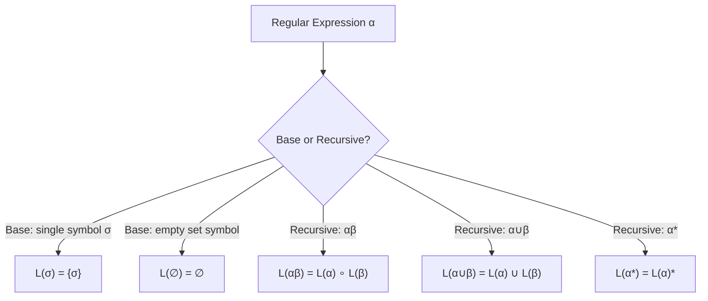

> [!note] Why this matters
> This recursive definition tells us *exactly* how to compute the language a regular expression represents, one small piece at a time — just like how we'd evaluate a mathematical expression using order of operations.

---

## 5. Regular Languages

**The Allowed Characters**$$\mathcal{R} \subseteq (\Sigma \cup \{(, ), \emptyset, \cup, *\})^*$$This means any regular expression is a text string made only from:
- The letters in your alphabet $\Sigma$ (like `0` and `1` or `a` and `b`)
- Parentheses: `(` and `)`
- The empty set symbol: $\emptyset$
- The union symbol: $\cup$ (OR)
- The star symbol: $*$ (repeat zero or more times)

**Rule 1: The Base Building Blocks** $$\emptyset \in \mathcal{R} \quad \text{and} \quad \forall_{\sigma \in \Sigma} (\sigma \in \mathcal{R})$$
Before combining anything, these simplest pieces are automatically regular expressions on their own:
- The empty set symbol $\emptyset$ is a valid regex.
- Every individual character from your alphabet (e.g., `0`, `1`, `a`, `b`) is a valid regex on its own.

**Rule 2: How to Combine Them**

If you already have two valid regular expressions, say $\alpha$ and $\beta$, you are allowed to build bigger ones using three operations:
- **Concatenation $(\alpha\beta)$:** Glue them side-by-side.
- **Union $(\alpha \cup \beta)$:** Combine them with an OR.
- **Kleene Star $\alpha^*$:** Apply a repeat loop.

**What "Smallest Set" Means**

Saying $\mathcal{R}$ is the **smallest set** satisfying these rules means there are **no shortcuts or secret extras**:
- A string is a regular expression **if and only if** it starts from the basic blocks in Rule 1 and is assembled step-by-step using Rule 2.
- Anything else (like unmatched parentheses `((0` or illegal symbols) is strictly not a regular expression.
---

## 6. Big Questions About Regular Languages

Four natural questions arise once we have this definition:

1. Is the union/intersection/complement of regular languages regular?
2. Is the concatenation/Kleene Star of regular languages regular?
3. How many regular languages are there? Are *all* languages regular?
4. If not all languages are regular, which ones aren't, and how do we prove it?

### Answers to Questions 1 and 2
**Yes** to both — and this follows immediately just from the **definition of a regular expression** itself! If $\alpha$ and $\beta$ are regular expressions, then by Rule 2, $(\alpha\beta)$, $(\alpha \cup \beta)$, and $\alpha^*$ are automatically also regular expressions. So the family of regular languages is automatically closed under union, concatenation, and Kleene star.

### Answer to Question 3: Counting regular languages

**Theorem:** The set $\mathcal{R}$ of regular expressions over an alphabet $\Sigma$ is **countably infinite**.

**Why?** Every regular expression is a finite-length string built from a finite alphabet (symbols of $\Sigma$ plus $\{, \}, (, ), \emptyset, \cup, *$). The set of all finite strings over a finite alphabet is countable (you can list them by length, then alphabetically within each length).

**Consequence:**
- Since a language $L$ is regular iff it's represented by *some* regular expression, and there are only countably many regular expressions, there are only **countably many regular languages**.
- But recall from [[#1. Recap - Languages and Concatenation]] that the set of **all** languages over $\Sigma$ is **uncountably infinite**.

**Conclusion:** Since countably infinite < uncountably infinite in cardinality:

> [!important] Key Theorem
> **Uncountably infinite languages are not regular.**

This directly answers Question 4 in a nonconstructive way — there *must* exist non-regular languages, simply by a counting/cardinality argument, even before we can point to a specific example.

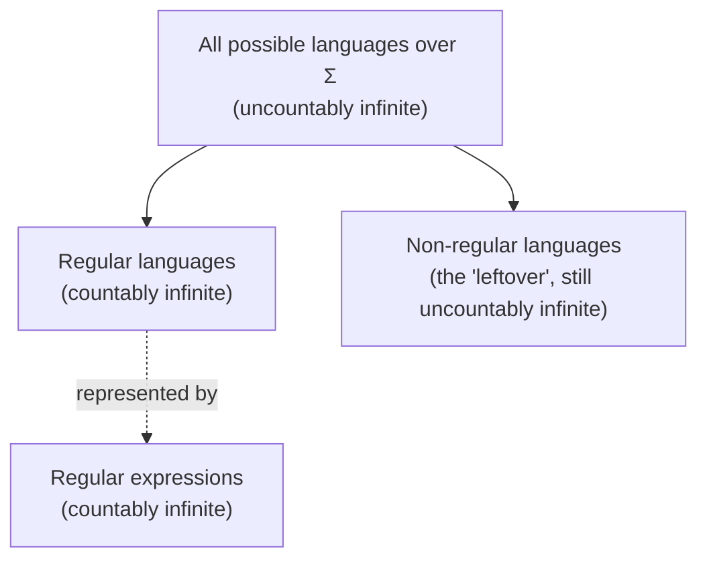

---

## 8. The Toll Gate Example

### Setup
We want to design a "computer" that controls a toll gate.
- When a car arrives, the gate is **closed**.
- The gate **opens** once the driver has paid **25 cents or more**.
- Only three coin types exist: **5, 10, and 25 cents**.
- No change is given back (so overpaying is fine, but nothing is refunded).

### The states
At any moment, the machine is in one of six states, tracking how much money has been collected so far:

| State | Meaning |
|---|---|
| $q_0$ | Initial state — no money collected yet |
| $q_1$ | Exactly 5 cents collected |
| $q_2$ | Exactly 10 cents collected |
| $q_3$ | Exactly 15 cents collected |
| $q_4$ | Exactly 20 cents collected |
| $q_5$ | 25 cents or more collected — **final/accepting state**, gate opens |

### Walking through an example
Suppose the driver inserts coins in this order: **10, 5, 5, 10**.

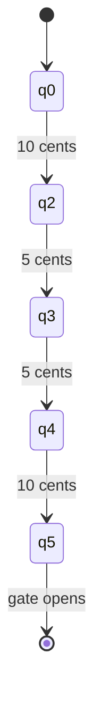

Step by step:
1. Start in $q_0$ (nothing collected).
2. First coin is 10 cents → move to $q_2$ (10 cents total).
3. Next coin is 5 cents → move to $q_3$ (15 cents total).
4. Next coin is 5 cents → move to $q_4$ (20 cents total).
5. Next coin is 10 cents → move to $q_5$ (30 cents total, ≥25). **Gate opens.**

### Full pictorial representation

The complete machine, drawn as a state diagram, shows every possible transition for every coin at every state:

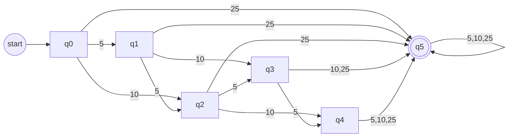

**Key visual conventions:**
- $q_5$ is drawn with **two circles** (double circle) because it's a special *accepting/final* state — as soon as the machine reaches it, the gate opens.
- $q_0$ has an incoming arrow from nowhere (labeled "start"), marking it as the **start state**.

### Why this matters
The machine only ever needs to remember **which state it's in** — a single piece of information out of six possibilities. It does *not* need to remember the entire sequence of coins inserted, their order, or anything else. This is the essence of "small amount of memory."

### Bonus example: Coffee/Tea vending machine
A richer example with **two accepting states**:
- Accepts 5, 10, 25 cent coins.
- At 20+ cents deposited, customer can press **Tea** and get tea.
- At 30+ cents deposited, customer can press **Coffee** and get coffee.

This has states $s_0$ through $s_6$, with $s_4$ and $s_6$ both being accepting states (one for "tea available," one for "coffee available"), illustrating that a machine can have **multiple** accepting states representing different valid outcomes.

---

## 9. Deterministic Finite Automaton (DFA)

### How the machine operates physically

Picture the machine as having:
- An **input tape**, divided into squares, each holding one symbol.
- A **reading head** that points at one square at a time.
- A **finite control**, which is always in exactly one of a finite number of states.

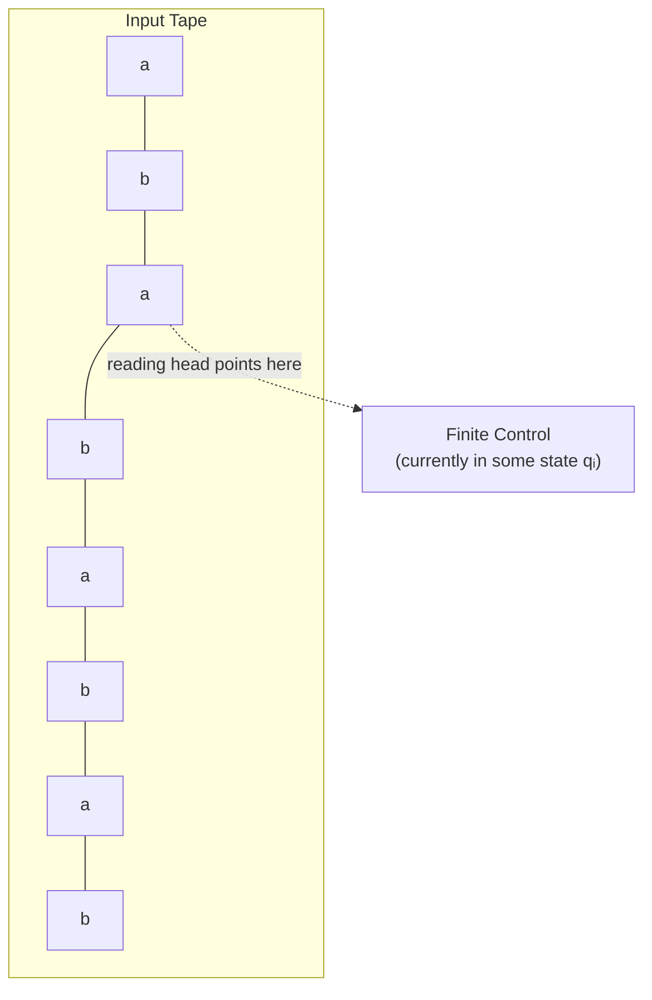

**How it works:**
1. Initially, the reading head points at the **leftmost square**, and the finite control is in a designated **initial state**.
2. At each step, the machine **reads one symbol**, then moves to a **new state** determined entirely by (a) the current state and (b) the symbol just read.
3. After reading, the head moves **one square to the right**.
4. This repeats until every symbol on the tape has been read.

Because the next state depends *only* on the current state and the current input symbol (never on anything to the left that's already been read, and never with any ambiguity or choice), this is called a **deterministic finite automaton**.

### Formal Definition

A deterministic finite automaton is a **5-tuple**:

$$M = (K, \Sigma, \delta, s, F)$$

where:

| Symbol                                   | Meaning                                            |
| ---------------------------------------- | -------------------------------------------------- |
| $K$                                      | A finite set, whose elements are called **states** |
| $\Sigma$                                 | A finite set, called the **alphabet**              |
| $s \in K$                                | The **initial state**                              |
| $F \subseteq K$                          | The set of **final/accept states**                 |
| $\delta : K \times \Sigma \rightarrow K$ | The **transition function**                        |

The transition function $\delta$ is the heart of the machine: given a current state and an input symbol, it tells you exactly which state to go to next. Because it's a genuine *function* (not a relation that could point to multiple places), every state-symbol pair has exactly **one** defined next state — this is what "deterministic" means formally.

### Worked example: strings with an even number of b's

Let $M = (K, \Sigma, \delta, s, F)$ where:
- $K = \{q_0, q_1\}$
- $\Sigma = \{a, b\}$
- $s = q_0$
- $F = \{q_0\}$

Transition table:

| $q$ | $\sigma$ | $\delta(q, \sigma)$ |
|---|---|---|
| $q_0$ | $a$ | $q_0$ |
| $q_0$ | $b$ | $q_1$ |
| $q_1$ | $a$ | $q_1$ |
| $q_1$ | $b$ | $q_0$ |

**Graphical representation (state diagram):**

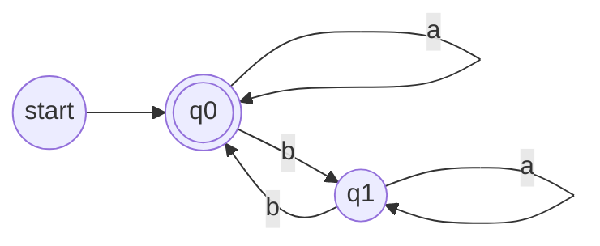

**What strings does this accept?** Strings in $\{a,b\}^*$ that have an **even number of b's**. The intuition: state $q_0$ means "even b's seen so far," state $q_1$ means "odd b's seen so far." Reading a $b$ flips the parity; reading an $a$ doesn't change it. We accept only if we end in $q_0$ (even).

### Worked example: the DFA for the toll gate

Recall the toll gate machine. Formally:
- $K = \{q_0, q_1, q_2, q_3, q_4, q_5\}$
- $\Sigma = \{5, 10, 25\}$
- $s = q_0$
- $F = \{q_5\}$

And $\delta$ given by the table:

| | 5 | 10 | 25 |
|---|---|---|---|
| $q_0$ | $q_1$ | $q_2$ | $q_5$ |
| $q_1$ | $q_2$ | $q_3$ | $q_5$ |
| $q_2$ | $q_3$ | $q_4$ | $q_5$ |
| $q_3$ | $q_4$ | $q_5$ | $q_5$ |
| $q_4$ | $q_5$ | $q_5$ | $q_5$ |
| $q_5$ | $q_5$ | $q_5$ | $q_5$ |

### Worked example: no three consecutive b's

$L = \{w \in \{a,b\}^* : w \text{ does not contain three consecutive } b\text{'s}\}$

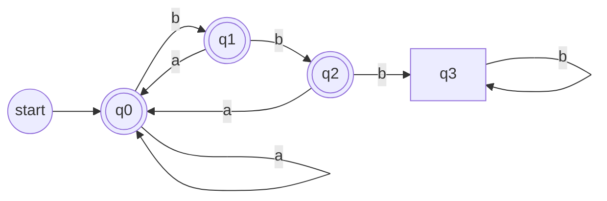

Here $q_0, q_1, q_2$ are all accepting states (we haven't yet seen three $b$'s in a row), and $q_3$ is a **trap/dead state**: once we hit three consecutive $b$'s, we can never escape rejection, no matter what comes next.

### Worked example: ends with b, no "aa" substring

$L = \{w \in \{a,b\}^* \mid w \text{ ends with } b \text{ and does not contain the substring } aa\}$

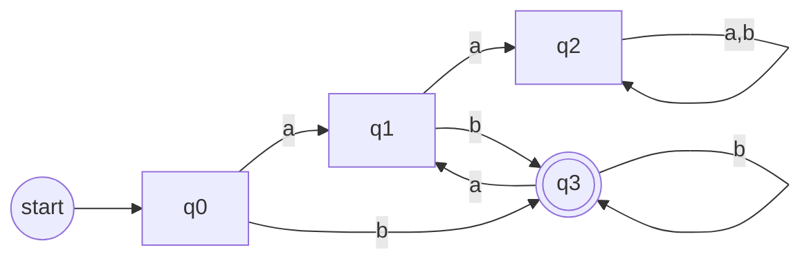

Here $q_2$ is a **dead/trap state** (reached after seeing "aa", from which we can never satisfy the "no aa" condition again), and $q_3$ is the only accepting state (we're accepting only when the string ends right after a $b$, having never seen "aa").

> [!note] Every DFA generates a language
> This is the flip side of regular expressions: while a regular expression is a *formula* that describes a language, a DFA is a *machine* that decides membership in a language. We'll soon see (though not proven in these lectures) that these two ways of describing regular languages are **exactly equivalent** in power.

### A trickier exercise: 1 in the third position from the right

$L = \{w \in \{0,1\}^* : w \text{ has a 1 in the third position from the right}\}$

**The challenge:** How does the automaton "know" it has reached the third-to-last symbol, when it can only read left to right and doesn't know how long the string is or when it will end?

**The trick:** Remember the **last three symbols read** at all times, using a state naming scheme $q_{ijk}$ where $i, j, k \in \{0, 1\}$:
- If the machine has read $\geq 3$ symbols: $ijk$ are the three most recently read symbols.
- If it has read exactly 2 symbols: those two symbols are $jk$, and $i = 0$ (placeholder).
- If it has read exactly 1 symbol: that symbol is $k$, and $i = j = 0$.
- If it has read 0 symbols: $i = j = k = 0$.

This gives **8 states** total: $q_{000}, q_{001}, q_{010}, q_{011}, q_{100}, q_{101}, q_{110}, q_{111}$.

**Accepting states:** Any $q_{ijk}$ where $i = 1$ (meaning: the symbol currently in the third-from-last position is a $1$) — that's $q_{100}, q_{101}, q_{110}, q_{111}$.

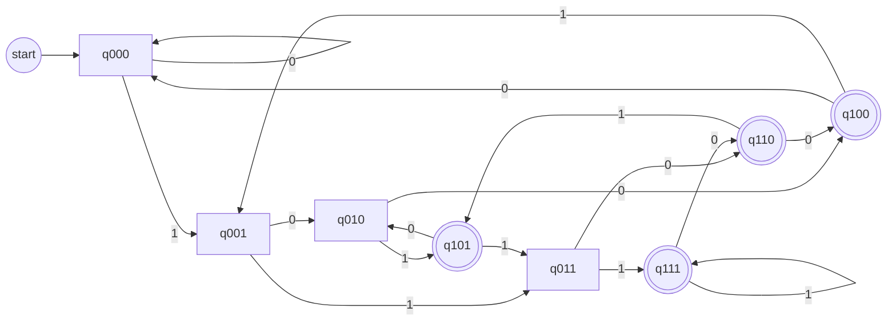

> [!tip] Design pattern: "remembering a sliding window"
> This is a very common and powerful DFA-design trick: whenever a problem asks about "the last $k$ symbols" or "a fixed distance from the end," encode that fixed-size window into the state itself. Since $k$ is fixed, the number of states stays finite (here, $2^3 = 8$).

---

## 10. Computation and Acceptance by DFA

### Configuration
A **configuration** of a DFA $(K, \Sigma, \delta, s, F)$ is an element of $K \times \Sigma^*$ — i.e., a pair (current state, remaining unread input).

**Why not track the whole string?** Because a DFA is never allowed to move its reading head backward into already-read input. The part of the string to the *left* of the head can never influence future behavior. So all that matters is (a) what state you're in, and (b) what's left to read.

**Example:** In the figure below, if the head is pointing at the third symbol (`a`) and the machine is currently in state $q_2$, the configuration is $(q_2, ababab)$ — the state, plus everything from the current head position onward.

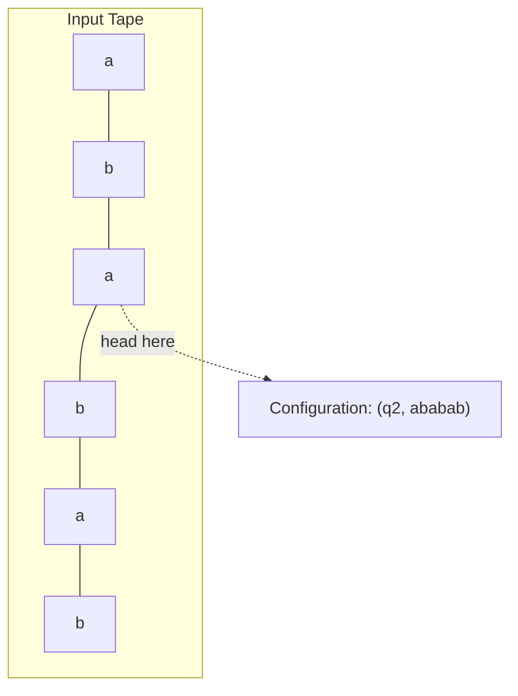

### The "yields" relation ($\vdash_M$)

Computation is a **binary relation** between two configurations — it captures moving from one configuration to another in exactly **one step**.

**Formal definition:** If $(q, w)$ and $(q', w')$ are two configurations of DFA $M$, then:

$$(q, w) \vdash_M (q', w')$$

if and only if:
$$w = aw' \text{ for some symbol } a \in \Sigma \text{ and } \delta(q, a) = q'$$

In words: the unread input $w$ starts with symbol $a$; after removing that symbol (leaving $w'$) and transitioning via $\delta$, we land in state $q'$. We say "$(q,w)$ **yields** $(q',w')$ in one step."

> [!info] Dropping the subscript
> When it's clear which machine $M$ we're talking about, we just write $\vdash$ instead of $\vdash_M$.

A configuration of the form $(q, e)$ means the DFA has read **all** its input — computation stops here.

### The reflexive, transitive closure: $\vdash_M^*$

We denote the **reflexive, transitive closure** of $\vdash_M$ by $\vdash_M^*$. This means:

$$(q, w) \vdash_M^* (q', w')$$

means $(q,w)$ yields $(q',w')$ in **finitely many steps** (possibly **zero** steps — that's the "reflexive" part; "transitive" means you can chain any number of single steps together).

> [!info] Reflexive + Transitive Closure, explained simply
> - **Reflexive** means every configuration relates to itself in "0 steps" — you're already where you are.
> - **Transitive** means if $A$ leads to $B$ and $B$ leads to $C$ (each possibly through many steps), then $A$ leads to $C$ too.
> - Combined, $\vdash^*$ is just "can eventually get from here to there, in any number of steps including none."

### Acceptance

A string $w \in \Sigma^*$ is **accepted** by DFA $M$ if and only if there is a state $q \in F$ such that:

$$(s, w) \vdash_M^* (q, e)$$

where $s$ is the initial state. In plain words: starting from the initial configuration with the whole string $w$ unread, after processing all of $w$, we end up in **some accepting state**.

The **language accepted by $M$**, written $L(M)$, is the set of *all* strings accepted by $M$.

### Worked example: tracing "babb"

Using the DFA from the "no three consecutive b's" example (renamed here per this specific worked trace), with input `babb`:

$$(q_0, babb) \vdash_M (q_3, abb)$$
$$\vdash_M (q_1, bb)$$
$$\vdash_M (q_3, b)$$
$$\vdash_M (q_3, e)$$

So: $(q_0, babb) \vdash_M^* (q_3, e)$, and since $q_3$ is an accepting state (double circle in the diagram), **"babb" is accepted by $M$**.

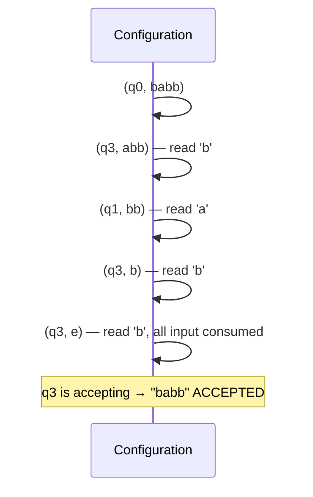

---

## 11. Closure Properties of DFA Languages

Now we ask the same big questions from Section 6, but about DFAs instead of regular expressions:

1. Is the language accepted by DFAs closed under union/intersection/complement?
2. Is it closed under concatenation/Kleene star?
3. How many languages are accepted by DFAs?
4. Which languages are *not* accepted by any DFA?

### Union of DFA Languages

**Theorem:** Languages accepted by DFAs are closed under union (over the same alphabet $\Sigma$).

**Proof idea:**

Let $L$ and $L'$ be accepted by DFAs $M_1$ and $M_2$ respectively. We want a single DFA $M$ such that:

$$M \text{ accepts } w \iff M_1 \text{ accepts } w \text{ or } M_2 \text{ accepts } w$$

**Naive (wrong) idea:** Run $w$ through $M_1$ first, and if that fails, try $M_2$. **This doesn't work** — a DFA can only read the input string **once**, left to right. There's no "rewinding" to try again.

**Correct approach — run both simultaneously via the Cartesian product:**

The trick is to build a new machine whose *state* simultaneously tracks "where $M_1$ would be" and "where $M_2$ would be," as if both were reading the same input in parallel.

Let $M_1 = (K_1, \Sigma, \delta_1, s_1, F_1)$ and $M_2 = (K_2, \Sigma, \delta_2, s_2, F_2)$.

If $M$'s current state is the pair $(r_1, r_2)$, this means:
- If $M_1$ had read the input up to this point, it would be in state $r_1$
- If $M_2$ had read the input up to this point, it would be in state $r_2$

**Construction:** $M = (K, \Sigma, \delta, s, F)$, where:

| Component | Definition |
|---|---|
| States | $K = K_1 \times K_2$ (Cartesian product) |
| Alphabet | $\Sigma$ (same as both) |
| Start state | $s = (s_1, s_2)$ |
| Transition | $\delta((r_1, r_2), a) = (\delta_1(r_1, a), \delta_2(r_2, a))$ |
| Accept states | $F = \{(r_1, r_2) : r_1 \in F_1 \text{ or } r_2 \in F_2\} = (F_1 \times K_2) \cup (F_2 \times K_1)$ |

**Why $F$ is defined this way:** We want $M$ to accept if *either* the "simulated $M_1$" *or* the "simulated $M_2$" would have accepted — that's exactly "union" logic (OR).

Since $K_1$ and $K_2$ are both finite, $K_1 \times K_2$ is finite too — so $M$ is a valid, legitimate DFA. The rest of the proof (that $M$ genuinely accepts $L \cup L'$) follows intuitively from the construction.

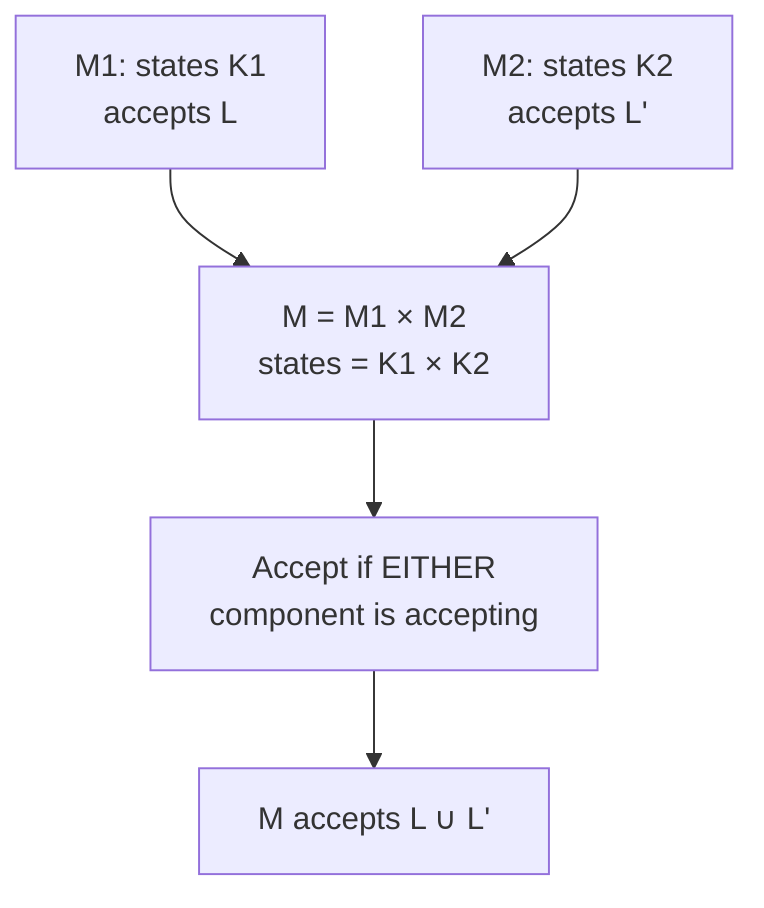

> [!tip] This product construction is reusable
> The exact same Cartesian product idea (with a different definition of $F$) can be used to prove closure under **intersection** — you'd just require *both* $r_1 \in F_1$ **and** $r_2 \in F_2$ instead of "or."

### Complement of DFA Languages

**Question:** If $L$ is accepted by a DFA, is $L^c$ (the complement, i.e., everything *not* in $L$) also accepted by some DFA?

**Example:**
- $L$ = strings in $\{a,b\}^*$ with an **even** number of $b$'s.
- $L^c$ = strings in $\{a,b\}^*$ with an **odd** number of $b$'s.

**The easy trick:** Just **swap the final and non-final states**! Take the exact same DFA for $L$, and flip which states are marked as accepting.

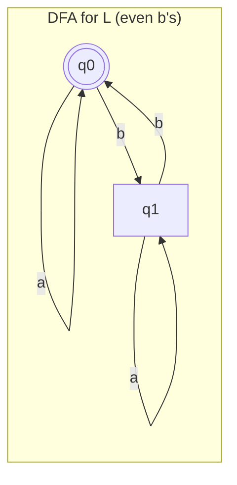

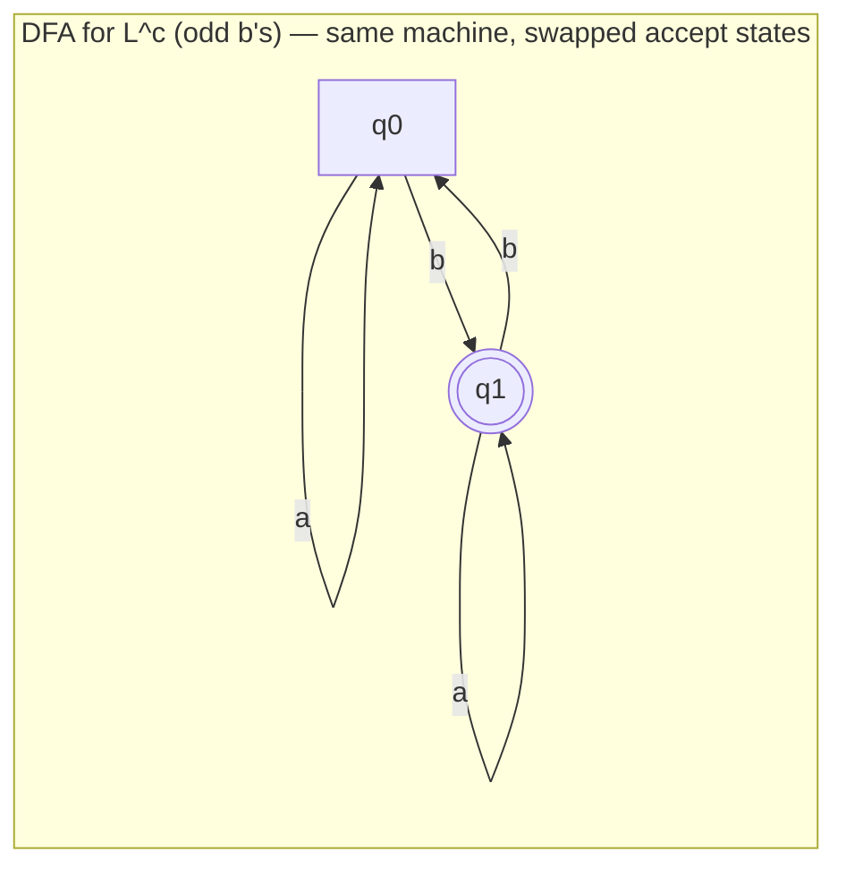

**Why this works in general:** For **any** DFA (as long as it's a *complete* DFA — meaning $\delta$ is defined for every state-symbol pair, so there's always exactly one path forward), a string $w$ ends up in *some* state after being fully read. It's accepted iff that final state is in $F$. So swapping $F$ for $K \setminus F$ flips acceptance exactly for every string — precisely the complement.

### Summary theorem

> [!important] Theorem
> - Languages accepted by DFA are **closed under union** (over the same alphabet).
> - Languages accepted by DFA are **closed under complement**.

(Intersection follows from De Morgan's laws combined with union and complement closure, or directly via the product construction adjusted for "and" instead of "or.")

---

## 12. Nondeterministic Finite Automaton (NFA)

### Motivation: why relax the DFA rules?

Consider trying to build a DFA for:
$$L = (ab \cup aba)^*$$

Some languages are much **easier to describe** if we relax three strict rules that DFAs must follow. An NFA:

1. **May not define** a transition for every state-symbol pair (some combinations can simply have no defined move).
2. **Allows several possible "next states"** for a given combination of current state and input symbol (branching choices).
3. **Allows "empty transitions"** (also called $\epsilon$-transitions) — the machine can move from one state to another **without reading any input symbol at all**.

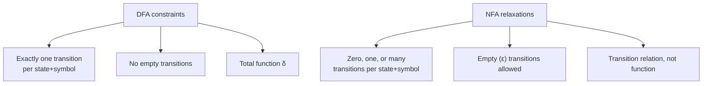

### Formal Definition

A nondeterministic finite automaton is a 5-tuple:

$$M = (K, \Sigma, \triangle, s, F)$$

where:

| Symbol | Meaning |
|---|---|
| $K$ | Finite set of states |
| $\Sigma$ | Finite alphabet |
| $s \in K$ | Initial state |
| $F \subseteq K$ | Set of final/accept states |
| $\triangle$ | The **transition relation**, a subset of $K \times (\Sigma \cup \{e\}) \times K$ |

> [!important] Function vs. relation — the crucial difference
> A DFA's $\delta$ is a **function**: for every (state, symbol) pair, there's *exactly one* output. An NFA's $\triangle$ is a **relation**: for a given (state, symbol) pair, there can be **zero, one, or many** matching next states. This is precisely what "nondeterministic" means.

### Transitions
A triple $(q, a, p) \in \triangle$, where $a \in \Sigma \cup \{e\}$, is called a **transition** of $M$. It means: the machine, in state $q$, reading symbol $a$ on the tape (or taking an empty/$e$ move that reads nothing), can move to state $p$.

### Configuration and the yields relation for NFAs

Just like a DFA, a **configuration** of an NFA $(K, \Sigma, \triangle, s, F)$ is an element of $K \times \Sigma^*$.

If $(q, w)$ and $(q', w')$ are configurations, then:

$$(q, w) \vdash_M (q', w') \iff w = aw' \text{ for some } a \in \Sigma \cup \{e\} \text{ and } (q, a, q') \in \triangle$$

> [!note] $\vdash_M$ is not necessarily a function here
> Unlike the DFA case, since $\triangle$ is a relation, $\vdash_M$ for an NFA may **not** be a function — a single configuration could yield *multiple different* configurations in one step. This is exactly the branching/nondeterminism baked in.

As before, $\vdash_M^*$ denotes the reflexive, transitive closure of $\vdash_M$.

### Acceptance by NFA

A string $w \in \Sigma^*$ is accepted by NFA $M$ if and only if **there exists** a state $q \in F$ such that:

$$(s, w) \vdash_M^* (q, e)$$

> [!important] "There exists" is the key phrase
> A string is accepted if **at least one** sequence of moves leads from the start configuration to *some* accepting configuration — even if many *other* possible sequences of moves would lead to rejection! The NFA only needs to find **one lucky path** through its choices.

Correspondingly, $w$ is **rejected** by $M$ only if **no** sequence of moves at all leads to acceptance — every possible path must fail.

The language accepted by NFA $M$, $L(M)$, is the set of all strings accepted by $M$.

### The "guessing" intuition

As the NFA reads input, at each step it may have multiple legal next states available. The **choice of which one to take is not determined by anything in the model** — this is why it's called nondeterministic. We often describe this informally as the NFA "guessing" the right path that will lead to acceptance, then verifying that guess pans out.

> [!warning] NFAs are not realistic computers!
> Real physical computers are deterministic — they can't magically guess correctly and branch into parallel universes. NFAs are a **theoretical/mathematical modeling tool**, useful because they let us describe complicated languages far more simply. Every NFA can always be converted into an equivalent DFA (a very important theorem, stated here but proved elsewhere), so nothing is lost in computing power — just convenience of description.

### Worked example: 1 in the third position from the right (the NFA way!)

Compare this to the painful 8-state DFA construction from Section 9. With an NFA, this becomes dramatically simpler:

$$L = \{w \in \{0,1\}^* : w \text{ has a 1 in the third position from the right}\}$$

**Idea:** Strings of the form $x100$, $x101$, $x110$, $x111$ (where $x \in \{0,1\}^*$) belong to $L$. So: **stay in a loop state reading anything**, and whenever you see a $1$, **guess** "maybe this is the third-from-last symbol," branch off to check, and see if exactly two more symbols follow before the string ends.

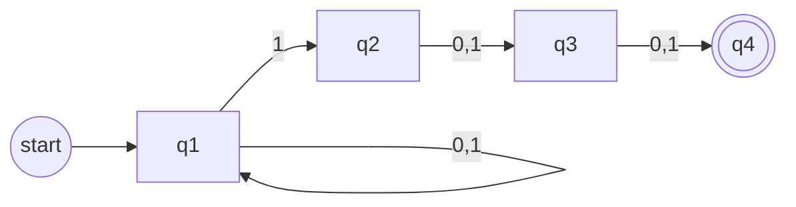

**How it works:** In state $q_1$, the machine can loop forever on any input (this represents "not yet at the interesting part"). At any point it reads a $1$, it can *choose* (nondeterministically) to guess this is the third-from-last symbol and move to $q_2$. From there, it must read exactly two more symbols (any value) to land in the accepting state $q_4$.

**Why nondeterminism helps here:** The machine doesn't need to track anything about *past* symbols in its state — it just needs the freedom to "try" treating any $1$ as the critical one, and only the guesses that happen to be correct (i.e., exactly two symbols remain after) lead to acceptance.

### Worked example: divisibility guess ($k \equiv 0 \mod 2$ or $k \equiv 0 \mod 3$)

Consider an NFA $M$ that accepts:
$$L = \{0^k : k \equiv 0 \bmod 2 \text{ or } k \equiv 0 \bmod 3\}$$

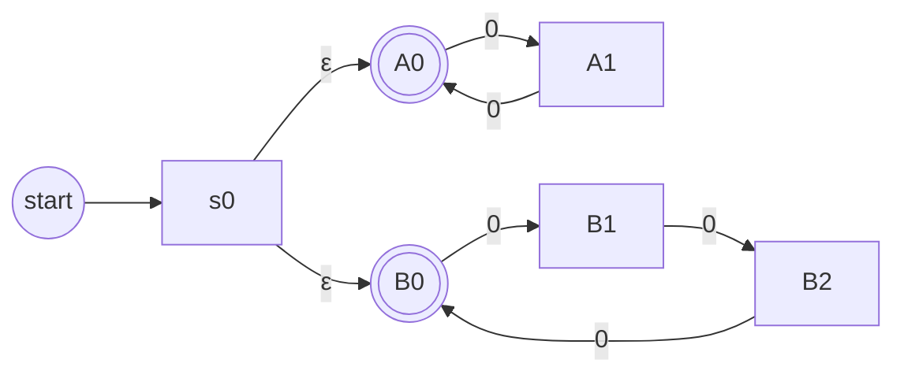

**How it works:** Right at the start, the machine uses **two $\epsilon$-transitions** (empty moves, no input consumed) to nondeterministically split into two "branches":
- **Top branch** ($A_0, A_1$): a 2-state cycle checking "is the number of 0's divisible by 2?"
- **Bottom branch** ($B_0, B_1, B_2$): a 3-state cycle checking "is the number of 0's divisible by 3?"

The machine "guesses" which branch will lead to acceptance and decides accordingly. Since acceptance only requires *one* successful path, if the input has a 0-count divisible by *either* 2 or 3, some path accepts.

**Important detail:** Any string not in $L$ is **rejected** by $M$ — for example, $0^5$ (five 0's — not divisible by 2 or 3) is always rejected, because *neither* branch can land back on an accepting state after exactly 5 steps.

> [!tip] NFAs make "OR" logic trivial
> Notice the pattern: whenever a language is naturally described as "condition A OR condition B," an NFA can often just build two separate simple machines for A and B, then glue their start states together with $\epsilon$-transitions. This is a much cleaner construction than the DFA union technique (Cartesian product) from Section 11!

---

## 13. Summary Cheat Sheet

### Core Definitions At a Glance

| Concept | Definition |
|---|---|
| Language | $L \subseteq \Sigma^*$ |
| Concatenation of words | $w = x \circ y$ |
| Power of a word | $w^0 = e$, $w^{i+1} = w^i \circ w$ |
| Concatenation of languages | $L_1 \circ L_2 = \{xy : x \in L_1, y \in L_2\}$ |
| Kleene Star | $L^* = \{w_1\ldots w_k : k \geq 0, w_i \in L\}$ |
| Kleene Plus | $L^+ = L \circ L^* = \{w_1\ldots w_k : k \geq 1, w_i \in L\}$ |
| Regular expression | Built from $\emptyset$, symbols, using $\cup$, concatenation, $*$ |
| Regular language | $L = \mathcal{L}(\alpha)$ for some regular expression $\alpha$ |
| DFA | 5-tuple $(K, \Sigma, \delta, s, F)$, $\delta: K \times \Sigma \to K$ is a **function** |
| NFA | 5-tuple $(K, \Sigma, \triangle, s, F)$, $\triangle \subseteq K \times (\Sigma \cup \{e\}) \times K$ is a **relation** |

### Key Theorems

1. **Countability:** The set of regular expressions is countably infinite → the set of regular languages is countably infinite → since all languages form an uncountable set, **not all languages are regular**.
2. **Closure (regex level):** Regular languages are closed under union, concatenation, and Kleene star — trivially, by definition.
3. **Closure (DFA level):** Languages accepted by DFAs are closed under union (via Cartesian product construction) and complement (via swapping accept/non-accept states).
4. **DFA = NFA in power:** Every NFA can be converted to an equivalent DFA (stated, not proved in these lectures) — nondeterminism adds convenience, not raw power.

### DFA vs NFA — Side by Side

| Feature | DFA | NFA |
|---|---|---|
| Transition per (state, symbol) | Exactly one | Zero, one, or many |
| Empty ($\epsilon$) moves | Not allowed | Allowed |
| Acceptance condition | The single path ends in $F$ | **At least one** path ends in $F$ |
| Formal transition object | Function $\delta$ | Relation $\triangle$ |
| Ease of design | Sometimes complex (see: 3rd-from-right example) | Often much simpler |
| Realistic model of a computer | Reasonably so | Not directly — theoretical convenience |

### Visual Overview of the Whole Picture

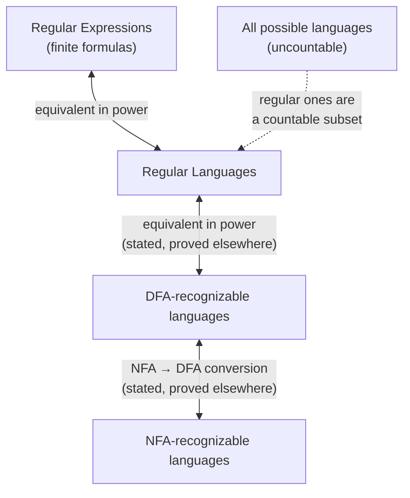

---

## Open Threads / Things to Watch For in Future Lectures
- The formal proof that **every NFA has an equivalent DFA** (subset construction) was mentioned but not proved here.
- The formal proof that **DFA-acceptable languages = regular languages** (Kleene's theorem) ties everything in this note together — watch for it.
- Closure under **intersection** for DFA languages was implied via the product construction but not explicitly completed in these slides.
- Question 4 from Section 6 ("which specific language is not regular, and how do you *prove* it?") was answered only by a **cardinality argument** here — a concrete example and a constructive proof technique (like the Pumping Lemma) likely comes in a later lecture.
