# Theory of Computation (CS F51): Lectures 9-14

> [!note] Diagram label legend
> In the mermaid diagrams: `eps` = $\varepsilon$ (empty move), `empty` = $\emptyset$ (empty set), `U` = union. In the state-elimination diagrams: `A` = $\alpha$, `B` = $\beta$, `G` = $\gamma$, `d` = $\delta$. So `d U A G* B` means $\delta \cup \alpha\gamma^*\beta$.

## Contents

1. [[#1. NFA (Nondeterministic Finite Automaton)]]
2. [[#2. NFA to DFA (Subset Construction)]]
3. [[#3. Closure Properties of FSA]]
4. [[#4. Regular Expression to NFA]]
5. [[#5. FSA to Regular Expression]]
6. [[#6. Non-Regular Languages and Pumping Lemma]]
7. [[#7. FSA State Minimization (Start)]]
8. [[#8. Quick Revision Sheet]]

---

# 1. NFA (Nondeterministic Finite Automaton)

## 1.1 How an NFA differs from a DFA

A DFA has exactly one next state for every (state, symbol). An NFA relaxes three rules:

| Rule | DFA | NFA |
|---|---|---|
| Transition for every (state, symbol) | Must exist | May be missing |
| Number of next states | Exactly 1 | 0, 1 or many |
| Moves without reading input ($\varepsilon$-moves) | Not allowed | Allowed |

**Acceptance idea:** an NFA *guesses* the right path. A string is accepted if **at least one** path leads to a final state.

## 1.2 Example: 1 in the third position from the right

$$L = \{w \in \{0,1\}^* : w \text{ has a 1 in the third position from the right}\}$$

**Idea:** strings look like $x100,\ x101,\ x110,\ x111$ with $x \in \{0,1\}^*$. Stay in $q_1$ reading anything. On a `1`, *guess* "this is the third-from-right 1", then check that exactly 2 more symbols follow.

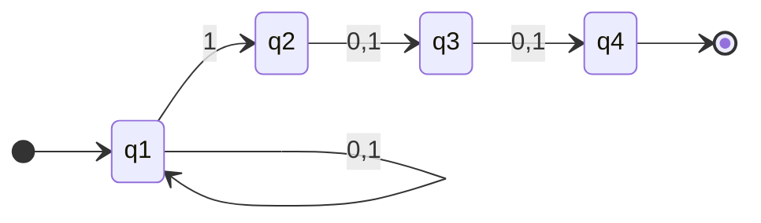

- $q_4$ is the final state.
- The equivalent DFA needs 8 states (it must remember the last 3 symbols). The NFA needs only 4. This is why NFAs are handy for simpler design.

> [!note] Key point
> NFAs are **not** a realistic machine. They are a design tool. Every NFA has an equivalent DFA (Section 2).

## 1.3 Formal Definition

An NFA is a 5-tuple $M = (K, \Sigma, \Delta, s, F)$:

| Symbol | Meaning |
|---|---|
| $K$ | finite set of states |
| $\Sigma$ | alphabet |
| $s \in K$ | start state |
| $F \subseteq K$ | final (accepting) states |
| $\Delta$ | transition **relation**, $\Delta \subseteq K \times (\Sigma \cup \{\varepsilon\}) \times K$ |

- A **transition** is a triple $(q, a, p) \in \Delta$: in state $q$ reading $a$, move to $p$.
- A **configuration** is an element of $K \times \Sigma^*$ (current state, remaining input).
- **Yields in one step:**
  $$(q, w) \vdash_M (q', w') \iff w = aw' \text{ for some } a \in \Sigma \cup \{\varepsilon\} \text{ and } (q, a, q') \in \Delta$$
- $\vdash_M^*$ is the reflexive transitive closure (yields in zero or more steps).
- **Accepted string:** $w$ is accepted iff $(s, w) \vdash_M^* (q, \varepsilon)$ for some $q \in F$.
- $L(M)$ = set of all accepted strings.
- **Rejected:** no sequence of moves reaches a final state with all input consumed.

> [!note] Difference from DFA
> $\Delta$ is a *relation* (can give many or zero results), not a function.

### Configuration and the yields relation for NFAs

Just like a DFA, a **configuration** of an NFA $(K, \Sigma, \triangle, s, F)$ is an element of $K \times \Sigma^*$.

If $(q, w)$ and $(q', w')$ are configurations, then:

$$(q, w) \vdash_M (q', w') \iff w = aw' \text{ for some } a \in \Sigma \cup \{e\} \text{ and } (q, a, q') \in \triangle$$

> [!note] $\vdash_M$ is not necessarily a function here
> Unlike the DFA case, since $\triangle$ is a relation, $\vdash_M$ for an NFA may **not** be a function — a single configuration could yield *multiple different* configurations in one step. This is exactly the branching/nondeterminism baked in.

As before, $\vdash_M^*$ denotes the reflexive, transitive closure of $\vdash_M$.

### Acceptance by NFA

A string $w \in \Sigma^*$ is accepted by NFA $M$ if and only if **there exists** a state $q \in F$ such that:

$$(s, w) \vdash_M^* (q, e)$$

> [!important] "There exists" is the key phrase
> A string is accepted if **at least one** sequence of moves leads from the start configuration to *some* accepting configuration — even if many *other* possible sequences of moves would lead to rejection! The NFA only needs to find **one lucky path** through its choices.

Correspondingly, $w$ is **rejected** by $M$ only if **no** sequence of moves at all leads to acceptance — every possible path must fail.

The language accepted by NFA $M$, $L(M)$, is the set of all strings accepted by $M$.

### The "guessing" intuition

As the NFA reads input, at each step it may have multiple legal next states available. The **choice of which one to take is not determined by anything in the model** — this is why it's called nondeterministic. We often describe this informally as the NFA "guessing" the right path that will lead to acceptance, then verifying that guess pans out.

> [!warning] NFAs are not realistic computers!
> Real physical computers are deterministic — they can't magically guess correctly and branch into parallel universes. NFAs are a **theoretical/mathematical modeling tool**, useful because they let us describe complicated languages far more simply. Every NFA can always be converted into an equivalent DFA (a very important theorem, stated here but proved elsewhere), so nothing is lost in computing power — just convenience of description.

### Worked example: 1 in the third position from the right (the NFA way!)

Compare this to the painful 8-state DFA construction from Section 9. With an NFA, this becomes dramatically simpler:

$$L = \{w \in \{0,1\}^* : w \text{ has a 1 in the third position from the right}\}$$

**Idea:** Strings of the form $x100$, $x101$, $x110$, $x111$ (where $x \in \{0,1\}^*$) belong to $L$. So: **stay in a loop state reading anything**, and whenever you see a $1$, **guess** "maybe this is the third-from-last symbol," branch off to check, and see if exactly two more symbols follow before the string ends.

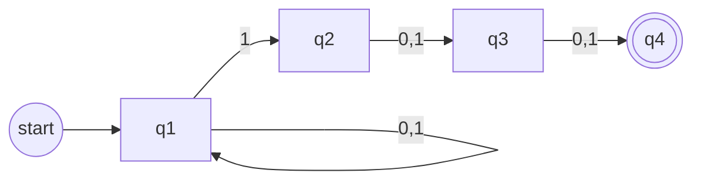

**How it works:** In state $q_1$, the machine can loop forever on any input (this represents "not yet at the interesting part"). At any point it reads a $1$, it can *choose* (nondeterministically) to guess this is the third-from-last symbol and move to $q_2$. From there, it must read exactly two more symbols (any value) to land in the accepting state $q_4$.

**Why nondeterminism helps here:** The machine doesn't need to track anything about *past* symbols in its state — it just needs the freedom to "try" treating any $1$ as the critical one, and only the guesses that happen to be correct (i.e., exactly two symbols remain after) lead to acceptance.

### Worked example: divisibility guess ($k \equiv 0 \mod 2$ or $k \equiv 0 \mod 3$)

Consider an NFA $M$ that accepts:
$$L = \{0^k : k \equiv 0 \bmod 2 \text{ or } k \equiv 0 \bmod 3\}$$

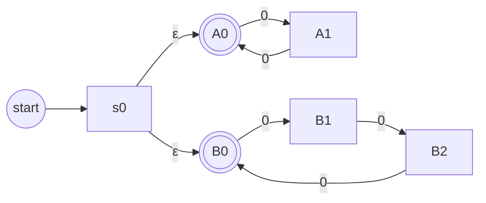

**How it works:** Right at the start, the machine uses **two $\epsilon$-transitions** (empty moves, no input consumed) to nondeterministically split into two "branches":
- **Top branch** ($A_0, A_1$): a 2-state cycle checking "is the number of 0's divisible by 2?"
- **Bottom branch** ($B_0, B_1, B_2$): a 3-state cycle checking "is the number of 0's divisible by 3?"

The machine "guesses" which branch will lead to acceptance and decides accordingly. Since acceptance only requires *one* successful path, if the input has a 0-count divisible by *either* 2 or 3, some path accepts.

**Important detail:** Any string not in $L$ is **rejected** by $M$ — for example, $0^5$ (five 0's — not divisible by 2 or 3) is always rejected, because *neither* branch can land back on an accepting state after exactly 5 steps.

> [!tip] NFAs make "OR" logic trivial
> Notice the pattern: whenever a language is naturally described as "condition A OR condition B," an NFA can often just build two separate simple machines for A and B, then glue their start states together with $\epsilon$-transitions. This is a much cleaner construction than the DFA union technique (Cartesian product) from Section 11!

---

# 2. NFA to DFA (Subset Construction)

## 2.1 Theorem

> **For every NFA there is an equivalent DFA.** Two automata are *equivalent* if $L(M_1) = L(M_2)$.

**Key idea:** the DFA does not track *one* NFA state. It tracks the **set of all states** the NFA could currently be in.

## 2.2 The $\varepsilon$-closure $E(q)$

$$E(q) = \{ p \in K : (q, \varepsilon) \vdash_M^* (p, \varepsilon) \}$$

In words: all states reachable from $q$ using only $\varepsilon$-moves (including $q$ itself).

## 2.3 Construction

Given NFA $M = (K, \Sigma, \Delta, s, F)$, build DFA $M' = (K', \Sigma, \delta, s', F')$:

| Part | Definition |
|---|---|
| States | $K' = 2^K$ (all subsets of $K$) |
| Start | $s' = E(s)$ |
| Finals | $F' = \{ Q \subseteq K : Q \cap F \neq \emptyset \}$ |
| Transition | $\delta(Q, a) = \bigcup \{ E(p) : p \in K \text{ and } (q, a, p) \in \Delta \text{ for some } q \in Q \}$ |

**Reading $\delta(Q,a)$:** from every state in $Q$, take all $a$-transitions, then add everything reachable by $\varepsilon$-moves.

> [!tip] Practical procedure
> $2^{|K|}$ states is the worst case. Only build **reachable** subsets:
> 1. Compute $s' = E(s)$.
> 2. For each new subset and each symbol, compute $\delta$.
> 3. Add any subset not seen before.
> 4. Stop when no new subsets appear.
> 5. Any subset containing an NFA final state is a DFA final state.

## 2.4 Worked Example

NFA $M$ with states $q_0, \dots, q_4$, start $q_0$, final $q_4$.

Transitions:
- $q_0 \xrightarrow{\varepsilon} q_1$, $q_0 \xrightarrow{b} q_2$
- $q_1 \xrightarrow{a} q_0$, $q_1 \xrightarrow{a} q_4$, $q_1 \xrightarrow{\varepsilon} q_2$, $q_1 \xrightarrow{\varepsilon} q_3$
- $q_2 \xrightarrow{b} q_4$
- $q_3 \xrightarrow{a} q_4$
- $q_4 \xrightarrow{\varepsilon} q_3$

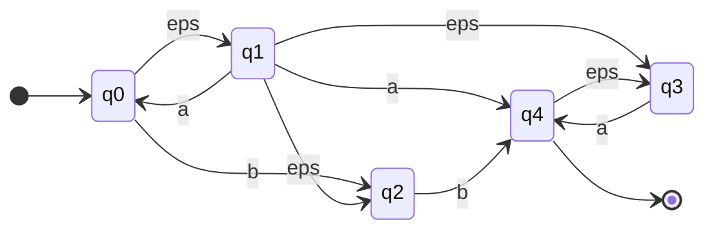

**Step 1: $\varepsilon$-closures**

| State | $E(\cdot)$ |
|---|---|
| $q_0$ | $\{q_0, q_1, q_2, q_3\}$ |
| $q_1$ | $\{q_1, q_2, q_3\}$ |
| $q_2$ | $\{q_2\}$ |
| $q_3$ | $\{q_3\}$ |
| $q_4$ | $\{q_3, q_4\}$ |

**Step 2: Start state**

$$s' = E(q_0) = \{q_0, q_1, q_2, q_3\}$$

**Step 3: Compute transitions**

**From $\{q_0,q_1,q_2,q_3\}$:**
- On $a$: transitions $(q_1,a,q_0)$, $(q_1,a,q_4)$, $(q_3,a,q_4)$. So
  $$\delta(s', a) = E(q_0) \cup E(q_4) = \{q_0,q_1,q_2,q_3,q_4\}$$
- On $b$: transitions $(q_0,b,q_2)$, $(q_2,b,q_4)$. So
  $$\delta(s', b) = E(q_2) \cup E(q_4) = \{q_2,q_3,q_4\}$$

**From $\{q_0,q_1,q_2,q_3,q_4\}$** (call it $A$):
- $\delta(A, a) = E(q_0) \cup E(q_4) = A$
- $\delta(A, b) = E(q_2) \cup E(q_4) = \{q_2,q_3,q_4\}$

**From $\{q_2,q_3,q_4\}$** (call it $B$):
- $\delta(B, a) = E(q_4) = \{q_3,q_4\}$
- $\delta(B, b) = E(q_4) = \{q_3,q_4\}$

**From $\{q_3,q_4\}$** (call it $C$):
- $\delta(C, a) = E(q_4) = \{q_3,q_4\} = C$
- $\delta(C, b) = \emptyset$

**From $\emptyset$:** $\delta(\emptyset, a) = \delta(\emptyset, b) = \emptyset$. No new state, so stop.

**Final states:** every subset containing $q_4$: $A$, $B$, $C$.

**Resulting DFA (5 reachable states instead of 32):**

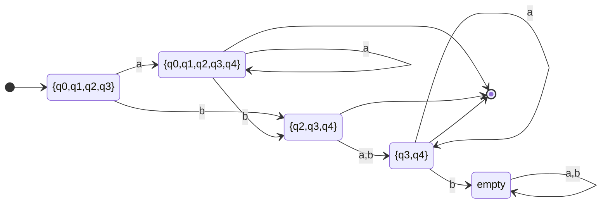

| DFA state | on $a$ | on $b$ | Final? |
|---|---|---|---|
| $\{q_0,q_1,q_2,q_3\}$ | $A$ | $B$ | No |
| $A=\{q_0,q_1,q_2,q_3,q_4\}$ | $A$ | $B$ | Yes |
| $B=\{q_2,q_3,q_4\}$ | $C$ | $C$ | Yes |
| $C=\{q_3,q_4\}$ | $C$ | $\emptyset$ | Yes |
| $\emptyset$ | $\emptyset$ | $\emptyset$ | No |

## 2.5 Proof that $L(M) = L(M')$

**Claim:** for any $w \in \Sigma^*$ and $p, q \in K$:

$$(q, w) \vdash_M^* (p, \varepsilon) \iff (E(q), w) \vdash_{M'}^* (P, \varepsilon) \text{ for some set } P \ni p$$

Proof by **induction on $|w|$**.

**Base case ($w = \varepsilon$):**
- $(q,\varepsilon) \vdash_M^* (p,\varepsilon)$ means $p \in E(q)$ by definition of $E$.
- $M'$ is a DFA, so $(E(q),\varepsilon) \vdash_{M'}^* (P,\varepsilon)$ forces $P = E(q)$.
- So $p \in P$ exactly when $p \in E(q)$. Base case holds.

**Inductive step:** assume the claim for all strings of length $\le k$. Let $w = va$ with $a \in \Sigma$, $|v| = k$.

Suppose $(q, w) \vdash_M^* (p, \varepsilon)$. Then there are states $r_1, r_2$ with

$$(q, va) \vdash_M^* (r_1, a) \vdash_M (r_2, \varepsilon) \vdash_M^* (p, \varepsilon)$$

1. $(q, v) \vdash_M^* (r_1, \varepsilon)$ with $|v| = k$. By hypothesis, $(E(q), v) \vdash_{M'}^* (R_1, \varepsilon)$ for some $R_1 \ni r_1$.
2. $(r_1, a, r_2) \in \Delta$, so by construction $E(r_2) \subseteq \delta(R_1, a)$.
3. $(r_2,\varepsilon) \vdash_M^* (p,\varepsilon)$ means $p \in E(r_2)$, so $p \in \delta(R_1, a)$.
4. So $(R_1, a) \vdash_{M'} (P, \varepsilon)$ with $P = \delta(R_1,a) \ni p$.

Hence $(E(q), va) \vdash_{M'}^* (P, \varepsilon)$ with $p \in P$. The converse is left as homework in the lecture.

**Conclusion of theorem:**

$$\begin{aligned}
w \in L(M) &\iff (s, w) \vdash_M^* (f, \varepsilon),\ f \in F \\
&\iff (E(s), w) \vdash_{M'}^* (Q, \varepsilon),\ f \in Q \quad \text{(by Claim)} \\
&\iff (s', w) \vdash_{M'}^* (Q, \varepsilon),\ Q \in F' \\
&\iff w \in L(M')
\end{aligned}$$

## 2.6 Exponential blow-up example

Let $\Sigma = \{a_1, a_2, a_3\}$ and

$$L = \{ w \in \Sigma^* : \text{some symbol } a_i \in \Sigma \text{ does not appear in } w \}$$

**NFA:** new start $s$ with $\varepsilon$-moves to three final states $q_1, q_2, q_3$. State $q_i$ loops on every symbol except $a_i$.

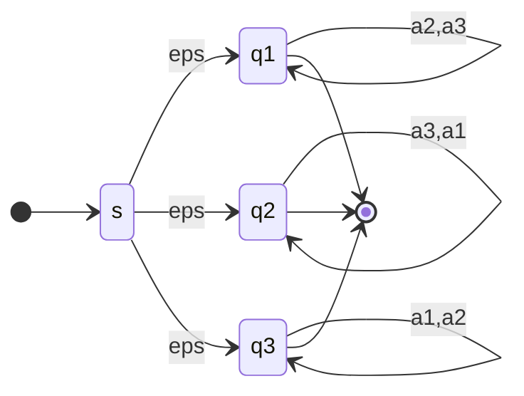

The NFA has 4 states. The DFA must remember **which subset of symbols has been seen so far**, giving roughly $2^{|\Sigma|}$ states. For $k$ symbols the DFA is exponentially larger than the NFA.

---

# 3. Closure Properties of FSA

## 3.1 Theorem

The class of languages accepted by FSA is closed under:

1. Union
2. Concatenation
3. Kleene star
4. Complementation
5. Intersection

> [!note] Shortcuts
> - **Complement:** DFA: swap final and non-final states.
> - **Intersection:** De Morgan: $L_1 \cap L_2 = \overline{\overline{L_1} \cup \overline{L_2}}$.
> - Only union, concatenation and star need new NFA constructions.

## 3.2 Union

**Intuition example:** $L = \{0^k : k \equiv 0 \bmod 2 \text{ or } k \equiv 0 \bmod 3\}$ is the union of $L_1 = \{0^k : k \equiv 0 \bmod 2\}$ and $L_2 = \{0^k : k \equiv 0 \bmod 3\}$.

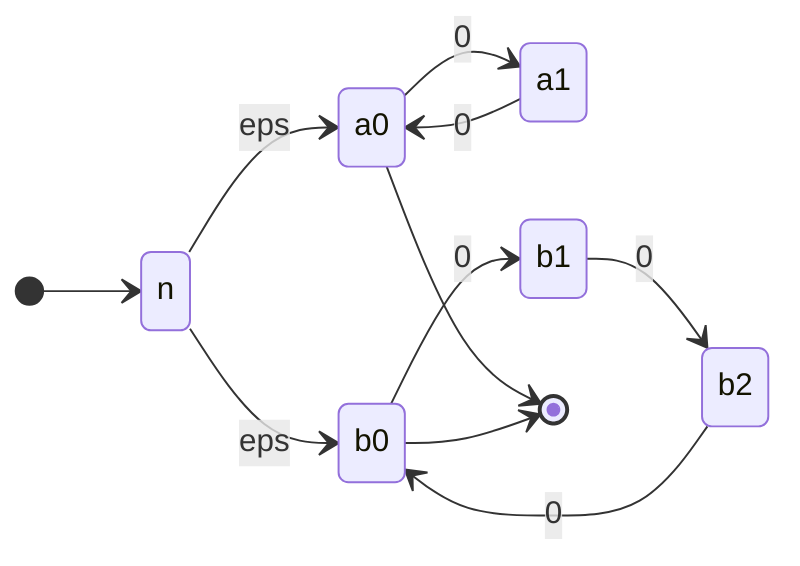

**Construction:** let $M_1 = (K_1, \Sigma, \Delta_1, q_1, F_1)$ and $M_2 = (K_2, \Sigma, \Delta_2, q_2, F_2)$ with $K_1 \cap K_2 = \emptyset$ (rename if needed). Build $M = (K, \Sigma, \Delta, q_0, F)$:

$$K = K_1 \cup K_2 \cup \{q_0\}, \quad F = F_1 \cup F_2$$
$$\Delta = \Delta_1 \cup \Delta_2 \cup \{(q_0, \varepsilon, q_1),\ (q_0, \varepsilon, q_2)\}$$

$q_0$ is a **new** start state that nondeterministically enters $M_1$ or $M_2$.

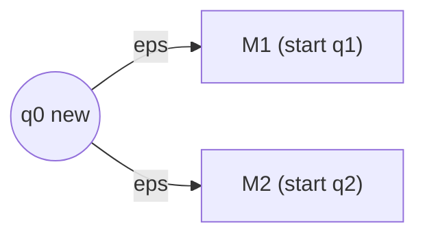

**Why it works:**
$w \in L(M) \iff (q_0,w) \vdash_M^* (q,\varepsilon),\ q \in F \iff$ either $(q_1,w) \vdash^* (q,\varepsilon)$ with $q \in F_1$, or $(q_2,w) \vdash^* (q,\varepsilon)$ with $q \in F_2 \iff w \in L(M_1) \cup L(M_2)$.

## 3.3 Concatenation

Goal: $L(M) = L(M_1)\,L(M_2)$.

**Idea:** run $M_1$ for a while, then **guess** that the $L_1$ part is finished, jump from a final state of $M_1$ to the start of $M_2$, and run $M_2$.

$$K = K_1 \cup K_2, \quad q_0 = q_1, \quad F = F_2$$
$$\Delta = \Delta_1 \cup \Delta_2 \cup \{(f, \varepsilon, q_2) : f \in F_1\}$$

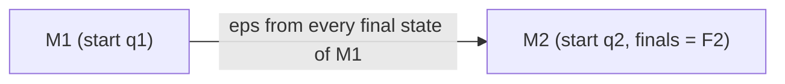

**Why it works:** $w \in L(M)$ iff $w = \sigma\tau$ where $(q_1,\sigma) \vdash_{M_1}^* (f_1,\varepsilon)$ with $f_1 \in F_1$, then the $\varepsilon$ jump to $q_2$, then $(q_2,\tau) \vdash_{M_2}^* (f,\varepsilon)$ with $f \in F_2$. So $\sigma \in L(M_1)$, $\tau \in L(M_2)$.

## 3.4 Kleene Star

Goal: $L(M) = L(M_1)^*$.

**Attempt 1:** add $\varepsilon$ from every final state of $M_1$ back to its start (imitates concatenation loop).

- **Problem 1:** $\varepsilon \in L^*$ always, but if $\varepsilon \notin L(M_1)$ then $\varepsilon$ would not be accepted. *Fix:* make the start state final.
- **Problem 2:** if the old start state is made final and it is not accepting originally but has a **self-loop** (or incoming edges), we would wrongly accept extra strings. Example: start $q_0$ with a `b` self-loop and `a` to final $q_1$ accepts $b^*a$. Making $q_0$ final would wrongly accept $b^*$.

**Final construction:** add a **new start state** $q_0$ that is **final**, with $\varepsilon \to$ old start $q_1$. Also add $\varepsilon$ from each old final state to $q_1$.

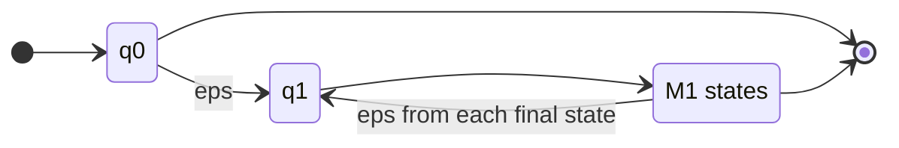

## 3.5 Complement and Intersection

- **Complement:** take a **DFA** for $L$, swap final and non-final states. (Do not swap on an NFA; it does not work.)
- **Intersection:** $L_1 \cap L_2 = \overline{\overline{L_1} \cup \overline{L_2}}$, using complement and union.

## 3.6 Main Result

> **A language is regular if and only if it is accepted by a FSA.**

**Proof of "regular $\Rightarrow$ FSA":**
- Regular languages are the **smallest** class containing $\{a\}$ for each $a \in \Sigma$ and closed under union, concatenation and star.
- Every singleton $\{a\}$ is accepted by a two-state FSA:

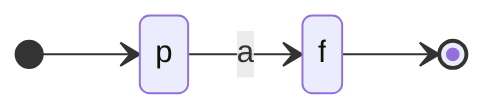

- FSA languages are closed under all three operations (Sections 3.2-3.4).
- So every regular language is accepted by some FSA.

The converse ("FSA $\Rightarrow$ regular") is proven in Section 5.

---

# 4. Regular Expression to NFA

The closure proofs give a mechanical recipe: build NFAs for the smallest pieces, then combine using union, concatenation and star constructions.

| Piece | NFA |
|---|---|
| $\varepsilon$ | one state, both start and final |
| symbol $a$ | start $\xrightarrow{a}$ final |
| $R_1 \cup R_2$ | new start with $\varepsilon$ to both |
| $R_1 R_2$ | $\varepsilon$ from finals of $R_1$ to start of $R_2$ |
| $R_1^*$ | new final start with $\varepsilon$ to $R_1$'s start, $\varepsilon$ back from finals |

## Worked example: $(a \cup \varepsilon)(aa \cup ba)^*$

**Step 1: $(a \cup \varepsilon)$**

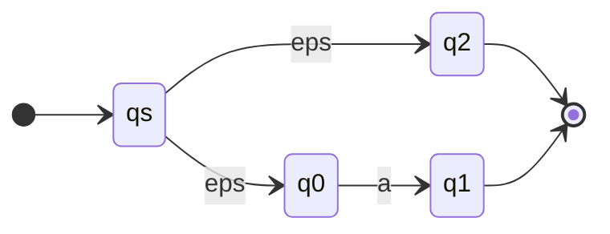

**Step 2: $aa$ and $ba$** (concatenation with $\varepsilon$ link)

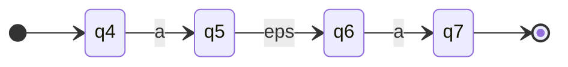

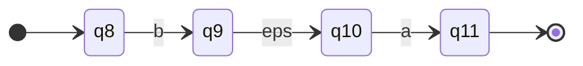

**Step 3: $aa \cup ba$**

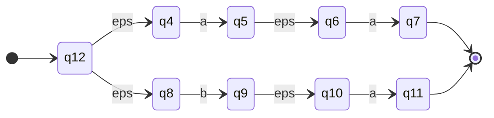

**Step 4: $(aa \cup ba)^*$**: new final start $q_{13}$, $\varepsilon$ into $q_{12}$, and $\varepsilon$ from $q_7$ and $q_{11}$ back to $q_{12}$.

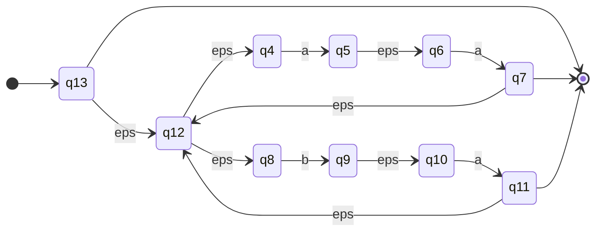

**Step 5: concatenate** $(a \cup \varepsilon)$ with $(aa \cup ba)^*$: add $\varepsilon$ from both finals of Step 1 ($q_2$ and $q_1$) to $q_{13}$. Final states are then those of the starred part.

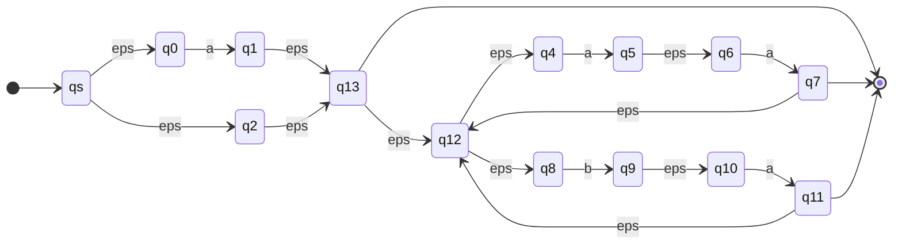

---

# 5. FSA to Regular Expression

## 5.1 Idea

Given FSA $M = (K, \Sigma, \Delta, s, F)$ with $K = \{q_1, \dots, q_n\}$ and $s = q_1$, define

$$R(i,j,k) = \text{set of strings that drive } M \text{ from } q_i \text{ to } q_j \text{ using only intermediate states numbered} \le k$$

($q_i$ and $q_j$ themselves may be numbered above $k$.)

When $k = n$, all states are allowed:

$$R(i,j,n) = \{ w \in \Sigma^* : (q_i, w) \vdash_M^* (q_j, \varepsilon) \}$$

$$L(M) = \bigcup \{ R(1, j, n) : q_j \in F \}$$

## 5.2 Claim: every $R(i,j,k)$ is regular (induction on $k$)

**Base case $k = 0$** (no intermediate states allowed):

$$R(i,j,0) = \{ a \in \Sigma \cup \{\varepsilon\} : (q_i, a, q_j) \in \Delta \}$$

This is a finite set (at most $|\Sigma| + 1$ elements), so regular.

**Inductive step:** assume all $R(i,j,k-1)$ are regular. To go from $q_i$ to $q_j$ with intermediates $\le k$, either:

1. **Never use $q_k$:** a string in $R(i,j,k-1)$.
2. **Use $q_k$:** go $q_i \to q_k$, then loop at $q_k$ zero or more times, then $q_k \to q_j$. Each part uses intermediates $\le k-1$.

$$\boxed{R(i,j,k) = R(i,j,k-1) \ \cup\ R(i,k,k-1)\, R(k,k,k-1)^*\, R(k,j,k-1)}$$

Union, concatenation and star of regular sets are regular. Done.

## 5.3 State Elimination (practical method)

Eliminating a state $q$ that sits between $q_i$ and $q_j$:

- $\alpha$ = label $q_i \to q$
- $\gamma$ = label of self-loop on $q$
- $\beta$ = label $q \to q_j$
- $\delta$ = existing direct label $q_i \to q_j$

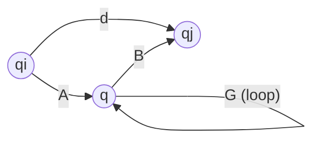

becomes

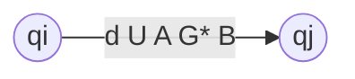

$$\text{new label} = \delta \cup \alpha\,\gamma^*\,\beta$$

> [!important] Do this for **every** pair $(q_i, q_j)$ that passes through $q$, including $q_i = q_j$ (self-loops).

## 5.4 Simplifying assumptions

Make the FSA satisfy:
1. Exactly **one** final state $f$.
2. No transitions **into** the start state $s$ and none **out of** $f$.

If not, add a new start $s$ and new final $f$ with $\varepsilon$ from $s$ to old start and from all old finals to $f$.

Number states $q_1, \dots, q_n$ with $s = q_{n-1}$, $f = q_n$. Target: $R(n-1, n, n)$. Compute bottom-up: $R(\cdot,\cdot,0)$, then $R(\cdot,\cdot,1)$, and so on. Omit arrows labelled $\emptyset$ and self-loops labelled $\{\varepsilon\}$.

## 5.5 Worked Example

NFA (after adding new start $q_4$ and new final $q_5$):

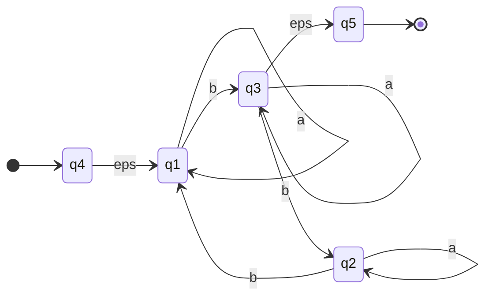

**$k=0$:** just the original edges above (this is the starting graph).

**Eliminate $q_1$** (in: $q_4 \xrightarrow{\varepsilon}$, $q_2 \xrightarrow{b}$; loop $a$; out: $\xrightarrow{b} q_3$):

- $q_4 \to q_3$: $\varepsilon \cdot a^* \cdot b = a^*b$
- $q_2 \to q_3$: $b \cdot a^* \cdot b = ba^*b$

```mermaid
stateDiagram-v2
    direction LR
    [*] --> q4
    q4 --> q3: a*b
    q3 --> q3: a
    q3 --> q2: b
    q2 --> q2: a
    q2 --> q3: ba*b
    q3 --> q5: eps
    q5 --> [*]
```

**Eliminate $q_2$** (in: $q_3 \xrightarrow{b}$; loop $a$; out: $\xrightarrow{ba^*b} q_3$):

- $q_3 \to q_3$: existing $a$, plus $b\,a^*\,ba^*b = ba^*ba^*b$. New loop: $a \cup ba^*ba^*b$.

```mermaid
stateDiagram-v2
    direction LR
    [*] --> q4
    q4 --> q3: a*b
    q3 --> q3: a  U  ba*ba*b
    q3 --> q5: eps
    q5 --> [*]
```

**Eliminate $q_3$** (in: $a^*b$; loop $a \cup ba^*ba^*b$; out: $\varepsilon$):

$$R = a^*b\,(a \cup ba^*ba^*b)^*\,\varepsilon$$

```mermaid
stateDiagram-v2
    direction LR
    [*] --> q4
    q4 --> q5: a*b(a  U  ba*ba*b)*
    q5 --> [*]
```

$$\boxed{R = R(4,5,5) = R(4,5,3) = a^*b\,(a \cup ba^*ba^*b)^*}$$

Now both directions hold:

$$\text{regular expression} \iff \text{FSA} \iff \text{regular language}$$

---

# 6. Non-Regular Languages and Pumping Lemma

## 6.1 Why some languages are not regular

- **FSA view:** memory is finite and independent of input length. A machine cannot count unboundedly.
- **Regex view:** an infinite regular language must have infinite subsets with a **repetitive structure**.

**Candidates for non-regular:**
1. $L = \{0^n 1^n : n \ge 0\}$: an FSA would have to remember how many 0s it saw.
2. $L = \{1^p : p \text{ prime}\}$: primes have no repetitive structure.

## 6.2 Pumping Lemma (statement)

> **Let $L$ be regular. Then there is an integer $n \ge 1$ (pumping length) such that every $w \in L$ with $|w| \ge n$ can be written $w = xyz$ with:**
> 1. $y \ne \varepsilon$
> 2. $|xy| \le n$
> 3. $xy^iz \in L$ for every $i \ge 0$

In words: a long enough string has a non-empty piece $y$ near the start that can be repeated any number of times (or deleted) and the string stays in $L$.

```mermaid
flowchart LR
    x["x"] --> y["y (repeat i times)"] --> z["z"]
```

> [!important] Only used to prove a language is **NOT** regular
> The lemma is a necessary condition. It can **never** prove a language is regular.

## 6.3 How to write a pumping lemma proof (template)

1. Assume $L$ is regular. Let $n$ be its pumping length.
2. **Choose** a specific string $w \in L$ with $|w| \ge n$ (this choice is the key step).
3. Since $|xy| \le n$, figure out what $y$ can look like.
4. Pick an $i$ (usually $0$ or $2$) such that $xy^iz \notin L$.
5. Contradiction. So $L$ is not regular.

> [!warning] You do not pick the split. The lemma says a split exists; you must show that **every** valid split fails.

## 6.4 Example 1: $L = \{0^n1^n : n \ge 0\}$

Assume regular, pumping length $n$. Choose $w = 0^n1^n$. Then $w \in L$, $|w| = 2n \ge n$.

Take any split $w = xyz$ with $y \neq \varepsilon$, $|xy| \le n$.
- $|xy| \le n$ so $y$ lies inside the block of 0s: $y = 0^r$ with $r \ge 1$.
- Pump down ($i = 0$): $xy^0z = xz = 0^{n-r}1^n$.
- Since $r \ge 1$, the number of 0s is less than the number of 1s, so $xz \notin L$.

Contradiction. **$L$ is not regular.**

> [!tip] Choosing the right string
> $w = 0^{n/2}1^{n/2}$ does **not** work: $y$ could sit in a place that allows pumping. Choose $w$ so that $|xy| \le n$ forces $y$ into one uniform block.

## 6.5 Example 2: $L = \{0^p : p \text{ prime}\}$

Assume regular, pumping length $n$. Choose $w = 0^p$ with $p \ge n$ prime. (Text uses $w = 0^n$ with $n$ prime.)

Split: $x = 0^q$, $y = 0^r$, $z = 0^s$ with $r \ge 1$, $q + r + s = p$.

By the lemma, $xy^iz = 0^{q + ir + s} \in L$, so $q + ir + s$ must be prime for all $i \ge 0$.

Pick $i = q + 2r + s + 2$. Then

$$q + ir + s = (r+1)(q + 2r + s)$$

Check: $(r+1)(q+2r+s) = qr + 2r^2 + rs + q + 2r + s$, and $q + ir + s = q + qr + 2r^2 + rs + 2r + s$. They match. Both factors are $\ge 2$ (since $r \ge 1$), so the number is **composite**. Contradiction. **Not regular.**

## 6.6 Example 3: equal number of 0s and 1s

$$L = \{ w \in \{0,1\}^* : \#_0(w) = \#_1(w) \}$$

**Method A (pumping):** identical argument to Example 1 using $w = 0^n1^n$.

**Method B (closure properties):** suppose $L$ were regular. Then

$$L \cap 0^*1^* = \{0^n1^n\}$$

would be regular, because regular languages are closed under intersection. But $\{0^n1^n\}$ is not regular (Example 1). Contradiction.

> [!tip] Exam shortcut
> If a language, intersected with a simple regular language like $0^*1^*$, gives a known non-regular language, you are done in two lines.

## 6.7 Example 4: $L = \{ww : w \in \{0,1\}^*\}$

Assume regular, pumping length $n$. Choose $w = 0^n10^n1$. Then $w \in L$ (it is $uu$ with $u = 0^n1$), $|w| = 2n+2 \ge n$.

Take any split. Since $|xy| \le n$: $x = 0^q$, $y = 0^r$ with $r \ge 1$.

Pump up ($i = 2$): $xy^2z = 0^{n+r}10^n1$. This has **more 0s before the first 1 than after it**, so it cannot be written as $uu$. So $xy^2z \notin L$.

Contradiction. **Not regular.**

## 6.8 Summary table of proofs

| Language | Chosen $w$ | Where $y$ falls | Pump $i$ | Why it breaks |
|---|---|---|---|---|
| $0^n1^n$ | $0^n1^n$ | all 0s | 0 | fewer 0s than 1s |
| $0^p$, $p$ prime | $0^p$ | all 0s | $q+2r+s+2$ | length becomes composite |
| equal 0s and 1s | $0^n1^n$ | all 0s | 0 | unequal counts |
| $ww$ | $0^n10^n1$ | first 0-block | 2 | halves no longer equal |

---

# 7. FSA State Minimization (Start)

**Goal:** given a DFA, produce an equivalent DFA with fewer states.

Example: $L = (ab \cup ba)^*$ accepted by an 8-state machine $M$.

**Observation 1: Unreachable states.** $q_7$ and $q_8$ have no path from the start state.

**Optimization 1:** delete all unreachable states and every transition into or out of them.

**Observation 2: Equivalent states.** $q_4$ and $q_6$: precisely the same strings lead $M$ to acceptance from either. Treat them as **equivalent** and **merge** them.

```mermaid
flowchart TD
    A["Start: full DFA"] --> B["Remove unreachable states"]
    B --> C["Find equivalent states"]
    C --> D["Merge equivalent states"]
    D --> E["Minimal DFA"]
```

> [!note]
> The slides stop here. The general algorithm for finding equivalent states (partition refinement) is not given in these lectures.

---

# 8. Quick Revision Sheet

## Definitions

| Term | Formula / Meaning |
|---|---|
| NFA | $(K, \Sigma, \Delta, s, F)$, $\Delta \subseteq K \times (\Sigma \cup \{\varepsilon\}) \times K$ |
| Accepts $w$ | $(s,w) \vdash^* (q,\varepsilon)$, $q \in F$ |
| $E(q)$ | states reachable from $q$ by $\varepsilon$ only |
| DFA from NFA | $K' = 2^K$, $s' = E(s)$, $F' = \{Q : Q \cap F \ne \emptyset\}$ |
| $\delta(Q,a)$ | $\bigcup \{E(p) : (q,a,p) \in \Delta,\ q \in Q\}$ |

## Constructions cheat-sheet

| Operation | Construction |
|---|---|
| Union | new start, $\varepsilon$ to both starts, $F = F_1 \cup F_2$ |
| Concatenation | $\varepsilon$ from each $f \in F_1$ to $q_2$, $F = F_2$ |
| Star | new **final** start, $\varepsilon$ to old start, $\varepsilon$ from old finals to old start |
| Complement | DFA: swap final and non-final |
| Intersection | De Morgan |

## FSA to regex

$$R(i,j,k) = R(i,j,k-1) \cup R(i,k,k-1)\,R(k,k,k-1)^*\,R(k,j,k-1)$$

State elimination: new label $= \delta \cup \alpha\gamma^*\beta$.

## Pumping lemma

$$\exists n \ge 1\ \ \forall w \in L,\ |w| \ge n\ \ \exists\, w = xyz:\ y \ne \varepsilon,\ |xy| \le n,\ \forall i \ge 0:\ xy^iz \in L$$

Use it by contradiction. Choose $w$ wisely, force $y$ into one block, pump with $i = 0$ or $2$.

## Main equivalences

$$\text{Regular language} \iff \text{DFA} \iff \text{NFA} \iff \text{Regular expression}$$

## Common exam mistakes

- Forgetting to include $\varepsilon$-closure when computing $\delta(Q,a)$.
- Marking a DFA subset final only when **all** members are final (it is **any**).
- Complementing an NFA directly (must convert to DFA first).
- Star construction: making the old start final instead of adding a **new** final start.
- Pumping lemma: choosing the split yourself (must handle **all** splits).
- Using the pumping lemma to "prove" a language is regular (impossible).
