## 2. What is Theory of Computation

The primary aim of this course is to rigorously answer: **"What is computation?"**

Key guiding questions:
- Can we define "computation" *without* referring to a modern physical computer?
- Can we define a computer **mathematically**? (Yes — via **Turing Machines**.)
- Is computation definable independent of today's engineering limits or our current understanding of physics?
- Can a computer solve *any* problem given unlimited time and disk space?
- **Or are there fundamental limits to computation itself?**

> This last question is the heart of the course. The surprising answer (foreshadowed by Hilbert's 10th Problem and the Halting Problem) is: **yes, there are problems no computer — however powerful — can ever solve.**

---

## 3. Mathematical Preparation - Sets

Before building automata and languages, we need a toolkit of set theory.

### Basics
- **Set**: an unordered collection of distinct elements.
- **Subset**: $A \subseteq B$ means every element of $A$ is also in $B$.
- **Set operations**: Union ($\cup$), Intersection ($\cap$), Complement, Difference, etc.

### Power Set
The **power set** of $A$, written $2^A$ or $P(A)$, is the set of **all subsets** of $A$ (including the empty set and $A$ itself).

$$2^A = \{ S : S \subseteq A \}$$

**Key Result:**
$$\text{For any finite set } A, \quad |2^A| = 2^{|A|}$$

**Why?** Think of building a subset by making a yes/no decision for each element: "is this element in my subset or not?" With $n$ elements, that's $n$ independent binary choices, giving $2^n$ total subsets. This is proven rigorously using **Mathematical Induction**, a technique we will use constantly throughout this course.

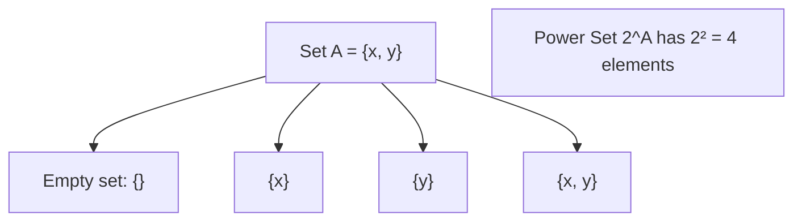

### Partitions
Let $A$ be a set and $\Pi$ a collection of subsets of $A$ (i.e., $\Pi \subseteq 2^A$). We say $\Pi$ is a **partition** of $A$ if:

1. $\emptyset \notin \Pi$ (no empty subsets allowed in the partition)
2. Distinct members of $\Pi$ are **disjoint** (no overlap between any two pieces)
3. $\bigcup \Pi = A$ (the pieces together cover all of $A$)

**Intuition**: A partition slices a set into non-overlapping, non-empty pieces that together reconstruct the whole set — like cutting a pizza into slices with no gaps and no overlaps.

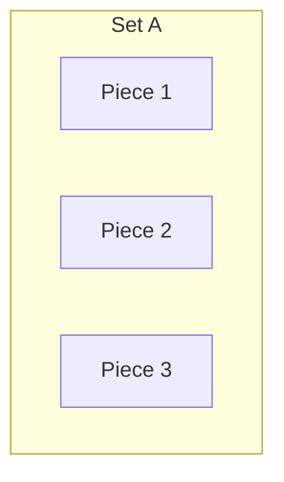

---

## 4. Relations

### Definition
- A **Binary Relation** $R$ on sets $A$ and $B$ is simply a subset of the Cartesian product: $R \subseteq A \times B$.
- A **Binary Relation** $R$ on a single set $A$ is a subset of $A \times A$: $R \subseteq A \times A$.

### Visualizing Relations as Directed Graphs
Any binary relation $R$ on a set $A$ can be drawn as a **directed graph**: draw an arrow from $a$ to $b$ if and only if $(a, b) \in R$.

**Example** (from the lecture): a relation on $\{1, 2, 3, 4\}$

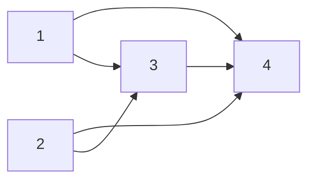

This graph *is* the relation — each arrow represents one ordered pair that belongs to $R$.

### Special Types of Relations on a Set $A$

| Property | Definition | Simple Explanation |
|---|---|---|
| **Reflexive** | $\forall a \in A: (a,a) \in R$ | Every element relates to itself (self-loop on every node) |
| **Symmetric** | $(a,b) \in R \implies (b,a) \in R$ | If there's an arrow one way, there's one back the other way |
| **Transitive** | $(a,b) \in R \land (b,c) \in R \implies (a,c) \in R$ | If you can hop $a \to b \to c$, there's a direct shortcut $a \to c$ |
| **Antisymmetric** | $(a,b) \in R \land (b,a) \in R \implies a = b$ | No two-way arrows between *distinct* elements |


---

## 5. Equivalence Relations and Partial Orders

### Equivalence Classes
Given an equivalence relation $R$ on set $A$, the **equivalence class** of an element $a$, written $[a]$, is the set of all elements related to $a$:

$$[a] = \{ b \in A : (a, b) \in R \}$$

**Theorem**: If $R$ is an equivalence relation on a nonempty set $A$, then the equivalence classes of $R$ form a **partition** of $A$.

**Intuition**: An equivalence relation groups elements into "buckets" of mutually related things. No element falls into two different buckets (disjointness), no bucket is empty, and every element is in some bucket. This is exactly the definition of a partition.

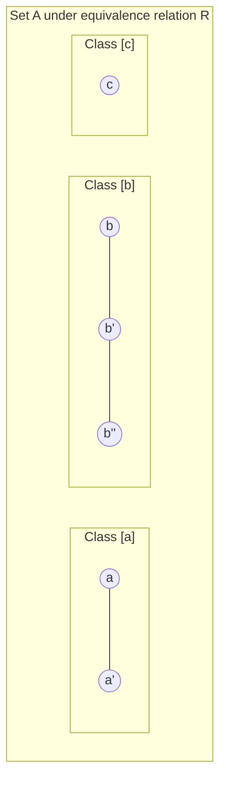

**Classic Example**: "Same remainder when divided by 3" on the integers is an equivalence relation. Its classes are: $\{..., -3, 0, 3, 6, ...\}$, $\{..., -2, 1, 4, 7, ...\}$, $\{..., -1, 2, 5, 8, ...\}$ — exactly 3 classes, and together they partition all integers.

---

## 6. Paths in Relations

### Definition of a Path
A **path** in a binary relation $R$ from element $a$ to element $b$ is a sequence $(a_1, a_2, \dots, a_n)$ where:
- $a_1 = a$
- $a_n = b$
- for each $i$ from 1 to $n-1$: $(a_i, a_{i+1}) \in R$

The **length** of this path is $n$.

### Definition of a Cycle
The path $(a_1, \dots, a_n)$ is a **cycle** if all $a_i$'s are distinct **and** $(a_n, a_1) \in R$ (it loops back to the start).

### Key Theorem: Shortest Paths are Bounded
**Theorem**: Let $R$ be a binary relation on a finite set $A$, and let $a, b \in A$. If there is a path from $a$ to $b$, then there is a path of length **at most $|A|$**.

**Proof (by contradiction using the Pigeonhole Principle):**

1. Let $(a_1, \dots, a_n)$ be a path of *shortest* length from $a$ to $b$, and suppose (for contradiction) that $n > |A|$.
2. Since the path has more than $|A|$ elements but $A$ only has $|A|$ distinct elements, by the **Pigeonhole Principle**, some element must **repeat** on the path: $a_i = a_j$ for some $i < j$.
3. But then we can **cut out the loop** between position $i$ and $j$, forming a shorter path: $(a_1, \dots, a_i, a_{j+1}, \dots, a_n)$.
4. This shorter path is still valid (still goes from $a$ to $b$), which **contradicts** our assumption that we started with the *shortest* path.
5. Therefore, $n \leq |A|$. $\blacksquare$

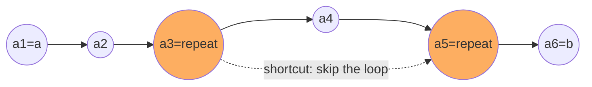

> **Why this matters for the course**: This idea — that if a path exists at all, a "short" one exists — is the theoretical backbone of algorithms for computing reachability (like the transitive closure algorithms below), and later, for proving properties of finite automata.

---

## 7. Finite and Infinite Sets

### Equinumerosity
Two sets $A$ and $B$ are **equinumerous** if there exists a **bijection** (a one-to-one, onto function) $f: A \to B$.

> Intuition: two sets are "the same size" if you can perfectly pair up every element of one with exactly one element of the other, with nothing left over on either side.

### Classifying Sets by Size

```mermaid
graph TD
    S[Any Set] --> F{Equinumerous with<br/>&#123;1,...,n&#125; for some n?}
    F -->|Yes| Finite[Finite Set]
    F -->|No| Infinite[Infinite Set]
    Infinite --> CI{Equinumerous<br/>with N?}
    CI -->|Yes| CountablyInfinite[Countably Infinite]
    CI -->|No| Uncountable[Uncountable]
    Finite --> Countable[Countable]
    CountablyInfinite --> Countable
```

- **Finite set**: equinumerous with $\{1, 2, \dots, n\}$ for some natural number $n$.
- **Infinite set**: not finite.
- **Countably infinite set**: equinumerous with $\mathbb{N}$ (the natural numbers). Such a set can always be listed/enumerated as $\{a_0, a_1, a_2, \dots, a_n, \dots\}$ — i.e., you can list its elements in a never-ending sequence that eventually reaches every element.
- **Countable set**: finite **or** countably infinite.
- **Uncountable set**: a set that is *not* countable — so large it cannot even be listed in an infinite sequence.

---

## 8. Countability

### Important Result 1: Finite Unions of Countably Infinite Sets
> Union of any finite number of countably infinite sets is countably infinite.

**Example**: If $A$, $B$, $C$ are countably infinite, then $A \cup B \cup C$ is also countably infinite.

**Why?** You can "zigzag" between the sets, listing one element from each in turn:

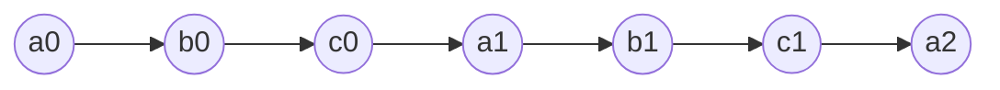

This zigzag pattern (shown in the lecture diagram) guarantees every element from every set eventually gets a position in one master list — proving the union is countable.

### Important Result 2: Countably Infinite Union of Countably Infinite Sets
> A **countably infinite union** of countably infinite sets is *still* countably infinite.

**Key Observation**: The set $\mathbb{Q}$ of **rational numbers is countably infinite** — a surprising fact, since between any two rationals there are infinitely many more, yet the whole set can still be "listed."

### Exercises Given in Lecture
1. Find a precise bijection $\mathbb{N} \times \mathbb{N} \to \mathbb{N}$.
2. If $A$ and $B$ are countably infinite, then $A \times B$ is also countably infinite.
3. What about a countably infinite Cartesian product of countably infinite sets? (Hint: this one behaves very differently — it becomes uncountable, related to the diagonalization argument below.)

### The Diagonal Enumeration Trick
The classic way to prove $\mathbb{N} \times \mathbb{N}$ is countable is Cantor's "diagonal snake" — walking through the grid of pairs $(i,j)$ along diagonals:

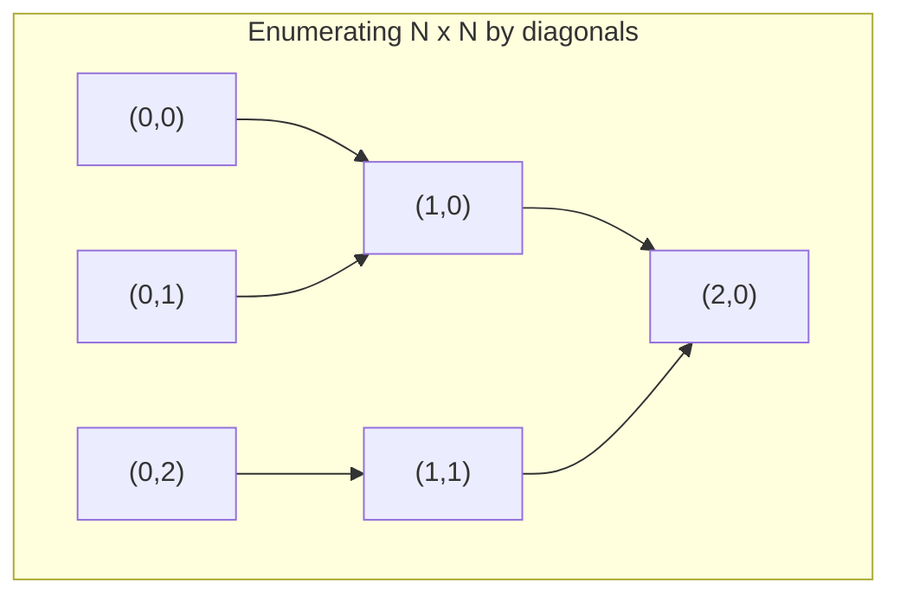

Each diagonal (where the coordinates sum to a constant) has finitely many pairs, so listing diagonal-by-diagonal reaches every pair eventually — proving $\mathbb{N} \times \mathbb{N}$ is countably infinite. This same trick shows $\mathbb{Q}$ is countable (map each rational $p/q$ to a pair $(p,q)$).

---

## 9. Uncountability - Diagonalization

### Theorem: $2^{\mathbb{N}}$ is Uncountable
The set of *all subsets* of the natural numbers is **too big** to be countable. This is one of the most important and beautiful proofs in all of mathematics.

**Proof (Cantor's Diagonalization Argument):**

1. **Assume for contradiction** that $2^{\mathbb{N}}$ is countably infinite.
2. Then we could enumerate *all* subsets of $\mathbb{N}$ as a list: $2^{\mathbb{N}} = \{R_0, R_1, R_2, \dots\}$.
3. **Construct a new set** using the "diagonal" trick:
$$D = \{ n \in \mathbb{N} : n \notin R_n \}$$
   ($D$ contains exactly those numbers $n$ that are *not* members of the $n$-th set in our list.)
4. Since $D \subseteq \mathbb{N}$, and we assumed our list contains *every* subset of $\mathbb{N}$, $D$ must appear somewhere in the list: $D = R_k$ for some $k$.
5. **Now ask the fatal question**: is $k \in R_k$?
   - **Case "Yes"** ($k \in R_k$): But $R_k = D$, and by definition of $D$, $k \in D$ means $k \notin R_k$. **Contradiction.**
   - **Case "No"** ($k \notin R_k$): But then by definition of $D$, this means $k \in D$. Since $D = R_k$, this means $k \in R_k$. **Contradiction.**
6. Either way we get a contradiction, so our original assumption was false. **$2^{\mathbb{N}}$ cannot be countably infinite — it is uncountable.** $\blacksquare$

```mermaid
graph TD
    A["Assume 2^N is countable:<br/>list all subsets as R0, R1, R2..."] --> B["Build D = &#123;n : n not in Rn&#125;"]
    B --> C["D must equal Rk for some k<br/>(since D is a subset of N)"]
    C --> D{"Is k in Rk?"}
    D -->|Yes| E["Then k not in D (by def)<br/>but D = Rk, so k not in Rk<br/>CONTRADICTION"]
    D -->|No| F["Then k in D (by def)<br/>but D = Rk, so k in Rk<br/>CONTRADICTION"]
    E --> G["2^N is UNCOUNTABLE"]
    F --> G
```

> **Intuition (why the diagonal trick works)**: Imagine writing out an infinite grid where row $n$ shows whether element $n$ belongs to set $R_n$ (yes/no for each natural number). The set $D$ is built by **flipping every diagonal entry** of this grid. By construction, $D$ *must* differ from every single $R_n$ in at least the $n$-th position — so it cannot possibly be anywhere on the original list, no matter how the list was made. This proves the list was never complete to begin with.

### Consequences for Languages (previewed here, detailed in Section 12)
- **Fact 1**: For any alphabet $\Sigma$, any language over $\Sigma$ is *countable* (since it's a subset of the countable set $\Sigma^*$).
- **Fact 2**: For any nonempty alphabet $\Sigma$, there are **uncountably many languages** over $\Sigma$ (since the set of *all* languages is $2^{\Sigma^*}$, the power set of a countably infinite set — which by the theorem above is uncountable).

> **Huge implication**: Since there are uncountably many languages but a Turing machine (a finite, describable object) can only be one of *countably many* possible machines/programs, **most languages have no algorithm that can decide them at all**. This is the deep, abstract reason uncomputability must exist — proven here using pure set theory, before we've even defined a Turing machine formally!

---

## 10. Closures

### Intuitive Idea
A set is **closed** under an operation if applying that operation to members of the set always produces another member of the *same* set.

**Examples**:
- $\mathbb{N}$ (natural numbers) is **closed under addition ($+$)**: for any $n, m \in \mathbb{N}$, $n + m \in \mathbb{N}$.
- $\mathbb{N}$ is **NOT closed under subtraction ($-$)**: e.g., $1, 2 \in \mathbb{N}$ but $1 - 2 = -1 \notin \mathbb{N}$.
- $\mathbb{Z}$ (integers) **IS closed under subtraction**.
- Moreover, $\mathbb{Z}$ is the **smallest** set that contains $\mathbb{N}$ and is closed under subtraction.

**Definition**: $\mathbb{Z}$ is called the **closure of $\mathbb{N}$ under subtraction**.

> **General pattern**: The "closure" of a set $S$ under some property/operation is the smallest superset of $S$ that has that property. You start with $S$ and keep adding the minimum extra elements needed until the property holds.

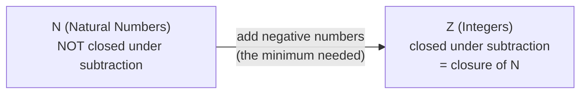

### Reflexive-Transitive Closure Example
Given a relation $R$ (drawn as a directed graph), its **reflexive-transitive closure** $R^*$ is obtained by adding exactly the extra pairs needed to make it reflexive and transitive.

**Example from lecture**: Given $R$ on $\{a_1, a_2, a_3, a_4\}$ with edges $a_1 \to a_4$, $a_2 \to a_4$, $a_2 \to a_3$, $a_3 \to a_4$, $a_1 \to a_3$:

$$R^* = R \cup \{(a_i, a_i) : i = 1,2,3,4\} \cup \{(a_2, a_4)\}$$

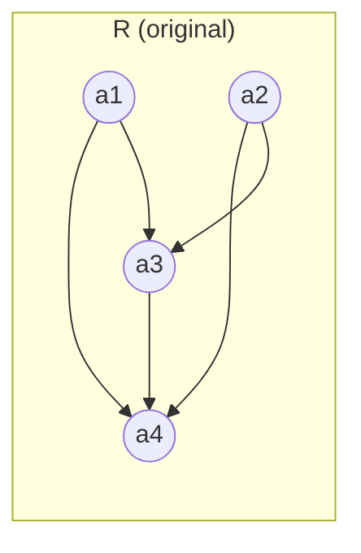

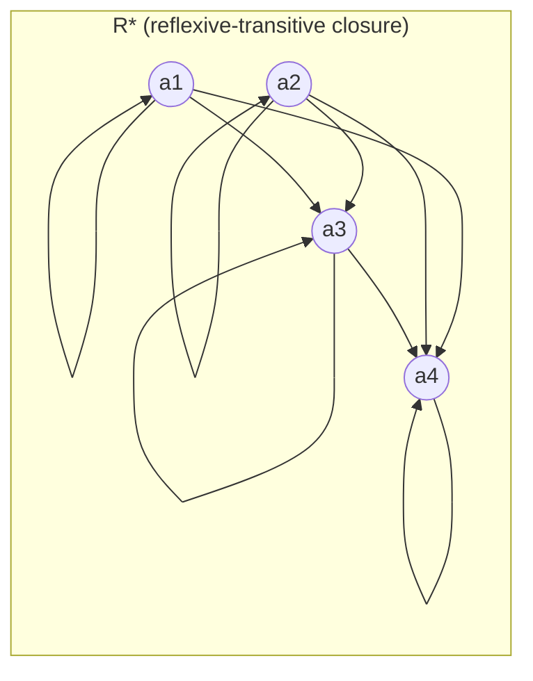

**Observations**:
- $R$ is **neither reflexive nor transitive** as given (no self-loops exist on any node, and not every possible "shortcut" implied by chained edges is already present).
- $R \subseteq R^*$ — the closure always contains the original relation.
- $R^*$ **is** reflexive and transitive (self-loops added on every node; all missing "shortcut" edges added).
- $R^*$ is the **smallest** such set containing $R$ that is reflexive and transitive.

### Two Equivalent Definitions of $R^*$

**Definition 1** (closure-based): $R^*$ is the reflexive-transitive closure of $R$ if and only if:
- $R \subseteq R^*$, and
- $R^*$ is reflexive and transitive, and
- $R^*$ is the **smallest** set with these two properties.

**Definition 2** (path-based, much simpler to compute with):
$$R^* = \{ (a,b) \in A \times A : \text{there is a path from } a \text{ to } b \text{ in } R \}$$

> Definition 2 is preferred algorithmically because "is there a path?" is a concept we can directly turn into an algorithm (as shown next).

---

## 11. Reflexive-Transitive Closure Algorithms

Given the path-based definition, here are two ways to actually **compute** $R^*$ for a finite set $A = \{a_1, \dots, a_n\}$.

### Algorithm 1: Brute-force Path Checking

```
Initially R* := ∅
for i = 1, 2, ..., n do
    for each i-tuple (b1, ..., bi) ∈ A^i do
        if (b1, ..., bi) is a path in R then
            add (b1, bi) to R*
```

**Running Time**: $O(n^{n+1})$

**Why so slow?**
- In the worst case, there are $n^n$ possible tuples to check (choosing $i$ elements from $A$ with repetition, up to length $n$).
- Each tuple check requires $O(n)$ operations (verifying each consecutive pair is actually an edge in $R$).
- Total: $n^n \times n = n^{n+1}$.

This is **wildly impractical** — the point of introducing it is to motivate a better algorithm.

### Algorithm 2: Iterative Triple-Checking (Floyd-Warshall style)

```
Initially R* := R ∪ {(ai, ai) : ai ∈ A}
While there exist three elements ai, aj, ak such that:
    (ai, aj) ∈ R* and (aj, ak) ∈ R* but (ai, ak) ∉ R*
    then add (ai, ak) to R*
```

**Running Time**: $O(n^5)$

**Why?**
- In the worst case, up to $n^2$ pairs may need to be **added** — this bounds the number of outer iterations.
- In **each** iteration, we may need to search through **all triples** $(a_i, a_j, a_k)$ to find one that needs fixing — that's $O(n^3)$ work per iteration.
- Total: $n^2 \times n^3 = n^5$.

This is much more practical than Algorithm 1, and it's also **more intuitive**: "if I can get from $a_i$ to $a_j$, and from $a_j$ to $a_k$, then I should also be able to get directly from $a_i$ to $a_k$" — this is literally the definition of transitivity, applied repeatedly until nothing changes.

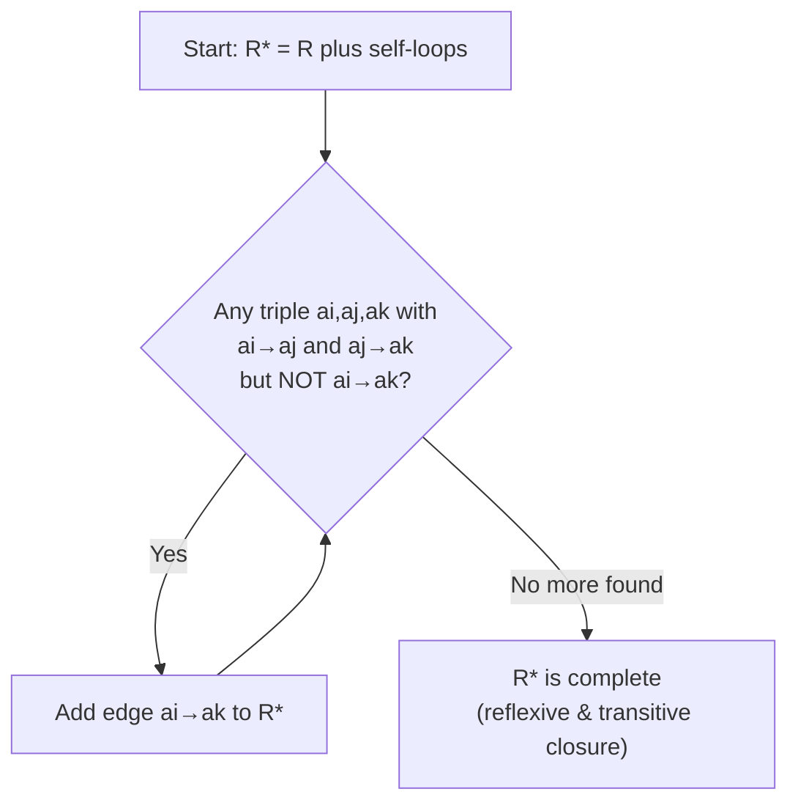

### Comparison Table

| Algorithm | Approach | Time Complexity | Intuition |
|---|---|---|---|
| Algorithm 1 | Check every possible path directly | $O(n^{n+1})$ | Exhaustive — very slow |
| Algorithm 2 | Repeatedly patch missing "shortcuts" | $O(n^5)$ | Iterative — much faster, similar spirit to Floyd-Warshall |

---

## 12. Languages over an Alphabet

Now we shift from generic set theory to the specific objects central to this course: **alphabets, strings, and languages**.

### Alphabet
- Any **finite set** is called an **alphabet**, usually denoted $\Sigma$.
- Elements of $\Sigma$ are called **symbols**.
- Example: $\Sigma = \{0, 1\}$ is called the **binary alphabet**.
- Note: $\Sigma$ *can* be $\emptyset$ (the empty set), since $\emptyset$ is technically finite — but for the theory to be interesting, we usually want $\Sigma \neq \emptyset$.

### Words / Strings
- A **word** (or **string**) over $\Sigma$ is a finite sequence of symbols from $\Sigma$.
- The **empty string** (a sequence of length zero) is denoted $e$ or $\varepsilon$.
- $\Sigma^*$ denotes the set of **all** strings over $\Sigma$ (of any finite length, including zero).
- Note that $\varepsilon \in \Sigma^*$ always, so $\Sigma^* \neq \emptyset$ even if $\Sigma = \emptyset$ (in that trivial case $\Sigma^* = \{\varepsilon\}$).

```mermaid
graph TD
    Sigma["Alphabet Σ = &#123;0, 1&#125;"] --> Strings["Σ* = all finite strings<br/>ε, 0, 1, 00, 01, 10, 11, 000, ..."]
```

### Language
Given an alphabet $\Sigma$, any set $L$ such that $L \subseteq \Sigma^*$ is called a **language over $\Sigma$**.

> In other words: a language is simply *some collection of strings* built from the alphabet. It doesn't have to have any "meaning" — mathematically it's just a subset of $\Sigma^*$.

**Examples**:
- $L_1 = \{ w \in \{0,1\}^* : w \text{ has an even number of } 0\text{'s} \}$
- $L_2 = \{ w \in \{a,b\}^* : w \text{ has } ab \text{ as a substring} \}$
- $L_4 = \{ e, 0, 1, 00, 01, 11, 10 \}$ (a finite language, listed explicitly — note this list can also be defined by property: *"all strings of length at most 2"*)

### Fact 1 and Fact 2 (Connecting back to Countability!)

- **Fact 1**: For any alphabet $\Sigma$, **any language over $\Sigma$ is countable.** (Because $\Sigma^*$ is countably infinite — being a countable union of finite sets, one for each string length — and any subset of a countable set is countable.)
- **Fact 2**: For any alphabet $\Sigma \neq \emptyset$, there are **uncountably many languages** over $\Sigma$. (Because the set of all possible languages is $2^{\Sigma^*}$, and by the diagonalization theorem in Section 9, the power set of a countably infinite set is uncountable.)

> **This is a profound and surprising punchline**: there are only *countably* many strings, but *uncountably* many possible languages (i.e., possible subsets of strings). Since any computer program/grammar/description is itself just a finite string, there can only be **countably many describable languages** — meaning **almost every language that exists cannot even be described or computed by any algorithm at all.** This directly foreshadows the undecidability results later in the course (e.g., the Halting Problem).

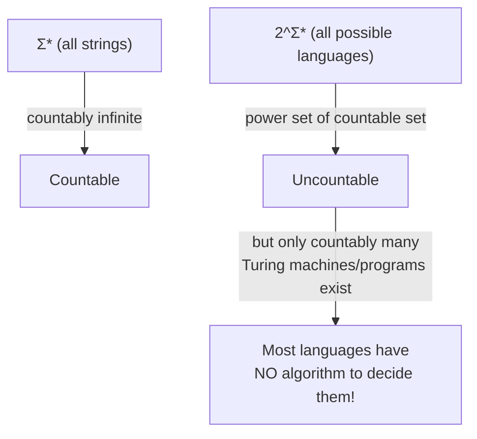

### Substrings, Prefixes, and Suffixes

**Definition**: A word $v \in \Sigma^*$ is a **substring** (sub-word) of $w$ if and only if there exist $x, y \in \Sigma^*$ such that:
$$w = xvy$$

**Remark**: $x$ and $y$ can also be empty.

- **P1**: $w$ is a substring of $w$ itself (take $x = y = \varepsilon$).
- **P2**: $\varepsilon$ is a substring of *any* string $w$ (since $\varepsilon w = w \varepsilon = w$).

**Definition**: If $w = xy$, then:
- $x$ is called a **prefix** of $w$
- $y$ is called a **suffix** of $w$

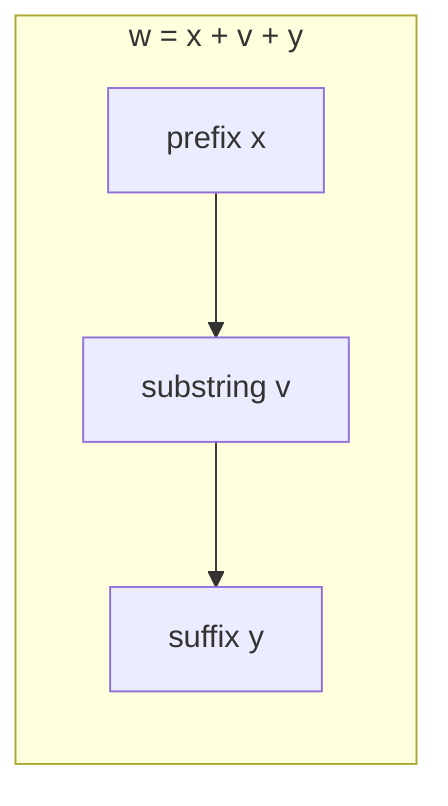

**Example**: For $w = \text{"hello"}$: `"he"` is a prefix, `"lo"` is a suffix, and `"ell"` is a substring (neither prefix nor suffix).

### Powers of a String
We define the **power** $w^i$ of a string $w$ **by mathematical induction**:

$$w^0 = e \qquad \qquad w^{i+1} = w^i \circ w$$

**Meaning**: $w^0$ is the empty string, $w^1 = w$, $w^2 = ww$, $w^3 = www$, and so on — repeating $w$ exactly $i$ times.

### Reversal of a String
The **reversal** $w^R$ of $w$ is defined by induction on the length $|w|$:

1. **Base case**: If $|w| = 0$, then $w^R = w = e$.
2. **Inductive case**: If $|w| = n+1 > 0$, then $w = ua$ for some symbol $a \in \Sigma$ and some $u \in \Sigma^*$ with $|u| = n$, and we define:
$$w^R = a\,u^R$$

**Key identity**: For any $w, x \in \Sigma^*$:
$$(wx)^R = x^R w^R$$

> **Intuition**: Reversing a concatenation reverses *and swaps the order* of the pieces — just like reversing "cat" + "dog" = "catdog" gives "godtac", which is "god" (reverse of "dog") followed by "tac" (reverse of "cat").

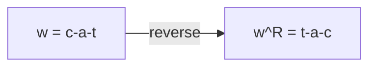

---

## 13. Concatenation of Strings and Languages

### Concatenation of Words (Informal Definition)
Given alphabet $\Sigma$ and words $x, y \in \Sigma^*$, the **concatenation** of $x$ and $y$ is the word $w$ obtained by writing $x$ immediately followed by $y$.

- Written formally as $w = x \circ y$
- Usually written simply as $w = xy$ (dropping the $\circ$ symbol) when there's no ambiguity

**Properties**:
$$w \circ e = e \circ w = w \qquad \text{(empty string is the identity)}$$
$$(x \circ y) \circ z = x \circ (y \circ z) = x \circ y \circ z \qquad \text{(associativity)}$$

### Concatenation of Languages
Given $L_1, L_2 \subseteq \Sigma^*$, the **concatenation** of the languages is:

$$L_1 \circ L_2 = \{ w \in \Sigma^* : w = xy \text{ for some } x \in L_1, y \in L_2 \}$$

**Intuition**: Take every string from $L_1$, glue it to every string from $L_2$, and collect all the results.

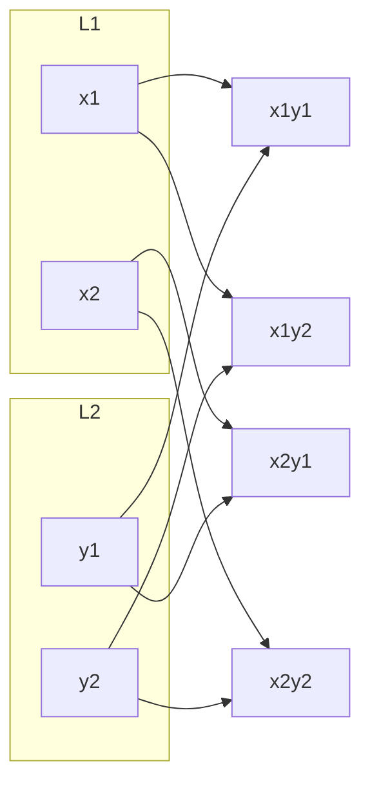

**Worked Example from lecture**:
- $L_1 = \{ w \in \{0,1\}^* : w \text{ has an even number of } 0\text{'s} \}$
- $L_2 = \{ w \in \{0,1\}^* : w \text{ starts with 0 and the rest of the symbols (if any) are all } 1\text{'s} \}$

Then:
$$L_1 \circ L_2 = \{ w \in \Sigma^* : w \text{ has an odd number of } 0\text{'s} \}$$

**Why?** Every string in $L_1$ contributes an even count of 0's, and every string in $L_2$ contributes exactly one more 0 (its leading symbol). Even + 1 = Odd. So concatenating always produces a string with an odd total number of 0's — and since $L_2$ strings always start with exactly one 0 followed only by 1's, every possible "odd-0" string can be built this way.

### Is Concatenation Commutative?
**No.** Concatenation of languages is generally **not commutative**: $L_1 \circ L_2 \neq L_2 \circ L_1$.

**Counter-example from the lecture**: The string $1000 \in L_1 \circ L_2$, but $1000 \notin L_2 \circ L_1$.

*(Reasoning: to be in $L_2 \circ L_1$, the string would need to split as (something from $L_2$)(something from $L_1$). Since $L_2$ strings must start with 0, but $1000$ starts with 1 — no valid split exists. Hence order matters!)*

$$L_1 \circ L_2 \neq L_2 \circ L_1$$

### Concatenation Distributes Over Union
Concatenation **is distributive** over the union of languages. For $n \geq 2$:

$$(L_1 \cup L_2 \cup \dots \cup L_n) \circ L = (L_1 \circ L) \cup \dots \cup (L_n \circ L)$$

$$L \circ (L_1 \cup L_2 \cup \dots \cup L_n) = (L \circ L_1) \cup \dots \cup (L \circ L_n)$$

**Intuition**: Whether you union first and then concatenate, or concatenate each piece first and then union the results, you get the exact same set of strings — because "is $w$ formed by some $x \in (\text{union})$ and $y \in L$" is the same as "is $w$ formed by some $x \in L_i$ (for some $i$) and $y \in L$."

### Set Operations on Languages
Since languages are just sets, **all the usual algebra of sets applies**: for $L, L_1, L_2 \subseteq \Sigma^*$:

$$L_1 \cup L_2, \quad L_1 \cap L_2, \quad L_1 - L_2$$
$$\neg L = \Sigma^* - L \quad \text{(complement)}$$
$$L_1 \times L_2, \quad \text{etc.}$$

All properties from the **algebra of sets** (De Morgan's laws, distributivity, associativity, etc.) hold for languages over a given alphabet $\Sigma$.

---

## 14. Quick Reference Summary

### Concept Map of Everything Covered

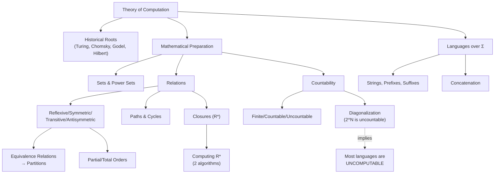

### Key Formulas Cheat Sheet

| Concept | Formula |
|---|---|
| Power set size | $\lvert 2^A \rvert = 2^{\lvert A \rvert}$ |
| Equivalence class | $[a] = \{ b \in A : (a,b) \in R \}$ |
| Path bound | If a path $a \to b$ exists, one of length $\leq \lvert A \rvert$ exists |
| Diagonal set | $D = \{ n \in \mathbb{N} : n \notin R_n \}$ |
| Reflexive-transitive closure (path def.) | $R^* = \{(a,b) \in A \times A : \exists \text{ path from } a \text{ to } b \text{ in } R\}$ |
| String power | $w^0 = e, \quad w^{i+1} = w^i \circ w$ |
| String reversal | $(wx)^R = x^R w^R$ |
| Language concatenation | $L_1 \circ L_2 = \{ w : w = xy, x \in L_1, y \in L_2 \}$ |

### Algorithm Complexity Cheat Sheet

| Algorithm | Purpose | Complexity |
|---|---|---|
| Algorithm 1 (brute force) | Compute $R^*$ | $O(n^{n+1})$ |
| Algorithm 2 (triple-fixing) | Compute $R^*$ | $O(n^5)$ |

### Key Takeaways to Remember
1. **Turing (1936)** formally defined computers *before they physically existed*, and proved some functions are **uncomputable**.
2. **Mathematical induction** and **the Pigeonhole Principle** are workhorse proof techniques used repeatedly in this course.
3. Sets can be **finite, countably infinite, or uncountable** — and **Cantor's diagonalization** is the master tool for proving something is too big to count.
4. $\Sigma^*$ (all strings) is always **countable**, but $2^{\Sigma^*}$ (all possible languages) is **uncountable** — meaning most languages can never be described by any finite algorithm. This single fact is the seed from which the entire theory of undecidability grows.
5. **Closures** (like the reflexive-transitive closure $R^*$) represent "the smallest fix needed" to give a structure a desired property — a pattern that reappears throughout computer science (e.g., transitive closure in databases, closure of grammars, etc.).

---

*End of Notes — Lectures 1 through 4, CS F51: Theory of Computation, BITS Pilani, Goa Campus.*
