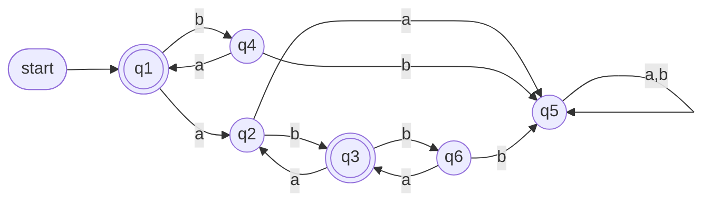
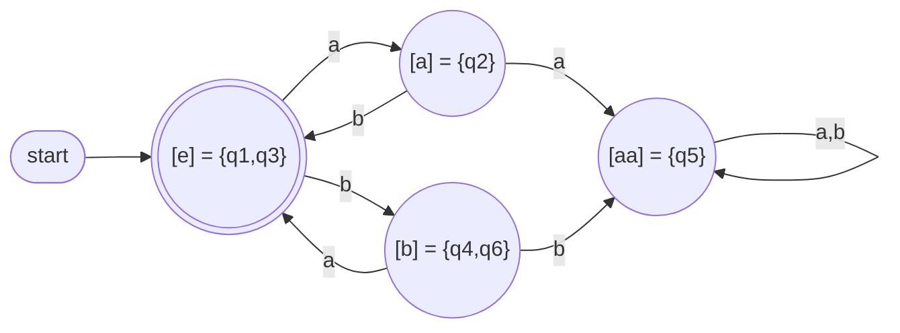
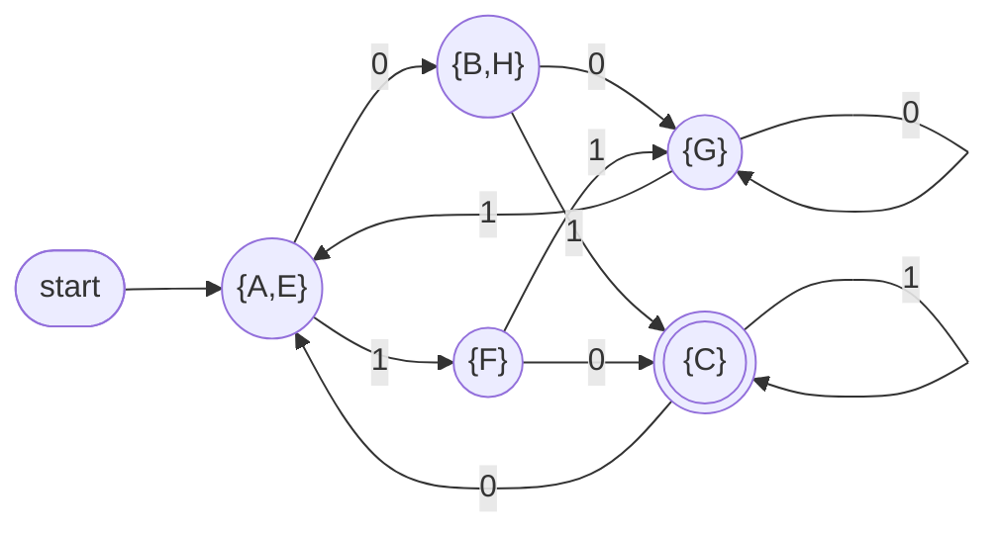
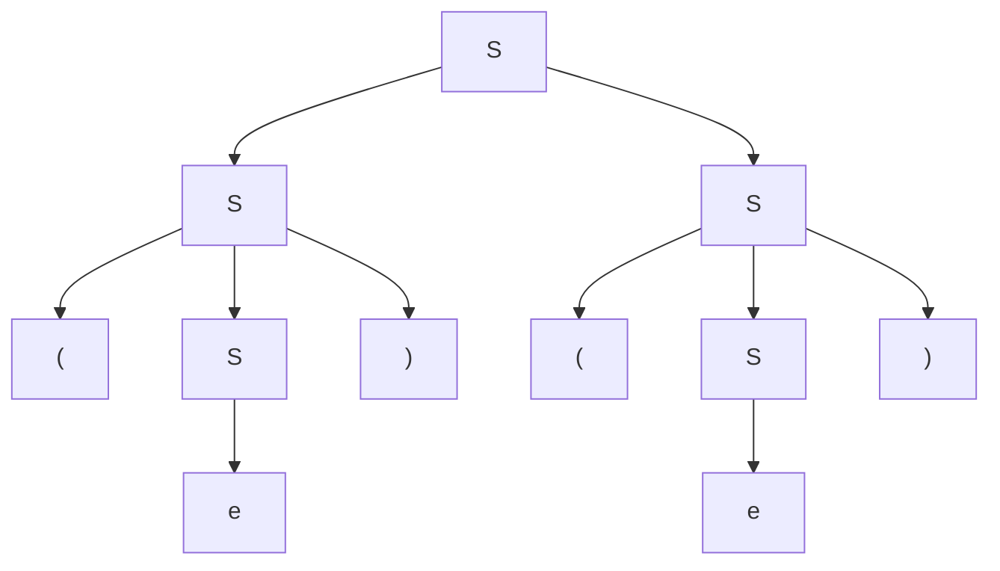
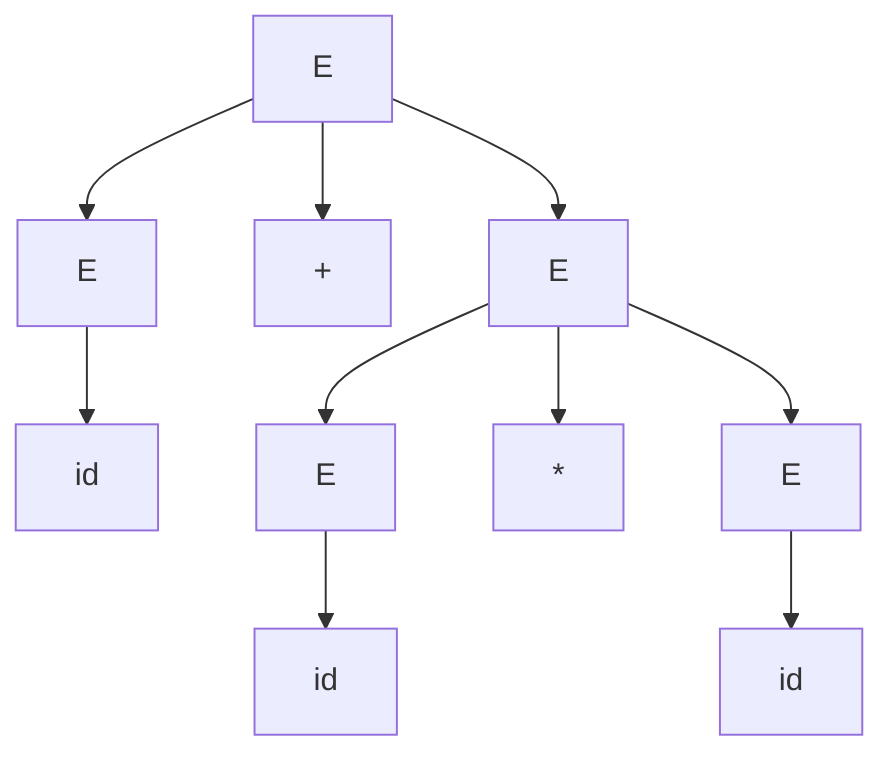
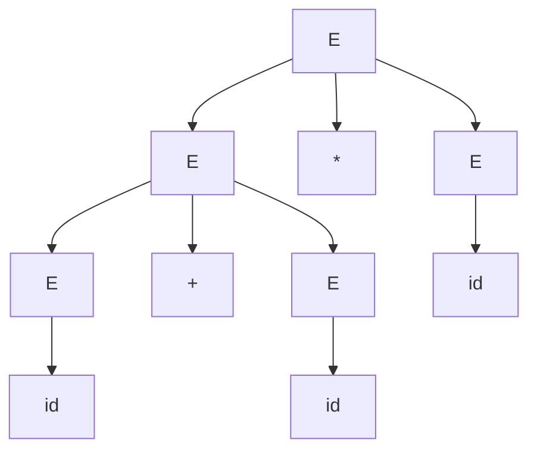

# Theory of Computation - DFA Minimization, Myhill-Nerode, CFGs

> [!info] Coverage
> Lecture 15 (FSA state minimization, Myhill-Nerode), Lecture 16 (minimization algorithm, pumping lemma limits), CFG 1-4 (definitions, examples, parse trees, ambiguity, closure, practice problems with solutions).
> Notation: slides write the empty string as $e$. These notes use $e$ too.

---

## Part 1 - DFA State Minimization (Lecture 15)

### 1.1 Why minimize?
Many DFAs accept the same language. We want the one with the **fewest states**. Two easy wins:

1. **Remove unreachable states** - states with no path from the start state. They can never affect acceptance.
2. **Merge equivalent states** - states from which *exactly the same* suffixes lead to acceptance.

### 1.2 Running example: $L = (ab \cup ba)^*$

Original DFA $M$ (q7, q8 are unreachable and already removed here; q1, q3 accepting):

- q5 is a **dead/trap state**: once there, never accept.
- q4 and q6 behave identically (on `a` go to an accepting state, on `b` go to dead) -> mergeable.
- q1 and q3 behave identically -> mergeable.

---

### 1.3 Relation 1: $\approx_L$ (defined by the **language**)

$$x \approx_L y \iff \forall z \in \Sigma^*:\ (xz \in L \iff yz \in L)$$

**In plain words:** $x$ and $y$ are indistinguishable if no suffix $z$ can "tell them apart" - appending any $z$ puts both in $L$ or both out of $L$.

- $\approx_L$ is an **equivalence relation** (reflexive, symmetric, transitive).
- **Distinguishable** = there exists at least one $z$ such that exactly one of $xz, yz$ is in $L$. That $z$ is called a **distinguishing string**.

**Classes of $\approx_L$ for $L = (ab \cup ba)^*$:**

| Class | Set | Meaning |
|---|---|---|
| $[e]$ | $L$ | already a complete string of the language |
| $[a]$ | $La$ | in $L$ but owes a `b` |
| $[b]$ | $Lb$ | in $L$ but owes an `a` |
| $[aa]$ | $L(aa \cup bb)\Sigma^*$ | broken forever, can never be fixed |

These 4 classes are disjoint and their union is $\Sigma^*$.

How you find them: start with $[e]$. Try short strings ($a$, $b$, $aa$, ...). If a string is distinguishable from every existing class representative, it starts a new class.
- $a$ vs $e$: $z = e$ distinguishes ($e \in L$, $a \notin L$) -> new class.
- $b$ vs $a$: $z = b$ distinguishes ($ab \in L$, $bb \notin L$) -> new class.
- $aa$: no suffix ever fixes it -> new class (the dead class).

---

### 1.4 Relation 2: $\sim_M$ (defined by a **machine**)

$$x \sim_M y \iff \exists q:\ (s, x) \vdash_M^* (q, e) \text{ and } (s, y) \vdash_M^* (q, e)$$

**In plain words:** $x$ and $y$ are equivalent if they drive $M$ from the start state to the **same state**.

- One class per (reachable) state: $E_q$ = all strings that end in state $q$.

For the example DFA (6 classes):

| State | $E_q$ |
|---|---|
| q1 | $(ba)^*$ |
| q2 | $La$ |
| q3 | $(ba)^*abL$ |
| q4 | $b(ba)^*$ |
| q5 | $L(aa \cup bb)\Sigma^*$ |
| q6 | $(ba)^*abLb$ |

Compare with $\approx_L$:
- $E_{q_1}, E_{q_3} \subseteq [e]$
- $E_{q_2} \subseteq [a]$
- $E_{q_4}, E_{q_6} \subseteq [b]$
- $E_{q_5} \subseteq [aa]$

### 1.5 Refinement

> [!important] Key result
> For any DFA $M$: $\ x \sim_M y \implies x \approx_{L(M)} y$

**Why:** if $x$ and $y$ reach the same state, then any suffix $z$ takes both to the same final state, so $xz$ and $yz$ are both accepted or both rejected.

So $\sim_M$ is a **refinement** of $\approx_L$: every class of $\sim_M$ sits fully inside one class of $\approx_L$ (classes of $\approx_L$ are "cut into smaller pieces").

**Consequence (lower bound):**
$$|K| \geq \text{number of classes of } \approx_{L(M)}$$
No DFA for $L$ can have fewer states than the number of $\approx_L$ classes.

---

### 1.6 Myhill-Nerode Theorem

> [!important] Theorem
> If $L$ is regular, there is a DFA accepting $L$ with **exactly** as many states as there are equivalence classes of $\approx_L$.

Combined with 1.5: this DFA is **minimal**.

**Construction** $M = (K, \Sigma, \delta, s, F)$:
- $K = \{[x] : x \in \Sigma^*\}$ - states are the classes
- $s = [e]$
- $F = \{[x] : x \in L\}$
- $\delta([x], a) = [xa]$

(Well-defined: if $x \approx_L y$ then $xa \approx_L ya$, so the choice of representative does not matter.)

Minimal DFA for $(ab \cup ba)^*$:

### 1.7 Corollary - characterization of regular languages

> [!important]
> $L$ is regular $\iff$ $\approx_L$ has **finitely many** equivalence classes.

**Exam use (proving non-regularity):** find infinitely many strings that are pairwise distinguishable.

*Example:* $L = \{a^n b^n\}$. Take $a^i, a^j$ with $i \neq j$. Suffix $z = b^i$: $a^i b^i \in L$, $a^j b^i \notin L$. So infinitely many classes -> not regular.

---

## Part 2 - Minimization Algorithm (Lecture 16)

### 2.1 State equivalence
Given DFA $M = (K, \Sigma, \delta, s, F)$:

$$(q, w) \in A_M \iff (q, w) \vdash_M^* (f, e) \text{ for some } f \in F$$
i.e. "$w$ drives $M$ from $q$ to acceptance".

$$q \equiv p \iff \forall z \in \Sigma^*:\ \big((q,z) \in A_M \iff (p,z) \in A_M\big)$$

Equivalent states get merged.

### 2.2 Approximations $\equiv_n$
Only check suffixes of length at most $n$:
$$q \equiv_n p \iff \forall z,\ |z| \le n:\ \big((q,z) \in A_M \iff (p,z) \in A_M\big)$$

- $\equiv_0$: only $z = e$, so 2 classes: $F$ and $K - F$.
- Each $\equiv_n$ is a refinement of $\equiv_{n-1}$.

### 2.3 The key lemma (how to compute $\equiv_n$ from $\equiv_{n-1}$)

$$q \equiv_n p \iff \underbrace{q \equiv_{n-1} p}_{\text{(a) were together}} \ \wedge\ \underbrace{\forall a \in \Sigma:\ \delta(q,a) \equiv_{n-1} \delta(p,a)}_{\text{(b) each symbol leads to the same old class}}$$

**Recipe:**
1. Remove unreachable states.
2. $\equiv_0 = \{F,\ K-F\}$.
3. For each class, look at each state's transitions. Write which **current class** each symbol leads to (a "signature"). States in the same class with different signatures get split.
4. Repeat until nothing splits ($\equiv_n = \equiv_{n-1}$).
5. Each final class = one state of the minimal DFA.

**Termination:** each round that changes something adds at least one class; there can be at most $|K|$ classes. So at most $|K| - 1$ rounds.

### 2.4 Worked example 1: $L = (ab \cup ba)^*$ (DFA from 1.2)

$\equiv_0$: $\{q_1, q_3\}$ (F), $\{q_2, q_4, q_5, q_6\}$ (N)

Signatures w.r.t. $\equiv_0$ (target class on `a`, on `b`):

| State | a -> | b -> |
|---|---|---|
| q1 | q2 (N) | q4 (N) |
| q3 | q2 (N) | q6 (N) |
| q2 | q5 (N) | q3 (F) |
| q4 | q1 (F) | q5 (N) |
| q5 | q5 (N) | q5 (N) |
| q6 | q3 (F) | q5 (N) |

$\equiv_1$: $\{q_1,q_3\}, \{q_2\}, \{q_4,q_6\}, \{q_5\}$

Round 2: q1, q3 both go `a`->{q2}, `b`->{q4,q6}. q4, q6 both go `a`->{q1,q3}, `b`->{q5}. No split -> **stop**. Result = the 4-state DFA in 1.6.

### 2.5 Worked example 2 (states A-H, alphabet {0,1}, accepting C)

Transitions:

| State | 0 | 1 |
|---|---|---|
| A | B | F |
| B | G | C |
| C* | A | C |
| D | C | G |
| E | H | F |
| F | C | G |
| G | G | E |
| H | G | C |

D is unreachable -> remove.

**$\equiv_0$:** $\{C\}, \{A,B,E,F,G,H\}$

**Round 1** (does 0 / 1 lead into {C}?):

| State | 0 | 1 |
|---|---|---|
| A | N | N |
| B | N | C |
| E | N | N |
| F | C | N |
| G | N | N |
| H | N | C |

$\equiv_1$: $\{C\}, \{A,E,G\}, \{B,H\}, \{F\}$

**Round 2** (check {A,E,G}):
- A: 0->B $\in\{B,H\}$, 1->F $\in\{F\}$
- E: 0->H $\in\{B,H\}$, 1->F $\in\{F\}$
- G: 0->G $\in\{A,E,G\}$, 1->E $\in\{A,E,G\}$ -> **split off**

{B,H}: both 0->G, 1->C -> stay.

$\equiv_2$: $\{C\}, \{A,E\}, \{B,H\}, \{G\}, \{F\}$

**Round 3:** A,E still same (0->{B,H}, 1->{F}); B,H same (0->{G}, 1->{C}). No split -> **stop**.

> [!warning] Common exam mistakes
> - Forgetting to remove unreachable states first (the algorithm does NOT remove them; it only merges).
> - Splitting based on the *target state* instead of the *target class*.
> - Stopping after one round without checking that the next round changes nothing.

### 2.6 Pumping Lemma cannot prove regularity

Pumping lemma = **necessary** condition for regularity, not sufficient.

$$L = \{a^i b^j c^j : i \ge 1, j \ge 0\} \cup \{b^j c^k : j,k \ge 0\}$$

**Satisfies the pumping conclusion** (take $p = 1$, pump the first symbol):
- String starts with `a`: pump the first `a`. More `a`s: still in part 1. Remove it: if $i \ge 2$ still part 1; if $i = 1$ we get $b^j c^j$, which is in part 2. OK.
- String starts with `b` or `c`: it is in $b^*c^*$; pumping the first symbol keeps it in $b^*c^*$. OK.

**But not regular:** $L \cap ab^*c^* = \{ab^jc^j\}$, which is not regular (Myhill-Nerode: $ab^i$ and $ab^j$ distinguished by $c^i$). Regular languages are closed under intersection, so $L$ cannot be regular.

**Lesson:** to *prove* regular, build a DFA/NFA/regex or use Myhill-Nerode (finitely many classes).

---

## Part 3 - Context Free Grammars (CFG 1 and 2)

### 3.1 Intuition
A CFG generates strings by **rewriting** nonterminals using rules. Good for **recursive/nested** structure (matching counts, nesting, palindromes) that DFAs cannot track.

Built-up example (slide): strings = `a`, then a middle of all-`a`s or all-`b`s, then `b`:
$$S \to aMb \qquad M \to A \mid B \qquad A \to e \mid aA \qquad B \to e \mid bB$$

> [!warning] Slide inconsistency
> The slide writes the regex as $a(a^* \cup b^*)a$ but the text and the rule $S \to aMb$ use a trailing `b`. The grammar matches $a(a^* \cup b^*)b$. Know which one your exam uses.

### 3.2 Formal definition
$$G = (V, \Sigma, R, S)$$

| Symbol | Meaning |
|---|---|
| $V$ | finite alphabet: all symbols (terminals + nonterminals) |
| $\Sigma \subseteq V$ | terminals (actual letters of output strings) |
| $V - \Sigma$ | nonterminals (variables) |
| $S \in V - \Sigma$ | start symbol |
| $R \subseteq (V - \Sigma) \times V^*$ | finite set of rules |

Rule $(A, u) \in R$ is written $A \to_G u$. **Context free** = left side is always a *single nonterminal*, so it can be replaced regardless of what surrounds it.

### 3.3 Derivations and language
One step:
$$u \Rightarrow_G v \iff u = xAy,\ v = xv'y,\ A \to_G v' \quad (x, y \in V^*,\ A \in V-\Sigma)$$
i.e. pick one nonterminal, replace it using a rule.

- $\Rightarrow_G^*$ = reflexive transitive closure (zero or more steps).
- Derivation: $w_0 \Rightarrow w_1 \Rightarrow \dots \Rightarrow w_n$ has $n$ steps.

$$L(G) = \{w \in \Sigma^* : S \Rightarrow_G^* w\}$$

$L$ is a **context-free language (CFL)** if $L = L(G)$ for some CFG $G$.

### 3.4 Standard examples (memorize the patterns)

| Language | Grammar | Pattern |
|---|---|---|
| $\{a^n b^n : n \ge 0\}$ | $S \to e \mid aSb$ | match outside-in |
| $\{a^nb^n\} \cup \{b^na^n\}$ | $S \to S_1 \mid S_2$, $S_1 \to e \mid aS_1b$, $S_2 \to e \mid bS_2a$ | union = new start |
| Balanced parentheses | $S \to e \mid SS \mid (S)$ | concat + nest |
| $\{a,b\}^*$ | $S \to e \mid Sa \mid Sb$ or $S \to e \mid a \mid b \mid SS$ | append one symbol |
| Palindromes over {a,b} | $S \to e \mid a \mid b \mid aSa \mid bSb$ | same symbol both ends |
| Non-palindromes | $S \to aSa \mid bSb \mid aAb \mid bAa$, $A \to Aa \mid Ab \mid e$ | mismatch somewhere |

Derivation of $a^2b^2$: $S \Rightarrow aSb \Rightarrow aaSbb \Rightarrow aabb$

Derivation of `()(())`:
$S \Rightarrow SS \Rightarrow S(S) \Rightarrow S((S)) \Rightarrow S(()) \Rightarrow (S)(()) \Rightarrow ()(())$

**Non-palindrome idea:** peel matching outer symbols ($aSa$, $bSb$) until you hit a mismatch pair ($aAb$ or $bAa$); between them anything ($A$) is allowed.

> [!note] Complement
> Regular languages are closed under complement. CFLs in general are **not**. (Non-palindromes happen to be CF, but that does not generalize.)

### 3.5 Every regular language is context-free
Given DFA $M = (K, \Sigma, \delta, s, F)$, build $G = (V, \Sigma, R, S)$:
- $V = K \cup \Sigma$, start $S = s$ (states become nonterminals)
- $R = \{q \to ap : \delta(q,a) = p\} \cup \{q \to e : q \in F\}$

**Idea:** a derivation simulates a run. $q \to ap$ = "read `a`, move to `p`". $q \to e$ = "stop here, it's accepting". Such grammars are called **right-linear/regular grammars**.

---

## Part 4 - Parse Trees and Derivation Equivalence (CFG 2 and 3)

### 4.1 Parse tree
Two derivations of `()()` with grammar $S \to e \mid SS \mid (S)$:
- $S \Rightarrow SS \Rightarrow (S)S \Rightarrow ()S \Rightarrow ()(S) \Rightarrow ()()$
- $S \Rightarrow SS \Rightarrow S(S) \Rightarrow S() \Rightarrow (S)() \Rightarrow ()()$

Same rules, different order. Both give the **same parse tree**:

- **Root** = top node (start symbol). **Leaves** = bottom nodes. **Yield** = leaves read left to right = derived string.
- Parse trees hide the "which nonterminal did I expand first" order, keeping only the structure.

### 4.2 Formal (recursive) definition
1. For each $a \in \Sigma$: a single node $a$ is a parse tree; root = leaf = $a$; yield = $a$.
2. If $A \to e \in R$: node $A$ with one child $e$; yield = $e$.
3. If $T_1, \dots, T_n$ ($n \ge 1$) are parse trees with roots $A_1, \dots, A_n$ and yields $y_1, \dots, y_n$, and $A \to A_1A_2\dots A_n \in R$: new root $A$ with children $T_1..T_n$; yield = $y_1y_2\dots y_n$.

### 4.3 "Precedes" relation between derivations
Let $D: x_1 \Rightarrow \dots \Rightarrow x_n$ and $D': x'_1 \Rightarrow \dots \Rightarrow x'_n$.

$D < D'$ (D **precedes** D') if $n > 2$ and there is $k$, $1 < k < n$, with:
1. $x_i = x'_i$ for all $i \neq k$
2. $x_{k-1} = x'_{k-1} = uAvBw$ ($A, B$ nonterminals)
3. $x_k = uyvBw$ where $A \to y$ (D expands the **left** one first)
4. $x'_k = uAvzw$ where $B \to z$ (D' expands the **right** one first)
5. $x_{k+1} = x'_{k+1} = uyvzw$

**Plain words:** the two derivations are identical except they swap the order of two consecutive independent steps. The one that does the leftmost replacement first precedes.

**Example** (all yield `(())()`):
- $D_1$: $S \Rightarrow SS \Rightarrow (S)S \Rightarrow ((S))S \Rightarrow (())S \Rightarrow (())(S) \Rightarrow (())()$
- $D_2$: $\dots \Rightarrow ((S))S \Rightarrow ((S))(S) \Rightarrow (())(S) \Rightarrow (())()$
- $D_3$: $\dots \Rightarrow ((S))S \Rightarrow ((S))(S) \Rightarrow ((S))() \Rightarrow (())()$

$D_1 < D_2$ and $D_2 < D_3$, but **not** $D_1 < D_3$ (they differ in more than one step).

**Similar derivations:** $D, D'$ are similar if related by the **reflexive transitive closure** of $<$ (chain of single swaps). So $D_1, D_3$ are similar. Similar derivations = same parse tree.

### 4.4 Leftmost and rightmost derivations
- **Leftmost:** always expand the leftmost nonterminal. It is not preceded by any other derivation (the "smallest").
- **Rightmost:** always expand the rightmost nonterminal. It precedes no other derivation (the "largest").

> [!important]
> Each parse tree corresponds to **exactly one** leftmost derivation and **exactly one** rightmost derivation.
> So: 2 parse trees $\iff$ 2 leftmost derivations $\iff$ 2 rightmost derivations.

---

## Part 5 - Ambiguity (CFG 3 and 4)

### 5.1 Definition
A grammar is **ambiguous** if some string has **two or more distinct parse trees** (equivalently, two leftmost derivations).

Ambiguity is a property of the **grammar**, not the language (except inherent ambiguity, 5.5).

### 5.2 Classic example
$$E \to id \mid E+E \mid E*E \mid (E)$$

`id + id * id` has two trees:

Tree (a) - correct, `*` binds tighter:

Tree (b) - wrong meaning, `(id+id)*id`:

### 5.3 Removing ambiguity: precedence layers
Idea: one nonterminal per precedence level.
- **Expression** $E$ = sum of terms. "All but the last term, plus the last term" -> left-recursive -> **left associativity**.
- **Term** $T$ = product of factors.
- **Factor** $F$ = `id` or a parenthesized expression (evaluated first).

$$E \to E + T \mid T$$
$$T \to T * F \mid F$$
$$F \to (E) \mid id$$

Why it works:
- `*` is deeper in the tree than `+` -> **`*` has higher precedence**.
- $E \to E + T$ (recursion on the left) forces `id+id+id` = `(id+id)+id` -> **left associative**.

Rightmost derivation of `id + id * id`:
$$E \Rightarrow E+T \Rightarrow E+T*F \Rightarrow E+T*id \Rightarrow E+F*id \Rightarrow E+id*id \Rightarrow T+id*id \Rightarrow F+id*id \Rightarrow id+id*id$$

> [!warning] Slide sloppiness
> 1. The slide skips the step $E+F*id \Rightarrow E+id*id$.
> 2. The slide says "this is the only derivation". Wrong as stated: there are many derivations (leftmost, rightmost, mixed). What is unique is the **parse tree** (hence the unique leftmost and unique rightmost derivation). Write it that way in the exam.

### 5.4 Dangling else
$$S \to \text{if}(E)\,S \mid \text{if}(E)\,S\ \text{else}\ S \mid OS$$
(OS = other statement)

`if (e1) if (e2) f(); else g();` has 2 trees:
- `else` with inner `if` (C's rule): `if (e1) { if (e2) f(); else g(); }`
- `else` with outer `if`: `if (e1) { if (e2) f(); } else g();`

**Fix:** split statements into "matched" ($S_1$, every `if` has an `else`) and "unmatched" ($S_2$):
$$S \to S_1 \mid S_2$$
$$S_1 \to \text{if}(E)\,S_1\ \text{else}\ S_1 \mid OS$$
$$S_2 \to \text{if}(E)\,S \mid \text{if}(E)\,S_1\ \text{else}\ S_2$$

Key: before an `else`, only a **matched** statement ($S_1$) is allowed. So an `else` always attaches to the nearest unmatched `if`.

### 5.5 Ambiguity: computational facts

| Question | Answer |
|---|---|
| Given $G$, algorithmically build unambiguous $G'$ with $L(G') = L(G)$? | **No algorithm exists** |
| Given $G$, decide if $G$ is ambiguous? | **Undecidable** |
| Does every CFL have *some* unambiguous grammar? | **No** - inherently ambiguous languages exist |

**Inherently ambiguous:** a CFL where **every** grammar is ambiguous. Programming languages are never inherently ambiguous.

Example:
$$L = \{a^nb^nc^md^m : n,m \ge 1\} \cup \{a^nb^mc^md^n : n,m \ge 1\}$$
$$S \to AB \mid C \quad A \to aAb \mid ab \quad B \to cBd \mid cd \quad C \to aCd \mid aDd \quad D \to bDc \mid bc$$

**Why ambiguous:** strings $a^nb^nc^nd^n$ lie in **both** parts, so they get one tree via $S \to AB$ and another via $S \to C$. (Proving *every* grammar must have this problem is hard and not expected in detail.)

---

## Part 6 - Closure Properties of CFLs (CFG 4)

Let $G_1 = (V_1, \Sigma_1, R_1, S_1)$, $G_2 = (V_2, \Sigma_2, R_2, S_2)$ with disjoint nonterminals, $S$ a new symbol.

| Operation | New rules (added to $R_1 \cup R_2$) | Idea |
|---|---|---|
| Union $L_1 \cup L_2$ | $S \to S_1 \mid S_2$ | choose which grammar |
| Concatenation $L_1L_2$ | $S \to S_1S_2$ | first a $L_1$ string, then a $L_2$ string |
| Kleene star $L_1^*$ | $S \to e \mid SS_1$ (only $R_1$ used) | zero or more $L_1$ strings |

> [!note]
> CFLs are **not** closed under intersection or complement (in general). Example: $\{a^nb^nc^m\} \cap \{a^mb^nc^n\} = \{a^nb^nc^n\}$, not CF. This contrasts with regular languages.
> Make sure the nonterminal sets are disjoint (rename if needed), otherwise rules from $G_1$ and $G_2$ can mix.

---

## Part 7 - Practice Problems (CFG 4) with Solutions

> [!warning] Missing symbols
> The PDF lost the relation symbols in problems 4, 5, 7. Solutions below assume the most likely reading, with alternatives given. Confirm with the original slide.

**General strategy:** match symbols from the **outside in** with recursive rules ($aSb$), add "free extra" rules ($aS$) for inequalities, and split into cases for "$\ne$".

**1. $L = \{a^mb^n : m \ge n\}$**
$$S \to aSb \mid aS \mid e$$
Each $aSb$ pairs one `a` with one `b`; $aS$ adds unpaired extra `a`s.
(Unambiguous version: $S \to aSb \mid A,\ A \to aA \mid e$.)

**2. $L = \{a^{2n}b^n : n \ge 0\}$**
$$S \to aaSb \mid e$$

**3. $L = \{a^mb^n : m \ge 2n\}$**
$$S \to aaSb \mid aS \mid e$$
(Unambiguous: $S \to aaSb \mid A,\ A \to aA \mid e$.)

**4. $L = \{a^mb^n : m \le 2n\}$** (assumed)
$$S \to aaSb \mid aSb \mid Sb \mid e$$
Each `b` is paired with 2, 1, or 0 `a`s, so $m$ can be anything from $0$ to $2n$.

**5. $L = \{a^mb^n : n \le 2m\}$** (assumed, mirror of 4)
$$S \to aSbb \mid aSb \mid aS \mid e$$
If it is $n \ge 2m$: $S \to aSbb \mid Sb \mid e$.

**6. $L = \{w \in \{a,b\}^* : n_a(w) = n_b(w)\}$**
$$S \to aSbS \mid bSaS \mid e$$
Idea: if $w$ starts with `a`, find the `b` that first brings the count back to 0. Between them is balanced, after it is balanced.

Derive `aababb` (parse: `a (abab) b` then $e$):
$$S \Rightarrow aSbS \Rightarrow aaSbSbS \Rightarrow aabSbS \Rightarrow aabaSbSbS \Rightarrow aababSbS \Rightarrow aababbS \Rightarrow aababb$$

**7. $L = \{w : n_a(w) \ne n_b(w)\}$** (assumed $\ne$)
Split into "more a" ($A$) or "more b" ($B$). $E$ = balanced (from Q6).
$$S \to A \mid B$$
$$A \to EaE \mid EaA \qquad B \to EbE \mid EbB$$
$$E \to aEbE \mid bEaE \mid e$$
Why: for $n_a > n_b$, cut at the first point the running count ($\#a - \#b$) hits $+1$. Before it: balanced $E$, then an `a`, then the rest has $n_a \ge n_b$ (either balanced $E$ or again more-a $A$).
If the symbol is $>$: just $S \to A$.

**8. $L = \{a^mb^nc^pd^q : m + n = p + q\}$**
Match outermost first: `a` with `d`, then leftover `a` with `c` or leftover `b` with `d`, then `b` with `c`.
$$S \to aSd \mid A \mid C$$
$$A \to aAc \mid B \qquad C \to bCd \mid B$$
$$B \to bBc \mid e$$
- $m \ge q$: $S$ matches $q$ pairs `a..d`, $A$ matches extra `a`s with `c`s, $B$ matches `b`s with remaining `c`s.
- $m < q$: $S$ matches $m$ pairs `a..d`, $C$ matches `b`s with remaining `d`s, $B$ matches leftover `b`s with `c`s.

---

## Quick Revision Sheet

- $\approx_L$: same future w.r.t. language. $\sim_M$: same state in machine. $\sim_M$ refines $\approx_L$.
- # states of any DFA for $L$ $\ge$ # classes of $\approx_L$; Myhill-Nerode DFA achieves it.
- Regular $\iff$ finitely many $\approx_L$ classes. Infinite pairwise-distinguishable set -> not regular.
- Minimization: remove unreachable -> $\{F, K-F\}$ -> split by signatures -> repeat until stable ($\le |K|-1$ rounds).
- Pumping lemma: necessary, not sufficient.
- CFG $= (V, \Sigma, R, S)$, rules $A \to u$ with single nonterminal on left.
- Regular $\subset$ CFL (DFA -> grammar: $q \to ap$, $q \to e$ for $q \in F$).
- Parse tree = derivations up to reordering; 1 tree = 1 leftmost = 1 rightmost derivation.
- Ambiguous = some string has 2+ parse trees. Fix with precedence layers ($E/T/F$) or matched/unmatched split.
- Ambiguity is undecidable; inherently ambiguous CFLs exist.
- CFL closed under $\cup$, concatenation, $*$. Not under $\cap$, complement.
