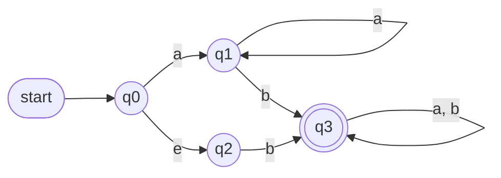
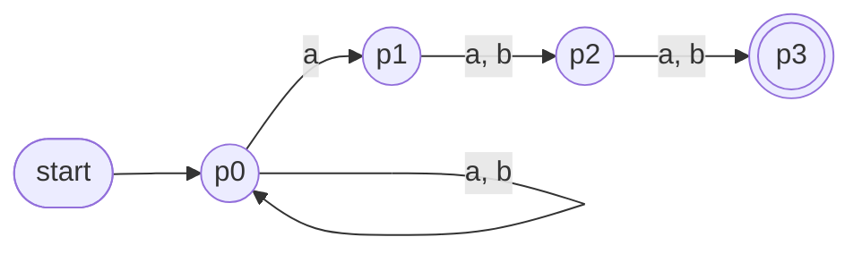
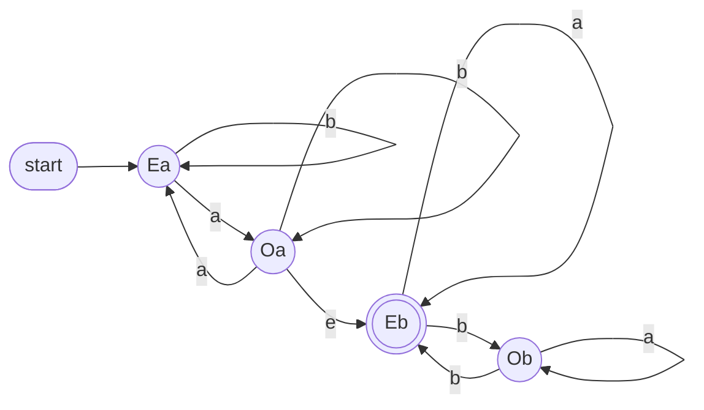
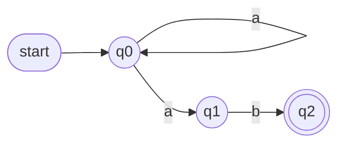
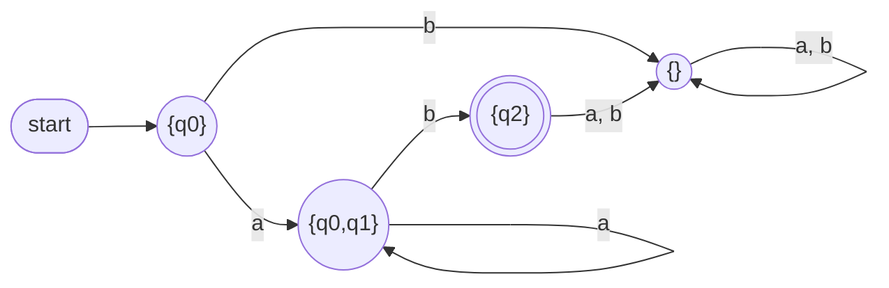
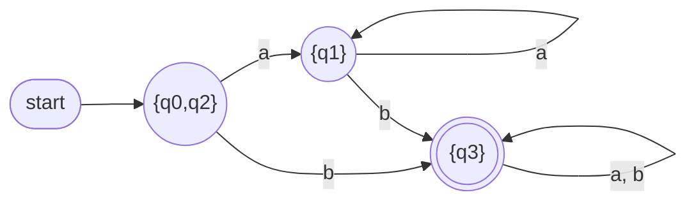
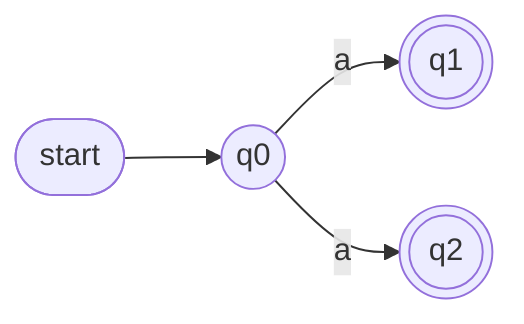
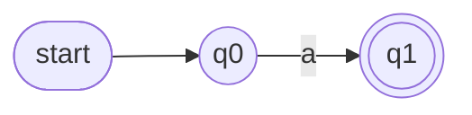

# CS F301 - Tutorial 3 Solutions: Nondeterministic Finite Automata

> **Notation.** $e$ = empty string (as in the sheet). In diagrams: `start` arrow marks the initial state, **double circle = final state**. $\emptyset$ = empty set.

## Quick Recap (read this first)

- **NFA** $N=(K,\Sigma,\Delta,s,F)$. Difference from a DFA: $\Delta$ is a *relation*. From one state, one symbol can lead to **0, 1, or many** states, and $e$-moves (read nothing) are allowed.
- **Configuration** $(q,w)$ = "in state $q$, $w$ still unread". $\vdash$ = one step. $\vdash^*$ = zero or more steps.
- **Acceptance rule:** $w\in L(N)$ iff **at least one** computation reaches a final state with all input read. Other branches dying or failing does not matter.
- **$e$-closure** $E(q)$ = all states reachable from $q$ using only $e$-moves (always includes $q$).
- **Subset construction (NFA to DFA):**
  - $K'=2^K$, start $s'=E(s)$
  - $F'=\{Q\subseteq K : Q\cap F\neq\emptyset\}$
  - $\delta'(Q,a)=\bigcup_{q\in Q}\{E(p) : (q,a,p)\in\Delta\}$
  - In words: "after reading $a$, collect every state I could be in, then add everything reachable by free $e$-moves."

---

## Q1. The NFA

Transitions: $q_0\xrightarrow{a}q_1$, $q_0\xrightarrow{e}q_2$, $q_1\xrightarrow{a}q_1$, $q_1\xrightarrow{b}q_3$, $q_2\xrightarrow{b}q_3$, $q_3\xrightarrow{a,b}q_3$.

### (a) Accepting computation on $ab$

Read $a$ using $q_0\to q_1$, then read $b$ using $q_1\to q_3$:

$$(q_0,ab)\vdash(q_1,b)\vdash(q_3,e)$$

$q_3\in F$ and the input is fully read, so this is accepting.

### (b) A different, non-accepting computation

Take the $e$-move first:

$$(q_0,ab)\vdash(q_2,ab)$$

Now stuck: $q_2$ only has a $b$-transition, but the next symbol is $a$. Nothing more can happen and the input is not consumed. **Not accepting.**

### (c) Is $ab\in L(N)$?

**Yes.** Acceptance needs only *one* accepting computation. (a) gives one. (b) is a dead branch, and dead branches never cancel an accepting one. (This is the whole point of "nondeterministic".)

---

## Q2. Formal specification of the Q1 NFA

$$N=(K,\Sigma,\Delta,s,F)$$

- $K=\{q_0,q_1,q_2,q_3\}$
- $\Sigma=\{a,b\}$
- $s=q_0$
- $F=\{q_3\}$
- $\Delta=\{(q_0,a,q_1),\ (q_0,e,q_2),\ (q_1,a,q_1),\ (q_1,b,q_3),\ (q_2,b,q_3),\ (q_3,a,q_3),\ (q_3,b,q_3)\}$

**Exam tip:** each *label* on a diagram arrow is its own triple. A loop labelled "$a,b$" is **two** triples.

---

## Q3. $L_k=\{w : |w|\ge k \text{ and the } k\text{th symbol from the end is } a\}$

### (a) NFA with $k+1$ states

States $p_0,p_1,\dots,p_k$. Start $p_0$. Final $p_k$.

- $p_0$ loops on $a$ and $b$ (skip any prefix).
- $p_0\xrightarrow{a}p_1$ (**guess**: "this $a$ is the $k$th from the end").
- $p_i\xrightarrow{a,b}p_{i+1}$ for $1\le i\le k-1$ (read exactly $k-1$ more symbols, any).

Example $k=3$:

**Why it works:** $p_k$ is reached only if some $a$ is followed by exactly $k-1$ symbols and then the input ends (nothing leaves $p_k$, so extra input kills the branch). That is exactly "$k$th from the end is $a$". Length $\ge k$ comes for free (the $a$ plus $k-1$ symbols).

**Check for $k=1$:** $p_0\xrightarrow{a}p_1$ final, no more moves. Accepts strings whose last symbol is $a$. Correct.

**How nondeterminism is used (one sentence):** the NFA *guesses* which $a$ is the $k$th-from-last; it doesn't need to know where the end is in advance, and the wrong guesses just die.

### (b) Why a DFA needs far more than $k+1$ states

A DFA reads left to right and **cannot guess**. At any moment, it must remember the **last $k$ symbols** (any of them could turn out to be the $k$th from the end once more input arrives). There are $2^k$ possible last-$k$ windows.

**Proof sketch:** take two different strings $u\ne v$ of length $k$, differing at position $j$ (from the left). Append $b^{j-1}$ to both. Now position $j$ is exactly the $k$th symbol from the end, so one of $ub^{j-1}$, $vb^{j-1}$ is in $L_k$ and the other is not. So the DFA must have put $u$ and $v$ in different states. That forces at least $2^k$ states.

So: NFA $k+1$ states, DFA $\approx 2^k$ states. This is the standard example of exponential blow-up in the subset construction.

---

## Q4. $L=\{w_1w_2 : w_1 \text{ has an odd number of } a\text{'s},\ w_2 \text{ has an even number of } b\text{'s}\}$

### (a) NFA

**Idea:** two phases glued by an $e$-move.

- **Phase 1** tracks parity of $a$'s (ignores $b$'s). States $E_a$ (even so far, start) and $O_a$ (odd so far).
- **Phase 2** tracks parity of $b$'s (ignores $a$'s). States $E_b$ (even, final) and $O_b$ (odd).
- **Guess the split:** from $O_a$, take $e$ to $E_b$. ($E_b$ because $w_2$ starts empty, and $0$ $b$'s is even.)

Formally: $K=\{E_a,O_a,E_b,O_b\}$, $s=E_a$, $F=\{E_b\}$, and $\Delta$ is the set of edges drawn above.

### (b) Proof that $L(N)=L$

**Lemma 1 (phase 1).** Using only phase-1 moves, after reading $x$ from $E_a$ you are in $O_a$ if $x$ has an odd number of $a$'s, and in $E_a$ if even. *Proof:* induction on $|x|$. Reading $a$ flips the state, reading $b$ keeps it, which matches how the count's parity changes.

**Lemma 2 (phase 2).** Same, from $E_b$: after reading $y$ you are in $E_b$ iff $y$ has an even number of $b$'s.

**$L(N)\subseteq L$.** Take an accepting computation. There is **one** $e$-transition, and no edge goes back from phase 2 to phase 1. So the computation reads some $w_1$ in phase 1, takes $O_a\xrightarrow{e}E_b$, reads the rest $w_2$ in phase 2, and ends in $E_b$ (the only final state). By Lemma 1, being in $O_a$ at the $e$-move means $w_1$ has an odd number of $a$'s. By Lemma 2, ending in $E_b$ means $w_2$ has an even number of $b$'s. So $w=w_1w_2\in L$.

**$L\subseteq L(N)$.** Let $w=w_1w_2$ with $w_1$ odd in $a$'s and $w_2$ even in $b$'s. Run: read $w_1$ from $E_a$, reaching $O_a$ (Lemma 1). Take the $e$-move to $E_b$. Read $w_2$, ending in $E_b$ (Lemma 2). $E_b\in F$, so $w\in L(N)$. $\blacksquare$

---

## Q5. $e$-closure

### (a) $E(q_0)$ for the Q1 NFA

From $q_0$ the only $e$-move is $q_0\to q_2$. $q_2$ has no $e$-moves.

$$E(q_0)=\{q_0,q_2\}$$

### (b) When is $e\in L(N)$?

**Claim:** $e\in L(N)\iff E(s)\cap F\neq\emptyset$.

**Proof.** With empty input, no symbol can ever be read, so a computation can only use $e$-moves.

$e\in L(N)$
$\iff (s,e)\vdash^*(q,e)$ for some $q\in F$ (definition of acceptance)
$\iff q\in E(s)$ for some $q\in F$ (definition of $E(s)$ is exactly "$(s,e)\vdash^*(q,e)$")
$\iff E(s)\cap F\ne\emptyset$. $\blacksquare$

**In words:** the empty string is accepted iff you can reach a final state from the start for free.

**Check on Q1:** $E(q_0)=\{q_0,q_2\}$, $F=\{q_3\}$, intersection empty, so $e\notin L(N)$. Matches (the language is "contains a $b$", see Q7).

---

## Q6. NFA to DFA (no $e$-moves)

NFA: $q_0\xrightarrow{a}q_0$, $q_0\xrightarrow{a}q_1$, $q_1\xrightarrow{b}q_2$. Start $q_0$, final $q_2$.

### (a) The DFA

No $e$-moves, so $E(q)=\{q\}$ for every $q$. Start state: $\{q_0\}$.

Compute row by row ($\delta'(Q,x)$ = union of where each state in $Q$ goes on $x$):

| State | on $a$ | on $b$ |
|---|---|---|
| $\{q_0\}$ | $\{q_0,q_1\}$ | $\emptyset$ |
| $\{q_0,q_1\}$ | $\{q_0,q_1\}$ | $\{q_2\}$ |
| $\{q_2\}$ (final) | $\emptyset$ | $\emptyset$ |
| $\emptyset$ | $\emptyset$ | $\emptyset$ |

Details: $\{q_0,q_1\}$ on $a$: $q_0\to\{q_0,q_1\}$, $q_1\to$ nothing, union is $\{q_0,q_1\}$. On $b$: $q_0\to$ nothing, $q_1\to q_2$, so $\{q_2\}$.

Language: $L=a^+b$ (one or more $a$'s then one $b$).

Only 4 of the $2^3=8$ subsets are reachable. Unreachable subsets can be dropped (e.g. $\{q_1\},\{q_0,q_2\},\dots$).

### (b) Why keep $\emptyset$ but not unreachable states?

- An **unreachable** state is never visited from the start, so deleting it changes nothing.
- $\emptyset$ **is reachable** (e.g. on input $b$ from the start). It is the **dead/trap state**: "the NFA has no live branch left". A DFA needs a value of $\delta'$ for every (state, symbol), so strings like $b$ or $abb$ need somewhere to go. Without $\emptyset$ the transition function would be undefined, so it would not be a DFA.

### (c) Final states

Final = subsets that contain a final state of $N$ ($q_2$). Here: only $\{q_2\}$.

**Can $\emptyset$ ever be final?** **No.** $F'=\{Q: Q\cap F\ne\emptyset\}$, and $\emptyset\cap F=\emptyset$ always. Dead state = never accepts.

---

## Q7. DFA for the Q1 NFA

### (a) Construction

$e$-closures: $E(q_0)=\{q_0,q_2\}$, $E(q_1)=\{q_1\}$, $E(q_2)=\{q_2\}$, $E(q_3)=\{q_3\}$.

**Start:** $s'=E(q_0)=\{q_0,q_2\}$.

- $\{q_0,q_2\}$ on $a$: $q_0\to q_1$ (take $E(q_1)=\{q_1\}$); $q_2$ has no $a$-move. Result $\{q_1\}$.
- $\{q_0,q_2\}$ on $b$: $q_0$ has no $b$-move; $q_2\to q_3$. Result $\{q_3\}$.
- $\{q_1\}$ on $a$: $\{q_1\}$. On $b$: $\{q_3\}$.
- $\{q_3\}$ on $a$ or $b$: $\{q_3\}$.

| State | on $a$ | on $b$ |
|---|---|---|
| $\{q_0,q_2\}$ (start) | $\{q_1\}$ | $\{q_3\}$ |
| $\{q_1\}$ | $\{q_1\}$ | $\{q_3\}$ |
| $\{q_3\}$ (final) | $\{q_3\}$ | $\{q_3\}$ |

No $\emptyset$ state needed: every transition is already defined.

**Language:** $a^*b\,\Sigma^*$ = all strings containing at least one $b$. (Also explains why $e\notin L$, Q5.)

**Bonus:** $\{q_0,q_2\}$ and $\{q_1\}$ behave identically (both non-final, $a\to\{q_1\}$, $b\to\{q_3\}$), so they merge. Minimal DFA has 2 states: "no $b$ yet" and "seen a $b$".

### (b) Why the start state has more than one NFA state

The DFA start is $E(s)$, not just $\{s\}$ (the subset construction says $s'=E(s)$). In Q7, $q_0\xrightarrow{e}q_2$ is a free move, so before reading anything the NFA could already be in $q_0$ **or** $q_2$. In Q6 there are no $e$-moves, so $E(q_0)=\{q_0\}$ and the start is a single state.

---

## Q8. Unambiguous NFAs

**Definition:** every input has **at most one** accepting computation.

### (a) An ambiguous NFA

$q_0\xrightarrow{a}q_1$ and $q_0\xrightarrow{a}q_2$, with **both** $q_1,q_2$ final.

Language $\{a\}$. The string $a$ has two accepting computations (one ending in $q_1$, one in $q_2$). **Ambiguous.**

### (b) Unambiguous NFA, same language

Language $\{a\}$, exactly one accepting computation for $a$.

### (c) Does every NFA language have an unambiguous NFA?

**Yes.** Take any NFA. By the subset construction there is an equivalent **DFA**. A DFA is itself an NFA (no $e$-moves, exactly one move per state/symbol), and on any input it has **exactly one** computation, so at most one accepting one. So it is unambiguous.

---

## Q9. NFAs over $\Sigma$ are countably infinite

**Idea:** an NFA is a finite object, and there are only finitely many NFAs of each size.

1. Rename the states of any NFA with $n$ states to $\{1,\dots,n\}$ (renaming does not change the language, and we count NFAs up to naming).
2. For a fixed $n$, an NFA is chosen by: start state ($n$ options), $F\subseteq\{1..n\}$ ($2^n$ options), $\Delta\subseteq\{1..n\}\times(\Sigma\cup\{e\})\times\{1..n\}$ ($2^{\,n^2(|\Sigma|+1)}$ options). **Finitely many.**
3. All NFAs = union over $n=1,2,3,\dots$ of these finite sets. A countable union of finite sets is **countable**.
4. It is **infinite**, because every DFA is also an NFA and the set of DFAs is infinite (Tutorial 2). (Or directly: for each $n$ there is an NFA accepting only $a^n$, all different.)

Countable + infinite = **countably infinite**. $\blacksquare$

*Alternative one-liner:* encode each NFA as a finite string over a fixed finite alphabet. The set of all finite strings over a finite alphabet is countable.

---

## Cheat-sheet (exam)

| Task | Method |
|---|---|
| Show $w\in L(N)$ | Exhibit **one** accepting computation $(s,w)\vdash^*(f,e)$ |
| Show $w\notin L(N)$ | Show **every** computation fails |
| $e\in L(N)$? | $E(s)\cap F\ne\emptyset$ |
| NFA to DFA start | $E(s)$ |
| $\delta'(Q,a)$ | union of $E(p)$ over all $(q,a,p)\in\Delta$, $q\in Q$ |
| Final DFA states | subsets containing a final NFA state |
| $\emptyset$ state | keep it if reachable, never final |
| "$k$th from end" languages | NFA $k+1$ states, DFA needs $2^k$ |
