# CS F301 - Tutorial 4 Solutions: Finite Automata and Regular Expressions

> **Notation.** $e$ = empty string (as in the sheet). In diagrams: `start` arrow = initial state, **double circle = final state**. In diagram labels, `U` means union ($\cup$) because diagrams cannot render LaTeX.

## Quick Recap (read this first)

**Closure constructions (all on NFAs, disjoint state sets):**

| Operation | Build | Final states |
|---|---|---|
| Union $M_1\cup M_2$ | new start $s$, add $s\xrightarrow{e}s_1$ and $s\xrightarrow{e}s_2$ | $F_1\cup F_2$ |
| Concatenation $M_1\circ M_2$ | start $s_1$, add $q\xrightarrow{e}s_2$ for every $q\in F_1$ | $F_2$ |
| Star $M_1^*$ | **new** start $s$ (also final), add $s\xrightarrow{e}s_1$ and $q\xrightarrow{e}s_1$ for every $q\in F_1$ | $F_1\cup\{s\}$ |
| Complement | **DFA only**: swap final and non-final | $K-F$ |
| Intersection | $\overline{\overline{L_1}\cup\overline{L_2}}$ (De Morgan) | |

**Regular expression to NFA:** build bottom-up using these.
**Automaton to regular expression:** state elimination (algorithm in Q6).

---

## Q1. NFA with two branches on $a$

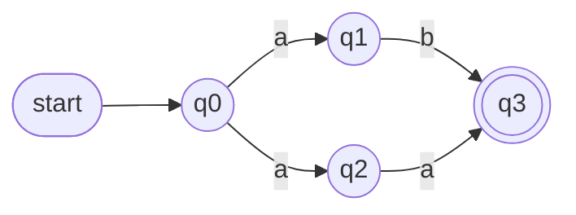

### (a) Show $L(N)=\{aa,ab\}$

- **$\supseteq$:** $(q_0,aa)\vdash(q_2,a)\vdash(q_3,e)$ and $(q_0,ab)\vdash(q_1,b)\vdash(q_3,e)$. Both accepted.
- **$\subseteq$:** $q_3$ is the only final state and has **no outgoing edges**. So any accepting computation ends the moment it enters $q_3$. Every path $q_0\to q_3$ has exactly two edges: $q_0\to q_1\to q_3$ (reads $ab$) or $q_0\to q_2\to q_3$ (reads $aa$). There are no loops and no $e$-moves, so no other string can be accepted.

### (b) Equivalent DFA

No $e$-moves, so $E(q)=\{q\}$. Start $\{q_0\}$.

| State | on $a$ | on $b$ |
|---|---|---|
| $\{q_0\}$ | $\{q_1,q_2\}$ | $\emptyset$ |
| $\{q_1,q_2\}$ | $\{q_3\}$ | $\{q_3\}$ |
| $\{q_3\}$ (final) | $\emptyset$ | $\emptyset$ |
| $\emptyset$ | $\emptyset$ | $\emptyset$ |

Details: $\{q_1,q_2\}$ on $a$: $q_1$ has no $a$-move, $q_2\to q_3$, so $\{q_3\}$. On $b$: $q_1\to q_3$, $q_2$ has no $b$-move, so $\{q_3\}$.

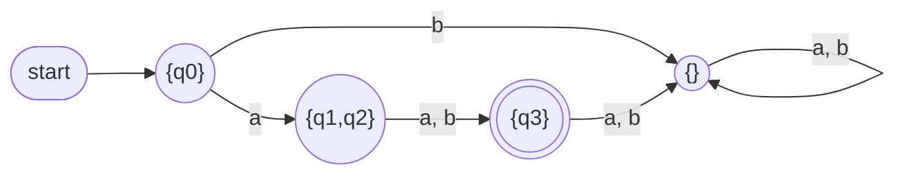

### (c) What groups $q_1$ and $q_2$?

Not an $e$-closure. It is the **branching on the same symbol**: from $q_0$ the symbol $a$ has *two* transitions ($q_0\xrightarrow{a}q_1$ and $q_0\xrightarrow{a}q_2$). After reading $a$ the NFA could be in either, so the DFA state must record **both**. Rule of thumb: DFA states group NFA states for two reasons, (1) free $e$-moves, (2) several transitions on the same symbol.

---

## Q2. Union and concatenation of $M_1$, $M_2$

$M_1$: $q_0$ start, $q_1$ final. $q_0\xrightarrow{b}q_0$, $q_0\xrightarrow{a}q_1$, $q_1\xrightarrow{a}q_1$, $q_1\xrightarrow{b}q_0$.
$M_2$: $p_0$ start, $p_1$ final. $p_0\xrightarrow{a,b}p_1$, $p_1\xrightarrow{a,b}p_0$.

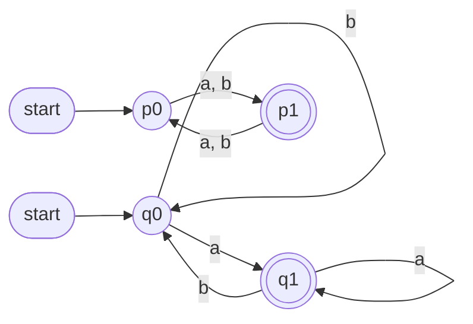

### (c) Plain English first (it guides the answers)

- $L(M_1)$: the state is $q_1$ exactly when the **last symbol read was $a$** (any $a$ goes to $q_1$, any $b$ goes to $q_0$). So $L(M_1)$ = strings **ending in $a$**.
- $L(M_2)$: each symbol flips between $p_0$ and $p_1$. Final = $p_1$. So $L(M_2)$ = strings of **odd length**.
- $L(M_1)\circ L(M_2)$: a string $x$ ending in $a$ followed by $y$ of odd length. Equivalently: **there is some $a$ in the string with an odd number of symbols after it** (that $a$ is the last symbol of $x$; $y$ is what follows). Same as: some $a$ sits at an **even position counted from the right end** (last symbol = position 1).

### (a) Union NFA

New start $s$ with $e$-edges to $q_0$ and $p_0$. Finals $\{q_1,p_1\}$.

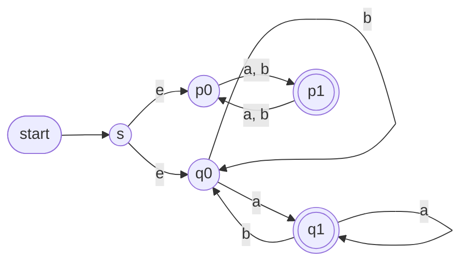

Accepts: ends in $a$, **or** odd length.

### (b) Concatenation NFA

Start $q_0$. Add $q_1\xrightarrow{e}p_0$ (from $M_1$'s final to $M_2$'s start). Final states: only $\{p_1\}$ ($q_1$ is **no longer** final).

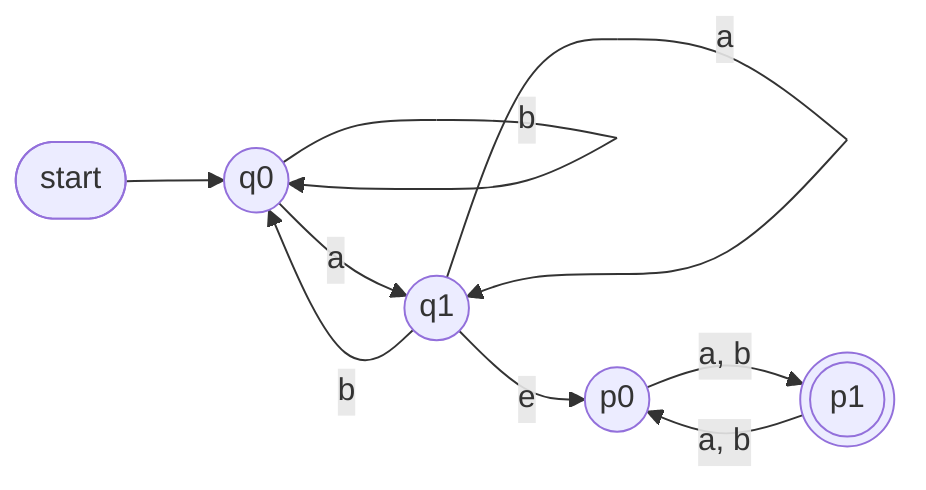

---

## Q3. Why Kleene star needs a **new** start state

$M_1$: $q_0\xrightarrow{a}q_1$, $q_1\xrightarrow{b}q_2$, $q_1\xrightarrow{c}q_0$. Start $q_0$, final $q_2$. Here $L(M_1)=(ac)^*ab$.

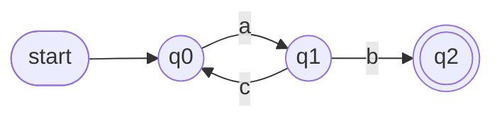

### (a) The (flawed) modified construction

Keep $q_0$ as start, make it **final**, add $q_2\xrightarrow{e}q_0$.

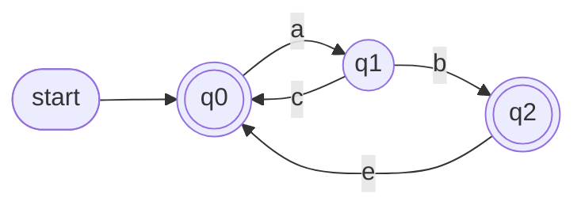

$F=\{q_0,q_2\}$.

### (b) $ac\in L(M)$ but $ac\notin L(M_1)^*$

$$(q_0,ac)\vdash(q_1,c)\vdash(q_0,e),\quad q_0\in F$$

So $ac\in L(M)$.

Why $ac\notin L(M_1)^*$: every string of $L(M_1)=(ac)^*ab$ ends in $b$. So every **non-empty** string in $L(M_1)^*$ (a concatenation of such strings) ends in $b$. $ac$ is non-empty and ends in $c$, so it is not in $L(M_1)^*$.

### (c) General reason

$s_1$ may have **incoming edges** (here $q_1\xrightarrow{c}q_0$). Making $s_1$ final means "arriving back at $s_1$ by any route = accept", including routes that came back through the middle of a word without completing one. Words must be accepted only after finishing a full $M_1$-word (reaching $F_1$). A **new start state with no incoming edges** can be final without this leak: it accepts only $e$ and then jumps into $M_1$.

---

## Q4. Complementing an NFA by swapping final states

$N$ over $\{a\}$: $q_0\xrightarrow{a}q_0$, $q_0\xrightarrow{a}q_1$, start $q_0$, final $q_1$.

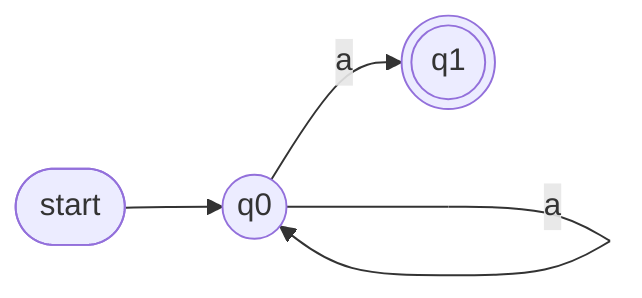

### (a) $L(N')$

$L(N)=a^+$ (loop $k\ge0$ times then take the last $a$).

$N'$: final states now $\{q_0\}$ only. On $a^n$ ($n\ge0$), the computation that just loops stays in $q_0$, which is final. So **every** string is accepted:

$$L(N')=a^*=\Sigma^*$$

But $\Sigma^*-L(N)=a^*-a^+=\{e\}$.

$$L(N')=a^*\neq\{e\}=\Sigma^*-L(N)$$

**Not equal.**

### (b) Why swapping only works for DFAs

- **DFA:** each string has **exactly one** computation. Accept iff it ends in $F$. Swapping gives: accept iff it ends in $K-F$ = the exact negation.
- **NFA:** a string can have **many** computations. Accept iff **some** computation ends in $F$. Complement needs: **no** computation ends in $F$, i.e. **all** end outside $F$. After swapping you get: **some** computation ends outside $F$. "Some ends outside" is not the negation of "some ends inside".

In the example: $a^n$ ($n\ge1$) has one computation ending in $q_1$ (accepted by $N$) **and** one ending in $q_0$ (accepted by $N'$). So it lands in both languages. To complement an NFA: convert to a DFA first, then swap.

---

## Q5. Automaton for $\mathcal L((ab\cup ba)^*a)$

Build from the inside out using the constructions. All state names are distinct.

**Stage 1: single symbols.**
$a$: $u_1\xrightarrow{a}u_2$. $b$: $u_3\xrightarrow{b}u_4$. (Each is a 2-state NFA, final state at the end.)

**Stage 2: concatenations $ab$ and $ba$.** Link the first piece's final to the second piece's start with $e$; only the second piece's final stays final.

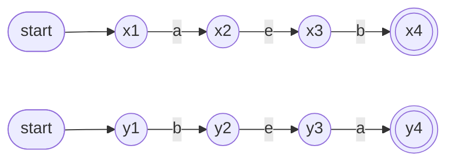

Top: $ab$. Bottom: $ba$.

**Stage 3: union $ab\cup ba$.** New start $s$ with $e$ to $x_1$ and $y_1$. Finals $\{x_4,y_4\}$.

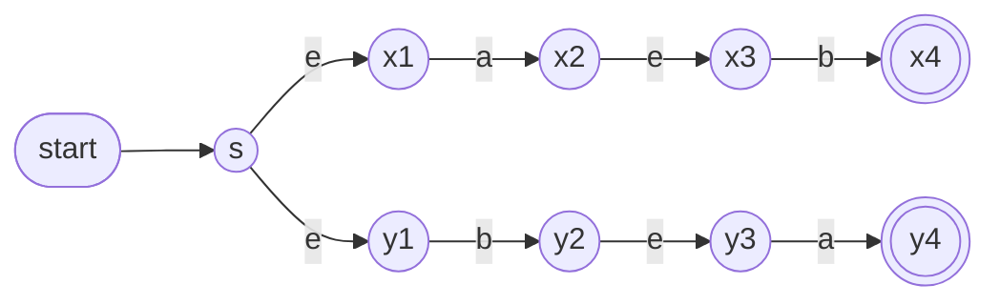

**Stage 4: star $(ab\cup ba)^*$.** New start $t$ (also **final**), $t\xrightarrow{e}s$, and $e$-edges from each old final ($x_4,y_4$) back to $s$. Finals $\{t,x_4,y_4\}$.

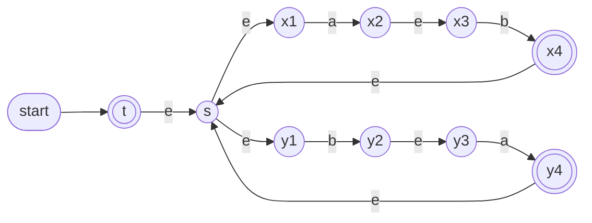

**Stage 5: concatenate with $a$.** Add $z_1\xrightarrow{a}z_2$. Add $e$-edges from **every final of Stage 4** ($t,x_4,y_4$) to $z_1$. Only $z_2$ is final. The edge $t\xrightarrow{e}z_1$ is what lets the string $a$ itself (zero repeats of the star) be accepted.

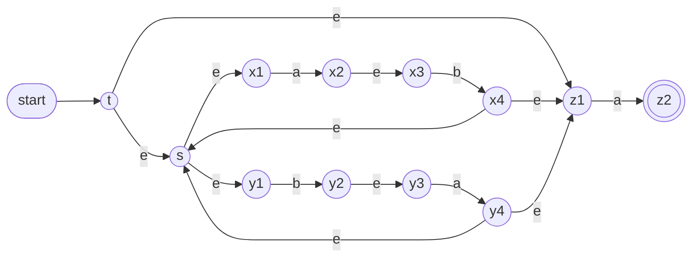

This is the final NFA. (Checked by program against the regex on all strings up to length 11.)

---

## Q6. DFA to regular expression (state elimination)

DFA $M$ (contains $aa$): $q_0\xrightarrow{b}q_0$, $q_0\xrightarrow{a}q_1$, $q_1\xrightarrow{b}q_0$, $q_1\xrightarrow{a}q_2$, $q_2\xrightarrow{a,b}q_2$. Start $q_0$, final $q_2$.

### (a) Put into required form

The algorithm needs: **unique start with no incoming edges**, **unique final with no outgoing edges**. Currently $q_0$ has incoming edges ($b$ loop, $b$ from $q_1$) and $q_2$ has outgoing edges (its loop).

Fix: add new start $s$ with $s\xrightarrow{e}q_0$, add new final $f$ with $q_2\xrightarrow{e}f$, and make $q_2$ non-final.

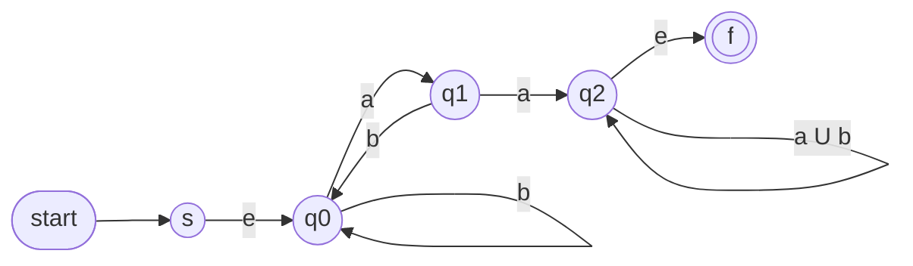

(The two parallel loop edges $a$ and $b$ on $q_2$ are merged into one labelled $a\cup b$, step 1 of the algorithm.)

### (b) Eliminate states

**Rule for removing $q$ with self-loop label $\gamma$:** for every path $q_i\xrightarrow{\alpha}q\xrightarrow{\beta}q_j$ add (or union into an existing edge) the label $\alpha\gamma^*\beta$. If no self-loop, $\gamma=\emptyset$ and $\gamma^*=e$.

**Step 1: eliminate $q_1$.** No self-loop. Paths through $q_1$:

- $q_0\xrightarrow{a}q_1\xrightarrow{b}q_0$: gives $ab$. There is already a loop $b$ on $q_0$, so the loop becomes $b\cup ab$.
- $q_0\xrightarrow{a}q_1\xrightarrow{a}q_2$: new edge $q_0\to q_2$ labelled $aa$.

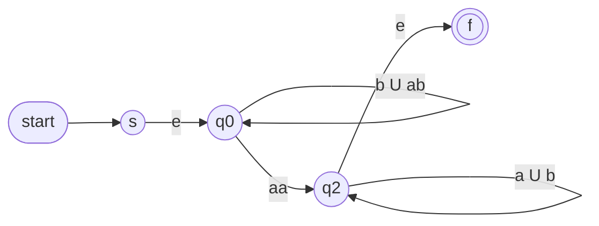

**Step 2: eliminate $q_0$.** Self-loop $\gamma=b\cup ab$. Only path through it: $s\xrightarrow{e}q_0\xrightarrow{aa}q_2$. New edge $s\to q_2$ labelled $e\,(b\cup ab)^*\,aa=(b\cup ab)^*aa$.

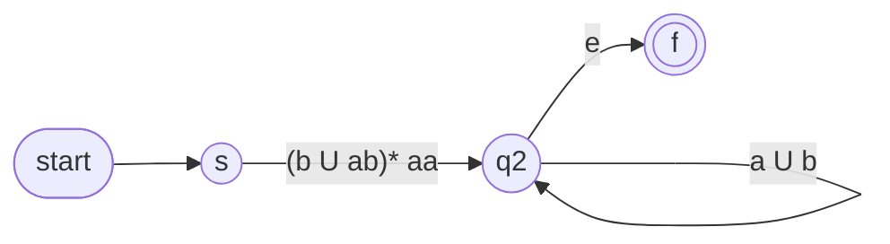

**Step 3: eliminate $q_2$.** Self-loop $\gamma=a\cup b$. Path: $s\xrightarrow{(b\cup ab)^*aa}q_2\xrightarrow{e}f$. New edge $s\to f$ labelled $(b\cup ab)^*\,aa\,(a\cup b)^*\,e$.

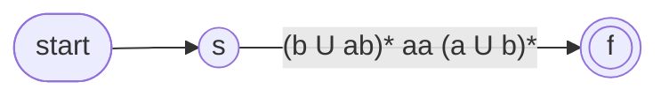

**Answer:**

$$\boxed{(b\cup ab)^*\,aa\,(a\cup b)^*}$$

Reading it: a stretch with no $aa$ in it (blocks $b$ or $ab$), then $aa$, then anything. Exactly "contains $aa$".

### (c) Check

- **$baab$ matches.** Split $b\cdot aa\cdot b$: $b\in(b\cup ab)^*$, then $aa$, then $b\in(a\cup b)^*$. 
- **$abab$ does not match.** Every string in the language has the form $x\,aa\,y$, so it contains the substring $aa$. $abab$ has no two consecutive $a$'s. 

(Also confirms against the DFA: $abab$ goes $q_0\to q_1\to q_0\to q_1\to q_0$, ends in non-final $q_0$.)

---

## Q7. Prefix language

$\text{Pref}(L)=\{w : wy\in L \text{ for some } y\}$.
$F'=\{q : \text{some final state is reachable from } q\}$. Claim: $M'=(K,\Sigma,\Delta,s,F')$ accepts $\text{Pref}(L)$.

### (a) Proof

**Useful fact:** if $(p,u)\vdash^*(p',u')$ then $(p,uv)\vdash^*(p',u'v)$ (extra unread input at the end never affects the steps).

**$L(M')\subseteq\text{Pref}(L)$.** Let $w\in L(M')$: $(s,w)\vdash^*(q,e)$ with $q\in F'$. Since $q\in F'$, there is $y$ with $(q,y)\vdash^*(f,e)$, $f\in F$. Combine:
$$(s,wy)\vdash^*(q,y)\vdash^*(f,e)$$
So $wy\in L$, hence $w\in\text{Pref}(L)$.

**$\text{Pref}(L)\subseteq L(M')$.** Let $w\in\text{Pref}(L)$, so $wy\in L$ for some $y$. Take an accepting computation $(s,wy)\vdash^*(f,e)$. The unread input shrinks one symbol at a time (or stays the same on $e$-moves), so at some point the unread part is **exactly $y$**. Take the first such configuration $(q,y)$. Then:

- $(s,w)\vdash^*(q,e)$: the steps before that point only consumed $w$ (the same steps work if $y$ is not there).
- $(q,y)\vdash^*(f,e)$ with $f\in F$, so $q\in F'$.

Hence $M'$ accepts $w$. ($w=e$ is covered: then $q=s$.) $\blacksquare$

**Intuition:** $w$ is a prefix of an accepted string iff after reading $w$ you are somewhere from which you can still finish in a final state.

### (b) Apply to $M_1$ (from Q2)

$M_1$: $q_0\xrightarrow{b}q_0$, $q_0\xrightarrow{a}q_1$, $q_1\xrightarrow{a}q_1$, $q_1\xrightarrow{b}q_0$. Final $q_1$.

- $q_1\in F$, so $q_1\in F'$.
- $q_0\xrightarrow{a}q_1$, so $q_1$ is reachable from $q_0$, so $q_0\in F'$.

$F'=\{q_0,q_1\}$ = **all states**. So $M_1'$ accepts everything:

$$\text{Pref}(L(M_1))=\Sigma^*$$

In English: every string is a prefix of some string ending in $a$ (just append $a$).

---

## Q8. Reversal

$M^R=(K\cup\{s'\},\Sigma,\Delta^R,s',\{s\})$ where $\Delta^R=\{(p,a,q):(q,a,p)\in\Delta\}\cup\{(s',e,f):f\in F\}$.

In words: **flip every arrow, new start $s'$ with $e$-edges to the old finals, old start becomes the only final.**

### (a) Proof that $L(M^R)=L^R$

Think of a computation as a **path** with labels $x_i\in\Sigma\cup\{e\}$; the string read is the labels joined together.

**$L^R\subseteq L(M^R)$.** Let $w\in L$. There is a path in $M$:
$$s=p_0\xrightarrow{x_1}p_1\xrightarrow{x_2}\cdots\xrightarrow{x_m}p_m=f,\quad f\in F,\ w=x_1x_2\cdots x_m$$
Every edge is flipped in $M^R$, so there is a path
$$s'\xrightarrow{e}p_m\xrightarrow{x_m}p_{m-1}\to\cdots\xrightarrow{x_1}p_0=s$$
It reads $x_m\cdots x_1=w^R$ and ends in $s$, the final state of $M^R$. So $w^R\in L(M^R)$.

**$L(M^R)\subseteq L^R$.** Take an accepting path in $M^R$ reading $u$. $s'$ has no incoming edges (all flipped edges are among $K$), so the path starts with some $s'\xrightarrow{e}f$, $f\in F$, then continues with flipped edges from $f$ to $s$. Flip that remainder back: a path in $M$ from $s$ to $f\in F$ reading $u^R$. So $u^R\in L$, i.e. $u\in L^R$. $\blacksquare$

**Conclusion:** if $L$ is regular, some NFA $M$ accepts it, $M^R$ is an NFA, so $L^R=L(M^R)$ is regular. Regular languages are **closed under reversal**.

**Why $s'$ is needed:** an NFA has one start state but $M$ may have many finals. $s'$ with $e$-edges starts "from all old finals at once".

### (b) $M_1^R$

Flip each edge of $M_1$:

| $M_1$ edge | $M_1^R$ edge |
|---|---|
| $q_0\xrightarrow{b}q_0$ | $q_0\xrightarrow{b}q_0$ |
| $q_0\xrightarrow{a}q_1$ | $q_1\xrightarrow{a}q_0$ |
| $q_1\xrightarrow{a}q_1$ | $q_1\xrightarrow{a}q_1$ |
| $q_1\xrightarrow{b}q_0$ | $q_0\xrightarrow{b}q_1$ |
| (new) | $s'\xrightarrow{e}q_1$ |

Start $s'$. Final $\{q_0\}$ (the old start).

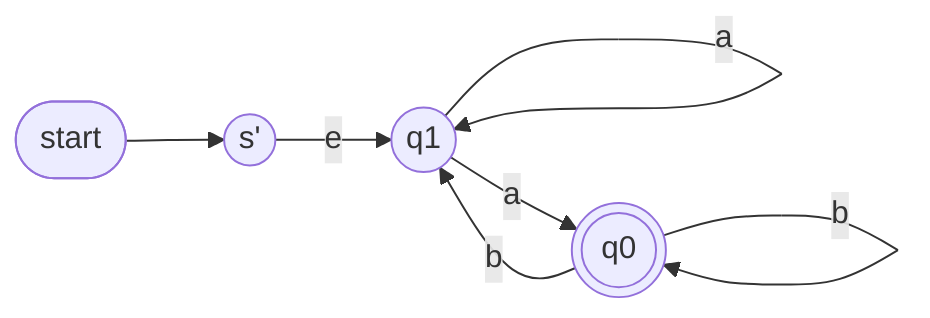

**Language:** $L(M_1)^R$, the reverse of "ends in $a$" is **"starts with $a$"**, so $L(M_1^R)=a\Sigma^*$.

Sanity check by tracing: $s'\to q_1$; the first symbol must be $a$ (only $a$-edges leave $q_1$) and can go to $q_0$ (final); from $q_0$ any $b$'s are fine, and $q_0\xrightarrow{b}q_1\xrightarrow{a}q_0$ handles later $a$'s. A string starting with $b$ is stuck immediately at $q_1$.

### (c) Which approach gives more insight?

My answer: **automaton reversal.**

- **Automaton reversal** shows *why*: a computation is a path from start to a final state, and reading a string backwards is walking the same path backwards. Flip arrows, swap the roles of start and finals, done. The proof is two lines of "reverse the path".
- **Regex reversal** is a purely syntactic rule: $(\alpha\beta)^R=\beta^R\alpha^R$, $(\alpha\cup\beta)^R=\alpha^R\cup\beta^R$, $(\alpha^*)^R=(\alpha^R)^*$. It proves the result by structural induction and is quicker to *compute*, but it tells you nothing about *why* regularity survives.

(This is an opinion-style question. If your tutorial 2 answer argued something different, back it with a reason like the above.)

---

## Cheat-sheet (exam)

| Task | Method |
|---|---|
| Union / concat / star | Use the three NFA constructions; **star needs a new start that is also final** |
| Complement | Only after converting to a **DFA** (swap finals) |
| Intersection | De Morgan: complement of (union of complements) |
| Regex to NFA | Build bottom-up, draw after each operator |
| DFA to regex | New $s$ (no in-edges), new $f$ (no out-edges), merge parallel edges, eliminate states with $\alpha\gamma^*\beta$ |
| Prefix language | Make final every state that can still reach a final state |
| Reversal | Flip all arrows, new start with $e$ to old finals, old start is the sole final |
| Why DFA states group NFA states | $e$-closure **or** multiple transitions on the same symbol |
