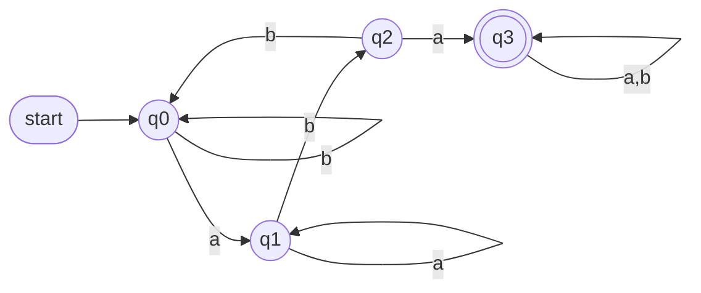
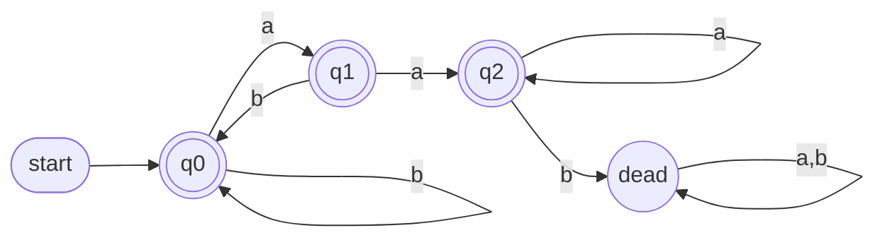
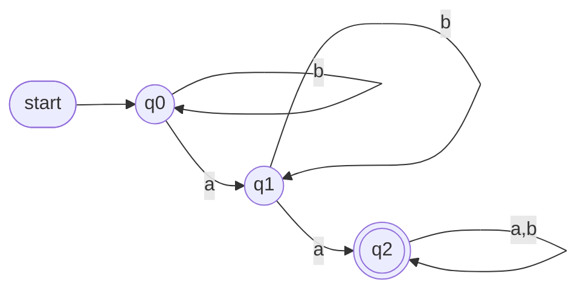
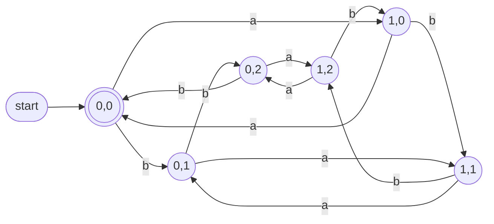
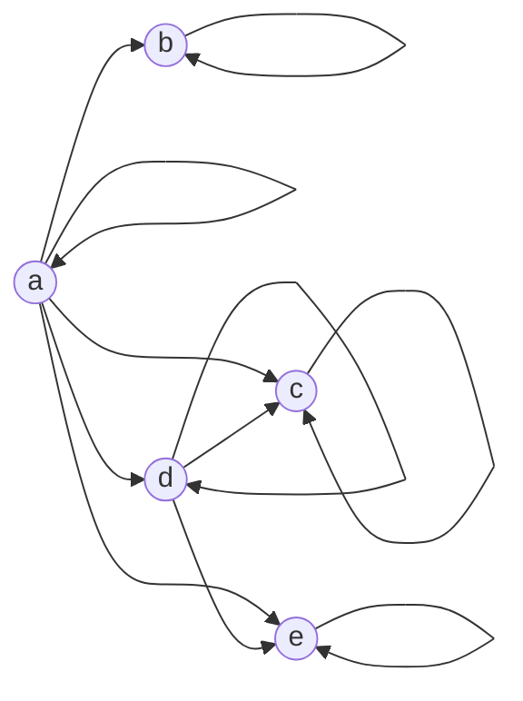

# CS F301 Theory of Computation - Tutorial 1 and 2 Solutions

## Read this first

- $e$ = empty string, $\varnothing$ = empty set, $\Sigma^*$ = all strings over $\Sigma$.
- $L(\alpha)$ = language described by regex $\alpha$.
- **Tutorial 1, Q1:** the PDF lost the symbols ($\in$ vs $\subseteq$). I give the answer for **both** symbols in every row, so you can read off whichever your sheet has.
- **Tutorial 2, Q9:** the DFA figures did not extract (labels come out scrambled). I could not read the arrows reliably, so I give the method plus a template. Q6 I could reconstruct with confidence (its label order matches exactly one DFA). **Verify Q6 against your figure.**
- **Tutorial 1, Q12:** the traversal direction along each diagonal is not recoverable from text. Both versions are given.

---
---

# PART A - Tutorial 2 (Regex and DFAs)

## Q1. Every `a` is immediately followed by `b`

$L = \{w \in \{a,b\}^* : \text{every } a \text{ is immediately followed by } b\}$

So: no `a` at the end, and no `aa`.

### (a) $\alpha = (b \cup ab)^*$

**Why correct:**
- Every string in $L$ can be chopped left to right: each `a` is glued to the `b` after it (block `ab`), every other symbol is a lone `b`. So the string is a concatenation of blocks `b` and `ab`. Hence $L \subseteq L(\alpha)$.
- Every concatenation of blocks `b` and `ab` has each `a` followed by `b`. Hence $L(\alpha) \subseteq L$.
- $e \in L$ (no `a`s at all) and $e \in L(\alpha)$ (zero blocks).

### (b) $\beta = (b^*ab)^*\, b^*$

Idea: cut the string right after each `a b`. Each piece is (some `b`s) then `ab`. Leftover tail is only `b`s.

---

## Q2. Equality and infinitely many regexes

### (a) Prove $L(\alpha) = L(\beta)$

**$L(\beta) \subseteq L(\alpha)$:**
- A piece of $b^*ab$ looks like $b^m ab$ = $m$ blocks of `b` then block `ab`. It is in $(b\cup ab)^*$.
- $b^*$ is also in $(b \cup ab)^*$.
- $L(\alpha)$ is closed under concatenation, so any $(b^*ab)^* b^*$ string is in $L(\alpha)$.

**$L(\alpha) \subseteq L(\beta)$:** take a string made of blocks $x_1 x_2 \dots x_k$, each $x_i \in \{b, ab\}$.
- Every `ab` block, together with the run of `b` blocks right before it (since the previous `ab`), forms $b^m ab \in L(b^*ab)$.
- The `b` blocks after the last `ab` form $b^t \in L(b^*)$.
- So the string is in $(b^*ab)^* b^*$.

Both inclusions hold, so $L(\alpha) = L(\beta)$. (Shortcut: both equal $L$, shown in Q1.)

### (b) Why infinitely many regexes per language

$L(\varnothing) = \varnothing$, so $L(\alpha \cup \varnothing) = L(\alpha)$.
Then $\alpha,\ \alpha\cup\varnothing,\ (\alpha\cup\varnothing)\cup\varnothing,\ \dots$ all represent the same language, and they are different strings (each is longer than the last). So infinitely many.

---

## Q3. Regex identities

Prove by showing both sets are subsets of each other. Key fact: $L(\gamma^*)$ = all concatenations of zero or more strings from $L(\gamma)$ (zero strings gives $e$).

### (a) $\alpha^*\alpha^* = \alpha^*$

- $\supseteq$: $w \in \alpha^*$. Then $w = w\cdot e$ with $e\in\alpha^*$. So $w \in \alpha^*\alpha^*$.
- $\subseteq$: $w = uv$ with $u,v\in\alpha^*$. $u$ is a concatenation of strings of $L(\alpha)$, so is $v$. Joining them is still a concatenation of strings of $L(\alpha)$. So $w \in \alpha^*$.

### (b) $(\alpha\cup\beta)^* = (\alpha^*\beta^*)^*$

- $\subseteq$: $w \in (\alpha\cup\beta)^*$ is a concatenation of pieces, each piece in $L(\alpha)$ or $L(\beta)$.
  - A piece $x\in L(\alpha)$ is $x \cdot e \in \alpha^*\beta^*$.
  - A piece $y\in L(\beta)$ is $e \cdot y\in \alpha^*\beta^*$.
  - So $w$ is a concatenation of strings from $\alpha^*\beta^*$, i.e. $w\in(\alpha^*\beta^*)^*$.
- $\supseteq$: a string in $\alpha^*\beta^*$ is some $\alpha$-pieces followed by some $\beta$-pieces, all of which are in $L(\alpha\cup\beta)$. So it is in $(\alpha\cup\beta)^*$. A concatenation of such strings is again in $(\alpha\cup\beta)^*$.

### (c) $(\alpha\beta)^*\alpha = \alpha(\beta\alpha)^*$

A string on the left is

$$(x_1y_1)(x_2y_2)\cdots(x_ky_k)\,x_{k+1}, \quad x_i\in L(\alpha),\ y_i\in L(\beta)$$

Regroup (just move brackets):

$$x_1\,(y_1x_2)(y_2x_3)\cdots(y_kx_{k+1})$$

That is $\alpha(\beta\alpha)^k$, so it is in the right side. Reading the same regrouping backwards gives the reverse inclusion. ($k=0$ gives just $x_1$ on both sides.)

---

## Q4. Reversal

### (a) Regular $\Rightarrow$ reversal regular: construction

Define $\mathrm{rev}(\alpha)$ by recursion on the regex:

| $\alpha$ | $\mathrm{rev}(\alpha)$ |
|---|---|
| $\varnothing$ | $\varnothing$ |
| $e$ | $e$ |
| $a\in\Sigma$ | $a$ |
| $\alpha_1\cup\alpha_2$ | $\mathrm{rev}(\alpha_1)\cup\mathrm{rev}(\alpha_2)$ |
| $\alpha_1\alpha_2$ | $\mathrm{rev}(\alpha_2)\,\mathrm{rev}(\alpha_1)$ (**order swaps**) |
| $\alpha_1^*$ | $\mathrm{rev}(\alpha_1)^*$ |

So if $L=L(\alpha)$, then $L^R = L(\mathrm{rev}(\alpha))$ is regular (once (b) is proved).

### (b) Proof: $L(\mathrm{rev}(\alpha)) = L(\alpha)^R$ by structural induction

**Base cases:** $\varnothing^R=\varnothing$, $\{e\}^R=\{e\}$, $\{a\}^R=\{a\}$. Matches the table.

**Inductive step.** Assume true for $\alpha_1,\alpha_2$.

- **Union:** $(L_1\cup L_2)^R = L_1^R\cup L_2^R$ (reverse each string, membership unchanged). By IH this is $L(\mathrm{rev}\,\alpha_1)\cup L(\mathrm{rev}\,\alpha_2)$.
- **Concatenation:** $(uv)^R = v^R u^R$. So $(L_1L_2)^R = L_2^R L_1^R$. By IH this is $L(\mathrm{rev}\,\alpha_2)\,L(\mathrm{rev}\,\alpha_1)$.
- **Star:** $w = w_1\cdots w_k$ with each $w_i\in L$. Then $w^R = w_k^R\cdots w_1^R$ with each $w_i^R\in L^R$, so $(L^*)^R\subseteq (L^R)^*$. Same argument backwards gives $\supseteq$. So $(L^*)^R=(L^R)^*$, which by IH is $L(\mathrm{rev}\,\alpha_1)^*$.

Done.

### (c) Apply to $\alpha=(b\cup ab)^*$

$$\mathrm{rev}(\alpha) = \big(\mathrm{rev}(b)\cup\mathrm{rev}(ab)\big)^* = (b \cup ba)^*$$

Meaning: every `a` is immediately **preceded** by `b` (mirror of the original).

---

## Q5. Most languages are not regular

Take $\Sigma=\{a,b\}$.

### (a) Regexes are countable

A regex is a finite string over the finite alphabet $\{a,b,(,),\varnothing,e,\cup,{}^*\}$ (8 symbols).
- Number of strings of length $n$ is at most $8^n$, which is finite.
- All strings = union over $n=0,1,2,\dots$ of finite sets. A countable union of finite sets is countable.
- Concretely: list all strings by length, and within a length alphabetically. Delete non-regexes. That is an enumeration.

Regexes are infinite (e.g. $a, aa, aaa,\dots$) so countably infinite.

### (b) Languages are uncountable

Languages over $\Sigma$ = subsets of $\Sigma^*$ = $2^{\Sigma^*}$. $\Sigma^*$ is countably infinite: $w_1,w_2,w_3,\dots$

**Diagonal argument.** Suppose all languages could be listed $L_1,L_2,L_3,\dots$. Define

$$D=\{w_i : w_i\notin L_i\}$$

$D$ is a language. But for every $i$: $w_i\in D \iff w_i\notin L_i$, so $D\ne L_i$. $D$ is not on the list. Contradiction.

### (c) Most languages are not regex-representable

Map each regex to its language. The set of languages that have some regex is the image of a countable set, so it is countable. The set of all languages is uncountable. So the languages without any regex form an uncountable set: "all but countably many".

---

## Q6. The DFA with states $q_0,q_1,q_2,q_3$

Reading of the figure (the only DFA consistent with the labels in order):

### (a) Full specification $M=(K,\Sigma,\delta,s,F)$

- $K=\{q_0,q_1,q_2,q_3\}$
- $\Sigma=\{a,b\}$
- $s=q_0$
- $F=\{q_3\}$
- $\delta$:

| state | on `a` | on `b` |
|---|---|---|
| $q_0$ | $q_1$ | $q_0$ |
| $q_1$ | $q_1$ | $q_2$ |
| $q_2$ | $q_3$ | $q_0$ |
| $q_3$ | $q_3$ | $q_3$ |

### (b) Computation on `baabab`

$$(q_0,baabab)\vdash(q_0,aabab)\vdash(q_1,abab)\vdash(q_1,bab)\vdash(q_2,ab)\vdash(q_3,b)\vdash(q_3,e)$$

Steps used: $\delta(q_0,b)=q_0$, $\delta(q_0,a)=q_1$, $\delta(q_1,a)=q_1$, $\delta(q_1,b)=q_2$, $\delta(q_2,a)=q_3$, $\delta(q_3,b)=q_3$.
Ends in $(q_3,e)$ with $q_3\in F$, so $baabab\in L(M)$.

### (c) Language

$L(M)$ = all strings over $\{a,b\}$ that **contain `aba` as a substring**.

State meaning: $q_0$ = no useful progress, $q_1$ = last symbol is `a`, $q_2$ = last two symbols are `ab`, $q_3$ = `aba` already seen (stays forever).

### (d) $e\in L(M)\iff s\in F$

**Proof.** A step $\vdash$ always consumes one input symbol. Starting from $(s,e)$ there is no symbol to consume, so the only configuration reachable ($\vdash^*$ includes zero steps) is $(s,e)$ itself.
- If $s\in F$: $(s,e)\vdash^*(s,e)$ with $s\in F$, so $e$ is accepted.
- If $s\notin F$: the only reachable configuration is $(s,e)$, whose state is not final, so $e$ is rejected.

---

## Q7. No substring `aab`

### (a) DFA

Accepting states: $q_0,q_1,q_2$. Rejecting: dead.

### (b) Meaning of states

| state | meaning |
|---|---|
| $q_0$ | `aab` not seen; current string does not end in `a` (or is empty) |
| $q_1$ | `aab` not seen; string ends in exactly one `a` (preceded by `b` or start) |
| $q_2$ | `aab` not seen; string ends in `aa` or more `a`s |
| dead | `aab` has appeared; can never be accepted |

Why $q_2 \xrightarrow{a} q_2$: `aaa` still ends in `aa`. Why $q_2\xrightarrow{b}$ dead: `aa` + `b` = `aab`.

---

## Q8. DFA with $\delta$ given

### (a) Diagram

### (b) Language

$L(M)$ = strings with **at least two `a`s**. ($q_0$ = zero `a`s, $q_1$ = one `a`, $q_2$ = two or more.)

---

## Q9. Describe the language of each DFA

**The figures did not extract, so I cannot give answers I trust. Send me a screenshot of the three figures and I will fill these in.** Meanwhile, the method (works for any DFA):

1. Write the transition table from the diagram (every state needs an `a` and a `b` arrow).
2. Ask what each state *remembers* (last symbol? count mod something? pattern progress?).
3. Find: which states are accepting, any trap state (loops to itself on everything).
4. Test 4-5 short strings (`e`, `a`, `b`, `ab`, `ba`, `aa`, `bb`), and see which are accepted. Guess the rule, then confirm that every transition respects it.

Common patterns to match against:

| what you see | usual language |
|---|---|
| accepting trap reached on a pattern | contains that substring / at least $k$ of a symbol |
| non-accepting trap reached on a pattern | does not contain that substring |
| states cycle on a symbol | count of that symbol mod $n$ |
| accept state = state reached on the last symbol | strings ending in that symbol(s) |

---

## Q10. #`a` even and #`b` multiple of 3

### (a) DFA

Track two counters: $a \bmod 2$ and $b\bmod 3$. State $(i,j)$ = ($\#a \bmod 2$, $\#b \bmod 3$). 6 states.
- Reading `a`: $(i,j)\to(1-i,j)$
- Reading `b`: $(i,j)\to(i,(j+1)\bmod 3)$
- Start $(0,0)$, accepting $(0,0)$.

### (b) Odd `a`s and #`b` $\equiv 1 \pmod 3$

Keep the exact same states and transitions. Only change the accepting set: $F=\{(1,1)\}$ instead of $\{(0,0)\}$. The start state stays $(0,0)$.

Why it works: the states already record both counts, so the condition is just *which* state we want to end in.

---

## Q11. DFAs are countable

### (a) Countably infinite

A DFA is finite data: finite $K$, finite $\Sigma$, a finite table for $\delta$, a start state, a finite $F$. Rename states $1,2,\dots,n$. Then the whole quintuple can be typed as a finite text string over a fixed finite alphabet (digits, commas, braces, parentheses, letters of $\Sigma$).

- So every DFA gives a distinct finite string. Strings over a finite alphabet are countable (Q5a). So DFAs are countable.
- Infinite: for each $n$ there is a DFA with $n$ states (e.g. a chain of $n$ states). So infinitely many.

Hence countably infinite.

### (b) Meaning

The languages accepted by DFAs come from a countable set (one language per DFA), so there are only countably many of them. Since there are uncountably many languages, **most languages are not accepted by any DFA.** This matches Q5 for regexes (regular languages = DFA languages).

---

## Q12. Isomorphic DFAs

### (a) Example

Both DFAs accept "strings ending in `a`".

$M_1=(\{q_0,q_1\},\{a,b\},\delta_1,q_0,\{q_1\})$

| | a | b |
|---|---|---|
| $q_0$ | $q_1$ | $q_0$ |
| $q_1$ | $q_1$ | $q_0$ |

$M_2=(\{r_0,r_1\},\{a,b\},\delta_2,r_0,\{r_1\})$

| | a | b |
|---|---|---|
| $r_0$ | $r_1$ | $r_0$ |
| $r_1$ | $r_1$ | $r_0$ |

$K_1\ne K_2$ (different names). Bijection: $\varphi(q_0)=r_0,\ \varphi(q_1)=r_1$.

Check: $\varphi(s_1)=r_0=s_2$. $\varphi(F_1)=\{r_1\}=F_2$. And $\varphi(\delta_1(q,x))=\delta_2(\varphi(q),x)$ for all 4 entries, e.g. $\varphi(\delta_1(q_0,a))=\varphi(q_1)=r_1=\delta_2(r_0,a)$.

### (b) Same language $\Rightarrow$ isomorphic? **No.**

Isomorphic means a bijection of states, so the state counts must be equal. Take $M_1$ above and $M_3$ = $M_1$ plus an extra unreachable state $q_2$ (any transitions). Same language, 2 vs 3 states, no bijection exists. So not isomorphic.

(Other direction is true: isomorphic DFAs always accept the same language. Also, among *minimal* DFAs, same language does imply isomorphic.)

---

## Q13. Monoids

### (a) $\Sigma^*$ with concatenation

- **Closed:** concatenating two finite strings over $\Sigma$ gives a finite string over $\Sigma$.
- **Associative:** $(uv)w$ and $u(vw)$ are both just $u$, then $v$, then $w$ written one after another: the same sequence of symbols. So equal.
- **Identity:** $e$. $ew=we=w$ because writing nothing before or after changes nothing.

So $(\Sigma^*,\cdot)$ is a monoid.

### (b) Languages with $L_1L_2=\{uv: u\in L_1, v\in L_2\}$

- **Closed:** $L_1L_2$ is a set of strings, so a language.
- **Associative:** $x\in(L_1L_2)L_3 \iff x=(uv)w$ for some $u\in L_1,v\in L_2,w\in L_3$ $\iff x=u(vw)$ (by (a)) $\iff x\in L_1(L_2L_3)$.
- **Identity:** $\{e\}$. $\{e\}L=\{eu:u\in L\}=L$ and $L\{e\}=L$.

**What $\varnothing$ does:** $\varnothing L=\{uv:u\in\varnothing,v\in L\}$. There is no $u$ to pick, so the set is empty. So $\varnothing L=L\varnothing=\varnothing$ for every $L$: it is an **absorbing (zero) element**.

Note: not commutative. $\{a\}\{b\}=\{ab\}\ne\{ba\}=\{b\}\{a\}$.

Do not confuse the two identities: $\{e\}$ is the identity for concatenation, $\varnothing$ is the identity for union.

---
---

# PART B - Tutorial 1 (Sets, relations, closures)

## Q1. True or false

Facts used:
- $\varnothing\subseteq X$ for every set $X$.
- $x\in 2^S \iff x\subseteq S$ (power set = set of all subsets).
- $\varnothing$ has no elements, so $\varnothing\notin\varnothing$.

Let $S=\{a,b,\{a,b\}\}$. Then $2^S$ has 8 elements.

| # | statement | $\in$ | $\subseteq$ |
|---|---|---|---|
| (a), (b) | $\varnothing$ vs $\varnothing$ | **False** (no elements) | **True** |
| (c), (d) | $\varnothing$ vs $\{\varnothing\}$ | **True** (it is the one element) | **True** (empty set is a subset of everything) |
| (e) | $\{a,b\}$ vs $\{a,b,c,\{a,b\}\}$ | **True** (listed as an element) | **True** (both `a` and `b` are elements) |
| (f) | $\{a,b\}$ vs $\{a,b,\{a,b\}\}$ | **True** | **True** |
| (g) | $\{a,b\}$ vs $2^S$ | **True** ($\{a,b\}\subseteq S$) | **False** (needs `a`$\in 2^S$, i.e. `a`$\subseteq S$; `a` is not a subset of $S$) |
| (h) | $\{\{a,b\}\}$ vs $2^S$ | **True** ($\{a,b\}\in S$, so $\{\{a,b\}\}\subseteq S$) | **True** (its only element $\{a,b\}\in 2^S$ by (g)) |

Standard textbook reading: (a) $\subseteq$ T, (b) $\in$ F, (c) $\in$ T, (d) $\subseteq$ T, (e) $\in$ T, (f) $\subseteq$ T, (g) $\subseteq$ F, (h) $\in$ T.

---

## Q2. $R=\{(a,b),(a,c),(c,d),(a,a),(b,a)\}$

**Composition:** $R\circ R=\{(x,z): \exists y,\ (x,y)\in R,\ (y,z)\in R\}$.

Two steps from each start:

| start | first step | then | pairs |
|---|---|---|---|
| $a$ | $b$ | $b\to a$ | $(a,a)$ |
| $a$ | $c$ | $c\to d$ | $(a,d)$ |
| $a$ | $a$ | $a\to b,c,a$ | $(a,b),(a,c),(a,a)$ |
| $b$ | $a$ | $a\to b,c,a$ | $(b,b),(b,c),(b,a)$ |
| $c$ | $d$ | $d$ has no arrow | none |

$$R\circ R=\{(a,a),(a,b),(a,c),(a,d),(b,a),(b,b),(b,c)\}$$

**Inverse (flip every pair):**

$$R^{-1}=\{(b,a),(c,a),(d,c),(a,a),(a,b)\}$$

**Functions?** A relation is a function if each first element has exactly one partner.
- $R$: $a$ maps to $b,c,a$. **Not a function.**
- $R\circ R$: $a$ maps to $a,b,c,d$. **Not a function.**
- $R^{-1}$: $a$ maps to $a$ and $b$. **Not a function.**

---

## Q3. $R=\varnothing\subseteq A\times A$, $A\ne\varnothing$

| property | holds? | reason |
|---|---|---|
| (a) reflexive | **No** | needs $(x,x)\in R$ for every $x\in A$; $A$ is nonempty and $R$ has no pairs |
| (b) symmetric | **Yes** | "if $(x,y)\in R$ then $(y,x)\in R$": no pair exists, so vacuously true |
| (c) antisymmetric | **Yes** | vacuously true, no pairs to violate it |
| (d) transitive | **Yes** | vacuously true |

---

## Q4. Any function from a finite set to itself has a cycle

Let $f:S\to S$, $S$ finite with $n$ elements. Pick any $s_0$ and form the sequence

$$s_0,\ f(s_0),\ f(f(s_0)),\ \dots$$

Look at the first $n+1$ terms. They live in a set of size $n$, so by pigeonhole two are equal: $s_i=s_j$ with $i<j$.

Since $f$ is deterministic, from $s_i$ the same steps repeat: $s_i\to s_{i+1}\to\dots\to s_j=s_i$. So $s_i,s_{i+1},\dots,s_{j-1}$ is a cycle. (If $j=i+1$ it is a fixed point, a cycle of length 1.)

---

## Q5. Two people with the same number of acquaintances

Assume: acquaintance is mutual, and nobody is their own acquaintance. Group of $n\ge2$ people.

Each person has between $0$ and $n-1$ acquaintances: $n$ possible values.

But **0 and $n-1$ cannot both occur**: if someone knows all $n-1$ others, nobody has 0 acquaintances.

So the $n$ people use at most $n-1$ distinct values. By pigeonhole, two people share a value.

---

## Q6. Intersections

**Two countably infinite sets, intersection:**
- Finite (empty): evens $\cap$ odds $=\varnothing$.
- Finite (nonempty): $\{0,-1,-2,\dots\}\cap\{0,1,2,\dots\}=\{0\}$.
- Countably infinite: $\mathbb{N}\cap\mathbb{N}=\mathbb{N}$.

**Two uncountable sets, intersection:**
- Finite: $(-\infty,0]\cap[0,\infty)=\{0\}$.
- Countably infinite: $A=\mathbb{N}\cup(0,1)$ and $B=\mathbb{N}\cup(2,3)$. Both uncountable (contain an interval). $A\cap B=\mathbb{N}$ (intervals are disjoint).
- Uncountable: $\mathbb{R}\cap\mathbb{R}=\mathbb{R}$.

---

## Q7. Closure under operations

### (a) Odd integers under multiplication: **closed**

$(2k+1)(2m+1)=4km+2k+2m+1=2(2km+k+m)+1$, which is odd.

### (b) Positive integers under division: **not closed**

$1\div2=\tfrac12$ is not an integer.

**Closure:** the smallest set containing the positive integers and closed under division is the **positive rationals** $\mathbb{Q}^+=\{p/q: p,q\in\mathbb{Z}^+\}$.
- Every $p/q$ is a division of two integers, so it must be there.
- $\mathbb{Q}^+$ is closed: $\dfrac{p/q}{r/s}=\dfrac{ps}{qr}$ is again positive rational.

---

## Q8. Reflexive transitive closure $R^*$

$R=\{(a,b),(a,c),(a,d),(d,c),(d,e)\}$

**Step 1 - transitive pairs:** follow two-step paths.
- $a\to d\to c$: $(a,c)$ already there.
- $a\to d\to e$: **new** $(a,e)$.

**Step 2 - reflexive pairs:** add $(x,x)$ for all $x\in\{a,b,c,d,e\}$.

$$R^*=\{(a,b),(a,c),(a,d),(a,e),(d,c),(d,e),(a,a),(b,b),(c,c),(d,d),(e,e)\}$$

(11 pairs.)

---

## Q9. Not reflexive, but transitive closure is reflexive

On $A=\{a,b\}$ take $R=\{(a,b),(b,a)\}$.

- Not reflexive: $(a,a)\notin R$.
- Transitive closure: $(a,b),(b,a)\Rightarrow(a,a)$ and $(b,a),(a,b)\Rightarrow(b,b)$. So $R^+=\{(a,a),(a,b),(b,a),(b,b)\}$, which contains $(a,a),(b,b)$: **reflexive**.

Idea: a "round trip" $x\to y\to x$ creates $(x,x)$.

---

## Q10. Kleene star as a closure

$L^*$ is the closure of $L$ under **concatenation**: the smallest language that contains $L$, contains $e$, and is closed under concatenation (joining any two of its strings stays in it).

($e$ is included because $L^*$ allows zero pieces.)

---

## Q11. When is $L^+=L^*-\{e\}$?

**Exactly when $e\notin L$.**

- $L^+$ = concatenations of **one or more** strings of $L$. $L^*$ = concatenations of **zero or more**, so $L^*=L^+\cup\{e\}$.
- If $e\notin L$: every string in $L^+$ is a join of $\ge1$ nonempty strings, so it is nonempty. So $e\notin L^+$ and $L^+=L^*-\{e\}$.
- If $e\in L$: $e\in L^+$ (one piece, namely $e$). Then $L^+\ne L^*-\{e\}$ because the right side has no $e$.

---

## Q12. Bijection $\mathbb{N}\times\mathbb{N}\to\mathbb{N}$ (diagonal counting)

The figure walks the diagonals $i+j=s$ for $s=0,1,2,\dots$ (each diagonal runs between the horizontal and vertical axes). Here $(i,j)$ = (row index, position within row).

- Diagonal $s$ has $s+1$ points.
- All earlier diagonals $0,\dots,s-1$ contain $1+2+\dots+s=\dfrac{s(s+1)}{2}$ points. That is how many numbers are used up before diagonal $s$ starts.

**If you walk each diagonal from the horizontal axis upward (row $i$ increasing):**

$$f(i,j)=\frac{(i+j)(i+j+1)}{2}+i$$

**If you walk it the other way (from the vertical axis down), use $+\,j$ instead of $+\,i$.** Check which way your figure's arrows go, e.g. $(0,0)\mapsto0$ in both.

Examples (version with $+i$): $f(0,0)=0$, $f(0,1)=1$, $f(1,0)=2$, $f(1,2)=6+1=7$.

**Why it is a bijection:** every natural number $n$ lands on exactly one diagonal (the one with $\frac{s(s+1)}2\le n<\frac{(s+1)(s+2)}2$) and one position on it. So each $n$ has exactly one $(i,j)$.

**Inverse:**

$$s=\left\lfloor\frac{\sqrt{8n+1}-1}{2}\right\rfloor,\quad i=n-\frac{s(s+1)}{2},\quad j=s-i$$

---

## Q13. Number of functions $A\to B$ is $\lvert B\rvert^{\lvert A\rvert}$

**Idea:** a function picks one image for each element of $A$, independently. Each element has $\lvert B\rvert$ choices, and there are $\lvert A\rvert$ elements.

**Proof by induction on $k=\lvert A\rvert$.**
- $k=0$: exactly one function (the empty function). $\lvert B\rvert^0=1$. ✓
- Step: assume true for sets of size $k$. Let $\lvert A\rvert=k+1$, write $A=A'\cup\{x\}$ with $\lvert A'\rvert=k$. A function on $A$ is a function on $A'$ ($\lvert B\rvert^k$ ways) together with a value for $x$ ($\lvert B\rvert$ ways). Total $\lvert B\rvert^k\cdot\lvert B\rvert=\lvert B\rvert^{k+1}$. ✓

(Edge case $B=\varnothing$, $A\neq\varnothing$: no functions, and $0^k=0$. ✓)

---

## Q14. Is (transitive closure of symmetric closure of $R$) reflexive?

**No, not necessarily.**

Counterexample: $A=\{a,b,c\}$, $R=\{(a,b)\}$.
- Symmetric closure: $\{(a,b),(b,a)\}$.
- Transitive closure of that: add $(a,a)$ and $(b,b)$. Result $\{(a,b),(b,a),(a,a),(b,b)\}$.
- $(c,c)$ is missing. **Not reflexive.**

**Why:** a pair $(x,x)$ only appears via a round trip $x\to y\to x$. An element $x$ not involved in any pair has no round trip, so it never gets $(x,x)$.

**What is true:** the result is reflexive on every element that appears in at least one pair of $R$ (as $x\to y$, symmetric closure gives $y\to x$, so $(x,x)$ appears). It fails exactly on elements that appear in no pair.
